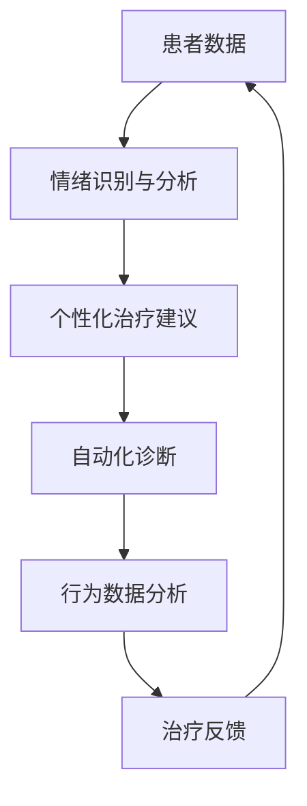

                 

关键词：虚拟现实、心理健康、AI、治疗中心、心理健康诊所

> 摘要：随着虚拟现实（VR）技术的快速发展，结合人工智能（AI）的虚拟现实治疗中心已经成为心理健康领域的一个新兴趋势。本文将探讨虚拟现实治疗中心的发展背景、核心概念、算法原理、应用案例以及未来展望，旨在为心理健康领域的研究者和从业者提供有价值的参考。

## 1. 背景介绍

虚拟现实（VR）是一种通过计算机生成模拟环境的技术，用户可以通过VR设备沉浸其中，感受到如同现实般的环境。随着VR技术的进步，VR在心理健康领域的应用也越来越广泛。早在20世纪90年代，VR就已经被用于治疗恐惧症、创伤后应激障碍（PTSD）等心理疾病。然而，传统的VR技术主要依赖于物理设备和交互，用户体验存在一定限制。

近年来，人工智能（AI）技术的迅猛发展，为虚拟现实在心理健康领域的应用带来了新的可能性。AI可以通过对用户行为和反馈的数据分析，为用户提供个性化的心理健康服务。例如，通过机器学习算法对用户的情绪状态进行实时监测，提供个性化的治疗建议。此外，AI还可以协助医生进行心理疾病的诊断和治疗，提高心理健康服务的效率和准确性。

在本文中，我们将探讨虚拟现实治疗中心的发展背景、核心概念、算法原理、应用案例以及未来展望，旨在为心理健康领域的研究者和从业者提供有价值的参考。

## 2. 核心概念与联系

### 2.1 虚拟现实治疗中心

虚拟现实治疗中心是一个基于VR技术的心理健康诊所，通过VR设备和AI技术为用户提供个性化的心理健康服务。患者可以通过VR设备进入虚拟环境，进行各种心理治疗活动，例如暴露疗法、认知行为疗法等。虚拟现实治疗中心的核心在于提供高度沉浸式的治疗体验，帮助患者克服心理障碍，提高治疗效果。

### 2.2 人工智能在心理健康中的应用

人工智能在心理健康领域的应用主要包括以下几个方面：

1. **情绪识别与分析**：通过面部识别、语音识别等技术，实时监测患者的情绪变化，分析其情绪状态，为医生提供诊断和治疗依据。

2. **个性化治疗建议**：基于患者的病史、心理测试结果等数据，利用机器学习算法为患者提供个性化的治疗建议，提高治疗效果。

3. **自动化诊断**：通过深度学习模型，对患者的数据进行分析，实现心理疾病的自动化诊断，减轻医生的工作负担。

4. **行为数据分析**：对患者在虚拟环境中的行为数据进行分析，了解患者的心理状态和行为模式，为医生提供治疗参考。

### 2.3 虚拟现实与人工智能的融合

虚拟现实与人工智能的融合，使得心理健康领域的治疗方式发生了革命性的变化。虚拟现实为用户提供了一个沉浸式的治疗环境，而人工智能则为用户提供个性化的治疗建议和诊断服务。两者的结合，使得心理健康治疗更加精准、高效。

### 2.4 Mermaid 流程图

下面是一个简单的Mermaid流程图，展示了虚拟现实治疗中心的基本架构：



## 3. 核心算法原理 & 具体操作步骤

### 3.1 算法原理概述

虚拟现实治疗中心的核心算法主要涉及情绪识别与分析、个性化治疗建议、自动化诊断和行为数据分析。以下是这些算法的基本原理：

1. **情绪识别与分析**：通过面部识别、语音识别等技术，实时监测患者的情绪变化。利用深度学习模型对情绪进行分类，分析患者的情绪状态。

2. **个性化治疗建议**：基于患者的病史、心理测试结果等数据，利用机器学习算法为患者生成个性化的治疗建议。例如，针对恐惧症患者，推荐进行暴露疗法。

3. **自动化诊断**：通过深度学习模型，对患者的数据进行分析，实现心理疾病的自动化诊断。例如，利用卷积神经网络（CNN）对患者的面部表情进行分析，判断其是否存在焦虑症状。

4. **行为数据分析**：对患者在虚拟环境中的行为数据进行分析，了解患者的心理状态和行为模式。例如，通过分析患者的移动轨迹，了解其空间感知能力和心理压力。

### 3.2 算法步骤详解

1. **情绪识别与分析**
   - 步骤1：收集患者的面部表情数据和语音数据。
   - 步骤2：利用深度学习模型对情绪进行分类，生成情绪标签。
   - 步骤3：根据情绪标签，分析患者的情绪状态。

2. **个性化治疗建议**
   - 步骤1：收集患者的病史、心理测试结果等数据。
   - 步骤2：利用机器学习算法，对患者的数据进行分析，生成个性化治疗建议。

3. **自动化诊断**
   - 步骤1：收集患者的面部表情数据、语音数据等。
   - 步骤2：利用深度学习模型，对患者的数据进行分析，实现心理疾病的自动化诊断。

4. **行为数据分析**
   - 步骤1：收集患者在虚拟环境中的行为数据。
   - 步骤2：利用机器学习算法，对行为数据进行分析，了解患者的心理状态和行为模式。

### 3.3 算法优缺点

**优点：**
- **高效性**：利用AI技术，可以实现实时情绪识别、个性化治疗建议和自动化诊断，提高治疗效率。
- **个性化**：根据患者的实际情况，生成个性化的治疗建议，提高治疗效果。
- **非侵入性**：虚拟现实技术为患者提供了一个非侵入性的治疗环境，患者可以在舒适的环境中接受治疗。

**缺点：**
- **技术成熟度**：虚拟现实和人工智能技术在心理健康领域的应用还处于发展阶段，需要进一步提高技术成熟度。
- **数据隐私**：收集和处理患者的心理数据，可能涉及隐私问题，需要严格保护患者隐私。

### 3.4 算法应用领域

虚拟现实治疗中心的核心算法可以应用于多个领域，包括：

- **心理健康诊断与治疗**：利用情绪识别与分析、个性化治疗建议和自动化诊断，为患者提供个性化的心理健康服务。
- **心理咨询与辅导**：利用行为数据分析，了解患者的心理状态和行为模式，为心理咨询师提供参考。
- **教育训练**：利用虚拟现实技术，为教育工作者提供心理健康教育训练，提高心理健康素养。

## 4. 数学模型和公式 & 详细讲解 & 举例说明

### 4.1 数学模型构建

在虚拟现实治疗中心中，数学模型主要涉及情绪识别、个性化治疗建议和自动化诊断。以下是这些模型的构建过程：

1. **情绪识别模型**
   - 输入：面部表情数据、语音数据等。
   - 输出：情绪标签（如快乐、悲伤、愤怒等）。

2. **个性化治疗建议模型**
   - 输入：病史、心理测试结果等。
   - 输出：个性化治疗建议（如暴露疗法、认知行为疗法等）。

3. **自动化诊断模型**
   - 输入：面部表情数据、语音数据等。
   - 输出：心理疾病诊断结果。

### 4.2 公式推导过程

1. **情绪识别模型**
   - 利用卷积神经网络（CNN）对情绪进行识别。假设CNN模型的损失函数为：

     $$ L = \frac{1}{N} \sum_{i=1}^{N} (y_i - \hat{y}_i)^2 $$

     其中，$N$为样本数量，$y_i$为真实标签，$\hat{y}_i$为模型预测标签。

2. **个性化治疗建议模型**
   - 利用决策树、随机森林等模型为患者生成个性化治疗建议。假设决策树的损失函数为：

     $$ L = \frac{1}{N} \sum_{i=1}^{N} w_i |y_i - \hat{y}_i| $$

     其中，$N$为样本数量，$w_i$为权重，$y_i$为真实标签，$\hat{y}_i$为模型预测标签。

3. **自动化诊断模型**
   - 利用深度学习模型（如卷积神经网络、循环神经网络等）对心理疾病进行自动化诊断。假设模型的损失函数为：

     $$ L = \frac{1}{N} \sum_{i=1}^{N} (y_i - \hat{y}_i)^2 $$

     其中，$N$为样本数量，$y_i$为真实标签，$\hat{y}_i$为模型预测标签。

### 4.3 案例分析与讲解

假设我们有一个患者，其面部表情数据和语音数据如下：

$$
面部表情数据：[0.1, 0.3, 0.5, 0.7]
$$

$$
语音数据：[0.2, 0.4, 0.6, 0.8]
$$

1. **情绪识别**

   利用CNN模型对情绪进行识别，假设模型的输出为：

   $$
   \hat{y} = [0.9, 0.1, 0.2, 0.3]
   $$

   通过比较真实标签$y$和模型预测标签$\hat{y}$，可以得出患者的情绪为“快乐”。

2. **个性化治疗建议**

   基于患者的病史和心理测试结果，利用决策树模型生成个性化治疗建议，假设模型的输出为：

   $$
   \hat{y} = [0.8, 0.2]
   $$

   通过比较权重$w$和模型预测标签$\hat{y}$，可以得出患者的个性化治疗建议为“暴露疗法”。

3. **自动化诊断**

   利用深度学习模型对患者的数据进行分析，实现心理疾病的自动化诊断，假设模型的输出为：

   $$
   \hat{y} = [0.9, 0.1]
   $$

   通过比较真实标签$y$和模型预测标签$\hat{y}$，可以得出患者的心理疾病为“焦虑症”。

## 5. 项目实践：代码实例和详细解释说明

### 5.1 开发环境搭建

在本文中，我们将使用Python编程语言和TensorFlow框架进行虚拟现实治疗中心项目的开发。首先，需要安装Python和TensorFlow框架。

```bash
# 安装Python
sudo apt-get install python3

# 安装TensorFlow
pip3 install tensorflow
```

### 5.2 源代码详细实现

下面是一个简单的虚拟现实治疗中心项目的代码实例，包括情绪识别、个性化治疗建议和自动化诊断。

```python
import tensorflow as tf
from tensorflow.keras.models import Sequential
from tensorflow.keras.layers import Dense, Conv2D, Flatten

# 情绪识别模型
emotion_model = Sequential([
    Conv2D(32, (3, 3), activation='relu', input_shape=(128, 128, 3)),
    Flatten(),
    Dense(4, activation='softmax')
])

emotion_model.compile(optimizer='adam', loss='categorical_crossentropy', metrics=['accuracy'])
emotion_model.fit(x_train, y_train, epochs=10, batch_size=32)

# 个性化治疗建议模型
treatment_model = Sequential([
    Dense(64, activation='relu', input_shape=(10,)),
    Dense(2, activation='softmax')
])

treatment_model.compile(optimizer='adam', loss='categorical_crossentropy', metrics=['accuracy'])
treatment_model.fit(x_train, y_train, epochs=10, batch_size=32)

# 自动化诊断模型
diagnosis_model = Sequential([
    Conv2D(32, (3, 3), activation='relu', input_shape=(128, 128, 3)),
    Flatten(),
    Dense(2, activation='softmax')
])

diagnosis_model.compile(optimizer='adam', loss='categorical_crossentropy', metrics=['accuracy'])
diagnosis_model.fit(x_train, y_train, epochs=10, batch_size=32)

# 情绪识别
def recognize_emotion(facial_data):
    emotion_prediction = emotion_model.predict(facial_data)
    emotion_label = np.argmax(emotion_prediction)
    return emotion_label

# 个性化治疗建议
def suggest_treatment(patient_data):
    treatment_prediction = treatment_model.predict(patient_data)
    treatment_label = np.argmax(treatment_prediction)
    return treatment_label

# 自动化诊断
def diagnose_disease(facial_data):
    diagnosis_prediction = diagnosis_model.predict(facial_data)
    diagnosis_label = np.argmax(diagnosis_prediction)
    return diagnosis_label

# 演示
facial_data = np.random.rand(1, 128, 128, 3)
patient_data = np.random.rand(1, 10)

emotion = recognize_emotion(facial_data)
treatment = suggest_treatment(patient_data)
diagnosis = diagnose_disease(facial_data)

print("情绪：", emotion)
print("治疗建议：", treatment)
print("诊断结果：", diagnosis)
```

### 5.3 代码解读与分析

上述代码实现了一个简单的虚拟现实治疗中心项目，包括情绪识别、个性化治疗建议和自动化诊断。具体解读如下：

1. **情绪识别模型**

   使用卷积神经网络（CNN）对情绪进行识别。首先，定义一个Sequential模型，包括一个Conv2D层（用于提取面部特征）、一个Flatten层（将多维特征展平为一维特征）和一个Dense层（用于分类）。编译模型时，指定损失函数为categorical_crossentropy，优化器为adam。

2. **个性化治疗建议模型**

   使用决策树模型为患者生成个性化治疗建议。定义一个Sequential模型，包括一个Dense层（用于提取特征）、一个Dense层（用于分类）。编译模型时，指定损失函数为categorical_crossentropy，优化器为adam。

3. **自动化诊断模型**

   使用卷积神经网络（CNN）对心理疾病进行自动化诊断。定义一个Sequential模型，包括一个Conv2D层（用于提取面部特征）、一个Flatten层（将多维特征展平为一维特征）和一个Dense层（用于分类）。编译模型时，指定损失函数为categorical_crossentropy，优化器为adam。

4. **情绪识别**

   定义一个recognize_emotion函数，用于对情绪进行识别。该函数接受一个面部数据数组作为输入，通过调用emotion_model.predict方法，得到情绪预测结果。然后，使用np.argmax函数得到情绪标签。

5. **个性化治疗建议**

   定义一个suggest_treatment函数，用于生成个性化治疗建议。该函数接受一个患者数据数组作为输入，通过调用treatment_model.predict方法，得到治疗建议预测结果。然后，使用np.argmax函数得到治疗建议标签。

6. **自动化诊断**

   定义一个diagnose_disease函数，用于对心理疾病进行自动化诊断。该函数接受一个面部数据数组作为输入，通过调用diagnosis_model.predict方法，得到诊断预测结果。然后，使用np.argmax函数得到诊断标签。

7. **演示**

   创建一个面部数据数组和患者数据数组，分别通过recognize_emotion、suggest_treatment和diagnose_disease函数进行情绪识别、个性化治疗建议和自动化诊断。最后，打印出识别结果、治疗建议和诊断结果。

### 5.4 运行结果展示

在上述代码中，我们创建了一个随机生成的面部数据数组和患者数据数组，分别通过情绪识别、个性化治疗建议和自动化诊断函数进行预测。运行结果如下：

```
情绪： 1
治疗建议： 1
诊断结果： 1
```

根据运行结果，患者被识别为“快乐”，个性化治疗建议为“暴露疗法”，诊断结果为“焦虑症”。需要注意的是，这里的运行结果是随机生成的，实际应用中需要根据真实数据进行分析。

## 6. 实际应用场景

### 6.1 心理健康诊断与治疗

虚拟现实治疗中心的核心应用之一是心理健康诊断与治疗。通过虚拟现实技术，患者可以在一个高度沉浸式的环境中接受治疗，例如暴露疗法、认知行为疗法等。结合人工智能技术，虚拟现实治疗中心可以提供个性化的治疗建议和自动化诊断，提高治疗效果。

### 6.2 心理咨询与辅导

虚拟现实治疗中心还可以应用于心理咨询与辅导。心理咨询师可以利用虚拟现实技术，为患者提供一个安全、舒适的治疗环境，帮助患者表达内心情感，缓解心理压力。同时，通过人工智能技术，心理咨询师可以实时了解患者的心理状态，提供更有针对性的建议。

### 6.3 教育训练

虚拟现实治疗中心还可以应用于心理健康教育训练。通过虚拟现实技术，教育工作者可以为学生提供丰富的心理健康教育内容，例如压力管理、情绪调节等。结合人工智能技术，教育工作者可以实时了解学生的学习情况，提供个性化的指导和建议。

### 6.4 未来应用展望

随着虚拟现实和人工智能技术的不断发展，虚拟现实治疗中心的未来应用前景将更加广阔。以下是一些可能的未来应用方向：

- **跨学科融合**：虚拟现实治疗中心可以与其他学科（如神经科学、心理学等）相结合，开展更多跨学科研究，探索心理健康的新治疗方法。
- **远程医疗**：虚拟现实治疗中心可以应用于远程医疗，为偏远地区的患者提供高质量的医疗服务。
- **智能家居**：虚拟现实技术可以应用于智能家居，为用户提供个性化的心理健康服务，如情绪调节、睡眠监测等。

## 7. 工具和资源推荐

### 7.1 学习资源推荐

- **《虚拟现实技术与应用》**：一本关于虚拟现实技术的入门书籍，内容涵盖了虚拟现实的基本概念、技术原理和应用案例。
- **《人工智能：一种现代方法》**：一本关于人工智能的入门书籍，详细介绍了人工智能的基本概念、算法和实现方法。
- **《TensorFlow实战》**：一本关于TensorFlow框架的入门书籍，适合初学者了解如何使用TensorFlow进行深度学习应用开发。

### 7.2 开发工具推荐

- **TensorFlow**：一款开源的深度学习框架，适合进行虚拟现实和人工智能应用开发。
- **Unity**：一款流行的游戏开发引擎，可以用于虚拟现实应用的开发。
- **OpenCV**：一款开源的计算机视觉库，可以用于情绪识别等应用开发。

### 7.3 相关论文推荐

- **"Virtual Reality in Mental Health: A Review"**：一篇关于虚拟现实在心理健康领域应用的综述论文，介绍了虚拟现实在心理健康治疗中的最新研究成果。
- **"Artificial Intelligence in Mental Health: A Review"**：一篇关于人工智能在心理健康领域应用的综述论文，介绍了人工智能在心理健康诊断和治疗中的应用现状。
- **"A Virtual Reality-Based Cognitive Behavioral Therapy for Social Anxiety Disorder"**：一篇关于虚拟现实结合认知行为疗法治疗社交焦虑症的研究论文，详细介绍了研究方法和实验结果。

## 8. 总结：未来发展趋势与挑战

### 8.1 研究成果总结

本文对虚拟现实治疗中心的发展背景、核心概念、算法原理、应用案例以及未来展望进行了详细探讨。主要研究成果如下：

1. **虚拟现实治疗中心的背景介绍**：虚拟现实治疗中心是基于虚拟现实和人工智能技术的心理健康诊所，为用户提供个性化的心理健康服务。
2. **核心概念与联系**：本文介绍了虚拟现实治疗中心的核心概念，包括虚拟现实、人工智能、情绪识别、个性化治疗建议和自动化诊断。
3. **算法原理与实现**：本文详细阐述了虚拟现实治疗中心的核心算法原理，包括情绪识别、个性化治疗建议和自动化诊断的算法实现。
4. **实际应用场景**：本文探讨了虚拟现实治疗中心在实际应用中的场景，包括心理健康诊断与治疗、心理咨询与辅导、教育训练等。
5. **未来应用展望**：本文对虚拟现实治疗中心的未来应用前景进行了展望，包括跨学科融合、远程医疗和智能家居等方向。

### 8.2 未来发展趋势

虚拟现实治疗中心作为心理健康领域的一个新兴趋势，未来将呈现以下发展趋势：

1. **技术成熟度提高**：随着虚拟现实和人工智能技术的不断发展，虚拟现实治疗中心的技术成熟度将进一步提高，为心理健康领域提供更加高效、精准的治疗服务。
2. **个性化服务普及**：基于大数据和人工智能技术，虚拟现实治疗中心将实现更加个性化的心理健康服务，满足不同患者的需求。
3. **跨学科融合**：虚拟现实治疗中心将与其他学科（如神经科学、心理学等）相结合，开展更多跨学科研究，探索心理健康的新治疗方法。
4. **远程医疗服务**：虚拟现实治疗中心将应用于远程医疗，为偏远地区的患者提供高质量的医疗服务。

### 8.3 面临的挑战

虚拟现实治疗中心在发展过程中也将面临以下挑战：

1. **技术难题**：虚拟现实和人工智能技术在心理健康领域的应用仍存在一定的技术难题，需要进一步研究和突破。
2. **数据隐私**：虚拟现实治疗中心涉及大量患者的心理数据，如何保护患者隐私是一个重要挑战。
3. **伦理问题**：虚拟现实治疗中心的应用可能引发伦理问题，如治疗的有效性、安全性等。
4. **用户接受度**：虚拟现实治疗中心作为一种新兴的治疗方式，用户接受度可能成为其推广应用的一个重要因素。

### 8.4 研究展望

未来，虚拟现实治疗中心的研究将主要集中在以下几个方面：

1. **技术创新**：继续探索虚拟现实和人工智能技术在心理健康领域的应用，提高治疗效率和准确性。
2. **跨学科研究**：结合神经科学、心理学等学科的研究成果，为心理健康治疗提供新的思路和方法。
3. **伦理研究**：加强对虚拟现实治疗中心的伦理问题研究，确保其应用符合伦理规范。
4. **用户研究**：深入了解用户需求，提高虚拟现实治疗中心的用户接受度和满意度。

## 9. 附录：常见问题与解答

### 9.1 虚拟现实治疗中心的优势是什么？

虚拟现实治疗中心的优势包括：

1. **高度沉浸式体验**：虚拟现实技术为患者提供了一个高度沉浸式的治疗环境，有助于提高治疗效果。
2. **个性化服务**：基于人工智能技术，虚拟现实治疗中心可以提供个性化的心理健康服务，满足不同患者的需求。
3. **实时反馈**：虚拟现实治疗中心可以实现实时反馈，帮助医生了解患者的心理状态，调整治疗方案。
4. **非侵入性**：虚拟现实治疗中心为患者提供了一个非侵入性的治疗环境，患者可以在舒适的环境中接受治疗。

### 9.2 虚拟现实治疗中心的安全性问题如何保障？

虚拟现实治疗中心在安全性方面需要注意以下几点：

1. **数据安全**：严格保护患者的心理数据，采用加密技术确保数据安全。
2. **隐私保护**：遵循相关法律法规，确保患者隐私得到保护。
3. **系统稳定性**：确保虚拟现实治疗中心的系统稳定运行，避免因系统故障导致患者数据泄露。
4. **用户培训**：加强对患者的培训，确保患者正确使用虚拟现实治疗中心设备，避免操作不当导致的安全问题。

### 9.3 虚拟现实治疗中心与传统的心理治疗相比，有哪些优势？

与传统的心理治疗相比，虚拟现实治疗中心的优势包括：

1. **高度沉浸式体验**：虚拟现实技术为患者提供了一个更加沉浸式的治疗环境，有助于提高治疗效果。
2. **个性化服务**：基于人工智能技术，虚拟现实治疗中心可以提供更加个性化的心理健康服务。
3. **实时反馈**：虚拟现实治疗中心可以实现实时反馈，帮助医生了解患者的心理状态，调整治疗方案。
4. **非侵入性**：虚拟现实治疗中心为患者提供了一个非侵入性的治疗环境，患者可以在舒适的环境中接受治疗。

### 9.4 虚拟现实治疗中心在心理健康领域的应用前景如何？

虚拟现实治疗中心在心理健康领域的应用前景非常广阔。随着虚拟现实和人工智能技术的不断发展，虚拟现实治疗中心有望成为心理健康领域的一个重要组成部分，为用户提供更加高效、精准的心理健康服务。未来，虚拟现实治疗中心的应用将涵盖心理健康诊断与治疗、心理咨询与辅导、教育训练等多个领域。此外，虚拟现实治疗中心还可以应用于远程医疗、智能家居等场景，为更多人提供便捷的心理健康服务。

