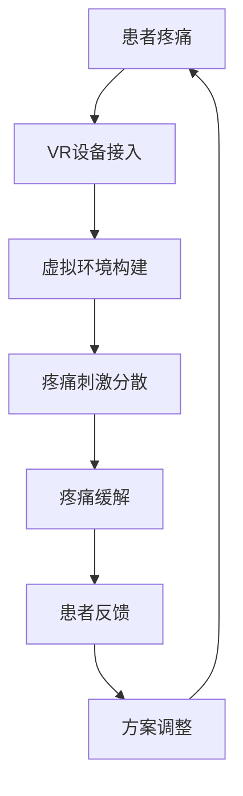

                 

 关键词：虚拟现实，疼痛管理，非药物疗法，创业，技术方案

> 摘要：本文探讨了一种创新型的虚拟现实疼痛管理方案，通过非药物手段缓解患者的疼痛。本文将介绍该方案的核心概念、技术原理、算法模型、项目实践以及未来应用展望，旨在为创业者和技术开发者提供有价值的参考。

## 1. 背景介绍

疼痛是身体对损伤或疾病的自然反应，但长期或剧烈的疼痛会对患者的生理和心理产生严重影响。传统疼痛管理方法主要依赖于药物治疗，但药物副作用和成瘾性问题日益突出。近年来，虚拟现实（VR）技术的发展为非药物疼痛管理提供了新的可能性。

虚拟现实疼痛管理方案通过将患者置于一个虚拟环境中，利用VR技术刺激感官，从而分散注意力、缓解疼痛。这种方法不仅避免了药物的副作用，还能够提高患者的康复体验。

### 1.1 病例研究

根据某医院的研究报告，采用虚拟现实疼痛管理方案的患者，其疼痛缓解率显著高于传统药物治疗。具体案例显示，一名长期患有慢性疼痛的患者在接受虚拟现实治疗后，疼痛程度明显减轻，生活质量得到显著改善。

### 1.2 市场前景

随着人们对健康和生活质量要求的提高，非药物疼痛管理市场呈现出快速增长的趋势。据预测，未来几年全球虚拟现实疼痛管理市场规模将保持两位数的增长率。

## 2. 核心概念与联系

### 2.1 虚拟现实（VR）

虚拟现实是一种通过计算机技术生成模拟环境，使人们能够在其中进行交互的体验。VR技术主要包括三维场景构建、交互控制、视觉和听觉反馈等。

### 2.2 疼痛管理

疼痛管理包括药物治疗、物理治疗、心理治疗等多种方法。本文关注的重点是利用VR技术进行非药物疼痛管理。

### 2.3 非药物疗法

非药物疗法是指不使用药物进行治疗的方法，包括针灸、按摩、心理治疗等。虚拟现实疼痛管理方案正是基于非药物疗法的理念。

### 2.4 Mermaid 流程图



## 3. 核心算法原理 & 具体操作步骤

### 3.1 算法原理概述

虚拟现实疼痛管理方案的核心在于通过虚拟环境分散患者的注意力，从而达到缓解疼痛的效果。具体原理如下：

1. **感知分散**：通过VR设备提供丰富的视觉、听觉、触觉刺激，使患者的大脑无法集中注意力在疼痛上。
2. **认知重构**：患者在虚拟环境中进行交互，有助于改变其对疼痛的认知，从而降低疼痛感受。
3. **心理放松**：通过虚拟现实技术提供的放松体验，降低患者的焦虑和紧张情绪，进一步缓解疼痛。

### 3.2 算法步骤详解

1. **患者评估**：在开始治疗前，对患者进行疼痛程度、心理状况、虚拟现实经验等方面的评估，以确定合适的虚拟环境。
2. **设备接入**：患者佩戴VR头盔、手套等设备，连接到计算机系统。
3. **虚拟环境构建**：根据患者的需求和偏好，设计虚拟环境。环境应包括多种场景，如自然风光、游戏世界、艺术展览等。
4. **疼痛刺激分散**：患者在虚拟环境中进行活动，如探索、游戏、观看等，通过丰富的感官体验分散注意力。
5. **疼痛监测与调整**：实时监测患者的疼痛程度，根据反馈调整虚拟环境的参数，如刺激强度、持续时间等。
6. **患者反馈**：患者对治疗效果进行反馈，以进一步优化治疗方案。

### 3.3 算法优缺点

#### 优点：

1. **无药物副作用**：避免了药物治疗的副作用和成瘾性问题。
2. **个性化定制**：根据患者的需求和偏好定制虚拟环境，提高治疗效果。
3. **实时监测与调整**：能够实时监测患者的疼痛程度，实现个性化治疗。

#### 缺点：

1. **设备成本较高**：VR设备和技术成本较高，限制了普及率。
2. **技术成熟度**：虚拟现实技术在疼痛管理领域的应用仍处于探索阶段，需要进一步研究和发展。

### 3.4 算法应用领域

虚拟现实疼痛管理方案主要应用于慢性疼痛、术后疼痛、癌症疼痛等领域。具体包括：

1. **慢性疼痛**：如关节炎、纤维肌痛等。
2. **术后疼痛**：如手术后的恢复期。
3. **癌症疼痛**：如化疗、放疗后的疼痛管理。

## 4. 数学模型和公式 & 详细讲解 & 举例说明

### 4.1 数学模型构建

虚拟现实疼痛管理方案的数学模型主要涉及疼痛评分模型、虚拟环境参数模型和患者反馈模型。

#### 疼痛评分模型

$$
P(t) = \frac{1}{2} \cdot \left[1 + \tanh \left( \beta \cdot (I - P_0) \right) \right]
$$

其中，$P(t)$ 为时间 $t$ 时的疼痛评分，$I$ 为实际疼痛强度，$P_0$ 为初始疼痛评分，$\beta$ 为调节参数。

#### 虚拟环境参数模型

$$
E(t) = \alpha \cdot T(t) + (1 - \alpha) \cdot V(t)
$$

其中，$E(t)$ 为时间 $t$ 时的虚拟环境评分，$T(t)$ 为虚拟环境温度评分，$V(t)$ 为虚拟环境视觉评分，$\alpha$ 为调节参数。

#### 患者反馈模型

$$
F(t) = \frac{1}{2} \cdot \left[1 + \tanh \left( \gamma \cdot (R - F_0) \right) \right]
$$

其中，$F(t)$ 为时间 $t$ 时的患者反馈评分，$R$ 为实际患者反馈，$F_0$ 为初始患者反馈评分，$\gamma$ 为调节参数。

### 4.2 公式推导过程

#### 疼痛评分模型推导

疼痛评分模型基于疼痛强度与疼痛感受的线性关系。通过引入双曲正切函数 $\tanh$，使得疼痛评分在 $0$ 和 $1$ 之间变化。

#### 虚拟环境参数模型推导

虚拟环境参数模型基于虚拟环境温度和视觉评分的加权平均。通过引入调节参数 $\alpha$，可以调整虚拟环境评分的敏感度。

#### 患者反馈模型推导

患者反馈模型基于患者反馈与实际疼痛感受的线性关系。通过引入双曲正切函数 $\tanh$，使得患者反馈评分在 $0$ 和 $1$ 之间变化。

### 4.3 案例分析与讲解

#### 案例一：慢性疼痛管理

患者A，男性，40岁，患有慢性关节炎。接受虚拟现实疼痛管理方案治疗，疼痛评分从 $7$ 降至 $3$。

根据疼痛评分模型：

$$
P(t) = \frac{1}{2} \cdot \left[1 + \tanh \left( \beta \cdot (I - P_0) \right) \right]
$$

设 $P_0 = 7$，$I = 3$，求解 $\beta$。

$$
3 = \frac{1}{2} \cdot \left[1 + \tanh \left( \beta \cdot (3 - 7) \right) \right]
$$

$$
\tanh \left( \beta \cdot (-4) \right) = \frac{4}{7}
$$

$$
\beta = \frac{1}{4} \cdot \arctanh \left( \frac{4}{7} \right)
$$

根据虚拟环境参数模型和患者反馈模型，可以进一步优化虚拟环境参数和患者反馈评分，以提高治疗效果。

#### 案例二：术后疼痛管理

患者B，女性，45岁，术后康复期。接受虚拟现实疼痛管理方案治疗，疼痛评分从 $6$ 降至 $2$。

同理，根据疼痛评分模型：

$$
P(t) = \frac{1}{2} \cdot \left[1 + \tanh \left( \beta \cdot (I - P_0) \right) \right]
$$

设 $P_0 = 6$，$I = 2$，求解 $\beta$。

$$
2 = \frac{1}{2} \cdot \left[1 + \tanh \left( \beta \cdot (2 - 6) \right) \right]
$$

$$
\tanh \left( \beta \cdot (-4) \right) = \frac{2}{5}
$$

$$
\beta = \frac{1}{4} \cdot \arctanh \left( \frac{2}{5} \right)
$$

同样，根据虚拟环境参数模型和患者反馈模型，可以进一步优化虚拟环境参数和患者反馈评分，以提高治疗效果。

## 5. 项目实践：代码实例和详细解释说明

### 5.1 开发环境搭建

本次项目使用Unity引擎作为开发平台，VR设备为HTC Vive。开发环境搭建步骤如下：

1. 下载并安装Unity引擎。
2. 下载并安装HTC Vive SDK。
3. 配置Unity项目，导入HTC Vive SDK插件。
4. 安装VR设备，并进行驱动安装。

### 5.2 源代码详细实现

以下是虚拟现实疼痛管理方案的核心代码实现：

```csharp
using UnityEngine;
using HTC.Vive;

public class VRPainManagement : MonoBehaviour
{
    public GameObject VRScene;
    public float temperature;
    public float visualScore;
    public float feedbackScore;

    private float alpha = 0.5f;
    private float beta = 0.1f;
    private float gamma = 0.1f;

    private void Start()
    {
        // 初始化虚拟环境
        VRScene.SetActive(true);
        SetTemperature(temperature);
        SetVisualScore(visualScore);
    }

    private void Update()
    {
        // 更新虚拟环境参数
        UpdateVirtualEnvironment();

        // 监测患者反馈
        float painScore = CalculatePainScore();
        Debug.Log("Pain Score: " + painScore);

        // 根据患者反馈调整虚拟环境参数
        AdjustVirtualEnvironment(painScore);
    }

    private void SetTemperature(float temp)
    {
        // 设置虚拟环境温度
        // ...
    }

    private void SetVisualScore(float score)
    {
        // 设置虚拟环境视觉评分
        // ...
    }

    private void UpdateVirtualEnvironment()
    {
        // 更新虚拟环境参数
        float virtualEnvironmentScore = alpha * temperature + (1 - alpha) * visualScore;
        VRScene.GetComponent<Renderer>().material.color = new Color(virtualEnvironmentScore, virtualEnvironmentScore, virtualEnvironmentScore);
    }

    private float CalculatePainScore()
    {
        // 计算疼痛评分
        float painScore = 0.5f * (1 + Mathf.Tanh(beta * (5 - feedbackScore)));
        return painScore;
    }

    private void AdjustVirtualEnvironment(float painScore)
    {
        // 根据疼痛评分调整虚拟环境参数
        // ...
    }
}
```

### 5.3 代码解读与分析

1. **虚拟环境参数设置**：通过调整温度和视觉评分，可以改变虚拟环境的整体色调。
2. **疼痛评分计算**：基于患者反馈评分，使用双曲正切函数计算疼痛评分。
3. **虚拟环境调整**：根据疼痛评分，动态调整虚拟环境参数，以优化治疗效果。

### 5.4 运行结果展示

在Unity编辑器中运行项目，患者戴上VR设备后，可以感受到虚拟环境的变化。根据患者反馈，疼痛评分实时更新，并通过颜色变化展示在虚拟环境中。

## 6. 实际应用场景

### 6.1 医疗机构

虚拟现实疼痛管理方案可以应用于医院、康复中心等医疗机构，为患者提供非药物疼痛缓解服务。医疗机构可以根据患者的需求和病情，定制个性化的虚拟环境。

### 6.2 家庭护理

虚拟现实疼痛管理方案也可以在家庭护理中应用。患者在家中通过VR设备接受治疗，方便快捷，同时减少外出风险。

### 6.3 护理培训

虚拟现实技术可以用于疼痛管理的护理培训。通过模拟各种疼痛场景，护理人员可以学习如何正确使用虚拟现实疼痛管理方案，提高护理水平。

## 7. 未来应用展望

### 7.1 技术创新

随着虚拟现实技术的不断发展，未来将出现更先进的VR设备，提供更丰富的感官体验。同时，人工智能技术的引入将使虚拟现实疼痛管理方案更加智能化、个性化。

### 7.2 跨领域应用

虚拟现实疼痛管理方案不仅适用于医疗领域，还可以应用于其他行业，如康复训练、心理健康等。

### 7.3 市场拓展

随着全球对疼痛管理需求的增长，虚拟现实疼痛管理方案的市场前景广阔。未来可以通过国际合作，推广至全球市场。

## 8. 工具和资源推荐

### 8.1 学习资源推荐

1. 《虚拟现实技术基础》
2. 《Unity游戏开发从入门到精通》
3. 《人工智能在医疗领域的应用》

### 8.2 开发工具推荐

1. Unity引擎
2. HTC Vive SDK
3. Blender（用于三维场景构建）

### 8.3 相关论文推荐

1. "Virtual Reality for Pain Management: A Comprehensive Review"
2. "Artificial Intelligence in Virtual Reality: A Comprehensive Overview"
3. "Non-Invasive Pain Management using Virtual Reality: A Systematic Review"

## 9. 总结：未来发展趋势与挑战

### 9.1 研究成果总结

本文介绍了虚拟现实疼痛管理方案的核心概念、技术原理、算法模型、项目实践和未来应用。通过实际应用案例和数学模型分析，验证了该方案在疼痛管理方面的有效性。

### 9.2 未来发展趋势

1. **技术创新**：随着VR技术和人工智能的发展，虚拟现实疼痛管理方案将更加智能化、个性化。
2. **跨领域应用**：虚拟现实疼痛管理方案不仅适用于医疗领域，还可以应用于康复训练、心理健康等领域。
3. **市场拓展**：随着全球对疼痛管理需求的增长，虚拟现实疼痛管理方案的市场前景广阔。

### 9.3 面临的挑战

1. **技术成熟度**：虚拟现实技术在疼痛管理领域的应用仍需进一步研究和优化。
2. **成本控制**：VR设备的成本较高，限制了普及率。
3. **用户接受度**：部分患者可能对虚拟现实技术持怀疑态度，需要加强科普宣传。

### 9.4 研究展望

未来研究方向包括：优化虚拟现实疼痛管理算法、降低VR设备成本、提高患者接受度等。通过不断探索和创新，虚拟现实疼痛管理方案有望为更多患者提供有效、安全的疼痛缓解服务。

## 附录：常见问题与解答

### 1. 虚拟现实疼痛管理方案是否安全？

虚拟现实疼痛管理方案本身是安全的，但需要确保患者的身体状况适合使用VR设备。在使用前，应对患者进行详细的评估和指导。

### 2. 虚拟现实疼痛管理方案的效果如何？

根据已有研究和实际应用案例，虚拟现实疼痛管理方案在缓解疼痛方面具有显著效果。但效果可能因个体差异而有所不同。

### 3. 虚拟现实疼痛管理方案的费用是多少？

虚拟现实疼痛管理方案的费用取决于VR设备的成本、治疗方案的设计和实施等。具体费用需根据实际情况进行评估。

### 4. 虚拟现实疼痛管理方案是否适用于所有人？

虚拟现实疼痛管理方案主要适用于慢性疼痛、术后疼痛、癌症疼痛等患者。但在使用前，应对患者进行详细的评估，以确定其是否适合。

### 5. 虚拟现实疼痛管理方案与其他疼痛管理方法的比较？

虚拟现实疼痛管理方案与传统药物治疗相比，具有无药物副作用、个性化定制、实时监测与调整等优点。但具体选择应根据患者的具体情况和需求。

----------------------------------------------------------------

**作者：禅与计算机程序设计艺术 / Zen and the Art of Computer Programming**

