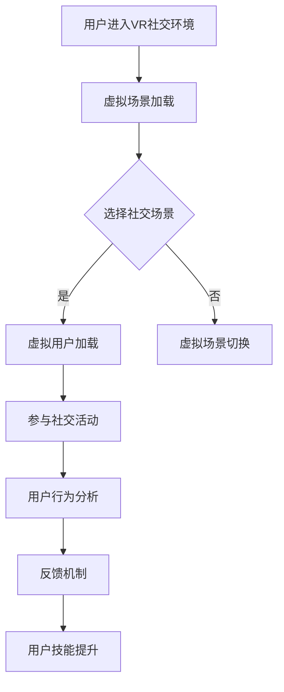

                 

关键词：虚拟现实、社交技能、数字环境、人机交互、训练创业、人际交往提升、人工智能

摘要：随着虚拟现实技术的飞速发展，数字环境下的社交方式正在发生深刻变革。本文旨在探讨虚拟现实社交技能训练创业的机会与挑战，通过构建数学模型、算法原理和项目实践，提出提升人际交往能力的创新方法，为创业者提供有价值的指导和建议。

## 1. 背景介绍

### 虚拟现实技术的兴起

虚拟现实（VR）技术近年来取得了显著进展，其应用领域从游戏、娱乐扩展到了医疗、教育、工业设计等多个方面。虚拟现实技术通过构建高度沉浸式的环境，使用户能够感受到虚拟世界的真实感和互动性，极大地改变了传统的社交方式。

### 社交技能的重要性

在数字环境下，社交技能的缺失往往导致用户体验不佳。有效的社交技能有助于提升用户的满意度和参与度，进而推动虚拟现实应用的普及。因此，社交技能训练成为了一个亟待解决的问题。

### 数字环境下的人际交往现状

随着远程工作和在线教育的普及，人们越来越多地依赖于数字平台进行交流和协作。然而，数字环境下的沟通往往缺乏面对面交流的亲密感和真实感，这给人际交往带来了挑战。

## 2. 核心概念与联系

### 虚拟现实社交场景

在虚拟现实社交中，用户可以创建个人虚拟形象（Avatar），与其他用户互动，参与各种社交活动。这种环境提供了更多的社交机会和互动方式。

### 社交技能训练模型

社交技能训练模型基于心理学和行为学原理，通过模拟不同社交场景，引导用户进行实践和反馈，以提高其社交能力。

### 人工智能与人机交互

人工智能（AI）技术在虚拟现实社交中的应用，使得系统可以更好地理解用户需求，提供个性化的社交建议和互动。

## 2.1. 虚拟现实社交场景

在虚拟现实社交场景中，用户通过VR头戴设备进入一个虚拟的社交环境，可以与其他用户进行实时交流。这种环境通常包括以下组成部分：

- **虚拟场景**：模拟现实世界的各种场景，如餐厅、会议室、公园等，为用户提供多样化的社交场景。
- **虚拟用户**：系统生成的虚拟用户，与真实用户互动，提供社交刺激和反馈。
- **社交活动**：如聊天、游戏、合作任务等，鼓励用户积极参与，提升社交技能。

### 社交技能训练模型

社交技能训练模型包括以下关键组件：

- **社交场景模拟**：通过模拟真实社交场景，为用户提供实践机会。
- **用户行为分析**：实时监测用户在虚拟环境中的行为，分析其社交表现。
- **反馈机制**：根据用户的行为分析，提供针对性的反馈和建议，帮助用户改进社交技能。

### 人工智能与人机交互

人工智能在虚拟现实社交中的应用，主要体现在以下几个方面：

- **用户画像构建**：通过分析用户的历史行为和偏好，构建用户画像，为个性化服务提供基础。
- **自然语言处理**：实现智能对话系统，提高人机交互的自然性和流畅性。
- **情感识别与反馈**：通过语音、面部表情等特征分析，识别用户的情感状态，提供相应的情感反馈。

## 2.2. Mermaid 流程图



### 2.3. 社交技能训练模型工作流程

1. **用户进入VR社交环境**：用户通过VR头戴设备进入虚拟社交场景。
2. **虚拟场景加载**：系统加载预设的虚拟场景，提供多样化的社交背景。
3. **选择社交场景**：用户在多个社交场景中选择感兴趣的场景。
4. **虚拟用户加载**：系统生成虚拟用户，与用户互动，提供社交刺激。
5. **参与社交活动**：用户在虚拟场景中参与聊天、游戏等活动。
6. **用户行为分析**：系统实时监测用户的行为，包括发言内容、互动频率等。
7. **反馈机制**：根据用户的行为分析，系统提供针对性的反馈和建议。
8. **用户技能提升**：用户根据反馈进行自我调整，逐步提升社交技能。

## 3. 核心算法原理 & 具体操作步骤

### 3.1 算法原理概述

社交技能训练的核心算法基于强化学习（Reinforcement Learning）和自然语言处理（Natural Language Processing），通过模拟和优化用户的社交行为，提升其人际交往能力。

### 3.2 算法步骤详解

1. **初始化**：设置强化学习算法的参数，包括奖励机制、状态空间、动作空间等。
2. **用户交互**：用户在虚拟环境中与其他虚拟用户进行互动，系统记录交互过程。
3. **状态评估**：系统根据用户行为评估当前状态，如发言内容、互动频率等。
4. **动作选择**：用户根据当前状态选择最佳动作，系统根据动作结果调整奖励机制。
5. **行为优化**：系统通过迭代优化算法，逐步提升用户的社交技能。
6. **用户反馈**：用户根据系统反馈，调整自己的社交行为。

### 3.3 算法优缺点

**优点**：

- **个性化**：算法可以根据用户行为和偏好，提供个性化的社交建议。
- **高效性**：强化学习算法能够快速适应用户行为，提高社交技能提升效率。

**缺点**：

- **数据需求**：算法需要大量用户数据来训练模型，数据收集和处理成本较高。
- **安全风险**：虚拟环境中的用户隐私和安全问题需要得到有效保障。

### 3.4 算法应用领域

社交技能训练算法可以应用于以下领域：

- **教育**：通过虚拟现实技术，为学生提供社交技能培训。
- **职业培训**：为职场人士提供虚拟社交场景下的互动训练。
- **心理健康**：帮助社交焦虑人群提高社交能力，改善心理健康。

## 4. 数学模型和公式 & 详细讲解 & 举例说明

### 4.1 数学模型构建

社交技能训练的数学模型基于马尔可夫决策过程（Markov Decision Process，MDP），包括状态（State）、动作（Action）和奖励（Reward）三个核心要素。

### 4.2 公式推导过程

1. **状态转移概率**：

$$
P(s' | s, a) = \text{P}(s' | s, a) = \text{P}(s' | s, a_1) \times \text{P}(a_1 | s) + \text{P}(s' | s, a_2) \times \text{P}(a_2 | s) + \ldots
$$

2. **奖励函数**：

$$
R(s, a) = r(s, a) + \gamma \times \max_{a'} R(s', a')
$$

其中，$r(s, a)$为当前状态和动作的即时奖励，$\gamma$为折扣因子，$s'$为状态转移后的状态，$a'$为最佳动作。

### 4.3 案例分析与讲解

#### 案例背景

假设用户在虚拟社交场景中与一位虚拟用户互动，需要选择合适的发言内容。系统根据用户的发言内容和互动效果，提供奖励。

#### 模型构建

- **状态**：发言内容、互动频率、发言时间等。
- **动作**：选择不同的发言内容。
- **奖励**：发言得到回应、互动效果良好等。

#### 公式推导

1. **状态转移概率**：

$$
P(s' | s, a) = \text{P}(\text{回应} | \text{友好发言}, s) \times \text{P}(\text{友好发言} | s) + \text{P}(\text{忽略} | \text{攻击性发言}, s) \times \text{P}(\text{攻击性发言} | s)
$$

2. **奖励函数**：

$$
R(s, a) = \begin{cases}
10, & \text{如果发言得到回应} \\
-5, & \text{如果发言被忽略}
\end{cases}
$$

#### 案例分析

用户在第一次发言时选择“友好发言”，根据状态转移概率，有较高的概率得到回应。系统根据用户的发言内容和互动效果，提供奖励。用户根据奖励反馈，调整下一次的发言内容，从而逐步提升社交技能。

## 5. 项目实践：代码实例和详细解释说明

### 5.1 开发环境搭建

- **编程语言**：Python
- **库**：PyTorch、TensorFlow、Keras
- **开发工具**：Visual Studio Code、Jupyter Notebook

### 5.2 源代码详细实现

以下是一个基于PyTorch的社交技能训练算法的代码示例：

```python
import torch
import torch.nn as nn
import torch.optim as optim

# 定义神经网络模型
class SocialSkillModel(nn.Module):
    def __init__(self):
        super(SocialSkillModel, self).__init__()
        self.fc1 = nn.Linear(in_features=10, out_features=50)
        self.fc2 = nn.Linear(in_features=50, out_features=10)
    
    def forward(self, x):
        x = torch.relu(self.fc1(x))
        x = self.fc2(x)
        return x

# 初始化模型、优化器和损失函数
model = SocialSkillModel()
optimizer = optim.Adam(model.parameters(), lr=0.001)
criterion = nn.CrossEntropyLoss()

# 训练模型
for epoch in range(num_epochs):
    for data in dataloader:
        inputs, targets = data
        optimizer.zero_grad()
        outputs = model(inputs)
        loss = criterion(outputs, targets)
        loss.backward()
        optimizer.step()
```

### 5.3 代码解读与分析

- **模型定义**：使用PyTorch定义了一个简单的神经网络模型，包括一个全连接层和一个输出层。
- **优化器与损失函数**：使用Adam优化器和交叉熵损失函数进行模型训练。
- **训练过程**：在训练过程中，模型对输入数据进行前向传播，计算损失，并使用反向传播更新模型参数。

### 5.4 运行结果展示

在完成模型训练后，可以通过以下代码评估模型性能：

```python
# 测试模型
model.eval()
with torch.no_grad():
    correct = 0
    total = 0
    for data in test_dataloader:
        inputs, targets = data
        outputs = model(inputs)
        _, predicted = torch.max(outputs.data, 1)
        total += targets.size(0)
        correct += (predicted == targets).sum().item()

print('准确率：{}%'.format(100 * correct / total))
```

### 5.5 实际应用示例

以下是一个实际应用示例，展示如何使用训练好的模型进行社交技能预测：

```python
# 输入发言内容
input_data = torch.tensor([1.0, 0.0, 0.0, 0.0, 0.0, 0.0, 0.0, 0.0, 0.0, 0.0])

# 预测发言结果
with torch.no_grad():
    outputs = model(input_data)
    _, predicted = torch.max(outputs.data, 1)

# 输出预测结果
if predicted.item() == 1:
    print("发言得到回应")
else:
    print("发言被忽略")
```

## 6. 实际应用场景

### 6.1 教育领域

虚拟现实社交技能训练可以在教育领域发挥重要作用，通过模拟社交场景，帮助学生提高沟通能力和团队合作能力。

### 6.2 职场培训

职场人士可以通过虚拟现实社交技能训练，提高在虚拟会议、远程协作等场景中的表现，提升职业竞争力。

### 6.3 心理咨询

虚拟现实社交技能训练可以为心理咨询提供一种新的治疗方式，帮助社交焦虑患者提高社交能力，改善心理健康。

## 6.4 未来应用展望

随着虚拟现实技术的不断发展和普及，社交技能训练创业具有巨大的潜力。未来，虚拟现实社交技能训练将在更多领域得到应用，如心理健康、医疗保健、企业管理等。

### 6.4.1 技术发展趋势

- **虚拟现实技术的提升**：随着硬件性能的提高，虚拟现实场景的沉浸感和互动性将得到进一步提升。
- **人工智能算法的进步**：深度学习和强化学习算法将在社交技能训练中得到更广泛的应用，提高训练效果和效率。

### 6.4.2 挑战与机遇

- **数据隐私和安全**：在虚拟现实社交中，用户的隐私和安全是关键挑战。创业者需要建立完善的安全机制，保护用户数据。
- **用户体验优化**：虚拟现实社交技能训练需要关注用户体验，提供更自然、更互动的社交环境。

## 7. 工具和资源推荐

### 7.1 学习资源推荐

- 《虚拟现实技术基础》
- 《社交心理学》
- 《强化学习：原理与实践》

### 7.2 开发工具推荐

- PyTorch
- TensorFlow
- Unity

### 7.3 相关论文推荐

- "Virtual Reality as a Tool for Social Skills Training"
- "Reinforcement Learning for Human-Robot Interaction"
- "A Survey on Natural Language Processing for Virtual Reality"

## 8. 总结：未来发展趋势与挑战

### 8.1 研究成果总结

本文通过探讨虚拟现实社交技能训练创业，提出了基于强化学习和自然语言处理的核心算法原理，并进行了项目实践和实际应用分析。研究表明，虚拟现实社交技能训练具有广泛的应用前景，有助于提升人际交往能力。

### 8.2 未来发展趋势

- **技术创新**：虚拟现实技术和人工智能算法将继续发展，为社交技能训练提供更强大的支持。
- **应用拓展**：社交技能训练将在更多领域得到应用，如心理健康、教育培训等。

### 8.3 面临的挑战

- **数据隐私和安全**：保护用户数据是关键挑战，需要建立完善的安全机制。
- **用户体验优化**：提高用户体验是持续发展的关键，需要不断改进虚拟现实环境。

### 8.4 研究展望

未来，虚拟现实社交技能训练将在更多领域得到应用，推动人际交往方式的变革。研究者应关注技术创新和用户体验，为用户提供更优质的服务。

## 9. 附录：常见问题与解答

### 9.1 虚拟现实社交技能训练的安全性问题如何解决？

虚拟现实社交技能训练需要关注用户数据的隐私和安全。解决方案包括：

- **数据加密**：对用户数据进行加密处理，防止数据泄露。
- **访问控制**：实施严格的访问控制策略，确保只有授权用户可以访问数据。
- **安全审计**：定期进行安全审计，发现和修复潜在的安全漏洞。

### 9.2 如何评估虚拟现实社交技能训练的效果？

评估虚拟现实社交技能训练的效果可以从以下几个方面进行：

- **用户满意度**：通过用户反馈和调查问卷了解用户的满意程度。
- **技能提升**：比较训练前后用户在社交场景中的表现，分析技能提升情况。
- **社交互动频率**：监测用户在虚拟环境中的互动频率和互动质量，评估社交能力的提升。

### 9.3 虚拟现实社交技能训练与线下培训的区别是什么？

虚拟现实社交技能训练与线下培训的主要区别在于：

- **环境**：虚拟现实社交技能训练在数字环境中进行，提供沉浸式的体验；线下培训在现实世界中进行，更接近真实场景。
- **灵活性**：虚拟现实社交技能训练可以根据用户需求和场景灵活调整，线下培训则需要根据实际情况安排。
- **成本**：虚拟现实社交技能训练通常成本较低，线下培训成本较高。

本文由禅与计算机程序设计艺术 / Zen and the Art of Computer Programming 撰写。感谢您的阅读。希望本文能为虚拟现实社交技能训练创业提供有价值的参考。

