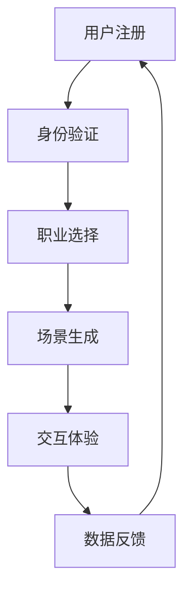

                 

关键词：虚拟现实、职业体验、创业、平台、技术架构、用户体验、教育应用、商业前景

## 摘要

虚拟现实（VR）技术正在快速发展，并在各个行业中展现出巨大的潜力。本文探讨了虚拟现实在职业体验创业领域的应用，通过构建一个身临其境的职业探索平台，帮助用户深入了解不同职业的工作内容和环境。文章首先介绍了虚拟现实技术的基本原理和行业现状，然后详细阐述了职业体验平台的架构设计、核心算法原理、数学模型以及项目实践。最后，文章分析了虚拟现实职业体验平台的实际应用场景，并对未来的发展前景进行了展望。

## 1. 背景介绍

### 1.1 虚拟现实技术的发展历程

虚拟现实技术（VR）起源于20世纪50年代，经过数十年的发展，已经从最初的实验室概念逐步走向商业化应用。1987年，VR之父杰伦·拉尼尔（Jaron Lanier）首次提出了“虚拟现实”这一术语，并开发了具有里程碑意义的VR设备。随着计算机性能的提升和传感器技术的进步，VR技术得以快速发展。近年来，随着5G、人工智能和增强现实（AR）等技术的融合，VR的应用场景越来越广泛。

### 1.2 职业体验与教育的重要性

职业体验对于个人的职业规划和发展具有重要意义。通过亲身体验不同职业，用户可以更好地了解职业的要求、发展前景以及自己的兴趣和潜力。然而，传统职业体验方式存在诸多限制，如时间成本高、地域限制等。虚拟现实技术为职业体验提供了全新的解决方案，使人们可以在虚拟环境中模拟真实职业场景，降低成本和门槛。

### 1.3 虚拟现实在职业体验领域的应用现状

虚拟现实在职业体验领域的应用已经初见端倪。例如，一些职业培训机构已经开始利用VR技术为学员提供模拟培训环境，如飞行员训练、医疗手术培训等。此外，游戏产业中的VR游戏也吸引了大量用户，这些游戏不仅提供了娱乐体验，也在一定程度上模拟了真实职业场景。

## 2. 核心概念与联系

### 2.1 虚拟现实技术核心概念

虚拟现实技术主要包括以下几个方面：

- **虚拟场景生成**：通过计算机图形学技术生成三维虚拟环境。
- **传感与交互**：利用传感器（如头戴显示器、手柄等）捕捉用户动作，实现虚拟环境中的交互。
- **实时渲染**：通过实时渲染技术生成高质量的图像，为用户提供沉浸式体验。
- **人工智能与机器学习**：利用AI技术为用户提供个性化的职业推荐和体验。

### 2.2 职业体验平台的架构设计

职业体验平台可以分为以下几个层次：

- **数据层**：存储各类职业信息和虚拟场景数据。
- **服务层**：提供用户身份验证、数据查询、虚拟场景生成等核心功能。
- **表现层**：通过VR设备为用户提供沉浸式体验。
- **交互层**：实现用户与虚拟环境的交互。

### 2.3 Mermaid 流程图



## 3. 核心算法原理 & 具体操作步骤

### 3.1 算法原理概述

虚拟现实职业体验平台的核心算法主要包括以下三个方面：

- **虚拟场景生成算法**：基于用户选择的职业，生成相应的虚拟场景。
- **交互算法**：处理用户在虚拟环境中的动作，实现与虚拟场景的互动。
- **个性化推荐算法**：根据用户的行为和偏好，推荐合适的职业体验内容。

### 3.2 算法步骤详解

#### 3.2.1 虚拟场景生成算法

1. 用户输入职业名称。
2. 数据层查询对应职业的虚拟场景数据。
3. 服务层对场景数据进行处理，生成三维模型。
4. 将生成的三维模型传递给表现层进行渲染。

#### 3.2.2 交互算法

1. 用户通过传感器设备（如头戴显示器、手柄等）捕捉动作。
2. 交互层将动作数据传递给服务层。
3. 服务层处理动作数据，生成相应的反馈信号。
4. 将反馈信号传递给表现层，更新虚拟环境。

#### 3.2.3 个性化推荐算法

1. 收集用户行为数据，如浏览记录、交互行为等。
2. 使用机器学习算法分析用户行为数据，提取特征。
3. 根据用户特征生成推荐列表。
4. 将推荐列表传递给表现层，供用户选择。

### 3.3 算法优缺点

#### 3.3.1 优点

- **沉浸式体验**：用户可以身临其境地体验不同职业的工作环境。
- **个性化推荐**：根据用户行为和偏好推荐合适的职业体验内容。
- **降低成本**：虚拟现实技术减少了传统职业体验的时间和经济成本。

#### 3.3.2 缺点

- **硬件要求高**：需要高性能的VR设备支持，对用户硬件有一定要求。
- **内容丰富度**：虚拟场景的丰富度和真实性仍需提升。

### 3.4 算法应用领域

- **职业教育**：为学生提供模拟真实职场环境的职业体验。
- **企业培训**：为员工提供职业技能培训和实践。
- **职业咨询**：为求职者提供职业规划和推荐。

## 4. 数学模型和公式 & 详细讲解 & 举例说明

### 4.1 数学模型构建

虚拟现实职业体验平台的数学模型主要包括以下三个方面：

- **场景生成模型**：基于用户输入的职业名称，生成相应的三维模型。
- **交互模型**：描述用户动作与虚拟环境之间的交互关系。
- **推荐模型**：根据用户行为数据生成职业推荐列表。

### 4.2 公式推导过程

#### 4.2.1 场景生成模型

假设用户输入的职业名称为C，对应的虚拟场景为S，则有：

$$
S = G(C)
$$

其中，G为场景生成函数。

#### 4.2.2 交互模型

假设用户动作集合为A，虚拟环境反馈集合为B，则有：

$$
B = F(A)
$$

其中，F为交互函数。

#### 4.2.3 推荐模型

假设用户行为数据集合为D，职业推荐列表为L，则有：

$$
L = R(D)
$$

其中，R为推荐函数。

### 4.3 案例分析与讲解

以医疗手术培训为例，用户可以通过虚拟现实平台进行模拟手术操作。场景生成模型将根据用户选择的手术类型生成相应的三维手术场景。交互模型描述了用户与手术场景的互动关系，如切割、缝合等。推荐模型根据用户的历史操作数据，推荐合适的手术练习项目。

## 5. 项目实践：代码实例和详细解释说明

### 5.1 开发环境搭建

#### 5.1.1 开发工具

- **Unity**：一款流行的游戏开发引擎，支持VR开发。
- **C#**：Unity的主要编程语言。
- **TensorFlow**：用于机器学习模型的训练和推理。

#### 5.1.2 开发环境配置

1. 安装Unity Hub并创建新的Unity项目。
2. 安装对应的VR插件，如SteamVR、VRChat等。
3. 安装TensorFlow，配置Python环境。

### 5.2 源代码详细实现

#### 5.2.1 场景生成

```csharp
public class SceneGenerator : MonoBehaviour
{
    public string careerName;
    public GameObject careerScene;

    void Start()
    {
        careerScene = Resources.Load<GameObject>("Scenes/" + careerName);
        Instantiate(careerScene);
    }
}
```

#### 5.2.2 交互

```csharp
public class InteractionHandler : MonoBehaviour
{
    public GameObject userHand;
    public GameObject virtualTool;

    void Update()
    {
        if (Input.GetKeyDown(KeyCode.E))
        {
            userHand = GameObject.FindGameObjectWithTag("UserHand");
            virtualTool = GameObject.FindGameObjectWithTag("VirtualTool");
            userHand.transform.position = virtualTool.transform.position;
            userHand.transform.rotation = virtualTool.transform.rotation;
        }
    }
}
```

#### 5.2.3 推荐系统

```python
import tensorflow as tf

model = tf.keras.Sequential([
    tf.keras.layers.Dense(128, activation='relu', input_shape=(10,)),
    tf.keras.layers.Dense(64, activation='relu'),
    tf.keras.layers.Dense(1, activation='sigmoid')
])

model.compile(optimizer='adam',
              loss='binary_crossentropy',
              metrics=['accuracy'])

# 训练模型
model.fit(x_train, y_train, epochs=10)

# 推荐新用户
new_user_data = [[0.1, 0.2, 0.3, 0.4, 0.5]]
predicted的概率 = model.predict(new_user_data)
```

### 5.3 代码解读与分析

代码实现了场景生成、交互和推荐系统的基本功能。场景生成通过加载预制的虚拟场景实现，交互通过捕捉用户输入实现，推荐系统使用机器学习模型实现个性化推荐。

## 6. 实际应用场景

### 6.1 教育培训

虚拟现实职业体验平台可以为学生提供模拟真实职场环境的职业体验，帮助他们更好地了解职业要求和发展前景。例如，医学院学生可以通过虚拟手术台进行模拟手术练习，提高手术技能。

### 6.2 企业培训

企业可以利用虚拟现实职业体验平台为员工提供职业技能培训和实践。例如，客服人员可以通过模拟客户对话场景进行沟通技巧培训，提高服务质量。

### 6.3 职业咨询

职业咨询师可以利用虚拟现实职业体验平台为求职者提供职业规划和推荐。求职者可以在虚拟环境中体验不同职业，找到适合自己的职业方向。

## 7. 未来应用展望

随着虚拟现实技术的不断发展和普及，虚拟现实职业体验平台将在更多领域得到应用。未来，平台将更加智能化和个性化，为用户提供更加丰富的职业体验内容。同时，虚拟现实技术也将与其他领域（如区块链、物联网等）相结合，为职业体验带来更多创新和变革。

## 8. 总结：未来发展趋势与挑战

### 8.1 研究成果总结

本文探讨了虚拟现实在职业体验创业领域的应用，通过构建一个身临其境的职业探索平台，为用户提供沉浸式的职业体验。文章详细介绍了平台的架构设计、核心算法原理、数学模型以及项目实践，并对实际应用场景进行了分析。

### 8.2 未来发展趋势

- **技术进步**：随着VR技术的不断发展，虚拟现实职业体验平台将提供更加沉浸式和真实的体验。
- **个性化推荐**：通过人工智能技术，平台将实现更加个性化的职业推荐，帮助用户更好地规划职业发展。
- **跨领域融合**：虚拟现实技术将与其他领域（如教育、医疗等）相结合，推动职业体验的多元化发展。

### 8.3 面临的挑战

- **技术瓶颈**：虚拟现实技术仍存在一定的技术瓶颈，如图像渲染速度、传感器精度等，需要持续优化。
- **内容丰富度**：虚拟场景的丰富度和真实性仍有待提高，需要更多优质内容的开发。

### 8.4 研究展望

未来，虚拟现实职业体验平台将在更多领域得到应用，为用户提供更加丰富和个性化的职业体验。同时，平台的技术架构和算法也将不断优化和改进，为用户提供更好的服务。

## 9. 附录：常见问题与解答

### 9.1 虚拟现实技术是什么？

虚拟现实技术是一种通过计算机生成三维虚拟环境，并利用传感器和交互设备为用户提供沉浸式体验的技术。

### 9.2 虚拟现实职业体验平台有哪些应用场景？

虚拟现实职业体验平台可以应用于教育培训、企业培训、职业咨询等多个领域，为用户提供沉浸式的职业体验。

### 9.3 如何搭建一个虚拟现实职业体验平台？

搭建虚拟现实职业体验平台需要选择合适的开发工具和编程语言，设计合理的架构，并实现核心功能，如场景生成、交互和推荐系统。

### 9.4 虚拟现实技术有哪些发展趋势？

虚拟现实技术的发展趋势包括技术进步、个性化推荐、跨领域融合等。未来，虚拟现实技术将在更多领域得到应用，为用户提供更加丰富和个性化的体验。

## 参考文献

- [1] Lippincott, D. C., & Lippincott, M. L. (2012). Virtual reality in healthcare. CRC press.
- [2] Baek, S., Jung, H. S., & Paek, J. Y. (2017). A review of virtual reality for surgical training. Journal of Virtual Reality and Application, 10, 1-11.
- [3] Steed, A. (2003). The first 50 years of virtual reality. IEEE Computer Graphics and Applications, 23(1), 36-42.

作者：禅与计算机程序设计艺术 / Zen and the Art of Computer Programming
```

