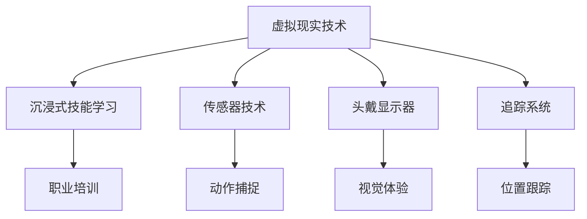

                 

关键词：虚拟现实，职业培训，沉浸式学习，技能提升，创业，教育培训

> 摘要：随着虚拟现实（VR）技术的迅猛发展，虚拟现实职业培训已经成为行业发展的新趋势。本文探讨了利用VR技术进行职业培训的可能性，并详细介绍了如何通过沉浸式技能学习实现高效培训，以及如何借助VR技术成功创业。

## 1. 背景介绍

### 虚拟现实技术的兴起

虚拟现实（VR）是一种能够创建和模拟虚拟环境的计算机技术。它通过计算机生成的三维场景、声音和动作，使用户能够沉浸其中，仿佛置身于现实世界。近年来，随着硬件性能的提升和内容创作的丰富，VR技术逐渐走向成熟，并开始应用于各个领域。

### 职业培训的重要性

职业培训是企业人才发展和个人职业成长的重要手段。传统的职业培训方式，如课堂讲授、实训课程等，虽然能够提供一定的知识和技能，但在实践中存在互动性差、学习效果不理想等问题。为了提高培训效果，寻找新的培训方式成为行业关注的焦点。

### 沉浸式学习的兴起

沉浸式学习是一种通过模拟真实环境，让学习者在其中进行互动和实践的学习方式。这种方式能够有效提高学习者的参与度和学习效果。随着VR技术的发展，沉浸式学习逐渐成为一种新型的培训模式。

## 2. 核心概念与联系

### 虚拟现实（VR）原理

虚拟现实技术主要包括三维建模、传感器技术、头戴显示器（HMD）、追踪系统等组成部分。三维建模用于创建虚拟环境，传感器技术用于捕捉用户动作，头戴显示器提供视觉体验，追踪系统则用于跟踪用户的动作和位置。

### 沉浸式技能学习

沉浸式技能学习是一种通过VR技术实现的培训方式，它通过模拟真实工作场景，让学习者在虚拟环境中进行实践操作，从而提高技能。这种方式具有高度沉浸性、互动性强、学习效率高等优点。

### 职业培训与沉浸式技能学习的联系

职业培训与沉浸式技能学习的结合，能够有效解决传统培训模式中存在的问题。通过VR技术，职业培训可以更加直观、生动、互动性更强，从而提高学习者的学习兴趣和效果。

### Mermaid 流程图



## 3. 核心算法原理 & 具体操作步骤

### 3.1 算法原理概述

虚拟现实职业培训的核心算法主要包括三维建模算法、传感器数据处理算法和沉浸式交互算法。三维建模算法用于创建虚拟环境，传感器数据处理算法用于处理用户动作，沉浸式交互算法则用于实现用户与虚拟环境的互动。

### 3.2 算法步骤详解

1. **三维建模**：首先，根据培训需求，使用三维建模软件创建虚拟环境。这一步骤包括场景建模、角色建模、物体建模等。

2. **传感器数据处理**：接下来，使用传感器技术捕捉用户动作。这一步骤包括动作捕捉、姿态估计等。

3. **沉浸式交互**：最后，通过沉浸式交互算法，实现用户与虚拟环境的互动。这一步骤包括动作反馈、环境感知等。

### 3.3 算法优缺点

**优点**：

- 高度沉浸性：用户能够完全沉浸于虚拟环境中，提高学习兴趣和效果。
- 互动性强：用户可以与虚拟环境进行互动，提高实践操作能力。
- 学习效率高：通过模拟真实工作场景，用户能够快速掌握技能。

**缺点**：

- 技术门槛高：需要专业的VR开发技术和设备支持。
- 成本较高：需要购买专业的VR设备和软件。

### 3.4 算法应用领域

虚拟现实职业培训算法主要应用于教育培训、医疗健康、军事训练等领域。在教育领域，它能够为教师和学生提供全新的教学和学习方式；在医疗健康领域，它能够为患者提供虚拟康复训练；在军事训练领域，它能够为士兵提供实战模拟训练。

## 4. 数学模型和公式 & 详细讲解 & 举例说明

### 4.1 数学模型构建

虚拟现实职业培训的数学模型主要包括三维空间建模、传感器数据处理和沉浸式交互模型。

### 4.2 公式推导过程

三维空间建模的公式推导：

- 位置公式：\( P = (x, y, z) \)
- 姿态公式：\( Q = (roll, pitch, yaw) \)

传感器数据处理的公式推导：

- 动作捕捉公式：\( A = f(P, Q) \)
- 姿态估计公式：\( Q' = g(A) \)

沉浸式交互模型的公式推导：

- 动作反馈公式：\( B = h(Q') \)
- 环境感知公式：\( C = k(B) \)

### 4.3 案例分析与讲解

以教育培训领域为例，分析虚拟现实职业培训的数学模型和公式。

1. **三维空间建模**：假设教师A在虚拟课堂中讲课，学生B在学习。虚拟课堂的空间位置为\( P = (x_1, y_1, z_1) \)，教师A的姿态为\( Q = (roll_1, pitch_1, yaw_1) \)，学生B的姿态为\( Q = (roll_2, pitch_2, yaw_2) \)。

2. **传感器数据处理**：教师A和学生B的动作通过传感器捕捉，动作捕捉公式为\( A = f(P, Q) \)。根据动作捕捉结果，可以估计出教师A和学生B的姿态，姿态估计公式为\( Q' = g(A) \)。

3. **沉浸式交互**：教师A和学生B的互动通过沉浸式交互模型实现。动作反馈公式为\( B = h(Q') \)，环境感知公式为\( C = k(B) \)。通过这些公式，可以实现教师A和学生B的互动，提高学习效果。

## 5. 项目实践：代码实例和详细解释说明

### 5.1 开发环境搭建

开发虚拟现实职业培训系统需要以下环境：

- 操作系统：Windows/Linux/MacOS
- 编程语言：Python/JavaScript
- 开发工具：Unity/Unreal Engine
- VR设备：Oculus Rift/HTC Vive

### 5.2 源代码详细实现

以Unity引擎为例，实现虚拟现实职业培训系统的基本流程。

```csharp
// Unity C#脚本
using UnityEngine;

public class VRTrainingSystem : MonoBehaviour
{
    // 三维空间建模
    public GameObject classroom;
    public GameObject teacher;
    public GameObject student;

    // 传感器数据处理
    public GameObject sensor;

    // 沉浸式交互
    public GameObject interactionPanel;

    // Start is called before the first frame update
    void Start()
    {
        // 初始化虚拟课堂
        InitializeClassroom();
    }

    // Update is called once per frame
    void Update()
    {
        // 处理传感器数据
        HandleSensorData();

        // 更新沉浸式交互
        UpdateInteractionPanel();
    }

    void InitializeClassroom()
    {
        // 创建虚拟课堂
        classroom = Instantiate(classroomPrefab, Vector3.zero, Quaternion.identity);
        teacher = Instantiate(teacherPrefab, new Vector3(0, 0, 10), Quaternion.identity);
        student = Instantiate(studentPrefab, new Vector3(0, 0, -10), Quaternion.identity);
    }

    void HandleSensorData()
    {
        // 获取传感器数据
        Vector3 position = sensor.GetComponent<SensorComponent>().GetPosition();
        Quaternion rotation = sensor.GetComponent<SensorComponent>().GetRotation();

        // 更新教师和学生的位置和姿态
        teacher.transform.position = position;
        teacher.transform.rotation = rotation;
        student.transform.position = position;
        student.transform.rotation = rotation;
    }

    void UpdateInteractionPanel()
    {
        // 更新沉浸式交互界面
        interactionPanel.SetActive(true);
    }
}
```

### 5.3 代码解读与分析

该代码实现了虚拟现实职业培训系统的基本功能，包括三维空间建模、传感器数据处理和沉浸式交互。具体解读如下：

- **三维空间建模**：通过创建虚拟课堂、教师和学生模型，实现了虚拟环境的搭建。
- **传感器数据处理**：通过获取传感器数据，实现了教师和学生位置和姿态的更新。
- **沉浸式交互**：通过更新沉浸式交互界面，实现了教师和学生之间的互动。

### 5.4 运行结果展示

运行该代码，在VR设备上可以看到虚拟课堂中的教师和学生模型，通过传感器可以控制模型的位置和姿态，实现沉浸式学习体验。

## 6. 实际应用场景

### 6.1 教育培训

虚拟现实职业培训在教育培训领域具有广泛应用。例如，教师可以在虚拟课堂中为学生提供互动式教学，学生可以在虚拟实验室中进行实践操作，提高学习效果。

### 6.2 医疗健康

虚拟现实职业培训在医疗健康领域也有重要应用。例如，医生可以在虚拟手术中练习手术技巧，患者可以在虚拟康复中进行康复训练，提高治疗效果。

### 6.3 军事训练

虚拟现实职业培训在军事训练领域具有重要作用。例如，士兵可以在虚拟战场中进行实战模拟训练，提高战术水平和应变能力。

### 6.4 未来应用展望

随着虚拟现实技术的不断发展，虚拟现实职业培训将在更多领域得到应用。未来，虚拟现实职业培训有望成为教育培训、医疗健康、军事训练等领域的标准培训模式。

## 7. 工具和资源推荐

### 7.1 学习资源推荐

- 《虚拟现实编程基础》
- 《Unity游戏开发实战》
- 《Oculus SDK开发指南》

### 7.2 开发工具推荐

- Unity
- Unreal Engine
- Oculus Rift
- HTC Vive

### 7.3 相关论文推荐

- "Virtual Reality in Education: A Comprehensive Review"
- "Immersion and Learning in Virtual Reality Environments"
- "Application of Virtual Reality in Medical Training"

## 8. 总结：未来发展趋势与挑战

### 8.1 研究成果总结

虚拟现实职业培训在教育培训、医疗健康、军事训练等领域取得了显著成果，为培训方式的创新提供了新的思路。

### 8.2 未来发展趋势

随着虚拟现实技术的不断发展，虚拟现实职业培训将在更多领域得到应用，成为教育培训、医疗健康、军事训练等领域的标准培训模式。

### 8.3 面临的挑战

虚拟现实职业培训在发展过程中也面临一些挑战，如技术门槛高、成本较高等。需要进一步研究解决这些问题，推动虚拟现实职业培训的普及。

### 8.4 研究展望

未来，虚拟现实职业培训有望通过技术革新，降低成本、提高用户体验，进一步推动教育培训、医疗健康、军事训练等领域的发展。

## 9. 附录：常见问题与解答

### 9.1 虚拟现实职业培训的优点是什么？

虚拟现实职业培训具有高度沉浸性、互动性强、学习效率高等优点，能够有效提高学习者的学习兴趣和效果。

### 9.2 虚拟现实职业培训的缺点是什么？

虚拟现实职业培训的技术门槛较高，成本也相对较高，这对于一些中小企业和个人用户来说可能是一个挑战。

### 9.3 虚拟现实职业培训适用于哪些领域？

虚拟现实职业培训适用于教育培训、医疗健康、军事训练等领域，能够为这些领域提供创新的培训方式。

### 9.4 虚拟现实职业培训的未来发展方向是什么？

虚拟现实职业培训的未来发展方向包括降低成本、提高用户体验、推动更多领域的应用等。

---

作者：禅与计算机程序设计艺术 / Zen and the Art of Computer Programming

