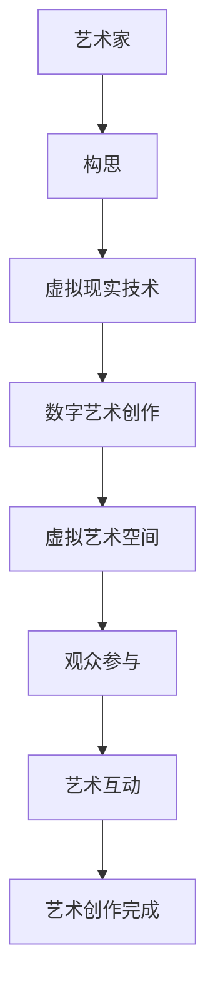

                 

 虚拟现实（VR）技术的飞速发展，为艺术创作带来了全新的可能性和挑战。随着技术的进步，虚拟现实不仅改变了我们的娱乐方式，也正在重塑艺术创作的生态系统。本文将探讨虚拟现实在艺术创作中的应用，以及这一新兴领域所带来的创业机会和挑战。

## 关键词

- 虚拟现实
- 艺术创作
- 创业
- 数字艺术
- 新领域

## 摘要

本文将从背景介绍、核心概念与联系、核心算法原理、数学模型和公式、项目实践、实际应用场景、未来应用展望、工具和资源推荐、总结：未来发展趋势与挑战、附录：常见问题与解答等方面，全面探讨虚拟现实艺术创作这一新兴领域的现状、挑战和机遇。

## 1. 背景介绍

虚拟现实艺术创作，是指在虚拟环境中，通过计算机技术和虚拟现实设备，实现艺术家创作的艺术作品。这种创作方式打破了传统的二维艺术界限，为艺术家提供了无限的表达空间。随着计算机图形学、3D建模、实时渲染等技术的不断发展，虚拟现实艺术创作逐渐走向成熟。

虚拟现实艺术创作与传统艺术创作相比，具有以下优势：

- **无限空间**：虚拟现实环境提供了无限的空间，艺术家可以在这个空间中自由创作，不再受限于现实世界的物理限制。
- **交互性**：虚拟现实技术使得艺术家和观众之间建立了更紧密的交互关系，观众可以参与到艺术创作过程中，成为艺术的一部分。
- **多样性**：虚拟现实艺术创作结合了多种艺术形式，如绘画、雕塑、音乐、视频等，使得艺术作品的呈现形式更加多样化。

## 2. 核心概念与联系

### 虚拟现实技术

虚拟现实技术（VR）是指通过计算机技术创造一个虚拟环境，用户通过VR设备（如VR头盔、手柄等）进入这个环境，并与之进行交互。虚拟现实技术主要包括以下几个核心概念：

- **头戴式显示器（HMD）**：用户通过HMD观看虚拟环境，感受沉浸式体验。
- **位置追踪**：实时追踪用户的位置和移动，确保虚拟环境与现实世界保持一致。
- **交互设备**：如手柄、手套等，用于在虚拟环境中进行操作。

### 数字艺术创作

数字艺术创作是指在数字媒介上进行的艺术创作，包括计算机图形设计、动画制作、数字雕塑等。数字艺术创作与虚拟现实技术有着密切的联系，两者共同推动了艺术创作的新形式。

### 艺术家与观众

在虚拟现实艺术创作中，艺术家和观众的关系发生了根本性的变化。艺术家不再是单一的创作者，而是与观众共同构建虚拟艺术空间的合作者。观众不再是被动的欣赏者，而是可以主动参与到艺术创作过程中，成为艺术的一部分。

### Mermaid 流程图



## 3. 核心算法原理 & 具体操作步骤

### 3.1 算法原理概述

虚拟现实艺术创作涉及多个算法和技术的应用，其中主要包括：

- **3D建模**：通过3D建模软件，如Blender、Maya等，创建艺术作品的数字模型。
- **实时渲染**：使用实时渲染引擎，如Unity、Unreal Engine等，将3D模型渲染为虚拟现实环境中的画面。
- **交互算法**：实现艺术家与观众的交互，如手势识别、语音识别等。

### 3.2 算法步骤详解

1. **3D建模**：
   - 使用3D建模软件创建艺术作品的数字模型。
   - 对模型进行细节调整和优化。

2. **实时渲染**：
   - 选择合适的实时渲染引擎。
   - 导入3D模型，并进行场景布局。

3. **交互算法**：
   - 设计交互方式，如手势、语音等。
   - 实现交互算法，确保虚拟环境与用户的实时交互。

### 3.3 算法优缺点

**优点**：
- **沉浸式体验**：虚拟现实技术提供了高度沉浸式的体验，让观众感受到身临其境的感觉。
- **多样性**：虚拟现实艺术创作融合了多种艺术形式，提供了丰富的创作空间。
- **交互性**：艺术家和观众可以实时互动，增加了艺术创作的趣味性。

**缺点**：
- **技术门槛**：虚拟现实艺术创作需要较高的技术门槛，包括3D建模、实时渲染等技能。
- **成本高**：虚拟现实设备的成本较高，限制了部分观众的参与。

### 3.4 算法应用领域

- **博物馆**：虚拟现实技术可以用于博物馆的数字展览，提供更加生动、互动的展示方式。
- **艺术装置**：艺术家可以利用虚拟现实技术创作互动性的艺术装置，吸引观众参与。
- **游戏**：虚拟现实技术为游戏提供了全新的游戏体验，如虚拟现实角色扮演游戏等。

## 4. 数学模型和公式 & 详细讲解 & 举例说明

### 4.1 数学模型构建

虚拟现实艺术创作中，涉及到多个数学模型的应用，主要包括：

- **3D几何模型**：用于描述艺术作品的几何形状和结构。
- **纹理映射模型**：用于在3D模型上贴图，增加细节和质感。
- **光线追踪模型**：用于模拟光线在虚拟环境中的传播和反射。

### 4.2 公式推导过程

1. **3D几何模型**：

   - **点云模型**：使用点云表示艺术作品的几何形状。

     $$ P = \{P_1, P_2, ..., P_n\} $$

   - **曲面模型**：使用曲面方程表示艺术作品的表面。

     $$ F(x, y, z) = 0 $$

2. **纹理映射模型**：

   - **坐标映射**：将3D模型上的纹理坐标映射到2D纹理图上。

     $$ u = f(x, y) $$
     $$ v = g(x, y) $$

3. **光线追踪模型**：

   - **光线方程**：描述光线在虚拟环境中的传播路径。

     $$ L(t) = P_0 + t \cdot D $$

### 4.3 案例分析与讲解

以一个简单的虚拟现实艺术装置为例，该装置由一个3D几何模型和一个纹理映射模型组成。

1. **3D几何模型**：

   - 创建一个立方体模型，使用点云模型表示其几何形状。

     $$ P = \{P_1, P_2, P_3, P_4, P_5, P_6\} $$

   - 对模型进行纹理映射，将一张纹理图映射到立方体表面。

     $$ u = \frac{x}{w} $$
     $$ v = \frac{y}{h} $$

2. **实时渲染**：

   - 使用实时渲染引擎将3D模型渲染为虚拟环境中的画面。

   - 使用光线追踪模型模拟光线在虚拟环境中的传播和反射。

   $$ L(t) = P_0 + t \cdot D $$

   - 实现交互算法，允许观众与虚拟艺术装置进行互动。

## 5. 项目实践：代码实例和详细解释说明

### 5.1 开发环境搭建

为了实现一个简单的虚拟现实艺术创作项目，我们需要搭建以下开发环境：

- **操作系统**：Windows 10 或 macOS
- **编程语言**：C++
- **开发工具**：Visual Studio
- **虚拟现实引擎**：Unity

### 5.2 源代码详细实现

以下是一个简单的虚拟现实艺术创作项目的源代码示例：

```cpp
#include <iostream>
#include <glm/glm.hpp>
#include <glm/gtc/matrix_transform.hpp>
#include <glm/gtc/type_ptr.hpp>
#include <GL/glew.h>
#include <GLFW/glfw3.h>

// 3D几何模型
glm::vec3 points[] = {
    glm::vec3(-1.0f, -1.0f, 0.0f),
    glm::vec3(1.0f, -1.0f, 0.0f),
    glm::vec3(1.0f, 1.0f, 0.0f),
    glm::vec3(-1.0f, 1.0f, 0.0f)
};

// 纹理映射
GLuint texture;
void loadTexture() {
    // 创建纹理
    glGenTextures(1, &texture);
    glBindTexture(GL_TEXTURE_2D, texture);

    // 设置纹理参数
    glTexParameteri(GL_TEXTURE_2D, GL_TEXTURE_WRAP_S, GL_REPEAT);
    glTexParameteri(GL_TEXTURE_2D, GL_TEXTURE_WRAP_T, GL_REPEAT);
    glTexParameteri(GL_TEXTURE_2D, GL_TEXTURE_MIN_FILTER, GL_LINEAR_MIPMAP_LINEAR);
    glTexParameteri(GL_TEXTURE_2D, GL_TEXTURE_MAG_FILTER, GL_LINEAR);

    // 加载纹理图
    int width, height, channels;
    unsigned char* image = stbi_load("texture.jpg", &width, &height, &channels, 0);
    glTexImage2D(GL_TEXTURE_2D, 0, GL_RGB, width, height, 0, GL_RGB, GL_UNSIGNED_BYTE, image);
    glGenerateMipmap(GL_TEXTURE_2D);
    stbi_image_free(image);

    // 解绑纹理
    glBindTexture(GL_TEXTURE_2D, 0);
}

// 渲染函数
void render() {
    // 设置背景颜色
    glClearColor(0.1f, 0.1f, 0.1f, 1.0f);
    glClear(GL_COLOR_BUFFER_BIT | GL_DEPTH_BUFFER_BIT);

    // 绑定纹理
    glBindTexture(GL_TEXTURE_2D, texture);

    // 设置顶点数组
    glVertexAttribPointer(0, 3, GL_FLOAT, GL_FALSE, 3 * sizeof(float), points);
    glEnableVertexAttribArray(0);

    // 绘制3D几何模型
    glDrawArrays(GL_QUADS, 0, 4);

    // 解绑纹理
    glBindTexture(GL_TEXTURE_2D, 0);
}

// 主函数
int main() {
    // 初始化GLFW
    if (!glfwInit()) {
        std::cout << "Failed to initialize GLFW" << std::endl;
        return -1;
    }

    // 创建窗口
    GLFWwindow* window = glfwCreateWindow(800, 600, "Virtual Reality Art Creation", nullptr, nullptr);
    if (!window) {
        std::cout << "Failed to create GLFW window" << std::endl;
        glfwTerminate();
        return -1;
    }

    // 设置上下文
    glfwMakeContextCurrent(window);

    // 初始化GLEW
    if (glewInit() != GLEW_OK) {
        std::cout << "Failed to initialize GLEW" << std::endl;
        return -1;
    }

    // 设置视口
    glViewport(0, 0, 800, 600);

    // 加载纹理
    loadTexture();

    // 渲染循环
    while (!glfwWindowShouldClose(window)) {
        // 处理输入事件
        glfwPollEvents();

        // 渲染
        render();

        // 交换缓冲区
        glfwSwapBuffers(window);
    }

    // 释放资源
    glfwTerminate();

    return 0;
}
```

### 5.3 代码解读与分析

上述代码实现了一个简单的虚拟现实艺术创作项目，主要功能如下：

- **加载纹理**：使用`loadTexture()`函数加载纹理图，并将其绑定到纹理对象上。
- **渲染3D几何模型**：使用`render()`函数绘制一个立方体模型，并将纹理映射到立方体表面。
- **渲染循环**：在渲染循环中，处理输入事件，渲染场景，并交换缓冲区。

### 5.4 运行结果展示

运行上述代码后，将看到一个简单的虚拟现实艺术装置，由一个立方体模型和一个纹理图组成。用户可以与艺术装置进行互动，如旋转、缩放等。

## 6. 实际应用场景

虚拟现实艺术创作在实际应用中具有广泛的应用场景，以下列举几个典型应用：

### 6.1 虚拟现实博物馆

虚拟现实博物馆利用虚拟现实技术，为观众提供了一个全新的观展体验。观众可以通过虚拟现实设备，走进博物馆的数字展厅，欣赏展品，了解展品的背景故事，甚至可以与展品进行互动。

### 6.2 虚拟现实艺术展览

虚拟现实艺术展览为艺术家提供了一个全新的展示平台。艺术家可以在虚拟环境中创作艺术作品，并将其展示给全球观众。观众可以通过虚拟现实设备，欣赏艺术作品，甚至可以与艺术家进行互动。

### 6.3 虚拟现实角色扮演游戏

虚拟现实角色扮演游戏（VR RPG）为玩家提供了一个全新的游戏体验。玩家可以在虚拟环境中扮演角色，进行冒险、探索、战斗等。虚拟现实技术使得游戏世界更加真实，玩家可以感受到身临其境的体验。

## 7. 未来应用展望

虚拟现实艺术创作在未来将继续发展，并带来更多的创新和应用。以下是一些未来应用展望：

### 7.1 虚拟现实艺术创作教育

虚拟现实技术可以用于艺术创作教育，为学生提供丰富的创作资源和互动体验。学生可以通过虚拟现实设备，学习艺术创作的基本原理和方法，提高艺术创作能力。

### 7.2 虚拟现实艺术市场

虚拟现实艺术创作将催生一个新的艺术市场，包括虚拟现实艺术品的创作、展示、交易等。虚拟现实技术将为艺术家和艺术品收藏家提供一个全新的艺术生态系统。

### 7.3 虚拟现实艺术体验

虚拟现实艺术体验将逐渐成为人们生活中的一部分。人们可以通过虚拟现实设备，在家中欣赏艺术作品，享受独特的艺术体验。

## 8. 工具和资源推荐

### 8.1 学习资源推荐

- **《虚拟现实技术基础》**：一本介绍虚拟现实技术的基础知识的书籍，适合初学者入门。
- **《计算机图形学》**：一本介绍计算机图形学原理和技术的经典教材，包括虚拟现实相关的知识。

### 8.2 开发工具推荐

- **Unity**：一款流行的游戏开发引擎，支持虚拟现实艺术创作。
- **Unreal Engine**：一款功能强大的游戏开发引擎，支持高质量的虚拟现实艺术创作。

### 8.3 相关论文推荐

- **“Virtual Reality in Art and Design: Opportunities and Challenges”**：一篇介绍虚拟现实在艺术和设计中的应用和挑战的论文。
- **“Artificial Reality: Creating Art in the Age of VR”**：一篇探讨虚拟现实艺术创作的艺术价值和社会影响的论文。

## 9. 总结：未来发展趋势与挑战

虚拟现实艺术创作作为数字艺术的新领域，具有巨大的发展潜力和市场前景。在未来，随着技术的不断进步，虚拟现实艺术创作将继续创新，为艺术家和观众带来更多的惊喜。然而，虚拟现实艺术创作也面临着一系列挑战，如技术门槛、成本高昂、用户体验等。如何克服这些挑战，推动虚拟现实艺术创作的发展，将是未来研究的重要方向。

## 10. 附录：常见问题与解答

### 10.1 虚拟现实艺术创作需要哪些技术？

虚拟现实艺术创作需要掌握以下技术：

- **3D建模**：用于创建艺术作品的数字模型。
- **实时渲染**：用于将3D模型渲染为虚拟现实环境中的画面。
- **交互算法**：用于实现艺术家与观众的实时互动。

### 10.2 虚拟现实艺术创作有哪些应用场景？

虚拟现实艺术创作具有广泛的应用场景，包括：

- **虚拟现实博物馆**：为观众提供全新的观展体验。
- **虚拟现实艺术展览**：为艺术家提供一个全新的展示平台。
- **虚拟现实角色扮演游戏**：为玩家提供一个全新的游戏体验。

### 10.3 虚拟现实艺术创作的成本如何？

虚拟现实艺术创作的成本取决于多种因素，如开发工具、硬件设备、开发团队等。一般来说，虚拟现实艺术创作的成本较高，但具体数额需要根据具体项目进行评估。

## 作者署名

作者：禅与计算机程序设计艺术 / Zen and the Art of Computer Programming
-------------------------------------------------------------------

