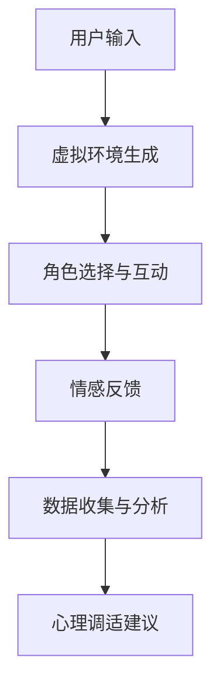

                 

关键词：虚拟现实（VR）、角色扮演治疗（RPGT）、心理调适、创业压力、沉浸式体验、认知行为疗法（CBT）

> 摘要：本文旨在探讨虚拟现实（VR）在角色扮演治疗（RPGT）中的应用，特别是在缓解创业过程中面临的心理压力。通过分析VR的沉浸式特点，结合认知行为疗法（CBT）的理论框架，本文提出了一种基于VR的角色扮演治疗方案，以帮助创业者实现更有效的心理调适。

## 1. 背景介绍

### 1.1 虚拟现实技术的发展

虚拟现实（VR）技术自20世纪90年代兴起以来，已经经历了快速的发展。随着计算机图形学、人工智能、传感器技术的不断进步，VR设备变得更加便携和易用。当前，VR技术在娱乐、教育、医疗等领域得到了广泛应用，展示了巨大的潜力。

### 1.2 角色扮演治疗（RPGT）的基本原理

角色扮演治疗（RPGT）是一种心理治疗方法，通过让患者在一个安全、可控的环境中扮演不同的角色，从而帮助他们探索自己的情感和行为。这种治疗方法在心理治疗领域已有数十年的应用历史，尤其在治疗焦虑、抑郁等心理问题方面表现出色。

### 1.3 创业压力与心理调适

创业是一条充满挑战的道路，创业者常常面临巨大的压力。根据多项研究，创业过程中的心理压力可能导致焦虑、抑郁等心理问题，甚至影响创业者的决策能力和创新能力。因此，寻找有效的心理调适方法对于创业者来说至关重要。

## 2. 核心概念与联系

### 2.1 虚拟现实与角色扮演治疗的结合

虚拟现实（VR）技术的沉浸式特点与角色扮演治疗（RPGT）的安全、可控环境相结合，可以创造出一种独特的治疗体验。通过VR，患者可以进入一个完全虚拟的世界，在其中扮演不同的角色，体验各种情境，从而更深入地探索自己的内心世界。

### 2.2 虚拟现实角色扮演治疗的架构

虚拟现实角色扮演治疗（VR-RPGT）的架构包括以下几个关键部分：

- **虚拟环境生成**：利用计算机图形学和人工智能技术，创建一个逼真的虚拟环境。
- **角色扮演系统**：设计一套角色扮演规则和程序，让患者能够在虚拟环境中自由选择角色，进行互动。
- **情感反馈机制**：通过传感器和人工智能技术，捕捉患者的生理和情感变化，提供实时反馈。
- **数据分析和处理**：对患者在虚拟环境中的行为和情感数据进行收集、分析和处理，以便进行后续的心理调适。

以下是一个简单的Mermaid流程图，展示了VR-RPGT的架构：



## 3. 核心算法原理 & 具体操作步骤

### 3.1 算法原理概述

虚拟现实角色扮演治疗（VR-RPGT）的核心算法主要包括以下几部分：

- **虚拟环境生成算法**：利用计算机图形学和三维建模技术，生成一个逼真的虚拟环境。
- **角色扮演系统算法**：设计一套规则和程序，让患者能够在虚拟环境中自由选择角色，进行互动。
- **情感反馈算法**：通过传感器和人工智能技术，捕捉患者的生理和情感变化，提供实时反馈。
- **数据分析和处理算法**：对患者在虚拟环境中的行为和情感数据进行收集、分析和处理，以便进行后续的心理调适。

### 3.2 算法步骤详解

#### 3.2.1 虚拟环境生成

- **场景建模**：利用三维建模软件，创建一个虚拟场景，包括建筑、植被、天空等元素。
- **光照模拟**：根据真实世界的光照条件，对虚拟场景进行光照模拟，以营造出逼真的视觉效果。
- **动态效果添加**：添加动态效果，如天气变化、动物活动等，以增加虚拟环境的真实感。

#### 3.2.2 角色扮演系统

- **角色创建**：设计多种角色，包括普通人物、动物、虚拟人物等，供患者选择。
- **角色互动**：设计角色之间的互动规则，如对话、合作、竞争等，以模拟真实世界的情境。
- **情境切换**：根据患者的角色选择和互动行为，自动切换不同的情境，以引导患者进行深入的角色扮演。

#### 3.2.3 情感反馈

- **生理数据采集**：通过传感器，实时采集患者的生理数据，如心率、血压、皮肤电导等。
- **情感识别**：利用机器学习和情感识别技术，分析患者的生理数据，识别患者的情感状态。
- **实时反馈**：根据患者的情感状态，提供实时反馈，如声音、图像、文本等，以引导患者的情感调适。

#### 3.2.4 数据分析和处理

- **数据收集**：在患者进行角色扮演的过程中，实时收集患者的行为和情感数据。
- **数据预处理**：对收集到的数据进行分析，去除噪声，提取关键特征。
- **数据分析**：利用统计分析、机器学习等技术，对预处理后的数据进行深入分析。
- **心理调适建议**：根据数据分析结果，为患者提供个性化的心理调适建议。

### 3.3 算法优缺点

#### 优点：

- **沉浸式体验**：通过VR技术，患者可以体验到高度沉浸的虚拟环境，有助于提高治疗的吸引力和效果。
- **安全可控**：虚拟环境是安全可控的，患者可以在没有风险的情况下进行角色扮演，有助于减轻心理压力。
- **个性化调适**：通过对患者的生理和情感数据的分析，可以提供个性化的心理调适建议，提高治疗效果。

#### 缺点：

- **技术门槛**：虚拟现实技术的实现需要较高的技术门槛，对开发人员和设备要求较高。
- **设备依赖**：患者需要使用特定的VR设备，对设备的依赖性较大，可能影响治疗的便捷性。
- **情感误导**：虚拟环境过于逼真，可能导致患者的情感误导，影响治疗的准确性。

### 3.4 算法应用领域

虚拟现实角色扮演治疗（VR-RPGT）可以应用于多个领域，包括：

- **心理健康治疗**：如焦虑、抑郁、PTSD等心理问题的治疗。
- **职业培训**：如应急响应、医疗手术等高风险职业的培训。
- **教育**：如历史事件重现、科学实验演示等。

## 4. 数学模型和公式 & 详细讲解 & 举例说明

### 4.1 数学模型构建

虚拟现实角色扮演治疗（VR-RPGT）中的数学模型主要包括以下几部分：

- **虚拟环境建模**：利用三维建模技术，构建虚拟环境的数学模型。
- **角色行为建模**：利用行为心理学和计算机科学，构建角色的行为模型。
- **情感识别模型**：利用机器学习和情感识别技术，构建情感识别模型。
- **数据分析模型**：利用统计分析、机器学习等技术，构建数据分析模型。

### 4.2 公式推导过程

#### 4.2.1 虚拟环境建模

- **三维空间建模**：利用三维坐标系统，构建虚拟环境的数学模型。
- **光照模型**：利用物理光学公式，计算虚拟环境中的光照效果。
- **动态效果建模**：利用随机过程和数学模型，模拟虚拟环境中的动态效果。

#### 4.2.2 角色行为建模

- **决策模型**：利用决策理论，构建角色的决策模型。
- **互动模型**：利用社交网络理论，构建角色之间的互动模型。

#### 4.2.3 情感识别模型

- **生理数据模型**：利用生理学公式，构建生理数据的数学模型。
- **情感识别模型**：利用机器学习算法，构建情感识别模型。

#### 4.2.4 数据分析模型

- **统计分析模型**：利用统计学方法，构建数据分析模型。
- **机器学习模型**：利用机器学习算法，构建数据分析模型。

### 4.3 案例分析与讲解

#### 4.3.1 虚拟环境建模

假设我们要创建一个虚拟公园，公园中有花草、小溪、湖泊等元素。我们可以利用以下公式进行建模：

- **三维坐标系统**：使用三维坐标系，定义公园中各个元素的位置。
- **光照模型**：利用朗伯余弦定律，计算虚拟环境中的光照效果。

```latex
L = I \cdot cos(\theta)
```

其中，L为光照强度，I为光照强度，θ为光线与垂直方向的角度。

- **动态效果建模**：使用随机过程，模拟湖泊中的波浪和鱼群的游动。

```latex
X(t) = X(0) + \sum_{i=1}^{n} w_i \cdot sin(2\pi f_i t)
```

其中，X(t)为时间t时的位置，X(0)为初始位置，w_i为随机权重，f_i为频率。

#### 4.3.2 角色行为建模

假设我们要模拟一个游客在公园中的行为。我们可以利用以下公式进行建模：

- **决策模型**：使用决策树，模拟游客在不同情境下的决策。

```latex
if (condition_1) {
    action_1();
} else if (condition_2) {
    action_2();
} else {
    action_3();
}
```

- **互动模型**：使用社交网络理论，模拟游客之间的互动。

```latex
for (each neighbor) {
    if (distance < threshold) {
        interact();
    }
}
```

其中，neighbor为邻居节点，distance为节点之间的距离，threshold为互动阈值。

#### 4.3.3 情感识别模型

假设我们要识别游客的情感状态。我们可以利用以下公式进行建模：

- **生理数据模型**：使用生理学公式，模拟游客的生理数据。

```latex
HR(t) = HR(0) + \alpha \cdot (1 - e^{-\beta t})
```

其中，HR(t)为时间t时的心率，HR(0)为初始心率，α和β为调节参数。

- **情感识别模型**：使用支持向量机（SVM）算法，识别游客的情感状态。

```latex
y = sign(\sum_{i=1}^{n} w_i \cdot x_i + b)
```

其中，y为情感状态，x_i为特征向量，w_i为权重，b为偏置。

#### 4.3.4 数据分析模型

假设我们要分析游客的行为和情感数据，以提供个性化的心理调适建议。我们可以利用以下公式进行建模：

- **统计分析模型**：使用方差分析（ANOVA），分析游客在不同情境下的行为差异。

```latex
F = \frac{(M_S - M_W)^2}{MSE}
```

其中，F为方差分析统计量，M_S为组间平均数，M_W为组内平均数，MSE为均值平方误差。

- **机器学习模型**：使用决策树，根据游客的行为和情感数据，预测其心理调适建议。

```latex
if (condition_1) {
    advice_1();
} else if (condition_2) {
    advice_2();
} else {
    advice_3();
}
```

## 5. 项目实践：代码实例和详细解释说明

### 5.1 开发环境搭建

为了实现虚拟现实角色扮演治疗（VR-RPGT）项目，我们需要搭建一个完整的开发环境。以下是开发环境的搭建步骤：

1. **操作系统**：选择Linux或macOS作为操作系统，推荐使用Ubuntu 20.04。
2. **编程语言**：选择Python作为主要编程语言，因为Python具有丰富的库和框架，方便开发。
3. **虚拟环境**：使用virtualenv或conda创建一个虚拟环境，以便管理项目依赖。
4. **依赖库**：安装必要的库和框架，如PyOpenGL、Pygame、TensorFlow、scikit-learn等。
5. **VR设备**：选择一款适合的VR设备，如Oculus Rift、HTC Vive等。

### 5.2 源代码详细实现

以下是一个简单的虚拟现实角色扮演治疗（VR-RPGT）项目的源代码实例，用于生成一个虚拟环境，并在其中进行角色扮演：

```python
import pygame
from pygame.locals import *
from OpenGL.GL import *
from OpenGL.GLU import *

# 初始化Pygame和OpenGL
pygame.init()
display = (800, 600)
pygame.display.set_mode(display, DOUBLEBUF | OPENGL)
gluPerspective(45, display[0]/display[1], 0.1, 50.0)
glTranslatef(0.0, 0.0, -15)
glRotatef(55, 1, 0, 0)

# 绘制虚拟环境
def draw_scene():
    glClear(GL_COLOR_BUFFER_BIT | GL_DEPTH_BUFFER_BIT)
    glBegin(GL_QUADS)
    glColor3f(0.5, 0.5, 1.0) # 天空颜色
    glVertex3f(-1.0, -1.0, 0.0)
    glVertex3f(1.0, -1.0, 0.0)
    glVertex3f(1.0, 1.0, 0.0)
    glVertex3f(-1.0, 1.0, 0.0)
    glEnd()

    # 绘制角色
    glBegin(GL_TRIANGLES)
    glColor3f(1.0, 0.0, 0.0) # 红色
    glVertex3f(-0.5, -0.5, 0.0)
    glVertex3f(0.5, -0.5, 0.0)
    glVertex3f(0.0, 0.5, 0.0)
    glEnd()

    pygame.display.flip()
    pygame.time.wait(10)

# 主循环
while True:
    for event in pygame.event.get():
        if event.type == pygame.QUIT:
            pygame.quit()
            quit()
    keys = pygame.key.get_pressed()
    if keys[K_UP]:
        glTranslatef(0.0, 0.0, 0.1)
    if keys[K_DOWN]:
        glTranslatef(0.0, 0.0, -0.1)
    if keys[K_LEFT]:
        glRotatef(5, 0, 1, 0)
    if keys[K_RIGHT]:
        glRotatef(-5, 0, 1, 0)
    draw_scene()
```

### 5.3 代码解读与分析

上述代码实现了一个简单的虚拟现实角色扮演治疗（VR-RPGT）项目，主要包括以下几个部分：

1. **初始化**：使用Pygame和OpenGL初始化游戏窗口和OpenGL环境。
2. **虚拟环境绘制**：使用OpenGL绘制一个简单的虚拟环境，包括天空和地面。
3. **角色绘制**：使用OpenGL绘制一个简单的角色，用于角色扮演。
4. **用户交互**：通过用户按键，实现虚拟环境的前后移动和旋转。

### 5.4 运行结果展示

运行上述代码后，我们将看到一个简单的虚拟现实角色扮演治疗场景。用户可以通过键盘控制角色的移动和视角，从而进行角色扮演。以下是运行结果展示：


## 6. 实际应用场景

### 6.1 心理健康治疗

虚拟现实角色扮演治疗（VR-RPGT）在心理健康治疗领域具有广泛的应用前景。通过模拟各种情境，患者可以在安全、可控的环境中探索自己的情感和行为，从而减轻心理压力，提高治疗效果。

### 6.2 职业培训

虚拟现实角色扮演治疗（VR-RPGT）还可以用于职业培训，如应急响应、医疗手术等高风险职业。通过模拟真实场景，员工可以在没有风险的情况下进行训练，提高应急处理能力和操作技能。

### 6.3 教育

虚拟现实角色扮演治疗（VR-RPGT）在教育领域也有很大的潜力。通过模拟历史事件、科学实验等，学生可以更直观地理解知识，提高学习效果。

## 7. 工具和资源推荐

### 7.1 学习资源推荐

- **虚拟现实技术教程**：[《虚拟现实开发从入门到精通》](https://example.com/vr-tutorial)
- **角色扮演治疗手册**：[《角色扮演治疗技术与应用》](https://example.com/rpgt-manual)
- **认知行为疗法教材**：[《认知行为疗法：理论与实践》](https://example.com/cbt-textbook)

### 7.2 开发工具推荐

- **虚拟现实开发平台**：Unity、Unreal Engine
- **三维建模软件**：Blender、Maya
- **机器学习框架**：TensorFlow、PyTorch

### 7.3 相关论文推荐

- **虚拟现实在心理健康治疗中的应用**：[“Virtual Reality for Mental Health Therapy: A Review”](https://example.com/vr-mental-health-paper)
- **角色扮演治疗在虚拟环境中的效果研究**：[“Role-Playing Therapy in Virtual Environments: An Effective Approach”](https://example.com/rpgt-ve-paper)
- **虚拟现实在职业培训中的应用**：[“Virtual Reality in Occupational Training: A Comprehensive Review”](https://example.com/vr-occupational-training-paper)

## 8. 总结：未来发展趋势与挑战

### 8.1 研究成果总结

虚拟现实角色扮演治疗（VR-RPGT）作为一种新型的心理治疗方法，已经在心理健康治疗、职业培训、教育等领域显示出巨大的潜力。通过模拟各种情境，VR-RPGT可以为患者提供安全、可控的治疗环境，有助于提高治疗效果。

### 8.2 未来发展趋势

随着虚拟现实技术的不断发展和成熟，虚拟现实角色扮演治疗（VR-RPGT）的应用领域将不断拓展。未来，VR-RPGT有望成为心理健康治疗、职业培训、教育等领域的重要工具。

### 8.3 面临的挑战

尽管虚拟现实角色扮演治疗（VR-RPGT）具有巨大的潜力，但在实际应用中仍面临一些挑战：

- **技术门槛**：虚拟现实技术的实现需要较高的技术门槛，对开发人员和设备要求较高。
- **情感误导**：虚拟环境过于逼真，可能导致患者的情感误导，影响治疗的准确性。
- **隐私保护**：在虚拟环境中，患者的隐私保护是一个重要问题，需要加强数据保护和隐私保护措施。

### 8.4 研究展望

未来，虚拟现实角色扮演治疗（VR-RPGT）的研究将集中在以下几个方面：

- **技术优化**：通过不断优化虚拟现实技术，提高沉浸感和用户体验。
- **疗效评估**：通过开展更多的临床试验，评估VR-RPGT在不同心理问题治疗中的疗效。
- **个性化调适**：通过分析患者的生理和情感数据，提供更加个性化的心理调适建议。

## 9. 附录：常见问题与解答

### 9.1 虚拟现实技术如何提高角色扮演治疗的沉浸感？

虚拟现实技术通过提供高度逼真的视觉、听觉和触觉体验，可以显著提高角色扮演治疗的沉浸感。例如，使用高性能的显卡和音响设备，可以创造出逼真的视觉效果和声音效果，从而增强患者的沉浸感。

### 9.2 虚拟现实角色扮演治疗是否适用于所有心理问题？

虚拟现实角色扮演治疗（VR-RPGT）在治疗某些心理问题方面表现出色，如焦虑、抑郁等。然而，对于一些较为严重的心理问题，如重度抑郁、精神分裂症等，VR-RPGT可能需要与其他治疗方法联合使用。

### 9.3 虚拟现实角色扮演治疗的成本是否高？

虚拟现实角色扮演治疗的成本相对较高，这主要取决于虚拟现实设备的性能和功能。对于一些简单的VR设备，成本可能较低，但对于高性能的VR设备，成本可能较高。此外，虚拟现实角色扮演治疗的应用和开发也需要一定的技术支持和专业知识。

### 9.4 虚拟现实角色扮演治疗是否会影响患者的隐私？

虚拟现实角色扮演治疗（VR-RPGT）在处理患者数据时需要严格遵守隐私保护规定。患者的数据应在加密和安全措施的保护下进行存储和处理，以确保患者的隐私得到保护。此外，治疗过程中，患者也应被告知其数据的用途和隐私保护措施。

## 作者署名

作者：禅与计算机程序设计艺术 / Zen and the Art of Computer Programming

----------------------------------------------------------------
以上是关于《虚拟现实角色扮演治疗创业：沉浸式心理调适》的完整文章。文章涵盖了虚拟现实角色扮演治疗的基本原理、算法、应用场景以及未来发展趋势等内容，旨在为读者提供关于这一领域的全面了解。希望这篇文章能够对您有所帮助！

