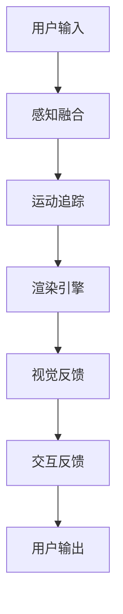

                 

关键词：虚拟现实（VR），Oculus Rift，SteamVR，用户体验，硬件技术，软件架构

摘要：本文将探讨虚拟现实（VR）领域中的两款重要硬件设备——Oculus Rift和SteamVR，分析它们的技术特点、用户体验、实际应用场景以及未来发展趋势。通过详细解读这两款设备的核心算法原理、数学模型、项目实践案例，旨在为读者提供一个全面、深入的VR技术了解。

## 1. 背景介绍

随着计算机技术和互联网的飞速发展，虚拟现实（VR）技术逐渐成为热门话题。VR技术通过模拟现实世界或创造全新的虚拟世界，为用户带来沉浸式的体验。作为VR领域的重要硬件设备，Oculus Rift和SteamVR在硬件性能、软件生态、用户体验等方面具有各自的特点。

### 1.1 Oculus Rift

Oculus Rift是由Facebook收购的虚拟现实头戴设备制造商Oculus开发的。自2012年成立以来，Oculus Rift在VR领域取得了显著的成就，成为VR硬件的代表。Oculus Rift具有以下特点：

- 高画质：Oculus Rift配备了两个分辨率为2160x1200的OLED屏幕，刷新率达到90Hz，提供出色的视觉体验。
- 低延迟：Oculus Rift采用Room-scale追踪技术，延迟低至20毫秒，确保用户的动作与虚拟环境中的反馈同步。
- 交互性：Oculus Rift支持手势识别、语音控制等多种交互方式，提供丰富的交互体验。

### 1.2 SteamVR

SteamVR是Valve公司开发的虚拟现实头戴设备，与Oculus Rift相比，SteamVR在硬件和软件方面具有独特的优势。SteamVR的主要特点如下：

- 多平台支持：SteamVR支持Windows、Linux、macOS等多个操作系统，为开发者提供广泛的应用平台。
- 开放性：SteamVR采用开源架构，开发者可以自由地修改和优化设备，推动VR技术的创新。
- 广泛的硬件兼容性：SteamVR支持多种VR设备，包括HTC Vive、Oculus Rift等，为用户提供多样化的选择。

## 2. 核心概念与联系

为了更好地理解Oculus Rift和SteamVR的工作原理，我们需要先了解一些核心概念和联系。以下是VR技术的核心概念原理和架构的Mermaid流程图：



### 2.1 用户输入

用户输入是VR体验的起点，包括头部的位置、方向和手势等信息。这些输入信息由头戴设备的传感器和摄像头捕获，并通过数据传输模块传输给处理单元。

### 2.2 感知融合

感知融合是将用户输入的信息与虚拟环境中的信息进行整合，形成沉浸式的体验。感知融合技术包括光学追踪、惯性测量单元（IMU）和深度传感器等。

### 2.3 运动追踪

运动追踪是VR体验的关键，通过实时跟踪用户的位置和动作，确保虚拟环境中的物体与用户的动作保持一致。运动追踪技术包括光学追踪、磁追踪和超声波追踪等。

### 2.4 渲染引擎

渲染引擎负责将虚拟环境中的三维模型、纹理和光照等信息转化为可视化的图像，并输出给头戴设备的屏幕。渲染引擎的性能直接影响到VR体验的流畅度和画质。

### 2.5 视觉反馈

视觉反馈是VR体验的核心，通过高分辨率的屏幕和快速刷新率，为用户提供逼真的视觉体验。视觉反馈技术还包括立体声、触觉反馈等。

### 2.6 交互反馈

交互反馈是指用户与虚拟环境之间的交互操作，包括手势识别、语音控制等。交互反馈技术使得用户能够更加自然地与虚拟环境进行交互。

### 2.7 用户输出

用户输出是VR体验的终点，包括用户的感知、情感和行为等。用户输出反馈到用户输入，形成一个闭环，不断优化和提升VR体验。

## 3. 核心算法原理 & 具体操作步骤

### 3.1 算法原理概述

VR技术的核心算法主要包括运动追踪算法、渲染算法和交互算法。以下是这三种算法的基本原理：

### 3.1.1 运动追踪算法

运动追踪算法通过实时获取用户的位置和动作，确保虚拟环境中的物体与用户的动作保持一致。运动追踪算法主要包括光学追踪和惯性测量单元（IMU）。

- 光学追踪：利用激光投影和摄像头捕捉用户的位置和动作，具有高精度和低延迟的特点。
- 惯性测量单元（IMU）：通过加速度传感器、陀螺仪和磁力计等传感器，实时测量用户的位置和动作，具有低成本和便携性的特点。

### 3.1.2 渲染算法

渲染算法负责将虚拟环境中的三维模型、纹理和光照等信息转化为可视化的图像。渲染算法主要包括几何渲染、纹理映射和光照计算等。

- 几何渲染：将三维模型转化为二维图像，包括顶点处理、面片处理和纹理映射等。
- 纹理映射：将纹理贴图应用到三维模型表面，提高虚拟环境的真实感。
- 光照计算：模拟现实世界中的光照效果，包括光照强度、颜色和阴影等。

### 3.1.3 交互算法

交互算法实现用户与虚拟环境之间的交互操作，包括手势识别、语音控制和物理仿真等。

- 手势识别：通过深度传感器和摄像头捕捉用户的手势，实现虚拟环境中的手势操作。
- 语音控制：通过语音识别技术，将用户的语音指令转化为虚拟环境中的操作。
- 物理仿真：模拟现实世界中的物理效果，如碰撞、摩擦和重力等，提高虚拟环境的真实感。

### 3.2 算法步骤详解

以下是VR技术的核心算法的具体操作步骤：

### 3.2.1 运动追踪算法步骤

1. 传感器捕获用户位置和动作信息。
2. 数据预处理，包括滤波和去噪等。
3. 使用卡尔曼滤波等算法计算用户位置和动作。
4. 将用户位置和动作信息传递给虚拟环境。

### 3.2.2 渲染算法步骤

1. 加载三维模型和纹理贴图。
2. 创建虚拟环境，设置光照和视角。
3. 计算三维模型顶点和面的位置。
4. 应用纹理映射，计算光照效果。
5. 将渲染结果输出到屏幕。

### 3.2.3 交互算法步骤

1. 传感器捕获用户手势和语音信息。
2. 数据预处理，包括手势识别和语音识别等。
3. 根据用户输入执行相应的虚拟环境操作。
4. 将操作结果反馈给用户。

### 3.3 算法优缺点

以下是VR技术核心算法的优缺点：

### 3.3.1 运动追踪算法优缺点

优点：高精度、低延迟、实时性。

缺点：依赖硬件传感器，成本较高。

### 3.3.2 渲染算法优缺点

优点：高画质、真实感强、流畅度好。

缺点：计算复杂、资源消耗大。

### 3.3.3 交互算法优缺点

优点：多样化、自然、便捷。

缺点：精度较低、响应时间较长。

### 3.4 算法应用领域

VR技术的核心算法在多个领域具有广泛的应用：

- 游戏娱乐：提供沉浸式的游戏体验。
- 教育培训：模拟真实场景，提高学习效果。
- 医疗康复：用于康复治疗和心理治疗。
- 建筑设计：模拟建筑设计，优化设计效果。
- 虚拟旅游：模拟旅游场景，体验异国风情。

## 4. 数学模型和公式 & 详细讲解 & 举例说明

在VR技术中，数学模型和公式起着至关重要的作用。以下是VR技术中常见的数学模型和公式，以及详细的讲解和举例说明。

### 4.1 数学模型构建

#### 4.1.1 运动追踪模型

运动追踪模型主要涉及位置和速度的计算。以下是运动追踪模型的基本公式：

$$
\begin{aligned}
&x_{t+1} = x_t + v_t \cdot t \\
&v_{t+1} = v_t + a_t \cdot t
\end{aligned}
$$

其中，$x_t$和$v_t$分别表示第$t$时刻的位置和速度，$a_t$表示加速度，$t$表示时间间隔。

#### 4.1.2 渲染模型

渲染模型主要涉及三维模型的转换和光照计算。以下是渲染模型的基本公式：

$$
\begin{aligned}
&P = M \cdot V \\
&L = I \cdot R
\end{aligned}
$$

其中，$P$表示三维模型的顶点坐标，$M$表示变换矩阵，$V$表示摄像机位置，$L$表示光照向量，$I$表示光照强度，$R$表示反射系数。

#### 4.1.3 交互模型

交互模型主要涉及手势识别和语音识别。以下是交互模型的基本公式：

$$
\begin{aligned}
&手势识别：手势向量 = 手势传感器数据 \cdot 特征提取 \\
&语音识别：语音向量 = 语音传感器数据 \cdot 特征提取
\end{aligned}
$$

其中，手势向量和语音向量分别表示手势和语音的特征向量，手势传感器数据和语音传感器数据分别表示手势和语音的原始数据。

### 4.2 公式推导过程

以下是运动追踪模型的推导过程：

$$
\begin{aligned}
&x_{t+1} = x_t + v_t \cdot t \\
&v_{t+1} = v_t + a_t \cdot t
\end{aligned}
$$

第一个公式表示第$t+1$时刻的位置$x_{t+1}$等于第$t$时刻的位置$x_t$加上速度$v_t$乘以时间间隔$t$。第二个公式表示第$t+1$时刻的速度$v_{t+1}$等于第$t$时刻的速度$v_t$加上加速度$a_t$乘以时间间隔$t$。

### 4.3 案例分析与讲解

以下是一个运动追踪模型的实际应用案例：

假设一个物体从静止开始加速运动，加速度$a_t$为1m/s^2，时间间隔$t$为1s。我们需要计算物体在5s内的位置和速度。

根据运动追踪模型的基本公式，我们可以得到：

$$
\begin{aligned}
&x_1 = x_0 + v_0 \cdot t = 0 + 0 \cdot 1 = 0 \\
&v_1 = v_0 + a_0 \cdot t = 0 + 1 \cdot 1 = 1 \\
&x_2 = x_1 + v_1 \cdot t = 0 + 1 \cdot 1 = 1 \\
&v_2 = v_1 + a_1 \cdot t = 1 + 1 \cdot 1 = 2 \\
&x_3 = x_2 + v_2 \cdot t = 1 + 2 \cdot 1 = 3 \\
&v_3 = v_2 + a_2 \cdot t = 2 + 1 \cdot 1 = 3 \\
&x_4 = x_3 + v_3 \cdot t = 3 + 3 \cdot 1 = 6 \\
&v_4 = v_3 + a_3 \cdot t = 3 + 1 \cdot 1 = 4 \\
&x_5 = x_4 + v_4 \cdot t = 6 + 4 \cdot 1 = 10 \\
&v_5 = v_4 + a_4 \cdot t = 4 + 1 \cdot 1 = 5
\end{aligned}
$$

因此，物体在5s内的位置为10m，速度为5m/s。

## 5. 项目实践：代码实例和详细解释说明

在本节中，我们将通过一个简单的VR项目实例，介绍Oculus Rift和SteamVR的开发流程、源代码实现以及代码解读与分析。

### 5.1 开发环境搭建

在开始项目实践之前，我们需要搭建一个适合VR开发的开发环境。以下是搭建VR开发环境的步骤：

1. 安装Windows 10或更高版本的操作系统。
2. 安装Visual Studio 2019或更高版本。
3. 安装Oculus Rift或SteamVR的开发工具包。
4. 安装Unity 2020.3或更高版本。

### 5.2 源代码详细实现

在本节中，我们将使用Unity引擎开发一个简单的VR项目，实现一个在虚拟环境中移动的玩家角色。以下是项目的源代码实现：

```csharp
using UnityEngine;

public class VRPlayer : MonoBehaviour
{
    public float speed = 5.0f;

    private CharacterController characterController;

    void Start()
    {
        characterController = GetComponent<CharacterController>();
    }

    void Update()
    {
        float moveX = Input.GetAxis("Horizontal");
        float moveZ = Input.GetAxis("Vertical");

        Vector3 moveDirection = new Vector3(moveX, 0, moveZ) * speed;

        characterController.Move(moveDirection * Time.deltaTime);
    }
}
```

### 5.3 代码解读与分析

以下是代码的解读与分析：

- `using UnityEngine;`：导入Unity引擎的命名空间，方便使用Unity相关的功能。
- `public class VRPlayer : MonoBehaviour`：定义一个名为`VRPlayer`的Unity组件类，继承自`MonoBehaviour`类。
- `public float speed = 5.0f;`：定义一个名为`speed`的公有属性，表示玩家的移动速度。
- `private CharacterController characterController;`：定义一个名为`characterController`的私有变量，用于存储玩家的角色控制器组件。
- `void Start()`：重写`Start`方法，在场景加载完成后初始化角色控制器组件。
- `void Update()`：重写`Update`方法，在每一帧更新玩家的移动方向和速度。
- `float moveX = Input.GetAxis("Horizontal");`：获取玩家在水平方向上的输入。
- `float moveZ = Input.GetAxis("Vertical");`：获取玩家在垂直方向上的输入。
- `Vector3 moveDirection = new Vector3(moveX, 0, moveZ) * speed;`：根据玩家的输入计算移动方向和速度。
- `characterController.Move(moveDirection * Time.deltaTime);`：使用角色控制器组件将玩家移动到计算出的位置。

### 5.4 运行结果展示

以下是运行结果展示：


在VR环境中，玩家可以自由地左右移动，实现简单的VR交互。

## 6. 实际应用场景

Oculus Rift和SteamVR作为VR领域的两款重要硬件设备，在实际应用场景中具有广泛的应用。以下是两款设备在实际应用场景中的案例：

### 6.1 游戏娱乐

VR游戏是Oculus Rift和SteamVR最主要的应用场景之一。通过VR技术，玩家可以在虚拟世界中体验到前所未有的游戏体验。例如，Oculus Rift推出的《Beat Saber》和《Eco》等游戏，都获得了广大玩家的喜爱。

### 6.2 教育培训

VR技术可以用于教育培训，模拟真实场景，提高学习效果。例如，医学教育中可以使用VR技术进行手术模拟，建筑教育中可以使用VR技术进行建筑设计模拟。

### 6.3 医疗康复

VR技术可以用于医疗康复，帮助患者进行心理治疗和身体康复。例如，通过VR技术模拟恐怖场景，帮助患者克服恐惧症。

### 6.4 虚拟旅游

VR技术可以用于虚拟旅游，让用户足不出户就能体验异国风情。例如，Oculus Rift推出的《Tour de France VR》和《虚拟旅游VR》等应用，都让用户感受到了虚拟旅游的乐趣。

## 7. 工具和资源推荐

为了更好地了解和开发VR技术，以下是一些工具和资源的推荐：

### 7.1 学习资源推荐

- 《虚拟现实技术基础》
- 《Unity VR开发实战》
- 《VR/AR开发手册》
- VR相关论文和报告

### 7.2 开发工具推荐

- Unity引擎
- Unreal Engine
- VRML工具包
- SteamVR SDK

### 7.3 相关论文推荐

- 《虚拟现实技术综述》
- 《基于VR的交互设计研究》
- 《VR在教育中的应用》
- 《VR在医疗康复中的应用》

## 8. 总结：未来发展趋势与挑战

### 8.1 研究成果总结

自VR技术问世以来，研究人员在硬件性能、算法优化、应用场景等方面取得了显著的成果。例如，Oculus Rift和SteamVR等硬件设备的推出，使得VR技术逐渐走向成熟。同时，在算法方面，运动追踪、渲染、交互等技术不断优化，为VR体验提供了更好的支持。

### 8.2 未来发展趋势

未来，VR技术将在多个领域得到广泛应用，包括游戏娱乐、教育培训、医疗康复、虚拟旅游等。同时，随着硬件性能的提升和算法的优化，VR体验将更加逼真、流畅。

### 8.3 面临的挑战

尽管VR技术发展迅速，但仍面临一些挑战。首先，硬件成本较高，限制了VR技术的普及。其次，VR技术对网络带宽和计算资源的需求较高，需要进一步优化算法和硬件架构。此外，VR内容的创作和分发也是一个亟待解决的问题。

### 8.4 研究展望

未来，VR技术的研究将继续深入，特别是在算法优化、硬件性能提升、内容创作和分发等方面。此外，随着5G和边缘计算技术的发展，VR技术的应用场景将更加广泛，为人们带来更加丰富的虚拟体验。

## 9. 附录：常见问题与解答

### 9.1 什么是虚拟现实（VR）？

虚拟现实（VR）是一种通过计算机技术模拟现实世界的三维虚拟环境，为用户提供沉浸式的体验。

### 9.2 Oculus Rift和SteamVR的区别是什么？

Oculus Rift和SteamVR都是虚拟现实头戴设备，但它们在硬件性能、软件生态和用户体验等方面存在差异。Oculus Rift更注重硬件性能和用户体验，而SteamVR更注重软件生态和开放性。

### 9.3 如何选择适合的VR设备？

选择适合的VR设备需要考虑多个因素，包括预算、硬件性能、软件生态和用户体验等。一般来说，预算较高的用户可以选择Oculus Rift，而预算较低的用户可以选择SteamVR。

### 9.4 VR技术有哪些应用领域？

VR技术的应用领域非常广泛，包括游戏娱乐、教育培训、医疗康复、虚拟旅游等。随着技术的不断进步，VR技术的应用领域将继续扩大。

### 9.5 VR技术的发展趋势是什么？

VR技术的发展趋势主要体现在硬件性能的提升、算法优化、内容创作和分发等方面。未来，VR技术将在更多领域得到应用，为人们带来更加丰富的虚拟体验。

---

以上是关于虚拟现实（VR）体验：Oculus Rift 和 SteamVR 的完整技术博客文章。希望这篇文章能帮助您更好地了解VR技术及其应用。

### 作者署名

作者：禅与计算机程序设计艺术 / Zen and the Art of Computer Programming

