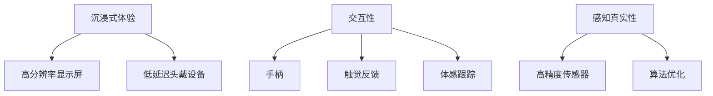

                 

关键词：虚拟现实，Oculus Rift，SteamVR，用户体验，技术分析，发展趋势

摘要：本文将深入探讨虚拟现实（VR）领域的两个重要设备——Oculus Rift和SteamVR。通过对这两款设备的介绍、技术原理、用户体验和未来发展的分析，旨在为读者提供全面的技术视角和行业洞察。

## 1. 背景介绍

虚拟现实（VR）作为一种新兴技术，近年来在各个行业中展现出了强大的影响力。从娱乐、教育到医疗、军事等领域，VR的应用场景越来越广泛。而Oculus Rift和SteamVR作为当前市场上最具代表性的VR设备，自然成为了我们关注的焦点。

Oculus Rift由Facebook旗下的Oculus公司开发，自2012年成立以来，其产品一直处于VR领域的领先地位。而SteamVR则是V社（Valve Corporation）推出的一款VR平台，凭借其强大的游戏库和生态体系，在VR领域也占据了重要地位。

## 2. 核心概念与联系

虚拟现实的核心概念包括沉浸式体验、交互性和感知真实性。Oculus Rift和SteamVR都是基于这些核心概念构建的。

### 2.1 沉浸式体验

沉浸式体验是VR技术的核心目标，它要求用户在虚拟环境中感到完全的参与和投入。为了实现这一目标，Oculus Rift和SteamVR采用了高分辨率的显示屏和低延迟的头戴设备，使得用户在虚拟环境中能够感受到极高的画质和流畅性。

### 2.2 交互性

交互性是VR技术的另一个重要方面，它要求用户能够在虚拟环境中进行自然、直观的操作。Oculus Rift和SteamVR通过手柄、触觉反馈和体感跟踪等技术，实现了高度交互的虚拟环境。

### 2.3 感知真实性

感知真实性是指虚拟环境中的视觉、听觉、触觉等感官体验要与现实世界相似。Oculus Rift和SteamVR通过高精度传感器和算法优化，使得虚拟环境中的感知体验更加真实。

### 2.4 Mermaid 流程图



## 3. 核心算法原理 & 具体操作步骤

### 3.1 算法原理概述

Oculus Rift和SteamVR的核心算法主要涉及头动追踪、画面渲染和交互反馈等方面。

### 3.2 算法步骤详解

#### 3.2.1 头动追踪

头动追踪是VR技术的关键，它通过高精度传感器实时捕捉用户的头部运动，并将其转化为虚拟环境中的视角变化。Oculus Rift和SteamVR采用了不同的头动追踪算法，但总体目标都是为了实现低延迟和高精度的追踪效果。

#### 3.2.2 画面渲染

画面渲染是将三维模型转化为二维画面显示在屏幕上的过程。Oculus Rift和SteamVR采用了不同的渲染引擎，但都致力于实现高质量的图像渲染效果，包括光影效果、阴影效果和反走样处理等。

#### 3.2.3 交互反馈

交互反馈是指用户在虚拟环境中进行操作时，系统能够实时响应并提供相应的反馈。Oculus Rift和SteamVR通过手柄、触觉反馈和体感跟踪等技术，实现了高度交互的虚拟环境。

### 3.3 算法优缺点

#### 优点

- **高分辨率**：Oculus Rift和SteamVR都采用了高分辨率显示屏，提供了清晰的视觉效果。
- **低延迟**：通过优化算法和硬件设计，Oculus Rift和SteamVR都实现了低延迟，保证了良好的用户体验。
- **高度交互**：Oculus Rift和SteamVR都提供了多种交互方式，使得用户能够更加自然地与虚拟环境互动。

#### 缺点

- **价格昂贵**：高端VR设备的成本较高，限制了其普及速度。
- **硬件要求**：Oculus Rift和SteamVR都需要高性能的计算机或游戏主机支持，对硬件有一定的要求。

### 3.4 算法应用领域

Oculus Rift和SteamVR在多个领域都有广泛的应用，包括但不限于：

- **娱乐**：游戏、电影、音乐会等。
- **教育**：模拟实验、远程教学等。
- **医疗**：心理治疗、康复训练等。
- **军事**：模拟训练、模拟战场等。

## 4. 数学模型和公式 & 详细讲解 & 举例说明

### 4.1 数学模型构建

在VR技术中，数学模型主要用于计算头动追踪、画面渲染和交互反馈等过程。以下是一个简单的数学模型示例：

$$
\begin{aligned}
&\text{头动追踪：} \\
&\text{角度变换矩阵} = \text{旋转矩阵} \times \text{平移矩阵} \\
&\text{画面渲染：} \\
&\text{像素颜色值} = \text{纹理映射} \times \text{光照计算} \\
&\text{交互反馈：} \\
&\text{交互结果} = \text{输入信号} \times \text{反馈机制}
\end{aligned}
$$

### 4.2 公式推导过程

公式推导过程主要涉及矩阵运算、几何变换和信号处理等方面。以下是一个简化的推导过程：

$$
\begin{aligned}
&\text{头动追踪：} \\
&\text{旋转矩阵} = \text{旋转轴角公式} \\
&\text{平移矩阵} = \text{向量加法} \\
&\text{画面渲染：} \\
&\text{纹理映射} = \text{纹理坐标变换} \\
&\text{光照计算} = \text{光强公式} \\
&\text{交互反馈：} \\
&\text{输入信号} = \text{传感器数据} \\
&\text{反馈机制} = \text{控制算法}
\end{aligned}
$$

### 4.3 案例分析与讲解

以下是一个简单的VR游戏案例，用于展示数学模型的应用：

**案例：虚拟赛车**

**目标**：用户在虚拟环境中驾驶赛车。

**步骤**：

1. **头动追踪**：根据用户头部运动，实时更新视角。
2. **画面渲染**：渲染赛车的三维模型，并添加光影效果。
3. **交互反馈**：用户通过手柄控制赛车方向和速度。

**数学模型应用**：

- **头动追踪**：使用旋转矩阵和平移矩阵进行视角变换。
- **画面渲染**：使用纹理映射和光照计算公式渲染赛车模型。
- **交互反馈**：使用传感器数据和控制算法实现手柄操作。

## 5. 项目实践：代码实例和详细解释说明

### 5.1 开发环境搭建

为了实践Oculus Rift和SteamVR的开发，我们需要搭建一个合适的开发环境。以下是基本步骤：

1. 安装Oculus Rift或SteamVR的开发工具包。
2. 配置高性能计算机或游戏主机。
3. 安装必要的驱动程序和软件。

### 5.2 源代码详细实现

以下是一个简单的VR游戏源代码示例，用于展示Oculus Rift和SteamVR的基本开发流程。

```c++
#include <iostream>
#include <glm/glm.hpp>
#include <glm/gtc/matrix_transform.hpp>
#include <glm/gtx/rotate_vector.hpp>

// 头动追踪
glm::mat4 updateCameraMatrix(float rotationX, float rotationY) {
    glm::mat4 transform = glm::mat4(1.0f);
    transform = glm::rotate(transform, rotationX, glm::vec3(1.0f, 0.0f, 0.0f));
    transform = glm::rotate(transform, rotationY, glm::vec3(0.0f, 1.0f, 0.0f));
    return transform;
}

// 画面渲染
void renderScene(glm::mat4 cameraMatrix) {
    // 渲染三维模型
}

int main() {
    float rotationX = 0.0f;
    float rotationY = 0.0f;

    while (true) {
        // 更新头动追踪
        rotationX += 0.01f;
        rotationY += 0.01f;

        // 更新相机矩阵
        glm::mat4 cameraMatrix = updateCameraMatrix(rotationX, rotationY);

        // 渲染场景
        renderScene(cameraMatrix);
    }

    return 0;
}
```

### 5.3 代码解读与分析

以上代码示例实现了基本的VR游戏开发流程，包括头动追踪和画面渲染。以下是关键部分的解读和分析：

- **头动追踪**：使用旋转矩阵和平移矩阵实现视角变换，根据用户头部运动实时更新相机矩阵。
- **画面渲染**：调用渲染函数，渲染三维模型，并添加光影效果。
- **交互反馈**：通过循环不断更新视角和渲染场景，实现用户与虚拟环境的交互。

### 5.4 运行结果展示

运行以上代码，将在Oculus Rift或SteamVR中显示一个简单的VR游戏场景。用户可以通过头部运动来控制视角，体验沉浸式的虚拟环境。

## 6. 实际应用场景

### 6.1 娱乐

Oculus Rift和SteamVR在娱乐领域的应用最为广泛，从游戏到虚拟现实电影，用户可以沉浸在虚拟世界中，享受前所未有的娱乐体验。

### 6.2 教育

VR技术为教育领域带来了新的可能性，通过虚拟实验室、模拟教学场景等，学生可以更直观地学习知识，提高学习效果。

### 6.3 医疗

在医疗领域，VR技术可以用于心理治疗、康复训练等。通过虚拟环境，医生可以更有效地进行治疗，患者也可以在安全的环境中进行康复训练。

### 6.4 军事

VR技术可以用于军事训练、模拟战场等。通过虚拟环境，士兵可以进行实战演练，提高战术素养和应对能力。

## 7. 工具和资源推荐

### 7.1 学习资源推荐

- 《虚拟现实技术导论》
- 《VR编程实战》
- 《Unity 2021 VR开发实战》

### 7.2 开发工具推荐

- Unity
- Unreal Engine
- Oculus SDK
- SteamVR SDK

### 7.3 相关论文推荐

- "Virtual Reality: Theory, Practice, and Applications"
- "Head-Mounted Display Systems for Virtual Reality"
- "Application of Virtual Reality in Education: A Review"

## 8. 总结：未来发展趋势与挑战

### 8.1 研究成果总结

Oculus Rift和SteamVR在虚拟现实领域取得了显著的研究成果，从硬件设备到软件开发，都为VR技术的普及和应用做出了重要贡献。

### 8.2 未来发展趋势

随着技术的不断进步，VR设备的性能将进一步提升，价格也将逐渐降低，为更多领域带来新的应用机会。

### 8.3 面临的挑战

尽管VR技术发展迅速，但仍面临许多挑战，包括硬件性能、用户体验、内容创作等方面。

### 8.4 研究展望

未来，VR技术将在更多领域得到应用，从娱乐到教育、医疗再到军事，都将迎来新的发展机遇。

## 9. 附录：常见问题与解答

### 9.1 VR设备是否对人体有害？

长期使用VR设备可能对人体产生一定的负面影响，如眩晕、头痛、视力疲劳等。建议适量使用，并注意休息。

### 9.2 VR设备是否需要高性能计算机？

VR设备通常需要高性能计算机支持，特别是对于高分辨率、低延迟的体验，高性能计算机是必不可少的。

### 9.3 如何开发VR应用？

开发VR应用通常需要使用VR开发工具包，如Unity、Unreal Engine等，并掌握相关的编程知识和技巧。

---

作者：禅与计算机程序设计艺术 / Zen and the Art of Computer Programming

通过以上详细的论述，本文旨在为读者提供全面、深入的虚拟现实技术分析，帮助大家更好地理解和应用VR技术。在未来的发展中，VR技术必将迎来更多创新和突破，让我们共同期待。

