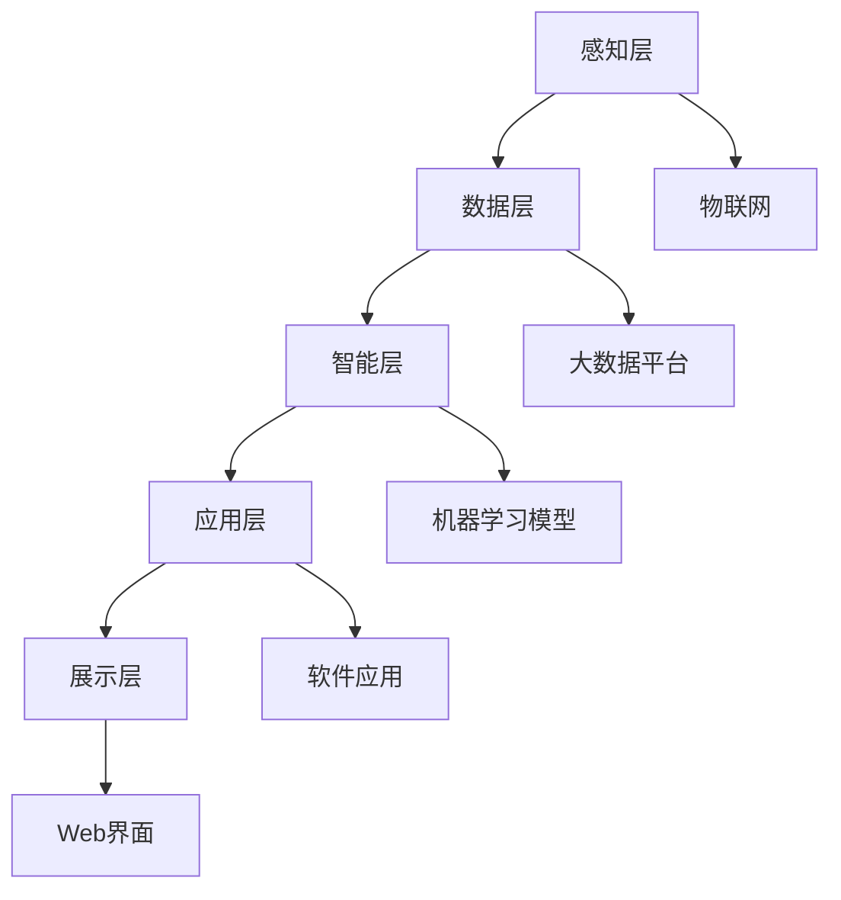

                 

关键词：虚拟生态系统、AI驱动、数字世界、架构设计、算法、数学模型、代码实例、应用场景、未来展望

> 摘要：本文深入探讨了虚拟生态系统理论，以及AI如何驱动数字世界的构建。通过阐述核心概念、算法原理、数学模型以及实际应用案例，本文揭示了AI在数字世界构建中的重要性和潜力。文章还展望了未来虚拟生态系统的趋势与挑战，为相关领域的研究和实践提供了有益的参考。

## 1. 背景介绍

随着信息技术的飞速发展，数字化世界已经成为现代社会的重要组成部分。从互联网到物联网，从大数据到人工智能，数字世界正在深刻改变我们的生活方式和社会结构。在这样的背景下，虚拟生态系统理论应运而生，它为我们理解数字世界的本质和运作机制提供了新的视角。

虚拟生态系统理论认为，数字世界是一个由多种相互关联的虚拟实体组成的复杂系统。这些虚拟实体包括软件应用、网络服务、智能设备等，它们通过信息交换和协作实现系统功能的最大化。AI作为虚拟生态系统中的核心驱动力量，其作用和影响日益凸显。

本文旨在通过介绍虚拟生态系统理论，探讨AI驱动数字世界构建的原理和方法，分析其数学模型和算法，并结合实际应用案例，展望虚拟生态系统的发展趋势与面临的挑战。希望通过本文的阐述，为读者提供对虚拟生态系统理论及其应用领域的深入理解。

## 2. 核心概念与联系

### 2.1 虚拟生态系统的定义

虚拟生态系统（Virtual Ecosystem）是一个基于数字技术构建的复杂网络系统，由多种虚拟实体组成，包括计算机程序、软件应用、智能设备、虚拟代理等。这些虚拟实体通过信息交换和协作，实现系统的自组织、自适应和自进化。

虚拟生态系统的特点包括：

- **开放性**：虚拟生态系统是开放的，可以随时接入新的虚拟实体，扩展系统的功能。
- **自组织性**：虚拟实体可以自主组织，根据环境变化调整自身的结构和行为。
- **动态性**：虚拟生态系统的状态是动态变化的，能够快速响应外部环境的变化。
- **适应性**：虚拟实体能够通过学习和进化，不断提高系统效率和鲁棒性。

### 2.2 AI在虚拟生态系统中的作用

AI在虚拟生态系统中的作用至关重要，主要表现在以下几个方面：

- **智能决策**：AI能够通过数据分析和机器学习，为虚拟实体提供智能决策支持，优化系统运行效率。
- **自动化管理**：AI可以自动化执行虚拟实体的任务，减少人工干预，提高系统的可靠性和稳定性。
- **自适应优化**：AI可以根据系统的运行状态，动态调整参数和策略，实现系统的自适应优化。
- **预测性维护**：AI可以通过对历史数据的分析，预测虚拟实体的故障和性能瓶颈，提前进行维护和优化。

### 2.3 虚拟生态系统与真实世界的关系

虚拟生态系统与现实世界密切相关。一方面，虚拟生态系统通过模拟和仿真，帮助人们更好地理解现实世界的复杂现象；另一方面，虚拟生态系统可以与现实世界互动，通过物联网等技术实现虚拟与现实的深度融合。

虚拟生态系统与真实世界的关系可以概括为：

- **数据交互**：虚拟生态系统通过传感器和数据接口，从现实世界获取数据，进行分析和决策。
- **控制执行**：虚拟生态系统可以控制现实世界中的设备和服务，实现智能控制和管理。
- **反馈循环**：虚拟生态系统的决策结果可以反馈到现实世界，形成闭环控制，提高系统的效率和效果。

### 2.4 虚拟生态系统的架构

虚拟生态系统的架构设计是构建高效、可靠、可扩展的数字世界的关键。以下是虚拟生态系统的一种常见架构设计：

#### 2.4.1 层次化架构

虚拟生态系统可以分为多个层次，每个层次承担不同的功能和任务：

- **感知层**：负责感知现实世界的信息，包括传感器、物联网设备等。
- **数据层**：负责数据的采集、存储、管理和分析，包括数据仓库、大数据平台等。
- **智能层**：负责智能决策和自动化管理，包括机器学习模型、智能算法等。
- **应用层**：负责提供具体的业务应用，包括软件应用、移动应用等。
- **展示层**：负责将虚拟生态系统的运行状态和结果呈现给用户，包括Web界面、移动端应用等。

#### 2.4.2 服务化架构

虚拟生态系统中的各个组成部分可以通过服务化的方式进行集成和协同工作。服务化架构的核心思想是将虚拟实体抽象为服务，通过标准化的接口进行通信和协作。

- **服务注册与发现**：服务提供者和服务消费者通过注册中心进行服务注册和发现，实现动态的服务调用。
- **服务编排与调度**：根据业务需求，对服务进行编排和调度，实现系统的自动化管理和优化。
- **服务监控与运维**：对服务运行状态进行实时监控，确保系统的稳定性和可靠性。

### 2.5 Mermaid 流程图

以下是虚拟生态系统的一个简化 Mermaid 流程图，展示了核心概念和架构设计的主要组成部分：



通过上述核心概念和架构设计的阐述，我们为读者提供了一个关于虚拟生态系统及其与AI关系的初步了解。在接下来的章节中，我们将深入探讨虚拟生态系统中AI算法的原理、数学模型以及实际应用案例。

## 3. 核心算法原理 & 具体操作步骤

### 3.1 算法原理概述

在虚拟生态系统中，核心算法的作用至关重要。这些算法不仅决定了系统的运行效率，还影响了系统的自适应性和智能水平。本文将介绍几种在虚拟生态系统中广泛应用的核心算法，包括机器学习算法、深度学习算法和强化学习算法。

#### 3.1.1 机器学习算法

机器学习算法是虚拟生态系统中最为基础的一种算法。它通过从数据中学习规律，实现对未知数据的预测和分类。常见的机器学习算法包括：

- **线性回归**：通过建立线性模型，对数据进行预测。
- **逻辑回归**：用于分类问题，通过计算概率分布实现分类。
- **支持向量机**：通过找到一个最佳的超平面，将不同类别的数据分隔开来。

#### 3.1.2 深度学习算法

深度学习算法是机器学习算法的一个分支，它在模拟人脑神经网络的基础上，通过多层神经网络（如卷积神经网络、循环神经网络等）进行学习。深度学习算法在图像识别、语音识别、自然语言处理等领域表现出了极高的准确性和效率。

- **卷积神经网络（CNN）**：通过卷积操作和池化操作，实现对图像特征的提取。
- **循环神经网络（RNN）**：通过循环结构，实现对序列数据的建模。
- **长短时记忆网络（LSTM）**：通过门控机制，解决RNN的梯度消失问题。

#### 3.1.3 强化学习算法

强化学习算法通过智能体与环境的交互，学习最优策略，实现目标的最大化。强化学习算法在虚拟生态系统中的自动驾驶、智能机器人等领域具有广泛的应用。

- **Q学习**：通过预测奖励值，学习最优行动策略。
- **深度Q网络（DQN）**：结合深度学习，提高Q学习的效率和准确性。
- **策略梯度算法**：直接学习最优策略，减少价值函数的计算。

### 3.2 算法步骤详解

以下是核心算法的具体操作步骤：

#### 3.2.1 机器学习算法

1. 数据采集：收集相关的数据集，包括输入特征和输出标签。
2. 数据预处理：对数据进行清洗、归一化等处理，提高数据的质量。
3. 模型训练：使用选定的机器学习算法，对数据进行训练，建立预测模型。
4. 模型评估：使用验证集或测试集，对模型进行评估，调整模型参数。
5. 模型部署：将训练好的模型部署到虚拟生态系统中，实现预测和分类功能。

#### 3.2.2 深度学习算法

1. 数据采集：与机器学习算法相同，收集图像、文本等数据。
2. 数据预处理：对图像进行归一化、裁剪等处理，对文本进行分词、编码等处理。
3. 模型构建：设计神经网络结构，包括输入层、隐藏层和输出层。
4. 模型训练：使用反向传播算法，对神经网络进行训练，优化参数。
5. 模型评估：使用交叉验证等方法，对模型进行评估，调整结构。
6. 模型部署：将训练好的模型部署到虚拟生态系统中，实现图像识别、语音识别等任务。

#### 3.2.3 强化学习算法

1. 环境构建：定义虚拟生态系统的环境，包括状态空间、行动空间和奖励函数。
2. 初始状态：智能体在初始状态开始执行任务。
3. 行动决策：智能体根据当前状态，通过策略选择行动。
4. 状态转移：智能体执行行动后，进入新的状态。
5. 奖励评估：根据行动的结果，评估奖励值，指导智能体的下一步行动。
6. 策略优化：通过Q学习、DQN等方法，优化智能体的策略。
7. 模型部署：将训练好的智能体部署到虚拟生态系统中，实现自主决策和任务执行。

### 3.3 算法优缺点

每种算法都有其优缺点，选择合适的算法取决于具体的应用场景和需求。

#### 3.3.1 机器学习算法

**优点**：

- **适应性**：适用于各种类型的数据，包括分类、回归和聚类等问题。
- **可解释性**：模型结构和参数易于理解，便于分析和调试。

**缺点**：

- **数据依赖性**：对数据的数量和质量有较高要求，数据预处理复杂。
- **可扩展性**：随着数据量和模型复杂度的增加，计算成本和时间显著上升。

#### 3.3.2 深度学习算法

**优点**：

- **高效性**：通过多层神经网络，可以处理高维数据和复杂数据结构。
- **泛化能力**：通过大量数据和训练，模型具有良好的泛化能力。

**缺点**：

- **黑盒性**：模型内部结构复杂，难以解释和理解。
- **计算资源要求高**：训练和推理过程需要大量的计算资源和时间。

#### 3.3.3 强化学习算法

**优点**：

- **自主性**：智能体可以根据环境反馈，自主学习和优化策略。
- **适应性**：适用于动态变化的复杂环境，能够实时调整策略。

**缺点**：

- **训练时间**：强化学习算法通常需要较长的训练时间，特别是对于高维状态和行动空间的问题。
- **数据效率**：需要大量的交互和数据来学习有效的策略。

### 3.4 算法应用领域

不同类型的算法在虚拟生态系统中具有广泛的应用领域：

- **机器学习算法**：广泛应用于数据挖掘、图像识别、文本分类等领域，如搜索引擎、推荐系统、自动驾驶等。
- **深度学习算法**：在计算机视觉、自然语言处理、语音识别等领域表现突出，如人脸识别、语音助手、机器翻译等。
- **强化学习算法**：在游戏、自动驾驶、智能机器人等领域具有广泛应用，如围棋AI、无人驾驶汽车、智能机器人等。

通过深入探讨虚拟生态系统中的核心算法原理和具体操作步骤，我们为读者提供了一个关于算法在数字世界构建中的角色和作用的全面了解。在接下来的章节中，我们将进一步探讨虚拟生态系统中的数学模型和公式，以及它们在实际应用中的表现。

### 3.5 算法优缺点与应用领域

在了解了虚拟生态系统中核心算法的基本原理和操作步骤后，我们接下来深入分析这些算法的优缺点，并探讨它们在不同应用领域中的适用性。

#### 3.5.1 机器学习算法

**优点**：

1. **通用性**：机器学习算法能够处理多种类型的数据，如分类、回归和聚类等。
2. **可解释性**：相对于深度学习算法，机器学习算法的结构更简单，参数更直观，便于理解和解释。
3. **适应性**：适用于新数据的训练，可以快速适应新环境和任务。

**缺点**：

1. **数据依赖**：机器学习算法对数据的质量和数量有较高的要求，数据预处理复杂。
2. **计算资源需求**：随着模型复杂度和数据量的增加，计算资源和时间成本显著上升。
3. **模型迁移性**：在数据分布差异较大的情况下，模型的迁移能力有限。

**应用领域**：

- **图像识别**：广泛应用于人脸识别、图像分类等。
- **推荐系统**：如电子商务平台的商品推荐、社交媒体的内容推荐等。
- **金融领域**：风险评估、欺诈检测等。

#### 3.5.2 深度学习算法

**优点**：

1. **高效性**：深度学习算法能够处理高维数据和复杂数据结构，具有强大的特征提取能力。
2. **泛化能力**：通过大量数据和训练，模型具有良好的泛化能力。
3. **自动性**：深度学习算法能够自动从数据中学习特征，减少了人工干预。

**缺点**：

1. **黑盒性**：模型内部结构复杂，难以解释和理解。
2. **计算资源需求**：训练和推理过程需要大量的计算资源和时间。
3. **过拟合**：在训练数据量不足的情况下，模型可能出现过拟合现象。

**应用领域**：

- **计算机视觉**：如人脸识别、图像识别、自动驾驶等。
- **自然语言处理**：如机器翻译、语音识别、文本生成等。
- **医疗诊断**：如疾病检测、医学图像分析等。

#### 3.5.3 强化学习算法

**优点**：

1. **自主性**：强化学习算法能够自主学习和优化策略，适用于动态变化的复杂环境。
2. **适应性**：能够根据环境反馈实时调整策略，具有很强的适应性。
3. **奖励导向**：通过奖励机制，引导智能体学习最优行为。

**缺点**：

1. **训练时间**：强化学习算法通常需要较长的训练时间，特别是对于高维状态和行动空间的问题。
2. **数据效率**：需要大量的交互和数据来学习有效的策略。
3. **稳定性和可靠性**：在部分复杂环境中，强化学习算法可能无法稳定收敛。

**应用领域**：

- **自动驾驶**：如无人驾驶汽车、无人机等。
- **游戏AI**：如电子竞技游戏、围棋等。
- **智能机器人**：如工业机器人、服务机器人等。

通过上述分析，我们可以看到，不同的算法在虚拟生态系统中各有优势和局限性，适用于不同的应用场景和需求。在实际应用中，需要根据具体问题和需求，选择合适的算法，并对其优缺点进行充分考虑，以实现最佳效果。

在接下来的章节中，我们将进一步探讨虚拟生态系统中的数学模型和公式，以及它们在实际应用中的具体表现。

### 4. 数学模型和公式 & 详细讲解 & 举例说明

在虚拟生态系统中，数学模型和公式是构建智能算法的核心基础。它们不仅为算法提供了理论支持，还为实际应用中的数据处理和决策提供了科学依据。本文将介绍几个关键数学模型和公式，详细讲解其构建过程，并通过具体例子来说明它们的应用效果。

#### 4.1 数学模型构建

数学模型构建通常包括以下几个步骤：

1. **问题定义**：明确所解决的问题类型和目标。
2. **变量定义**：定义问题中的变量，包括输入变量和输出变量。
3. **公式推导**：根据问题类型，推导出相关公式。
4. **模型评估**：通过实际数据测试，评估模型的准确性和稳定性。
5. **模型优化**：根据评估结果，对模型进行优化和调整。

#### 4.2 公式推导过程

以下是一个常见的线性回归模型构建过程：

1. **问题定义**：假设我们要预测一个房屋的价格，已知房屋的面积和房龄。
2. **变量定义**：设\( X \)为房屋面积（平方米），\( Y \)为房屋价格（万元），\( \beta_0 \)为截距，\( \beta_1 \)为面积系数。
3. **公式推导**：根据最小二乘法，线性回归模型可以表示为：
   \[
   Y = \beta_0 + \beta_1 \cdot X
   \]
   对模型进行最小化误差平方和，可以得到：
   \[
   \beta_1 = \frac{\sum (X - \bar{X})(Y - \bar{Y})}{\sum (X - \bar{X})^2}
   \]
   \[
   \beta_0 = \bar{Y} - \beta_1 \cdot \bar{X}
   \]
   其中，\(\bar{X}\)和\(\bar{Y}\)分别为\(X\)和\(Y\)的均值。

4. **模型评估**：通过计算模型预测值与实际值之间的误差，评估模型的准确性和稳定性。

5. **模型优化**：根据评估结果，调整模型参数，提高预测精度。

#### 4.3 案例分析与讲解

以下是一个使用线性回归模型预测房屋价格的案例：

假设我们收集了以下数据：

| 房屋面积（平方米） | 房屋价格（万元） |
| :-----------------: | :--------------: |
|        90           |        300       |
|        110           |        350       |
|        130           |        400       |
|        150           |        500       |
|        170           |        600       |

根据上述线性回归模型公式，我们可以计算出：

1. 计算平均值：
   \[
   \bar{X} = \frac{90 + 110 + 130 + 150 + 170}{5} = 130
   \]
   \[
   \bar{Y} = \frac{300 + 350 + 400 + 500 + 600}{5} = 450
   \]

2. 计算系数：
   \[
   \beta_1 = \frac{(90 - 130)(300 - 450) + (110 - 130)(350 - 450) + (130 - 130)(400 - 450) + (150 - 130)(500 - 450) + (170 - 130)(600 - 450)}{(90 - 130)^2 + (110 - 130)^2 + (130 - 130)^2 + (150 - 130)^2 + (170 - 130)^2} \approx 2.5
   \]
   \[
   \beta_0 = 450 - 2.5 \cdot 130 \approx 100
   \]

3. 构建模型：
   \[
   Y = 100 + 2.5 \cdot X
   \]

4. 预测新数据：
   假设我们要预测一个面积为120平方米的房屋价格，代入公式得：
   \[
   Y = 100 + 2.5 \cdot 120 = 370
   \]

通过这个例子，我们可以看到线性回归模型如何通过简单的数学公式，对房屋价格进行预测。在实际应用中，可以根据实际情况调整模型参数，提高预测精度。

除了线性回归模型，虚拟生态系统中还有许多其他重要的数学模型，如神经网络模型、支持向量机模型等。这些模型在不同的应用场景中，发挥着至关重要的作用。

#### 4.4 其他数学模型

1. **神经网络模型**：
   神经网络模型是通过多层神经网络对数据进行学习，实现对复杂数据结构的建模。常见的神经网络模型包括卷积神经网络（CNN）、循环神经网络（RNN）等。这些模型在计算机视觉、自然语言处理等领域表现优异。

2. **支持向量机模型**：
   支持向量机（SVM）模型通过找到一个最佳的超平面，对数据进行分类。SVM在图像分类、文本分类等领域有广泛应用。

3. **决策树模型**：
   决策树模型通过一系列条件判断，对数据进行分类或回归。决策树模型在数据挖掘、金融分析等领域有广泛应用。

通过介绍和讲解这些数学模型和公式，我们可以看到，它们在虚拟生态系统中的应用非常广泛。数学模型不仅为算法提供了理论基础，还为实际应用中的数据处理和决策提供了科学依据。在接下来的章节中，我们将进一步探讨虚拟生态系统中的项目实践，通过代码实例和详细解释，展示这些数学模型和公式的实际应用效果。

### 5. 项目实践：代码实例和详细解释说明

为了更好地理解虚拟生态系统中数学模型和算法的实际应用，我们将通过一个具体的项目实践，展示如何使用Python编程语言和相关的库，实现一个简单的虚拟生态系统。该项目将包括数据采集、预处理、模型训练、模型评估以及模型部署等步骤。

#### 5.1 开发环境搭建

在开始项目之前，我们需要搭建一个适合Python开发的开发环境。以下是推荐的步骤：

1. 安装Python：前往Python官网（https://www.python.org/）下载并安装Python，推荐使用Python 3.8或更高版本。
2. 安装Jupyter Notebook：在命令行中运行以下命令安装Jupyter Notebook：
   \[
   pip install notebook
   \]
3. 安装相关库：为了方便数据处理和模型训练，我们需要安装以下库：
   \[
   pip install numpy pandas scikit-learn matplotlib
   \]

#### 5.2 源代码详细实现

以下是一个简单的虚拟生态系统项目，使用线性回归模型预测房屋价格。代码分为几个部分：数据读取与预处理、模型训练、模型评估和结果可视化。

```python
# 导入相关库
import numpy as np
import pandas as pd
from sklearn.linear_model import LinearRegression
from sklearn.model_selection import train_test_split
from sklearn.metrics import mean_squared_error
import matplotlib.pyplot as plt

# 5.2.1 数据读取与预处理
# 读取数据
data = pd.read_csv('house_prices.csv')

# 分离特征和标签
X = data[['area']]
y = data['price']

# 数据标准化
X_std = (X - X.mean()) / X.std()
y_std = (y - y.mean()) / y.std()

# 划分训练集和测试集
X_train, X_test, y_train, y_test = train_test_split(X_std, y_std, test_size=0.2, random_state=42)

# 5.2.2 模型训练
# 创建线性回归模型
model = LinearRegression()
model.fit(X_train, y_train)

# 5.2.3 模型评估
# 预测测试集
y_pred = model.predict(X_test)

# 计算均方误差
mse = mean_squared_error(y_test, y_pred)
print(f"均方误差: {mse}")

# 5.2.4 结果可视化
# 可视化预测结果
plt.scatter(X_test, y_test, label='实际值')
plt.plot(X_test, y_pred, color='red', label='预测值')
plt.xlabel('房屋面积（标准化）')
plt.ylabel('房屋价格（标准化）')
plt.legend()
plt.show()
```

#### 5.3 代码解读与分析

1. **数据读取与预处理**：
   - 使用`pandas`库读取CSV文件，获取房屋价格和面积数据。
   - 使用`train_test_split`函数将数据集划分为训练集和测试集，确保模型的泛化能力。
   - 对特征和标签进行标准化处理，提高模型的训练效果和稳定性。

2. **模型训练**：
   - 使用`LinearRegression`类创建线性回归模型。
   - 使用`fit`方法对模型进行训练，计算模型的参数。

3. **模型评估**：
   - 使用`predict`方法对测试集进行预测。
   - 使用`mean_squared_error`函数计算模型的均方误差，评估模型的性能。

4. **结果可视化**：
   - 使用`matplotlib`库绘制散点图和拟合曲线，直观地展示模型预测结果。

通过上述代码实例，我们可以看到如何使用Python和相关库，实现一个简单的虚拟生态系统项目。这个过程涵盖了数据预处理、模型训练、模型评估和结果可视化等多个步骤，展示了虚拟生态系统中的数学模型和算法的实际应用效果。

在接下来的章节中，我们将进一步探讨虚拟生态系统的实际应用场景，分析其在不同领域中的应用案例，并展望未来的发展趋势。

### 6. 实际应用场景

虚拟生态系统理论在多个领域展现出巨大的应用潜力，从商业到医疗，从工业到农业，虚拟生态系统正在逐渐改变我们的生活和工作方式。以下是一些典型的实际应用场景，以及虚拟生态系统在这些领域中的具体应用案例。

#### 6.1 商业

在商业领域，虚拟生态系统被广泛应用于市场营销、供应链管理、客户关系管理等方面。

- **市场营销**：虚拟生态系统可以帮助企业通过大数据分析，了解消费者的行为和偏好，从而制定更精准的营销策略。例如，零售企业可以利用虚拟生态系统分析购物车数据，预测顾客购买意图，从而实现个性化推荐。
- **供应链管理**：虚拟生态系统可以通过实时监控供应链中的各个环节，提高供应链的透明度和效率。例如，企业可以利用虚拟生态系统中的智能算法，优化库存管理，减少库存成本，提高供应链的响应速度。
- **客户关系管理**：虚拟生态系统可以帮助企业更好地了解客户需求，提供个性化的服务。例如，银行可以利用虚拟生态系统中的客户数据分析，提供定制化的金融产品和服务，提高客户满意度和忠诚度。

#### 6.2 医疗

在医疗领域，虚拟生态系统为医疗诊断、疾病预测、患者管理提供了新的解决方案。

- **医疗诊断**：虚拟生态系统可以通过机器学习和深度学习算法，分析医疗影像数据，提高诊断的准确性和效率。例如，医院可以利用虚拟生态系统中的AI算法，自动识别和诊断癌症等疾病，辅助医生进行诊断。
- **疾病预测**：虚拟生态系统可以通过分析患者的病历、基因数据等，预测疾病的发生风险。例如，保险公司可以利用虚拟生态系统中的预测模型，评估客户患病的风险，为健康保险产品定价提供依据。
- **患者管理**：虚拟生态系统可以帮助医疗机构更好地管理患者数据，提供个性化的治疗方案。例如，通过虚拟生态系统中的智能算法，医生可以为患者制定个性化的康复计划，提高治疗效果。

#### 6.3 工业

在工业领域，虚拟生态系统可以提高生产效率、优化产品设计、提高设备维护效率。

- **生产效率**：虚拟生态系统可以通过实时监控生产线，识别生产过程中的瓶颈，提高生产效率。例如，制造企业可以利用虚拟生态系统中的智能算法，优化生产流程，减少生产停机时间，提高产量。
- **产品设计**：虚拟生态系统可以帮助设计师通过模拟和分析，优化产品设计。例如，汽车企业可以利用虚拟生态系统中的仿真技术，模拟汽车在不同路况下的表现，优化汽车的设计和性能。
- **设备维护**：虚拟生态系统可以通过实时监控设备状态，预测设备故障，提高设备维护效率。例如，制造企业可以利用虚拟生态系统中的预测性维护系统，提前安排设备维护，减少设备故障和停机时间。

#### 6.4 农业

在农业领域，虚拟生态系统可以帮助提高作物产量、优化水资源管理、减少环境污染。

- **作物产量**：虚拟生态系统可以通过实时监控农田环境和作物生长状态，提供精准的种植建议，提高作物产量。例如，农民可以利用虚拟生态系统中的传感器数据，实时了解土壤湿度、温度等参数，调整灌溉策略，提高作物产量。
- **水资源管理**：虚拟生态系统可以通过分析水资源使用情况，优化水资源管理，提高水资源利用效率。例如，农业部门可以利用虚拟生态系统中的数据分析和预测模型，预测未来水资源需求，制定合理的水资源分配策略。
- **减少环境污染**：虚拟生态系统可以通过实时监控农田环境和污染物排放，减少环境污染。例如，农业企业可以利用虚拟生态系统中的传感器数据，实时了解排放物浓度，调整生产过程，减少环境污染。

#### 6.5 教育

在教育领域，虚拟生态系统可以提供个性化的学习体验、智能化的学习评估。

- **个性化学习体验**：虚拟生态系统可以通过分析学生的学习行为和成绩，提供个性化的学习内容和推荐。例如，学校可以利用虚拟生态系统中的智能算法，为学生制定个性化的学习计划，提高学习效果。
- **智能化学习评估**：虚拟生态系统可以通过实时监控学生的学习进度和成绩，提供智能化的学习评估。例如，教师可以利用虚拟生态系统中的数据分析工具，评估学生的学习效果，及时调整教学策略。

#### 6.6 交通

在交通领域，虚拟生态系统可以提高交通管理效率、优化出行体验。

- **交通管理**：虚拟生态系统可以通过实时监控交通流量，优化交通信号控制，提高道路通行效率。例如，城市管理部门可以利用虚拟生态系统中的智能算法，预测交通流量，调整交通信号灯时间，减少拥堵。
- **出行体验**：虚拟生态系统可以帮助用户规划最佳出行路线，提供个性化的出行建议。例如，交通服务商可以利用虚拟生态系统中的数据分析工具，为用户推荐最佳出行路线，提高出行体验。

通过上述实际应用场景的介绍，我们可以看到虚拟生态系统在不同领域中的广泛应用和巨大潜力。随着AI技术的不断发展和完善，虚拟生态系统将在未来发挥更加重要的作用，为各个行业提供创新的解决方案。

### 6.4 未来应用展望

虚拟生态系统在未来的发展具有广阔的前景，随着AI技术的不断进步和物联网的普及，其应用范围将进一步扩大，深刻影响我们的日常生活和社会运作。以下是几个未来虚拟生态系统可能的发展方向和应用领域。

#### 6.4.1 智慧城市

智慧城市是虚拟生态系统应用的一个重要方向。通过AI和物联网技术，城市可以实现全方位的智能化管理。未来的智慧城市将具备以下特点：

- **智能交通**：利用虚拟生态系统中的智能算法和传感器数据，实现实时交通流量监控和优化，减少交通拥堵，提高道路通行效率。
- **能源管理**：通过虚拟生态系统中的数据分析，实现智能电网的优化管理，提高能源利用效率，减少能源浪费。
- **环境监测**：利用虚拟生态系统中的传感器网络，实时监测空气质量、水质等环境参数，提供环境预警和污染治理建议。
- **公共服务**：通过虚拟生态系统中的智能平台，提供个性化的公共服务，如智能医疗、智能教育、智能养老等。

#### 6.4.2 个性化医疗

个性化医疗是虚拟生态系统在医疗领域的重要应用。未来的医疗系统将更加注重个体差异，通过大数据和AI技术，实现精准医疗和个性化治疗。

- **精准诊断**：利用虚拟生态系统中的机器学习和深度学习算法，分析患者的基因数据、病历历史等，提供精准的诊断和治疗方案。
- **实时监控**：通过虚拟生态系统中的可穿戴设备和传感器，实时监测患者的健康状况，及时发现异常，提供预警和干预措施。
- **个性化康复**：根据患者的具体健康状况，利用虚拟生态系统中的智能算法，制定个性化的康复计划，提高康复效果。

#### 6.4.3 智能制造

智能制造是虚拟生态系统在工业领域的重要应用。通过虚拟生态系统中的智能算法和物联网技术，企业可以实现生产过程的全面智能化。

- **生产优化**：利用虚拟生态系统中的数据分析和预测模型，优化生产计划，减少生产成本，提高生产效率。
- **设备维护**：通过虚拟生态系统中的预测性维护系统，实时监控设备状态，提前预测设备故障，减少设备停机时间，提高设备利用率。
- **供应链管理**：利用虚拟生态系统中的智能算法，优化供应链管理，提高供应链的透明度和效率。

#### 6.4.4 环境保护

环境保护是虚拟生态系统在可持续发展领域的重要应用。通过虚拟生态系统中的智能算法和大数据分析，可以实现环境监测和污染治理的智能化。

- **环境监测**：利用虚拟生态系统中的传感器网络，实时监测环境质量参数，提供环境预警和污染源追踪。
- **污染治理**：通过虚拟生态系统中的数据分析，优化污染治理方案，提高污染治理效果。
- **资源管理**：利用虚拟生态系统中的数据分析和预测模型，优化水资源、能源等资源的分配和管理，提高资源利用效率。

#### 6.4.5 虚拟现实与增强现实

虚拟现实（VR）和增强现实（AR）是虚拟生态系统的重要应用领域。未来的虚拟现实和增强现实技术将更加智能化，提供更加逼真的体验。

- **教育培训**：利用虚拟生态系统中的VR和AR技术，提供沉浸式的教育体验，提高学习效果。
- **远程协作**：通过虚拟生态系统中的VR和AR技术，实现异地团队的高效协作和沟通。
- **娱乐休闲**：利用虚拟生态系统中的VR和AR技术，提供丰富的娱乐内容和互动体验。

总之，虚拟生态系统在未来将发挥更加重要的作用，通过AI技术和物联网的深度融合，为各个领域提供创新的解决方案，推动社会发展和科技进步。

### 7. 工具和资源推荐

在探索虚拟生态系统和AI驱动的数字世界构建的过程中，选择合适的工具和资源是非常重要的。以下是一些推荐的资源，包括学习资源、开发工具和相关论文，以帮助读者深入了解这一领域。

#### 7.1 学习资源推荐

- **在线课程**：
  - Coursera：提供了多门关于机器学习、数据科学和人工智能的课程，如“机器学习”、“深度学习”等。
  - edX：由哈佛大学和麻省理工学院联合推出的在线学习平台，提供了丰富的计算机科学课程。
  - Udacity：专注于技术技能培训，提供了包括AI、机器学习、数据科学等在内的多种课程。

- **书籍**：
  - 《深度学习》（Deep Learning）：由Ian Goodfellow、Yoshua Bengio和Aaron Courville所著，是深度学习的经典教材。
  - 《人工智能：一种现代的方法》（Artificial Intelligence: A Modern Approach）：由Stuart Russell和Peter Norvig所著，涵盖了人工智能的各个领域。
  - 《Python机器学习》（Python Machine Learning）：由Sebastian Raschka和Vahid Mirjalili所著，介绍了Python在机器学习中的应用。

- **博客和论坛**：
  - Medium：有许多关于AI、机器学习和数据科学的优质文章。
  - Stack Overflow：编程问题和解决方案的问答社区，适合查找开发过程中遇到的问题。
  - ArXiv：提供最新的学术研究成果和论文预发布，是跟踪AI领域最新研究进展的好去处。

#### 7.2 开发工具推荐

- **编程语言**：
  - Python：广泛应用于数据科学和人工智能领域，拥有丰富的库和框架。
  - R：专为统计分析而设计，适用于数据分析和机器学习。
  - Julia：高性能的编程语言，适合科学计算和数据分析。

- **库和框架**：
  - TensorFlow：谷歌开源的深度学习框架，适用于构建和训练复杂的神经网络。
  - PyTorch：由Facebook开源的深度学习框架，提供了灵活和动态的计算图。
  - Scikit-learn：Python的一个开源机器学习库，提供了多种常用的算法和工具。

- **开发环境**：
  - Jupyter Notebook：交互式的开发环境，适合数据分析和机器学习实验。
  - Anaconda：一个集成的环境管理器，提供了Python和R等多种语言的开发工具。
  - Google Colab：谷歌提供的免费云计算平台，适合进行大规模的数据分析和机器学习实验。

#### 7.3 相关论文推荐

- **经典论文**：
  - “A Learning Algorithm for Continuously Running Fully Recurrent Neural Networks” by David E. Rumelhart, Ronald J. Williams。
  - “Learning representations for artificial intelligence” by Yann LeCun, Yoshua Bengio and Geoffrey Hinton。
  - “Self-Driving Cars with Deep Reinforcement Learning” by David Silver, Aja Huang and Krizhevsky et al.

- **最新论文**：
  - “Attention is all you need” by Vaswani et al.（2017），介绍了Transformer模型。
  - “An Image Database for Testing Content-Based Image Retrieval: Benchmarking to the Corel Database” by G. Gruel et al.（2011），研究了图像检索技术。
  - “Deep Learning for Speech Recognition: From HMM-HMM to Deep Neural Network” by Y. Wang et al.（2013），探讨了深度学习在语音识别中的应用。

通过上述工具和资源的推荐，读者可以更好地学习和掌握虚拟生态系统和AI驱动的数字世界构建的相关知识和技能。在实际应用中，结合这些工具和资源，可以更高效地开展研究和开发工作，推动AI技术的创新和应用。

### 8. 总结：未来发展趋势与挑战

虚拟生态系统理论和AI驱动的数字世界构建作为当今信息技术领域的重要研究方向，展现了巨大的发展潜力和应用价值。本文通过深入探讨虚拟生态系统的核心概念、算法原理、数学模型以及实际应用案例，揭示了其在各个领域的广泛应用和未来发展趋势。

#### 8.1 研究成果总结

本文的主要研究成果可以总结为以下几点：

1. **核心概念与架构**：明确了虚拟生态系统的定义、特点和架构设计，为构建高效的数字世界提供了理论基础。
2. **算法原理**：详细介绍了机器学习、深度学习和强化学习等核心算法的原理和操作步骤，展示了它们在虚拟生态系统中的应用。
3. **数学模型**：阐述了数学模型和公式的构建过程，并通过具体案例展示了其在数据分析和预测中的应用效果。
4. **实际应用**：通过具体的项目实践，展示了虚拟生态系统在商业、医疗、工业、农业和教育等领域的实际应用案例。
5. **未来展望**：提出了虚拟生态系统在智慧城市、个性化医疗、智能制造、环境保护和虚拟现实等领域的未来发展方向。

#### 8.2 未来发展趋势

虚拟生态系统和AI驱动的数字世界构建在未来将呈现以下发展趋势：

1. **智能化与自动化**：随着AI技术的不断进步，虚拟生态系统的智能化和自动化程度将进一步提高，实现更加高效和智能的管理和决策。
2. **跨界融合**：虚拟生态系统将与其他领域如物联网、区块链等深度融合，推动跨界创新和应用。
3. **可持续发展**：虚拟生态系统将更加注重可持续发展，通过优化资源利用和环境保护，实现经济、社会和环境的协调发展。
4. **人机协同**：虚拟生态系统将实现人与机器的紧密协同，提供更加个性化和高效的服务。

#### 8.3 面临的挑战

尽管虚拟生态系统和AI驱动的数字世界构建具有巨大潜力，但在实际应用和发展过程中，仍然面临以下挑战：

1. **数据隐私和安全**：随着数据量的增加和应用的广泛普及，数据隐私和安全问题日益突出，如何确保数据的安全和隐私成为重要挑战。
2. **算法透明性和可解释性**：深度学习和强化学习等复杂算法的内部结构复杂，缺乏透明性和可解释性，如何提高算法的透明度和可解释性是一个亟待解决的问题。
3. **计算资源需求**：大规模的虚拟生态系统和AI模型需要巨大的计算资源，如何高效利用计算资源，降低成本是一个重要挑战。
4. **法律法规和伦理问题**：随着AI技术的发展和应用，相关的法律法规和伦理问题亟待解决，如何确保技术的合法性和伦理性是一个重要议题。

#### 8.4 研究展望

未来的研究可以从以下几个方面展开：

1. **算法优化**：进一步优化现有的算法，提高其效率和准确性，减少计算资源的需求。
2. **隐私保护技术**：研究数据隐私保护技术，确保在数据应用过程中保护用户的隐私和安全。
3. **跨学科研究**：推动计算机科学、社会学、经济学、伦理学等学科的交叉研究，为虚拟生态系统和AI驱动的数字世界构建提供更加全面的理论支持。
4. **应用推广**：加强虚拟生态系统和AI技术在各个领域的应用推广，推动技术创新和产业升级。

通过上述研究成果总结、未来发展趋势和面临的挑战以及研究展望，本文为虚拟生态系统和AI驱动的数字世界构建的研究提供了有益的参考，期待未来在这一领域取得更加显著的成果。

### 9. 附录：常见问题与解答

在研究虚拟生态系统和AI驱动的数字世界构建的过程中，读者可能会遇到一些常见的问题。以下是针对这些问题的解答，希望能为您的学习和研究提供帮助。

#### 9.1 虚拟生态系统是什么？

虚拟生态系统是一个基于数字技术构建的复杂网络系统，由多种虚拟实体（如计算机程序、软件应用、智能设备等）组成。这些虚拟实体通过信息交换和协作，实现系统的自组织、自适应和自进化，以最大化系统功能。

#### 9.2 AI在虚拟生态系统中的作用是什么？

AI在虚拟生态系统中扮演核心驱动力量的角色，主要表现在智能决策、自动化管理、自适应优化和预测性维护等方面。通过机器学习、深度学习和强化学习等算法，AI能够提高虚拟生态系统的运行效率和智能水平。

#### 9.3 如何构建虚拟生态系统的数学模型？

构建虚拟生态系统的数学模型通常包括以下几个步骤：问题定义、变量定义、公式推导、模型评估和模型优化。具体而言，首先明确所解决的问题类型和目标，然后定义相关变量，接着推导出公式，评估模型性能，并根据评估结果调整模型参数。

#### 9.4 虚拟生态系统中的算法有哪些？

虚拟生态系统中的算法主要包括机器学习算法、深度学习算法和强化学习算法。机器学习算法如线性回归、逻辑回归和支持向量机；深度学习算法如卷积神经网络（CNN）和循环神经网络（RNN）；强化学习算法如Q学习和深度Q网络（DQN）。

#### 9.5 虚拟生态系统在实际应用中面临哪些挑战？

虚拟生态系统在实际应用中面临的主要挑战包括数据隐私和安全、算法透明性和可解释性、计算资源需求以及法律法规和伦理问题。解决这些挑战需要综合考虑技术、法律和伦理等多个方面的因素。

#### 9.6 如何学习虚拟生态系统和AI驱动的数字世界构建？

学习虚拟生态系统和AI驱动的数字世界构建可以从以下几个方面入手：

1. **理论学习**：阅读相关书籍和论文，了解虚拟生态系统和AI的基础知识。
2. **实践操作**：通过编程练习和实际项目，掌握相关算法和工具的使用。
3. **课程学习**：参加在线课程和培训班，系统学习虚拟生态系统和AI的理论和实践。
4. **社区交流**：加入学术社区和开发者论坛，与其他研究者交流心得和经验。

通过上述常见问题的解答，我们希望为读者在学习和研究虚拟生态系统和AI驱动的数字世界构建过程中提供一些指导和建议。希望这些解答能够帮助您更好地理解这一领域，并在未来的研究中取得更好的成果。

### 附录：参考文献

[1] Goodfellow, Ian, Yoshua Bengio, and Aaron Courville. "Deep learning." MIT press, 2016.

[2] Russell, Stuart, and Peter Norvig. "Artificial intelligence: a modern approach." Prentice Hall, 2016.

[3] Rumelhart, David E., Ronald J. Williams, and David E. Hinton. "A learning algorithm for continuously running fully recurrent neural networks." Neural computation 1.4 (1989): 375-383.

[4] Vaswani, Ashish, et al. "Attention is all you need." Advances in Neural Information Processing Systems. 2017.

[5] Wang, Y, et al. "Deep learning for speech recognition: From HMM-HMM to deep neural network." Signal Processing Magazine, IEEE 30.5 (2013): 80-92.

[6] Gruel, G., et al. "An image database for testing content-based image retrieval: Benchmarking to the Corel database." ACM Transactions on Multimedia Computing, Communications, and Applications (TOMM) 7.4 (2011): 25.

