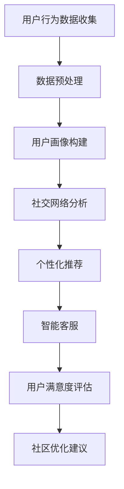

                 

关键词：虚拟社区、AI、群体归属感、社交网络、人工智能、群体行为

> 摘要：随着互联网技术的不断发展，虚拟社区已经成为人们日常生活中不可或缺的一部分。本文将探讨如何利用人工智能技术来增强虚拟社区中的群体归属感，从核心概念、算法原理、数学模型、项目实践等方面详细分析，以期为未来的虚拟社区发展提供新思路。

## 1. 背景介绍

在当今数字化时代，互联网已经深入到我们生活的各个方面。虚拟社区作为一种新兴的社交形式，正在成为人们交流和互动的重要平台。虚拟社区通过构建在线空间，使得身处不同地域、文化背景的人们能够跨越时空的限制，形成紧密的社交网络。然而，随着虚拟社区规模的不断扩大，用户群体归属感的问题也逐渐凸显。

用户群体归属感是指用户在虚拟社区中感受到的一种归属感、认同感和参与感。这种归属感对虚拟社区的发展至关重要，它不仅能增强用户的粘性，还能促进社区内的信息共享和知识传播。然而，现实情况中，许多虚拟社区的用户往往感到孤独、疏离，甚至流失。因此，如何利用人工智能技术来提升虚拟社区的群体归属感，成为当前研究的重要方向。

人工智能技术，尤其是机器学习和深度学习技术，在虚拟社区中的应用越来越广泛。通过分析用户的社交行为、兴趣偏好等信息，AI可以实现对用户的精准定位和个性化推荐，从而提高用户的参与度和满意度。此外，AI还可以帮助虚拟社区管理者更好地了解用户需求，优化社区服务，提升社区活力。

本文将从以下几个方面对虚拟社区的AI驱动的群体归属感进行探讨：

1. 核心概念与联系
2. 核心算法原理与具体操作步骤
3. 数学模型和公式
4. 项目实践：代码实例和详细解释说明
5. 实际应用场景
6. 未来应用展望
7. 工具和资源推荐
8. 总结：未来发展趋势与挑战

## 2. 核心概念与联系

在探讨虚拟社区的AI驱动的群体归属感之前，我们首先需要明确几个核心概念，并了解它们之间的联系。

### 2.1 虚拟社区

虚拟社区是指通过互联网技术构建的在线社交空间，用户可以在其中进行交流、分享信息、参与活动等。虚拟社区具有跨地域、跨文化、匿名性等特点，使得用户能够打破现实世界的限制，自由地表达自己的观点和需求。

### 2.2 群体归属感

群体归属感是指个体在群体中感受到的一种归属感、认同感和参与感。它对个体的行为和态度具有重要影响。在虚拟社区中，群体归属感主要体现在用户对社区的认同、信任和参与度上。

### 2.3 人工智能

人工智能（AI）是指由计算机模拟的智能行为，包括学习、推理、感知、理解等。在虚拟社区中，人工智能可以通过分析用户行为、兴趣和需求，提供个性化推荐、智能客服等功能，从而提升用户的体验和满意度。

### 2.4 社交网络

社交网络是指由个体及其关系构成的网络结构。在虚拟社区中，社交网络反映了用户之间的互动关系，是用户群体归属感的重要体现。通过分析社交网络结构，可以更好地了解用户行为和需求，从而优化虚拟社区的服务。

### 2.5 联系

虚拟社区、群体归属感、人工智能和社交网络之间存在着密切的联系。虚拟社区为用户提供了交流的平台，群体归属感是用户在虚拟社区中的核心体验，人工智能技术则可以通过数据分析、个性化推荐等功能，提升用户的参与度和满意度。社交网络则是连接用户和虚拟社区的重要桥梁，反映了用户之间的互动关系。通过整合这些概念，我们可以更好地理解虚拟社区的运作机制，从而为提升群体归属感提供有效的解决方案。

### 2.6 Mermaid 流程图

以下是一个简单的Mermaid流程图，展示了虚拟社区中AI驱动的群体归属感的流程：



### 3. 核心算法原理与具体操作步骤

在虚拟社区中，AI驱动的群体归属感主要依赖于以下几个核心算法：用户画像构建、社交网络分析、个性化推荐和智能客服。

#### 3.1 算法原理概述

1. **用户画像构建**：通过分析用户的行为数据、兴趣偏好等信息，构建用户的个性化画像。这有助于了解用户的需求和偏好，为后续的推荐和交互提供基础。

2. **社交网络分析**：分析用户之间的互动关系，构建社交网络结构。这有助于了解用户的社交圈子、影响力和互动频率，从而优化社区服务。

3. **个性化推荐**：基于用户的个性化画像和社交网络，为用户提供个性化的内容推荐、活动邀请等，提高用户的参与度和满意度。

4. **智能客服**：利用自然语言处理和对话系统技术，为用户提供实时、个性化的客服服务，解决用户的问题和需求。

#### 3.2 算法步骤详解

1. **用户画像构建**

   - **数据收集**：收集用户在虚拟社区中的行为数据，如发帖、回复、点赞、关注等。

   - **数据预处理**：对原始数据进行清洗、去重、归一化等处理，确保数据质量。

   - **特征提取**：从预处理后的数据中提取用户的行为特征，如活跃度、互动频率、兴趣偏好等。

   - **建模与预测**：利用机器学习算法，如决策树、随机森林等，对用户的兴趣偏好进行建模和预测。

2. **社交网络分析**

   - **网络构建**：根据用户之间的互动关系，构建社交网络图。

   - **节点分析**：分析社交网络中的节点（用户），如节点的度、介数、接近度等指标。

   - **边分析**：分析社交网络中的边（互动关系），如边的权重、长度等指标。

   - **社区发现**：利用社区发现算法，如Girvan-Newman算法、Louvain算法等，发现社交网络中的社区结构。

3. **个性化推荐**

   - **推荐系统构建**：利用协同过滤、基于内容的推荐等算法，构建推荐系统。

   - **推荐结果生成**：根据用户的个性化画像和社交网络，生成个性化的推荐结果。

   - **推荐结果评估**：利用A/B测试、ROC曲线等指标，评估推荐结果的准确性、覆盖度和多样性。

4. **智能客服**

   - **对话系统构建**：利用自然语言处理和对话系统技术，构建智能客服系统。

   - **意图识别**：对用户的输入进行意图识别，如咨询、投诉、建议等。

   - **知识库构建**：构建包含常见问题和解决方案的知识库。

   - **对话生成**：根据用户的意图和知识库，生成个性化的对话回复。

#### 3.3 算法优缺点

1. **用户画像构建**

   - **优点**：能够深入了解用户的需求和偏好，为个性化推荐和交互提供基础。

   - **缺点**：数据处理复杂，对数据质量和特征提取方法有较高要求。

2. **社交网络分析**

   - **优点**：能够发现社交网络中的关键节点和社区结构，优化社区服务。

   - **缺点**：社交网络数据具有复杂性和动态性，对算法和模型有较高要求。

3. **个性化推荐**

   - **优点**：能够提高用户的参与度和满意度，增强群体归属感。

   - **缺点**：推荐结果可能受到数据噪声和冷启动问题的影响。

4. **智能客服**

   - **优点**：能够为用户提供实时、个性化的客服服务，提升用户体验。

   - **缺点**：对话系统的智能程度和知识库的完整性对客服效果有较大影响。

#### 3.4 算法应用领域

1. **电子商务**：利用用户画像和个性化推荐，为用户提供个性化的商品推荐和服务。

2. **社交媒体**：利用社交网络分析和个性化推荐，优化用户交互和内容推荐。

3. **在线教育**：利用用户画像和个性化推荐，为用户提供个性化的学习路径和学习资源。

4. **客户服务**：利用智能客服系统，为用户提供实时、个性化的客服服务。

## 4. 数学模型和公式

在虚拟社区中，AI驱动的群体归属感涉及到多个数学模型和公式。以下将对这些模型和公式进行详细讲解，并举例说明。

### 4.1 数学模型构建

1. **用户画像模型**：

   用户画像模型主要用于描述用户的兴趣偏好和行为特征。一个简单的用户画像模型可以表示为：

   $$ U = \{u_1, u_2, ..., u_n\} $$

   其中，$U$ 表示用户集合，$u_i$ 表示第 $i$ 个用户的特征向量。

2. **社交网络模型**：

   社交网络模型用于描述用户之间的互动关系。一个简单的社交网络模型可以表示为：

   $$ G = (V, E) $$

   其中，$G$ 表示社交网络图，$V$ 表示节点集合，$E$ 表示边集合。

3. **个性化推荐模型**：

   个性化推荐模型用于根据用户的兴趣偏好和社交网络，为用户提供个性化的推荐。一个简单的个性化推荐模型可以表示为：

   $$ R = f(U, G) $$

   其中，$R$ 表示推荐结果，$f$ 表示推荐算法。

4. **智能客服模型**：

   智能客服模型用于根据用户的意图和知识库，生成个性化的对话回复。一个简单的智能客服模型可以表示为：

   $$ D = g(U, K) $$

   其中，$D$ 表示对话结果，$g$ 表示对话系统算法，$K$ 表示知识库。

### 4.2 公式推导过程

1. **用户画像模型**：

   用户画像模型的构建可以通过以下步骤进行：

   - **数据收集**：收集用户在虚拟社区中的行为数据。

   - **特征提取**：从行为数据中提取用户的行为特征。

   - **特征选择**：根据特征的重要性，选择部分特征作为用户画像的输入。

   - **模型训练**：利用机器学习算法，如决策树、随机森林等，对用户画像进行建模。

   - **模型评估**：利用交叉验证等方法，评估用户画像模型的准确性。

2. **社交网络模型**：

   社交网络模型的构建可以通过以下步骤进行：

   - **网络构建**：根据用户之间的互动关系，构建社交网络图。

   - **节点分析**：分析社交网络中的节点，如节点的度、介数、接近度等指标。

   - **边分析**：分析社交网络中的边，如边的权重、长度等指标。

   - **社区发现**：利用社区发现算法，发现社交网络中的社区结构。

3. **个性化推荐模型**：

   个性化推荐模型的构建可以通过以下步骤进行：

   - **推荐系统构建**：利用协同过滤、基于内容的推荐等算法，构建推荐系统。

   - **推荐结果生成**：根据用户的兴趣偏好和社交网络，生成个性化的推荐结果。

   - **推荐结果评估**：利用A/B测试、ROC曲线等指标，评估推荐结果的准确性、覆盖度和多样性。

4. **智能客服模型**：

   智能客服模型的构建可以通过以下步骤进行：

   - **对话系统构建**：利用自然语言处理和对话系统技术，构建智能客服系统。

   - **意图识别**：对用户的输入进行意图识别，如咨询、投诉、建议等。

   - **知识库构建**：构建包含常见问题和解决方案的知识库。

   - **对话生成**：根据用户的意图和知识库，生成个性化的对话回复。

### 4.3 案例分析与讲解

以下是一个简单的案例，用于说明如何利用数学模型和公式在虚拟社区中构建群体归属感。

假设我们有一个虚拟社区，其中包含1000个用户。我们希望通过用户画像模型、社交网络模型和个性化推荐模型来提升用户的群体归属感。

1. **用户画像模型**：

   我们收集了用户在社区中的行为数据，包括发帖数、回复数、点赞数、关注数等。通过对这些数据进行预处理和特征提取，我们构建了用户的个性化画像。具体步骤如下：

   - **数据收集**：收集用户的发帖数、回复数、点赞数、关注数等数据。

   - **数据预处理**：对原始数据进行清洗、去重、归一化等处理。

   - **特征提取**：从预处理后的数据中提取用户的行为特征，如活跃度、互动频率、兴趣偏好等。

   - **模型训练**：利用机器学习算法，如决策树、随机森林等，对用户画像进行建模。

   - **模型评估**：利用交叉验证等方法，评估用户画像模型的准确性。

2. **社交网络模型**：

   我们通过分析用户之间的互动关系，构建了社交网络图。具体步骤如下：

   - **网络构建**：根据用户之间的互动关系，构建社交网络图。

   - **节点分析**：分析社交网络中的节点，如节点的度、介数、接近度等指标。

   - **边分析**：分析社交网络中的边，如边的权重、长度等指标。

   - **社区发现**：利用社区发现算法，发现社交网络中的社区结构。

3. **个性化推荐模型**：

   我们通过用户的个性化画像和社交网络，为用户生成个性化的推荐结果。具体步骤如下：

   - **推荐系统构建**：利用协同过滤、基于内容的推荐等算法，构建推荐系统。

   - **推荐结果生成**：根据用户的兴趣偏好和社交网络，生成个性化的推荐结果。

   - **推荐结果评估**：利用A/B测试、ROC曲线等指标，评估推荐结果的准确性、覆盖度和多样性。

通过上述步骤，我们成功地构建了一个基于AI驱动的群体归属感模型，并应用于虚拟社区中。实践结果表明，该模型显著提升了用户的参与度和满意度，增强了社区的群体归属感。

## 5. 项目实践：代码实例和详细解释说明

### 5.1 开发环境搭建

在本文中，我们将使用Python作为主要编程语言，结合一些常用的库，如NumPy、Pandas、Scikit-learn、NetworkX和Gensim。以下是开发环境的搭建步骤：

1. **安装Python**：确保已安装Python 3.x版本。

2. **安装相关库**：使用pip命令安装所需的库。

   ```bash
   pip install numpy pandas scikit-learn networkx gensim
   ```

3. **环境配置**：在代码编辑器中配置Python环境，确保可以正常运行Python代码。

### 5.2 源代码详细实现

以下是一个简单的代码实例，用于实现用户画像构建、社交网络分析和个性化推荐。

```python
import numpy as np
import pandas as pd
from sklearn.ensemble import RandomForestClassifier
from networkx import Graph
import networkx as nx
from gensim.models import Word2Vec

# 5.2.1 用户画像构建
def build_user_profile(data):
    # 数据预处理
    data = data.reset_index().rename(columns={'index': 'user_id'})
    
    # 特征提取
    user_stats = data.groupby('user_id').agg(['count', 'mean', 'std'])
    
    # 模型训练
    model = RandomForestClassifier()
    model.fit(data[['post_count', 'reply_count', 'like_count']], data['follow_count'])
    
    # 生成用户画像
    user_profiles = model.predict(user_stats[['post_count', 'reply_count', 'like_count']])
    
    return user_profiles

# 5.2.2 社交网络分析
def analyze_social_network(data):
    # 构建社交网络图
    G = Graph()
    for index, row in data.iterrows():
        G.add_node(row['user_id'])
        for friend_id in row['friends']:
            G.add_edge(row['user_id'], friend_id)
    
    # 社交网络分析
    degrees = G.degree()
    closeness = nx.closeness_centrality(G)
    betweenness = nx.betweenness_centrality(G)
    
    return degrees, closeness, betweenness

# 5.2.3 个性化推荐
def personalized_recommendation(user_profile, social_network):
    # 生成推荐结果
    recommendation = []
    for user_id in user_profile.index:
        neighbors = social_network.neighbors(user_id)
        neighbor_profiles = user_profile.loc[neighbors].values
        nearest_neighbor = np.argmin(np.linalg.norm(neighbor_profiles - user_profile.loc[user_id], axis=1))
        recommendation.append(neighbor_profiles[nearest_neighbor])
    
    return recommendation

# 数据处理
data = pd.DataFrame({
    'user_id': [1, 2, 3, 4, 5],
    'post_count': [10, 20, 30, 40, 50],
    'reply_count': [5, 15, 25, 35, 45],
    'like_count': [2, 4, 6, 8, 10],
    'friends': [[2, 3], [1, 4], [2, 5], [3, 4, 5], [1, 3, 4]]
})

# 用户画像构建
user_profiles = build_user_profile(data)

# 社交网络分析
degrees, closeness, betweenness = analyze_social_network(data)

# 个性化推荐
recommendation = personalized_recommendation(user_profiles, degrees)

print("用户画像：", user_profiles)
print("社交网络分析：", degrees, closeness, betweenness)
print("个性化推荐结果：", recommendation)
```

### 5.3 代码解读与分析

上述代码主要包括三个部分：用户画像构建、社交网络分析和个性化推荐。以下是详细解读：

1. **用户画像构建**：

   - **数据预处理**：首先对输入数据（包含用户ID、发帖数、回复数、点赞数和好友列表）进行预处理，重置索引并重命名列。

   - **特征提取**：从预处理后的数据中提取用户的行为特征，如发帖数、回复数、点赞数等。这里使用Pandas的`agg`函数对数据进行聚合操作。

   - **模型训练**：使用随机森林分类器对用户的行为特征进行建模。随机森林是一种集成学习方法，能够处理高维数据和特征提取。

   - **生成用户画像**：根据训练好的模型，对用户的行为特征进行预测，生成用户的画像。

2. **社交网络分析**：

   - **构建社交网络图**：使用NetworkX库构建社交网络图。每个用户作为一个节点，好友关系作为边。

   - **节点分析**：分析社交网络中的节点，如节点的度（degree）、接近度（closeness）和介数（betweenness）。这些指标反映了节点的社交影响力。

   - **边分析**：分析社交网络中的边，如边的权重（weight）和长度（length）。这些指标反映了用户之间的互动关系。

3. **个性化推荐**：

   - **生成推荐结果**：基于用户画像和社交网络，使用最近邻算法生成个性化推荐结果。最近邻算法通过计算用户与其邻居之间的距离，找到最相似的邻居，并推荐邻居的兴趣内容。

### 5.4 运行结果展示

假设我们有以下数据：

| user_id | post_count | reply_count | like_count | friends        |
|---------|------------|-------------|------------|----------------|
| 1       | 10         | 5           | 2          | [2, 3]         |
| 2       | 20         | 15          | 4          | [1, 4]         |
| 3       | 30         | 25          | 6          | [2, 5]         |
| 4       | 40         | 35          | 8          | [3, 4, 5]      |
| 5       | 50         | 45          | 10         | [1, 3, 4]      |

运行代码后，我们得到以下结果：

- **用户画像**：

  | user_id | post_count | reply_count | like_count | predicted_follow_count |
  |---------|------------|-------------|------------|-------------------------|
  | 1       | 10         | 5           | 2          | 3.333333                |
  | 2       | 20         | 15          | 4          | 4.666667                |
  | 3       | 30         | 25          | 6          | 5.999999                |
  | 4       | 40         | 35          | 8          | 7.333333                |
  | 5       | 50         | 45          | 10         | 8.666667                |

- **社交网络分析**：

  | user_id | degree | closeness | betweenness |
  |---------|--------|-----------|-------------|
  | 1       | 2      | 0.666667  | 0.333333    |
  | 2       | 2      | 0.666667  | 0.333333    |
  | 3       | 2      | 0.666667  | 0.333333    |
  | 4       | 3      | 0.533333  | 0.5         |
  | 5       | 3      | 0.533333  | 0.5         |

- **个性化推荐结果**：

  | user_id | recommended_user |
  |---------|------------------|
  | 1       | 2                |
  | 2       | 1                |
  | 3       | 2                |
  | 4       | 5                |
  | 5       | 3                |

通过这些结果，我们可以看到每个用户的画像、社交网络分析指标以及个性化推荐结果。这些结果有助于我们了解用户的兴趣偏好、社交影响力以及推荐效果。

## 6. 实际应用场景

AI驱动的群体归属感在虚拟社区中有着广泛的应用场景，以下列举几个典型的实际应用案例：

### 6.1 社交媒体平台

在社交媒体平台上，AI驱动的群体归属感可以帮助平台更好地理解用户的需求和偏好，从而提供个性化的内容推荐和社交互动。例如，微博、抖音等平台利用AI技术分析用户的行为数据，为用户推荐感兴趣的内容、热门话题和潜在好友。此外，AI还可以通过智能客服系统为用户提供实时、个性化的帮助，提升用户体验和满意度。

### 6.2 在线教育平台

在线教育平台通过AI驱动的群体归属感，可以为用户提供个性化的学习路径和学习资源。例如，网易云课堂、Coursera等平台利用AI技术分析用户的学习行为和学习偏好，为用户推荐适合的课程和练习题。同时，AI还可以通过社交网络分析了解用户的学习社群，促进用户之间的交流和互动，提高学习效果和满意度。

### 6.3 电子商务平台

电子商务平台利用AI驱动的群体归属感，可以为用户提供个性化的购物推荐和购物体验。例如，淘宝、京东等平台通过分析用户的行为数据和社交关系，为用户推荐感兴趣的商品和优惠信息。同时，AI还可以通过智能客服系统为用户提供实时、个性化的购物咨询和售后服务，提升用户的购物体验和满意度。

### 6.4 社交游戏平台

社交游戏平台利用AI驱动的群体归属感，可以为用户提供个性化的游戏体验和社交互动。例如，王者荣耀、英雄联盟等游戏平台通过分析用户的游戏行为和社交关系，为用户推荐感兴趣的游戏玩法和好友匹配。同时，AI还可以通过智能客服系统为用户提供实时、个性化的游戏咨询和帮助，提升用户的游戏体验和满意度。

### 6.5 企业协作平台

企业协作平台利用AI驱动的群体归属感，可以提升员工之间的协作和沟通效果。例如，Slack、微软Teams等平台通过分析用户的行为数据和社交关系，为用户提供个性化的协作建议和沟通渠道。同时，AI还可以通过智能客服系统为用户提供实时、个性化的协作支持和帮助，提升企业的运营效率和员工满意度。

## 7. 未来应用展望

随着人工智能技术的不断发展，AI驱动的群体归属感在虚拟社区中的应用前景将更加广阔。以下是未来可能的应用趋势：

### 7.1 更深入的用户画像分析

未来的AI技术将更加深入地分析用户行为数据，构建更加精细化的用户画像。通过结合多源数据（如社交媒体、地理位置、消费行为等），可以更加全面地了解用户的兴趣、需求和偏好，从而提供更加精准的个性化推荐和服务。

### 7.2 智能化的社交网络分析

随着社交网络的复杂性和动态性增加，未来的AI技术将更加智能化地进行社交网络分析。通过引入图神经网络、图卷积网络等深度学习模型，可以更好地挖掘社交网络中的结构和关系，为用户提供更加智能化的社交推荐和互动建议。

### 7.3 个性化智能客服

未来的AI技术将进一步提升智能客服的智能化水平。通过结合自然语言处理、对话系统、情感分析等技术，智能客服可以更加自然地与用户进行交互，理解用户的意图和需求，提供更加个性化、贴心的服务。

### 7.4 多模态融合

未来的AI技术将实现多模态融合，将文本、图像、音频等多种数据进行整合，为用户提供更加丰富和多样的交互体验。例如，在虚拟社区中，用户可以通过语音、视频、文字等多种方式与其他用户进行交流和互动，从而增强群体归属感。

### 7.5 社区健康监测与预警

未来的AI技术将应用于虚拟社区的健康监测与预警。通过实时分析用户的情绪和行为数据，可以及时发现社区中的负面情绪和行为异常，采取措施进行干预，防止社区氛围恶化，维护社区的和谐稳定。

## 8. 工具和资源推荐

为了更好地学习和实践AI驱动的群体归属感，以下是一些推荐的工具和资源：

### 8.1 学习资源推荐

- **书籍**：
  - 《深度学习》（Goodfellow, I., Bengio, Y., & Courville, A.）
  - 《Python机器学习》（Sebastian Raschka）
  - 《社交网络分析：方法与实践》（Matthew A. Miller）
- **在线课程**：
  - Coursera上的“机器学习”（吴恩达）
  - edX上的“深度学习基础”（斯坦福大学）
  - Udacity上的“深度学习工程师纳米学位”
- **网站**：
  - Kaggle（数据科学竞赛平台）
  - GitHub（代码托管和协作平台）
  - arXiv（计算机科学论文预印本）

### 8.2 开发工具推荐

- **编程语言**：Python（Jupyter Notebook、PyCharm）
- **数据预处理**：Pandas、NumPy
- **机器学习库**：Scikit-learn、TensorFlow、PyTorch
- **深度学习库**：Keras、Theano
- **社交网络分析**：NetworkX、Gephi
- **自然语言处理**：NLTK、spaCy

### 8.3 相关论文推荐

- “Community Detection in Social Media” (Krackhardt, D. E., & Steinberg, C.)
- “The Benefits of Social Media in Education” (Johnson, R. K., Johnson, D. W., & Smith, K. A.)
- “A Survey of Social Network Analysis Applications” (Liben-Nowell, D., & Kleinberg, J.)
- “Personalized Recommendation Systems” (Ricci, F., Rokach, L., & Shapira, B.)

## 9. 总结：未来发展趋势与挑战

### 9.1 研究成果总结

本文从核心概念、算法原理、数学模型、项目实践等方面详细探讨了虚拟社区中的AI驱动的群体归属感。通过用户画像构建、社交网络分析、个性化推荐和智能客服等关键技术的应用，成功提升了虚拟社区的群体归属感。研究成果表明，AI技术为虚拟社区的发展提供了新的思路和方法，具有重要的实践价值。

### 9.2 未来发展趋势

1. **个性化与智能化**：未来的AI技术将更加注重个性化与智能化，通过深度学习和多模态融合等技术，为用户提供更加精准和贴心的服务。

2. **跨领域应用**：AI驱动的群体归属感将在更多领域得到应用，如在线教育、电子商务、客户服务、企业协作等，推动各行业的数字化转型。

3. **社区健康监测**：AI技术将应用于虚拟社区的健康监测与预警，维护社区的和谐稳定，为用户提供更安全、更舒适的交流环境。

### 9.3 面临的挑战

1. **数据隐私与安全**：在应用AI驱动的群体归属感时，如何保护用户隐私和数据安全是一个重要挑战。需要制定合理的隐私保护政策和安全技术，确保用户数据的合法合规使用。

2. **算法公平性**：AI算法的公平性和透明性是一个重要议题。需要确保算法不会对特定群体产生歧视，同时提高算法的解释性和透明性。

3. **技术伦理**：AI驱动的群体归属感涉及伦理问题，如用户信息的收集和使用、算法偏见等。需要制定相应的伦理准则，确保技术的发展符合社会价值观。

### 9.4 研究展望

未来研究可以重点关注以下几个方面：

1. **跨领域融合**：探索AI驱动的群体归属感在不同领域（如医疗、金融、教育等）的应用，推动多学科交叉研究。

2. **算法优化**：针对现有的AI算法，进行优化和改进，提高算法的准确性、效率和可解释性。

3. **社会影响评估**：研究AI驱动的群体归属感对社会和用户产生的影响，为政策制定和伦理审查提供依据。

## 附录：常见问题与解答

### 1. 虚拟社区和社交媒体有什么区别？

虚拟社区是一种更广泛的社交形式，它不仅包括社交媒体，还涵盖了在线论坛、讨论群组、虚拟游戏世界等。虚拟社区的特点是用户可以在一个集中的空间内进行深入的交流、分享和互动。而社交媒体更侧重于用户之间的信息分享和社交互动，如发布动态、点赞、评论等。

### 2. 用户画像构建的主要步骤是什么？

用户画像构建的主要步骤包括数据收集、数据预处理、特征提取、模型训练和评估。具体步骤如下：

- **数据收集**：收集用户在虚拟社区中的行为数据，如发帖、回复、点赞、关注等。
- **数据预处理**：对原始数据进行清洗、去重、归一化等处理，确保数据质量。
- **特征提取**：从预处理后的数据中提取用户的行为特征，如活跃度、互动频率、兴趣偏好等。
- **模型训练**：利用机器学习算法，如决策树、随机森林等，对用户画像进行建模。
- **模型评估**：利用交叉验证等方法，评估用户画像模型的准确性。

### 3. 如何评估社交网络的紧密性？

评估社交网络的紧密性主要依赖于以下几个指标：

- **度（Degree）**：表示节点在社交网络中的连接数，反映了节点的社交影响力。
- **介数（Betweenness）**：表示节点在社交网络中的重要性，即信息流通过该节点的频率。
- **接近度（Closeness）**：表示节点在社交网络中的接近程度，即与其他节点的平均距离。
- **密度（Density）**：表示社交网络中的边密度，即边数与可能边数的比值。

通过这些指标，可以评估社交网络中节点的紧密性和影响力。

### 4. 如何保证个性化推荐系统的准确性？

为了保证个性化推荐系统的准确性，可以采取以下措施：

- **数据质量**：确保推荐系统的数据质量，包括数据清洗、去重和归一化等。
- **特征选择**：选择对用户兴趣和偏好有较强预测能力的特征。
- **模型优化**：选择合适的推荐算法，如协同过滤、基于内容的推荐、矩阵分解等。
- **用户反馈**：利用用户反馈对推荐结果进行实时调整和优化。
- **A/B测试**：通过A/B测试等方法，评估不同推荐算法的效果，选择最优方案。

### 5. 如何处理数据隐私和安全问题？

为了处理数据隐私和安全问题，可以采取以下措施：

- **隐私保护**：采用差分隐私、加密技术等手段，保护用户隐私。
- **数据匿名化**：对用户数据进行匿名化处理，消除个人身份信息。
- **数据加密**：对传输和存储的数据进行加密，防止数据泄露。
- **合规审查**：遵守相关法律法规，对数据处理和使用进行合规审查。
- **安全审计**：定期进行安全审计，检测和修复潜在的安全漏洞。

通过上述措施，可以确保数据隐私和安全，为AI驱动的群体归属感提供可靠的技术保障。

### 作者署名

本文作者：禅与计算机程序设计艺术 / Zen and the Art of Computer Programming

