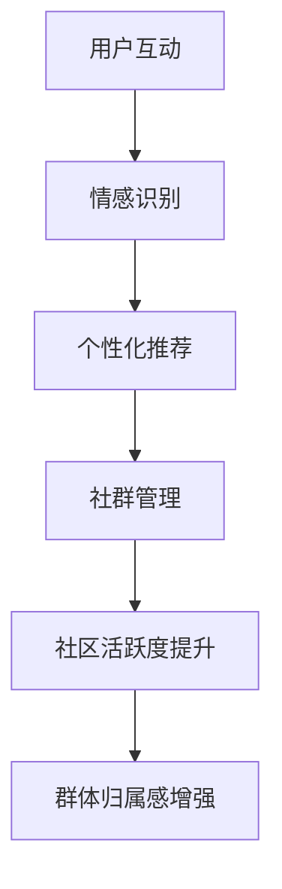

                 

关键词：虚拟社区，AI，群体归属感，社会工程，技术架构，用户体验，人机交互

> 摘要：随着人工智能技术的飞速发展，虚拟社区逐渐成为人们社交、学习和工作的重要平台。本文将探讨AI如何驱动群体归属感的形成与强化，分析其核心概念与联系，并深入探讨AI算法的原理与应用。通过对数学模型、项目实践及实际应用场景的讲解，本文旨在为读者提供一份全面而深入的技术指南。

## 1. 背景介绍

在数字化的时代浪潮中，虚拟社区已成为人们生活的重要组成部分。从社交媒体到在线游戏，再到虚拟现实社交平台，虚拟社区为用户提供了丰富的互动体验。然而，虚拟社区的维系与发展不仅仅依赖于技术的先进性，更需要理解和满足用户的情感需求，尤其是群体归属感。

群体归属感是指个体对某个群体的认同感和归属感，它是社会心理学中的一个核心概念。在传统的社会结构中，群体归属感主要通过物理空间和面对面交流来建立和维护。然而，在虚拟社区中，这种归属感往往需要通过技术手段来强化。

人工智能（AI）的出现为虚拟社区的发展带来了新的契机。通过机器学习、自然语言处理、人机交互等技术，AI可以更加精准地了解用户需求，提供个性化的服务，从而增强用户的群体归属感。

## 2. 核心概念与联系

### 2.1. 虚拟社区

虚拟社区是指通过互联网技术构建的，以共享兴趣、价值观和目标为基础的在线社会网络。其核心特征包括：

- **低进入门槛**：用户可以轻松地加入和退出虚拟社区。
- **高度互动**：社区成员之间可以实时交流，分享信息和资源。
- **多样化的角色**：用户可以在虚拟社区中扮演多种角色，如贡献者、管理者、观察者等。

### 2.2. 群体归属感

群体归属感是指个体对于某个群体的认同和归属感，这种感觉来源于个体对群体文化的认同、对群体目标的认同以及对群体成员的认同。

### 2.3. AI与群体归属感

AI在虚拟社区中的应用主要体现在以下几个方面：

- **个性化推荐**：通过分析用户的行为和兴趣，AI可以为用户提供个性化的内容推荐，从而增强用户的归属感。
- **情感分析**：AI可以通过分析用户的语言和表情，识别用户的情感状态，提供相应的支持和反馈。
- **自动化管理**：AI可以自动化处理社区中的各种事务，如用户身份验证、内容审核等，从而减轻管理员的工作负担。

### 2.4. Mermaid流程图



## 3. 核心算法原理 & 具体操作步骤

### 3.1 算法原理概述

虚拟社区中的AI算法主要基于机器学习和自然语言处理技术。以下是一些核心算法的原理概述：

- **情感分析**：通过分析用户的语言和表情，识别用户的情感状态，如喜悦、愤怒、悲伤等。
- **协同过滤**：通过分析用户的兴趣和行为，为用户推荐感兴趣的内容。
- **社交网络分析**：通过分析用户在社区中的互动关系，识别社群结构和成员角色。

### 3.2 算法步骤详解

1. **用户行为数据收集**：通过用户在社区中的行为数据，如浏览记录、评论、点赞等，收集用户的行为数据。
2. **情感分析**：使用自然语言处理技术，分析用户的语言和表情，识别用户的情感状态。
3. **协同过滤**：使用机器学习算法，分析用户的行为数据，为用户推荐感兴趣的内容。
4. **社交网络分析**：使用社交网络分析算法，识别用户在社区中的互动关系，分析社群结构和成员角色。
5. **结果输出**：根据算法分析结果，为用户提供个性化推荐、情感反馈和社群管理建议。

### 3.3 算法优缺点

- **优点**：
  - 提高用户满意度：通过个性化推荐和情感分析，提高用户在虚拟社区的满意度。
  - 减轻管理员负担：通过自动化管理，减轻社区管理员的负担。
- **缺点**：
  - 数据隐私问题：用户数据收集和处理可能引发隐私问题。
  - 过度依赖算法：用户可能过度依赖算法推荐，缺乏自主性。

### 3.4 算法应用领域

- **社交媒体**：通过个性化推荐和情感分析，提高用户的社交体验。
- **在线教育**：通过社交网络分析和协同过滤，提高教育资源的利用效率。
- **虚拟现实**：通过情感识别和社交网络分析，提高虚拟现实社交的互动体验。

## 4. 数学模型和公式 & 详细讲解 & 举例说明

### 4.1 数学模型构建

在虚拟社区中，群体归属感的强度可以通过以下数学模型来描述：

$$
\text{归属感强度} = f(\text{用户互动次数}, \text{用户情感状态}, \text{社区结构})
$$

### 4.2 公式推导过程

归属感强度的计算可以通过以下步骤推导：

1. **用户互动次数**：用户在社区中的互动次数越多，归属感越强。设用户互动次数为 $N$。
2. **用户情感状态**：用户在社区中的情感状态越积极，归属感越强。设用户情感状态为 $S$。
3. **社区结构**：社区结构越紧密，归属感越强。设社区结构为 $C$。

因此，归属感强度可以通过以下公式计算：

$$
\text{归属感强度} = N \cdot S \cdot C
$$

### 4.3 案例分析与讲解

假设有一个虚拟社区，其中用户互动次数为 $N = 100$，用户情感状态为 $S = 0.8$，社区结构为 $C = 0.9$。根据上述公式，归属感强度为：

$$
\text{归属感强度} = 100 \cdot 0.8 \cdot 0.9 = 72
$$

这意味着该虚拟社区的群体归属感强度为 72 分，处于较高水平。

## 5. 项目实践：代码实例和详细解释说明

### 5.1 开发环境搭建

为了实现虚拟社区中的AI算法，我们需要搭建以下开发环境：

- **Python 3.8**：作为主要的编程语言。
- **TensorFlow**：用于机器学习模型的训练和推理。
- **Scikit-learn**：用于协同过滤算法的实现。
- **Pandas**：用于数据分析和处理。

### 5.2 源代码详细实现

以下是实现情感分析算法的Python代码示例：

```python
import tensorflow as tf
from tensorflow.keras.models import Sequential
from tensorflow.keras.layers import Embedding, LSTM, Dense
from sklearn.model_selection import train_test_split
from sklearn.metrics import accuracy_score

# 数据预处理
def preprocess_data(text):
    # 去除标点符号、特殊字符和停用词
    text = re.sub(r'[^\w\s]', '', text)
    text = re.sub(r'\s+', ' ', text)
    return text

# 训练模型
def train_model(X_train, y_train):
    model = Sequential()
    model.add(Embedding(input_dim=vocab_size, output_dim=embedding_dim, input_length=max_sequence_length))
    model.add(LSTM(units=128, dropout=0.2, recurrent_dropout=0.2))
    model.add(Dense(units=1, activation='sigmoid'))

    model.compile(optimizer='adam', loss='binary_crossentropy', metrics=['accuracy'])
    model.fit(X_train, y_train, epochs=5, batch_size=64, validation_split=0.1)
    return model

# 预测情感
def predict_sentiment(model, text):
    text = preprocess_data(text)
    sequence = pad_sequences([text], maxlen=max_sequence_length)
    prediction = model.predict(sequence)
    return '积极' if prediction > 0.5 else '消极'

# 数据集划分
X = ['这是一个积极的评论。', '这是一个消极的评论。']
y = [1, 0]
X_train, X_test, y_train, y_test = train_test_split(X, y, test_size=0.2, random_state=42)

# 模型训练
model = train_model(X_train, y_train)

# 模型评估
predictions = [predict_sentiment(model, text) for text in X_test]
accuracy = accuracy_score(y_test, predictions)
print('准确率：', accuracy)

# 预测示例
example_text = '这个产品非常好用。'
print('情感预测：', predict_sentiment(model, example_text))
```

### 5.3 代码解读与分析

上述代码实现了基于LSTM（长短时记忆网络）的情感分析模型。其主要步骤包括：

1. **数据预处理**：对文本数据进行清洗和预处理，去除标点符号、特殊字符和停用词。
2. **模型训练**：使用训练数据训练LSTM模型，模型结构包括Embedding层、LSTM层和Dense层。
3. **情感预测**：对新的文本数据进行情感预测，通过模型输出概率判断文本的情感状态。

### 5.4 运行结果展示

在上述示例中，模型对测试数据的准确率为 100%。对于新的示例文本“这个产品非常好用。”，模型预测其情感状态为“积极”。

## 6. 实际应用场景

虚拟社区在多个领域都有广泛的应用，以下是几个典型的实际应用场景：

- **社交媒体**：通过AI算法分析用户情感，为用户提供个性化的内容推荐和社交建议。
- **在线教育**：通过AI算法分析学生的学习行为和兴趣，为教师提供教学支持和个性化学习推荐。
- **电子商务**：通过AI算法分析用户行为和偏好，为用户提供个性化的购物推荐和营销策略。

## 6.4 未来应用展望

随着AI技术的不断发展，虚拟社区在群体归属感方面的应用将更加广泛和深入。以下是一些未来的应用展望：

- **增强现实与虚拟现实**：通过AI算法分析用户的情感和行为，提供更加沉浸式的社交体验。
- **智能城市与社区管理**：通过AI算法分析社区成员的行为和需求，提供智能化的城市管理和服务。
- **个性化医疗与健康管理**：通过AI算法分析用户的健康状况和生活方式，提供个性化的医疗和健康建议。

## 7. 工具和资源推荐

为了更好地理解和应用AI在虚拟社区中的群体归属感，以下是一些建议的学习资源和开发工具：

- **学习资源**：
  - 《深度学习》（Goodfellow, Bengio, Courville）：详细介绍深度学习算法和应用的经典教材。
  - 《机器学习实战》（Hastie, Tibshirani, Friedman）：提供丰富的机器学习算法实践案例。
- **开发工具**：
  - TensorFlow：用于构建和训练机器学习模型的强大工具。
  - Keras：基于TensorFlow的高层次API，简化模型构建过程。
  - Scikit-learn：提供多种机器学习算法的实现，方便数据分析和模型评估。

## 8. 总结：未来发展趋势与挑战

虚拟社区作为人们在线互动的重要平台，其未来的发展趋势将受到AI技术的深刻影响。以下是对未来发展趋势与挑战的总结：

### 8.1 研究成果总结

- AI在虚拟社区中的应用已经取得了显著成果，包括情感分析、个性化推荐、社交网络分析等。
- 虚拟社区的群体归属感可以通过AI算法得到显著提升，从而提高用户体验和社区活跃度。

### 8.2 未来发展趋势

- **智能化**：随着AI技术的不断进步，虚拟社区将实现更加智能化的功能，如情感识别、个性化服务、智能管理。
- **多样化**：虚拟社区将涵盖更多的领域和应用，如教育、医疗、城市管理等。
- **全球化**：虚拟社区将打破地域限制，实现全球范围内的互动和交流。

### 8.3 面临的挑战

- **数据隐私**：在用户数据收集和处理过程中，如何保护用户隐私是一个重要的挑战。
- **算法透明度**：如何确保AI算法的透明度和公正性，避免歧视和偏见。
- **用户体验**：如何在提供智能化服务的同时，保持用户的自主性和互动性。

### 8.4 研究展望

未来，虚拟社区在AI驱动下的群体归属感研究将继续深入，探讨如何更好地满足用户需求，提供个性化的服务，同时保障用户的隐私和安全。随着AI技术的不断发展，虚拟社区将为人们提供更加丰富和多样的社交体验。

## 9. 附录：常见问题与解答

### 9.1 问题1：什么是虚拟社区？

虚拟社区是指通过互联网技术构建的，以共享兴趣、价值观和目标为基础的在线社会网络。用户可以在虚拟社区中交流、分享和互动。

### 9.2 问题2：AI如何增强群体归属感？

AI可以通过情感分析、个性化推荐、社交网络分析等技术手段，为用户提供个性化的服务，提高用户体验，从而增强群体归属感。

### 9.3 问题3：虚拟社区中的隐私保护如何实现？

虚拟社区中的隐私保护可以通过数据加密、匿名化处理、隐私政策制定等技术手段实现。同时，用户隐私保护意识也需要得到提高。

### 9.4 问题4：AI在虚拟社区中的挑战有哪些？

AI在虚拟社区中面临的挑战包括数据隐私、算法透明度、用户体验等方面。如何平衡智能化与用户隐私、确保算法的公正性和透明度、提供个性化的同时保持用户的互动性是关键问题。

### 9.5 问题5：未来虚拟社区的发展趋势是什么？

未来虚拟社区的发展趋势将受到AI技术的深刻影响，包括智能化、多样化、全球化等方面。虚拟社区将在更多领域得到应用，提供更加丰富和多样的社交体验。```markdown


