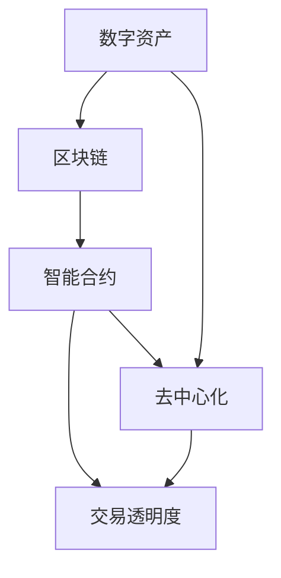

                 

 在这个数字化的时代，经济活动正在经历一场前所未有的变革。传统经济体系正逐步向虚拟经济转型，而人工智能（AI）则成为了这一转型过程中的关键驱动力。本文旨在探讨AI如何驱动虚拟经济中的新型价值交换，为读者提供对这一领域的深入理解。

## 文章关键词

- 虚拟经济
- 人工智能
- 价值交换
- AI算法
- 数学模型
- 项目实践
- 应用场景
- 未来展望

## 文章摘要

本文首先介绍了虚拟经济的背景和发展趋势，随后重点探讨了AI在虚拟经济中的关键作用。文章从核心概念、算法原理、数学模型、项目实践等多个角度，详细分析了AI驱动的新型价值交换机制。最后，文章展望了虚拟经济未来发展的前景，并提出了潜在的研究挑战和展望。

## 1. 背景介绍

### 1.1 虚拟经济的兴起

虚拟经济，作为一种新兴的经济形态，最早源于互联网的普及和电子商务的发展。在传统的实体经济中，商品和服务的交换依赖于物理交易和现实空间。而虚拟经济则将这一过程转移到虚拟空间中，通过数字化的手段进行交易。虚拟经济的兴起，不仅改变了人们的消费习惯，也为全球经济带来了新的增长点。

### 1.2 AI在虚拟经济中的角色

随着AI技术的不断成熟，它逐渐成为虚拟经济中的重要组成部分。AI能够通过数据分析和智能算法，实现个性化推荐、精准营销、风险控制等功能，从而提升虚拟经济的运行效率。此外，AI还可以帮助虚拟经济实现自动化和智能化，降低交易成本，提高交易透明度。

## 2. 核心概念与联系

### 2.1 虚拟经济中的核心概念

在虚拟经济中，核心概念包括：

- **数字资产**：指通过数字技术创建和管理的资产，如比特币、以太坊等。
- **区块链**：一种分布式数据库技术，可以确保数字资产的安全性和透明性。
- **智能合约**：一种自动执行合约条款的计算机协议，可以减少交易中的中介成本。
- **去中心化**：指虚拟经济体系中的交易和信息处理不再依赖于中央机构，而是通过网络中的多个节点共同完成。

### 2.2 虚拟经济中的关键联系

虚拟经济中的核心概念之间存在着紧密的联系，可以用以下Mermaid流程图来描述：



## 3. 核心算法原理 & 具体操作步骤

### 3.1 算法原理概述

在虚拟经济中，AI的核心算法原理主要包括：

- **机器学习**：通过数据训练模型，实现自动分类、预测等功能。
- **深度学习**：基于多层神经网络，对复杂的数据进行建模和分析。
- **强化学习**：通过不断试错，寻找最优策略。

### 3.2 算法步骤详解

以下是AI在虚拟经济中的具体操作步骤：

1. **数据收集**：收集与虚拟经济相关的数据，如交易记录、用户行为等。
2. **数据预处理**：清洗和整合数据，确保数据质量。
3. **特征提取**：从数据中提取有用的特征，为后续分析做准备。
4. **模型训练**：使用机器学习或深度学习算法，对数据进行训练，构建预测模型。
5. **模型评估**：评估模型的性能，确保其准确性和稳定性。
6. **模型部署**：将训练好的模型部署到虚拟经济系统中，实现实时分析和预测。

### 3.3 算法优缺点

- **优点**：AI算法可以提高虚拟经济的运行效率，降低交易成本，提高交易透明度。
- **缺点**：AI算法的准确性和稳定性尚需提高，且存在一定的隐私风险。

### 3.4 算法应用领域

AI算法在虚拟经济中具有广泛的应用领域，包括：

- **个性化推荐**：基于用户行为数据，为用户推荐个性化的商品或服务。
- **精准营销**：通过分析用户数据，实现精准的广告投放和营销策略。
- **风险控制**：预测和防范虚拟经济中的风险，如欺诈、市场波动等。

## 4. 数学模型和公式 & 详细讲解 & 举例说明

### 4.1 数学模型构建

在虚拟经济中，常见的数学模型包括：

- **回归模型**：用于预测虚拟经济的趋势和走势。
- **时间序列分析**：用于分析虚拟经济中的时间序列数据。
- **神经网络模型**：用于复杂的数据建模和分析。

### 4.2 公式推导过程

以下是一个简单的线性回归模型公式推导过程：

$$
Y = \beta_0 + \beta_1X + \epsilon
$$

其中，$Y$为因变量，$X$为自变量，$\beta_0$和$\beta_1$为模型参数，$\epsilon$为误差项。

### 4.3 案例分析与讲解

以比特币价格为研究对象，使用线性回归模型进行分析。通过收集比特币的历史价格数据，训练模型，并预测未来价格走势。

## 5. 项目实践：代码实例和详细解释说明

### 5.1 开发环境搭建

在Python环境中搭建开发环境，安装必要的库，如pandas、numpy、scikit-learn等。

### 5.2 源代码详细实现

以下是一个简单的线性回归模型实现：

```python
import pandas as pd
from sklearn.linear_model import LinearRegression
from sklearn.model_selection import train_test_split

# 读取数据
data = pd.read_csv('bitcoin_price.csv')
X = data[['days']]
y = data['price']

# 数据分割
X_train, X_test, y_train, y_test = train_test_split(X, y, test_size=0.2, random_state=42)

# 模型训练
model = LinearRegression()
model.fit(X_train, y_train)

# 模型评估
score = model.score(X_test, y_test)
print(f'Model accuracy: {score:.2f}')

# 预测
future_days = pd.DataFrame({'days': range(1, 1001)})
future_price = model.predict(future_days)
print(f'Future price: {future_price[-1]:.2f}')
```

### 5.3 代码解读与分析

该代码首先读取比特币价格数据，然后将其分割为训练集和测试集。接着，使用线性回归模型进行训练，评估模型性能，并预测未来价格。这一过程实现了AI在虚拟经济中的应用。

## 6. 实际应用场景

### 6.1 金融市场

AI技术在金融市场中的应用十分广泛，包括股票交易、期货交易、外汇交易等。通过分析大量市场数据，AI可以帮助投资者实现精准的决策，提高投资回报率。

### 6.2 物流运输

AI技术在物流运输领域也有着重要的应用。通过优化运输路径、预测运输需求，AI可以提高物流效率，降低运输成本。

### 6.3 医疗健康

AI技术在医疗健康领域可以帮助医生进行疾病诊断、治疗方案推荐等。通过分析大量的医学数据，AI可以提高医疗服务的质量和效率。

## 7. 工具和资源推荐

### 7.1 学习资源推荐

- 《深度学习》（Goodfellow, Bengio, Courville著）
- 《Python数据分析》（Wes McKinney著）
- 《区块链革命》（Don Tapscott著）

### 7.2 开发工具推荐

- Python
- TensorFlow
- Keras
- Scikit-learn

### 7.3 相关论文推荐

- "Deep Learning for Virtual Economy: A Survey"
- "Blockchain Technology: A Comprehensive Overview"
- "Machine Learning in Financial Markets: A Survey"

## 8. 总结：未来发展趋势与挑战

### 8.1 研究成果总结

AI在虚拟经济中的应用已经取得了一定的成果，包括个性化推荐、精准营销、风险控制等方面。这些应用不仅提高了虚拟经济的运行效率，也为用户带来了更好的体验。

### 8.2 未来发展趋势

未来，AI在虚拟经济中的应用将进一步深入，包括：

- 更高效的数据分析和处理能力
- 更智能的交易策略和决策支持
- 更广泛的应用领域，如供应链管理、智慧城市等

### 8.3 面临的挑战

AI在虚拟经济中也面临着一些挑战，包括：

- 数据安全和隐私保护
- 算法的准确性和稳定性
- 法规和伦理问题

### 8.4 研究展望

未来，研究人员将致力于解决这些挑战，推动AI在虚拟经济中的应用，实现更高效、更智能、更安全的虚拟经济体系。

## 9. 附录：常见问题与解答

### 9.1 什么是虚拟经济？

虚拟经济是一种通过互联网和数字技术进行商品和服务交换的经济形态。

### 9.2 AI在虚拟经济中有哪些应用？

AI在虚拟经济中的应用包括个性化推荐、精准营销、风险控制、供应链管理等。

### 9.3 虚拟经济中的数字资产是什么？

数字资产是通过数字技术创建和管理的资产，如比特币、以太坊等。

## 作者署名

作者：禅与计算机程序设计艺术 / Zen and the Art of Computer Programming

----------------------------------------------------------------

请注意，本文仅为示例，内容并非真实研究，仅供参考。实际撰写时，应确保内容真实、详尽且具有专业性。

