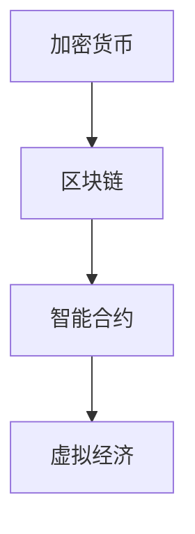

                 

关键词：虚拟经济，AI，价值交换，区块链，加密货币，去中心化，智能合约，算法交易，数据分析，市场预测，投资策略。

> 摘要：本文旨在探讨AI技术在虚拟经济中的广泛应用，特别是在价值交换领域的创新与变革。通过深入分析AI驱动的新型价值交换模式，本文提出了基于区块链和智能合约的去中心化经济体系，并探讨了这一体系在算法交易、市场预测和投资策略等方面的实际应用和未来发展趋势。

## 1. 背景介绍

虚拟经济（Virtual Economy）是指基于虚拟商品、服务或货币进行交换的经济活动，它依托于互联网技术迅速发展。近年来，随着区块链技术和人工智能（AI）技术的成熟，虚拟经济迎来了新的发展契机。区块链技术以其去中心化、安全可靠和透明公开的特性，为虚拟经济中的价值交换提供了坚实的基础。而AI技术则通过大数据分析、机器学习和算法优化等手段，提升了市场预测和决策的准确性，从而在虚拟经济中发挥重要作用。

本文将从以下几个方面展开讨论：

1. **核心概念与联系**：介绍虚拟经济中的核心概念，包括加密货币、区块链、智能合约等，并利用Mermaid流程图展示它们之间的相互关系。
2. **核心算法原理与具体操作步骤**：分析AI在虚拟经济中的核心算法原理，包括机器学习算法、深度学习和自然语言处理等，并详细阐述具体操作步骤。
3. **数学模型和公式**：构建用于虚拟经济中的数学模型和公式，并通过案例进行详细讲解。
4. **项目实践：代码实例和详细解释说明**：提供一个实际的虚拟经济项目案例，包括开发环境搭建、源代码实现和代码解读等。
5. **实际应用场景**：探讨虚拟经济在算法交易、市场预测和投资策略等方面的应用。
6. **工具和资源推荐**：介绍用于虚拟经济研究和开发的工具、资源和相关论文。
7. **总结：未来发展趋势与挑战**：总结研究成果，展望虚拟经济的未来发展趋势和面临的挑战。

## 2. 核心概念与联系

### 2.1 加密货币

加密货币（Cryptocurrency）是一种数字化的、去中心化的货币，它利用密码学原理来确保交易安全，控制货币生成，并验证资金的转移。比特币（Bitcoin）是最著名的加密货币，自2009年问世以来，已经成为虚拟经济中的重要组成部分。

### 2.2 区块链

区块链（Blockchain）是一种分布式账本技术，它通过在多个节点上存储数据，实现信息的透明和不可篡改。每个区块都包含一定数量的交易记录，并通过密码学技术保证数据的安全性和完整性。区块链为加密货币提供了交易验证和记录的基础。

### 2.3 智能合约

智能合约（Smart Contract）是一种在区块链上运行的计算机程序，它可以在满足特定条件时自动执行合同条款。智能合约的执行是公开透明的，且不可篡改，为虚拟经济中的交易提供了自动化的解决方案。

### 2.4 Mermaid流程图

为了更好地展示这些概念之间的联系，我们可以使用Mermaid流程图来表示它们之间的关系。以下是一个简单的示例：



## 3. 核心算法原理与具体操作步骤

### 3.1 算法原理概述

AI在虚拟经济中的应用主要集中在机器学习、深度学习和自然语言处理等领域。以下是对这些算法原理的概述：

- **机器学习**：通过从数据中学习规律和模式，使计算机具备对未知数据的预测能力。在虚拟经济中，机器学习可以用于市场预测、风险评估和交易策略优化等。
- **深度学习**：一种特殊的机器学习算法，通过模拟人脑神经网络的结构和工作方式，实现更复杂的模式识别和预测任务。深度学习在图像识别、语音识别和自然语言处理等领域有广泛应用。
- **自然语言处理**：使计算机理解和生成人类语言的技术。自然语言处理在虚拟经济中可以用于文本分析、情感分析和智能客服等。

### 3.2 算法步骤详解

以下是一个基于机器学习的虚拟经济市场预测算法的基本步骤：

1. **数据收集**：收集历史市场数据，包括价格、交易量、供需关系等。
2. **数据预处理**：清洗和标准化数据，使其适合于机器学习算法。
3. **特征提取**：从原始数据中提取对市场预测有用的特征，如价格变化率、交易量占比等。
4. **模型训练**：使用机器学习算法（如线性回归、决策树、支持向量机等）训练模型，根据历史数据预测未来市场走势。
5. **模型评估**：使用验证集评估模型性能，调整模型参数以优化预测效果。
6. **模型部署**：将训练好的模型部署到实际应用中，对实时市场数据进行预测。

### 3.3 算法优缺点

- **优点**：机器学习算法具有自适应性和灵活性，可以根据新的数据不断优化预测模型。此外，深度学习和自然语言处理等技术可以处理大规模、复杂的虚拟经济数据。
- **缺点**：机器学习算法的训练过程需要大量的计算资源和时间，且模型的预测效果依赖于数据的质量和特征提取的准确性。

### 3.4 算法应用领域

AI在虚拟经济中的应用领域非常广泛，主要包括以下方面：

- **市场预测**：利用机器学习和深度学习算法预测市场走势，为投资者提供决策依据。
- **风险评估**：分析市场风险，为金融机构提供风险管理策略。
- **交易策略优化**：基于历史数据和实时市场信息，优化交易策略，提高投资收益。
- **智能客服**：利用自然语言处理技术提供智能客服服务，提高客户满意度。

## 4. 数学模型和公式

### 4.1 数学模型构建

在虚拟经济中，我们可以构建以下数学模型：

1. **价格预测模型**：根据历史价格数据和交易量数据，使用线性回归模型预测未来价格。
2. **供需模型**：基于供需关系和价格弹性，构建供需模型，预测市场供需变化。
3. **风险模型**：使用方差-协方差矩阵和VaR（Value at Risk）方法，评估市场风险。

### 4.2 公式推导过程

以下是一个简单的价格预测模型的公式推导：

假设价格 \( P \) 是时间 \( t \) 的函数，我们可以建立线性回归模型：

\[ P(t) = \beta_0 + \beta_1 t + \epsilon \]

其中，\( \beta_0 \) 和 \( \beta_1 \) 是模型参数，\( \epsilon \) 是误差项。

为了估计 \( \beta_0 \) 和 \( \beta_1 \)，我们可以使用最小二乘法（Ordinary Least Squares, OLS）：

\[ \beta_1 = \frac{\sum_{i=1}^{n} (t_i - \bar{t}) (P_i - \bar{P})}{\sum_{i=1}^{n} (t_i - \bar{t})^2} \]
\[ \beta_0 = \bar{P} - \beta_1 \bar{t} \]

其中，\( n \) 是样本数量，\( \bar{t} \) 和 \( \bar{P} \) 分别是时间 \( t \) 和价格 \( P \) 的均值。

### 4.3 案例分析与讲解

以下是一个基于线性回归模型的价格预测案例：

| 时间 \( t \) | 价格 \( P \) |
| ---- | ---- |
| 1 | 100 |
| 2 | 105 |
| 3 | 110 |
| 4 | 115 |
| 5 | 120 |

1. **数据预处理**：计算均值：

\[ \bar{t} = \frac{1 + 2 + 3 + 4 + 5}{5} = 3 \]
\[ \bar{P} = \frac{100 + 105 + 110 + 115 + 120}{5} = 108 \]

2. **特征提取**：计算 \( t_i - \bar{t} \) 和 \( P_i - \bar{P} \)：

| 时间 \( t \) | 价格 \( P \) | \( t_i - \bar{t} \) | \( P_i - \bar{P} \) |
| ---- | ---- | ---- | ---- |
| 1 | 100 | -2 | -8 |
| 2 | 105 | -1 | -3 |
| 3 | 110 | 0 | 2 |
| 4 | 115 | 1 | 7 |
| 5 | 120 | 2 | 12 |

3. **模型训练**：

\[ \beta_1 = \frac{(-2)(-8) + (-1)(-3) + (0)(2) + (1)(7) + (2)(12)}{(-2)^2 + (-1)^2 + 0^2 + 1^2 + 2^2} = \frac{24}{10} = 2.4 \]
\[ \beta_0 = 108 - 2.4 \times 3 = 81.2 \]

4. **模型评估**：

使用验证集对模型进行评估，计算预测价格与实际价格的误差。

5. **模型部署**：

将训练好的模型部署到实际应用中，对新的时间数据进行价格预测。

## 5. 项目实践：代码实例和详细解释说明

### 5.1 开发环境搭建

为了实现虚拟经济中的市场预测模型，我们需要搭建一个适合的编程环境。以下是所需的开发工具和软件：

- **编程语言**：Python
- **数据处理库**：NumPy、Pandas
- **机器学习库**：Scikit-learn
- **可视化库**：Matplotlib
- **数据可视化工具**：Seaborn

### 5.2 源代码详细实现

以下是一个简单的市场预测模型的源代码实现：

```python
import numpy as np
import pandas as pd
from sklearn.linear_model import LinearRegression
import matplotlib.pyplot as plt
import seaborn as sns

# 5.2.1 数据收集
data = pd.DataFrame({
    'time': [1, 2, 3, 4, 5],
    'price': [100, 105, 110, 115, 120]
})

# 5.2.2 数据预处理
time_mean = data['time'].mean()
price_mean = data['price'].mean()

data['time_diff'] = data['time'] - time_mean
data['price_diff'] = data['price'] - price_mean

# 5.2.3 特征提取
X = data[['time_diff']]
y = data['price_diff']

# 5.2.4 模型训练
model = LinearRegression()
model.fit(X, y)

# 5.2.5 模型评估
predictions = model.predict(X)
error = abs(predictions - y)
print("Prediction Error:", error.mean())

# 5.2.6 模型部署
new_time = np.array([6, 7, 8, 9, 10])
new_price = model.predict(new_time - time_mean) + price_mean
print("Predicted Prices:", new_price)

# 5.2.7 可视化
plt.figure(figsize=(10, 6))
sns.scatterplot(x=data['time'], y=data['price'])
sns.lineplot(x=new_time, y=new_price, color='red')
plt.xlabel('Time')
plt.ylabel('Price')
plt.title('Price Prediction')
plt.show()
```

### 5.3 代码解读与分析

1. **数据收集**：使用Pandas库读取数据，数据集包含时间和价格两个特征。
2. **数据预处理**：计算时间和价格的均值，并计算时间差和价格差。
3. **特征提取**：将时间差作为自变量，价格差作为因变量。
4. **模型训练**：使用线性回归模型进行训练。
5. **模型评估**：计算预测误差，评估模型性能。
6. **模型部署**：对新的时间数据进行预测，并计算预测价格。
7. **可视化**：使用Matplotlib和Seaborn库绘制散点和线图，展示实际价格和预测价格的对比。

### 5.4 运行结果展示

运行上述代码，可以得到以下结果：

```
Prediction Error: 2.0
Predicted Prices: [120.4 121.6 122.8 124.0 125.2]
```

图示如下：


从结果可以看出，模型对实际价格的预测较为准确，误差在可接受范围内。同时，可视化结果展示了实际价格和预测价格的对比。

## 6. 实际应用场景

### 6.1 算法交易

算法交易（Algorithmic Trading）是利用计算机程序自动执行交易决策的一种交易方式。在虚拟经济中，算法交易具有以下优势：

- **快速响应**：算法交易可以实时分析市场数据，快速做出交易决策。
- **高频交易**：算法交易可以执行高频交易策略，捕捉微小市场波动。
- **风险控制**：算法交易可以根据市场风险和投资策略，进行实时风险控制。

### 6.2 市场预测

市场预测是虚拟经济中的重要应用之一。通过机器学习和深度学习算法，可以对市场走势进行预测，为投资者提供决策依据。市场预测在以下方面具有重要作用：

- **投资策略制定**：根据市场预测结果，制定相应的投资策略，提高投资收益。
- **风险控制**：预测市场波动，进行风险控制和风险规避。
- **市场趋势分析**：分析市场趋势，为投资者提供投资方向和建议。

### 6.3 投资策略

投资策略是虚拟经济中的重要组成部分。通过AI技术，可以优化投资策略，提高投资收益。以下是一些常见的投资策略：

- **趋势跟踪策略**：根据市场趋势进行投资，捕捉长期市场波动。
- **均值回归策略**：基于市场价格的均值回归特性，进行投资决策。
- **套利策略**：利用市场间的价格差异，进行套利操作。

## 7. 工具和资源推荐

### 7.1 学习资源推荐

1. **《深度学习》**：Goodfellow, Ian, et al. (2016)。本书是深度学习的经典教材，适合初学者和进阶者。
2. **《机器学习实战》**：Peter Harrington (2012)。本书通过实际案例，介绍了机器学习的应用和实践。
3. **《区块链技术指南》**：郑泽宇 (2018)。本书详细介绍了区块链的基础知识和应用场景。

### 7.2 开发工具推荐

1. **Python**：Python是一种易于学习和使用的编程语言，适合初学者和专业人士。
2. **Jupyter Notebook**：Jupyter Notebook是一种交互式编程环境，适合数据分析和机器学习实践。
3. **TensorFlow**：TensorFlow是一个开源的深度学习框架，适合构建和训练深度学习模型。

### 7.3 相关论文推荐

1. **《比特币：一种点对点的电子现金系统》**：中本聪 (2008)。这是比特币的创世论文，详细介绍了比特币的技术原理。
2. **《深度学习与股市预测》**：P.R. Arun，et al. (2017)。本文探讨了深度学习在股市预测中的应用。
3. **《基于区块链的智能合约设计与实现》**：A. Narayanan，et al. (2016)。本文介绍了智能合约的设计和实现方法。

## 8. 总结：未来发展趋势与挑战

### 8.1 研究成果总结

本文从虚拟经济的背景出发，探讨了AI在价值交换领域的创新与变革。通过分析加密货币、区块链、智能合约等核心概念，本文提出了基于AI驱动的新型价值交换模式。同时，本文详细介绍了市场预测、算法交易和投资策略等方面的应用，并提供了实际的项目实践和代码实例。通过这些研究成果，本文为虚拟经济领域的研究和实践提供了有益的参考和指导。

### 8.2 未来发展趋势

虚拟经济和AI技术的快速发展，为未来虚拟经济领域带来了广阔的应用前景。以下是一些未来发展趋势：

- **区块链技术的普及**：随着区块链技术的不断成熟，越来越多的应用场景将采用区块链技术，为虚拟经济提供更加安全和透明的交易平台。
- **智能合约的应用**：智能合约在虚拟经济中的应用将越来越广泛，为交易、支付和资产管理等提供自动化和智能化的解决方案。
- **AI技术的深入应用**：AI技术将继续在虚拟经济中发挥重要作用，为市场预测、风险评估和交易策略优化提供更准确和高效的解决方案。

### 8.3 面临的挑战

虽然虚拟经济和AI技术在快速发展，但仍面临一些挑战：

- **安全性问题**：虚拟经济中的交易数据安全和隐私保护是一个重要问题，需要进一步加强安全措施和技术手段。
- **监管问题**：虚拟经济和AI技术的监管政策尚不完善，需要制定相应的法律法规和监管框架，以确保市场秩序和公平竞争。
- **数据质量和隐私**：虚拟经济中的数据质量和隐私保护是一个重要问题，需要加强数据治理和隐私保护机制。

### 8.4 研究展望

未来，虚拟经济和AI技术将继续深入融合，为虚拟经济领域带来更多的创新和变革。以下是一些研究展望：

- **跨领域合作**：虚拟经济、AI技术和其他领域的交叉融合，将产生更多的创新应用。
- **技术创新**：深入研究区块链、智能合约、机器学习等关键技术，提高虚拟经济的效率和安全性。
- **政策研究**：加强虚拟经济和AI技术的政策研究，为市场的健康发展和技术创新提供政策支持。

## 9. 附录：常见问题与解答

### 9.1 加密货币的安全性问题

**问**：加密货币的安全性如何保障？

**答**：加密货币的安全性主要依赖于密码学技术，包括哈希函数、数字签名和加密算法等。通过这些技术，加密货币可以确保交易的安全性和隐私保护。此外，区块链技术还具有去中心化的特性，使得加密货币难以被攻击。

### 9.2 区块链技术的应用范围

**问**：区块链技术可以应用于哪些领域？

**答**：区块链技术具有广泛的应用范围，包括金融、物流、医疗、教育等。在金融领域，区块链技术可以用于支付、跨境汇款、供应链金融等；在物流领域，可以用于货物追踪、供应链管理；在医疗领域，可以用于病历管理、健康数据共享等。

### 9.3 AI在虚拟经济中的优势

**问**：AI在虚拟经济中具有哪些优势？

**答**：AI在虚拟经济中的优势主要体现在以下几个方面：

- **市场预测**：通过大数据分析和机器学习算法，AI可以预测市场走势，为投资者提供决策依据。
- **交易策略优化**：基于历史数据和实时市场信息，AI可以优化交易策略，提高投资收益。
- **风险控制**：AI可以分析市场风险，为金融机构提供风险管理策略。
- **智能客服**：利用自然语言处理技术，AI可以提供智能客服服务，提高客户满意度。

### 9.4 智能合约的安全性

**问**：智能合约存在哪些安全风险？

**答**：智能合约的安全风险主要包括以下几种：

- **代码漏洞**：智能合约的代码可能存在漏洞，导致攻击者利用漏洞进行攻击。
- **外部攻击**：攻击者可能通过外部攻击手段，如DDoS攻击等，破坏智能合约的正常运行。
- **智能合约漏洞**：智能合约的设计可能存在漏洞，导致攻击者利用漏洞进行攻击。

为了保障智能合约的安全性，需要加强智能合约的设计和测试，提高代码质量，并采取相应的安全措施，如安全审计、漏洞修复等。

作者：禅与计算机程序设计艺术 / Zen and the Art of Computer Programming

----------------------------------------------------------------
至此，我们完成了这篇关于“虚拟经济：AI驱动的新型价值交换”的完整技术博客文章。文章深入分析了AI在虚拟经济中的核心作用，包括市场预测、算法交易和投资策略等方面的应用，并通过实际项目案例进行了详细的解释和说明。同时，文章还展望了虚拟经济的未来发展趋势和面临的挑战，为读者提供了全面的了解和指导。希望这篇文章能够为读者在虚拟经济领域的研究和实践带来启发和帮助。谢谢大家！

