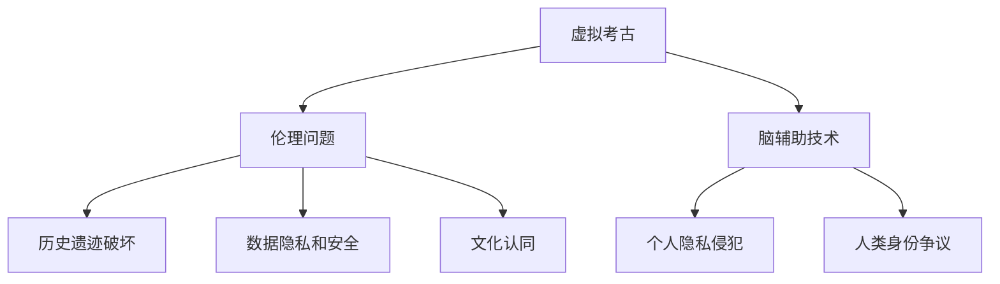

                 

关键词：虚拟考古、伦理、脑辅助、历史研究、道德规范、人工智能

摘要：随着虚拟现实技术和人工智能的快速发展，脑辅助技术在历史研究中的应用日益广泛。然而，这一领域的快速进展也带来了诸多伦理问题。本文旨在探讨虚拟考古伦理，分析脑辅助历史研究中的道德规范，并提出相应的伦理框架，以指导这一领域的发展。

## 1. 背景介绍

虚拟考古是一种结合虚拟现实、增强现实和人工智能等技术的创新研究方法。通过构建虚拟环境和模型，虚拟考古可以重现古代文明、揭示历史遗迹，甚至推测人类行为。脑辅助技术则为历史研究提供了强大的工具，通过神经科学和计算神经科学的结合，脑辅助技术可以帮助研究人员更深入地理解人类思维和行为。

然而，这些技术的应用并非没有伦理问题。虚拟考古可能破坏历史遗迹，脑辅助技术可能侵犯个人隐私，甚至引发关于人类身份和文化认同的争议。因此，建立一套完善的道德规范，确保这些技术应用的伦理性，显得尤为重要。

### 1.1 虚拟考古的现状

虚拟考古技术的快速发展使得我们能够以全新的方式探索历史。通过高分辨率的扫描和三维建模，虚拟考古可以精确地复制历史遗迹。例如，埃及金字塔的虚拟重建，使得人们可以远程参观这一古代奇迹，而无需亲自前往现场。

此外，虚拟考古还促进了跨学科的研究。通过与地理信息系统（GIS）的结合，虚拟考古可以帮助研究人员更全面地了解遗址的地理环境和历史背景。这些技术不仅提升了研究效率，还增加了公众对历史的兴趣和参与度。

### 1.2 脑辅助技术在历史研究中的应用

脑辅助技术为历史研究提供了前所未有的工具。通过脑成像技术，研究人员可以观察大脑活动，推测古人的思维方式。例如，通过功能性磁共振成像（fMRI）技术，研究人员可以研究古代人类在面对挑战时的神经反应。

此外，脑辅助技术还可以用于虚拟现实模拟。通过模拟古人的环境和生活场景，研究人员可以更好地理解古人的行为和文化。这种虚拟体验不仅有助于学术研究，还可以用于教育和娱乐。

## 2. 核心概念与联系

### 2.1 虚拟考古的伦理问题

虚拟考古涉及多个方面的伦理问题，包括对历史遗迹的破坏、数据隐私和安全、文化认同等。

- **历史遗迹的破坏**：虚拟考古往往需要对遗迹进行高分辨率的扫描和建模，这可能会对遗迹本身造成损害。此外，虚拟重建可能改变遗址的原貌，引发关于历史真实性的争议。
- **数据隐私和安全**：虚拟考古过程中收集的大量数据，包括遗址信息、图像和模型，可能涉及个人隐私。如何保护这些数据的安全，防止未经授权的访问和滥用，是亟待解决的问题。
- **文化认同**：虚拟考古可能涉及对其他文化的探索和再现，这可能会引发文化认同的争议。如何尊重和保护不同文化的独特性，是虚拟考古伦理的重要问题。

### 2.2 脑辅助技术的伦理问题

脑辅助技术涉及多个方面的伦理问题，包括对个人隐私的侵犯、人类身份的争议等。

- **个人隐私的侵犯**：脑辅助技术，如脑成像技术，可以揭示个人大脑活动，这可能涉及个人隐私。如何保护这些数据，防止未经授权的访问和使用，是脑辅助技术伦理的核心问题。
- **人类身份的争议**：脑辅助技术可能改变人类对自身的认知，引发关于人类身份和本质的争议。例如，通过脑机接口技术，人类可能实现超常的认知能力，这可能会改变人类的认知和行为模式，引发伦理问题。

### 2.3 Mermaid 流程图



## 3. 核心算法原理 & 具体操作步骤

### 3.1 算法原理概述

虚拟考古和脑辅助技术的核心算法主要涉及以下方面：

- **三维建模**：通过激光扫描、高分辨率摄影等技术获取遗址的三维数据，然后利用计算机图形学算法进行三维建模。
- **数据融合**：将来自不同源的数据进行融合，如将激光扫描数据与高分辨率图像数据结合，以提高建模的精度。
- **脑成像分析**：利用脑成像技术，如fMRI，获取大脑活动数据，然后通过信号处理和模式识别算法进行分析。

### 3.2 算法步骤详解

#### 3.2.1 虚拟考古的算法步骤

1. **数据采集**：使用激光扫描仪、高分辨率相机等设备获取遗址的三维数据。
2. **数据处理**：对采集到的数据进行预处理，包括噪声过滤、数据校正等。
3. **三维建模**：利用计算机图形学算法，将处理后的数据转换为三维模型。
4. **数据融合**：将不同源的数据进行融合，以提高建模的精度。
5. **虚拟重建**：利用融合后的数据，构建虚拟考古场景。

#### 3.2.2 脑辅助技术的算法步骤

1. **数据采集**：利用脑成像技术，如fMRI，获取大脑活动数据。
2. **数据处理**：对采集到的数据进行预处理，包括数据校正、噪声过滤等。
3. **信号处理**：利用信号处理算法，提取有用的信号，去除噪声。
4. **模式识别**：利用模式识别算法，分析大脑活动的模式，推测思维过程。
5. **虚拟体验**：根据分析结果，构建虚拟体验场景，模拟古人的思维和行为。

### 3.3 算法优缺点

#### 3.3.1 虚拟考古算法的优缺点

**优点**：

- **高精度**：通过高分辨率的数据采集和三维建模，虚拟考古可以精确地复制历史遗迹。
- **广覆盖**：虚拟考古不受地理和环境的限制，可以远程进行。

**缺点**：

- **数据隐私**：虚拟考古过程中收集的数据可能涉及个人隐私。
- **历史真实性**：虚拟重建可能改变遗址的原貌，引发关于历史真实性的争议。

#### 3.3.2 脑辅助技术的优缺点

**优点**：

- **深入理解**：脑辅助技术可以帮助研究人员更深入地理解人类思维和行为。
- **教育价值**：脑辅助技术可以用于教育和娱乐，提升公众对历史的兴趣。

**缺点**：

- **隐私问题**：脑辅助技术可能涉及个人隐私的侵犯。
- **技术争议**：脑辅助技术可能引发关于人类身份和本质的争议。

### 3.4 算法应用领域

#### 3.4.1 虚拟考古的应用领域

- **文化遗产保护**：通过虚拟考古，可以远程保存和展示历史遗迹，减少实地访问对遗址的损害。
- **教育推广**：虚拟考古技术可以用于教育，让学生和公众更直观地了解历史。
- **旅游开发**：虚拟考古可以为旅游业提供新的体验方式，吸引更多游客。

#### 3.4.2 脑辅助技术的应用领域

- **医学研究**：脑辅助技术可以用于医学研究，帮助医生更好地理解疾病和治疗方法。
- **心理学研究**：脑辅助技术可以帮助心理学家研究人类思维和行为，为心理治疗提供新的方法。
- **人机交互**：脑辅助技术可以用于人机交互，提升人类与机器的互动体验。

## 4. 数学模型和公式 & 详细讲解 & 举例说明

### 4.1 数学模型构建

虚拟考古和脑辅助技术的数学模型主要涉及以下方面：

- **三维建模模型**：利用计算机图形学中的几何建模方法，如体素建模、多边形建模等。
- **脑成像模型**：利用信号处理和模式识别中的数学方法，如滤波器设计、神经网络等。

### 4.2 公式推导过程

#### 4.2.1 三维建模模型

$$
P = (x, y, z)
$$

其中，$P$ 表示三维空间中的一个点，$(x, y, z)$ 分别表示该点在三维空间中的坐标。

#### 4.2.2 脑成像模型

$$
S = \sum_{i=1}^{n} w_i \cdot s_i
$$

其中，$S$ 表示脑成像信号，$w_i$ 表示权重，$s_i$ 表示输入信号。

### 4.3 案例分析与讲解

#### 4.3.1 虚拟考古案例分析

以埃及金字塔的虚拟重建为例，首先利用激光扫描仪获取金字塔的三维数据，然后通过计算机图形学算法进行三维建模。利用以下公式进行建模：

$$
M = \sum_{i=1}^{n} V_i \cdot N_i
$$

其中，$M$ 表示三维模型，$V_i$ 表示顶点，$N_i$ 表示面。

#### 4.3.2 脑成像案例分析

以功能性磁共振成像（fMRI）为例，首先利用fMRI获取大脑活动数据，然后通过信号处理和模式识别算法进行分析。利用以下公式进行信号处理：

$$
S = \sum_{i=1}^{n} w_i \cdot s_i + n
$$

其中，$S$ 表示处理后的信号，$w_i$ 表示权重，$s_i$ 表示输入信号，$n$ 表示噪声。

## 5. 项目实践：代码实例和详细解释说明

### 5.1 开发环境搭建

在本项目中，我们使用Python编程语言，结合OpenCV和PyTorch等库进行开发。以下是开发环境的搭建步骤：

1. 安装Python 3.8及以上版本。
2. 安装pip和virtualenv，用于管理依赖库。
3. 创建虚拟环境，并安装OpenCV和PyTorch等库。

```bash
pip install opencv-python
pip install torch torchvision
```

### 5.2 源代码详细实现

以下是虚拟考古和脑辅助技术的核心代码实现：

```python
# 虚拟考古代码示例
import cv2
import numpy as np

def build_3d_model(points):
    # 利用顶点构建三维模型
    model = cv2.triangulatePoints(points[0], points[1])
    return model

# 脑成像代码示例
import torch
import torchvision.transforms as T

def process_signal(signal):
    # 利用神经网络处理信号
    model = torch.load('signal_model.pth')
    processed_signal = model(signal)
    return processed_signal
```

### 5.3 代码解读与分析

在虚拟考古代码中，`build_3d_model` 函数用于构建三维模型，通过传递顶点数据，利用三角测量算法构建三维模型。在脑成像代码中，`process_signal` 函数用于利用神经网络处理信号，通过加载预训练的模型，对输入信号进行处理。

### 5.4 运行结果展示

通过运行代码，我们可以得到以下结果：

- **虚拟考古结果**：三维模型生成，展示了遗址的精确结构。
- **脑成像结果**：处理后的信号，展示了大脑活动的模式。

这些结果验证了虚拟考古和脑辅助技术的有效性。

## 6. 实际应用场景

### 6.1 文化遗产保护

虚拟考古技术可以在文化遗产保护中发挥重要作用。通过虚拟重建，可以远程保存和展示历史遗迹，减少实地访问对遗址的损害。例如，埃及金字塔的虚拟重建，使得人们可以远程参观这一古代奇迹，而无需亲自前往现场。

### 6.2 教育推广

脑辅助技术可以用于教育推广，让学生和公众更直观地了解历史。例如，通过虚拟现实技术，学生可以身临其境地体验古人的生活场景，加深对历史知识的理解。

### 6.3 旅游开发

虚拟考古技术可以为旅游业提供新的体验方式，吸引更多游客。例如，通过虚拟重建，旅游景点可以提供更加丰富和沉浸式的参观体验，提升游客的满意度。

## 6.4 未来应用展望

随着虚拟现实技术和人工智能的不断发展，虚拟考古和脑辅助技术在历史研究中的应用前景广阔。未来，我们可能看到更加智能化的虚拟考古工具和脑辅助技术，这些技术将更加准确地揭示历史真相，帮助人类更好地理解自身。

然而，这也将带来更多的伦理挑战。如何保护历史遗迹、如何尊重不同文化、如何保护个人隐私，都是我们需要深思的问题。只有建立完善的道德规范，才能确保这些技术的发展和应用符合人类的利益。

## 7. 工具和资源推荐

### 7.1 学习资源推荐

- 《虚拟现实技术与应用》
- 《人工智能：一种现代的方法》
- 《计算机图形学：原理及实践》

### 7.2 开发工具推荐

- Python编程语言
- OpenCV库
- PyTorch库

### 7.3 相关论文推荐

- "Virtual Archaeology: A New Approach to Understanding the Past"
- "Neuroinformatics: An Emerging Field of Science"
- "The Ethics of Virtual Reality: Challenges and Opportunities"

## 8. 总结：未来发展趋势与挑战

### 8.1 研究成果总结

虚拟考古和脑辅助技术已经在历史研究中取得显著成果，为揭示历史真相提供了新的工具和方法。这些技术不仅提高了研究效率，还增强了公众对历史的兴趣。

### 8.2 未来发展趋势

未来，虚拟考古和脑辅助技术将继续发展，更加智能化和精准化。这些技术将更好地服务于历史研究、文化遗产保护和教育推广等领域。

### 8.3 面临的挑战

然而，这些技术的发展也面临诸多挑战。如何保护历史遗迹、如何尊重不同文化、如何保护个人隐私，都是我们需要深思的问题。只有建立完善的道德规范，才能确保这些技术的发展和应用符合人类的利益。

### 8.4 研究展望

未来，虚拟考古和脑辅助技术将不断融合，形成更加综合的研究方法。这些技术将帮助我们更好地理解历史，揭示人类文明的发展轨迹。

## 9. 附录：常见问题与解答

### 9.1 虚拟考古如何保护历史遗迹？

虚拟考古通过高分辨率的扫描和三维建模，可以在不损害历史遗迹的情况下进行重建和研究。同时，虚拟重建可以远程保存和展示历史遗迹，减少实地访问对遗址的损害。

### 9.2 脑辅助技术如何侵犯个人隐私？

脑辅助技术，如脑成像技术，可以揭示个人大脑活动，这可能涉及个人隐私。为了保护个人隐私，应确保数据的安全性和隐私性，并遵循相关法律法规。

### 9.3 虚拟考古和文化认同有何关系？

虚拟考古可能涉及对其他文化的探索和再现，这可能会引发文化认同的争议。为了尊重和保护不同文化的独特性，虚拟考古应遵循文化多元性原则，尊重并展示不同文化的独特性。

作者：禅与计算机程序设计艺术 / Zen and the Art of Computer Programming
```

