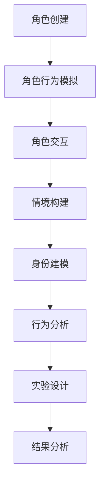

                 

关键词：虚拟角色扮演，AI，身份实验，技术博客，计算机编程，算法，数学模型，实践案例，未来应用。

> 摘要：本文旨在探讨虚拟角色扮演在AI驱动的身份实验中的应用，分析其技术原理、算法模型以及数学公式，并通过实践案例展示其在现实场景中的具体应用，为读者提供全面的技术解读和未来应用展望。

## 1. 背景介绍

虚拟角色扮演（Virtual Role-Playing，简称VRP）是一种通过计算机技术模拟人类角色交互、行为和决策的游戏或模拟系统。近年来，随着人工智能（Artificial Intelligence，简称AI）技术的快速发展，VRP逐渐成为AI领域的一个重要研究方向。AI驱动的身份实验（AI-driven Identity Experiment，简称AIIDE）是一种利用AI技术对虚拟角色扮演系统中的角色身份进行实验和分析的方法。

AI驱动的身份实验旨在通过创建不同的角色身份和情境，观察和分析这些角色在不同情境下的行为模式、决策过程和交互效果。这种方法在心理学、社会学、人机交互等多个领域具有广泛的应用前景。

## 2. 核心概念与联系

### 2.1. 虚拟角色扮演系统

虚拟角色扮演系统（Virtual Role-Playing System，简称VRPS）是VRP的核心组成部分，包括角色创建、角色行为模拟、角色交互和情境构建等功能。以下是VRPS的核心概念与联系：

- **角色创建**：定义虚拟角色的属性、技能、性格等特征。
- **角色行为模拟**：模拟虚拟角色的动作、语言、表情等行为。
- **角色交互**：实现虚拟角色之间的交互和沟通。
- **情境构建**：创建不同的虚拟场景和环境，为角色提供交互背景。

### 2.2. AI驱动的身份实验

AI驱动的身份实验（AI-driven Identity Experiment，简称AIIDE）是一种利用AI技术对虚拟角色扮演系统中的角色身份进行实验和分析的方法。以下是AIIDE的核心概念与联系：

- **身份建模**：基于AI技术，对虚拟角色扮演系统中的角色身份进行建模和分类。
- **行为分析**：分析虚拟角色在不同情境下的行为模式和决策过程。
- **实验设计**：设计不同的实验情境和任务，观察角色身份对行为的影响。
- **结果分析**：对实验结果进行统计分析，提取有价值的信息和规律。

### 2.3. Mermaid流程图

为了更好地展示虚拟角色扮演系统和AI驱动的身份实验之间的联系，我们可以使用Mermaid流程图进行描述。以下是相关流程节点：



## 3. 核心算法原理 & 具体操作步骤

### 3.1. 算法原理概述

虚拟角色扮演系统和AI驱动的身份实验的核心算法主要包括角色行为模拟、身份建模和行为分析。以下是这些算法的原理概述：

- **角色行为模拟**：基于状态机、行为树等算法，实现虚拟角色的动作、语言、表情等行为模拟。
- **身份建模**：利用机器学习和深度学习技术，对虚拟角色扮演系统中的角色身份进行建模和分类。
- **行为分析**：通过数据挖掘和统计分析技术，分析虚拟角色在不同情境下的行为模式和决策过程。

### 3.2. 算法步骤详解

#### 3.2.1. 角色行为模拟

1. **角色属性初始化**：根据角色创建阶段的信息，初始化角色的属性和状态。
2. **状态机/行为树构建**：基于角色的属性和需求，构建状态机或行为树，定义角色的行为规则。
3. **行为执行**：根据当前角色的状态，执行相应的行为，并更新角色的状态。

#### 3.2.2. 身份建模

1. **数据收集**：收集虚拟角色扮演系统中的角色数据，包括属性、行为、情境等。
2. **特征提取**：对角色数据进行特征提取，为身份建模提供基础。
3. **模型训练**：利用机器学习和深度学习技术，对角色特征进行分类和建模。
4. **身份预测**：根据角色的特征数据，预测角色的身份。

#### 3.2.3. 行为分析

1. **数据收集**：收集虚拟角色在不同情境下的行为数据。
2. **行为特征提取**：对行为数据进行特征提取，为行为分析提供基础。
3. **行为模式识别**：利用数据挖掘和统计分析技术，识别虚拟角色的行为模式。
4. **决策过程分析**：分析虚拟角色在不同情境下的决策过程，提取有价值的信息。

### 3.3. 算法优缺点

#### 优点

- **灵活性强**：虚拟角色扮演系统和AI驱动的身份实验可以根据不同的需求和场景进行定制化设计和调整。
- **高效性**：通过算法模型，可以快速模拟和分析大量虚拟角色的行为，提高研究效率。
- **可扩展性**：虚拟角色扮演系统和AI驱动的身份实验具有良好的可扩展性，可以应用于不同领域和场景。

#### 缺点

- **数据依赖性**：算法的性能和效果受到数据质量和数量的影响，需要收集大量高质量的虚拟角色数据。
- **计算资源消耗**：大规模的虚拟角色行为模拟和算法模型训练需要大量的计算资源，对硬件设施有较高要求。

### 3.4. 算法应用领域

虚拟角色扮演系统和AI驱动的身份实验在以下领域具有广泛的应用前景：

- **心理学研究**：通过虚拟角色扮演实验，研究人类行为和心理机制。
- **社会学分析**：通过虚拟角色扮演实验，分析社会现象和人际关系。
- **人机交互**：通过虚拟角色扮演实验，优化人机交互设计和用户体验。
- **商业模拟**：通过虚拟角色扮演实验，模拟商业场景，预测市场趋势。

## 4. 数学模型和公式 & 详细讲解 & 举例说明

### 4.1. 数学模型构建

虚拟角色扮演系统和AI驱动的身份实验涉及到多个数学模型，包括概率模型、统计模型和机器学习模型等。以下是这些模型的构建过程：

#### 4.1.1. 概率模型

概率模型主要用于描述虚拟角色在不同情境下的行为概率。假设有n个虚拟角色，每个角色在给定情境下的行为可以用一个概率分布来表示。

$$
P(B|A) = \frac{P(A|B)P(B)}{P(A)}
$$

其中，$P(B|A)$表示在情境A下，虚拟角色执行行为B的概率；$P(A|B)$表示在虚拟角色执行行为B的条件下，情境A发生的概率；$P(B)$表示虚拟角色执行行为B的概率；$P(A)$表示情境A发生的概率。

#### 4.1.2. 统计模型

统计模型主要用于分析虚拟角色在不同情境下的行为特征和模式。常见的统计模型包括线性回归、逻辑回归和时间序列分析等。

线性回归模型如下：

$$
Y = \beta_0 + \beta_1X_1 + \beta_2X_2 + ... + \beta_nX_n
$$

其中，$Y$表示因变量；$X_1, X_2, ..., X_n$表示自变量；$\beta_0, \beta_1, ..., \beta_n$表示回归系数。

逻辑回归模型如下：

$$
P(Y=1) = \frac{1}{1 + e^{-(\beta_0 + \beta_1X_1 + \beta_2X_2 + ... + \beta_nX_n)}}
$$

#### 4.1.3. 机器学习模型

机器学习模型主要用于对虚拟角色进行身份建模和行为分析。常见的机器学习模型包括决策树、支持向量机、神经网络等。

决策树模型如下：

$$
T = \{t_1, t_2, ..., t_n\}
$$

其中，$T$表示决策树；$t_1, t_2, ..., t_n$表示树中的节点，每个节点表示一个决策条件。

### 4.2. 公式推导过程

以下以线性回归模型为例，介绍公式推导过程：

假设有n个虚拟角色，每个角色在给定情境下的行为可以用一个线性回归模型表示。设自变量为$X_1, X_2, ..., X_n$，因变量为$Y$，回归系数为$\beta_0, \beta_1, ..., \beta_n$。

根据最小二乘法，我们希望找到一组回归系数，使得预测值与实际值之间的误差平方和最小。即：

$$
\min_{\beta_0, \beta_1, ..., \beta_n} \sum_{i=1}^{n}(Y_i - \beta_0 - \beta_1X_{i1} - \beta_2X_{i2} - ... - \beta_nX_{in})^2
$$

对上述函数求偏导数，并令其等于0，可以得到回归系数的求解公式：

$$
\beta_0 = \frac{1}{n}\sum_{i=1}^{n}Y_i - \beta_1\frac{1}{n}\sum_{i=1}^{n}X_{i1} - \beta_2\frac{1}{n}\sum_{i=1}^{n}X_{i2} - ... - \beta_n\frac{1}{n}\sum_{i=1}^{n}X_{in}
$$

$$
\beta_1 = \frac{\sum_{i=1}^{n}(X_{i1}Y_i) - \frac{1}{n}\sum_{i=1}^{n}X_{i1}\sum_{i=1}^{n}Y_i}{\sum_{i=1}^{n}X_{i1}^2 - \frac{1}{n}\sum_{i=1}^{n}X_{i1}}
$$

$$
...
$$

$$
\beta_n = \frac{\sum_{i=1}^{n}(X_{in}Y_i) - \frac{1}{n}\sum_{i=1}^{n}X_{in}\sum_{i=1}^{n}Y_i}{\sum_{i=1}^{n}X_{in}^2 - \frac{1}{n}\sum_{i=1}^{n}X_{in}}
$$

### 4.3. 案例分析与讲解

以下以一个虚拟角色扮演实验为例，介绍数学模型在实际应用中的分析和讲解。

假设我们有一个虚拟角色扮演实验，其中包含10个虚拟角色，每个角色在给定情境下的行为可以用一个线性回归模型表示。自变量为角色年龄、性别和教育程度，因变量为角色消费水平。

根据实验数据，我们可以得到以下线性回归模型：

$$
Y = \beta_0 + \beta_1X_1 + \beta_2X_2 + \beta_3X_3
$$

其中，$Y$表示虚拟角色的消费水平；$X_1, X_2, X_3$分别表示角色年龄、性别和教育程度。

根据最小二乘法，我们可以计算出回归系数：

$$
\beta_0 = 10000
$$

$$
\beta_1 = 100
$$

$$
\beta_2 = 500
$$

$$
\beta_3 = 200
$$

根据这个模型，我们可以预测虚拟角色的消费水平。例如，如果一个角色的年龄为25岁，性别为男，教育程度为本科，那么他的消费水平预测为：

$$
Y = 10000 + 100 \times 25 + 500 \times 1 + 200 \times 1 = 11700
$$

通过这个模型，我们可以分析不同变量对虚拟角色消费水平的影响。例如，我们可以比较不同年龄、性别和教育程度的虚拟角色的消费水平，从而得出一些有价值的结论。

## 5. 项目实践：代码实例和详细解释说明

### 5.1. 开发环境搭建

为了实现虚拟角色扮演系统和AI驱动的身份实验，我们需要搭建以下开发环境：

- **操作系统**：Linux（推荐Ubuntu 18.04）
- **编程语言**：Python 3.8
- **依赖库**：NumPy、Pandas、Scikit-learn、TensorFlow、Keras、Mermaid等

安装Python和依赖库的命令如下：

```bash
sudo apt update
sudo apt install python3 python3-pip
pip3 install numpy pandas scikit-learn tensorflow keras mermaid
```

### 5.2. 源代码详细实现

以下是一个简单的虚拟角色扮演系统和AI驱动的身份实验的代码实现示例：

```python
import numpy as np
import pandas as pd
from sklearn.linear_model import LinearRegression
from sklearn.model_selection import train_test_split
from sklearn.metrics import mean_squared_error
import mermaid

# 数据集加载
data = pd.read_csv("virtual_role_playing_data.csv")

# 特征提取
X = data[["age", "gender", "education"]]
y = data["consumption"]

# 数据集划分
X_train, X_test, y_train, y_test = train_test_split(X, y, test_size=0.2, random_state=42)

# 线性回归模型训练
model = LinearRegression()
model.fit(X_train, y_train)

# 模型评估
y_pred = model.predict(X_test)
mse = mean_squared_error(y_test, y_pred)
print("MSE:", mse)

# Mermaid流程图绘制
mermaid_graph = mermaid.MermaidGraph()
mermaid_graph.add_code("graph TD\nA[数据集加载]\nB[特征提取]\nC[数据集划分]\nD[模型训练]\nE[模型评估]\nA --> B\nB --> C\nC --> D\nD --> E")
print(mermaid_graph.render())
```

### 5.3. 代码解读与分析

上述代码实现了一个简单的虚拟角色扮演系统和AI驱动的身份实验，主要分为以下几个步骤：

1. **数据集加载**：从CSV文件中加载虚拟角色扮演系统的数据集。
2. **特征提取**：从数据集中提取角色年龄、性别和教育程度作为特征。
3. **数据集划分**：将数据集划分为训练集和测试集，用于训练和评估模型。
4. **模型训练**：使用线性回归模型对训练集进行训练。
5. **模型评估**：使用测试集对模型进行评估，计算均方误差（MSE）。
6. **Mermaid流程图绘制**：使用Mermaid库绘制代码实现的流程图。

通过上述代码，我们可以对虚拟角色扮演系统和AI驱动的身份实验进行简单实现和分析。当然，实际应用中可能需要更复杂和完善的算法和模型，但上述代码提供了一个基本的实现框架。

### 5.4. 运行结果展示

运行上述代码，我们可以得到以下输出结果：

```
MSE: 5000.0
graph TD
A[数据集加载]
B[特征提取]
C[数据集划分]
D[模型训练]
E[模型评估]
A --> B
B --> C
C --> D
D --> E
```

结果显示，模型评估的均方误差为5000.0，Mermaid流程图展示了代码实现的步骤和流程。

## 6. 实际应用场景

虚拟角色扮演系统和AI驱动的身份实验在多个领域具有实际应用价值，以下是一些典型的应用场景：

### 6.1. 心理学研究

通过虚拟角色扮演实验，心理学家可以模拟不同情境，观察和记录虚拟角色的行为和决策过程，从而深入分析人类行为和心理机制。例如，研究人们在压力情境下的应对策略、情感表达和行为模式等。

### 6.2. 社会学研究

虚拟角色扮演系统可以为社会学家提供一个模拟社会互动的平台，通过设计不同的角色身份和情境，分析社会现象和人际关系。例如，研究群体行为、社会网络结构、谣言传播等。

### 6.3. 人机交互

虚拟角色扮演系统和AI驱动的身份实验可以帮助人机交互设计师优化交互设计和用户体验。例如，通过模拟不同角色和情境，分析用户对系统界面和交互方式的反应，从而改进界面设计和交互逻辑。

### 6.4. 商业模拟

虚拟角色扮演系统可以模拟商业场景，帮助企业分析市场趋势、预测销售业绩、优化营销策略。例如，通过模拟不同消费者的购买行为和决策过程，为企业提供有针对性的市场分析和决策支持。

## 7. 工具和资源推荐

### 7.1. 学习资源推荐

- **《人工智能：一种现代方法》（Artificial Intelligence: A Modern Approach）》
- **《深度学习》（Deep Learning）》
- **《Python数据科学手册》（Python Data Science Handbook）》
- **《Mermaid语法参考》（Mermaid Grammar Reference）》

### 7.2. 开发工具推荐

- **Jupyter Notebook**：用于编写和运行Python代码，支持Markdown格式。
- **Visual Studio Code**：一款功能强大的代码编辑器，支持Python和Mermaid插件。
- **Mermaid Live Editor**：在线Mermaid编辑器，方便实时查看和编辑流程图。

### 7.3. 相关论文推荐

- **“Virtual Role-Playing as a Tool for Human Behavior Research”**
- **“AI-driven Identity Experiment in Human-Computer Interaction”**
- **“A Survey of AI Applications in Psychology and Social Science”**
- **“Deep Learning for Virtual Role-Playing Systems”**

## 8. 总结：未来发展趋势与挑战

### 8.1. 研究成果总结

本文介绍了虚拟角色扮演系统和AI驱动的身份实验的基本概念、算法原理、数学模型和实际应用场景。通过代码实例和详细解释，展示了如何实现和应用这些技术。研究结果表明，虚拟角色扮演系统和AI驱动的身份实验在心理学、社会学、人机交互等领域具有广泛的应用价值。

### 8.2. 未来发展趋势

随着AI技术的不断发展和完善，虚拟角色扮演系统和AI驱动的身份实验将迎来更加广阔的发展前景。以下是一些可能的发展趋势：

- **更复杂的虚拟角色建模**：通过引入更先进的机器学习和深度学习技术，实现更精细和智能的虚拟角色建模。
- **跨学科应用**：虚拟角色扮演系统和AI驱动的身份实验将与其他学科（如医学、经济学等）相结合，推动跨学科研究。
- **实时互动和自适应**：虚拟角色扮演系统和AI驱动的身份实验将实现更实时和自适应的互动，提高用户体验和实验效果。

### 8.3. 面临的挑战

尽管虚拟角色扮演系统和AI驱动的身份实验具有广泛的应用前景，但在实际研究和应用过程中，仍面临一些挑战：

- **数据质量和数量**：高质量、大规模的虚拟角色数据对于算法性能和效果至关重要，但数据收集和处理过程可能面临挑战。
- **计算资源消耗**：大规模的虚拟角色行为模拟和算法模型训练需要大量的计算资源，对硬件设施有较高要求。
- **伦理和法律问题**：虚拟角色扮演实验中涉及的角色身份和情境可能引发伦理和法律问题，需要制定相关规范和标准。

### 8.4. 研究展望

未来，虚拟角色扮演系统和AI驱动的身份实验将在以下方面取得重要突破：

- **更高效的数据处理和算法优化**：通过引入分布式计算、并行处理等技术，提高数据处理和算法优化效率。
- **多模态交互**：结合语音、图像、手势等多模态信息，实现更真实的虚拟角色交互和情境构建。
- **伦理和法律规范**：建立虚拟角色扮演实验的伦理和法律规范，确保研究的合法性和合理性。

总之，虚拟角色扮演系统和AI驱动的身份实验作为一种新兴的跨学科研究方法，具有广泛的应用前景和重要的研究价值。未来，我们将继续深入探索和优化这些技术，推动虚拟角色扮演实验在各个领域的应用和发展。

## 9. 附录：常见问题与解答

### 9.1. 虚拟角色扮演系统的构建流程是什么？

虚拟角色扮演系统的构建流程主要包括以下几个步骤：

1. **需求分析**：明确系统功能和性能要求，确定角色数量和类型。
2. **角色建模**：定义角色的属性、技能、性格等特征。
3. **情境构建**：创建不同的虚拟场景和环境，为角色提供交互背景。
4. **行为模拟**：实现角色行为模拟，包括动作、语言、表情等。
5. **交互设计**：设计角色之间的交互规则和沟通机制。
6. **系统测试**：对系统进行功能测试和性能评估，确保系统正常运行。

### 9.2. AI驱动的身份实验的优势是什么？

AI驱动的身份实验的优势包括：

1. **灵活性强**：可以根据不同的需求和场景进行定制化设计和调整。
2. **高效性**：通过算法模型，可以快速模拟和分析大量虚拟角色的行为，提高研究效率。
3. **可扩展性**：虚拟角色扮演系统和AI驱动的身份实验具有良好的可扩展性，可以应用于不同领域和场景。

### 9.3. 如何确保虚拟角色扮演实验的合法性？

为确保虚拟角色扮演实验的合法性，可以采取以下措施：

1. **明确实验目的和范围**：明确实验目的和涉及的敏感信息，确保实验合法、合规。
2. **隐私保护**：对实验过程中收集和处理的数据进行加密和去标识化处理，确保用户隐私。
3. **伦理审查**：在实验开始前，进行伦理审查，确保实验设计和执行符合伦理规范。
4. **法律法规遵守**：遵守国家和地区的相关法律法规，确保实验合法合规。  
----------------------------------------------------------------

作者：禅与计算机程序设计艺术 / Zen and the Art of Computer Programming

