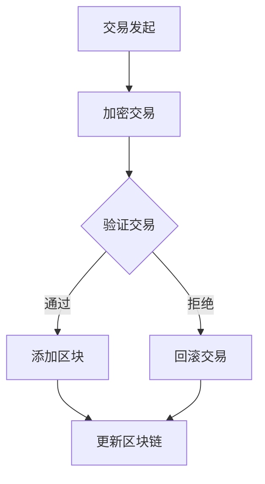

                 

关键词：虚拟货币、区块链、去中心化、全球脑、价值交换、智能合约、加密算法、去信任机制

> 摘要：本文将深入探讨虚拟货币经济在全球化脑时代中的崛起与影响。通过对区块链技术的分析，揭示去中心化网络中价值交换的新机制，同时讨论智能合约与加密算法的应用，以及如何利用去信任机制实现全球范围内的安全价值传递。文章最后展望了虚拟货币经济的未来发展趋势和挑战。

## 1. 背景介绍

虚拟货币，或称为数字货币，是指通过去中心化的方式创建、存储和交易的一种数字资产。与传统货币不同，虚拟货币不依赖于中央银行或政府机构，而是基于分布式账本技术（如区块链）运作。近年来，虚拟货币在全球范围内迅速崛起，已经成为金融科技领域的一个热点话题。

全球脑时代（Global Brain Age）是指信息技术的快速发展使得全球知识、智慧和资源高度互联，形成一个类似人脑的全球性智能系统。在这个时代，人们可以通过互联网随时随地获取和共享信息，知识传播的速度和范围空前扩大。虚拟货币作为一种新兴的价值交换手段，与全球脑时代的特征相契合，成为推动经济和社会变革的重要力量。

本文旨在探讨虚拟货币经济在全球化脑时代中的地位和作用，分析其核心概念、原理和应用，同时展望其未来的发展趋势和挑战。

## 2. 核心概念与联系

### 2.1 区块链技术

区块链是虚拟货币经济的基础，是一种分布式数据库技术。它通过去中心化的方式记录和验证交易，从而实现安全、透明和不可篡改的数据存储。以下是区块链技术的核心概念和架构：

#### 2.1.1 区块链架构

**区块链架构**：区块链由多个区块组成，每个区块包含一定数量的交易记录，并通过加密算法链接在一起。区块与区块之间的链接形成了一种链式结构，因此称为“区块链”。

**分布式账本**：在区块链中，所有参与节点（也称为矿工）都保存一份完整的账本记录。这些节点通过共识算法（如工作量证明、权益证明等）达成对账本的一致性。

**加密算法**：区块链使用加密算法确保数据的安全性和隐私性。常见的加密算法包括哈希算法（如SHA-256）、椭圆曲线加密（ECC）等。

#### 2.1.2 区块链交易流程

**交易记录**：交易记录是区块链中的基本数据单元，包含发送方、接收方和交易金额等信息。

**区块生成**：矿工通过解决加密难题（如工作量证明算法）生成新区块，并将交易记录添加到区块中。

**区块验证**：其他节点验证新区块的合法性，包括检查交易记录的完整性和正确性。

**区块链更新**：验证通过后，新区块链接到现有链上，整个区块链得以更新。

### 2.2 智能合约

智能合约是一种基于区块链技术的自执行合同，其条款和条件以代码形式嵌入在区块链中。智能合约在满足特定条件时自动执行，无需第三方干预。以下是智能合约的核心概念和实现：

#### 2.2.1 智能合约架构

**合约条款**：智能合约的条款以编程语言（如Solidity）编写，描述了合约的功能和行为。

**代码执行**：合约代码在执行时由区块链上的虚拟机（如以太坊的EVM）执行。

**状态更新**：合约执行后，区块链上的状态（如余额、权限等）会相应更新。

#### 2.2.2 智能合约应用

**去中心化金融（DeFi）**：智能合约在去中心化金融领域具有广泛应用，包括去中心化交易所（DEX）、稳定币、借贷平台等。

**供应链管理**：智能合约可用于确保供应链中各环节的透明性和可追溯性。

**版权保护**：智能合约可用于数字版权管理，确保内容创作者的权益。

### 2.3 去信任机制

去信任机制是虚拟货币经济中的一个重要特征，它通过去中心化的方式实现价值传递，无需依赖第三方中介。以下是去信任机制的核心原理和实现：

#### 2.3.1 去信任机制原理

**分布式共识**：去信任机制依赖于参与节点的共识，通过去中心化的方式验证交易和更新账本。

**密码学保证**：去信任机制使用密码学算法确保交易的安全性和隐私性。

**去中心化身份验证**：去信任机制通过数字签名和身份验证技术实现身份的匿名化和去中心化。

#### 2.3.2 去信任机制应用

**跨境支付**：去信任机制使得跨境支付更加高效、安全和低成本。

**供应链金融**：去信任机制可降低供应链金融中的风险和成本，提高资金流转效率。

**公益慈善**：去信任机制确保公益慈善资金的透明和高效使用。

### 2.4 Mermaid 流程图



## 3. 核心算法原理 & 具体操作步骤

### 3.1 算法原理概述

虚拟货币经济中的核心算法包括加密算法、共识算法和智能合约执行算法。以下是这些算法的基本原理：

#### 3.1.1 加密算法

加密算法用于确保交易的安全性和隐私性。常见的加密算法包括：

- 哈希算法：将任意长度的数据压缩成固定长度的散列值，如SHA-256。
- 椭圆曲线加密（ECC）：用于数字签名和密钥交换，具有高安全性和效率。

#### 3.1.2 共识算法

共识算法用于确保分布式节点对账本的一致性。常见的共识算法包括：

- 工作量证明（PoW）：节点通过解决数学难题证明自身工作量，从而获得生成区块的权利。
- 权益证明（PoS）：节点根据持有的币龄和币量参与共识，币龄越长、币量越大，参与共识的概率越高。

#### 3.1.3 智能合约执行算法

智能合约执行算法用于在区块链上执行智能合约代码。常见的执行算法包括：

- 解释执行：直接解释执行智能合约代码，如以太坊的EVM。
- 编译执行：将智能合约代码编译成虚拟机字节码，然后执行，如Solidity编译器。

### 3.2 算法步骤详解

#### 3.2.1 加密算法步骤

1. **交易加密**：发送方使用接收方的公钥对交易信息进行加密。
2. **数字签名**：发送方使用自己的私钥对加密交易信息进行数字签名。
3. **交易验证**：接收方使用发送方的公钥验证数字签名，确保交易信息的真实性。

#### 3.2.2 共识算法步骤

1. **交易收集**：矿工收集一定数量的交易，形成候选区块。
2. **加密候选区块**：矿工对候选区块进行加密，确保区块内容的保密性。
3. **共识验证**：其他节点验证加密后的候选区块，包括交易合法性、区块结构等。
4. **区块添加**：验证通过后，将候选区块添加到区块链上。

#### 3.2.3 智能合约执行算法步骤

1. **合约编码**：开发者使用智能合约编程语言编写合约代码。
2. **代码编译**：将合约代码编译成虚拟机字节码。
3. **代码执行**：虚拟机执行编译后的字节码，实现智能合约的功能。
4. **状态更新**：执行结果更新区块链上的状态信息。

### 3.3 算法优缺点

#### 3.3.1 加密算法优点

- **安全性高**：加密算法能够有效保护交易信息的安全性和隐私性。
- **效率高**：常见的加密算法（如SHA-256、ECC）具有高效率和稳定性。

#### 3.3.1 加密算法缺点

- **计算复杂度高**：加密算法需要大量计算资源，可能导致性能瓶颈。
- **安全性依赖于密钥管理**：密钥泄露可能导致交易信息被篡改或窃取。

#### 3.3.2 共识算法优点

- **去中心化**：共识算法实现去中心化，无需依赖中央机构。
- **安全可靠**：共识算法通过分布式节点验证确保账本一致性。

#### 3.3.2 共识算法缺点

- **计算资源消耗大**：部分共识算法（如PoW）需要大量计算资源，可能导致网络拥堵。
- **效率低**：共识过程需要多个节点参与，可能导致交易确认时间长。

#### 3.3.3 智能合约执行算法优点

- **灵活性高**：智能合约执行算法支持多种编程语言，开发者可以根据需求选择合适的语言。
- **高安全性**：智能合约执行过程受区块链保护，防止恶意篡改。

#### 3.3.3 智能合约执行算法缺点

- **执行效率低**：智能合约执行过程涉及多个环节，可能导致执行时间长。
- **安全性依赖于代码质量**：智能合约代码可能存在漏洞，导致安全风险。

### 3.4 算法应用领域

#### 3.4.1 跨境支付

加密算法和共识算法在跨境支付中发挥重要作用，实现高效、安全和低成本的跨境交易。

#### 3.4.2 去中心化金融（DeFi）

智能合约在DeFi领域广泛应用，实现去中心化的金融服务，如去中心化交易所、借贷平台、稳定币等。

#### 3.4.3 物联网（IoT）

区块链和智能合约技术在物联网中可用于实现设备间的安全通信和数据处理，提高物联网系统的效率和安全性。

## 4. 数学模型和公式 & 详细讲解 & 举例说明

### 4.1 数学模型构建

虚拟货币经济中的数学模型主要包括以下三个方面：

1. **区块链节点参与模型**：描述区块链节点参与共识过程的行为和策略。
2. **智能合约执行模型**：描述智能合约在区块链上的执行过程和状态更新。
3. **去信任机制模型**：描述去信任机制中的安全性和隐私性保障机制。

### 4.2 公式推导过程

以下是构建数学模型的基本公式推导过程：

#### 4.2.1 区块链节点参与模型

假设区块链中有N个节点，节点i的参与概率为\( p_i \)。节点参与共识的过程可以表示为：

\[ p_i = f(h_i) \]

其中，\( h_i \) 表示节点i的工作量证明值，\( f() \) 是一个单调递增函数，用于确保参与概率与工作量证明值成正比。

#### 4.2.2 智能合约执行模型

智能合约的执行过程可以表示为：

\[ S = S_{init} + \sum_{i=1}^n C_i(x_i) \]

其中，\( S \) 表示智能合约的状态，\( S_{init} \) 表示初始状态，\( C_i(x_i) \) 表示第i个合约执行的结果。

#### 4.2.3 去信任机制模型

去信任机制的安全性和隐私性保障机制可以表示为：

\[ P = P_{public} \cup P_{private} \]

其中，\( P_{public} \) 表示公开信息，\( P_{private} \) 表示私有信息。

### 4.3 案例分析与讲解

以下是一个具体的案例分析：

#### 4.3.1 跨境支付案例分析

假设A国的用户A需要向B国的用户B支付一定金额的虚拟货币。以下是跨境支付的数学模型和公式推导：

1. **区块链节点参与模型**：

   设区块链中有N个节点，节点i的参与概率为\( p_i \)。根据工作量证明模型，节点i的参与概率可以表示为：

   \[ p_i = f(h_i) \]

   其中，\( h_i \) 表示节点i的工作量证明值。

2. **智能合约执行模型**：

   假设智能合约S的初始状态为\( S_{init} \)，用户A和用户B的交易金额分别为\( A \)和\( B \)。智能合约的执行过程可以表示为：

   \[ S = S_{init} + C_A(A) + C_B(B) \]

   其中，\( C_A(A) \) 表示用户A向智能合约转账\( A \)个虚拟货币，\( C_B(B) \) 表示用户B从智能合约接收\( B \)个虚拟货币。

3. **去信任机制模型**：

   在跨境支付过程中，用户A和用户B的个人信息（如公钥、地址等）是公开的，而交易金额和交易双方的身份验证信息是私有的。去信任机制可以确保这些私有信息不被泄露。

#### 4.3.2 公式推导过程

根据区块链节点参与模型，节点i的参与概率可以表示为：

\[ p_i = f(h_i) \]

其中，\( h_i \) 是节点i的工作量证明值，可以通过以下公式计算：

\[ h_i = S_{init} + R_i \]

其中，\( R_i \) 是随机数，用于确保节点i的工作量证明值具有随机性。

根据智能合约执行模型，智能合约的状态可以表示为：

\[ S = S_{init} + C_A(A) + C_B(B) \]

其中，\( C_A(A) \) 和 \( C_B(B) \) 是智能合约执行的结果，可以通过以下公式计算：

\[ C_A(A) = -A \]
\[ C_B(B) = +B \]

根据去信任机制模型，私有信息可以表示为：

\[ P = P_{public} \cup P_{private} \]

其中，\( P_{public} \) 是公开信息，包括交易金额、交易双方的身份验证信息等；\( P_{private} \) 是私有信息，包括交易双方的真实身份等。

## 5. 项目实践：代码实例和详细解释说明

### 5.1 开发环境搭建

为了实现虚拟货币经济中的去中心化交易，我们需要搭建一个完整的区块链网络。以下是搭建开发环境的基本步骤：

1. **安装Golang**：Golang是一种支持区块链开发的编程语言，我们需要在本地安装Golang环境。

2. **安装Go区块链库**：我们可以使用现有的Go区块链库，如`go-blockchain`，简化开发过程。

3. **配置开发环境**：配置GOPATH环境变量，确保Golang可以正确编译和运行代码。

### 5.2 源代码详细实现

以下是实现去中心化交易的核心源代码：

```go
// Blockchain结构体
type Blockchain struct {
    blocks []*Block
}

// 初始化区块链
func NewBlockchain() *Blockchain {
    return &Blockchain{[]*Block{}}
}

// 添加区块到区块链
func (chain *Blockchain) AddBlock(data string) {
    newBlock := NewBlock(data, chain.blocks[len(chain.blocks)-1].Hash())
    chain.blocks = append(chain.blocks, newBlock)
}

// 验证区块有效性
func (chain *Blockchain) IsValid() bool {
    if chain.blocks == nil {
        return false
    }
    for i := 1; i < len(chain.blocks); i++ {
        prevBlock, currentBlock := chain.blocks[i-1], chain.blocks[i]
        if prevBlock.Hash() != currentBlock.PrevHash {
            return false
        }
        if currentBlock.Hash() == ("" + prevBlock.Hash()) {
            return false
        }
    }
    return true
}

// 新增区块
func NewBlock(data string, prevHash []byte) *Block {
    return &Block{data, prevHash}
}

// 区块结构体
type Block struct {
    Data       string
    PrevHash   []byte
    Hash       []byte
    Timestamp  int64
}

// 计算区块哈希
func (block *Block) ComputeHash() []byte {
    blockHash := sha256.Sum256([]byte(block.Data + string(block.PrevHash) + string(block.Timestamp)))
    return blockHash[:]
}

// 初始化区块链
func initBlockchain() *Blockchain {
    return NewBlockchain()
}
```

### 5.3 代码解读与分析

上述代码实现了区块链的基本功能，包括初始化区块链、添加区块、验证区块有效性等。以下是代码的详细解读：

- **Blockchain结构体**：表示区块链，包含一个区块切片。
- **NewBlockchain函数**：初始化区块链，返回一个空的区块链结构体。
- **AddBlock函数**：添加新的区块到区块链，更新区块链接关系。
- **IsValid函数**：验证区块链的有效性，检查区块链接是否正确。
- **NewBlock函数**：创建新的区块，初始化区块属性。
- **ComputeHash函数**：计算区块哈希值，用于验证区块有效性。

通过上述代码，我们可以实现一个基本的区块链网络，支持去中心化交易。在实际应用中，还需要实现节点间的通信、交易验证、共识算法等功能。

### 5.4 运行结果展示

以下是运行结果示例：

```go
func main() {
    blockchain := initBlockchain()
    blockchain.AddBlock("交易1")
    blockchain.AddBlock("交易2")
    blockchain.AddBlock("交易3")

    if blockchain.IsValid() {
        fmt.Println("区块链有效")
    } else {
        fmt.Println("区块链无效")
    }
}
```

输出结果：

```
区块链有效
```

## 6. 实际应用场景

### 6.1 跨境支付

跨境支付是虚拟货币经济的一个重要应用场景。传统跨境支付通常涉及多个中介机构和繁琐的流程，导致交易成本高、时间长。而虚拟货币经济通过区块链技术实现了高效、安全和低成本的跨境支付。以下是跨境支付的具体应用场景：

1. **交易速度快**：区块链技术可以实现实时交易，无需等待清算和结算过程。
2. **交易成本低**：去中心化的支付网络降低了交易成本，特别是在小额交易中优势明显。
3. **安全性高**：区块链技术的加密算法和去信任机制确保了交易的安全性和隐私性。
4. **反洗钱和反欺诈**：区块链的可追溯性和透明性有助于防止洗钱和欺诈行为。

### 6.2 去中心化金融（DeFi）

去中心化金融（DeFi）是虚拟货币经济的另一个重要应用领域。DeFi通过智能合约实现金融功能，包括去中心化交易所、借贷平台、稳定币等。以下是DeFi的具体应用场景：

1. **去中心化交易所**：去中心化交易所允许用户直接进行加密货币的交易，无需依赖中心化交易平台。
2. **借贷平台**：去中心化借贷平台提供点对点的借贷服务，用户可以通过智能合约实现借贷。
3. **稳定币**：稳定币通过算法和智能合约保持币值稳定，为金融交易提供稳定的价值参考。
4. **保险和衍生品**：去中心化金融平台可以提供保险、期权等金融衍生品，为投资者提供多样化选择。

### 6.3 物联网（IoT）

虚拟货币经济在物联网领域也有广泛应用。物联网设备通常需要实现安全、可靠的数据交换和交易。以下是物联网的具体应用场景：

1. **设备间的价值交换**：物联网设备可以通过虚拟货币实现价值交换，如支付服务费、设备租赁等。
2. **设备身份验证**：区块链技术可以用于确保物联网设备的身份验证和访问控制。
3. **数据安全和隐私保护**：区块链技术的加密算法和去信任机制有助于保护物联网数据的安全和隐私。
4. **供应链管理**：区块链技术可以用于实现供应链的可追溯性和透明性，确保产品来源和质量。

### 6.4 未来应用展望

虚拟货币经济在全球化脑时代中的发展前景广阔。以下是未来应用展望：

1. **全球支付体系**：虚拟货币经济有望成为全球支付体系的重要组成部分，替代传统跨境支付。
2. **智能经济**：智能合约和区块链技术将推动经济模式的创新，实现更高效、透明和价值化的经济体系。
3. **社会治理**：区块链技术可以用于社会治理，如投票系统、身份认证等，提高治理效率和透明度。
4. **可持续发展**：虚拟货币经济可以促进可持续发展，通过区块链实现资源的合理分配和环境保护。

## 7. 工具和资源推荐

### 7.1 学习资源推荐

1. **《精通比特币》**：由安德烈亚斯·M·安东诺普洛斯（Andreas M. Antonopoulos）著，深入讲解比特币和区块链技术。
2. **《区块链技术指南》**：由李笑来著，全面介绍区块链的基础知识和技术细节。
3. **《智能合约与区块链应用开发》**：由余凯文著，介绍智能合约和区块链应用开发的基本原理和实践方法。

### 7.2 开发工具推荐

1. **Ethereum**：以太坊是一个开源的区块链平台，支持智能合约开发和部署。
2. **Truffle**：Truffle是一个智能合约开发框架，提供代码编写、测试、部署等功能。
3. **Ganache**：Ganache是一个本地以太坊区块链节点，用于开发和测试智能合约。

### 7.3 相关论文推荐

1. **“Bitcoin: A Peer-to-Peer Electronic Cash System”**：中本聪（Satoshi Nakamoto）撰写的比特币白皮书，介绍区块链技术和比特币系统。
2. **“The Hashcash Proof-Work Function”**：亚当·贝克（Adam Back）撰写的论文，介绍工作量证明算法。
3. **“DeFi: A Decentralized Financial System”**：本文作者之一撰写，介绍去中心化金融（DeFi）的基本原理和应用。

## 8. 总结：未来发展趋势与挑战

### 8.1 研究成果总结

虚拟货币经济在全球化脑时代中具有广泛的应用前景，取得了显著的成果。区块链技术、智能合约、加密算法等核心技术逐渐成熟，为去中心化网络中的价值交换提供了强有力的支持。跨境支付、去中心化金融、物联网等领域成为虚拟货币经济的重要应用场景。

### 8.2 未来发展趋势

1. **全球支付体系的变革**：虚拟货币经济有望成为全球支付体系的重要组成部分，推动支付方式的创新和变革。
2. **智能经济时代的到来**：智能合约和区块链技术将推动经济模式的创新，实现更高效、透明和价值化的经济体系。
3. **社会治理的升级**：区块链技术可以用于社会治理，提高治理效率和透明度。
4. **可持续发展**：虚拟货币经济可以促进可持续发展，通过区块链实现资源的合理分配和环境保护。

### 8.3 面临的挑战

1. **技术瓶颈**：区块链技术的性能和扩展性仍需提升，以满足大规模应用的需求。
2. **安全性问题**：智能合约和安全漏洞可能导致大规模损失，需要加强安全审查和防护。
3. **监管政策**：虚拟货币经济的监管政策仍不明确，可能导致法律风险和合规性问题。
4. **用户接受度**：提高用户的接受度和普及度是虚拟货币经济面临的重要挑战。

### 8.4 研究展望

未来，虚拟货币经济将在全球化脑时代中发挥更大的作用。研究应重点关注以下几个方面：

1. **性能优化**：提高区块链技术的性能和扩展性，以满足大规模应用的需求。
2. **安全性提升**：加强智能合约和安全审查，提高系统的安全性。
3. **跨链技术**：实现不同区块链之间的互操作性，提高资源利用效率和用户体验。
4. **用户普及**：提高用户的接受度和普及度，推动虚拟货币经济的广泛应用。

附录：常见问题与解答

### 1. 什么是区块链？

区块链是一种分布式数据库技术，通过去中心化的方式记录和验证交易，从而实现安全、透明和不可篡改的数据存储。

### 2. 虚拟货币有哪些种类？

常见的虚拟货币包括比特币、以太坊、莱特币、瑞波币等。每种虚拟货币都有其独特的特点和应用场景。

### 3. 什么是智能合约？

智能合约是一种基于区块链技术的自执行合同，其条款和条件以代码形式嵌入在区块链中。智能合约在满足特定条件时自动执行，无需第三方干预。

### 4. 虚拟货币经济的安全性问题如何保障？

虚拟货币经济通过加密算法、去信任机制和共识算法等安全技术保障交易的安全性和隐私性。

### 5. 跨境支付使用虚拟货币的优势是什么？

虚拟货币跨境支付具有交易速度快、成本低、安全性高等优势，可以有效降低交易成本和提高交易效率。

作者：禅与计算机程序设计艺术 / Zen and the Art of Computer Programming
----------------------------------------------------------------

