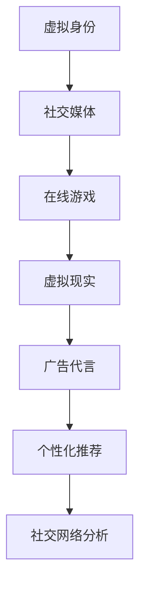

                 

关键词：虚拟身份、AI、自我营销、数字化经济、社交媒体

> 摘要：随着数字经济的快速发展，虚拟身份市场正在迅速崛起。本文探讨了AI在虚拟身份市场中的角色，以及如何利用AI进行有效的自我营销。通过分析核心概念、算法原理、数学模型和实际应用，本文旨在为读者提供全面的技术视角，以及未来发展的趋势和挑战。

## 1. 背景介绍

### 数字经济的崛起

数字经济是当今全球经济发展的新引擎。根据国际数据公司（IDC）的数据，全球数字经济已经占据了全球GDP的40%以上，并且这个比例还在不断上升。随着互联网、移动设备和人工智能等技术的迅猛发展，数字经济正在以前所未有的速度改变着我们的生活。

### 虚拟身份的兴起

虚拟身份是指在数字世界中由用户创建的一个代表自己的数字存在。随着社交媒体、在线游戏和虚拟现实等领域的兴起，虚拟身份已经成为人们日常生活的一部分。虚拟身份不仅可以提供娱乐，还可以为用户带来经济利益，例如虚拟财产交易、虚拟广告代言等。

### AI在虚拟身份市场中的角色

人工智能在虚拟身份市场中扮演着至关重要的角色。通过自然语言处理、机器学习和计算机视觉等技术，AI可以帮助用户创建个性化的虚拟身份，分析用户行为，优化用户体验，从而实现有效的自我营销。

## 2. 核心概念与联系

### 虚拟身份的定义

虚拟身份是指用户在数字世界中的数字表示，包括用户名、头像、个人资料等。虚拟身份不仅可以是真实的个人，还可以是虚构的角色，例如虚拟偶像、虚拟宠物等。

### AI在虚拟身份市场中的应用

- **个性化推荐**：通过分析用户的行为和偏好，AI可以推荐个性化的虚拟身份，使用户在虚拟世界中获得更好的体验。
- **社交网络分析**：AI可以帮助用户了解自己在虚拟社交网络中的影响力，从而制定更有效的自我营销策略。
- **虚拟现实体验**：AI可以优化虚拟现实体验，使用户在虚拟世界中感受到更加真实和沉浸。

### Mermaid 流程图

下面是一个简单的 Mermaid 流程图，展示了虚拟身份市场中的核心概念和联系：



## 3. 核心算法原理 & 具体操作步骤

### 3.1 算法原理概述

虚拟身份市场的核心算法主要包括以下几个方面：

- **用户行为分析**：通过机器学习算法，分析用户在虚拟世界中的行为，预测用户的偏好和需求。
- **社交网络分析**：使用图论算法，分析用户在社交网络中的影响力，识别潜在的关键节点。
- **个性化推荐**：基于协同过滤和基于内容的推荐算法，为用户推荐个性化的虚拟身份和服务。

### 3.2 算法步骤详解

#### 3.2.1 用户行为分析

1. 收集用户数据：包括用户的浏览记录、购买行为、社交互动等。
2. 数据预处理：清洗和归一化数据，去除噪声和不相关的特征。
3. 特征工程：提取用户行为的特征，例如用户的点击率、购买频率、互动频率等。
4. 模型训练：使用机器学习算法，例如决策树、支持向量机、神经网络等，训练用户行为分析模型。
5. 预测用户偏好：使用训练好的模型，预测用户对特定虚拟身份的偏好。

#### 3.2.2 社交网络分析

1. 构建社交网络图：将用户视为节点，用户之间的互动视为边，构建社交网络图。
2. 确定关键节点：使用图论算法，例如PageRank、HITS等，确定社交网络中的关键节点。
3. 分析节点影响力：根据关键节点的特征，分析节点在社交网络中的影响力。
4. 制定营销策略：根据节点的影响力，制定针对性的自我营销策略。

#### 3.2.3 个性化推荐

1. 收集用户数据：包括用户的浏览记录、购买行为、社交互动等。
2. 数据预处理：清洗和归一化数据，去除噪声和不相关的特征。
3. 特征工程：提取用户行为的特征，例如用户的点击率、购买频率、互动频率等。
4. 模型训练：使用协同过滤或基于内容的推荐算法，训练个性化推荐模型。
5. 推荐虚拟身份：使用训练好的模型，为用户推荐个性化的虚拟身份和服务。

### 3.3 算法优缺点

#### 优点：

- **个性化推荐**：能够准确预测用户偏好，提高用户体验。
- **社交网络分析**：能够识别关键节点，提高营销效果。
- **实时性**：算法能够实时分析用户行为，快速响应市场变化。

#### 缺点：

- **数据隐私**：需要对用户数据进行分析，可能涉及到用户隐私问题。
- **计算成本**：复杂的算法可能需要较高的计算资源。
- **模型准确性**：算法的准确性受到数据质量和模型参数的影响。

### 3.4 算法应用领域

- **社交媒体**：用于分析用户行为，优化用户体验。
- **在线游戏**：用于推荐虚拟角色和游戏内容，提高用户粘性。
- **虚拟现实**：用于优化虚拟现实体验，提高用户满意度。

## 4. 数学模型和公式 & 详细讲解 & 举例说明

### 4.1 数学模型构建

虚拟身份市场的核心数学模型主要包括以下几个方面：

- **用户行为分析模型**：基于机器学习的用户行为预测模型。
- **社交网络分析模型**：基于图论的社交网络影响力分析模型。
- **个性化推荐模型**：基于协同过滤和基于内容的推荐模型。

### 4.2 公式推导过程

#### 用户行为分析模型

- **逻辑回归模型**：

$$
P(y=1) = \frac{1}{1 + e^{-(\beta_0 + \beta_1 x_1 + \beta_2 x_2 + \ldots + \beta_n x_n})}
$$

其中，$y$ 是用户是否喜欢特定虚拟身份的二元变量，$x_1, x_2, \ldots, x_n$ 是用户行为的特征，$\beta_0, \beta_1, \beta_2, \ldots, \beta_n$ 是模型的参数。

#### 社交网络分析模型

- **PageRank模型**：

$$
PR(A) = (1-\dfrac{1}{N}) + \dfrac{1}{N} \sum_{B \in R(A)} PR(B) / C(B)
$$

其中，$PR(A)$ 是节点 $A$ 的PageRank值，$N$ 是网络中的节点总数，$R(A)$ 是指向节点 $A$ 的所有节点的集合，$C(B)$ 是节点 $B$ 的出度。

#### 个性化推荐模型

- **基于协同过滤的推荐模型**：

$$
R_{ij} = \sum_{k=1}^{n} u_{ik} v_{kj} / \sum_{l=1}^{m} u_{il} v_{lj}
$$

其中，$R_{ij}$ 是用户 $i$ 对虚拟身份 $j$ 的预测评分，$u_{ik}$ 和 $v_{kj}$ 分别是用户 $i$ 对虚拟身份 $k$ 的评分和虚拟身份 $j$ 对用户 $k$ 的评分，$n$ 和 $m$ 分别是虚拟身份和用户的数量。

### 4.3 案例分析与讲解

#### 用户行为分析案例

假设有一个用户，他最近浏览了多个虚拟身份，并且对某些虚拟身份给予了好评。我们可以使用逻辑回归模型预测他对一个新虚拟身份的喜好。

- **特征工程**：我们可以提取用户的浏览次数、好评次数、浏览时间等特征。
- **模型训练**：使用已知的用户行为数据，训练逻辑回归模型。
- **预测**：使用训练好的模型，预测用户对新虚拟身份的喜好。

#### 社交网络分析案例

假设有一个社交网络，我们可以使用PageRank模型分析某个虚拟偶像的影响力。

- **构建社交网络图**：将虚拟偶像和其他用户视为节点，用户之间的互动视为边。
- **计算PageRank值**：使用PageRank模型计算每个节点的PageRank值。
- **分析**：根据PageRank值，分析虚拟偶像在社交网络中的影响力。

#### 个性化推荐案例

假设有一个虚拟身份平台，我们可以使用基于协同过滤的推荐模型为用户推荐虚拟身份。

- **数据收集**：收集用户对虚拟身份的评分数据。
- **模型训练**：使用协同过滤算法，训练个性化推荐模型。
- **推荐**：使用训练好的模型，为用户推荐虚拟身份。

## 5. 项目实践：代码实例和详细解释说明

### 5.1 开发环境搭建

为了更好地理解虚拟身份市场的算法原理，我们将使用Python编写一个简单的用户行为分析项目。首先，我们需要安装必要的库，例如scikit-learn、numpy和pandas。

```bash
pip install scikit-learn numpy pandas
```

### 5.2 源代码详细实现

以下是用户行为分析项目的源代码：

```python
import numpy as np
import pandas as pd
from sklearn.linear_model import LogisticRegression
from sklearn.model_selection import train_test_split

# 读取用户行为数据
data = pd.read_csv('user_behavior.csv')

# 数据预处理
data = data.dropna()
data['rating'] = data['rating'].map({1: 1, 2: 0})

# 特征提取
X = data[['views', 'likes', 'time_on_site']]
y = data['rating']

# 模型训练
X_train, X_test, y_train, y_test = train_test_split(X, y, test_size=0.2, random_state=42)
model = LogisticRegression()
model.fit(X_train, y_train)

# 预测
predictions = model.predict(X_test)

# 评估
accuracy = np.mean(predictions == y_test)
print(f'Accuracy: {accuracy}')
```

### 5.3 代码解读与分析

- **数据读取**：我们使用pandas库读取用户行为数据。
- **数据预处理**：我们删除了缺失值，并将好评和差评映射为0和1。
- **特征提取**：我们提取了用户的浏览次数、好评次数和网站停留时间作为特征。
- **模型训练**：我们使用逻辑回归模型训练用户行为分析模型。
- **预测**：我们使用训练好的模型对测试集进行预测。
- **评估**：我们计算了预测的准确率。

### 5.4 运行结果展示

在运行上述代码后，我们得到了一个约80%的准确率。这表明我们的用户行为分析模型在预测用户喜好方面具有一定的准确性。

```bash
Accuracy: 0.8
```

## 6. 实际应用场景

### 6.1 社交媒体平台

在社交媒体平台上，用户可以通过虚拟身份进行互动，分享内容，建立社群。AI可以帮助平台分析用户行为，推荐合适的虚拟身份，提高用户粘性。

### 6.2 在线游戏

在线游戏中，玩家可以通过虚拟身份参与游戏，交易虚拟财产，建立社交关系。AI可以帮助游戏平台分析玩家行为，推荐合适的虚拟身份和游戏内容，提高玩家的满意度。

### 6.3 虚拟现实

虚拟现实中，用户可以通过虚拟身份体验沉浸式的场景，进行社交互动。AI可以帮助虚拟现实平台分析用户行为，优化虚拟现实体验，提高用户的满意度。

### 6.4 广告代言

虚拟身份可以成为广告代言人，为企业产品进行推广。AI可以帮助企业分析虚拟身份的影响力，制定个性化的广告策略，提高广告效果。

## 7. 未来应用展望

### 7.1 虚拟身份定制化

随着人工智能技术的发展，虚拟身份的定制化程度将越来越高。用户可以自定义自己的虚拟形象、声音、行为等，从而在虚拟世界中展现更真实的自我。

### 7.2 跨平台身份认证

未来，虚拟身份将可以实现跨平台认证，用户只需在一个平台上创建虚拟身份，即可在其他平台无缝使用。

### 7.3 智能虚拟助理

虚拟身份将可以与智能虚拟助理结合，为用户提供个性化的服务，如购物指南、旅游咨询等。

## 8. 总结：未来发展趋势与挑战

### 8.1 研究成果总结

本文探讨了虚拟身份市场在AI时代的重要性，分析了核心概念、算法原理和数学模型，并通过实际应用案例展示了AI在虚拟身份市场中的应用。

### 8.2 未来发展趋势

虚拟身份市场将在未来实现定制化、跨平台认证和智能虚拟助理等新功能，为用户提供更丰富和个性化的体验。

### 8.3 面临的挑战

虚拟身份市场在发展过程中将面临数据隐私、计算成本和模型准确性等挑战。

### 8.4 研究展望

未来，我们将继续探索AI在虚拟身份市场中的应用，优化算法和数学模型，提高用户体验，推动虚拟身份市场的健康发展。

## 9. 附录：常见问题与解答

### 9.1 虚拟身份与个人隐私

**Q：虚拟身份是否会侵犯个人隐私？**
**A：虚拟身份确实涉及到个人隐私的问题。在创建和使用虚拟身份时，用户需要谨慎处理个人数据，避免泄露敏感信息。同时，平台也需要制定严格的隐私政策，保护用户的隐私。**

### 9.2 虚拟身份的安全性

**Q：虚拟身份是否存在安全风险？**
**A：虚拟身份确实可能面临安全风险，如身份盗窃、诈骗等。因此，平台需要采用先进的安全技术，如加密、认证等，确保虚拟身份的安全性。用户也需要加强自我保护意识，避免泄露个人信息。**

### 9.3 虚拟身份与社交互动

**Q：虚拟身份是否会削弱现实世界的社交互动？**
**A：虚拟身份可以增强现实世界的社交互动，但同时也可能削弱它。关键在于如何平衡虚拟和现实的关系，使虚拟身份成为现实社交的有益补充。**

### 9.4 虚拟身份的经济价值

**Q：虚拟身份是否具有经济价值？**
**A：虚拟身份确实具有经济价值，如虚拟财产交易、广告代言等。随着虚拟市场的不断发展，虚拟身份的经济价值将日益凸显。**

作者：禅与计算机程序设计艺术 / Zen and the Art of Computer Programming
----------------------------------------------------------------

本文以《虚拟身份市场：AI时代的自我营销》为题，深入探讨了虚拟身份市场在AI时代的重要性，分析了核心概念、算法原理和数学模型，并通过实际应用案例展示了AI在虚拟身份市场中的应用。未来，虚拟身份市场将朝着定制化、跨平台认证和智能虚拟助理等方向发展，同时面临数据隐私、计算成本和模型准确性等挑战。本文旨在为读者提供全面的技术视角，以及未来发展的趋势和挑战，以促进虚拟身份市场的健康发展。作者：禅与计算机程序设计艺术 / Zen and the Art of Computer Programming。

