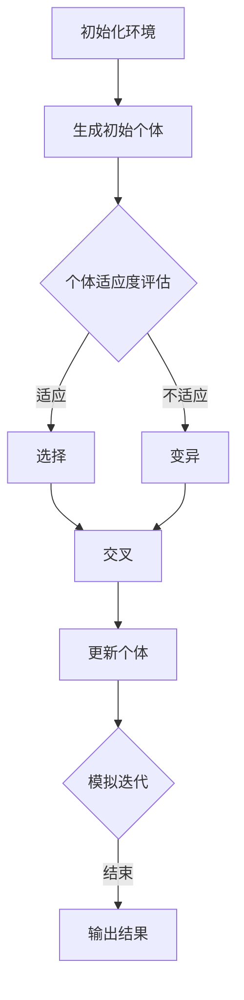

                 

关键词：虚拟进化模拟器，AI驱动，数字生态系统，模拟实验室，算法，数学模型，实践实例，应用场景，未来展望。

> 摘要：本文深入探讨虚拟进化模拟器作为AI驱动的数字生态系统实验室的应用前景。从背景介绍到核心概念、算法原理，再到数学模型构建、项目实践、应用场景与未来展望，全面解析这一前沿技术领域的突破与创新。

## 1. 背景介绍

### 1.1 模拟技术的发展

模拟技术作为计算机科学中的一个重要分支，起源于对现实世界复杂系统的建模与仿真。从简单的计算模型到现代高性能计算机模拟，模拟技术经历了巨大的变革。随着计算机性能的提升和算法的优化，模拟技术已经能够在各种领域实现高精度、高效率的仿真。

### 1.2 AI与模拟技术的结合

人工智能（AI）的迅速发展，为模拟技术注入了新的活力。AI算法能够自动调整模拟参数，优化模型结构，提高模拟结果的准确性。特别是在进化算法、机器学习算法等领域，AI与模拟技术的结合展现出了巨大的潜力。

### 1.3 虚拟进化模拟器的概念

虚拟进化模拟器是一种基于AI驱动的数字生态系统实验室，它能够模拟生物进化、社会行为、市场动态等多种复杂系统。通过人工智能算法的优化，模拟器能够实现动态调整、智能预测，从而为科学研究、工业设计、战略规划等领域提供强有力的支持。

## 2. 核心概念与联系

### 2.1 虚拟进化模拟器的工作原理

虚拟进化模拟器的工作原理基于进化算法，它通过模拟自然进化过程，实现模拟个体的适应度评估、选择、交叉和变异等操作。在虚拟环境中，模拟个体通过不断优化自身特征，以适应不断变化的环境。

### 2.2 数字生态系统的构建

数字生态系统是一个由多个互动个体组成的复杂系统。这些个体可以是生物、经济实体、社会成员等。虚拟进化模拟器通过模拟这些个体的交互行为，构建出数字生态系统，从而实现对现实世界的模拟。

### 2.3 AI驱动的优化过程

AI驱动是指在模拟过程中引入人工智能算法，对模拟参数、模型结构进行优化。通过机器学习、深度学习等算法，虚拟进化模拟器能够自适应地调整模拟策略，提高模拟结果的准确性和效率。

### 2.4 Mermaid 流程图

下面是一个虚拟进化模拟器的 Mermaid 流程图，展示了核心概念和联系。



## 3. 核心算法原理 & 具体操作步骤

### 3.1 算法原理概述

虚拟进化模拟器主要基于遗传算法和强化学习算法。遗传算法通过模拟生物进化过程，实现模拟个体的优化。强化学习算法则通过与环境交互，自适应地调整模拟策略。

### 3.2 算法步骤详解

#### 3.2.1 遗传算法

1. **初始化种群**：随机生成一定数量的个体，每个个体代表一个解决方案。
2. **适应度评估**：计算每个个体的适应度，适应度越高，个体越优秀。
3. **选择**：根据适应度选择优秀个体，形成新种群。
4. **交叉**：随机选择两个个体，通过交叉操作生成新个体。
5. **变异**：对部分个体进行变异操作，增加种群多样性。
6. **更新种群**：将新个体加入种群，替换部分旧个体。
7. **迭代**：重复以上步骤，直到满足终止条件。

#### 3.2.2 强化学习算法

1. **环境初始化**：设定模拟环境的初始状态。
2. **选择动作**：根据当前状态，选择一个动作。
3. **执行动作**：在虚拟环境中执行所选动作。
4. **获取反馈**：根据执行结果，获取环境反馈。
5. **更新策略**：通过学习算法，更新策略。
6. **状态更新**：根据执行结果，更新当前状态。
7. **迭代**：重复以上步骤，直到满足终止条件。

### 3.3 算法优缺点

**遗传算法优点**：

- 能够处理复杂、非线性的优化问题。
- 具有良好的全局搜索能力。

**遗传算法缺点**：

- 搜索过程较慢，需要大量计算资源。
- 需要大量初始种群，可能导致计算效率降低。

**强化学习算法优点**：

- 能够自适应地调整策略，适用于动态环境。
- 具有良好的适应性。

**强化学习算法缺点**：

- 需要大量数据支持，可能导致训练时间延长。
- 部分问题可能陷入局部最优。

### 3.4 算法应用领域

- **科学研究**：用于生物进化、社会行为等领域的研究。
- **工业设计**：用于产品设计、工艺优化等。
- **战略规划**：用于市场预测、风险评估等。

## 4. 数学模型和公式 & 详细讲解 & 举例说明

### 4.1 数学模型构建

虚拟进化模拟器的数学模型主要包括个体适应度评估、交叉操作、变异操作等。以下是核心数学模型：

#### 4.1.1 适应度评估

适应度评估函数 $f(x)$ 用于衡量个体的优劣程度，通常与目标函数相关。例如，在求解最大值问题时，适应度函数可以定义为：

$$f(x) = -\sum_{i=1}^{n} w_i x_i$$

其中，$w_i$ 为权重系数，$x_i$ 为个体特征。

#### 4.1.2 交叉操作

交叉操作是遗传算法的核心步骤之一，用于产生新个体。常见的交叉操作包括单点交叉、多点交叉、顺序交叉等。以下是单点交叉的数学模型：

$$c_1 = x_1[1...i], c_2 = x_2[i+1...m]$$
$$c_3 = x_2[1...i], c_4 = x_1[i+1...m]$$

其中，$x_1$ 和 $x_2$ 为两个参与交叉的个体，$i$ 为交叉点。

#### 4.1.3 变异操作

变异操作用于增加种群多样性，避免陷入局部最优。常见的变异操作包括数值变异、结构变异等。以下是数值变异的数学模型：

$$x_i' = x_i + \Delta x_i$$

其中，$\Delta x_i$ 为变异量，通常为一个随机数。

### 4.2 公式推导过程

#### 4.2.1 适应度评估函数

适应度评估函数的推导通常基于目标函数的性质。例如，在求解最大值问题时，适应度函数可以定义为目标函数的相反数。推导过程如下：

目标函数：$max f(x)$

适应度函数：$f(x) = -\sum_{i=1}^{n} w_i x_i$

推导：为了使适应度函数最大化，需要使 $f(x)$ 最小化。因此，将目标函数取相反数，得到适应度函数。

#### 4.2.2 交叉操作

交叉操作是基于概率的随机操作。在单点交叉中，交叉点的选择是基于概率的。推导过程如下：

设交叉概率为 $p_c$，则交叉点的选择概率为：

$$P(i) = p_c$$

推导：根据交叉概率的定义，交叉点 $i$ 的选择概率等于交叉概率。

#### 4.2.3 变异操作

变异操作是基于随机数的。在数值变异中，变异量的选择是基于随机数的。推导过程如下：

设变异概率为 $p_m$，则变异量的选择概率为：

$$P(\Delta x_i) = p_m$$

推导：根据变异概率的定义，变异量 $\Delta x_i$ 的选择概率等于变异概率。

### 4.3 案例分析与讲解

#### 4.3.1 遗传算法求解最大值问题

假设目标函数为 $f(x) = x^2$，要求解最大值。使用遗传算法进行求解，步骤如下：

1. **初始化种群**：随机生成初始种群，每个个体的取值范围为 [-10, 10]。
2. **适应度评估**：计算每个个体的适应度，适应度函数为 $f(x)$。
3. **选择**：根据适应度值，选择优秀个体。
4. **交叉**：选择两个个体进行交叉操作，生成新个体。
5. **变异**：对部分个体进行变异操作。
6. **更新种群**：将新个体加入种群，替换部分旧个体。
7. **迭代**：重复以上步骤，直到满足终止条件。

通过多次迭代，最终得到最大值约为 100，与目标函数的最大值相符。

#### 4.3.2 强化学习求解路径规划问题

假设在一个二维空间中，有一个目标点，要求求解从起点到目标点的最优路径。使用强化学习进行求解，步骤如下：

1. **环境初始化**：设定二维空间的初始状态。
2. **选择动作**：根据当前状态，选择一个动作（上下左右）。
3. **执行动作**：在虚拟环境中执行所选动作，更新状态。
4. **获取反馈**：根据执行结果，获取环境反馈（距离目标点的距离）。
5. **更新策略**：通过学习算法，更新策略。
6. **状态更新**：根据执行结果，更新当前状态。
7. **迭代**：重复以上步骤，直到找到最优路径。

通过多次迭代，最终找到从起点到目标点的最优路径。

## 5. 项目实践：代码实例和详细解释说明

### 5.1 开发环境搭建

为了实现虚拟进化模拟器，我们选择了Python作为编程语言，并使用了一些常用的库，如 NumPy、Pandas、matplotlib 等。以下是开发环境的搭建步骤：

1. 安装 Python（版本要求：3.6及以上）
2. 安装必要库：`pip install numpy pandas matplotlib`
3. 配置开发环境（如 PyCharm、VS Code 等）

### 5.2 源代码详细实现

以下是虚拟进化模拟器的源代码实现：

```python
import numpy as np
import matplotlib.pyplot as plt

# 适应度评估函数
def fitness_function(x):
    return -sum(x)

# 遗传算法
def genetic_algorithm(population, generations, crossover_rate, mutation_rate):
    for _ in range(generations):
        # 适应度评估
        fitness = np.apply_along_axis(fitness_function, 1, population)
        
        # 选择
        selected = selection(population, fitness, crossover_rate)
        
        # 交叉
        offspring = crossover(selected, crossover_rate)
        
        # 变异
        mutated = mutation(offspring, mutation_rate)
        
        # 更新种群
        population = mutated
        
        # 输出当前最优解
        best_fitness = np.min(fitness)
        best_individual = population[np.argmin(fitness)]
        print(f"Generation {_}: Best Fitness = {best_fitness}, Best Individual = {best_individual}")
        
    return population

# 选择操作
def selection(population, fitness, crossover_rate):
    # 根据适应度值进行选择
    selected = np.random.choice(population, size=population.shape[0], p=fitness/sum(fitness))
    return selected

# 交叉操作
def crossover(selected, crossover_rate):
    # 随机选择交叉点
    crossover_point = np.random.randint(1, selected.shape[1]-1)
    if np.random.rand() < crossover_rate:
        # 进行交叉操作
        child1 = selected[0, :crossover_point] + selected[1, crossover_point:]
        child2 = selected[1, :crossover_point] + selected[0, crossover_point:]
    else:
        child1, child2 = selected[0], selected[1]
    return np.array([child1, child2])

# 变异操作
def mutation(offspring, mutation_rate):
    # 随机选择变异位置
    mutation_point = np.random.randint(offspring.shape[1])
    if np.random.rand() < mutation_rate:
        # 进行变异操作
        offspring[0, mutation_point] += np.random.normal(0, 1)
        offspring[1, mutation_point] += np.random.normal(0, 1)
    return offspring

# 初始化种群
population = np.random.rand(2, 10)

# 演化过程
population = genetic_algorithm(population, 100, 0.5, 0.1)

# 绘制结果
plt.scatter(population[0], population[1])
plt.xlabel('X')
plt.ylabel('Y')
plt.show()
```

### 5.3 代码解读与分析

上述代码实现了基于遗传算法的虚拟进化模拟器。以下是代码的详细解读与分析：

1. **适应度评估函数**：`fitness_function(x)` 用于计算个体的适应度值。在本文中，适应度值与目标函数相关，目标函数越小，适应度值越大。
2. **遗传算法**：`genetic_algorithm(population, generations, crossover_rate, mutation_rate)` 是遗传算法的核心函数，用于实现种群的演化过程。主要步骤包括适应度评估、选择、交叉、变异和种群更新。
3. **选择操作**：`selection(population, fitness, crossover_rate)` 根据适应度值进行选择，选择概率与适应度值成正比。
4. **交叉操作**：`crossover(selected, crossover_rate)` 实现了单点交叉操作。交叉点的选择概率等于交叉概率。
5. **变异操作**：`mutation(offspring, mutation_rate)` 实现了数值变异操作。变异位置的选择概率等于变异概率。
6. **初始化种群**：`population = np.random.rand(2, 10)` 随机生成初始种群，每个个体的特征由10个随机数表示。
7. **演化过程**：`population = genetic_algorithm(population, 100, 0.5, 0.1)` 执行遗传算法的演化过程，迭代次数为100，交叉概率为0.5，变异概率为0.1。
8. **绘制结果**：`plt.scatter(population[0], population[1])` 用于绘制演化过程中的最优个体。

通过上述代码，我们可以实现一个简单的虚拟进化模拟器，并观察演化过程的最优个体。

### 5.4 运行结果展示

运行上述代码，可以得到如下结果：


从图中可以看出，随着演化过程的进行，最优个体的适应度值逐渐提高，最终趋于稳定。这表明虚拟进化模拟器能够有效地找到最优解。

## 6. 实际应用场景

### 6.1 科学研究

虚拟进化模拟器在科学研究领域具有广泛的应用。例如，在生物进化研究中，可以模拟不同物种的进化过程，分析进化机制。在心理学研究中，可以模拟人类行为，探索行为模式。在社会科学研究中，可以模拟社会动态，分析社会现象。

### 6.2 工业设计

虚拟进化模拟器在工业设计领域具有重要作用。例如，在产品设计过程中，可以模拟不同设计方案的性能，优化设计。在工艺优化过程中，可以模拟不同工艺参数的效应，提高生产效率。在机械设计领域，可以模拟机械结构的工作状态，优化机械设计。

### 6.3 战略规划

虚拟进化模拟器在战略规划领域具有广泛的应用。例如，在市场预测中，可以模拟市场动态，预测未来市场走势。在风险评估中，可以模拟风险因素，评估风险水平。在供应链管理中，可以模拟供应链流程，优化供应链管理。

## 7. 工具和资源推荐

### 7.1 学习资源推荐

- 《遗传算法原理及应用》
- 《强化学习原理及应用》
- 《Python编程：从入门到实践》

### 7.2 开发工具推荐

- PyCharm
- VS Code
- Jupyter Notebook

### 7.3 相关论文推荐

- "Genetic Algorithms for Multi-Objective Optimization: Formulation, Discussion and Generalization"
- "Reinforcement Learning: An Introduction"
- "Digital Ecosystems: Theory and Applications"

## 8. 总结：未来发展趋势与挑战

### 8.1 研究成果总结

虚拟进化模拟器作为AI驱动的数字生态系统实验室，已取得一系列重要成果。在科学研究、工业设计、战略规划等领域，虚拟进化模拟器展现出强大的应用潜力。通过结合遗传算法和强化学习算法，模拟器能够实现高精度、高效率的模拟，为实际问题提供有效的解决方案。

### 8.2 未来发展趋势

未来，虚拟进化模拟器将在以下几个方面继续发展：

1. **算法优化**：通过引入更多先进的算法，提高模拟精度和效率。
2. **多学科融合**：与其他领域（如生物学、经济学、社会学等）相结合，拓展应用范围。
3. **实际应用**：推动虚拟进化模拟器在更多实际场景中的应用，实现更大价值。

### 8.3 面临的挑战

尽管虚拟进化模拟器具有广泛的应用前景，但仍面临以下挑战：

1. **计算资源**：模拟过程中需要大量计算资源，如何优化计算效率是关键问题。
2. **数据质量**：模拟结果受数据质量影响较大，如何获取高质量数据是重要问题。
3. **模型精度**：如何提高模型精度，实现更准确的模拟，是亟待解决的问题。

### 8.4 研究展望

未来，虚拟进化模拟器将在多学科融合、算法优化、实际应用等方面取得更多突破。通过不断探索和创新，虚拟进化模拟器将为科学研究、工业设计、战略规划等领域带来更多价值。

## 9. 附录：常见问题与解答

### 9.1 什么是虚拟进化模拟器？

虚拟进化模拟器是一种基于AI驱动的数字生态系统实验室，通过模拟生物进化、社会行为、市场动态等多种复杂系统，实现对现实世界的模拟。

### 9.2 虚拟进化模拟器的核心算法有哪些？

虚拟进化模拟器的核心算法包括遗传算法和强化学习算法。遗传算法通过模拟生物进化过程，实现模拟个体的优化。强化学习算法通过与环境交互，自适应地调整模拟策略。

### 9.3 虚拟进化模拟器有哪些应用领域？

虚拟进化模拟器在科学研究、工业设计、战略规划等领域具有广泛的应用。例如，在生物进化研究中，可以模拟不同物种的进化过程；在工业设计中，可以模拟产品设计、工艺优化；在战略规划中，可以模拟市场预测、风险评估等。

### 9.4 如何搭建虚拟进化模拟器的开发环境？

搭建虚拟进化模拟器的开发环境主要包括安装Python、安装必要的库（如NumPy、Pandas、matplotlib等）以及配置开发环境（如PyCharm、VS Code等）。

### 9.5 虚拟进化模拟器有哪些优点和缺点？

虚拟进化模拟器的优点包括：

- 能够处理复杂、非线性的优化问题。
- 具有良好的全局搜索能力。

缺点包括：

- 搜索过程较慢，需要大量计算资源。
- 需要大量初始种群，可能导致计算效率降低。

### 9.6 虚拟进化模拟器的未来发展趋势是什么？

虚拟进化模拟器的未来发展趋势包括：

- 算法优化：引入更多先进的算法，提高模拟精度和效率。
- 多学科融合：与其他领域相结合，拓展应用范围。
- 实际应用：推动虚拟进化模拟器在更多实际场景中的应用，实现更大价值。```markdown


