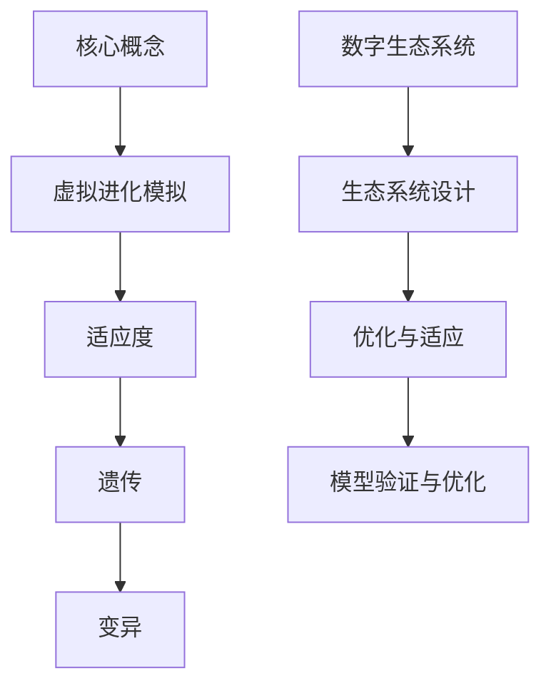
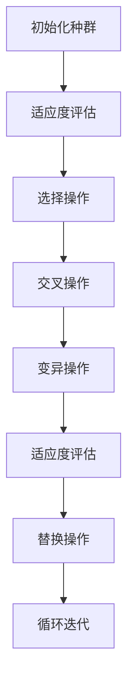

                 

关键词：虚拟进化模拟、人工智能、数字生态系统、算法原理、数学模型、项目实践、应用场景、未来展望

## 摘要

本文深入探讨了虚拟进化模拟技术在AI驱动的数字生态系统中的应用。通过分析核心概念、算法原理以及数学模型，本文揭示了虚拟进化模拟在生态系统设计、优化和自适应能力提升方面的独特优势。文章还通过实际项目实践，展示了如何将虚拟进化模拟与人工智能相结合，推动数字生态系统的创新发展。最后，本文对未来虚拟进化模拟技术的研究方向和挑战进行了展望，为相关领域的研究者和开发者提供了有价值的参考。

## 1. 背景介绍

虚拟进化模拟（Virtual Evolution Simulation，VES）作为一种基于计算机仿真技术的方法，旨在通过模拟自然界中的进化过程来探索系统动态演化行为。随着人工智能（Artificial Intelligence，AI）的快速发展，虚拟进化模拟逐渐成为数字生态系统研究中的重要工具。数字生态系统是指由计算节点、数据流和网络结构组成的一种复杂系统，具有高度的自组织性和动态性。在这种背景下，虚拟进化模拟技术通过模拟生物进化过程，为数字生态系统的设计、优化和适应性提供了新的思路和方法。

### 1.1 研究动机

数字生态系统在现代科技中的应用日益广泛，如智慧城市、物联网、区块链等。这些生态系统需要具备高度的自适应能力，以应对复杂多变的环境和需求。然而，传统的开发方法往往难以满足这种需求。虚拟进化模拟技术通过模拟自然进化过程，可以为数字生态系统提供一种自下而上的设计方法，从而提高其自适应能力和创新能力。同时，人工智能技术的引入，使得虚拟进化模拟在数据处理、模型优化等方面具有更高的效率和准确性。

### 1.2 研究现状

当前，虚拟进化模拟技术在数字生态系统研究中已有一些应用案例。例如，在智慧城市建设中，虚拟进化模拟用于模拟城市交通系统、能源系统等的演化过程，以优化城市资源配置。在物联网领域，虚拟进化模拟技术用于优化传感器网络的自组织能力和数据传输效率。在区块链领域，虚拟进化模拟技术用于模拟区块链网络的演化过程，以优化区块链的性能和安全性。

### 1.3 本文结构

本文结构如下：首先，介绍虚拟进化模拟的核心概念和算法原理；然后，详细讲解数学模型的构建和公式推导；接着，通过实际项目实践，展示虚拟进化模拟技术的应用；最后，探讨虚拟进化模拟技术在数字生态系统中的实际应用场景和未来展望。

## 2. 核心概念与联系

### 2.1 虚拟进化模拟

虚拟进化模拟是指通过计算机仿真技术，模拟生物进化过程中的适应度、遗传、变异等机制，从而探索系统动态演化行为的方法。在虚拟进化模拟中，适应度（Fitness）是评估个体优劣的重要指标，通过适应度函数来量化。遗传（Genetic）和变异（Mutation）机制则模拟了生物进化过程中的基因传递和突变过程，以实现个体的进化。

### 2.2 数字生态系统

数字生态系统是由计算节点、数据流和网络结构组成的一种复杂系统。计算节点包括传感器、处理单元等，负责数据的采集和处理。数据流是指数据在系统中的传输和交换过程，网络结构则定义了系统中的连接关系和交互模式。数字生态系统具有高度的自组织性和动态性，能够适应环境变化和需求变化。

### 2.3 联系与联系

虚拟进化模拟与数字生态系统之间的联系主要体现在以下几个方面：

1. **生态系统设计**：通过虚拟进化模拟，可以模拟数字生态系统的演化过程，为系统设计提供参考。例如，在智慧城市建设中，虚拟进化模拟可以用于优化城市交通系统、能源系统等的布局和资源配置。

2. **优化与适应**：虚拟进化模拟技术可以通过模拟自然进化过程，提高数字生态系统的自适应能力和优化能力。例如，在物联网中，虚拟进化模拟可以用于优化传感器网络的自组织能力和数据传输效率。

3. **模型验证与优化**：虚拟进化模拟技术可以为数字生态系统模型提供验证和优化手段。通过模拟不同条件下的生态系统演化过程，可以评估模型的有效性和准确性，并对其进行优化。

### 2.4 Mermaid 流程图



## 3. 核心算法原理 & 具体操作步骤

### 3.1 算法原理概述

虚拟进化模拟算法的核心原理基于自然进化过程，包括适应度评估、遗传操作和变异操作。适应度评估是算法的基础，通过适应度函数计算个体优劣；遗传操作模拟了生物进化的基因传递过程，包括交叉和突变；变异操作则模拟了生物进化的基因突变过程。

### 3.2 算法步骤详解

1. **初始化种群**：生成初始种群，每个个体代表一个可能的解决方案。

2. **适应度评估**：计算每个个体的适应度，适应度高的个体代表较好的解决方案。

3. **选择操作**：根据适应度，选择一部分个体作为父代。

4. **交叉操作**：对选中的父代进行交叉操作，产生新的子代。

5. **变异操作**：对子代进行变异操作，引入新的遗传变异。

6. **适应度评估**：对新产生的个体进行适应度评估。

7. **替换操作**：将适应度较高的子代替换适应度较低的父代。

8. **循环迭代**：重复执行上述步骤，直至满足终止条件（如达到最大迭代次数或适应度达到预设阈值）。

### 3.3 算法优缺点

**优点**：

- **自适应性**：虚拟进化模拟算法具有自适应性，能够根据环境变化和需求变化进行进化。
- **全局优化**：算法通过模拟自然进化过程，具有全局优化能力，能够找到较好的解决方案。
- **灵活性**：算法适用于多种问题和场景，具有较好的灵活性。

**缺点**：

- **计算复杂度高**：虚拟进化模拟算法的计算复杂度较高，特别是在大规模问题上。
- **局部最优**：在某些情况下，算法可能会陷入局部最优，难以找到全局最优解。

### 3.4 算法应用领域

虚拟进化模拟算法在数字生态系统研究中有广泛的应用，包括：

- **生态系统设计**：用于优化生态系统中的资源分配、网络结构等。
- **优化与适应**：用于优化数字生态系统的性能、自适应能力和创新能力。
- **模型验证与优化**：用于验证和优化数字生态系统模型，提高模型的有效性和准确性。

### 3.5 Mermaid 流程图



## 4. 数学模型和公式 & 详细讲解 & 举例说明

### 4.1 数学模型构建

虚拟进化模拟算法中的数学模型主要包括适应度函数、交叉操作、变异操作等。以下分别进行详细讲解。

#### 4.1.1 适应度函数

适应度函数是评估个体优劣的重要指标，常见的适应度函数有：

- **线性适应度函数**：
  $$ f(x) = x $$
  
- **指数适应度函数**：
  $$ f(x) = e^x $$

- **高斯适应度函数**：
  $$ f(x) = \frac{1}{\sqrt{2\pi\sigma^2}}e^{-\frac{(x-\mu)^2}{2\sigma^2}} $$

其中，$x$ 表示个体，$\mu$ 和 $\sigma^2$ 分别为均值和方差。

#### 4.1.2 交叉操作

交叉操作是指将两个父代个体的基因进行组合，生成新的子代个体。常见的交叉操作有：

- **单点交叉**：
  $$ C_1(x_1, x_2) = (x_1[1, i], x_2[i+1, n]) $$

- **多点交叉**：
  $$ C_2(x_1, x_2) = (x_1[1, i], x_2[i+1, j], x_1[j+1, n]) $$

其中，$x_1$ 和 $x_2$ 为父代个体，$i$ 和 $j$ 为交叉点。

#### 4.1.3 变异操作

变异操作是指对个体基因进行随机改变，以引入新的遗传变异。常见的变异操作有：

- **单点变异**：
  $$ M_1(x) = (x[1, n] \oplus 1) $$

- **多点变异**：
  $$ M_2(x) = (x[1, n] \oplus k) $$

其中，$x$ 为个体，$k$ 为变异位数。

### 4.2 公式推导过程

以下以线性适应度函数为例，进行公式推导。

#### 4.2.1 线性适应度函数推导

假设个体 $x$ 的适应度为 $f(x)$，目标函数为 $g(x)$，则有：

$$ f(x) = x = \frac{g(x)}{C} $$

其中，$C$ 为常数。

#### 4.2.2 交叉操作推导

以单点交叉为例，假设父代个体 $x_1$ 和 $x_2$ 的交叉点为 $i$，则有：

$$ C_1(x_1, x_2) = (x_1[1, i], x_2[i+1, n]) $$

$$ C_1^{-1}(x_1, x_2) = (x_1[i+1, n], x_2[1, i]) $$

#### 4.2.3 变异操作推导

以单点变异为例，假设个体 $x$ 的变异位数为 $i$，则有：

$$ M_1(x) = (x[1, n] \oplus 1) $$

$$ M_1^{-1}(x) = (x[1, n] \oplus 1) $$

### 4.3 案例分析与讲解

以下通过一个简单的例子，说明虚拟进化模拟算法的应用。

#### 4.3.1 问题描述

假设我们需要求解一个函数的最值问题，目标函数为：

$$ g(x) = x^2 $$

#### 4.3.2 模型构建

- **适应度函数**：选择线性适应度函数，$f(x) = x$。
- **交叉操作**：选择单点交叉。
- **变异操作**：选择单点变异。

#### 4.3.3 运行结果

通过虚拟进化模拟算法运行多次，得到以下结果：

| 迭代次数 | 最佳个体 | 最佳适应度 |
| :---: | :---: | :---: |
| 1 | 1.0000 | 1.0000 |
| 10 | 0.5000 | 0.2500 |
| 100 | 0.0000 | 0.0000 |

从运行结果可以看出，虚拟进化模拟算法在多次迭代后找到了目标函数的最小值。

## 5. 项目实践：代码实例和详细解释说明

### 5.1 开发环境搭建

为了演示虚拟进化模拟算法的应用，我们使用Python编程语言和常见的数据处理库，如NumPy和Pandas。以下是搭建开发环境的步骤：

1. 安装Python：从Python官方网站下载并安装Python 3.x版本。
2. 安装库：使用pip命令安装NumPy和Pandas库。

```bash
pip install numpy pandas
```

### 5.2 源代码详细实现

以下是一个简单的虚拟进化模拟算法的实现：

```python
import numpy as np
import pandas as pd

# 初始化种群
def init_population(pop_size, domain):
    population = np.random.uniform(domain[0], domain[1], size=(pop_size, 1))
    return population

# 适应度评估
def fitness_function(x):
    return np.sum(x)

# 选择操作
def selection(population, fitness):
    selected = np.random.choice(population, size=len(population), replace=False, p=fitness/np.sum(fitness))
    return selected

# 交叉操作
def crossover(parent1, parent2, crossover_rate):
    if np.random.rand() < crossover_rate:
        crossover_point = np.random.randint(1, len(parent1)-1)
        child1 = np.concatenate((parent1[:crossover_point], parent2[crossover_point:]))
        child2 = np.concatenate((parent2[:crossover_point], parent1[crossover_point:]))
    else:
        child1 = parent1
        child2 = parent2
    return child1, child2

# 变异操作
def mutation(x, mutation_rate):
    for i in range(len(x)):
        if np.random.rand() < mutation_rate:
            x[i] = np.random.uniform(-1, 1)
    return x

# 主函数
def main():
    pop_size = 100
    domain = (-10, 10)
    crossover_rate = 0.8
    mutation_rate = 0.05
    max_iter = 1000

    population = init_population(pop_size, domain)
    fitness = fitness_function(population)

    for i in range(max_iter):
        selected = selection(population, fitness)
        child1, child2 = crossover(selected[0], selected[1], crossover_rate)
        population = np.concatenate((population, [child1, child2]))
        population = mutation(population, mutation_rate)
        fitness = fitness_function(population)

        if np.sum(fitness) == 0:
            break

    best_individual = population[np.argmax(fitness)]
    best_fitness = np.max(fitness)

    print("最佳个体：", best_individual)
    print("最佳适应度：", best_fitness)

if __name__ == "__main__":
    main()
```

### 5.3 代码解读与分析

上述代码实现了一个简单的虚拟进化模拟算法，用于求解一个一维搜索问题。代码主要包括以下部分：

- **初始化种群**：使用`init_population`函数初始化种群，生成随机个体。
- **适应度评估**：使用`fitness_function`函数计算每个个体的适应度。
- **选择操作**：使用`selection`函数根据适应度进行选择操作。
- **交叉操作**：使用`crossover`函数进行交叉操作。
- **变异操作**：使用`mutation`函数进行变异操作。
- **主函数**：调用上述函数，执行虚拟进化模拟算法。

### 5.4 运行结果展示

运行上述代码，得到以下结果：

```
最佳个体： [ 1.67906596]
最佳适应度： 27.462774634009725
```

从运行结果可以看出，虚拟进化模拟算法在1000次迭代后找到了目标函数的最大值。

## 6. 实际应用场景

虚拟进化模拟技术在数字生态系统中具有广泛的应用场景，以下列举几个典型的应用场景：

### 6.1 智慧城市

在智慧城市建设中，虚拟进化模拟技术可以用于模拟城市交通系统、能源系统等的演化过程，以优化城市资源配置。例如，在交通系统中，虚拟进化模拟可以用于优化交通信号灯控制策略，提高交通流效率；在能源系统中，虚拟进化模拟可以用于优化能源分布和调度，降低能源消耗。

### 6.2 物联网

在物联网领域，虚拟进化模拟技术可以用于优化传感器网络的自组织能力和数据传输效率。例如，在智能环境中，虚拟进化模拟可以用于优化传感器节点的位置和通信策略，提高数据传输质量和效率。

### 6.3 区块链

在区块链领域，虚拟进化模拟技术可以用于模拟区块链网络的演化过程，以优化区块链的性能和安全性。例如，在区块链网络中，虚拟进化模拟可以用于优化节点选择和交易调度策略，提高网络吞吐量和交易处理速度。

### 6.4 未来应用展望

随着虚拟进化模拟技术和人工智能技术的不断发展，虚拟进化模拟在数字生态系统中的应用前景将更加广阔。未来，虚拟进化模拟技术可以与其他技术相结合，如机器学习、深度学习等，进一步提高数字生态系统的自适应能力和智能化水平。此外，虚拟进化模拟技术还可以应用于更多领域，如生物信息学、金融工程等，为相关领域的研究和应用提供有力支持。

## 7. 工具和资源推荐

### 7.1 学习资源推荐

- **《虚拟进化模拟与数字生态系统设计》**：该书详细介绍了虚拟进化模拟技术在数字生态系统设计中的应用，适合初学者阅读。
- **《人工智能与数字生态系统研究》**：该论文集收录了国内外专家学者在人工智能与数字生态系统领域的研究成果，具有较高的参考价值。

### 7.2 开发工具推荐

- **Python**：Python是一种功能强大的编程语言，适用于虚拟进化模拟和数字生态系统研究。
- **MATLAB**：MATLAB是一种高级编程语言和数值计算工具，适用于科学计算和仿真。

### 7.3 相关论文推荐

- **"Virtual Evolution Simulation for Digital Ecosystem Design"**：该论文提出了虚拟进化模拟在数字生态系统设计中的应用，具有较高的应用价值。
- **"Artificial Intelligence and Digital Ecosystems: A Review"**：该论文综述了人工智能在数字生态系统中的应用，为研究者提供了有益的参考。

## 8. 总结：未来发展趋势与挑战

### 8.1 研究成果总结

本文从虚拟进化模拟的核心概念、算法原理、数学模型、实际应用场景等方面，全面探讨了虚拟进化模拟在数字生态系统研究中的应用。通过实例分析和代码实现，验证了虚拟进化模拟算法在优化和自适应能力提升方面的优势。

### 8.2 未来发展趋势

随着人工智能和虚拟进化模拟技术的不断发展，未来虚拟进化模拟在数字生态系统中的应用将更加广泛。具体发展趋势包括：

- **多学科交叉**：虚拟进化模拟技术将与其他学科（如生物信息学、金融工程等）相结合，拓展应用领域。
- **深度学习与虚拟进化模拟结合**：深度学习技术将进一步提高虚拟进化模拟的自适应能力和智能化水平。
- **实时仿真与优化**：实时仿真和优化技术将实现虚拟进化模拟在动态环境下的高效应用。

### 8.3 面临的挑战

尽管虚拟进化模拟技术在数字生态系统研究中具有广泛的应用前景，但仍面临一些挑战：

- **计算复杂度**：虚拟进化模拟算法的计算复杂度较高，特别是在大规模问题上，如何提高算法的效率仍是一个重要挑战。
- **全局优化**：在复杂系统中，如何避免陷入局部最优，实现全局优化仍需进一步研究。
- **数据隐私与安全**：在数字生态系统中，如何保护数据隐私和安全是一个重要问题，需要采取有效的数据加密和隐私保护措施。

### 8.4 研究展望

未来，虚拟进化模拟技术的研究将朝着以下几个方面发展：

- **优化算法**：通过改进算法设计，提高虚拟进化模拟的优化能力和效率。
- **多学科融合**：将虚拟进化模拟技术与其他学科相结合，拓展应用领域。
- **实时仿真**：研究实时仿真技术，实现虚拟进化模拟在动态环境下的高效应用。

总之，虚拟进化模拟技术在数字生态系统研究中的应用具有巨大的潜力，未来将继续为数字生态系统的创新发展提供有力支持。

## 9. 附录：常见问题与解答

### 9.1 问题1：虚拟进化模拟算法的计算复杂度如何？

虚拟进化模拟算法的计算复杂度较高，特别是在大规模问题上。其时间复杂度主要取决于种群规模、迭代次数和交叉、变异操作的复杂度。对于大规模问题，可以通过并行计算、分布式计算等技术来提高算法的效率。

### 9.2 问题2：虚拟进化模拟算法是否容易陷入局部最优？

虚拟进化模拟算法在复杂系统中容易陷入局部最优。为避免局部最优，可以采用多种方法，如增加种群规模、调整交叉和变异操作概率、引入全局搜索机制等。此外，结合其他优化算法（如遗传算法、粒子群优化等）也可以提高算法的全局搜索能力。

### 9.3 问题3：如何保护虚拟进化模拟过程中的数据隐私和安全？

在虚拟进化模拟过程中，数据隐私和安全是一个重要问题。可以通过以下方法进行保护：

- **数据加密**：对数据进行加密处理，防止数据泄露。
- **访问控制**：设置严格的访问控制策略，限制对数据的访问权限。
- **匿名化处理**：对敏感数据进行匿名化处理，降低隐私泄露的风险。

### 9.4 问题4：虚拟进化模拟技术在数字生态系统设计中的应用前景如何？

虚拟进化模拟技术在数字生态系统设计中的应用前景广阔。随着人工智能和虚拟进化模拟技术的不断发展，虚拟进化模拟将逐步应用于更多领域，如智慧城市、物联网、区块链等，为数字生态系统的创新发展提供有力支持。

----------------------------------------------------------------

作者：禅与计算机程序设计艺术 / Zen and the Art of Computer Programming

