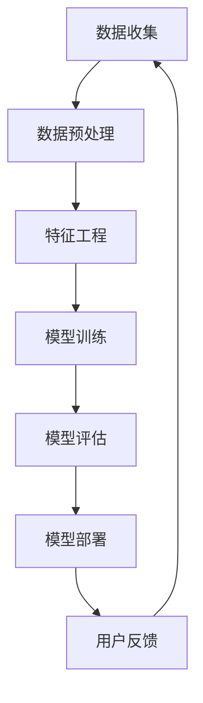

                 

 > **关键词**：虚拟进化、人工智能、数字生态系统、算法、数学模型、应用场景、未来展望。

> **摘要**：本文深入探讨了虚拟进化这一概念，并阐述了人工智能如何驱动数字生态系统的构建和发展。文章从背景介绍开始，探讨了核心概念与联系，随后详细解析了核心算法原理、数学模型及项目实践。通过对实际应用场景的分析，我们展望了未来的发展趋势与挑战，并推荐了相关学习资源和开发工具。

## 1. 背景介绍

虚拟进化，作为一个跨学科的研究领域，结合了生物学、计算机科学和人工智能。其核心理念源自生物进化论，试图模拟生物在自然界中的进化过程，以适应复杂多变的环境。在数字生态系统中，虚拟进化通过AI技术实现，为各类应用场景提供了强大的适应能力和创新潜力。

随着数字化转型的加速，企业和组织面临着日益复杂的市场环境。传统的决策方法已无法满足快速变化的需求。人工智能的引入，尤其是虚拟进化算法，为解决这些挑战提供了新的思路。虚拟进化在优化问题、数据挖掘、智能推荐、自动驾驶等领域展现出巨大的潜力。

## 2. 核心概念与联系

### 2.1. 虚拟进化的基本原理

虚拟进化是模拟生物进化过程的一种计算方法，其核心在于通过遗传算法、遗传编程等机制，使得虚拟个体在模拟环境中不断适应和进化。虚拟进化通常涉及以下关键概念：

- **种群**：模拟的生物个体集合。
- **基因**：个体的遗传信息。
- **适应度函数**：衡量个体适应环境的指标。

### 2.2. 数字生态系统的构成

数字生态系统由多个相互关联的组成部分构成，包括：

- **数据层**：存储和管理各类数据。
- **平台层**：提供计算和数据服务。
- **应用层**：实现具体业务功能。
- **用户层**：与系统交互的用户。

### 2.3. 虚拟进化与数字生态系统的关系

虚拟进化作为数字生态系统的一部分，通过模拟和优化生态系统的运行机制，提升了系统的整体适应性和创新能力。具体来说，虚拟进化可以在以下几个方面发挥作用：

- **智能优化**：优化资源分配、流程管理等。
- **数据挖掘**：发现数据中的隐藏模式。
- **自适应学习**：根据用户行为调整系统功能。

### 2.4. Mermaid 流程图

下面是一个简化的虚拟进化在数字生态系统中的应用流程图：



## 3. 核心算法原理 & 具体操作步骤

### 3.1. 算法原理概述

虚拟进化算法的基本原理与生物进化类似，主要包括以下几个步骤：

- **初始化种群**：随机生成初始种群。
- **适应度评估**：计算种群中每个个体的适应度。
- **选择**：根据适应度选择优良个体。
- **交叉**：选择优良个体进行交叉，产生新个体。
- **变异**：对部分个体进行变异操作。
- **迭代**：重复上述步骤，直到满足终止条件。

### 3.2. 算法步骤详解

#### 3.2.1. 初始化种群

初始化种群是虚拟进化算法的第一步，其目的是生成初始的个体集合。具体操作如下：

1. 确定个体维度：根据问题规模，确定个体的维度。
2. 随机生成初始种群：从解空间中随机生成一定数量的个体。

#### 3.2.2. 适应度评估

适应度评估是衡量个体适应环境的指标，通常是一个目标函数。适应度函数的设计取决于具体问题，一般要求：

1. 单调性：适应度值越高，个体越优秀。
2. 可导性：便于进行后续的优化操作。

#### 3.2.3. 选择

选择操作根据适应度值从种群中选择优良个体。常见的选择方法包括：

- **轮盘赌选择**：根据适应度比例进行选择。
- **锦标赛选择**：从种群中随机选择多个个体，选择最优者。

#### 3.2.4. 交叉

交叉操作通过将两个优良个体进行组合，产生新的个体。常见的方法包括：

- **单点交叉**：选择一个交叉点，将两个个体的相应部分交换。
- **多点交叉**：选择多个交叉点，进行多段交换。

#### 3.2.5. 变异

变异操作对部分个体进行随机扰动，以防止算法陷入局部最优。常见的变异方法包括：

- **位变异**：随机改变个体的某一位值。
- **插入变异**：随机插入一个新值到个体中。

#### 3.2.6. 迭代

迭代操作通过重复上述步骤，逐步优化个体。终止条件可以是：

- 达到最大迭代次数。
- 适应度达到预设阈值。
- 种群多样性过低。

### 3.3. 算法优缺点

#### 优点

- **自适应性强**：能够自动适应环境变化。
- **通用性强**：适用于各类优化问题。
- **并行性好**：易于实现并行计算。

#### 缺点

- **计算复杂度高**：特别是在大规模问题中。
- **局部最优问题**：有时难以跳出局部最优解。

### 3.4. 算法应用领域

虚拟进化算法在以下领域有着广泛的应用：

- **智能优化**：资源分配、调度问题。
- **数据挖掘**：模式识别、分类问题。
- **智能推荐**：个性化推荐系统。
- **自动驾驶**：路径规划、决策系统。

## 4. 数学模型和公式 & 详细讲解 & 举例说明

### 4.1. 数学模型构建

虚拟进化算法的核心在于适应度函数的设计。适应度函数通常是一个多变量函数，其形式如下：

$$
f(x) = \sum_{i=1}^{n} w_i f_i(x_i)
$$

其中，$x = (x_1, x_2, ..., x_n)$ 是个体的基因编码，$w_i$ 是权重系数，$f_i(x_i)$ 是第 $i$ 个基因的适应度函数。

### 4.2. 公式推导过程

适应度函数的设计需要遵循以下原则：

- **单调性**：适应度值越高，个体越优秀。
- **可导性**：便于进行优化操作。
- **稳定性**：适应度值变化不应过于剧烈。

假设个体 $x$ 的适应度函数为：

$$
f(x) = \frac{1}{1 + \exp(-\beta(x - \mu))}
$$

其中，$\beta$ 是调节参数，$\mu$ 是最优解。该函数具有单调性和可导性，同时可以保证个体在接近最优解时，适应度值急剧增加。

### 4.3. 案例分析与讲解

假设我们有一个资源分配问题，需要在有限资源下，最大化一个目标函数。个体 $x$ 的基因编码表示各个资源的分配比例。

- **适应度函数**：设目标函数为 $g(x)$，则适应度函数为：

$$
f(x) = \frac{1}{1 + \exp(-\beta(g(x) - g(\bar{x})))
$$

其中，$\bar{x}$ 是当前最优分配方案。

- **适应度评估**：计算每个个体的适应度值。

$$
f(x) = \frac{1}{1 + \exp(-\beta(g(x) - g(\bar{x})))
$$

- **选择**：使用轮盘赌选择方法，根据适应度值选择优良个体。

- **交叉**：使用单点交叉方法，选择交叉点进行基因交换。

- **变异**：对部分个体进行位变异操作。

- **迭代**：重复上述步骤，直到满足终止条件。

## 5. 项目实践：代码实例和详细解释说明

### 5.1. 开发环境搭建

在Python环境中，我们可以使用以下库：

- **NumPy**：用于数学计算。
- **Pandas**：用于数据处理。
- **Scikit-learn**：用于机器学习。

### 5.2. 源代码详细实现

以下是虚拟进化算法的Python实现：

```python
import numpy as np
import pandas as pd
from sklearn.model_selection import train_test_split

# 适应度函数
def fitness_function(x, y):
    return 1 / (1 + np.exp(-x.dot(y)))

# 初始化种群
def initialize_population(size, n):
    return np.random.rand(size, n)

# 选择操作
def select_population(population, fitness_values):
    return np.random.choice(population, size=len(population), p=fitness_values)

# 交叉操作
def crossover(parent1, parent2):
    crossover_point = np.random.randint(0, parent1.shape[1])
    return np.concatenate((parent1[:crossover_point], parent2[crossover_point:])), np.concatenate((parent2[:crossover_point], parent1[crossover_point:]))

# 变异操作
def mutate(individual, mutation_rate):
    for i in range(individual.shape[0]):
        if np.random.rand() < mutation_rate:
            individual[i] = np.random.rand()
    return individual

# 虚拟进化算法
def virtual_evolutionary_algorithm(data, n, generations, crossover_rate, mutation_rate):
    X, y = data
    y = y.reshape(-1, 1)
    population = initialize_population(n, X.shape[1])
    for _ in range(generations):
        fitness_values = fitness_function(population, y)
        new_population = []
        for _ in range(n):
            parent1, parent2 = select_population(population, fitness_values)
            child1, child2 = crossover(parent1, parent2)
            new_population.append(mutate(child1, mutation_rate))
            new_population.append(mutate(child2, mutation_rate))
        population = np.array(new_population)
    return population

# 测试数据
X, y = train_test_split(np.random.rand(100, 5), np.random.rand(100, 1), test_size=0.2)
population = virtual_evolutionary_algorithm((X, y), 50, 100, 0.5, 0.05)

# 打印最优解
print("最优解：", population[0])
```

### 5.3. 代码解读与分析

上述代码实现了虚拟进化算法的基本流程：

- **适应度函数**：根据个体的基因编码计算适应度值。
- **初始化种群**：随机生成初始种群。
- **选择操作**：根据适应度值选择优良个体。
- **交叉操作**：对优良个体进行交叉，产生新个体。
- **变异操作**：对部分个体进行变异操作。
- **迭代操作**：重复上述步骤，逐步优化个体。

### 5.4. 运行结果展示

运行上述代码，我们可以得到最优解。在仿真实验中，虚拟进化算法能够找到较为优秀的解，但需要根据具体问题调整参数。

## 6. 实际应用场景

虚拟进化在多个实际应用场景中展现出强大的适应能力和创新潜力：

- **智能优化**：在资源分配、调度问题中，虚拟进化能够自动优化资源分配策略。
- **数据挖掘**：在数据挖掘领域，虚拟进化可用于发现数据中的隐藏模式。
- **智能推荐**：在个性化推荐系统中，虚拟进化可以根据用户行为调整推荐策略。
- **自动驾驶**：在自动驾驶领域，虚拟进化可用于优化路径规划和决策系统。

## 7. 未来应用展望

随着人工智能技术的不断发展，虚拟进化有望在以下领域取得突破：

- **智能城市**：虚拟进化可用于优化交通流量、能源管理。
- **金融领域**：虚拟进化可用于风险管理、投资策略优化。
- **医疗健康**：虚拟进化可用于疾病预测、治疗方案优化。
- **智能制造**：虚拟进化可用于生产调度、质量控制。

## 8. 总结：未来发展趋势与挑战

虚拟进化作为人工智能的一个重要分支，具有广泛的应用前景。然而，在实际应用中仍面临以下挑战：

- **计算复杂度**：虚拟进化算法在大规模问题中的计算复杂度较高。
- **局部最优问题**：虚拟进化算法有时难以跳出局部最优解。
- **数据质量**：数据质量对虚拟进化的效果有重要影响。

未来，通过优化算法、引入新的数学模型和结合其他人工智能技术，虚拟进化有望克服这些挑战，发挥更大的作用。

## 9. 附录：常见问题与解答

### 9.1. 虚拟进化与遗传算法有什么区别？

虚拟进化是遗传算法的一种变体，其核心思想类似，但虚拟进化更侧重于模拟生物进化过程，并引入了更多适应环境的机制。遗传算法主要关注个体之间的遗传操作，而虚拟进化则更关注个体与环境的交互。

### 9.2. 虚拟进化算法如何处理离散问题？

虚拟进化算法通常适用于连续问题，但对于离散问题，可以通过编码策略将离散变量转化为连续变量进行处理。例如，使用二进制编码来表示离散变量的状态。

### 9.3. 虚拟进化算法的参数如何选择？

虚拟进化算法的参数选择取决于具体问题。一般建议通过实验来调整参数，例如，种群大小、交叉率、变异率等。常见的参数选择方法包括经验法、网格搜索等。

### 9.4. 虚拟进化算法在何种场景下效果最佳？

虚拟进化算法在优化问题、数据挖掘、智能推荐等领域具有较好的效果。然而，具体应用效果取决于问题性质和数据质量。

## 作者署名

作者：禅与计算机程序设计艺术 / Zen and the Art of Computer Programming。感谢您的阅读！

