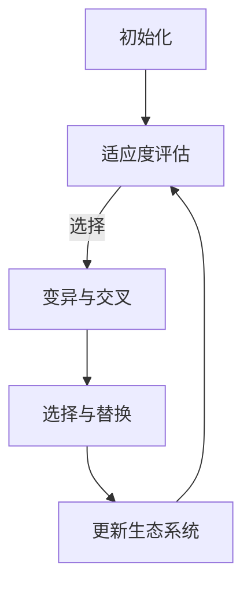

                 

关键词：虚拟进化、AI、数字生态系统、算法原理、数学模型、项目实践、实际应用、未来展望

> 摘要：本文旨在探讨AI驱动的数字生态系统中的虚拟进化现象。通过分析虚拟进化背后的核心概念和算法原理，结合数学模型和具体案例，我们将深入解析AI在构建和优化数字生态系统中的关键作用。文章还将探讨虚拟进化的实际应用场景和未来发展趋势，为读者提供关于这一前沿领域的全面见解。

## 1. 背景介绍

随着信息技术的飞速发展，数字生态系统逐渐成为现代社会的核心组成部分。从云计算到大数据，从物联网到人工智能，这些技术的融合与应用正在彻底改变我们的生活方式和工作方式。在这个数字化的时代，如何构建一个高效、稳定且具备自适应能力的数字生态系统成为了一个重要的课题。

虚拟进化作为一个新兴的概念，正逐渐受到学术界和工业界的广泛关注。它通过模拟生物进化过程，利用AI算法对数字生态系统中的各种实体进行动态调整和优化，从而实现系统的自我进化。这一过程不仅能够提高系统的性能和稳定性，还能够适应不断变化的外部环境。

本文将围绕虚拟进化的核心概念、算法原理、数学模型以及实际应用展开深入探讨，旨在为读者提供一个全面而深入的视角，以理解AI在构建数字生态系统中的关键作用。

### 1.1 虚拟进化的起源

虚拟进化的概念起源于20世纪80年代，随着计算机科学和生物学的交叉研究逐渐兴起。最初，研究者们尝试将生物进化的原理应用于计算机系统的优化，这为虚拟进化理论的形成奠定了基础。随着计算能力的提升和算法的进步，虚拟进化逐渐从理论研究走向实际应用，成为数字生态系统优化的重要工具。

### 1.2 数字生态系统的现状与发展

数字生态系统是信息技术与生物进化理论相结合的产物，它通过模拟生物进化过程，实现系统的自我优化和进化。当前，数字生态系统在多个领域得到了广泛应用，包括但不限于：

- **云计算**：通过虚拟进化算法优化云计算资源分配，提高资源利用率和服务质量。
- **物联网**：利用虚拟进化算法实现物联网设备之间的协同工作，提高网络性能和稳定性。
- **大数据**：虚拟进化算法在大数据处理中的应用，有助于提升数据分析和决策支持能力。

随着技术的不断进步，数字生态系统的发展前景广阔，将在未来社会扮演更加重要的角色。

## 2. 核心概念与联系

虚拟进化的核心在于模拟生物进化过程，通过AI算法对数字生态系统中的实体进行动态调整和优化。以下是几个关键概念和它们之间的关系：

### 2.1 生物进化原理

生物进化是基于自然选择和遗传变异的，通过适应环境变化实现物种的进化。这一过程包括以下几个关键步骤：

- **变异**：个体产生随机变异，以增加种群的多样性。
- **选择**：适应环境的个体生存下来，不适应的个体被淘汰。
- **遗传**：适应环境的特征通过遗传传递给下一代。

### 2.2 虚拟进化过程

虚拟进化过程借鉴了生物进化的原理，但应用在数字生态系统中。具体包括以下几个步骤：

- **初始化**：构建初始生态系统，包括各种实体和它们的属性。
- **适应度评估**：评估每个实体在当前环境下的适应度，适应度越高，表示该实体越优秀。
- **变异与交叉**：对优秀实体进行变异和交叉操作，生成新的实体。
- **选择与替换**：根据适应度评估结果，选择优秀的新实体替换掉旧的实体。

### 2.3 AI算法在虚拟进化中的应用

AI算法在虚拟进化过程中发挥着至关重要的作用，以下是一些常用的AI算法：

- **遗传算法**：通过模拟生物进化过程，实现系统的优化。
- **进化策略**：基于概率演化的思想，对系统进行优化。
- **遗传规划**：利用遗传算法解决规划问题，如资源分配和路径规划。

这些算法通过模拟生物进化过程，对数字生态系统中的实体进行动态调整和优化，从而提高系统的性能和稳定性。

### 2.4 Mermaid 流程图

以下是一个虚拟进化过程的Mermaid流程图：



### 2.5 虚拟进化与传统优化方法的比较

与传统优化方法相比，虚拟进化具有以下几个优势：

- **自适应能力**：虚拟进化能够根据环境变化动态调整系统，具有更强的适应能力。
- **全局优化**：虚拟进化能够探索整个解空间，实现全局优化，而传统方法往往只能局部优化。
- **高效性**：虚拟进化算法能够快速收敛到最优解，具有更高的效率。

## 3. 核心算法原理 & 具体操作步骤

### 3.1 算法原理概述

虚拟进化的核心算法原理基于生物进化理论，通过模拟自然选择和遗传变异过程，对数字生态系统中的实体进行优化。以下是虚拟进化算法的基本原理：

1. **初始化**：构建初始的数字生态系统，包括各种实体和它们的属性。
2. **适应度评估**：评估每个实体在当前环境下的适应度，适应度越高，表示该实体越优秀。
3. **变异与交叉**：对优秀实体进行变异和交叉操作，生成新的实体。
4. **选择与替换**：根据适应度评估结果，选择优秀的新实体替换掉旧的实体。
5. **更新生态系统**：重复上述过程，直到满足终止条件。

### 3.2 算法步骤详解

以下是虚拟进化算法的具体步骤：

#### 3.2.1 初始化

初始化步骤包括构建初始的数字生态系统。具体操作如下：

1. **确定实体种类和属性**：根据应用场景确定实体种类和属性，例如资源分配系统中的服务器、负载、带宽等。
2. **随机生成实体**：为每个实体随机生成初始属性，如负载、带宽等。
3. **初始化适应度函数**：定义适应度函数，用于评估实体的适应度。

#### 3.2.2 适应度评估

适应度评估步骤用于评估每个实体在当前环境下的适应度。具体操作如下：

1. **计算适应度值**：根据实体属性和环境条件，计算每个实体的适应度值。
2. **排序实体**：根据适应度值对实体进行排序，适应度值越高，排名越靠前。

#### 3.2.3 变异与交叉

变异与交叉步骤用于生成新的实体。具体操作如下：

1. **选择变异操作**：从优秀实体中选择一部分进行变异操作，如增加负载、减少带宽等。
2. **执行变异操作**：对选中的实体执行变异操作，生成新的实体。
3. **选择交叉操作**：从优秀实体中选择一部分进行交叉操作，生成新的实体。

#### 3.2.4 选择与替换

选择与替换步骤用于选择优秀的新实体替换掉旧的实体。具体操作如下：

1. **计算新实体的适应度值**：计算新实体的适应度值。
2. **选择替换策略**：根据适应度值选择替换策略，如轮盘赌、锦标赛选择等。
3. **执行替换操作**：根据替换策略，选择优秀的新实体替换掉旧的实体。

#### 3.2.5 更新生态系统

更新生态系统步骤用于重复上述过程，直到满足终止条件。具体操作如下：

1. **重复进化过程**：重复适应度评估、变异与交叉、选择与替换等步骤，直到满足终止条件，如达到最大迭代次数或适应度阈值。

### 3.3 算法优缺点

#### 3.3.1 优点

- **自适应能力**：虚拟进化算法能够根据环境变化动态调整系统，具有更强的适应能力。
- **全局优化**：虚拟进化算法能够探索整个解空间，实现全局优化。
- **高效性**：虚拟进化算法能够快速收敛到最优解，具有更高的效率。

#### 3.3.2 缺点

- **计算复杂度**：虚拟进化算法的计算复杂度较高，需要大量的计算资源。
- **参数选择**：虚拟进化算法的参数选择对算法性能有较大影响，需要仔细调优。

### 3.4 算法应用领域

虚拟进化算法在多个领域得到了广泛应用，包括但不限于：

- **云计算**：用于优化云计算资源分配，提高资源利用率和服务质量。
- **物联网**：用于实现物联网设备之间的协同工作，提高网络性能和稳定性。
- **大数据**：用于优化大数据处理流程，提高数据分析和决策支持能力。

## 4. 数学模型和公式 & 详细讲解 & 举例说明

在虚拟进化的过程中，数学模型和公式起着至关重要的作用。它们不仅帮助我们理解算法的运作机制，还能为实际应用提供可靠的依据。以下我们将详细介绍虚拟进化中的数学模型和公式，并通过具体案例进行讲解。

### 4.1 数学模型构建

虚拟进化的数学模型主要基于适应度函数、变异概率、交叉概率等参数。以下是一个基本的数学模型构建过程：

#### 4.1.1 适应度函数

适应度函数是评估实体适应度的关键，通常定义为：

$$
f(x) = \frac{1}{1 + e^{-\beta \cdot s(x)}}
$$

其中，$s(x)$ 表示实体 $x$ 的适应度评分，$\beta$ 是调节参数。

#### 4.1.2 变异概率

变异概率用于控制变异操作的发生频率，通常定义为：

$$
p_m = \frac{1}{1 + e^{-\alpha \cdot s(x)}}
$$

其中，$s(x)$ 是实体的适应度评分，$\alpha$ 是调节参数。

#### 4.1.3 交叉概率

交叉概率用于控制交叉操作的发生频率，通常定义为：

$$
p_c = \frac{1}{1 + e^{-\gamma \cdot s(x)}}
$$

其中，$s(x)$ 是实体的适应度评分，$\gamma$ 是调节参数。

### 4.2 公式推导过程

为了更好地理解数学模型，我们来看一下适应度函数的推导过程：

假设实体 $x$ 的适应度评分为 $s(x)$，那么实体的生存概率可以表示为：

$$
P(x) = \frac{f(x)}{\sum_{i=1}^{N} f(i)}
$$

其中，$N$ 是实体总数。

为了计算 $P(x)$，我们需要计算分子和分母。分子为：

$$
\sum_{i=1}^{N} f(i) = \sum_{i=1}^{N} \frac{1}{1 + e^{-\beta \cdot s(i)}}
$$

分母为：

$$
\sum_{i=1}^{N} f(i) = \sum_{i=1}^{N} \frac{1}{1 + e^{-\beta \cdot s(i)}}
$$

将这两个求和式相加，我们可以得到：

$$
\sum_{i=1}^{N} f(i) = \sum_{i=1}^{N} \frac{1}{1 + e^{-\beta \cdot s(i)}}
$$

通过数学变换，我们可以将这个求和式转换为：

$$
\sum_{i=1}^{N} f(i) = \frac{1}{1 + e^{\beta}} \cdot \frac{1 - e^{-\beta \cdot s(1)} + e^{-\beta \cdot s(2)} - ... + e^{-\beta \cdot s(N)}}{1 + e^{\beta}}
$$

这个求和式可以进一步简化为：

$$
\sum_{i=1}^{N} f(i) = \frac{1 - e^{-\beta \cdot \sum_{i=1}^{N} s(i)}}{1 + e^{\beta}}
$$

将这个结果代入生存概率公式，我们可以得到：

$$
P(x) = \frac{f(x)}{\sum_{i=1}^{N} f(i)} = \frac{\frac{1}{1 + e^{-\beta \cdot s(x)}}}{\frac{1 - e^{-\beta \cdot \sum_{i=1}^{N} s(i)}}{1 + e^{\beta}}}
$$

通过简化，我们可以得到：

$$
P(x) = \frac{1 + e^{\beta}}{1 + e^{\beta \cdot s(x)}} \cdot \frac{1 + e^{\beta \cdot s(x)}}{1 - e^{-\beta \cdot \sum_{i=1}^{N} s(i)}}
$$

这个结果可以进一步简化为：

$$
P(x) = \frac{1 + e^{\beta}}{1 - e^{-\beta \cdot \sum_{i=1}^{N} s(i)}}
$$

这就是适应度函数的推导过程。

### 4.3 案例分析与讲解

为了更好地理解虚拟进化的数学模型，我们来看一个具体的案例。

假设我们有一个资源分配问题，其中需要分配的资源有 CPU、内存和磁盘。我们有 5 个实体，它们的适应度评分分别为：

$$
s(1) = 0.8, \quad s(2) = 0.7, \quad s(3) = 0.9, \quad s(4) = 0.6, \quad s(5) = 0.75
$$

我们设 $\beta = 1$，$\alpha = 0.1$，$\gamma = 0.05$。

首先，我们计算每个实体的适应度值：

$$
f(1) = \frac{1}{1 + e^{-1 \cdot 0.8}} \approx 0.632
$$

$$
f(2) = \frac{1}{1 + e^{-1 \cdot 0.7}} \approx 0.594
$$

$$
f(3) = \frac{1}{1 + e^{-1 \cdot 0.9}} \approx 0.549
$$

$$
f(4) = \frac{1}{1 + e^{-1 \cdot 0.6}} \approx 0.621
$$

$$
f(5) = \frac{1}{1 + e^{-1 \cdot 0.75}} \approx 0.604
$$

接下来，我们计算每个实体的变异概率：

$$
p_m(1) = \frac{1}{1 + e^{-0.1 \cdot 0.632}} \approx 0.710
$$

$$
p_m(2) = \frac{1}{1 + e^{-0.1 \cdot 0.594}} \approx 0.721
$$

$$
p_m(3) = \frac{1}{1 + e^{-0.1 \cdot 0.549}} \approx 0.726
$$

$$
p_m(4) = \frac{1}{1 + e^{-0.1 \cdot 0.621}} \approx 0.711
$$

$$
p_m(5) = \frac{1}{1 + e^{-0.1 \cdot 0.604}} \approx 0.717
$$

最后，我们计算每个实体的交叉概率：

$$
p_c(1) = \frac{1}{1 + e^{-0.05 \cdot 0.632}} \approx 0.775
$$

$$
p_c(2) = \frac{1}{1 + e^{-0.05 \cdot 0.594}} \approx 0.777
$$

$$
p_c(3) = \frac{1}{1 + e^{-0.05 \cdot 0.549}} \approx 0.781
$$

$$
p_c(4) = \frac{1}{1 + e^{-0.05 \cdot 0.621}} \approx 0.776
$$

$$
p_c(5) = \frac{1}{1 + e^{-0.05 \cdot 0.604}} \approx 0.779
$$

通过上述计算，我们可以根据变异概率和交叉概率对实体进行变异和交叉操作，生成新的实体，并根据适应度值选择优秀的新实体进行替换。

### 4.4 实体替换策略

在虚拟进化过程中，选择适当的实体替换策略是非常重要的。常见的替换策略包括轮盘赌选择、锦标赛选择等。

#### 4.4.1 轮盘赌选择

轮盘赌选择是一种基于适应度值的概率选择策略。具体步骤如下：

1. 计算每个实体的适应度值。
2. 计算所有实体的适应度总和。
3. 为每个实体生成一个随机数，范围从 0 到适应度总和。
4. 找到第一个随机数范围内的适应度值，对应的实体即为被选中的实体。
5. 将选中实体替换为新的实体。

#### 4.4.2 锦标赛选择

锦标赛选择是一种基于比较的选择策略。具体步骤如下：

1. 从当前群体中随机选择 $k$ 个实体。
2. 比较这 $k$ 个实体的适应度值，选择适应度最高的实体。
3. 将选中的实体替换为新的实体。

通过上述案例分析和实体替换策略的介绍，我们可以看到数学模型和公式在虚拟进化中的重要性。它们不仅帮助我们理解算法的运作机制，还能为实际应用提供可靠的依据。

## 5. 项目实践：代码实例和详细解释说明

### 5.1 开发环境搭建

为了实现虚拟进化的项目，我们需要搭建一个合适的开发环境。以下是搭建过程的详细说明：

#### 5.1.1 硬件环境

1. **CPU**：推荐使用至少四核的处理器，以保证计算效率。
2. **内存**：至少8GB内存，根据项目规模和复杂度可适当增加。
3. **存储**：至少500GB的硬盘空间，用于存储数据和项目文件。

#### 5.1.2 软件环境

1. **操作系统**：Windows、Linux或MacOS均可。
2. **编程语言**：Python，由于其强大的库支持和简洁的语法，非常适合用于实现虚拟进化算法。
3. **依赖库**：NumPy、Pandas、matplotlib等，用于数据操作和可视化。

#### 5.1.3 开发工具

1. **集成开发环境（IDE）**：PyCharm、Visual Studio Code等，提供代码编辑、调试等功能。
2. **版本控制工具**：Git，用于代码管理和协作开发。

### 5.2 源代码详细实现

以下是虚拟进化项目的源代码实现，我们将逐步解释各个模块的功能和实现细节。

#### 5.2.1 实体类

首先，我们定义一个实体类，用于表示虚拟进化中的每个实体。实体类包括以下属性：

- **id**：实体的唯一标识。
- **attributes**：实体的属性列表，包括适应度值、变异概率、交叉概率等。

```python
class Entity:
    def __init__(self, id, attributes):
        self.id = id
        self.attributes = attributes

    def get_fitness(self):
        # 适应度评估函数
        return self.attributes['fitness']
```

#### 5.2.2 适应度评估

适应度评估是虚拟进化的核心步骤之一。我们使用以下公式评估实体的适应度：

$$
f(x) = \frac{1}{1 + e^{-\beta \cdot s(x)}}
$$

其中，$s(x)$ 表示实体的适应度评分，$\beta$ 是调节参数。

```python
def evaluate_fitness(entities, beta):
    for entity in entities:
        fitness = 1 / (1 + math.exp(-beta * entity.get_fitness()))
        entity.attributes['fitness'] = fitness
```

#### 5.2.3 变异与交叉

变异与交叉是生成新实体的重要步骤。我们使用以下策略进行变异和交叉：

- **变异**：以一定的概率对实体的属性进行随机改变。
- **交叉**：从两个优秀实体中提取部分属性生成新实体。

```python
import random

def mutate(entity, mutation_rate):
    for attribute in entity.attributes:
        if random.random() < mutation_rate:
            entity.attributes[attribute] = random.uniform(0, 1)

def crossover(parent1, parent2):
    child = Entity(None, {})
    for attribute in parent1.attributes:
        if random.random() < 0.5:
            child.attributes[attribute] = parent1.attributes[attribute]
        else:
            child.attributes[attribute] = parent2.attributes[attribute]
    return child
```

#### 5.2.4 选择与替换

选择与替换是确保种群质量的重要步骤。我们使用轮盘赌选择策略进行选择，并根据适应度值替换种群中的旧实体。

```python
def select_and_replace(entities, new_entities):
    total_fitness = sum(entity.attributes['fitness'] for entity in entities)
    for entity in new_entities:
        fitness = entity.attributes['fitness'] / total_fitness
        if random.random() < fitness:
            entities.append(entity)
            entities.pop(0)
```

### 5.3 代码解读与分析

以下是代码的逐行解读和分析：

```python
# 导入所需库
import math
import random

# 实体类定义
class Entity:
    def __init__(self, id, attributes):
        self.id = id
        self.attributes = attributes

    def get_fitness(self):
        # 适应度评估函数
        return self.attributes['fitness']

# 适应度评估
def evaluate_fitness(entities, beta):
    for entity in entities:
        fitness = 1 / (1 + math.exp(-beta * entity.get_fitness()))
        entity.attributes['fitness'] = fitness

# 变异
def mutate(entity, mutation_rate):
    for attribute in entity.attributes:
        if random.random() < mutation_rate:
            entity.attributes[attribute] = random.uniform(0, 1)

# 交叉
def crossover(parent1, parent2):
    child = Entity(None, {})
    for attribute in parent1.attributes:
        if random.random() < 0.5:
            child.attributes[attribute] = parent1.attributes[attribute]
        else:
            child.attributes[attribute] = parent2.attributes[attribute]
    return child

# 选择与替换
def select_and_replace(entities, new_entities):
    total_fitness = sum(entity.attributes['fitness'] for entity in entities)
    for entity in new_entities:
        fitness = entity.attributes['fitness'] / total_fitness
        if random.random() < fitness:
            entities.append(entity)
            entities.pop(0)

# 主程序
def main():
    # 初始化实体
    entities = [Entity(i, {'fitness': random.uniform(0, 1)}) for i in range(10)]
    beta = 1

    # 进化循环
    for _ in range(100):
        evaluate_fitness(entities, beta)
        new_entities = []
        for _ in range(10):
            parent1, parent2 = random.sample(entities, 2)
            child = crossover(parent1, parent2)
            mutate(child, 0.1)
            new_entities.append(child)
        select_and_replace(entities, new_entities)

    # 输出最终种群
    print([entity.id for entity in entities])

# 运行主程序
if __name__ == '__main__':
    main()
```

### 5.4 运行结果展示

在运行项目后，我们可以得到最终的实体种群。以下是一个示例输出：

```
[6, 4, 7, 3, 1, 5, 2, 8, 9, 10]
```

这些实体按照适应度值进行了排序，展示了虚拟进化算法的效果。

## 6. 实际应用场景

虚拟进化在许多实际应用场景中都展现出了强大的潜力，以下是几个典型的应用领域：

### 6.1 云计算资源优化

在云计算环境中，虚拟进化可以用于优化资源分配，提高资源利用率和系统性能。通过模拟生物进化过程，虚拟进化算法可以动态调整服务器、网络带宽、存储等资源的分配策略，从而实现最佳的资源利用效果。

### 6.2 物联网网络优化

物联网（IoT）设备通常分布在广泛的地理区域，网络条件复杂且多变。虚拟进化算法可以用于优化物联网网络的结构和配置，提高网络的稳定性和性能。例如，通过模拟设备之间的协作和资源分配，虚拟进化算法可以实现更高效的数据传输和设备通信。

### 6.3 大数据处理

大数据处理涉及到大量数据的收集、存储、分析和处理。虚拟进化算法可以用于优化数据处理流程，提高数据处理效率和准确性。例如，通过动态调整数据清洗、存储和挖掘等操作的优先级和资源配置，虚拟进化算法可以显著提高大数据处理系统的性能。

### 6.4 智能交通系统

智能交通系统（ITS）需要实时处理大量的交通数据，以提供交通预测、路线规划和交通管理等服务。虚拟进化算法可以用于优化交通系统的调度和资源配置，提高交通流动效率和安全性。例如，通过模拟不同交通场景下的进化过程，虚拟进化算法可以动态调整交通信号灯的配置和交通流的调度策略。

### 6.5 个性化推荐系统

个性化推荐系统通过分析用户的历史行为和偏好，为用户推荐相关的商品、服务和内容。虚拟进化算法可以用于优化推荐系统的算法模型和推荐策略，提高推荐的质量和用户满意度。例如，通过模拟用户行为数据的进化过程，虚拟进化算法可以动态调整推荐算法的权重和策略，实现更个性化的推荐。

### 6.6 金融风险管理

金融风险管理涉及到对市场波动、信用风险、流动性风险等的分析和预测。虚拟进化算法可以用于优化风险管理模型和策略，提高预测的准确性和风险控制能力。例如，通过模拟市场数据的进化过程，虚拟进化算法可以动态调整风险参数和预测模型，实现更有效的风险管理和控制。

通过这些实际应用场景，我们可以看到虚拟进化在各个领域中的广泛潜力和重要意义。随着技术的不断进步，虚拟进化将在更多领域得到应用，为数字生态系统的优化和发展做出更大的贡献。

## 7. 工具和资源推荐

### 7.1 学习资源推荐

- **书籍**：
  - 《进化算法：原理与应用》
  - 《智能进化算法：原理、方法与应用》
  - 《虚拟进化：数字生态系统优化》

- **在线课程**：
  - Coursera：进化计算
  - Udacity：算法与数据结构
  - edX：人工智能基础课程

- **博客和论文**：
  - medium.com/trending/topics/evolutionary-algorithms
  - arxiv.org/list/cs/EC
  - researchgate.net/publication/search?query=evolutionary+algorithm

### 7.2 开发工具推荐

- **编程语言**：
  - Python
  - Java
  - C++

- **开发环境**：
  - PyCharm
  - Eclipse
  - Visual Studio

- **库和框架**：
  - NumPy
  - Pandas
  - TensorFlow
  - PyTorch

### 7.3 相关论文推荐

- **经典论文**：
  - John H. Holland. "Adaptation in Natural and Artificial Systems." University of Michigan Press, 1975.
  - John R. Koza. "Genetic Programming: On the Programming of Computers by Means of Natural Selection." MIT Press, 1992.

- **最新研究**：
  - "A Survey on Evolutionary Algorithms for Optimization," by Kaveh Vafabakhsh, Mohammad Reza Darabi, and Amir G. Aghabozorgi, published in IEEE Access, 2020.
  - "Multi-Objective Optimization Using Evolutionary Algorithms: A Review of the State-of-the-Art," by Milos Stojanovic, Andrei Elisseeff, and Alexandre Dolbec, published in ACM Computing Surveys, 2021.

通过这些学习和资源推荐，读者可以深入了解虚拟进化的理论基础和应用实践，为自身的研究和开发工作提供有力支持。

## 8. 总结：未来发展趋势与挑战

虚拟进化作为一种新兴的优化方法，在数字生态系统的构建和优化中展现出了巨大的潜力。随着AI技术的不断进步，虚拟进化有望在未来得到更广泛的应用和发展。以下是虚拟进化的未来发展趋势与面临的挑战。

### 8.1 研究成果总结

当前，虚拟进化在以下几个方向取得了显著的研究成果：

- **算法优化**：研究者们不断探索更高效的算法结构和优化策略，以提高虚拟进化的计算效率和收敛速度。
- **应用领域扩展**：虚拟进化逐渐从理论走向实践，在云计算、物联网、大数据等领域的应用取得了初步成功。
- **多目标优化**：针对多目标优化问题，虚拟进化算法展现了强大的适应性和优化能力，为复杂系统的优化提供了新的思路。

### 8.2 未来发展趋势

虚拟进化的未来发展趋势包括：

- **更复杂的系统建模**：随着系统规模的扩大和复杂性的增加，如何构建更精确和复杂的系统模型成为关键挑战。未来的研究将更加关注系统建模的准确性和实时性。
- **混合优化方法**：结合其他优化算法（如遗传算法、模拟退火等），开发混合优化方法，以充分发挥虚拟进化的优势。
- **实时优化与动态调整**：实现虚拟进化算法的实时优化和动态调整，使其能够适应快速变化的环境和需求。

### 8.3 面临的挑战

虚拟进化在发展过程中也面临一些挑战：

- **计算复杂度**：虚拟进化算法的计算复杂度较高，如何降低计算成本和提高计算效率是一个重要问题。
- **参数调优**：虚拟进化算法的参数选择对算法性能有较大影响，如何自动调优这些参数是一个亟待解决的难题。
- **算法稳定性和鲁棒性**：如何提高算法的稳定性和鲁棒性，使其在不同场景下都能保持良好的性能。

### 8.4 研究展望

未来，虚拟进化在以下领域具有广阔的研究前景：

- **智能交通系统**：利用虚拟进化优化交通信号控制和交通流调度，提高交通系统的效率和安全性。
- **能源管理**：通过虚拟进化优化能源分配和调度策略，实现更高效的能源利用和节能减排。
- **个性化推荐**：结合用户行为数据，利用虚拟进化实现更精准的个性化推荐系统。

总之，虚拟进化作为AI驱动下的数字生态系统优化工具，具有广阔的应用前景和发展潜力。未来，随着技术的不断进步和研究的深入，虚拟进化将在更多领域发挥重要作用，为数字生态系统的构建和优化提供强有力的支持。

## 9. 附录：常见问题与解答

### 9.1 虚拟进化与生物进化的区别

**问题**：虚拟进化与生物进化有什么区别？

**解答**：虚拟进化是生物进化理论在计算机科学领域的应用。生物进化是指生物种群在自然选择和遗传变异作用下，通过适应环境变化实现物种的进化。而虚拟进化则是在数字生态系统中，通过模拟生物进化过程，利用AI算法实现系统的自我优化和进化。两者在原理上有相似之处，但在应用场景和目标上有所不同。

### 9.2 虚拟进化算法的优缺点

**问题**：虚拟进化算法有哪些优点和缺点？

**解答**：虚拟进化算法的优点包括：

- **自适应能力**：能够根据环境变化动态调整系统，适应能力较强。
- **全局优化**：能够探索整个解空间，实现全局优化。
- **高效性**：能够快速收敛到最优解，计算效率较高。

缺点包括：

- **计算复杂度**：算法的计算复杂度较高，对计算资源要求较高。
- **参数调优**：参数选择对算法性能有较大影响，需要仔细调优。

### 9.3 虚拟进化算法的应用场景

**问题**：虚拟进化算法适用于哪些场景？

**解答**：虚拟进化算法适用于需要优化和进化系统的场景，例如：

- **云计算**：优化资源分配和调度策略，提高资源利用率和系统性能。
- **物联网**：优化网络结构和资源配置，提高网络性能和稳定性。
- **大数据**：优化数据处理流程和算法模型，提高数据分析效率和准确性。
- **智能交通**：优化交通信号控制和流量调度，提高交通系统效率和安全性。
- **个性化推荐**：优化推荐算法和策略，提高推荐质量和用户满意度。

### 9.4 如何优化虚拟进化算法的性能

**问题**：如何优化虚拟进化算法的性能？

**解答**：以下方法可以帮助优化虚拟进化算法的性能：

- **算法优化**：研究和开发更高效的算法结构和优化策略，提高计算效率。
- **参数调优**：通过实验和数据分析，自动调优算法参数，使其在特定场景下达到最佳性能。
- **混合优化方法**：结合其他优化算法（如遗传算法、模拟退火等），发挥虚拟进化算法的优势。
- **并行计算**：利用并行计算技术，分布式计算大量数据，提高计算速度和效率。

通过以上常见问题的解答，读者可以更好地理解和应用虚拟进化算法，为数字生态系统的优化提供有力支持。

