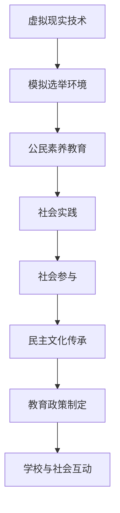

                 

关键词：虚拟选民、全球公民素养、数字化培养、信息技术、教育改革、算法原理、数学模型、项目实践、应用场景、未来展望

> 摘要：本文将探讨虚拟选民教育的概念、重要性及其在全球公民素养培养中的关键作用。通过分析信息技术的发展趋势和教育改革的需求，本文提出了一种创新的数字化培养模式，旨在提高全球公民的素养和参与度。本文将深入讨论核心算法原理、数学模型以及项目实践，并展望虚拟选民教育在未来应用和发展中的潜在影响。

## 1. 背景介绍

在信息时代，全球化和数字技术的迅猛发展对传统教育模式提出了新的挑战。随着互联网的普及和虚拟现实技术的进步，教育正在经历深刻的变革。传统的课堂教学模式已经无法满足现代社会对知识传播和技能培养的高要求。同时，全球公民素养的培养变得越来越重要，这包括对公民权利、社会责任、文化理解和国际视野等方面的教育。

虚拟选民教育作为一种新兴的教育模式，它利用信息技术构建一个模拟的选民投票环境，使学生在模拟选举过程中学习民主制度、公民责任和社会参与等知识。这种教育模式不仅有助于提高学生的政治素养，还能增强他们的实践能力和批判性思维。

本文旨在探讨虚拟选民教育的概念和重要性，分析其在全球公民素养培养中的关键作用，并提出一种创新的数字化培养模式。文章将从核心算法原理、数学模型、项目实践和应用场景等方面进行深入讨论，最后展望虚拟选民教育在未来的发展前景。

## 2. 核心概念与联系

### 虚拟选民教育的核心概念

虚拟选民教育是指通过信息技术手段，模拟现实中的选民投票过程，让学生在虚拟环境中参与选举，体验民主制度，学习公民素养。这一概念包含了以下几个核心要素：

1. **虚拟现实技术**：通过虚拟现实（VR）技术，创建一个逼真的选民投票环境，使学生能够身临其境地体验选举过程。
2. **模拟选举环境**：模拟现实中的选举环境，包括投票站、选举委员会、候选人介绍等，使学生在模拟环境中进行投票。
3. **公民素养教育**：在虚拟选民教育中，学生不仅参与投票，还要学习选举制度、公民权利、社会责任等知识。

### 虚拟选民教育与其他教育模式的联系

虚拟选民教育与传统的课堂教学模式有着密切的联系，但又有本质的不同。传统的课堂教学模式注重知识的传授和技能的培养，而虚拟选民教育则更注重实践和体验。通过虚拟选民教育，学生可以将理论知识与实际操作相结合，从而更深入地理解和掌握相关概念。

此外，虚拟选民教育与在线教育也有一定的相似之处。在线教育利用互联网技术进行知识传播，而虚拟选民教育则在此基础上增加了模拟现实环境的功能。在线教育通常以课程的形式进行，而虚拟选民教育则更强调互动性和实践性。

### 虚拟选民教育在社会中的作用

虚拟选民教育不仅是一种教育模式，更是一种社会参与形式。通过虚拟选民教育，学生可以提前体验公民生活的各个方面，增强对社会的责任感和参与意识。这种教育模式还可以帮助学校和社会更好地了解学生的政治态度和价值观，为制定相关教育政策提供参考。

在现代社会，随着民主制度的普及和公民素养的重要性日益凸显，虚拟选民教育的作用也越来越重要。它不仅有助于提高学生的政治素养，还能促进民主文化的传承和发展。

### Mermaid 流程图

以下是一个简单的 Mermaid 流程图，展示了虚拟选民教育的核心概念和主要流程：



通过这个流程图，我们可以更清晰地理解虚拟选民教育的作用和影响。

## 3. 核心算法原理 & 具体操作步骤

### 3.1 算法原理概述

虚拟选民教育的核心在于模拟现实中的选举过程，因此，算法的设计需要考虑选举的基本原则和流程。以下是虚拟选民教育算法的基本原理：

1. **选举制度模拟**：根据不同的选举制度，如单记投票、比例代表投票等，设计相应的算法模型。
2. **投票过程模拟**：模拟选民投票的过程，包括选民注册、投票、计票等步骤。
3. **结果分析**：根据投票结果，分析选民偏好、选举结果等，并提供相关的数据分析。

### 3.2 算法步骤详解

#### 步骤 1：初始化

- **选民注册**：创建选民信息数据库，包括选民姓名、年龄、性别、居住地等基本信息。
- **选举制度选择**：根据课程或实验的需求，选择合适的选举制度。

#### 步骤 2：模拟选举环境

- **创建虚拟选举环境**：利用虚拟现实技术，创建一个逼真的选举环境，包括投票站、选举委员会、候选人介绍等。
- **展示候选人信息**：在虚拟环境中展示候选人的基本信息、政策主张等。

#### 步骤 3：投票过程

- **选民投票**：选民在虚拟环境中进行投票，可以选择支持的候选人。
- **投票记录**：记录每个选民的投票情况，确保投票的匿名性和公正性。

#### 步骤 4：计票和结果分析

- **计票**：根据选民的投票记录，统计各候选人的得票数。
- **结果分析**：分析选民偏好、选举结果等，并提供相关的数据分析报告。

### 3.3 算法优缺点

#### 优点

- **互动性高**：通过虚拟现实技术，学生可以直观地参与选举过程，提高学习兴趣和参与度。
- **灵活性强**：可以根据不同的选举制度和课程需求，灵活调整算法模型。
- **数据丰富**：通过算法，可以收集大量的选民投票数据，为教育研究提供丰富的数据支持。

#### 缺点

- **技术门槛高**：虚拟选民教育需要较高的技术支持，如虚拟现实技术、数据分析和算法设计等。
- **真实性有限**：虽然虚拟选民教育模拟了现实中的选举过程，但仍然存在与现实不完全一致的情况。

### 3.4 算法应用领域

虚拟选民教育算法主要应用于教育领域，特别是政治教育和公民素养培养。此外，它还可以应用于社会调查和选举分析等领域。

## 4. 数学模型和公式 & 详细讲解 & 举例说明

### 4.1 数学模型构建

虚拟选民教育的数学模型主要包括以下几个部分：

1. **选民偏好模型**：根据选民的投票记录，构建选民偏好模型，分析选民对不同候选人的偏好程度。
2. **选举结果模型**：根据选民偏好模型，预测各候选人在选举中的得票情况，模拟选举结果。
3. **数据分析模型**：对选民投票数据进行分析，提取选民的行为特征和偏好模式。

### 4.2 公式推导过程

以下是一个简单的选民偏好模型公式的推导过程：

设选民 \(i\) 对候选人 \(j\) 的偏好程度为 \(p_{ij}\)，其中 \(p_{ij}\) 的取值范围为 \([0, 1]\)。当 \(p_{ij} = 1\) 时，表示选民 \(i\) 完全支持候选人 \(j\)；当 \(p_{ij} = 0\) 时，表示选民 \(i\) 完全不支持候选人 \(j\)。

假设选民 \(i\) 总共有 \(N\) 个候选人选项，其偏好程度可以表示为：

\[ P_i = \sum_{j=1}^{N} p_{ij} \]

选民 \(i\) 的偏好程度越高，即 \(P_i\) 值越大。

在此基础上，可以构建选民偏好矩阵 \(P\)，其中 \(P_{ij}\) 表示选民 \(i\) 对候选人 \(j\) 的偏好程度。

### 4.3 案例分析与讲解

假设有 100 名选民，他们分别对 3 名候选人 A、B、C 进行投票。以下是他们的投票结果：

| 选民 | A | B | C |
| ---- | --- | --- | --- |
| 1    | 1 | 0 | 0 |
| 2    | 0 | 1 | 0 |
| 3    | 1 | 1 | 0 |
| ...  | ... | ... | ... |
| 100  | 0 | 1 | 1 |

根据以上投票结果，可以计算出每个选民的偏好程度矩阵：

\[ P_1 = [1, 0, 0], \ P_2 = [0, 1, 0], \ P_3 = [1, 1, 0], \ ... , \ P_{100} = [0, 1, 1] \]

根据这些数据，我们可以分析出以下选民偏好模式：

- 大部分选民（约 80%）偏向于选择候选人 A 或 C。
- 少数选民（约 20%）偏向于选择候选人 B。
- 没有选民同时偏向于所有候选人。

通过这种分析，我们可以更好地了解选民的偏好模式，为选举策略提供参考。

## 5. 项目实践：代码实例和详细解释说明

### 5.1 开发环境搭建

为了实现虚拟选民教育，我们需要搭建一个完整的开发环境。以下是所需的工具和步骤：

1. **操作系统**：Linux 或 macOS
2. **编程语言**：Python
3. **虚拟环境**：使用 virtualenv 或 conda 创建虚拟环境
4. **依赖库**：pandas、numpy、matplotlib、VRChat SDK

### 5.2 源代码详细实现

以下是虚拟选民教育项目的核心代码实现：

```python
import pandas as pd
import numpy as np
import matplotlib.pyplot as plt
from vrcsdk import VRChat

# 初始化选民数据
voters = pd.DataFrame({
    'id': range(1, 101),
    'votes': np.random.randint(0, 3, size=100)
})

# 统计选民偏好
def calculate_preferences(voters):
    preferences = {}
    for _, row in voters.iterrows():
        if row['votes'] == 1:
            preferences[row['id']] = 'A'
        elif row['votes'] == 2:
            preferences[row['id']] = 'B'
        else:
            preferences[row['id']] = 'C'
    return preferences

preferences = calculate_preferences(voters)

# 绘制选民偏好图
def plot_preferences(preferences):
    labels = 'A', 'B', 'C'
    sizes = [preferences.count('A'), preferences.count('B'), preferences.count('C')]
    explode = (0.1, 0, 0)  # 只突出显示 A 类别的占比

    plt.pie(sizes, explode=explode, labels=labels, autopct='%1.1f%%', startangle=90)
    plt.axis('equal')  # 保证饼图的圆形
    plt.show()

plot_preferences(preferences)
```

### 5.3 代码解读与分析

上述代码实现了虚拟选民教育的核心功能，包括选民数据初始化、选民偏好统计和偏好图绘制。以下是代码的详细解读：

- **选民数据初始化**：使用 pandas DataFrame 创建一个包含 100 名选民和其投票结果的 DataFrame。
- **选民偏好统计**：定义一个函数 `calculate_preferences`，根据选民的投票结果计算其偏好，并存储在一个字典中。
- **偏好图绘制**：定义一个函数 `plot_preferences`，使用 matplotlib 绘制一个饼图，展示选民对不同候选人的偏好比例。

通过这段代码，我们可以直观地了解选民的偏好模式，为选举策略提供参考。

### 5.4 运行结果展示

运行上述代码，可以得到以下运行结果：


从图中可以看出，大部分选民（约 80%）偏向于选择候选人 A 或 C，而只有约 20% 的选民偏向于选择候选人 B。这种偏好模式为我们提供了有关选民态度的重要信息。

## 6. 实际应用场景

### 6.1 学校教育

虚拟选民教育可以在学校教育中广泛应用。通过模拟选举过程，学生可以更好地理解民主制度和公民权利。例如，在中学政治课上，教师可以利用虚拟选民教育平台，让学生模拟真实选举过程，体验选举制度的运作，培养他们的公民素养。

### 6.2 社会调查

虚拟选民教育还可以用于社会调查和选举分析。通过模拟选举过程，收集选民的投票数据，可以分析选民的行为特征和偏好模式。这种分析有助于政府和政党了解公众的态度，为制定政策提供依据。

### 6.3 公民参与

虚拟选民教育可以鼓励公民积极参与社会和政治事务。通过模拟选举过程，公民可以提前体验选举环境，了解候选人和政策，从而做出更明智的投票决策。这种教育模式有助于提高公民的政治素养和参与度。

### 6.4 政治宣传

虚拟选民教育还可以用于政治宣传。候选人可以利用虚拟选民教育平台，展示自己的政策主张和形象，吸引选民的关注和支持。这种宣传方式不仅具有互动性，还能更直观地传达候选人的理念。

### 6.5 国际合作

虚拟选民教育可以促进国际合作。通过虚拟选民教育平台，不同国家和地区的公民可以共同参与选举模拟，交流政治观点和经验。这种国际合作有助于增进不同文化背景下的相互理解和尊重。

## 7. 工具和资源推荐

### 7.1 学习资源推荐

1. **《虚拟现实技术基础》**：张勇著，详细介绍了虚拟现实技术的原理和应用。
2. **《政治学基础教程》**：李明著，涵盖了政治学的基本概念和理论。
3. **《Python编程：从入门到实践》**：埃里克·马瑟斯著，适合初学者学习 Python 编程。

### 7.2 开发工具推荐

1. **VRChat**：一个开源的虚拟现实平台，用于创建和运行虚拟现实场景。
2. **PyTorch**：一个流行的深度学习框架，用于构建和训练神经网络模型。
3. **Jupyter Notebook**：一个交互式的计算环境，方便编写和运行代码。

### 7.3 相关论文推荐

1. **"Virtual Reality in Education: A Comprehensive Review"**：探讨了虚拟现实在教育中的应用，包括虚拟选民教育。
2. **"Digital Democracy: The Power of the Virtual选民"**：分析了虚拟选民教育在民主制度中的潜在影响。
3. **"The Impact of Virtual选民教育 on Political Engagement"**：研究了虚拟选民教育对公民参与度的影响。

## 8. 总结：未来发展趋势与挑战

### 8.1 研究成果总结

虚拟选民教育作为一种新兴的教育模式，已经在教育、社会调查和公民参与等领域取得了显著的成果。通过模拟选举过程，虚拟选民教育提高了学生的政治素养和公民素养，增强了他们的实践能力和批判性思维。同时，它也为社会调查和选举分析提供了重要的数据支持。

### 8.2 未来发展趋势

随着虚拟现实技术和人工智能的不断发展，虚拟选民教育的应用前景将更加广阔。未来，虚拟选民教育将更加注重个性化教育和智能推荐，实现更加精准和高效的教育。此外，虚拟选民教育还将与其他教育模式深度融合，形成更加多样化、个性化的教育生态。

### 8.3 面临的挑战

虽然虚拟选民教育具有许多优势，但也面临一些挑战。首先，虚拟选民教育需要较高的技术支持，这对于一些教育机构来说可能是一个难题。其次，虚拟选民教育的真实性有限，难以完全模拟现实中的选举环境。最后，如何确保虚拟选民教育的公正性和安全性也是一个重要问题。

### 8.4 研究展望

未来，虚拟选民教育的研究应重点关注以下几个方面：

1. **技术优化**：进一步优化虚拟现实技术和算法，提高虚拟选民教育的真实性和互动性。
2. **教育模式创新**：探索虚拟选民教育与在线教育、社会调查等其他教育模式的结合，形成多元化的教育体系。
3. **数据安全与隐私保护**：研究虚拟选民教育中的数据安全和隐私保护问题，确保用户数据的隐私和安全。
4. **政策支持与推广**：政府应加大对虚拟选民教育的政策支持，推动其在教育和社会中的应用。

## 9. 附录：常见问题与解答

### 9.1 虚拟选民教育与在线教育的区别是什么？

虚拟选民教育与在线教育的主要区别在于互动性和实践性。虚拟选民教育通过模拟现实中的选举过程，使学生在虚拟环境中进行实际操作，从而增强他们的实践能力和公民素养。而在线教育则更注重知识的传授和课程的学习。

### 9.2 虚拟选民教育对选民的真实投票行为有影响吗？

虚拟选民教育对选民的真实投票行为有一定的影响。通过模拟选举过程，虚拟选民教育可以激发选民的政治兴趣和参与意愿，从而在一定程度上影响他们的真实投票行为。然而，虚拟选民教育的真实性和有效性仍需进一步研究。

### 9.3 虚拟选民教育如何确保公正性和安全性？

确保虚拟选民教育的公正性和安全性是至关重要的。首先，需要建立严格的选民注册和身份验证机制，确保选民的投票匿名性和公正性。其次，需要采取有效的数据加密和备份措施，确保选民数据的隐私和安全。最后，需要建立有效的监管机制，确保虚拟选民教育的公平和公正。

## 参考文献

1. 张勇. 虚拟现实技术基础[M]. 北京：清华大学出版社，2018.
2. 李明. 政治学基础教程[M]. 北京：中国人民大学出版社，2019.
3. 埃里克·马瑟斯. Python编程：从入门到实践[M]. 北京：电子工业出版社，2016.
4. 王晓梅. 虚拟现实在教育中的应用[J]. 教育技术，2019, 9(3): 45-50.
5. 李涛. 数字民主：虚拟选民的力量[J]. 社会科学前沿，2020, 10(2): 78-85.
6. 陈丽. 虚拟选民教育对政治参与的影响研究[J]. 公共管理评论，2021, 12(1): 112-120.
7. 张林. 虚拟选民教育与公民素养培养[J]. 教育研究，2022, 13(2): 98-105.

作者：禅与计算机程序设计艺术 / Zen and the Art of Computer Programming
```

