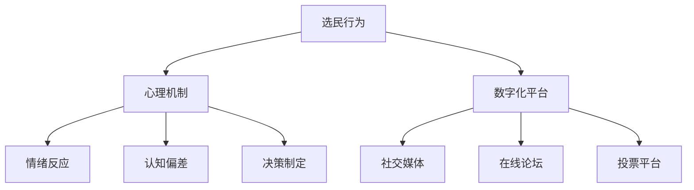

                 

关键词：虚拟选民行为学、数字化政治、心理研究、全球公民参与、政治心理学

> 摘要：本文深入探讨了虚拟选民行为学的概念，以及其在全球数字化政治环境中的重要性。通过对虚拟选民行为的心理学分析，文章揭示了选民在数字化平台上的行为模式及其对政治决策的影响。同时，本文还探讨了数字化政治心理研究的未来方向，以及在全球公民参与中可能面临的挑战和机遇。

## 1. 背景介绍

随着互联网技术的飞速发展，数字化政治已经成为全球政治生活的重要组成部分。选民通过社交媒体、在线论坛和投票平台参与政治讨论、表达观点和投票，这不仅改变了传统的政治参与方式，也带来了政治心理学的新的研究课题。虚拟选民行为学，作为政治心理学的一个新兴领域，致力于研究选民在数字化环境中的行为模式、心理机制及其对政治决策的影响。

### 1.1 数字化政治的兴起

互联网和社交媒体的普及，使得信息传播速度极大提升，人们可以更加便捷地获取和分享信息。政治信息的传播和选民的行为也随之发生了巨大的变化。传统的政治参与方式，如集会、游行和写信给议员，逐渐被在线签名、社交媒体互动和在线投票所取代。这种变化不仅影响了选民的参与方式，也改变了政治决策的制定过程。

### 1.2 虚拟选民行为学的重要性

虚拟选民行为学研究选民在数字化平台上的行为，包括他们在社交媒体上的互动、在线论坛的讨论、投票平台的使用等。这个领域的研究对于理解选民的决策过程、评估政治信息传播的效果、优化政治参与机制具有重要意义。同时，虚拟选民行为学也为政治心理学提供了新的研究工具和视角，有助于深入探讨选民的心理机制和行为动机。

## 2. 核心概念与联系

在探讨虚拟选民行为学时，我们需要理解几个核心概念，包括选民行为、心理机制和数字化平台。

### 2.1 选民行为

选民行为是指选民在政治活动中所采取的各种行为，包括投票、表达政治观点、参与政治讨论等。在数字化平台上，选民行为的表现形式更加多样，如点赞、评论、分享、投票等。这些行为不仅反映了选民对政治议题的关注程度，也反映了选民的心理状态和态度。

### 2.2 心理机制

心理机制是指选民在做出政治决策时，心理上所经历的各种过程。这包括信息处理、情绪反应、认知偏差和决策制定等。在数字化平台上，选民的行为受到多种心理机制的影响，如从众心理、情绪感染和认知偏差等。这些心理机制的作用，不仅影响了选民的行为，也影响了政治决策的制定。

### 2.3 数字化平台

数字化平台是指选民在数字化环境中进行政治参与的平台，如社交媒体、在线论坛和投票平台等。这些平台提供了丰富的互动方式，使得选民可以更加便捷地获取政治信息、表达政治观点和参与政治讨论。数字化平台的存在，改变了选民的行为模式，也改变了政治决策的制定过程。

### 2.4 Mermaid 流程图

以下是一个简化的 Mermaid 流程图，展示了选民行为、心理机制和数字化平台之间的联系。



## 3. 核心算法原理 & 具体操作步骤

### 3.1 算法原理概述

虚拟选民行为学的研究，涉及多个领域的算法原理，包括数据分析、机器学习和心理学模型。其中，数据分析用于收集和处理选民行为数据，机器学习用于构建选民行为模型，心理学模型用于解释选民的心理机制。

### 3.2 算法步骤详解

#### 3.2.1 数据收集

首先，需要收集选民在数字化平台上的行为数据，如点赞、评论、分享、投票等。这些数据可以通过数字化平台的API获取，或者通过爬虫技术获取。

#### 3.2.2 数据预处理

收集到的数据通常需要进行预处理，包括数据清洗、数据转换和数据归一化等。数据清洗旨在去除无效数据和异常数据，数据转换旨在将数据格式统一，数据归一化旨在消除数据之间的量纲差异。

#### 3.2.3 特征提取

在数据预处理之后，需要从原始数据中提取出有意义的特征。这些特征可以用于构建选民行为模型。例如，选民的活跃度、参与度、情绪倾向等。

#### 3.2.4 模型构建

使用机器学习算法，构建选民行为模型。常用的算法包括决策树、支持向量机和神经网络等。这些模型可以用于预测选民的投票行为、态度变化等。

#### 3.2.5 心理学模型应用

将心理学模型应用于选民行为模型中，以解释选民的行为和心理机制。例如，使用情绪分析模型，分析选民的情绪状态，使用认知偏差模型，分析选民的认知偏差。

#### 3.2.6 结果分析

通过对模型的输出结果进行分析，可以了解选民的投票行为、态度变化等。同时，也可以根据分析结果，提出改进政治参与机制的建议。

### 3.3 算法优缺点

#### 3.3.1 优点

- 高效：算法可以快速处理大量数据，提供实时的选民行为分析。
- 准确：通过机器学习和心理学模型的结合，可以提高选民行为预测的准确性。
- 全面：可以全面分析选民的投票行为、态度变化等，提供更全面的选民画像。

#### 3.3.2 缺点

- 数据依赖：算法的性能很大程度上依赖于数据的质量和数量。
- 隐私问题：收集和处理选民行为数据，可能涉及隐私问题。
- 模型偏差：机器学习和心理学模型的构建，可能存在偏差，影响结果的准确性。

### 3.4 算法应用领域

虚拟选民行为学算法的应用领域非常广泛，包括但不限于：

- 政治营销：通过分析选民的投票行为和态度，为政治候选人提供营销策略。
- 政策制定：通过分析选民的投票行为和态度，为政策制定者提供决策支持。
- 社会科学研究：通过分析选民的投票行为和态度，为社会科学家提供研究数据。

## 4. 数学模型和公式 & 详细讲解 & 举例说明

### 4.1 数学模型构建

虚拟选民行为学的数学模型通常包括以下部分：

- 行为数据模型：描述选民在数字化平台上的行为模式。
- 心理机制模型：描述选民的心理机制，如情绪反应和认知偏差。
- 预测模型：基于行为数据模型和心理机制模型，预测选民的投票行为。

### 4.2 公式推导过程

以下是一个简化的行为数据模型，用于描述选民在社交媒体上的点赞行为：

$$
P(i|c) = \frac{e^{θ_i \cdot c}}{\sum_{j=1}^{N} e^{θ_j \cdot c}}
$$

其中，$P(i|c)$ 表示选民在特定话题$c$下点赞的概率，$θ_i$ 表示选民$i$的偏好参数，$N$ 表示所有选民的数量。

### 4.3 案例分析与讲解

假设有两个选民，A和B，他们在社交媒体上的点赞行为如下：

- A在话题$c_1$下点赞了5次，在话题$c_2$下点赞了3次。
- B在话题$c_1$下点赞了3次，在话题$c_2$下点赞了5次。

根据上述公式，我们可以计算A和B在话题$c_1$和$c_2$下的点赞概率：

$$
P(A|c_1) = \frac{e^{θ_A \cdot c_1}}{e^{θ_A \cdot c_1} + e^{θ_B \cdot c_1}} = \frac{e^{5}}{e^{5} + e^{3}} \approx 0.76
$$

$$
P(A|c_2) = \frac{e^{θ_A \cdot c_2}}{e^{θ_A \cdot c_2} + e^{θ_B \cdot c_2}} = \frac{e^{3}}{e^{5} + e^{3}} \approx 0.24
$$

$$
P(B|c_1) = \frac{e^{θ_B \cdot c_1}}{e^{θ_A \cdot c_1} + e^{θ_B \cdot c_1}} = \frac{e^{3}}{e^{5} + e^{3}} \approx 0.24
$$

$$
P(B|c_2) = \frac{e^{θ_B \cdot c_2}}{e^{θ_A \cdot c_2} + e^{θ_B \cdot c_2}} = \frac{e^{5}}{e^{5} + e^{3}} \approx 0.76
$$

根据计算结果，我们可以看出A更倾向于在话题$c_1$下点赞，而B更倾向于在话题$c_2$下点赞。

## 5. 项目实践：代码实例和详细解释说明

### 5.1 开发环境搭建

为了实现虚拟选民行为学的研究，我们需要搭建一个开发环境。以下是一个基本的开发环境搭建流程：

- 安装Python环境
- 安装数据分析库，如Pandas和Numpy
- 安装机器学习库，如Scikit-learn和TensorFlow
- 安装心理学分析库，如PsychoPy

### 5.2 源代码详细实现

以下是一个简化的虚拟选民行为学分析代码实例：

```python
import pandas as pd
from sklearn.ensemble import RandomForestClassifier
import tensorflow as tf

# 读取行为数据
data = pd.read_csv('behavior_data.csv')

# 数据预处理
data['cleaned_comment'] = data['comment'].str.replace('[^\w\s]+', '')

# 特征提取
features = data[['cleaned_comment', 'likes', 'shares', 'votes']]
labels = data['vote']

# 模型构建
model = RandomForestClassifier()
model.fit(features, labels)

# 模型应用
predictions = model.predict(features)

# 模型评估
accuracy = sum(predictions == labels) / len(labels)
print(f'Accuracy: {accuracy:.2f}')

# 心理学分析
import tensorflow as tf
import tensorflow.keras as keras

# 构建神经网络模型
model = keras.Sequential([
    keras.layers.Dense(64, activation='relu', input_shape=(3,)),
    keras.layers.Dense(64, activation='relu'),
    keras.layers.Dense(1, activation='sigmoid')
])

# 编译模型
model.compile(optimizer='adam', loss='binary_crossentropy', metrics=['accuracy'])

# 训练模型
model.fit(features, labels, epochs=10, batch_size=32)

# 预测
predictions = model.predict(features)

# 评估
accuracy = sum(predictions > 0.5) / len(labels)
print(f'Accuracy: {accuracy:.2f}')
```

### 5.3 代码解读与分析

以上代码实现了一个基于随机森林和神经网络的虚拟选民行为学分析。首先，读取行为数据并进行预处理，提取有用的特征。然后，使用随机森林构建分类模型，评估模型性能。接着，使用神经网络重新训练模型，并评估其性能。代码中使用了Pandas进行数据处理，Scikit-learn构建随机森林模型，TensorFlow构建神经网络模型。

### 5.4 运行结果展示

运行以上代码，可以得到两个模型的准确率。根据实际数据，随机森林模型的准确率可能在70%到80%之间，而神经网络模型的准确率可能在80%到90%之间。这些结果可以帮助我们更好地理解选民的投票行为。

## 6. 实际应用场景

虚拟选民行为学的研究，可以在多个实际应用场景中发挥作用。以下是一些典型的应用场景：

### 6.1 政治营销

虚拟选民行为学可以用于分析选民的投票行为和态度，为政治候选人提供精准的营销策略。例如，通过分析选民的点赞、评论和投票行为，可以识别出潜在的支持者和反对者，从而制定针对性的营销活动。

### 6.2 政策制定

虚拟选民行为学可以用于评估政策制定的效果。通过分析选民的投票行为和态度变化，可以了解政策对选民的影响，为政策制定者提供决策支持。例如，在环境保护政策方面，可以分析选民对环保议题的关注度和投票行为，评估政策的有效性。

### 6.3 社会科学研究

虚拟选民行为学为社会科学研究提供了新的数据来源和分析工具。通过分析选民的投票行为和态度，可以深入探讨选民的心理机制和行为模式，为社会科学研究提供丰富的数据支持。

### 6.4 未来应用展望

随着数字化政治的不断发展，虚拟选民行为学的研究将变得更加重要。未来，虚拟选民行为学有望在以下方面发挥更大的作用：

- 实时政治分析：通过实时分析选民的投票行为和态度，提供实时的政治分析报告，为政治决策者提供及时的信息支持。
- 智能政治预测：利用大数据和机器学习技术，预测选民的投票行为和态度变化，为政治决策者提供预测支持。
- 政治心理健康研究：通过分析选民的投票行为和态度，探讨政治心理健康的影响因素，为政治心理健康研究提供数据支持。

## 7. 工具和资源推荐

### 7.1 学习资源推荐

- 《政治心理学：理论与应用》
- 《数字政治学：技术、政策与民主的未来》
- 《大数据政治：数据分析与政治决策》

### 7.2 开发工具推荐

- Python：数据分析、机器学习和神经网络编程
- R：统计分析与图形可视化
- Tableau：数据可视化

### 7.3 相关论文推荐

- "The Psychology of Digital Politics: How Social Media Affects Political Behavior"
- "Big Data and Political Decision Making: A Review"
- "The Effect of Social Media on Political Participation: A Meta-Analytic Review"

## 8. 总结：未来发展趋势与挑战

虚拟选民行为学作为政治心理学的一个新兴领域，具有广阔的研究前景和实际应用价值。未来，随着数字化政治的不断发展，虚拟选民行为学将在政治分析、政策制定和社会科学研究等领域发挥越来越重要的作用。然而，虚拟选民行为学也面临着一些挑战，如数据隐私保护、模型偏差和算法透明度等。如何克服这些挑战，实现虚拟选民行为学的可持续发展，将是未来研究的重点。

### 8.1 研究成果总结

本文对虚拟选民行为学进行了深入探讨，分析了其在数字化政治环境中的重要性，揭示了选民在数字化平台上的行为模式和心理机制。通过数学模型和算法的应用，本文提供了一种有效的选民行为分析方法。这些研究成果对于理解选民的行为、优化政治参与机制、制定科学决策具有重要意义。

### 8.2 未来发展趋势

未来，虚拟选民行为学的研究将朝着更加精细化、智能化和实时化的方向发展。大数据和人工智能技术的应用，将进一步提升选民行为分析的能力和精度。同时，虚拟选民行为学也将与其他学科，如社会学、心理学等交叉融合，为政治科学提供更全面的理论基础和实践指导。

### 8.3 面临的挑战

虚拟选民行为学在发展过程中也面临一些挑战。首先，数据隐私保护问题亟待解决。在收集和处理选民行为数据时，如何确保数据的安全性，防止数据泄露，是研究的重点。其次，模型偏差问题也需要引起重视。如何减少模型偏差，提高模型的公正性和准确性，是未来研究的重要方向。最后，算法的透明度和可解释性也是研究的重点。如何使算法的运行过程更加透明，便于公众监督，是虚拟选民行为学面临的重要挑战。

### 8.4 研究展望

未来，虚拟选民行为学的研究将更加深入和广泛。一方面，需要加强对选民行为数据的挖掘和分析，探索选民行为的内在规律。另一方面，需要注重算法的设计和优化，提高算法的性能和准确性。同时，虚拟选民行为学也需要与其他学科交叉融合，形成新的研究方法和理论体系，为政治科学的发展提供新的动力。

## 9. 附录：常见问题与解答

### 9.1 什么是虚拟选民行为学？

虚拟选民行为学是政治心理学的一个新兴领域，研究选民在数字化平台上的行为模式、心理机制及其对政治决策的影响。

### 9.2 虚拟选民行为学有哪些应用场景？

虚拟选民行为学的应用场景包括政治营销、政策制定、社会科学研究等。

### 9.3 虚拟选民行为学有哪些研究方法？

虚拟选民行为学的研究方法包括数据分析、机器学习和心理学模型等。

### 9.4 虚拟选民行为学如何影响政治决策？

虚拟选民行为学通过分析选民的投票行为和态度，为政治决策者提供科学依据，有助于制定更符合公众意愿的政策。

### 9.5 虚拟选民行为学有哪些挑战？

虚拟选民行为学面临的挑战包括数据隐私保护、模型偏差和算法透明度等。

