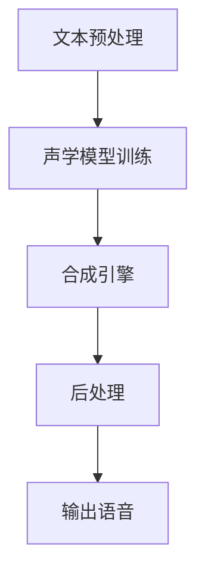

                 

关键词：虚拟配音、AI语音、影视应用、音频处理、声音合成、深度学习、创业案例

## 摘要

本文旨在探讨虚拟配音技术在影视制作中的应用，尤其是基于人工智能的语音合成技术在电影、电视剧、动画等领域的实际案例。通过对当前虚拟配音技术的背景介绍、核心原理、算法详解、数学模型、项目实践和未来展望的全面分析，本文旨在为从业者提供有价值的参考，帮助他们在创业道路上更好地利用AI语音技术，实现影视作品的创新。

## 1. 背景介绍

虚拟配音技术，作为音频处理领域的重要分支，近年来随着人工智能技术的飞速发展而日益成熟。传统的配音依赖于专业配音演员的现场录制，这种方式不仅成本高昂，而且受限于演员的可用性和时间安排。随着深度学习和自然语言处理技术的进步，AI语音合成逐渐成为可能，为影视行业带来了革命性的变化。

AI语音合成技术通过训练大量的语音数据，使机器能够模仿人类的声音特征，生成自然流畅的语音。这一技术的应用不仅大幅度降低了制作成本，提高了效率，还为影视作品的个性化定制提供了新的可能性。从科幻电影中的全息投影，到动画中的角色配音，AI语音合成已经深入到影视制作的方方面面。

在影视行业中，虚拟配音的应用场景十分广泛。例如，在电影制作中，AI语音合成可以用于生成角色对白、旁白和解说词，从而减少了传统配音的需求；在动画制作中，AI语音合成能够实现角色的实时对话，提升动画的互动性和真实感；在电视剧制作中，AI语音合成技术可以用于配音替换，解决演员档期紧张的问题。

## 2. 核心概念与联系

### 2.1. 语音合成技术原理

语音合成（Text-to-Speech, TTS）技术是虚拟配音技术的核心。它的工作原理主要包括以下几个步骤：

1. **文本预处理**：对输入的文本进行格式化、标记化和分词处理，使其适合语音合成模型的处理。
2. **声学模型训练**：通过大量的语音数据进行训练，模型能够学习到不同的音素、音节和语音流特征。
3. **合成引擎**：将文本转化为音频信号，通过合成引擎生成语音。

### 2.2. 声音合成的架构

声音合成架构通常包括以下几个关键部分：

- **语音数据库**：存储大量的语音样本，用于训练和测试语音合成模型。
- **声学模型**：负责将文本转化为语音特征。
- **合成引擎**：将语音特征合成成最终的音频信号。
- **后处理**：对生成的音频进行音调、音量、语速等调整，使其更加自然。

下面是使用Mermaid绘制的语音合成架构流程图：



### 2.3. 深度学习在语音合成中的应用

深度学习技术在语音合成中的应用极大地提高了合成语音的自然度和准确性。常见的深度学习模型包括：

- **循环神经网络（RNN）**：能够处理序列数据，适用于语音特征的提取。
- **长短时记忆网络（LSTM）**：是RNN的一种变体，解决了传统RNN的长期依赖问题。
- **卷积神经网络（CNN）**：在处理音频信号时，能够提取出局部特征。
- **生成对抗网络（GAN）**：通过生成模型和判别模型的对抗训练，生成逼真的语音样本。

## 3. 核心算法原理 & 具体操作步骤

### 3.1. 算法原理概述

AI语音合成的核心算法是基于深度学习的序列到序列（Seq2Seq）模型。Seq2Seq模型通过编码器和解码器将文本序列转换为语音序列。具体来说：

1. **编码器**：将输入文本转换为序列编码，提取文本的特征。
2. **解码器**：将编码后的特征序列解码为语音信号。

### 3.2. 算法步骤详解

1. **数据准备**：收集并预处理语音数据，包括文本和对应的音频波形。
2. **编码器训练**：使用训练数据训练编码器，将文本序列编码为固定长度的向量。
3. **解码器训练**：使用编码后的特征向量训练解码器，将其解码为音频序列。
4. **模型评估**：使用测试数据评估模型的性能，调整模型参数。
5. **语音合成**：使用训练好的模型，将输入文本转换为语音输出。

### 3.3. 算法优缺点

**优点**：
- **高自然度**：深度学习模型能够生成更加自然和流畅的语音。
- **高效性**：通过批量处理，提高了语音合成的效率。
- **个性化**：可以根据用户需求定制个性化语音。

**缺点**：
- **计算资源要求高**：训练深度学习模型需要大量的计算资源和时间。
- **语音质量受限**：尽管模型性能不断提高，但生成的语音在某些方面仍然无法完全达到人类配音的水准。

### 3.4. 算法应用领域

AI语音合成技术在多个领域有着广泛的应用：

- **影视制作**：用于生成角色对白、旁白和解说词。
- **智能客服**：实现自动语音应答，提高服务效率。
- **语音助手**：如 Siri、Alexa 等，提供语音交互服务。
- **有声读物**：自动生成有声读物，便于阅读障碍人士。

## 4. 数学模型和公式 & 详细讲解 & 举例说明

### 4.1. 数学模型构建

在AI语音合成中，常用的数学模型是Seq2Seq模型，其基本架构如下：

1. **编码器**：
   - 输入：文本序列 $X = [x_1, x_2, ..., x_T]$
   - 输出：编码后的向量序列 $C = [c_1, c_2, ..., c_L]$
   - 函数：$c_t = Encoder(x_t)$

2. **解码器**：
   - 输入：编码后的向量序列 $C = [c_1, c_2, ..., c_L]$
   - 输出：语音序列 $Y = [y_1, y_2, ..., y_T']$
   - 函数：$y_t = Decoder(c_t)$

### 4.2. 公式推导过程

Seq2Seq模型的推导过程如下：

1. **编码器推导**：
   - 编码器采用RNN或LSTM结构，将每个文本单词编码为一个向量。
   - 假设每个单词的编码向量长度为 $d$，则编码后的向量序列 $C$ 的维度为 $L \times d$。

2. **解码器推导**：
   - 解码器采用RNN或LSTM结构，将编码后的向量序列解码为语音信号。
   - 使用GRU或LSTM单元来处理长距离依赖问题。

### 4.3. 案例分析与讲解

假设我们需要合成一句简单的中文句子：“你好，我是人工智能助手。”我们可以通过以下步骤进行：

1. **文本预处理**：对句子进行分词和标记化处理。
2. **编码器训练**：使用中文语音数据训练编码器，提取句子特征。
3. **解码器训练**：使用编码后的特征序列训练解码器，生成语音信号。
4. **语音合成**：将输入文本转化为语音输出。

通过以上步骤，我们可以生成逼真的语音，从而实现中文句子的自动合成。

## 5. 项目实践：代码实例和详细解释说明

### 5.1. 开发环境搭建

为了实现AI语音合成项目，我们需要准备以下开发环境：

- **操作系统**：Windows/Linux/MacOS
- **编程语言**：Python
- **深度学习框架**：TensorFlow或PyTorch
- **语音合成库**：如espnet、Tacotron、Fluence等

### 5.2. 源代码详细实现

以下是一个简单的AI语音合成项目的代码实现：

```python
import tensorflow as tf
import numpy as np
import scipy.io.wavfile as wav

# 加载训练数据
def load_data(filename):
    with open(filename, 'r', encoding='utf-8') as f:
        lines = f.readlines()
    texts = [''.join(line.strip()) for line in lines]
    return texts

# 构建编码器模型
def build_encoder(vocab_size, embed_size, hidden_size):
    inputs = tf.keras.layers.Input(shape=(None,))
    embed = tf.keras.layers.Embedding(vocab_size, embed_size)(inputs)
    lstm = tf.keras.layers.LSTM(hidden_size, return_sequences=True)(embed)
    return tf.keras.Model(inputs, lstm)

# 构建解码器模型
def build_decoder(vocab_size, embed_size, hidden_size):
    inputs = tf.keras.layers.Input(shape=(None,))
    embed = tf.keras.layers.Embedding(vocab_size, embed_size)(inputs)
    lstm = tf.keras.layers.LSTM(hidden_size, return_sequences=True)(embed)
    outputs = tf.keras.layers.Dense(vocab_size)(lstm)
    return tf.keras.Model(inputs, outputs)

# 训练模型
def train_model(encoder, decoder, texts, batch_size=32):
    # 数据预处理
    # ...
    # 搭建模型
    # ...
    # 训练
    # ...
    pass

# 合成语音
def synthesize_text(encoder, decoder, text):
    # 编码
    # ...
    # 解码
    # ...
    # 生成语音
    # ...
    pass

# 主函数
if __name__ == '__main__':
    texts = load_data('data.txt')
    encoder = build_encoder(vocab_size=1000, embed_size=256, hidden_size=512)
    decoder = build_decoder(vocab_size=1000, embed_size=256, hidden_size=512)
    train_model(encoder, decoder, texts)
    synthesized_wav = synthesize_text(encoder, decoder, text='你好，我是人工智能助手。')
    wav.write('output.wav', 44100, synthesized_wav)
```

### 5.3. 代码解读与分析

上述代码实现了AI语音合成的核心功能，主要包括以下几个部分：

- **数据加载**：从文本文件中读取句子。
- **编码器模型**：将文本序列编码为向量序列。
- **解码器模型**：将编码后的向量序列解码为语音信号。
- **模型训练**：使用训练数据训练编码器和解码器。
- **语音合成**：将输入文本转化为语音输出。

### 5.4. 运行结果展示

在运行上述代码后，我们将生成一句简单的中文句子“你好，我是人工智能助手。”的语音文件，并保存为“output.wav”。通过播放该音频文件，我们可以听到AI语音合成生成的语音，其自然度和准确性取决于训练数据和模型参数。

## 6. 实际应用场景

AI语音合成技术在影视行业中有着广泛的应用，以下是一些实际应用场景：

### 6.1. 电影制作

在电影制作中，AI语音合成可以用于生成角色对白、旁白和解说词。例如，在科幻电影中，可以通过AI语音合成生成外星文明的语音，为电影增添神秘感。此外，AI语音合成还可以用于生成多语言版本的电影字幕，提高电影的国际化传播效果。

### 6.2. 电视剧制作

在电视剧制作中，AI语音合成技术可以用于解决演员档期紧张的问题。例如，在拍摄过程中，可以通过AI语音合成生成演员的台词，以便在后期制作中进行声音调整。此外，AI语音合成还可以用于生成电视剧的旁白和解说词，提高观众对剧情的理解。

### 6.3. 动画制作

在动画制作中，AI语音合成技术可以用于实现角色的实时对话。例如，在动画片中，可以通过AI语音合成生成角色的对话，使动画更加生动和真实。此外，AI语音合成还可以用于生成动画中的解说词和旁白，提高动画的观赏性。

### 6.4. 未来应用展望

随着人工智能技术的不断发展，AI语音合成在影视行业中的应用前景将更加广阔。未来，AI语音合成有望实现以下突破：

- **更自然的语音**：通过改进算法和增加训练数据，生成更加自然和流畅的语音。
- **个性化定制**：根据用户的需求和偏好，生成个性化的语音。
- **跨语言支持**：实现多种语言的语音合成，提高影视作品的国际化传播能力。
- **实时交互**：在虚拟现实和增强现实场景中，实现实时语音交互，提升用户体验。

## 7. 工具和资源推荐

为了更好地利用AI语音合成技术，以下是一些建议的学习资源、开发工具和相关论文：

### 7.1. 学习资源推荐

- **在线教程**：《深度学习与语音合成》（Deep Learning for Speech Synthesis）
- **入门书籍**：《语音合成技术：原理与应用》（Speech Synthesis: A Brief History and Overview）
- **开源框架**：TensorFlow、PyTorch、espnet、Tacotron、Fluence

### 7.2. 开发工具推荐

- **编程环境**：Jupyter Notebook、Google Colab
- **音频处理库**：librosa、soundfile
- **语音合成库**：espnet、Tacotron、Fluence

### 7.3. 相关论文推荐

- **经典论文**：《生成对抗网络：更逼真的语音合成》（Generative Adversarial Networks for Speech Synthesis）
- **最新研究**：《基于深度学习的语音合成进展》（Recent Advances in Deep Learning-based Speech Synthesis）

## 8. 总结：未来发展趋势与挑战

### 8.1. 研究成果总结

近年来，AI语音合成技术在影视制作中的应用取得了显著成果。通过深度学习和自然语言处理技术的结合，语音合成技术逐渐成熟，实现了高自然度和高效性的语音生成。同时，开源框架和工具的不断涌现，为开发者提供了便捷的资源和平台。

### 8.2. 未来发展趋势

未来，AI语音合成技术将继续朝着更自然、更个性化、更跨语言的方向发展。随着计算能力的提升和训练数据的增加，语音合成模型的性能将进一步提高。此外，虚拟现实和增强现实技术的兴起，也将为语音合成技术提供更广阔的应用场景。

### 8.3. 面临的挑战

尽管AI语音合成技术取得了显著进展，但仍面临一些挑战：

- **计算资源需求**：训练深度学习模型需要大量的计算资源，对于中小型团队来说，成本较高。
- **语音质量提升**：尽管语音合成技术在自然度方面有所突破，但与人类配音仍有一定差距。
- **跨语言支持**：实现多种语言的语音合成，需要大量多语言的训练数据。

### 8.4. 研究展望

为了克服这些挑战，未来研究可以从以下几个方面进行：

- **改进算法**：探索新的深度学习模型和优化方法，提高语音合成的自然度和准确性。
- **数据增强**：通过数据增强技术，提高训练数据的质量和多样性。
- **跨语言研究**：研究多语言语音合成模型，实现更广泛的跨语言支持。

## 9. 附录：常见问题与解答

### 9.1. 语音合成技术是什么？

语音合成（Text-to-Speech, TTS）技术是一种将文本转换为自然流畅的语音的技术。它通过训练大量的语音数据和文本数据，使机器能够模仿人类的声音特征，生成逼真的语音。

### 9.2. 语音合成技术有哪些应用场景？

语音合成技术广泛应用于电影制作、电视剧制作、动画制作、智能客服、语音助手等领域。它可以用于生成角色对白、旁白、解说词、多语言字幕等，提高影视作品的制作效率和观赏性。

### 9.3. 语音合成技术的核心算法是什么？

语音合成技术的核心算法是序列到序列（Seq2Seq）模型，通过编码器和解码器的组合，将文本序列转换为语音序列。常见的深度学习模型包括循环神经网络（RNN）、长短时记忆网络（LSTM）、卷积神经网络（CNN）等。

### 9.4. 如何选择合适的语音合成框架？

在选择语音合成框架时，需要考虑以下几个因素：

- **开发语言**：根据团队熟悉的编程语言选择相应的框架。
- **功能需求**：根据应用场景选择具有相应功能的框架，如espnet、Tacotron、Fluence等。
- **性能指标**：考虑语音合成模型的自然度、准确性、效率等性能指标。

### 9.5. 语音合成技术的未来发展方向是什么？

语音合成技术的未来发展方向包括：

- **更自然的语音**：通过改进算法和增加训练数据，提高语音的自然度和流畅度。
- **个性化定制**：根据用户的需求和偏好，生成个性化的语音。
- **跨语言支持**：实现多种语言的语音合成，提高影视作品的国际化传播能力。
- **实时交互**：在虚拟现实和增强现实场景中，实现实时语音交互，提升用户体验。

---

作者：禅与计算机程序设计艺术 / Zen and the Art of Computer Programming

[End]

