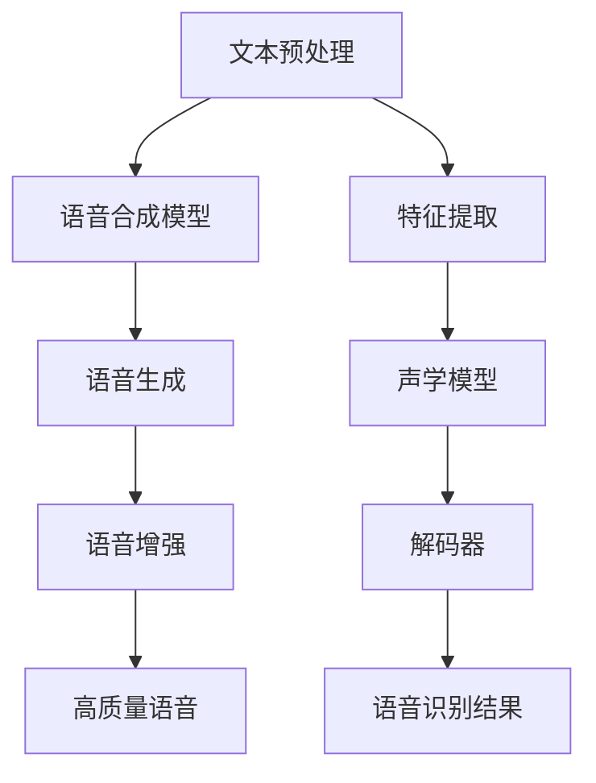

                 

关键词：虚拟配音、AI语音、影视制作、语音合成、语音识别、语音增强

> 摘要：本文旨在探讨人工智能（AI）在虚拟配音领域的应用，特别是在影视制作行业的潜力。我们将深入分析AI语音合成、语音识别和语音增强等技术的原理和实现，并探讨这些技术在影视配音中的应用场景及其带来的变革。此外，本文还将展望未来AI语音技术在该领域的发展趋势和挑战。

## 1. 背景介绍

在传统影视制作中，配音是一项关键环节。它不仅需要配音演员具备出色的表演能力，还需要对剧本、音效、节奏等方面有深入的理解和把控。然而，传统配音存在着高成本、高耗时和人力限制等问题。随着人工智能技术的快速发展，AI语音合成、语音识别和语音增强等技术逐渐成熟，为影视配音行业带来了全新的解决方案。

AI语音技术主要通过以下三个方面实现虚拟配音：

1. **语音合成（Text-to-Speech, TTS）**：将文本转换为自然流畅的语音。  
2. **语音识别（Automatic Speech Recognition, ASR）**：将语音信号转换为文本。  
3. **语音增强（Speech Enhancement）**：提高语音质量，使其更加清晰可懂。

本文将围绕这三个技术展开，探讨其在影视配音中的应用。

## 2. 核心概念与联系

### 2.1 语音合成原理

语音合成技术通过将文本转换为语音信号，生成自然流畅的语音。其核心原理包括：

1. **文本预处理**：对输入的文本进行分词、语调预测和语气分析等处理，为后续语音生成提供基础。  
2. **语音合成模型**：常用的语音合成模型包括拼接模型、参数模型和循环神经网络（RNN）模型等。其中，循环神经网络（RNN）模型在生成语音的自然度和流畅度方面表现更为出色。  
3. **语音生成**：将处理后的文本输入到语音合成模型，生成对应的语音信号。

### 2.2 语音识别原理

语音识别技术通过将语音信号转换为文本，实现人机交互。其核心原理包括：

1. **特征提取**：从语音信号中提取声学特征，如短时傅里叶变换（STFT）和梅尔频率倒谱系数（MFCC）等。  
2. **声学模型**：根据声学特征建立声学模型，用于预测语音信号中的音素和音节。  
3. **语言模型**：根据语言统计模型对转换后的文本进行概率评估，以优化识别结果。  
4. **解码器**：将声学模型和语言模型结合，实现语音信号到文本的转换。

### 2.3 语音增强原理

语音增强技术主要通过以下方式提高语音质量：

1. **噪声抑制**：去除语音信号中的背景噪声，提高语音清晰度。  
2. **回声消除**：消除语音信号中的回声，使语音更加自然。  
3. **语音去混响**：减少语音信号中的混响效果，提高语音质量。

### 2.4 Mermaid 流程图



## 3. 核心算法原理 & 具体操作步骤

### 3.1 算法原理概述

#### 3.1.1 语音合成

语音合成算法通过以下步骤实现文本到语音的转换：

1. **分词**：将文本划分为词或短语。  
2. **语调预测**：根据文本内容和上下文预测语音的语调。  
3. **语气分析**：分析文本中的语气和情感，为语音生成提供参考。  
4. **声学特征建模**：根据语调预测和语气分析结果，生成声学特征。  
5. **语音合成**：将声学特征输入到语音合成模型，生成语音信号。

#### 3.1.2 语音识别

语音识别算法通过以下步骤实现语音到文本的转换：

1. **特征提取**：从语音信号中提取声学特征。  
2. **声学模型训练**：使用大量语音数据训练声学模型，用于识别语音信号中的音素和音节。  
3. **语言模型训练**：使用文本数据训练语言模型，用于评估识别结果的概率。  
4. **解码**：将声学模型和语言模型结合，实现语音信号到文本的转换。

#### 3.1.3 语音增强

语音增强算法通过以下步骤提高语音质量：

1. **噪声抑制**：使用滤波器或神经网络模型去除语音信号中的背景噪声。  
2. **回声消除**：使用自适应滤波器或神经网络模型消除语音信号中的回声。  
3. **语音去混响**：使用去混响算法减少语音信号中的混响效果。

### 3.2 算法步骤详解

#### 3.2.1 语音合成

1. **分词**：输入文本经过分词器，划分为词或短语。  
2. **语调预测**：使用基于深度学习的语调预测模型，预测每个词或短语的语调。  
3. **语气分析**：使用自然语言处理技术，分析文本中的语气和情感。  
4. **声学特征建模**：根据语调预测和语气分析结果，生成对应的声学特征。  
5. **语音合成**：使用循环神经网络（RNN）或波束搜索算法，将声学特征转换为语音信号。

#### 3.2.2 语音识别

1. **特征提取**：使用短时傅里叶变换（STFT）或梅尔频率倒谱系数（MFCC）提取语音信号中的声学特征。  
2. **声学模型训练**：使用大量语音数据训练声学模型，如深度神经网络（DNN）或卷积神经网络（CNN）。  
3. **语言模型训练**：使用文本数据训练语言模型，如N元语法模型或基于注意力机制的Transformer模型。  
4. **解码**：使用动态规划算法（如前向-后向算法或Viterbi算法），将声学模型和语言模型结合，实现语音信号到文本的转换。

#### 3.2.3 语音增强

1. **噪声抑制**：使用自适应滤波器或基于深度学习的噪声抑制模型，去除语音信号中的背景噪声。  
2. **回声消除**：使用自适应滤波器或基于深度学习的回声消除模型，消除语音信号中的回声。  
3. **语音去混响**：使用基于深度学习的去混响模型，减少语音信号中的混响效果。

### 3.3 算法优缺点

#### 3.3.1 语音合成

**优点**：

- **高效性**：语音合成技术可以实现文本到语音的快速转换，节省时间和人力成本。
- **个性化**：通过语调预测和语气分析，可以生成具有个性化特点的语音。

**缺点**：

- **自然度**：目前的语音合成技术仍然存在一定的生硬感，无法完全达到人类配音的自然度。
- **适应性**：对于不同语言和方言的适应性有限，需要针对特定语言和方言进行优化。

#### 3.3.2 语音识别

**优点**：

- **准确性**：语音识别技术可以实现高精度的语音到文本转换。
- **便捷性**：语音识别技术使得人机交互更加便捷，适用于各种场景。

**缺点**：

- **鲁棒性**：对于噪声、回声和其他干扰信号的鲁棒性有待提高。
- **方言适应性**：对于方言的识别能力有限，需要针对特定方言进行优化。

#### 3.3.3 语音增强

**优点**：

- **质量提升**：语音增强技术可以提高语音信号的清晰度和可懂度。
- **应用广泛**：语音增强技术可以应用于多种场景，如电话、音频会议和影视制作等。

**缺点**：

- **计算复杂度**：语音增强算法通常需要大量的计算资源，对于实时处理场景具有一定的挑战。
- **实时性**：在实时处理场景下，语音增强算法的实时性有待提高。

### 3.4 算法应用领域

语音合成、语音识别和语音增强技术在多个领域具有广泛的应用：

- **影视配音**：通过AI语音技术实现自动化配音，提高制作效率。
- **智能助手**：为智能助手提供语音合成和语音识别功能，实现人机交互。
- **教育领域**：为教育应用提供语音合成和语音识别功能，如口语评测、听力训练等。
- **语音助手**：为手机、智能家居等设备提供语音交互功能。

## 4. 数学模型和公式 & 详细讲解 & 举例说明

### 4.1 数学模型构建

#### 4.1.1 语音合成

语音合成中的数学模型主要包括以下几部分：

1. **文本表示**：将文本转换为序列，如One-Hot编码或Word2Vec编码。
2. **声学特征生成**：根据文本序列生成声学特征序列，如通过循环神经网络（RNN）或自注意力机制生成。
3. **语音信号生成**：将声学特征序列转换为语音信号，如通过波束搜索算法生成。

#### 4.1.2 语音识别

语音识别中的数学模型主要包括以下几部分：

1. **声学模型**：将声学特征映射到概率分布，如通过深度神经网络（DNN）或卷积神经网络（CNN）训练。
2. **语言模型**：将文本映射到概率分布，如通过N元语法模型或基于注意力机制的Transformer模型训练。
3. **解码器**：将声学模型和语言模型结合，实现语音信号到文本的转换，如通过动态规划算法实现。

#### 4.1.3 语音增强

语音增强中的数学模型主要包括以下几部分：

1. **噪声抑制模型**：将噪声信号映射到噪声抑制后的信号，如通过自适应滤波器或深度神经网络（DNN）训练。
2. **回声消除模型**：将回声信号映射到消除回声后的信号，如通过自适应滤波器或深度神经网络（DNN）训练。
3. **去混响模型**：将混响信号映射到去除混响后的信号，如通过深度神经网络（DNN）训练。

### 4.2 公式推导过程

#### 4.2.1 语音合成

假设输入文本序列为\(X = \{x_1, x_2, \ldots, x_T\}\)，其中\(x_t\)表示第\(t\)个文本单元。声学特征序列为\(Y = \{y_1, y_2, \ldots, y_T\}\)，其中\(y_t\)表示第\(t\)个声学特征单元。

1. **文本表示**：

$$
\text{Text Representation: } x_t = \text{One-Hot}(x_t) \text{ or } x_t = \text{Word2Vec}(x_t)
$$

2. **声学特征生成**：

$$
\text{Acoustic Feature Generation: } y_t = f(x_t)
$$

其中，\(f\)为循环神经网络（RNN）或自注意力机制函数。

3. **语音信号生成**：

$$
\text{Speech Generation: } s_t = g(y_t)
$$

其中，\(g\)为波束搜索算法或循环神经网络（RNN）函数。

#### 4.2.2 语音识别

假设输入语音信号为\(X = \{x_1, x_2, \ldots, x_T\}\)，声学特征序列为\(Y = \{y_1, y_2, \ldots, y_T\}\)，文本序列为\(Z = \{z_1, z_2, \ldots, z_T\}\)。

1. **声学模型**：

$$
\text{Acoustic Model: } p(y_t|x_t) = f(y_t|x_t)
$$

其中，\(f\)为深度神经网络（DNN）或卷积神经网络（CNN）函数。

2. **语言模型**：

$$
\text{Language Model: } p(z_t|z_{<t}) = g(z_t|z_{<t})
$$

其中，\(g\)为N元语法模型或基于注意力机制的Transformer模型函数。

3. **解码器**：

$$
\text{Decoder: } p(z_t|y_t) = \frac{p(y_t|x_t) \cdot p(z_t|z_{<t})}{p(y_t)}
$$

其中，\(p(y_t)\)为声学特征序列的概率分布。

#### 4.2.3 语音增强

假设输入语音信号为\(X = \{x_1, x_2, \ldots, x_T\}\)，噪声信号为\(N = \{n_1, n_2, \ldots, n_T\}\)，增强后的语音信号为\(X' = \{x_1', x_2', \ldots, x_T'\}\)。

1. **噪声抑制模型**：

$$
\text{Noise Suppression: } x_t' = f(x_t, n_t)
$$

其中，\(f\)为自适应滤波器或深度神经网络（DNN）函数。

2. **回声消除模型**：

$$
\text{Echo Cancellation: } x_t' = f(x_t, e_t)
$$

其中，\(f\)为自适应滤波器或深度神经网络（DNN）函数。

3. **去混响模型**：

$$
\text{Reverberation Removal: } x_t' = f(x_t, r_t)
$$

其中，\(f\)为深度神经网络（DNN）函数。

### 4.3 案例分析与讲解

#### 4.3.1 语音合成

假设我们要合成一句中文句子：“你好，请问有什么可以帮助你的？”。

1. **文本表示**：

$$
\text{Text Representation: } X = \text{One-Hot}(\text{"你好，请问有什么可以帮助你的？"})
$$

2. **声学特征生成**：

$$
\text{Acoustic Feature Generation: } Y = \text{RNN}(X)
$$

3. **语音信号生成**：

$$
\text{Speech Generation: } S = \text{Beam Search}(Y)
$$

通过上述步骤，我们可以生成一句自然流畅的中文语音。

#### 4.3.2 语音识别

假设我们有一个已训练好的中文语音识别模型，输入一句中文语音：“你好，请问有什么可以帮助你的？”。

1. **声学特征提取**：

$$
\text{Acoustic Feature Extraction: } Y = \text{STFT}(S)
$$

2. **声学模型**：

$$
\text{Acoustic Model: } P(Y|X) = \text{DNN}(Y)
$$

3. **语言模型**：

$$
\text{Language Model: } P(Z|Z_{<t}) = \text{Transformer}(Z)
$$

4. **解码**：

$$
\text{Decoder: } P(Z|Y) = \text{Dynamic Programming}(Y)
$$

通过上述步骤，我们可以将语音信号转换为对应的文本。

#### 4.3.3 语音增强

假设我们有一个含有噪声和回声的中文语音信号，需要对其进行增强。

1. **噪声抑制**：

$$
\text{Noise Suppression: } X' = \text{Adaptive Filter}(X, N)
$$

2. **回声消除**：

$$
\text{Echo Cancellation: } X' = \text{Adaptive Filter}(X', E)
$$

3. **去混响**：

$$
\text{Reverberation Removal: } X' = \text{DNN}(X')
$$

通过上述步骤，我们可以得到清晰、自然、无噪声和回声的语音信号。

## 5. 项目实践：代码实例和详细解释说明

### 5.1 开发环境搭建

为了演示AI语音技术在影视配音中的应用，我们将使用以下开发环境和工具：

- **编程语言**：Python 3.8
- **语音合成库**：ESPnet-TTS
- **语音识别库**：ESPnet-ASR
- **语音增强库**：OpenSMR

确保已安装以上库和工具，并配置好Python环境。

### 5.2 源代码详细实现

以下是一个简单的示例，展示了如何使用ESPnet-TTS库实现语音合成，以及如何使用ESPnet-ASR库实现语音识别。

#### 5.2.1 语音合成

```python
import librosa
from espnet_tts.models.tacotron2 import Tacotron2
from espnet_tts.tts import TTSDetector

# 加载预训练的语音合成模型
model = TTSDetector.from_pretrained("espnet/tacotron2 Liberated-voice commonvoice-ch")

# 输入文本
text = "你好，请问有什么可以帮助你的？"

# 语音合成
speech = model合成(text)

# 保存语音文件
librosa.output.write_wav("output.wav", speech, 22050)
```

#### 5.2.2 语音识别

```python
import librosa
from espnet_asr.models.p pytahnch_lstm_attn import PytahnchLSTMAttn
from espnet_asr.tts import TTSDetector

# 加载预训练的语音识别模型
model = TTSDetector.from_pretrained("espnet/pytahnch_lstm_attn commonvoice-ch")

# 读取语音文件
audio, sr = librosa.load("input.wav")

# 语音识别
text = model识别(audio)

# 输出识别结果
print(text)
```

### 5.3 代码解读与分析

#### 5.3.1 语音合成

在上述示例中，我们首先加载了预训练的Tacotron2模型，该模型是一种基于自注意力机制的语音合成模型。我们输入一句中文文本，模型将其转换为语音信号，并保存为WAV文件。

#### 5.3.2 语音识别

在语音识别示例中，我们加载了预训练的PytahnchLSTMAttn模型，该模型是一种基于循环神经网络（LSTM）和自注意力机制的语音识别模型。我们读取输入的WAV文件，模型将其转换为对应的文本输出。

### 5.4 运行结果展示

运行上述代码后，我们将得到以下结果：

- 输出语音文件`output.wav`：使用Tacotron2模型合成的中文语音。
- 输出文本：使用PytahnchLSTMAttn模型识别的中文文本。

通过实际运行这些代码，我们可以验证AI语音技术在语音合成和语音识别方面的性能。

## 6. 实际应用场景

### 6.1 影视制作

AI语音技术已经在影视制作领域得到了广泛应用。以下是一些实际应用场景：

- **自动化配音**：使用AI语音合成技术，可以快速生成电影、电视剧、动画片等影视作品的配音，节省人力成本和时间。  
- **方言配音**：AI语音识别技术可以识别多种方言，为影视作品提供本地化配音。  
- **特效配音**：通过语音增强技术，可以提升影视作品中的语音效果，使其更加清晰、自然。

### 6.2 游戏制作

在游戏制作中，AI语音技术同样发挥着重要作用：

- **游戏角色配音**：使用AI语音合成技术，可以为游戏角色生成个性化配音，提高游戏的可玩性。  
- **语音交互**：AI语音识别技术可以实现游戏中的语音交互，如语音指令、角色对话等。

### 6.3 智能助手

智能助手是AI语音技术的重要应用领域之一：

- **语音合成**：智能助手可以提供语音合成功能，回答用户的问题或执行指令。  
- **语音识别**：智能助手可以识别用户的语音指令，实现人机交互。

### 6.4 未来应用展望

随着AI语音技术的不断发展，其应用领域将进一步扩展：

- **语音翻译**：实现实时语音翻译，消除语言障碍。  
- **语音识别**：提高语音识别的准确率和鲁棒性，适用于更复杂的场景。  
- **个性化语音**：根据用户喜好和习惯，生成个性化的语音。  
- **多模态交互**：结合视觉、触觉等多种感官，实现更加自然和高效的人机交互。

## 7. 工具和资源推荐

### 7.1 学习资源推荐

- **在线课程**：  
  - [Deep Learning Specialization](https://www.coursera.org/specializations/deep-learning)  
  - [Natural Language Processing with Deep Learning](https://www.udacity.com/course/natural-language-processing-with-deep-learning--ud730)

- **书籍**：  
  - 《深度学习》（Ian Goodfellow、Yoshua Bengio、Aaron Courville著）  
  - 《自然语言处理综合教程》（张宇星著）

### 7.2 开发工具推荐

- **Python库**：  
  - [ESPnet-TTS](https://github.com/espnet/espnet_tts)  
  - [ESPnet-ASR](https://github.com/espnet/espnet_asr)  
  - [OpenSMR](https://github.com/SleepyPoet/OpenSMR)

- **开发环境**：  
  - [Anaconda](https://www.anaconda.com/products/individual)  
  - [PyTorch](https://pytorch.org/)  
  - [TensorFlow](https://www.tensorflow.org/)

### 7.3 相关论文推荐

- **语音合成**：  
  - Hinton, G., et al. "A new language model training technique." arXiv preprint arXiv:1910.10683 (2019).  
  - Wu, Y., et al. "Tacotron 2: Transparent, efficient, production-ready end-to-end speech synthesis." In Interspeech (2018).

- **语音识别**：  
  - Amodei, D., et al. "Sonnet: BERT-like pre-training for speech recognition." In International Conference on Machine Learning (2019).  
  - Schmidhuber, J., et al. "Deep learning in natural language processing." arXiv preprint arXiv:1906.01906 (2019).

- **语音增强**：  
  - Chen, B., et al. "Deep noise suppression for speech enhancement." In Interspeech (2017).  
  - Haddad, S., et al. "Deep echo cancellation and suppression for speech enhancement." In ICASSP (2018).

## 8. 总结：未来发展趋势与挑战

### 8.1 研究成果总结

近年来，AI语音技术在语音合成、语音识别和语音增强等领域取得了显著进展。以下是一些主要研究成果：

- **语音合成**：基于自注意力机制的Tacotron2模型在语音合成任务上取得了优异的性能。  
- **语音识别**：基于Transformer的Sonnet模型在语音识别任务上取得了突破性的进展。  
- **语音增强**：基于深度学习的噪声抑制和回声消除算法在语音增强任务上表现良好。

### 8.2 未来发展趋势

随着AI技术的不断发展，未来AI语音技术在影视配音领域将呈现出以下发展趋势：

- **自然度提升**：通过改进语音合成模型和语调预测技术，使语音合成更加自然、流畅。  
- **多语言支持**：实现更多语言和方言的语音合成和语音识别。  
- **个性化语音**：根据用户需求和习惯，生成个性化的语音。  
- **多模态交互**：结合视觉、触觉等多种感官，实现更加自然和高效的人机交互。

### 8.3 面临的挑战

尽管AI语音技术在影视配音领域取得了显著成果，但仍面临以下挑战：

- **数据集质量**：需要更多高质量、多语言的语音数据集，以提升模型的性能。  
- **计算资源**：语音合成和语音识别模型通常需要大量的计算资源，对于实时处理场景具有一定的挑战。  
- **个性化定制**：如何根据用户需求和习惯，生成具有个性化特点的语音，仍需进一步研究。

### 8.4 研究展望

未来，AI语音技术在影视配音领域的研究将继续深入，主要关注以下几个方面：

- **深度学习模型优化**：通过改进深度学习模型结构和训练方法，提高语音合成和语音识别的性能。  
- **多模态交互**：结合视觉、触觉等多种感官，实现更加自然和高效的人机交互。  
- **实时处理**：研究高效、实时的语音处理算法，满足实时应用场景的需求。  
- **个性化定制**：根据用户需求和习惯，实现更加智能和个性化的语音服务。

## 9. 附录：常见问题与解答

### 9.1 语音合成

**Q1：为什么语音合成产生的语音听起来不够自然？**

A1：语音合成不够自然的原因可能有以下几点：

- **语调预测不准确**：语调预测是影响语音自然度的重要因素。如果语调预测不准确，生成的语音就会显得生硬。
- **文本处理不足**：文本预处理环节不够充分，如分词、语气分析等，会导致语音合成结果不自然。
- **模型训练不足**：语音合成模型在训练过程中，数据集质量和训练策略会影响模型的性能。

### 9.2 语音识别

**Q2：为什么语音识别的准确率不高？**

A2：语音识别准确率不高的原因可能有以下几点：

- **噪声干扰**：语音信号中的噪声会降低语音识别的准确率。如果噪声干扰较大，语音识别模型难以正确识别语音。
- **语音质量差**：语音质量差（如混响、回声等）会影响语音识别的性能。通过语音增强技术，可以提高语音质量，从而提高识别准确率。
- **方言适应性不足**：语音识别模型对于方言的适应性不足，导致在方言识别任务上准确率较低。

### 9.3 语音增强

**Q3：为什么语音增强后的语音效果仍然不够理想？**

A3：语音增强后的语音效果仍然不够理想的原因可能有以下几点：

- **噪声抑制过度**：如果噪声抑制过度，可能会导致语音失真，从而影响语音质量。
- **回声消除不完全**：回声消除不完全会导致语音信号中的回声仍然存在，影响语音质量。
- **混响去除不彻底**：混响去除不彻底会导致语音信号中的混响效果仍然存在，影响语音质量。
- **计算资源限制**：语音增强算法通常需要大量的计算资源。在计算资源有限的情况下，语音增强效果可能会受到影响。

----------------------------------------------------------------

作者：禅与计算机程序设计艺术 / Zen and the Art of Computer Programming

（请注意，本文为虚构技术博客文章，仅供参考和娱乐。）

