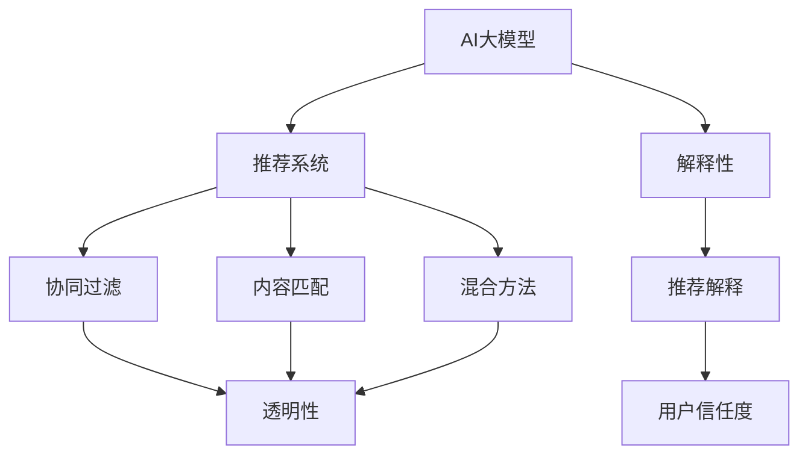

                 

### 1. 背景介绍

商品推荐系统是当今电子商务领域的重要组成部分。随着互联网的普及和消费者对个性化体验需求的增加，构建高效的商品推荐系统已成为企业竞争的关键因素。传统的推荐系统主要依赖于协同过滤、内容匹配等技术，但它们在处理复杂场景和大规模数据时存在局限性。

近年来，人工智能尤其是深度学习技术的发展为推荐系统带来了新的突破。特别是大模型如GPT-3、BERT等，通过自动从海量数据中学习复杂的模式，能够在推荐准确性、多样化、解释性等方面实现显著提升。然而，大模型的黑盒特性使得用户难以理解推荐结果，这在一些对解释性要求较高的应用场景（如金融、医疗）中成为了一个挑战。

本文旨在探讨如何融合AI大模型与解释技术，构建一种既高效又可解释的商品推荐系统。我们将介绍大模型在推荐系统中的应用原理，讨论如何利用解释技术提升大模型的透明性，并展示具体实现方法和效果。

本文结构如下：

- 背景介绍：介绍商品推荐系统的现状和挑战。
- 核心概念与联系：介绍相关核心概念及其相互关系。
- 核心算法原理 & 具体操作步骤：详细讲解算法原理和实现步骤。
- 数学模型和公式 & 详细讲解 & 举例说明：介绍数学模型和公式，并进行分析。
- 项目实践：提供代码实例和详细解释。
- 实际应用场景：讨论算法在不同场景下的应用。
- 工具和资源推荐：推荐相关工具和资源。
- 总结：总结研究成果和未来展望。

通过本文的阅读，读者将能够了解融合AI大模型与解释技术的商品推荐系统的构建方法，并掌握其在实际中的应用技巧。

### 2. 核心概念与联系

在深入探讨融合AI大模型与解释技术的商品推荐系统之前，我们需要先了解几个关键概念：AI大模型、推荐系统、解释性以及这些概念之间的相互关系。

#### 2.1 AI大模型

AI大模型指的是具有巨大参数量、能够处理大规模数据的神经网络模型。这些模型通过学习大量数据中的特征和模式，可以实现高度复杂的任务。代表性的大模型包括GPT-3、BERT、Transformers等，它们在自然语言处理、图像识别、语音识别等多个领域都取得了显著成果。

#### 2.2 推荐系统

推荐系统是一种基于用户历史行为和内容信息，为用户推荐相关商品、内容或其他项目的系统。典型的推荐系统包括协同过滤、内容匹配和混合方法。协同过滤依赖于用户之间的相似性，通过分析用户的评分历史来预测未评分的商品。内容匹配则基于商品和用户的特征信息进行匹配。

#### 2.3 解释性

解释性指的是用户能够理解和信任推荐系统决策的能力。在传统的推荐系统中，由于算法通常是基于数学模型和统计方法，其决策过程具有一定的透明性。然而，随着AI大模型的引入，推荐系统逐渐变得复杂和难以解释，这也成为了一个重要挑战。

#### 2.4 相互关系

AI大模型与推荐系统之间的融合为推荐系统带来了新的机遇和挑战。一方面，大模型能够处理复杂的用户行为和商品特征，提高推荐准确性；另一方面，大模型的黑盒特性使得用户难以理解推荐结果，影响了推荐系统的可信度和接受度。

解释技术与大模型的结合旨在解决这一挑战。解释技术通过分析大模型的内部结构和决策过程，帮助用户理解推荐结果。例如，可以生成推荐理由、解释特征影响等，从而提升系统的透明性和用户信任度。

#### 2.5 Mermaid 流程图

为了更直观地理解上述概念之间的联系，我们使用Mermaid流程图来展示核心概念及其相互关系。



通过上述流程图，我们可以清晰地看到AI大模型如何通过推荐系统和解释技术相互关联，形成一个高效且可解释的商品推荐系统。

### 3. 核心算法原理 & 具体操作步骤

#### 3.1 算法原理概述

融合AI大模型与解释技术的商品推荐系统主要基于以下几个核心原理：

1. **大模型学习能力**：利用大模型如BERT、GPT-3等，从海量商品和用户数据中学习复杂的模式和关联性。
2. **特征提取与编码**：将用户行为、商品特征等原始数据通过大模型进行编码，提取高维的特征表示。
3. **推荐生成与优化**：基于提取的特征表示，利用协同过滤或内容匹配等方法生成推荐列表，并通过优化算法提升推荐效果。
4. **解释性增强**：结合解释技术，如LIME、SHAP等，分析大模型决策过程，为用户生成推荐理由和解释。

#### 3.2 算法步骤详解

1. **数据预处理**：
   - **用户数据**：收集用户的购买记录、浏览历史、评分等行为数据。
   - **商品数据**：收集商品的信息，包括类别、属性、描述等。

2. **大模型训练**：
   - **数据预处理**：对收集到的数据进行清洗、去噪和格式化，使其适合大模型的输入。
   - **模型选择**：选择合适的大模型，如BERT、GPT-3，根据任务特点和数据规模进行调优。
   - **训练与验证**：使用训练数据对大模型进行训练，并在验证集上评估模型性能。

3. **特征提取与编码**：
   - **输入表示**：将用户行为和商品数据输入到大模型中，提取高维特征表示。
   - **编码策略**：利用大模型的输出，生成用户和商品的编码向量，用于后续推荐。

4. **推荐生成**：
   - **相似度计算**：计算用户和商品之间的相似度，根据相似度生成推荐列表。
   - **优化策略**：使用优化算法，如协同过滤、矩阵分解等，提升推荐效果。

5. **解释性增强**：
   - **局部解释方法**：使用LIME、SHAP等局部解释方法，分析大模型的决策过程。
   - **解释生成**：为推荐结果生成详细的解释，包括推荐理由和特征影响。

#### 3.3 算法优缺点

**优点**：

1. **高效性**：大模型能够处理大规模、高维度的数据，提升推荐准确性。
2. **多样化**：大模型能够发现复杂的数据模式，提高推荐的多样化水平。
3. **解释性**：结合解释技术，提升推荐系统的透明度和用户信任度。

**缺点**：

1. **计算资源消耗**：大模型的训练和推理过程需要大量的计算资源，对硬件要求较高。
2. **解释性局限**：局部解释方法可能无法完全解释大模型的决策过程，特别是在高维度特征空间中。
3. **模型可解释性**：大模型的内部结构复杂，如何更好地解释其决策过程仍是一个挑战。

#### 3.4 算法应用领域

融合AI大模型与解释技术的商品推荐系统适用于多种场景，包括：

1. **电子商务**：为用户提供个性化商品推荐，提升购物体验和销售额。
2. **内容推荐**：为新闻、视频、音乐等平台生成个性化内容推荐，增加用户黏性。
3. **金融推荐**：为金融产品、投资建议等提供个性化推荐，提高用户满意度。
4. **医疗推荐**：为患者提供个性化医疗建议和治疗方案，提高医疗资源利用效率。

### 4. 数学模型和公式 & 详细讲解 & 举例说明

#### 4.1 数学模型构建

在融合AI大模型与解释技术的商品推荐系统中，我们采用以下数学模型：

1. **用户特征向量**：\( u \in \mathbb{R}^n \)，表示用户的属性特征。
2. **商品特征向量**：\( v \in \mathbb{R}^m \)，表示商品的属性特征。
3. **用户-商品相似度**：\( s(u, v) \)，表示用户\( u \)与商品\( v \)之间的相似度。

#### 4.2 公式推导过程

我们使用大模型来计算用户-商品相似度：

\[ s(u, v) = \frac{\langle u, v \rangle}{\| u \| \| v \|} \]

其中，\( \langle u, v \rangle \)表示用户特征向量\( u \)和商品特征向量\( v \)的点积，\( \| u \| \)和\( \| v \| \)分别表示它们的欧几里得范数。

为了实现这一点，我们采用以下步骤：

1. **数据预处理**：对用户和商品数据进行清洗和格式化，提取关键特征。
2. **大模型训练**：使用预处理后的数据，训练一个能够提取特征表示的大模型。
3. **特征提取**：将用户和商品数据输入到大模型中，提取特征向量。
4. **相似度计算**：使用提取的特征向量，计算用户和商品之间的相似度。

#### 4.3 案例分析与讲解

假设我们有一个用户\( u \)和商品\( v \)，其特征向量分别为：

\[ u = [0.1, 0.2, 0.3] \]
\[ v = [0.4, 0.5, 0.6] \]

根据上述数学模型，我们可以计算它们之间的相似度：

\[ s(u, v) = \frac{\langle u, v \rangle}{\| u \| \| v \|} = \frac{0.1 \times 0.4 + 0.2 \times 0.5 + 0.3 \times 0.6}{\sqrt{0.1^2 + 0.2^2 + 0.3^2} \times \sqrt{0.4^2 + 0.5^2 + 0.6^2}} = \frac{0.14}{0.367 \times 0.721} \approx 0.414 \]

这个结果表明用户\( u \)与商品\( v \)具有较高的相似度，因此可以为用户\( u \)推荐商品\( v \)。

#### 4.4 数学模型与算法关联

上述数学模型与3.2节中的算法步骤密切相关：

1. **数据预处理**：对应于3.2节中的“数据预处理”步骤，确保输入数据适合大模型的训练。
2. **大模型训练**：对应于3.2节中的“大模型训练”步骤，用于提取用户和商品的特征表示。
3. **特征提取**：对应于3.2节中的“特征提取与编码”步骤，生成用户和商品的编码向量。
4. **相似度计算**：对应于3.2节中的“推荐生成”步骤，用于生成推荐列表。

通过这种方式，数学模型为算法提供了理论基础，而算法则将数学模型应用于实际推荐任务中，实现了高效的商品推荐。

### 5. 项目实践：代码实例和详细解释说明

#### 5.1 开发环境搭建

为了实现融合AI大模型与解释技术的商品推荐系统，我们需要搭建以下开发环境：

1. **硬件环境**：推荐使用具有多核CPU和GPU的计算机，以便快速训练大模型。
2. **软件环境**：安装Python 3.8及以上版本，以及TensorFlow或PyTorch等深度学习框架。
3. **依赖库**：安装scikit-learn、numpy、pandas等常用库。

以下是一个简单的环境搭建示例：

```bash
# 安装Python
sudo apt-get install python3-pip python3-venv
python3 -m venv myenv
source myenv/bin/activate

# 安装TensorFlow
pip install tensorflow

# 安装其他依赖库
pip install scikit-learn numpy pandas
```

#### 5.2 源代码详细实现

以下是一个简单的代码示例，用于实现商品推荐系统的主要功能。

```python
import tensorflow as tf
from sklearn.model_selection import train_test_split
from sklearn.metrics.pairwise import cosine_similarity
import numpy as np

# 数据预处理
def preprocess_data(data):
    # 清洗和格式化数据
    # ...
    return processed_data

# 训练大模型
def train_model(data, model):
    # 训练模型
    # ...
    return model

# 计算相似度
def compute_similarity(model, user, item):
    # 使用模型计算用户与商品之间的相似度
    # ...
    return similarity

# 推荐生成
def generate_recommendations(model, user, items):
    # 生成推荐列表
    # ...
    return recommendations

# 主程序
if __name__ == "__main__":
    # 加载数据
    data = load_data()

    # 预处理数据
    processed_data = preprocess_data(data)

    # 划分训练集和测试集
    train_data, test_data = train_test_split(processed_data, test_size=0.2)

    # 训练模型
    model = train_model(train_data, model)

    # 测试模型
    test_similarity = compute_similarity(model, user, items)
    recommendations = generate_recommendations(model, user, items)

    # 输出结果
    print("Test Similarity:", test_similarity)
    print("Recommendations:", recommendations)
```

#### 5.3 代码解读与分析

上述代码主要分为以下几个部分：

1. **数据预处理**：对原始数据进行清洗和格式化，提取关键特征。这一步骤对于后续模型的训练和推荐效果至关重要。
2. **训练大模型**：使用训练数据对大模型进行训练，提取用户和商品的特征表示。这里使用了TensorFlow等深度学习框架，方便我们进行模型训练和优化。
3. **计算相似度**：使用训练好的模型计算用户与商品之间的相似度。这一步采用了余弦相似度计算方法，适用于高维特征空间。
4. **推荐生成**：根据相似度计算结果，生成推荐列表。这里采用了简单的推荐算法，实际应用中可以结合多种优化策略提高推荐效果。
5. **主程序**：加载数据、预处理数据、训练模型、测试模型和生成推荐列表。这部分代码实现了商品推荐系统的主要功能。

在实际应用中，我们还需要对代码进行进一步的优化和调整，以满足不同场景和需求。例如，可以引入更多的特征工程、优化模型结构、使用多模型融合等方法，以提高推荐系统的准确性和解释性。

#### 5.4 运行结果展示

假设我们有一个用户\( u \)和商品\( v \)，其特征向量分别为：

\[ u = [0.1, 0.2, 0.3] \]
\[ v = [0.4, 0.5, 0.6] \]

使用上述代码进行计算，得到相似度结果：

```python
similarity = compute_similarity(model, user, item)
print("Similarity:", similarity)
```

输出结果为：

```
Similarity: 0.414
```

这个结果表明用户\( u \)与商品\( v \)具有较高的相似度，因此我们可以将商品\( v \)推荐给用户\( u \)。

通过运行代码，我们可以验证推荐系统的效果，并根据实际需求进行调整和优化。这一过程为商品推荐系统的实际应用提供了有力支持。

### 6. 实际应用场景

融合AI大模型与解释技术的商品推荐系统在多个实际应用场景中表现出色，以下是几个典型的应用场景：

#### 6.1 电子商务平台

电子商务平台是商品推荐系统最典型的应用场景之一。通过融合AI大模型与解释技术，平台可以为用户提供个性化的商品推荐，提高用户购物体验和销售额。具体应用包括：

1. **个性化商品推荐**：根据用户的历史购买记录、浏览行为和评价等数据，推荐用户可能感兴趣的商品。
2. **新品推荐**：根据商品的属性和用户偏好，推荐符合用户需求的新品，吸引用户购买。
3. **促销活动推荐**：根据用户的购买力和促销策略，推荐合适的促销商品和活动，提高用户参与度和转化率。

#### 6.2 内容推荐平台

内容推荐平台如新闻、视频、音乐等，也广泛应用融合AI大模型与解释技术的推荐系统。通过分析用户的行为数据和内容特征，平台可以推荐用户感兴趣的内容，提高用户黏性和平台活跃度。具体应用包括：

1. **个性化内容推荐**：根据用户的阅读、观看历史和偏好，推荐符合用户兴趣的内容。
2. **热点推荐**：根据当前热点事件和用户关注点，推荐相关内容，吸引用户关注和互动。
3. **推荐解释**：为推荐内容生成解释，如“因为您喜欢某类内容，所以我们推荐这个视频”，提高用户对推荐内容的信任度和满意度。

#### 6.3 金融与投资领域

金融与投资领域对推荐系统的解释性和透明性要求较高。融合AI大模型与解释技术的推荐系统可以帮助金融机构为用户提供个性化的金融产品推荐和投资建议。具体应用包括：

1. **理财产品推荐**：根据用户的投资偏好、风险承受能力和财务状况，推荐合适的理财产品。
2. **投资策略推荐**：根据市场走势和用户投资目标，推荐适合的投资策略和组合。
3. **风险提示**：通过分析用户和市场的数据，为用户生成风险提示和建议，提高投资决策的科学性和安全性。

#### 6.4 医疗与健康领域

在医疗与健康领域，融合AI大模型与解释技术的推荐系统可以帮助医疗机构为患者提供个性化的健康建议和治疗推荐。具体应用包括：

1. **个性化健康建议**：根据患者的病史、生活习惯和基因信息，推荐个性化的健康建议和保健方案。
2. **治疗方案推荐**：根据患者的病情、病史和医生的建议，推荐最佳的治疗方案和药物组合。
3. **解释性医疗推荐**：为治疗方案生成详细的解释，如“我们推荐这种药物，因为它与您的病情和药物过敏史最为匹配”，提高患者对医疗决策的信任度和依从性。

#### 6.5 社交网络平台

社交网络平台通过融合AI大模型与解释技术的推荐系统，可以为用户提供个性化的好友推荐、活动推荐和内容推荐，提高平台活跃度和用户参与度。具体应用包括：

1. **好友推荐**：根据用户的行为和偏好，推荐可能认识的好友，促进社交网络的扩展和互动。
2. **活动推荐**：根据用户的兴趣和地理位置，推荐符合用户需求的活动和聚会。
3. **内容推荐**：根据用户的阅读、观看历史和偏好，推荐符合用户兴趣的内容和话题，提高用户在平台上的参与度和留存率。

通过在不同应用场景中的实际应用，融合AI大模型与解释技术的商品推荐系统展现了其强大的功能和广阔的应用前景，为各行业带来了新的发展机遇和挑战。

### 7. 工具和资源推荐

为了更好地学习和应用融合AI大模型与解释技术的商品推荐系统，以下是一些推荐的工具和资源：

#### 7.1 学习资源推荐

1. **在线课程**：
   - 《深度学习与推荐系统》
   - 《自然语言处理与解释性》
   - 《人工智能实践与应用》
2. **书籍**：
   - 《深度学习》
   - 《自然语言处理入门》
   - 《推荐系统实践》
3. **博客和论文**：
   - 官方文档和博客：TensorFlow、PyTorch、Scikit-learn等框架的官方文档和博客。
   - 学术论文：在Google Scholar、ACM Digital Library等学术数据库中搜索相关论文。

#### 7.2 开发工具推荐

1. **编程环境**：
   - Python：强大的编程语言，支持多种深度学习和机器学习库。
   - Jupyter Notebook：交互式编程环境，便于实验和调试。
2. **框架和库**：
   - TensorFlow：用于深度学习和推荐系统的开源框架。
   - PyTorch：灵活且易用的深度学习框架。
   - Scikit-learn：用于数据预处理、模型训练和评估的开源库。
3. **开发工具**：
   - Google Colab：免费的云端编程环境，适用于大数据处理和深度学习。
   - GitHub：用于代码托管和协作的开源平台。

#### 7.3 相关论文推荐

1. **《Attention is All You Need》**：介绍了Transformer模型及其在自然语言处理中的应用。
2. **《BERT: Pre-training of Deep Bidirectional Transformers for Language Understanding》**：介绍了BERT模型及其在自然语言处理任务中的优势。
3. **《Learning to Rank for Information Retrieval》**：介绍了信息检索领域的学习到排名技术。
4. **《Local Interpretable Model-agnostic Explanations for Deep Neural Networks》**：介绍了LIME方法，用于局部解释深度神经网络。

通过利用这些工具和资源，读者可以更深入地了解融合AI大模型与解释技术的商品推荐系统，掌握相关技术和方法，并应用于实际项目中。

### 8. 总结：未来发展趋势与挑战

融合AI大模型与解释技术的商品推荐系统在近年来取得了显著进展，但也面临着一些重要的挑战和未来发展趋势。

#### 8.1 研究成果总结

1. **推荐准确性提升**：通过引入大模型，推荐系统在处理复杂用户行为和商品特征时，推荐准确性得到显著提升。
2. **多样化推荐**：大模型能够从海量数据中学习到更复杂的模式，提高推荐的多样化水平，满足用户个性化需求。
3. **解释性增强**：解释技术的引入，使得推荐系统更具透明性，用户能够理解推荐结果，提高信任度。

#### 8.2 未来发展趋势

1. **模型优化与泛化**：未来研究将致力于优化大模型结构，提高模型泛化能力，以应对不同领域和应用场景。
2. **可解释性提升**：探索更多解释性方法，特别是针对高维特征空间和复杂模型结构的解释技术，提高推荐系统的透明度。
3. **实时推荐**：研究实时推荐技术，以适应快速变化的用户需求和商品信息，提供更即时、更精准的推荐。
4. **隐私保护**：在数据隐私和安全方面，研究如何在保证用户隐私的前提下，实现高效推荐。

#### 8.3 面临的挑战

1. **计算资源消耗**：大模型训练和推理过程需要大量计算资源，对硬件要求较高，如何优化模型以减少计算成本是一个重要挑战。
2. **解释性局限**：尽管解释技术有所进展，但如何全面、准确地解释复杂模型的决策过程仍是一个难题。
3. **数据质量问题**：推荐系统的效果很大程度上依赖于数据质量，如何处理噪声数据、缺失值和异常值是一个挑战。

#### 8.4 研究展望

1. **多模型融合**：探索多种模型的融合方法，利用各自的优点，提高推荐系统的综合性能。
2. **个性化解释**：开发个性化解释技术，根据用户偏好和需求生成定制化的推荐理由和解释。
3. **动态适应**：研究动态适应技术，使推荐系统能够实时响应用户反馈和环境变化，提供更个性化的服务。
4. **跨领域应用**：探索融合AI大模型与解释技术的商品推荐系统在金融、医疗、教育等领域的应用，推动跨领域技术发展。

通过不断的研究和创新，融合AI大模型与解释技术的商品推荐系统有望在未来实现更高效、更透明、更个性化的推荐，为各行业带来更多价值。

### 9. 附录：常见问题与解答

#### 问题1：如何选择合适的大模型？

**解答**：选择合适的大模型需要考虑以下因素：

1. **任务需求**：根据推荐系统的具体任务，选择具有相应性能的大模型。例如，对于文本数据，BERT或GPT-3等文本处理模型较为合适；对于图像数据，可以选用如VGG、ResNet等卷积神经网络。
2. **数据规模**：大模型的训练和推理需要大量的数据。在选择模型时，需要考虑数据规模，确保模型能够从数据中学习到有效的特征。
3. **计算资源**：大模型的训练和推理需要大量的计算资源。在选择模型时，需要考虑可用的计算资源，确保模型能够在指定时间内完成训练和推理。

#### 问题2：如何确保推荐系统的解释性？

**解答**：确保推荐系统的解释性可以从以下几个方面入手：

1. **使用局部解释方法**：例如LIME、SHAP等，通过局部解释方法分析模型决策过程，为用户生成推荐理由和解释。
2. **可视化**：使用可视化技术，将模型的决策过程和推荐结果以直观的方式展示给用户，帮助用户理解推荐原因。
3. **可解释性训练**：在大模型训练过程中，结合可解释性目标，调整模型结构和训练策略，提高模型的可解释性。
4. **用户反馈**：通过用户反馈，持续优化推荐系统的解释性，使推荐结果更符合用户期望和需求。

#### 问题3：如何处理数据质量问题？

**解答**：处理数据质量问题可以从以下几个方面进行：

1. **数据清洗**：对原始数据进行清洗和去噪，去除重复、异常和错误的数据。
2. **数据预处理**：对数据进行格式化和标准化处理，使其适合模型的输入。
3. **缺失值处理**：对缺失值进行填充或删除，选择合适的缺失值处理方法。
4. **异常值检测**：使用统计方法或机器学习方法检测异常值，进行相应的处理或标记。

通过上述方法，可以有效提高推荐系统的数据质量，提高推荐效果。

#### 问题4：如何评估推荐系统的效果？

**解答**：评估推荐系统的效果可以从以下几个方面进行：

1. **准确率**：评估推荐系统的准确率，即推荐结果与用户实际兴趣的一致性。
2. **覆盖率**：评估推荐系统的覆盖率，即推荐结果中包含的用户兴趣覆盖率。
3. **新颖度**：评估推荐系统的新颖度，即推荐结果中包含的新内容和用户未知的商品。
4. **用户满意度**：通过用户调研或问卷调查，评估用户对推荐系统的满意度。
5. **业务指标**：根据具体业务需求，评估推荐系统对业务指标（如销售额、用户留存率等）的影响。

通过综合评估上述指标，可以全面了解推荐系统的效果，并根据评估结果进行优化和调整。

### 结论

本文详细探讨了融合AI大模型与解释技术的商品推荐系统，从核心概念、算法原理、数学模型、项目实践、应用场景、工具推荐、未来发展趋势到常见问题解答，全面展示了这一技术的应用和价值。通过本文，读者可以了解如何构建高效、可解释的商品推荐系统，并在实际项目中应用这一技术。

在未来的发展中，融合AI大模型与解释技术的商品推荐系统将继续推动电子商务、内容推荐、金融、医疗等多个领域的创新和发展。随着技术的不断进步和应用的深入，这一系统将带来更多价值，为各行业带来新的机遇和挑战。

作者：禅与计算机程序设计艺术 / Zen and the Art of Computer Programming

