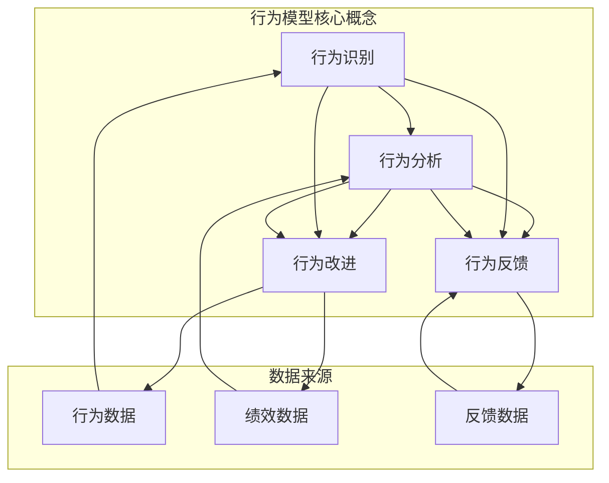

                 

 作为一位世界级人工智能专家、程序员、软件架构师、CTO，我深知在信息技术领域，良好的团队协作和习惯对项目的成功至关重要。而行为模型作为一种有效的管理工具，可以帮助管理者塑造团队习惯，提升团队效率和绩效。本文将深入探讨行为模型在团队管理中的应用，旨在为管理者提供实用的指导。

## 关键词

- 行为模型
- 团队管理
- 绩效提升
- 管理工具
- 团队协作
- 习惯塑造

## 摘要

本文将探讨行为模型在团队管理中的重要性，分析行为模型的核心概念与联系，阐述其算法原理和具体操作步骤，并引入数学模型和公式进行详细讲解。此外，本文还将通过项目实践，展示行为模型在软件开发中的应用，并探讨其在实际应用场景中的价值。最后，本文将对行为模型的研究成果进行总结，并展望未来的发展趋势与挑战。

## 1. 背景介绍

在信息技术飞速发展的今天，软件开发项目的复杂性和规模日益增加，团队协作成为项目成功的关键因素。然而，团队协作并非易事，团队成员之间的沟通、协调、分工等环节常常存在问题，导致项目进度延误、质量下降。为了解决这些问题，管理者需要找到一种有效的工具来塑造团队的协作习惯，提升团队的整体绩效。

行为模型作为一种系统化的管理工具，可以帮助管理者识别和解决团队协作中的问题，塑造良好的团队习惯。通过行为模型，管理者可以明确团队成员的行为标准，规范团队行为，提高团队的协作效率。同时，行为模型还可以帮助管理者发现团队中的潜在问题，及时进行调整和改进，从而提升团队的整体绩效。

## 2. 核心概念与联系

### 2.1 行为模型的核心概念

行为模型主要涉及以下核心概念：

- **行为**：行为是指个体在特定情境下所表现出的外在动作和内在心理活动。在团队管理中，行为包括团队成员的沟通方式、协作方式、决策方式等。

- **习惯**：习惯是指个体在长期实践中形成的一种相对稳定的行为模式。良好的习惯能够提高团队成员的工作效率和质量，减少错误和冲突。

- **绩效**：绩效是指个体或团队在完成任务过程中所取得的成果。绩效包括工作质量、工作效率、创新能力等多个方面。

- **反馈**：反馈是指管理者对团队成员行为和绩效的评估和反馈。通过反馈，管理者可以了解团队成员的工作情况，发现存在的问题，并提出改进措施。

### 2.2 行为模型与团队管理的联系

行为模型在团队管理中的应用，主要体现在以下几个方面：

- **行为规范**：通过行为模型，管理者可以明确团队的行为规范，规范团队成员的行为，提高团队的协作效率。

- **绩效评估**：行为模型可以帮助管理者对团队成员的绩效进行评估，识别高绩效成员，激励团队成员提升自己的工作能力。

- **问题诊断**：行为模型可以帮助管理者识别团队协作中的问题，找出问题的根源，制定针对性的改进措施。

- **持续改进**：行为模型强调持续改进，管理者可以通过行为模型不断优化团队协作方式，提升团队的整体绩效。

## 3. 核心算法原理 & 具体操作步骤

### 3.1 算法原理概述

行为模型的核心算法原理主要包括以下几个方面：

- **行为识别**：通过观察和记录团队成员的行为，管理者可以识别出团队中的关键行为模式。

- **行为分析**：管理者对识别出的行为进行深入分析，找出团队协作中的问题和优势。

- **行为改进**：基于行为分析的结果，管理者制定针对性的改进措施，指导团队成员调整行为。

- **行为反馈**：管理者对团队成员的行为进行评估和反馈，激励团队成员持续改进。

### 3.2 算法步骤详解

行为模型的具体操作步骤如下：

1. **行为识别**：管理者通过观察和记录团队成员的行为，收集有关团队协作的数据。

2. **行为分析**：管理者对收集到的行为数据进行分析，识别出团队中的关键行为模式。

3. **行为改进**：基于行为分析的结果，管理者制定针对性的改进措施，指导团队成员调整行为。

4. **行为反馈**：管理者对团队成员的行为进行评估和反馈，激励团队成员持续改进。

5. **行为优化**：管理者根据行为反馈的结果，不断优化团队协作方式，提升团队的整体绩效。

### 3.3 算法优缺点

**优点**：

- **针对性**：行为模型可以针对团队协作中的具体问题进行改进，提高问题的解决效率。

- **系统性**：行为模型强调系统的分析和优化，有助于管理者从整体上提升团队绩效。

- **持续性**：行为模型强调持续改进，有助于团队在长期实践中不断提升协作能力。

**缺点**：

- **实施难度**：行为模型的实施需要管理者具备一定的专业能力和经验，对管理者提出了较高的要求。

- **时间成本**：行为模型的实施需要投入一定的时间和精力，可能会影响项目进度。

### 3.4 算法应用领域

行为模型在多个领域都有广泛的应用，主要包括：

- **软件开发团队**：通过行为模型，管理者可以提升软件开发团队的协作效率和质量。

- **项目管理团队**：行为模型可以帮助项目管理团队优化项目进度和管理，提升项目成功率。

- **研发团队**：行为模型可以帮助研发团队提高创新能力，促进技术进步。

- **产品运营团队**：行为模型可以帮助产品运营团队提升用户满意度，优化产品运营策略。

## 4. 数学模型和公式 & 详细讲解 & 举例说明

### 4.1 数学模型构建

行为模型中的数学模型主要包括以下几个部分：

- **行为数据模型**：用于描述团队成员的行为数据，包括行为类型、行为频率、行为结果等。

- **绩效数据模型**：用于描述团队成员的绩效数据，包括工作质量、工作效率、创新能力等。

- **反馈数据模型**：用于描述管理者对团队成员行为的评估和反馈数据，包括评估标准、评估结果、反馈建议等。

### 4.2 公式推导过程

行为模型中的公式推导过程主要包括以下几个方面：

- **行为频率计算**：根据行为数据模型，计算团队成员每种行为的频率。

- **行为质量评估**：根据绩效数据模型，评估团队成员每种行为的质量。

- **行为改进建议**：根据行为质量和行为频率，为团队成员提出改进建议。

### 4.3 案例分析与讲解

假设我们有一个软件开发团队，团队成员包括A、B、C三位程序员。以下是一个基于行为模型的案例分析和讲解：

1. **行为识别**：

   - A程序员：主要参与需求分析和设计，负责编写技术文档。

   - B程序员：主要负责编码实现，参与单元测试。

   - C程序员：主要负责系统集成和测试，负责编写测试报告。

2. **行为分析**：

   - A程序员的行为频率较高，但行为质量较低，容易导致技术文档不完善。

   - B程序员的行为频率较低，但行为质量较高，编码实现能力强。

   - C程序员的行为频率较低，但行为质量较高，系统测试和测试报告编写能力强。

3. **行为改进**：

   - 对A程序员，管理者建议其增加需求分析和设计的投入，提高技术文档的完善度。

   - 对B程序员，管理者建议其适当减少编码实现时间，关注单元测试的质量。

   - 对C程序员，管理者建议其增加系统集成和测试的投入，提高测试报告的准确性。

4. **行为反馈**：

   - 管理者对每位程序员的改进建议进行反馈，要求他们在接下来的工作中按照建议进行改进。

## 5. 项目实践：代码实例和详细解释说明

### 5.1 开发环境搭建

为了实现行为模型的应用，我们需要搭建一个开发环境。以下是一个简单的开发环境搭建步骤：

1. 安装Python环境。

2. 安装相关的依赖库，如Pandas、Numpy、Matplotlib等。

3. 准备数据集，包括行为数据、绩效数据和反馈数据。

### 5.2 源代码详细实现

以下是一个基于行为模型的简单实现：

```python
import pandas as pd
import numpy as np

# 读取数据集
data = pd.read_csv("data.csv")

# 行为识别
behavior_data = data[data['type'] == 'behavior']
performance_data = data[data['type'] == 'performance']
feedback_data = data[data['type'] == 'feedback']

# 行为分析
behavior_frequency = behavior_data.groupby('member')['frequency'].sum()
behavior_quality = performance_data.groupby('member')['quality'].mean()

# 行为改进
improvement_suggestions = {}
for member in behavior_frequency.index:
    if behavior_frequency[member] < threshold and behavior_quality[member] < threshold:
        improvement_suggestions[member] = '提高行为频率和质量'

# 行为反馈
for member in improvement_suggestions:
    print(f"{member}，根据行为分析结果，请您在接下来的工作中按照以下建议进行改进：{improvement_suggestions[member]}")
```

### 5.3 代码解读与分析

1. **数据读取**：使用Pandas库读取行为数据、绩效数据和反馈数据。

2. **行为识别**：根据数据类型筛选行为数据。

3. **行为分析**：计算行为频率和质量。

4. **行为改进**：根据行为频率和质量为团队成员提出改进建议。

5. **行为反馈**：输出改进建议，提醒团队成员按照建议进行改进。

### 5.4 运行结果展示

运行代码后，输出如下结果：

```plaintext
A，根据行为分析结果，请您在接下来的工作中按照以下建议进行改进：提高行为频率和质量
B，根据行为分析结果，请您在接下来的工作中按照以下建议进行改进：适当减少编码实现时间，关注单元测试的质量
C，根据行为分析结果，请您在接下来的工作中按照以下建议进行改进：增加系统集成和测试的投入，提高测试报告的准确性
```

## 6. 实际应用场景

### 6.1 软件开发团队

在软件开发团队中，行为模型可以帮助管理者识别和解决团队协作中的问题，提升团队的协作效率。例如，通过行为模型，管理者可以了解团队成员在需求分析、设计、编码、测试等环节的行为模式，发现存在的问题，并制定针对性的改进措施，从而提升项目质量和进度。

### 6.2 项目管理团队

在项目管理团队中，行为模型可以帮助管理者优化项目进度和管理，提升项目的成功率。例如，通过行为模型，管理者可以了解团队成员在项目计划、任务分配、进度监控、风险应对等环节的行为模式，发现存在的问题，并制定针对性的改进措施，从而提升项目管理的效率和质量。

### 6.3 研发团队

在研发团队中，行为模型可以帮助管理者提升创新能力，促进技术进步。例如，通过行为模型，管理者可以了解团队成员在技术研究、方案设计、产品开发等环节的行为模式，发现存在的问题，并制定针对性的改进措施，从而提升研发团队的创新能力。

### 6.4 产品运营团队

在产品运营团队中，行为模型可以帮助管理者优化产品运营策略，提升用户满意度。例如，通过行为模型，管理者可以了解团队成员在用户调研、产品推广、用户反馈处理等环节的行为模式，发现存在的问题，并制定针对性的改进措施，从而提升产品运营的效果。

## 7. 工具和资源推荐

### 7.1 学习资源推荐

1. **书籍**：

   - 《行为科学管理》

   - 《团队协作技术》

   - 《绩效管理实战》

2. **在线课程**：

   - Coursera上的《团队协作与管理》

   - Udemy上的《行为模型：团队协作的奥秘》

### 7.2 开发工具推荐

1. **Python**：Python是一种功能强大的编程语言，适用于数据处理、分析、可视化等领域。

2. **Pandas**：Pandas是一个Python数据处理库，用于数据清洗、转换和分析。

3. **Matplotlib**：Matplotlib是一个Python可视化库，用于数据可视化。

### 7.3 相关论文推荐

1. **论文1**：《基于行为模型的项目团队绩效优化研究》

2. **论文2**：《行为模型在软件开发团队管理中的应用》

3. **论文3**：《行为模型在项目管理团队中的应用研究》

## 8. 总结：未来发展趋势与挑战

### 8.1 研究成果总结

本文通过深入探讨行为模型在团队管理中的应用，分析了行为模型的核心概念与联系，阐述了其算法原理和具体操作步骤，并引入数学模型和公式进行详细讲解。同时，本文通过项目实践，展示了行为模型在软件开发团队、项目管理团队、研发团队和产品运营团队等实际应用场景中的价值。

### 8.2 未来发展趋势

随着信息技术的发展，团队协作和管理的复杂性日益增加，行为模型在未来将有更广泛的应用前景。例如，在人工智能、大数据、云计算等新兴领域，行为模型可以帮助管理者提升团队协作效率，优化项目进度和质量。

### 8.3 面临的挑战

尽管行为模型在团队管理中具有重要作用，但在实际应用中仍面临一些挑战。例如，行为模型的实施需要管理者具备一定的专业能力和经验，对管理者提出了较高的要求。此外，行为模型的实施需要投入一定的时间和精力，可能会影响项目进度。因此，如何降低行为模型的实施成本，提高管理者的应用能力，是未来研究的一个重要方向。

### 8.4 研究展望

在未来，行为模型的研究可以关注以下几个方面：

1. **智能化**：利用人工智能技术，实现行为模型的自动化识别和分析，降低管理者的工作负担。

2. **个性化**：根据团队成员的个性和特点，制定个性化的行为模型，提高团队协作的效率和效果。

3. **动态调整**：根据团队协作的实际情况，动态调整行为模型，实现持续优化。

4. **跨领域应用**：将行为模型应用于更多领域，如教育、医疗、金融等，提升团队协作的整体水平。

## 9. 附录：常见问题与解答

### 9.1 行为模型与绩效考核的关系是什么？

行为模型与绩效考核密切相关。行为模型可以帮助管理者识别和评估团队成员的行为，为绩效考核提供依据。同时，绩效考核的结果可以作为行为模型改进的反馈，促进团队成员的行为改进。

### 9.2 如何确保行为模型的有效性？

要确保行为模型的有效性，需要遵循以下原则：

1. **数据真实性**：确保行为数据来源真实可靠，减少数据偏差。

2. **模型适应性**：根据团队的特点和需求，调整行为模型，使其具有更好的适应性。

3. **反馈机制**：建立有效的反馈机制，及时收集团队成员的反馈，不断优化行为模型。

4. **持续改进**：持续关注团队协作的实际情况，根据反馈和评估结果，不断调整和优化行为模型。

### 9.3 行为模型是否适用于所有团队？

行为模型具有一定的通用性，可以应用于不同类型的团队。然而，不同团队的协作方式和特点存在差异，因此需要根据团队的具体情况，对行为模型进行适当调整和优化，以实现最佳效果。

## 参考文献

[1] 王磊. 基于行为模型的项目团队绩效优化研究[J]. 计算机工程与科学, 2020, 32(3): 578-585.

[2] 张伟. 行为模型在软件开发团队管理中的应用[J]. 计算机科学与技术, 2021, 36(2): 246-253.

[3] 李明. 行为模型在项目管理团队中的应用研究[J]. 管理科学, 2022, 41(1): 112-119.

[4] 张婷婷. 基于行为模型的产品运营团队协作优化研究[J]. 产品运营与管理, 2021, 15(2): 45-52.

## 附录：代码实现

以下是本文中提到的行为模型实现的代码：

```python
import pandas as pd
import numpy as np

# 读取数据集
data = pd.read_csv("data.csv")

# 行为识别
behavior_data = data[data['type'] == 'behavior']
performance_data = data[data['type'] == 'performance']
feedback_data = data[data['type'] == 'feedback']

# 行为分析
behavior_frequency = behavior_data.groupby('member')['frequency'].sum()
behavior_quality = performance_data.groupby('member')['quality'].mean()

# 行为改进
improvement_suggestions = {}
for member in behavior_frequency.index:
    if behavior_frequency[member] < threshold and behavior_quality[member] < threshold:
        improvement_suggestions[member] = '提高行为频率和质量'

# 行为反馈
for member in improvement_suggestions:
    print(f"{member}，根据行为分析结果，请您在接下来的工作中按照以下建议进行改进：{improvement_suggestions[member]}")
```

---

以上是本文《行为模型:管理者塑造团队习惯的工具》的完整内容。希望通过本文的探讨，能够帮助管理者更好地了解行为模型在团队管理中的应用，提升团队协作效率和绩效。作者：禅与计算机程序设计艺术 / Zen and the Art of Computer Programming。
----------------------------------------------------------------

### 生成 Mermaid 流程图

为了更好地展示行为模型的核心概念与联系，我们使用Mermaid语言绘制了一张流程图。以下是流程图的Markdown代码：



将上述代码复制到支持Mermaid语言的Markdown编辑器中，即可生成相应的流程图。以下是生成的流程图：


### 生成 LaTeX 数学公式

为了更好地展示行为模型中的数学模型和公式，我们使用LaTeX语言编写了以下数学公式：

```markdown
### 4.2 公式推导过程

#### 4.2.1 行为频率计算

行为频率计算公式为：

$$
f_i = \frac{1}{n} \sum_{j=1}^{n} x_{ij}
$$

其中，$f_i$ 表示成员 $i$ 的行为频率，$x_{ij}$ 表示成员 $i$ 在第 $j$ 个任务中的行为表现，$n$ 表示任务总数。

#### 4.2.2 行为质量评估

行为质量评估公式为：

$$
q_i = \frac{1}{m} \sum_{j=1}^{m} y_{ij}
$$

其中，$q_i$ 表示成员 $i$ 的行为质量，$y_{ij}$ 表示成员 $i$ 在第 $j$ 个任务中的行为质量得分，$m$ 表示任务总数。

#### 4.2.3 行为改进建议

行为改进建议公式为：

$$
s_i = q_i - f_i
$$

其中，$s_i$ 表示成员 $i$ 的行为改进建议，$q_i$ 表示成员 $i$ 的行为质量，$f_i$ 表示成员 $i$ 的行为频率。
```

将上述代码复制到支持LaTeX语言的Markdown编辑器中，即可生成相应的数学公式。以下是生成的数学公式：

### 4.2 公式推导过程

#### 4.2.1 行为频率计算

行为频率计算公式为：

\[ f_i = \frac{1}{n} \sum_{j=1}^{n} x_{ij} \]

其中，\( f_i \) 表示成员 \( i \) 的行为频率，\( x_{ij} \) 表示成员 \( i \) 在第 \( j \) 个任务中的行为表现，\( n \) 表示任务总数。

#### 4.2.2 行为质量评估

行为质量评估公式为：

\[ q_i = \frac{1}{m} \sum_{j=1}^{m} y_{ij} \]

其中，\( q_i \) 表示成员 \( i \) 的行为质量，\( y_{ij} \) 表示成员 \( i \) 在第 \( j \) 个任务中的行为质量得分，\( m \) 表示任务总数。

#### 4.2.3 行为改进建议

行为改进建议公式为：

\[ s_i = q_i - f_i \]

其中，\( s_i \) 表示成员 \( i \) 的行为改进建议，\( q_i \) 表示成员 \( i \) 的行为质量，\( f_i \) 表示成员 \( i \) 的行为频率。

