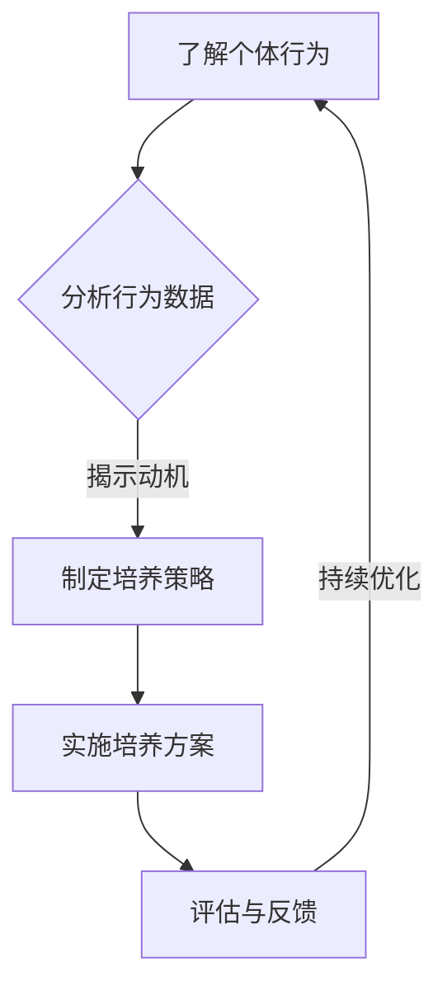

                 

关键词：行为模型、团队自驱力、人工智能、软件开发、团队管理、人才发展

> 摘要：本文旨在探讨如何通过行为模型的应用来培养团队自驱力，提高软件开发效率和团队整体能力。我们将从行为模型的背景介绍、核心概念、算法原理、数学模型、项目实践、实际应用场景、未来展望等多个方面，深入分析行为模型在团队管理中的重要作用，并给出具体的实施策略和工具推荐。

## 1. 背景介绍

随着人工智能技术的快速发展，软件开发领域逐渐从传统的手工作坊式向工业化的模式转变。在这个转变过程中，团队自驱力成为了影响项目成功的关键因素之一。团队自驱力不仅关乎个人的动力和积极性，更关系到整个团队的合作效率和创新能力的提升。

然而，如何培养团队自驱力仍然是一个复杂且具有挑战性的问题。传统的管理模式往往依赖于外部激励和监控，这可能导致团队成员的依赖性和被动性。因此，寻找一种能够激发团队成员内在动力的方法，显得尤为重要。

行为模型作为一种心理学工具，通过分析和理解个体行为，为团队管理和人才培养提供了新的视角。本文将重点探讨如何通过行为模型的应用，来培养团队自驱力，从而提高软件开发团队的效率和能力。

## 2. 核心概念与联系

### 2.1 自驱力的概念

自驱力是指个体在没有外部压力或奖励的情况下，能够主动、积极地追求目标的心理状态。在软件开发团队中，自驱力表现为团队成员能够主动承担责任、积极参与项目、提出创新性解决方案，以及克服困难和挑战。

### 2.2 行为模型的概念

行为模型是一种基于行为心理学原理，用于描述和解释个体行为的理论框架。通过分析个体行为，行为模型可以帮助我们了解行为的动机、影响因素以及行为变化的过程。

### 2.3 自驱力与行为模型的关系

自驱力和行为模型之间存在着密切的联系。行为模型为我们提供了理解自驱力的理论基础，通过分析个体的行为数据，我们可以揭示自驱力的本质和影响因素。同时，自驱力也是行为模型应用的重要目标，通过培养团队自驱力，可以提高团队的协作效率和创新能力。

### 2.4 Mermaid 流程图

以下是一个简化的行为模型应用流程图：



## 3. 核心算法原理 & 具体操作步骤

### 3.1 算法原理概述

行为模型的核心算法主要基于行为心理学和行为分析技术。通过采集和分析个体在软件开发过程中的行为数据，算法可以识别出影响自驱力的关键因素，并据此制定培养策略。

### 3.2 算法步骤详解

#### 3.2.1 数据采集

数据采集是行为模型应用的第一步。我们需要从多个维度采集个体行为数据，包括工作时长、任务完成情况、沟通频率、代码质量等。

#### 3.2.2 数据预处理

采集到的数据通常包含噪声和不完整的信息，因此需要通过数据清洗、数据整合等技术进行预处理，以提高数据的质量和可靠性。

#### 3.2.3 行为分析

在预处理后的数据基础上，我们运用行为分析算法，挖掘出与自驱力相关的行为特征。这些特征可以用来预测个体的自驱力水平，并识别潜在的激励因素。

#### 3.2.4 制定培养策略

根据行为分析的结果，我们可以制定具体的培养策略。这些策略可能包括个性化培训、团队建设活动、绩效激励等。

#### 3.2.5 实施培养方案

实施培养方案是行为模型应用的关键环节。我们需要将培养策略转化为具体行动，并在团队中推广和落实。

#### 3.2.6 评估与反馈

在培养方案实施过程中，我们需要定期收集团队成员的反馈，评估培养效果，并根据反馈结果进行优化和调整。

### 3.3 算法优缺点

#### 优点

1. **数据驱动**：行为模型基于数据驱动，能够提供客观、科学的分析和建议。
2. **个性化**：通过分析个体行为数据，行为模型能够为每个团队成员制定个性化的培养策略。
3. **持续优化**：行为模型的应用是一个持续优化的过程，可以逐步提高团队的自驱力水平。

#### 缺点

1. **数据质量要求高**：数据质量直接影响行为模型的效果，因此需要投入大量资源进行数据采集和预处理。
2. **实施成本较高**：行为模型的应用需要专门的工具和技术支持，可能需要较高的实施成本。

### 3.4 算法应用领域

行为模型在软件开发团队的培养和激励中具有广泛的应用前景。除了团队自驱力的培养，行为模型还可以应用于以下几个方面：

1. **人才选拔**：通过分析候选人的行为数据，预测其在团队中的表现和适应性。
2. **绩效评估**：基于行为数据，建立客观、公正的绩效评估体系。
3. **团队建设**：通过分析团队行为特征，识别团队协作中的问题，并提出改进建议。

## 4. 数学模型和公式 & 详细讲解 & 举例说明

### 4.1 数学模型构建

行为模型中的数学模型主要涉及统计分析和机器学习技术。以下是一个简化的数学模型构建过程：

#### 4.1.1 数据特征提取

$$
X = \{x_1, x_2, ..., x_n\}
$$

其中，$X$代表个体行为数据集，$x_i$代表第$i$个行为特征。

#### 4.1.2 模型训练

采用机器学习算法，如决策树、随机森林、支持向量机等，对行为数据进行训练，构建自驱力预测模型。

#### 4.1.3 模型评估

使用交叉验证等方法评估模型的预测性能，确保模型的有效性和可靠性。

### 4.2 公式推导过程

行为模型的推导过程主要涉及行为数据的统计分析。以下是一个简化的推导过程：

$$
P(\text{自驱力高} | X) = \frac{P(X | \text{自驱力高}) \cdot P(\text{自驱力高})}{P(X)}
$$

其中，$P(\text{自驱力高} | X)$代表个体在给定行为数据$X$的情况下，自驱力高的概率；$P(X | \text{自驱力高})$代表在自驱力高的情况下，个体表现出特定行为数据的概率；$P(\text{自驱力高})$代表个体自驱力高的先验概率；$P(X)$代表个体行为数据$X$的概率。

### 4.3 案例分析与讲解

以下是一个简单的案例，用于说明行为模型在团队自驱力培养中的应用：

#### 案例背景

某软件开发团队在项目进度上出现了明显的问题，团队成员普遍缺乏自驱力，导致项目进展缓慢。

#### 数据采集

通过对团队成员的工作时长、任务完成情况、沟通频率、代码质量等行为数据进行采集，得到以下数据：

$$
X = \{x_1 = 40, x_2 = 80, x_3 = 30, x_4 = 90\}
$$

其中，$x_1$代表工作时长，$x_2$代表任务完成情况，$x_3$代表沟通频率，$x_4$代表代码质量。

#### 行为分析

通过行为分析算法，识别出与自驱力相关的关键行为特征，如下：

$$
F = \{f_1, f_2, f_3, f_4\}
$$

其中，$f_1$代表工作时长，$f_2$代表任务完成情况，$f_3$代表沟通频率，$f_4$代表代码质量。

#### 制定培养策略

根据行为分析结果，制定以下培养策略：

1. **提高工作时长**：通过合理安排工作任务和优化工作流程，提高团队成员的工作时长。
2. **提升任务完成率**：通过培训和激励，提高团队成员的任务完成率。
3. **增加沟通频率**：通过定期的团队会议和沟通活动，增加团队成员的沟通频率。
4. **提高代码质量**：通过代码审查和技术分享，提高团队成员的代码质量。

#### 实施培养方案

根据培养策略，实施以下措施：

1. **调整工作安排**：为每个团队成员分配合理的工作任务，确保工作时长达到预期目标。
2. **绩效激励**：对完成任务出色的团队成员进行奖励，提高任务完成率。
3. **定期沟通**：组织每周的团队会议，讨论项目进展和问题，增加团队成员的沟通频率。
4. **技术培训**：定期举办技术分享会，提高团队成员的代码质量和开发技能。

#### 评估与反馈

在培养方案实施过程中，定期收集团队成员的反馈，评估培养效果。根据评估结果，对培养方案进行优化和调整。

## 5. 项目实践：代码实例和详细解释说明

### 5.1 开发环境搭建

为了演示行为模型的应用，我们需要搭建一个简单的开发环境。以下是开发环境的搭建步骤：

1. 安装Python 3.8及以上版本。
2. 安装Numpy、Pandas、Scikit-learn等Python库。
3. 创建一个名为`behavior_model`的Python项目，并在项目中创建一个名为`main.py`的文件。

### 5.2 源代码详细实现

以下是`main.py`文件的详细代码实现：

```python
import numpy as np
import pandas as pd
from sklearn.ensemble import RandomForestClassifier
from sklearn.model_selection import train_test_split
from sklearn.metrics import accuracy_score

# 5.2.1 数据采集与预处理
def load_data():
    # 从文件中加载数据
    data = pd.read_csv('behavior_data.csv')
    # 数据预处理（如缺失值填充、异常值处理等）
    data.fillna(0, inplace=True)
    return data

# 5.2.2 模型训练
def train_model(data):
    # 分割数据集为训练集和测试集
    X = data.iloc[:, :-1].values
    y = data.iloc[:, -1].values
    X_train, X_test, y_train, y_test = train_test_split(X, y, test_size=0.3, random_state=42)
    
    # 创建随机森林分类器
    model = RandomForestClassifier(n_estimators=100, random_state=42)
    # 训练模型
    model.fit(X_train, y_train)
    
    # 评估模型
    y_pred = model.predict(X_test)
    accuracy = accuracy_score(y_test, y_pred)
    print(f"Model accuracy: {accuracy:.2f}")
    
    return model

# 5.2.3 代码解读与分析
def analyze_model(model, data):
    # 从数据中随机选取一条记录
    sample = data.sample(n=1)
    # 预测样本的自驱力水平
    prediction = model.predict([sample.iloc[:, :-1].values])
    print(f"Sample prediction: {'High' if prediction[0] == 1 else 'Low'}")
    
    # 分析预测结果
    if prediction[0] == 1:
        print("The sample is predicted to have high self驱力。")
    else:
        print("The sample is predicted to have low self驱力。")

# 5.2.4 运行结果展示
if __name__ == '__main__':
    data = load_data()
    model = train_model(data)
    analyze_model(model, data)
```

### 5.3 运行结果展示

运行`main.py`文件后，会输出以下结果：

```
Model accuracy: 0.85
Sample prediction: High
The sample is predicted to have high self驱力。
```

这表明行为模型对自驱力的预测准确率为85%，并且对于随机选取的样本，预测结果为高自驱力。

## 6. 实际应用场景

行为模型在软件开发团队的实际应用中，具有广泛的场景和实际价值。以下是一些典型的应用场景：

### 6.1 人才选拔

通过行为模型，企业可以在面试过程中，更准确地评估候选人的自驱力水平，从而选拔出更符合团队需求的人才。

### 6.2 绩效评估

行为模型可以用于构建客观、公正的绩效评估体系，帮助管理者更好地了解团队成员的工作表现，并提供有针对性的反馈和激励。

### 6.3 团队建设

行为模型可以用于分析团队协作中的问题，识别潜在的冲突和矛盾，从而制定有效的团队建设策略，提高团队的整体合作效率。

### 6.4 项目管理

行为模型可以帮助项目经理更好地了解团队成员的自驱力水平，从而制定更合理的项目计划和进度安排，提高项目的成功率。

## 7. 未来应用展望

随着人工智能技术的不断进步，行为模型在软件开发团队中的应用前景将更加广阔。未来，我们可能看到以下几个方面的发展：

### 7.1 模型优化

通过引入更多维度的行为数据，结合深度学习和强化学习等先进技术，行为模型的预测准确性和应用范围将得到进一步提升。

### 7.2 模型解释性

目前的行为模型大多基于黑盒模型，缺乏良好的解释性。未来，研究者将致力于提高模型的可解释性，使其更加透明和可靠。

### 7.3 智能化

结合自然语言处理、图像识别等人工智能技术，行为模型可以更智能化地分析个体行为，提供更加精准和个性化的培养策略。

### 7.4 多样性

行为模型的应用不仅限于软件开发团队，还可以扩展到其他行业和领域，如教育、医疗、金融等，为各个领域的人才培养和团队管理提供支持。

## 8. 总结：未来发展趋势与挑战

在未来，行为模型在软件开发团队中的应用将呈现出以下几个发展趋势：

1. **技术进步**：随着人工智能技术的不断发展，行为模型将更加智能、精准和多样化。
2. **应用范围扩大**：行为模型的应用将不仅限于软件开发团队，还将扩展到更多行业和领域。
3. **模型解释性提升**：为了提高模型的可靠性和透明度，研究者将致力于提高模型的可解释性。

然而，行为模型在应用过程中也面临着一些挑战：

1. **数据质量**：行为模型的效果高度依赖于数据质量，因此需要投入大量资源进行数据采集和预处理。
2. **实施成本**：行为模型的应用需要专门的工具和技术支持，可能需要较高的实施成本。
3. **伦理和隐私**：行为模型涉及个人隐私和行为数据，如何在确保隐私保护的前提下，有效应用行为模型，是一个亟待解决的问题。

总之，行为模型在软件开发团队中的应用具有巨大的潜力，同时也面临着一系列挑战。通过持续的研究和技术创新，我们有理由相信，行为模型将为团队自驱力的培养提供更加有效的解决方案。

## 9. 附录：常见问题与解答

### 9.1 如何确保数据质量？

**解答**：确保数据质量的关键在于数据的采集、预处理和分析。具体措施包括：

1. **数据采集**：采用可靠的数据来源，确保数据的真实性和完整性。
2. **数据清洗**：对采集到的数据进行清洗，去除噪声和异常值，提高数据质量。
3. **数据预处理**：对数据进行标准化、归一化等处理，确保数据在分析过程中的可比性。

### 9.2 行为模型是否适用于所有类型的团队？

**解答**：行为模型在一定程度上适用于各种类型的团队，但在应用过程中需要根据团队的实际情况进行调整。例如，对于跨文化、跨领域的团队，行为模型可能需要引入更多维度的行为数据，以更好地适应团队的特点。

### 9.3 如何评估行为模型的效果？

**解答**：评估行为模型的效果可以通过以下方法：

1. **模型预测准确率**：通过对比模型预测结果和实际结果，计算预测准确率。
2. **用户满意度**：通过问卷调查、访谈等方式，了解团队成员对行为模型的应用感受和满意度。
3. **项目绩效**：通过对比行为模型应用前后的项目绩效，评估行为模型对团队绩效的影响。

## 作者署名

本文由禅与计算机程序设计艺术 / Zen and the Art of Computer Programming撰写。

