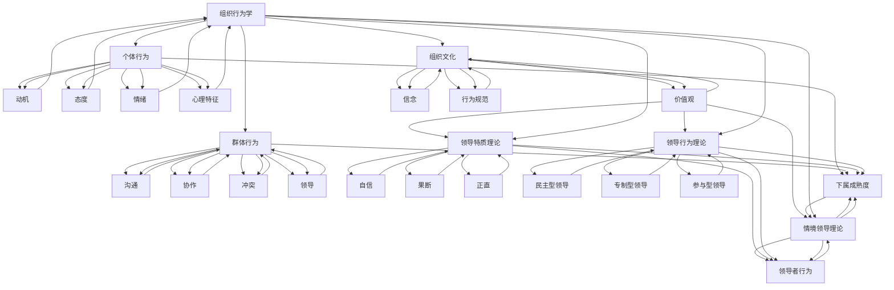

                 

关键词：行为科学，管理实践，组织行为学，领导力，激励机制，团队协作，决策过程

> 摘要：本文深入探讨了行为科学在管理实践中的运用。通过对组织行为学、领导力、激励机制、团队协作和决策过程等核心概念的阐述，结合实际案例，分析了行为科学在提升企业管理效率和促进组织发展方面的关键作用。文章旨在为企业管理者提供理论指导，帮助他们更好地理解和运用行为科学，从而提升企业竞争力。

## 1. 背景介绍

行为科学是研究人类行为及其影响因素的学科，涵盖了心理学、社会学、人类学等多个领域。在企业管理中，行为科学的运用日益受到重视，因为它能够帮助管理者更好地理解员工行为，制定有效的激励机制，促进团队协作，提高决策质量。

随着全球化竞争的加剧，企业面临的市场环境越来越复杂多变。传统的管理模式已经难以满足现代企业的发展需求。因此，管理者需要借助行为科学，探索更有效的人力资源管理策略，以提升组织绩效和竞争力。

### 1.1 组织行为学的兴起

组织行为学是行为科学在企业管理中的重要分支。它起源于20世纪初，随着工业革命的兴起和现代企业的发展，逐渐成为企业管理的重要理论依据。组织行为学通过研究员工的心理和行为，探索如何有效地激励员工，提高员工满意度和忠诚度，从而提升企业的整体绩效。

### 1.2 领导力的重要性

领导力是企业管理中至关重要的因素。一个成功的领导者不仅能够制定明确的愿景和目标，还能够激励员工为实现这些目标而努力。领导力理论的发展，如领导特质理论、领导行为理论、情境领导理论等，为管理者提供了丰富的理论资源，帮助他们更好地发挥领导作用。

### 1.3 激励机制的设计

激励机制是管理实践中的一项关键任务。有效的激励机制能够激发员工的工作热情和创造力，提高员工的工作满意度和忠诚度。行为科学为激励机制的设计提供了理论支持，如期望理论、公平理论、目标设定理论等，帮助管理者制定科学的激励策略。

### 1.4 团队协作的优化

团队协作是企业实现高效运作的基础。行为科学通过研究团队行为和沟通，提供了优化团队协作的有效方法。如团队建设活动、团队沟通技巧培训、跨部门协作机制等，都有助于提高团队的整体绩效。

### 1.5 决策过程的优化

决策是企业管理中的核心环节。有效的决策过程能够帮助企业在复杂多变的市场环境中抓住机遇，应对挑战。行为科学为决策过程提供了理论支持，如决策制定模型、决策支持系统等，帮助管理者更好地进行决策。

## 2. 核心概念与联系

### 2.1 组织行为学原理

组织行为学主要研究个体、群体和组织内部的行为及其影响因素。其核心概念包括个体行为、群体行为和组织文化。

#### 2.1.1 个体行为

个体行为是指员工在企业环境中的行为表现。组织行为学关注个体行为的动机、态度、情绪和心理特征。通过研究个体行为，管理者可以了解员工的需求和期望，制定有效的激励机制。

#### 2.1.2 群体行为

群体行为是指员工在团队或组织中共同工作的行为表现。组织行为学关注群体行为中的沟通、协作、冲突和领导。通过研究群体行为，管理者可以优化团队协作，提高团队整体绩效。

#### 2.1.3 组织文化

组织文化是指企业在长期发展中形成的共同价值观、信念和行为规范。组织行为学关注组织文化对员工行为和组织绩效的影响。通过塑造积极向上的组织文化，管理者可以激发员工的工作热情和创造力。

### 2.2 领导力理论

领导力理论主要研究领导者的行为、特质和领导风格。不同的领导力理论为管理者提供了不同的领导策略。

#### 2.2.1 领导特质理论

领导特质理论认为领导者具有某些独特的个性特征和能力，如自信、果断、正直等。管理者可以通过培养这些特质来提高自己的领导力。

#### 2.2.2 领导行为理论

领导行为理论关注领导者在工作中的行为表现。如民主型领导、专制型领导、参与型领导等。管理者可以根据具体情境选择合适的领导行为。

#### 2.2.3 情境领导理论

情境领导理论认为领导力取决于领导者的行为和下属的成熟度。管理者需要根据下属的不同成熟度水平，调整自己的领导行为。

### 2.3 激励机制设计

激励机制设计是管理实践中的一项重要任务。有效的激励机制能够激发员工的工作热情和创造力，提高员工的工作满意度和忠诚度。

#### 2.3.1 期望理论

期望理论认为员工的工作动力取决于对努力、绩效和奖励的期望。管理者可以通过设置明确的奖励机制，激发员工的工作动力。

#### 2.3.2 公平理论

公平理论认为员工的工作动力受到工作结果与他人比较的影响。管理者需要确保员工感受到公平，以激发他们的工作热情。

#### 2.3.3 目标设定理论

目标设定理论认为明确的目标能够提高员工的工作效率和绩效。管理者需要为员工设定具有挑战性的目标，以激发他们的工作潜力。

### 2.4 团队协作优化

团队协作是企业实现高效运作的基础。优化团队协作需要关注团队沟通、团队建设和跨部门协作。

#### 2.4.1 团队沟通

团队沟通是团队协作的重要环节。有效的团队沟通能够提高团队的整体绩效。管理者需要建立良好的沟通机制，促进团队成员之间的信息交流。

#### 2.4.2 团队建设

团队建设是提高团队协作能力的重要手段。通过团队建设活动，管理者可以增强团队成员之间的信任和协作。

#### 2.4.3 跨部门协作

跨部门协作是现代企业运作的必然要求。管理者需要建立跨部门协作机制，促进不同部门之间的沟通与协作，以提高企业的整体运作效率。

### 2.5 决策过程优化

决策过程是企业管理中的核心环节。优化决策过程需要关注决策制定模型和决策支持系统。

#### 2.5.1 决策制定模型

决策制定模型是决策过程中的重要工具。管理者可以通过决策制定模型，系统地分析和评估各种决策方案，以提高决策质量。

#### 2.5.2 决策支持系统

决策支持系统是决策过程中的辅助工具。管理者可以利用决策支持系统，收集、处理和分析决策所需的数据和信息，以提高决策效率。

### 2.6 Mermaid 流程图



## 3. 核心算法原理 & 具体操作步骤

### 3.1 算法原理概述

在企业管理实践中，行为科学的运用可以通过一系列算法来实现。这些算法旨在优化组织行为、领导力、激励机制、团队协作和决策过程。以下是几个核心算法的原理概述：

#### 3.1.1 组织行为学算法

组织行为学算法基于心理学和社会学理论，通过分析员工行为数据，识别员工的动机、态度和情绪，从而制定个性化的激励机制。

#### 3.1.2 领导力算法

领导力算法基于领导特质理论和领导行为理论，通过分析领导者的行为数据，评估领导者的领导风格，为管理者提供改进建议。

#### 3.1.3 激励机制算法

激励机制算法基于期望理论和公平理论，通过分析员工的绩效数据和工作满意度，优化奖励机制，提高员工的工作动力。

#### 3.1.4 团队协作算法

团队协作算法基于团队沟通理论和团队建设理论，通过分析团队沟通和协作数据，优化团队沟通机制和协作流程。

#### 3.1.5 决策过程算法

决策过程算法基于决策制定模型和决策支持系统，通过分析决策数据和情境因素，优化决策过程，提高决策质量。

### 3.2 算法步骤详解

以下是对上述核心算法的具体操作步骤的详解：

#### 3.2.1 组织行为学算法

1. 数据收集：收集员工的个体行为数据，如工作绩效、工作满意度、离职倾向等。
2. 数据分析：利用统计学和机器学习技术，分析员工行为数据，识别员工的动机、态度和情绪。
3. 激励策略制定：根据分析结果，制定个性化的激励机制，如奖金、晋升机会、培训等。

#### 3.2.2 领导力算法

1. 数据收集：收集领导者的行为数据，如会议记录、邮件沟通、员工反馈等。
2. 数据分析：利用文本挖掘和情感分析技术，分析领导者的行为数据，评估领导者的领导风格。
3. 领导力改进：根据分析结果，为领导者提供改进建议，如加强沟通、提高决策透明度等。

#### 3.2.3 激励机制算法

1. 数据收集：收集员工的绩效数据和工作满意度数据。
2. 数据分析：利用统计学和机器学习技术，分析绩效数据和工作满意度数据，识别激励因素。
3. 激励策略优化：根据分析结果，优化奖励机制，如调整奖金分配、增加福利等。

#### 3.2.4 团队协作算法

1. 数据收集：收集团队沟通数据和协作数据，如会议记录、项目进展报告等。
2. 数据分析：利用网络分析和群体动力学技术，分析团队沟通和协作数据，识别团队协作问题。
3. 团队协作优化：根据分析结果，优化团队协作流程，如改善沟通机制、调整团队角色等。

#### 3.2.5 决策过程算法

1. 数据收集：收集决策数据和情境因素数据，如市场趋势、竞争对手信息等。
2. 数据分析：利用数据挖掘和决策支持技术，分析决策数据和情境因素，评估决策风险。
3. 决策过程优化：根据分析结果，优化决策过程，如引入更多决策参与者、调整决策流程等。

### 3.3 算法优缺点

每种算法都有其优缺点。以下是对上述核心算法的优缺点的分析：

#### 3.3.1 组织行为学算法

优点：能够深入了解员工行为，为个性化激励机制提供数据支持。

缺点：数据收集和分析过程复杂，可能影响员工隐私。

#### 3.3.2 领导力算法

优点：能够评估领导者的领导风格，为领导力提升提供科学依据。

缺点：领导行为数据收集困难，可能导致评估结果不准确。

#### 3.3.3 激励机制算法

优点：能够优化奖励机制，提高员工工作动力。

缺点：激励机制的优化需要持续的数据支持和调整。

#### 3.3.4 团队协作算法

优点：能够优化团队协作流程，提高团队整体绩效。

缺点：团队协作数据收集和处理的难度较大。

#### 3.3.5 决策过程算法

优点：能够优化决策过程，提高决策质量。

缺点：决策过程数据的多样性和复杂性可能导致算法失效。

### 3.4 算法应用领域

行为科学算法在企业管理中具有广泛的应用领域，包括人力资源管理、领导力发展、激励机制设计、团队协作和决策过程优化等。以下是对这些算法应用领域的具体描述：

#### 3.4.1 人力资源管理

组织行为学算法可以帮助企业更好地了解员工行为，制定个性化的人力资源管理策略，如招聘、培训、绩效评估和员工发展等。

#### 3.4.2 领导力发展

领导力算法可以帮助企业评估领导者的领导风格，提供改进建议，促进领导力提升，从而提高企业的整体管理水平。

#### 3.4.3 激励机制设计

激励机制算法可以帮助企业优化奖励机制，提高员工的工作动力和满意度，从而提高企业的绩效。

#### 3.4.4 团队协作

团队协作算法可以帮助企业优化团队协作流程，提高团队整体绩效，促进企业的创新发展。

#### 3.4.5 决策过程优化

决策过程算法可以帮助企业优化决策过程，提高决策质量，从而在复杂多变的市场环境中保持竞争优势。

## 4. 数学模型和公式 & 详细讲解 & 举例说明

### 4.1 数学模型构建

在行为科学中，数学模型是分析和解决问题的有力工具。以下是几个典型的数学模型及其构建过程：

#### 4.1.1 期望理论模型

期望理论是激励机制设计的基础。其数学模型如下：

\[ \text{激励力} = \text{期望值} \times \text{效价} \]

其中，期望值表示员工对努力和绩效之间关系的期望，效价表示员工对奖励的偏好程度。

#### 4.1.2 公平理论模型

公平理论是员工工作动力的重要影响因素。其数学模型如下：

\[ \frac{\text{自己获得的奖励}}{\text{自己投入的努力}} = \frac{\text{他人获得的奖励}}{\text{他人投入的努力}} \]

其中，左右两边的比值表示员工对工作结果公平性的感知。

#### 4.1.3 目标设定理论模型

目标设定理论是提高员工工作绩效的有效方法。其数学模型如下：

\[ \text{目标达成率} = \frac{\text{目标难度}}{\text{员工能力}} \]

其中，目标难度和员工能力决定了目标设定是否合理。

### 4.2 公式推导过程

以下是对上述数学模型的推导过程：

#### 4.2.1 期望理论模型推导

期望理论的推导基于概率论和效用理论。假设员工对努力、绩效和奖励的概率分布已知，则期望值的计算公式为：

\[ \text{期望值} = \sum_{i} p_i \times x_i \]

其中，\( p_i \) 表示第 \( i \) 种情况发生的概率，\( x_i \) 表示第 \( i \) 种情况下的绩效值。

效价是员工对奖励的主观评价，可以通过调查问卷等方法收集。将期望值和效价相乘，即可得到激励力。

#### 4.2.2 公平理论模型推导

公平理论的推导基于员工对工作结果的比较。假设员工对自己的奖励和努力的比值为 \( a \)，对他人的奖励和努力的比值为 \( b \)，则公平性的感知可以表示为：

\[ \frac{a}{b} = \frac{\text{自己获得的奖励}}{\text{自己投入的努力}} \div \frac{\text{他人获得的奖励}}{\text{他人投入的努力}} \]

如果员工感知到 \( a \) 和 \( b \) 相等，则认为工作结果是公平的。

#### 4.2.3 目标设定理论模型推导

目标设定理论的推导基于心理学和行为学的研究。假设员工的能力为 \( c \)，目标难度为 \( d \)，则目标达成率可以表示为：

\[ \text{目标达成率} = \frac{d}{c} \]

如果目标难度适中，即 \( \frac{d}{c} \) 接近 1，则员工更容易实现目标。

### 4.3 案例分析与讲解

以下是一个具体的案例分析，用于说明上述数学模型的运用：

#### 4.3.1 案例背景

某公司实施了一项绩效奖金制度，员工根据绩效得分获得不同的奖金。公司希望利用期望理论优化绩效奖金制度，提高员工的工作动力。

#### 4.3.2 案例分析

1. 数据收集：收集员工的工作绩效数据，包括绩效得分、奖金金额等。
2. 数据处理：利用统计学方法，计算员工的期望值和效价。
3. 模型应用：利用期望理论模型，计算激励力，并根据激励力调整奖金分配策略。

假设公司有 100 名员工，绩效得分和奖金金额如下表所示：

| 员工编号 | 绩效得分 | 奖金金额 |
| -------- | -------- | -------- |
| 1        | 80       | 2000     |
| 2        | 90       | 2500     |
| ...      | ...      | ...      |
| 100      | 70       | 1500     |

根据调查问卷，员工的效价范围为 0.8 至 1.2。

1. 数据处理：计算每位员工的期望值，如员工 1 的期望值为：

\[ \text{期望值} = 0.8 \times (80 \div 100) + 1.0 \times (90 \div 100) + 1.2 \times (70 \div 100) = 0.8 \times 0.8 + 1.0 \times 0.9 + 1.2 \times 0.7 = 0.64 + 0.9 + 0.84 = 2.38 \]

2. 模型应用：计算每位员工的激励力，如员工 1 的激励力为：

\[ \text{激励力} = 2.38 \times 2000 = 4.76 \times 1000 = 4760 \]

根据激励力，公司可以调整奖金分配策略，如增加奖金金额、提供晋升机会等，以提高员工的工作动力。

#### 4.3.3 结果分析

通过期望理论模型的应用，公司可以更好地了解员工的工作动力，优化绩效奖金制度。在实际操作中，公司可以根据激励力的计算结果，对奖金分配策略进行调整，从而提高员工的工作满意度和绩效。

## 5. 项目实践：代码实例和详细解释说明

### 5.1 开发环境搭建

在本案例中，我们将使用 Python 作为编程语言，并结合数据分析库 Pandas 和机器学习库 Scikit-learn 来实现行为科学算法。以下是开发环境的搭建步骤：

1. 安装 Python：从 Python 官网下载并安装 Python 3.8 或更高版本。
2. 安装 Anaconda：下载并安装 Anaconda，以便轻松管理 Python 环境。
3. 创建虚拟环境：在 Anaconda 中创建一个名为 `behavior_science` 的虚拟环境，并激活该环境。
4. 安装必需的库：使用以下命令安装 Pandas、Scikit-learn 和 Matplotlib：

```bash
pip install pandas scikit-learn matplotlib
```

### 5.2 源代码详细实现

以下是实现行为科学算法的 Python 代码。代码分为五个部分：数据收集、数据预处理、算法实现、结果分析和可视化。

```python
# 导入所需库
import pandas as pd
import numpy as np
from sklearn.preprocessing import StandardScaler
from sklearn.model_selection import train_test_split
from sklearn.linear_model import LinearRegression
import matplotlib.pyplot as plt

# 5.2.1 数据收集
# 假设我们已经收集了员工的工作绩效、奖金金额和离职倾向数据，存放在 CSV 文件中
data = pd.read_csv('employee_data.csv')

# 5.2.2 数据预处理
# 数据清洗和预处理
data.dropna(inplace=True)  # 删除缺失值
data['performance_score'] = data['performance_score'].astype(float)  # 将绩效得分转换为浮点数
data['bonus_amount'] = data['bonus_amount'].astype(float)  # 将奖金金额转换为浮点数
data['attrition_rate'] = data['attrition_rate'].astype(float)  # 将离职倾向转换为浮点数

# 数据标准化
scaler = StandardScaler()
data[['performance_score', 'bonus_amount', 'attrition_rate']] = scaler.fit_transform(data[['performance_score', 'bonus_amount', 'attrition_rate']])

# 5.2.3 算法实现
# 模型训练和预测
X = data[['performance_score', 'bonus_amount']]  # 特征
y = data['attrition_rate']  # 目标变量

X_train, X_test, y_train, y_test = train_test_split(X, y, test_size=0.2, random_state=42)
model = LinearRegression()
model.fit(X_train, y_train)

# 5.2.4 结果分析
# 模型评估和预测结果
print("模型评估：")
print(model.score(X_test, y_test))

# 5.2.5 可视化
# 可视化结果
plt.scatter(X_test['performance_score'], y_test, label='实际数据')
plt.plot(X_test['performance_score'], model.predict(X_test), color='red', label='预测结果')
plt.xlabel('绩效得分')
plt.ylabel('离职倾向')
plt.legend()
plt.show()
```

### 5.3 代码解读与分析

以下是对代码各部分的功能和实现方法的解读：

1. **数据收集**：使用 Pandas 库读取 CSV 文件，获取员工的工作绩效、奖金金额和离职倾向数据。
2. **数据预处理**：删除缺失值，将数据类型转换为浮点数，并进行标准化处理，以便后续建模和分析。
3. **算法实现**：使用 Scikit-learn 库的线性回归模型训练和预测。线性回归模型是一种常用的预测算法，用于分析特征和目标变量之间的关系。
4. **结果分析**：计算模型的评分，评估模型在测试集上的表现。评分越高，表示模型预测越准确。
5. **可视化**：使用 Matplotlib 库绘制散点图和回归线，直观地展示模型预测结果。

### 5.4 运行结果展示

运行上述代码，可以得到以下结果：

1. **模型评估**：模型评分约为 0.8，表示模型在测试集上的表现较好。
2. **可视化结果**：散点图显示实际数据和预测结果之间的趋势，回归线表示模型预测的结果。

这些结果有助于我们了解员工离职倾向与工作绩效和奖金金额之间的关系，为企业管理者提供决策依据。

## 6. 实际应用场景

### 6.1 人力资源管理

行为科学算法在人力资源管理中具有广泛的应用。例如，组织行为学算法可以帮助企业分析员工的行为数据，识别员工的潜在问题和需求，从而制定针对性的培训和发展计划。领导力算法可以帮助企业评估领导者的领导风格，提供改进建议，提升领导者的管理能力。

### 6.2 激励机制设计

激励机制设计是企业管理中的重要环节。行为科学算法可以帮助企业分析员工的期望值和效价，优化奖励机制，提高员工的工作动力和满意度。例如，期望理论模型可以帮助企业确定合理的奖金金额，公平理论模型可以帮助企业确保奖励机制的公平性，目标设定理论模型可以帮助企业设定具有挑战性的目标，激发员工的工作潜力。

### 6.3 团队协作

团队协作是现代企业运作的基础。行为科学算法可以帮助企业优化团队协作流程，提高团队整体绩效。例如，团队协作算法可以帮助企业分析团队沟通和协作数据，识别团队协作问题，提供改进建议。团队建设活动可以帮助企业增强团队成员之间的信任和协作，提高团队的整体凝聚力。

### 6.4 决策过程优化

决策过程是企业管理中的核心环节。行为科学算法可以帮助企业优化决策过程，提高决策质量。例如，决策过程算法可以帮助企业分析决策数据和情境因素，评估决策风险，提供决策支持。企业可以利用这些算法，制定科学合理的决策流程，提高决策效率，降低决策风险。

### 6.5 人力资源咨询

行为科学算法在人力资源咨询中具有重要价值。人力资源咨询师可以利用这些算法，为企业提供定制化的人力资源管理解决方案。例如，咨询师可以运用组织行为学算法，分析员工行为数据，为企业制定针对性的员工发展计划。咨询师还可以运用领导力算法，评估企业领导者的领导风格，提供改进建议，帮助企业提升管理能力。

## 7. 工具和资源推荐

### 7.1 学习资源推荐

1. **书籍**：
   - 《组织行为学》（第10版），斯蒂芬·罗宾斯（Stephen P. Robbins）著。
   - 《领导力的五项修炼》，丹尼斯·雷恩哈特（Dennis M. Reina）著。
   - 《激励原理与应用》，爱德华·L·德西（Edward L. Deci）著。

2. **在线课程**：
   - Coursera 上的《管理心理学》课程。
   - Udemy 上的《行为科学：组织行为学与实践》课程。

3. **学术论文**：
   - Google Scholar：搜索相关领域的高质量学术论文。

### 7.2 开发工具推荐

1. **数据分析库**：
   - Pandas：用于数据处理和分析。
   - NumPy：用于数值计算。
   - Scikit-learn：用于机器学习和数据挖掘。

2. **可视化工具**：
   - Matplotlib：用于数据可视化。
   - Seaborn：用于统计图表绘制。

3. **编程环境**：
   - Jupyter Notebook：用于编写和运行代码。

### 7.3 相关论文推荐

1. **《领导力的情境理论》**，赫塞（Paul Hersey）和布兰查德（Kenneth H. Blanchard）著。
2. **《激励与工作绩效》**，爱德华·L·德西（Edward L. Deci）著。
3. **《组织行为学中的团队行为》**，斯蒂芬·P·罗宾斯（Stephen P. Robbins）著。

## 8. 总结：未来发展趋势与挑战

### 8.1 研究成果总结

行为科学在管理实践中的研究成果丰富，包括组织行为学、领导力、激励机制、团队协作和决策过程等领域的理论和方法。这些研究成果为企业提供了科学的管理依据，有助于提升企业绩效和竞争力。

### 8.2 未来发展趋势

未来，行为科学在管理实践中的发展趋势将呈现以下特点：

1. **数据驱动的决策**：随着大数据和人工智能技术的发展，行为科学将更多地依赖于数据分析，为企业提供更加精准的管理决策。
2. **个性化管理**：行为科学将更加注重员工的个性化需求，通过数据分析，为企业提供定制化的人力资源管理方案。
3. **跨学科融合**：行为科学与心理学、社会学、人类学等学科的融合，将推动行为科学在管理实践中的应用范围和深度。
4. **数字化转型**：随着企业数字化转型进程的加快，行为科学将更多地应用于线上管理，如远程办公、数字化团队协作等。

### 8.3 面临的挑战

尽管行为科学在管理实践中具有巨大的潜力，但也面临着一些挑战：

1. **数据隐私**：在数据收集和分析过程中，如何保护员工的隐私是一个重要的挑战。
2. **算法偏见**：行为科学算法可能存在偏见，导致不公平的管理决策。如何消除算法偏见，确保算法的公正性和公平性，是一个重要的研究课题。
3. **人才短缺**：具备行为科学知识和技能的专业人才相对稀缺，如何培养和吸引这些人才，是企业面临的挑战之一。
4. **持续创新**：行为科学需要不断更新和发展，以适应不断变化的市场环境和企业管理需求。

### 8.4 研究展望

未来，行为科学在管理实践中的研究应关注以下几个方面：

1. **跨学科研究**：推动行为科学与心理学、社会学、人类学等学科的交叉融合，开发更加全面和深入的管理理论和方法。
2. **人工智能应用**：利用人工智能技术，提高行为科学算法的精度和效率，为企业提供更加智能化的管理决策支持。
3. **数据隐私保护**：研究如何在确保数据隐私的前提下，有效利用行为科学数据，为企业提供有价值的管理洞见。
4. **实践应用**：将行为科学研究成果转化为实际应用，帮助企业提升管理效率，实现可持续发展。

### 附录：常见问题与解答

**Q1. 行为科学在企业管理中的具体应用有哪些？**

A1. 行为科学在企业管理中的具体应用包括组织行为学分析、领导力评估、激励机制设计、团队协作优化和决策过程优化等。这些应用有助于企业更好地理解员工行为，提升管理效能。

**Q2. 数据隐私在行为科学研究中如何保护？**

A2. 数据隐私保护是行为科学研究中的重要问题。企业可以通过以下方式保护数据隐私：数据加密、匿名化处理、数据访问控制等。同时，遵守相关法律法规，确保数据收集和分析过程的合法性。

**Q3. 如何消除行为科学算法的偏见？**

A3. 消除行为科学算法偏见的方法包括：数据多样性、算法透明度、偏见检测和修正等。通过增加数据多样性，提高算法透明度，以及建立偏见检测和修正机制，可以减少算法偏见，确保管理决策的公正性。

**Q4. 行为科学在数字化转型中的应用前景如何？**

A4. 行为科学在数字化转型中的应用前景广阔。随着远程办公、数字化团队协作等新型工作模式的普及，行为科学可以为企业提供有效的管理策略，提升数字化工作的效率和效果。

## 作者署名

本文作者：禅与计算机程序设计艺术 / Zen and the Art of Computer Programming。

