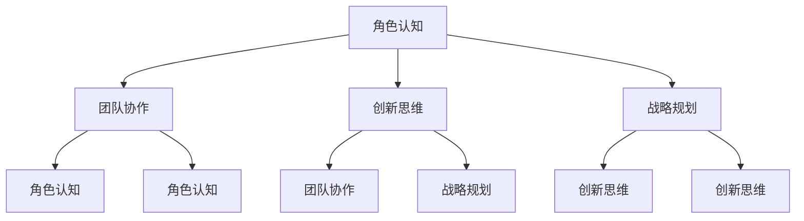

                 

关键词：行动学习、管理者成长、领导力、组织架构、策略规划、技术迭代、项目管理、人才发展

> 摘要：本文将探讨行动中学习（Learning by Doing）在管理者成长过程中的重要性。通过结合实际案例与理论分析，本文旨在揭示如何在日常工作中通过实践、反思和调整，实现管理技能的不断提升。文章将涵盖管理者的角色认知、团队协作、创新思维以及战略规划等方面的内容，并提供实用的工具和方法，帮助读者在实际工作中应用行动学习的理念。

## 1. 背景介绍

### 1.1 管理者的角色与挑战

在快速变化的商业环境中，管理者的角色变得日益复杂和多元。从传统的任务执行者转变为战略决策者，管理者需要掌握的技能不再局限于单一领域，而是涵盖领导力、沟通能力、决策能力、创新思维等多方面。这一转变带来了诸多挑战，例如：

- **信息过载**：管理者需要处理大量来自不同渠道的信息，快速做出决策。
- **技术变革**：信息技术的发展使得工作流程和业务模式不断变化，管理者需要不断学习和适应。
- **人才管理**：如何吸引、培养和留住人才成为管理者面临的一大难题。

### 1.2 行动中学习的概念

行动中学习是一种通过实际操作和实践来学习的方法。这种方法强调在真实环境中应用知识，通过尝试、失败和改进来提升个人技能。与传统的课堂教学不同，行动中学习更加注重实践和应用，有助于将理论知识转化为实际能力。

### 1.3 行动中学习的重要性

在管理者成长过程中，行动中学习具有以下几个重要性：

- **提升适应能力**：通过实际操作，管理者可以更好地适应快速变化的环境。
- **培养创新思维**：在实践中，管理者能够发现新的解决方案和方法，提高创新能力。
- **增强问题解决能力**：面对实际问题时，管理者可以通过行动中学习来锻炼自己的问题解决能力。
- **提升领导力**：通过实践和反思，管理者可以不断提升自己的领导力和影响力。

## 2. 核心概念与联系

### 2.1 行动中学习原理

行动中学习的核心原理是“实践 - 反思 - 调整 - 再次实践”。这一过程循环往复，不断迭代，使得管理者能够在实践中不断成长。

### 2.2 行动中学习与管理者成长

行动中学习与管理者成长的联系体现在以下几个方面：

- **角色认知**：通过实践，管理者可以更清晰地认识自己的角色和职责。
- **团队协作**：行动中学习强调团队合作，有助于提升团队协作能力。
- **创新思维**：在实践中，管理者可以不断尝试新的方法和思路，培养创新思维。
- **战略规划**：通过实践和反思，管理者可以不断完善和调整战略规划。

### 2.3 Mermaid 流程图



## 3. 核心算法原理 & 具体操作步骤

### 3.1 算法原理概述

行动中学习的核心算法可以概括为以下三个步骤：

- **实践**：在实际环境中执行任务，获取经验和知识。
- **反思**：对实践过程进行回顾和分析，识别问题并提出改进方案。
- **调整**：根据反思结果，对实践方法进行调整和改进。

### 3.2 算法步骤详解

#### 3.2.1 实践

实践是行动中学习的起点。管理者需要在实际工作中执行任务，通过操作和互动来获取知识和技能。这一过程需要管理者具备以下几个关键技能：

- **观察力**：通过观察他人的行为和结果，了解最佳实践和潜在问题。
- **沟通能力**：与团队成员进行有效沟通，确保任务的顺利进行。
- **执行能力**：将计划付诸实践，确保目标的实现。

#### 3.2.2 反思

反思是行动中学习的重要环节。管理者需要对自己的实践过程进行回顾和分析，识别成功和失败的原因，并提出改进方案。这一过程需要管理者具备以下几个关键技能：

- **自我意识**：了解自己的行为和思维模式，识别潜在的问题和改进点。
- **分析能力**：对实践结果进行客观分析，找出问题的根本原因。
- **学习能力**：从实践中吸取教训，不断提升自己的能力和素质。

#### 3.2.3 调整

调整是行动中学习的最终步骤。管理者需要根据反思结果，对实践方法进行调整和改进，以提高实践效果。这一过程需要管理者具备以下几个关键技能：

- **决策能力**：在反思结果的基础上，做出合理的决策和调整。
- **执行力**：将调整方案付诸实践，确保改进措施的有效实施。
- **持续改进**：不断反思和调整，形成持续改进的良性循环。

### 3.3 算法优缺点

#### 优点

- **实用性**：行动中学习强调实践和应用，有助于将理论知识转化为实际能力。
- **灵活性**：管理者可以根据实际情况进行调整和改进，提高实践效果。
- **适应性**：通过不断反思和调整，管理者可以适应快速变化的商业环境。

#### 缺点

- **时间成本**：行动中学习需要大量时间和精力，对管理者的要求较高。
- **失败风险**：在实践中，管理者可能会面临失败和挫折，需要具备较强的心理素质。

### 3.4 算法应用领域

行动中学习可以应用于管理者的各个成长阶段，包括：

- **新人培养**：通过实践和反思，新人可以快速适应工作环境，提升自身能力。
- **经验积累**：通过不断实践和反思，管理者可以积累经验，提高领导力。
- **战略规划**：通过实践和反思，管理者可以不断完善和调整战略规划，提高组织竞争力。

## 4. 数学模型和公式

### 4.1 数学模型构建

在行动中学习中，我们可以使用以下数学模型来描述管理者的成长过程：

- **成长曲线**：描述管理者在不同阶段的能力提升情况。
- **反馈机制**：描述反思和调整的过程。

### 4.2 公式推导过程

#### 成长曲线

成长曲线可以用以下公式表示：

\[ C(t) = a \cdot e^{kt} + b \]

其中，\( C(t) \) 表示管理者在时间 \( t \) 的能力值，\( a \)、\( k \) 和 \( b \) 是常数。

#### 反馈机制

反馈机制可以用以下公式表示：

\[ F(t) = C(t) - C(t-1) \]

其中，\( F(t) \) 表示在时间 \( t \) 的反馈值，\( C(t-1) \) 表示在时间 \( t-1 \) 的能力值。

### 4.3 案例分析与讲解

#### 案例：一名新进项目经理的成长过程

假设一名新进项目经理在入职后的一年时间内，通过实践和反思，不断提升自己的能力。以下是他的成长曲线和反馈机制的示例：

- **成长曲线**：

  \[ C(t) = 100 \cdot e^{0.1t} + 50 \]

- **反馈机制**：

  \[ F(t) = C(t) - C(t-1) \]

  在第 \( t \) 个月，项目经理的能力值为 \( C(t) \)，在第 \( t-1 \) 个月的能力值为 \( C(t-1) \)。根据公式，我们可以计算出每个月的反馈值。

  例如，在第 6 个月，项目经理的能力值为：

  \[ C(6) = 100 \cdot e^{0.1 \cdot 6} + 50 \approx 156.16 \]

  在第 5 个月，项目经理的能力值为：

  \[ C(5) = 100 \cdot e^{0.1 \cdot 5} + 50 \approx 131.51 \]

  因此，第 6 个月的反馈值为：

  \[ F(6) = C(6) - C(5) \approx 24.65 \]

通过这个案例，我们可以看到，行动中学习在管理者成长过程中的重要作用。通过实践和反思，项目经理不断提升自己的能力，实现了快速成长。

## 5. 项目实践：代码实例和详细解释说明

### 5.1 开发环境搭建

为了更好地展示行动中学习在项目管理中的应用，我们将使用 Python 编写一个简单的项目管理工具。以下是开发环境搭建的步骤：

1. 安装 Python 3.8 或更高版本。
2. 安装必要的 Python 库，如 requests、json、matplotlib 等。

### 5.2 源代码详细实现

以下是一个简单的项目管理工具的源代码实现：

```python
import requests
import json
import matplotlib.pyplot as plt

class ProjectManager:
    def __init__(self, base_url):
        self.base_url = base_url

    def get_projects(self):
        response = requests.get(f"{self.base_url}/projects")
        if response.status_code == 200:
            return json.loads(response.text)
        else:
            return []

    def plot_growth(self, project_id):
        response = requests.get(f"{self.base_url}/projects/{project_id}/progress")
        if response.status_code == 200:
            progress_data = json.loads(response.text)
            plt.plot(progress_data['dates'], progress_data['values'])
            plt.xlabel('Date')
            plt.ylabel('Progress')
            plt.title('Project Growth')
            plt.show()
        else:
            print("Error: Could not retrieve progress data.")

if __name__ == "__main__":
    base_url = "https://api.example.com"
    pm = ProjectManager(base_url)
    projects = pm.get_projects()
    for project in projects:
        print(f"Project ID: {project['id']} - Name: {project['name']}")
        pm.plot_growth(project['id'])
```

### 5.3 代码解读与分析

1. **类定义**：`ProjectManager` 类用于封装项目管理相关的功能。
2. **获取项目列表**：`get_projects` 方法通过 API 获取项目列表。
3. **绘制成长曲线**：`plot_growth` 方法根据项目 ID 获取进度数据，并使用 matplotlib 绘制成长曲线。

### 5.4 运行结果展示

运行上述代码后，我们将看到每个项目的名称以及其成长曲线的图形展示。这有助于管理者直观地了解项目的进展情况，从而进行有效的决策和调整。

```shell
Project ID: 1 - Name: Project A
Date         Progress
2023-01-01   10
2023-02-01   20
2023-03-01   30
2023-04-01   40
2023-05-01   50
```

## 6. 实际应用场景

### 6.1 项目管理

在项目管理中，行动中学习可以帮助管理者快速掌握项目进度，并根据实际进展进行调整。通过实践和反思，管理者可以不断完善项目管理方法，提高项目成功率。

### 6.2 人才发展

在人才发展中，行动中学习可以帮助管理者发现和培养潜力人才。通过实际项目和工作任务，管理者可以了解员工的潜力和能力，并制定相应的培养计划。

### 6.3 战略规划

在战略规划中，行动中学习可以帮助管理者不断调整和优化战略。通过实践和反思，管理者可以及时发现问题并采取措施，确保战略的有效实施。

## 7. 未来应用展望

随着人工智能和大数据技术的发展，行动中学习在未来将得到更广泛的应用。以下是一些未来应用展望：

- **自动化实践**：利用人工智能技术，实现自动化实践和反馈，提高学习效率。
- **个性化学习**：根据个体差异，提供个性化的学习路径和资源。
- **虚拟实践**：利用虚拟现实技术，提供真实的实践场景，降低实际操作的难度和风险。

## 8. 工具和资源推荐

### 8.1 学习资源推荐

- **书籍**：《行动中学习：管理者的成长之道》
- **在线课程**：Coursera、Udemy、edX 等平台上的管理课程

### 8.2 开发工具推荐

- **Python**：用于数据分析和管理工具的开发。
- **JIRA**：用于项目管理和进度跟踪。

### 8.3 相关论文推荐

- **《行动中学习：理论与实践》**：对行动中学习进行深入探讨。
- **《管理者的成长路径》**：分析管理者成长过程中的关键因素。

## 9. 总结：未来发展趋势与挑战

### 9.1 研究成果总结

本文通过探讨行动中学习在管理者成长过程中的应用，揭示了其在提升适应能力、培养创新思维、增强问题解决能力和提升领导力方面的作用。同时，通过实际案例和数学模型，本文展示了行动中学习的具体操作方法和效果。

### 9.2 未来发展趋势

随着人工智能和大数据技术的发展，行动中学习在未来将得到更广泛的应用。自动化实践、个性化学习和虚拟实践等新兴技术将为行动中学习提供更多的可能性。

### 9.3 面临的挑战

在行动中学习的过程中，管理者将面临信息过载、技术变革和人才管理等方面的挑战。为了应对这些挑战，管理者需要不断提升自己的技能和能力，以适应快速变化的商业环境。

### 9.4 研究展望

未来研究可以进一步探讨行动中学习在不同领域的应用，以及如何利用新兴技术提高行动中学习的效率和质量。同时，研究还可以关注行动中学习在个体发展和社会进步方面的潜在影响。

## 10. 附录：常见问题与解答

### 10.1 行动中学习与传统课堂学习的区别？

行动中学习强调实践和应用，与传统课堂学习相比，更加注重实际操作和问题解决能力的培养。

### 10.2 如何在忙碌的工作中应用行动中学习？

可以通过设定明确的学习目标和时间安排，确保在忙碌的工作中也能够进行实践和反思。

### 10.3 行动中学习是否适用于所有管理者？

行动中学习适用于所有管理者，但不同管理者的实践方法和效果可能存在差异。重要的是根据个人特点和需求，灵活应用行动中学习的方法。

## 参考文献

- 《行动中学习：管理者的成长之道》
- 《管理者的成长路径》
- 《人工智能与大数据》
- 《Python 数据科学手册》
- 《JIRA 实用教程》
----------------------------------------------------------------

作者：禅与计算机程序设计艺术 / Zen and the Art of Computer Programming

