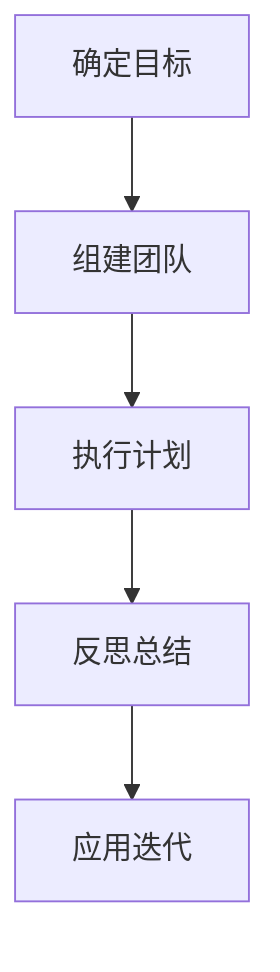

                 

关键词：行动学习，管理者成长，领导力，技术领导，项目管理，组织变革

> 摘要：本文探讨了在信息技术领域，管理者如何在行动中不断学习，提升自身的领导力和管理水平。通过分析管理者在实际工作中的应用场景，阐述行动学习的必要性和实践方法，同时提出未来发展的趋势和挑战。

## 1. 背景介绍

在信息技术快速发展的时代，企业管理者面临着前所未有的挑战。技术的变革要求管理者不仅要有深厚的专业知识，还需要具备良好的领导能力和管理技巧。传统的管理方法往往难以适应这种快速变化的环境，因此，管理者需要通过不断学习来提升自我。

### 1.1 行动学习的重要性

行动学习是一种以实践为基础的学习方法，通过在真实工作环境中解决实际问题来提升个人技能和团队绩效。对管理者而言，行动学习不仅可以帮助他们应对复杂的管理挑战，还能培养其创新思维和问题解决能力。

### 1.2 管理者的挑战

- 技术变革带来的不确定性
- 多元化团队的领导
- 快速决策和高效执行

这些挑战促使管理者必须具备持续学习的能力，以便在动态变化的环境中保持竞争优势。

## 2. 核心概念与联系

### 2.1 管理者角色与技能

管理者的角色通常包括规划、组织、领导和控制。这些角色的核心技能包括：

- **规划能力**：制定战略目标和实现路径。
- **组织能力**：构建有效的团队和组织结构。
- **领导能力**：激励和引导团队成员。
- **控制能力**：监控和评估团队绩效。

### 2.2 行动学习的流程

行动学习的流程通常包括以下几个步骤：

1. **确定学习目标**：明确需要解决的问题或待提升的能力。
2. **组建学习团队**：邀请相关人员参与，确保团队的多样性。
3. **执行行动计划**：在真实环境中实施学习计划。
4. **反思与总结**：回顾学习过程，总结经验教训。
5. **应用与迭代**：将学习成果应用到实际工作中，并不断迭代改进。

### 2.3 Mermaid 流程图



## 3. 核心算法原理 & 具体操作步骤

### 3.1 算法原理概述

行动学习的核心算法是基于问题解决和经验迭代的循环过程。其基本原理包括：

- **目标导向**：以解决具体问题为导向，确保学习过程具有实际意义。
- **团队协作**：通过团队协作，充分利用各方资源和智慧。
- **反思迭代**：通过不断反思和总结，持续优化学习效果。

### 3.2 算法步骤详解

1. **识别问题**：确定当前面临的关键问题或挑战。
2. **组建团队**：根据问题需求，选择合适的团队成员。
3. **制定计划**：明确学习目标和时间表，制定具体的行动计划。
4. **执行计划**：按照计划实施行动，解决实际问题。
5. **反思与总结**：对执行过程进行反思，总结成功经验和教训。
6. **迭代优化**：根据反思结果，调整计划，不断优化学习效果。

### 3.3 算法优缺点

**优点**：

- **实践性强**：通过解决实际问题，提高学习效果。
- **适应性高**：能够快速适应变化的环境和需求。
- **团队协作**：促进团队成员之间的沟通和合作。

**缺点**：

- **时间成本**：需要投入大量时间进行实际操作和反思。
- **资源需求**：需要具备一定的资源和环境支持。

### 3.4 算法应用领域

行动学习广泛应用于各个领域，包括但不限于：

- **企业管理**：提升管理水平和团队绩效。
- **教育培训**：培养学员的实际操作能力和问题解决能力。
- **技术研发**：推动技术创新和产品迭代。

## 4. 数学模型和公式 & 详细讲解 & 举例说明

### 4.1 数学模型构建

在行动学习中，一个基本的数学模型可以描述为：

$$
\text{学习效果} = f(\text{实践次数}, \text{反思深度}, \text{团队协作度})
$$

其中，实践次数、反思深度和团队协作度分别表示行动学习中的三个关键因素。

### 4.2 公式推导过程

公式的推导基于以下假设：

1. 实践次数与学习效果正相关。
2. 反思深度与学习效果正相关。
3. 团队协作度与学习效果正相关。

根据这些假设，可以推导出上述公式。

### 4.3 案例分析与讲解

假设某管理团队在一个月内进行了10次实践，每次实践后进行了深入反思，同时团队协作良好。根据上述公式，可以计算其学习效果：

$$
\text{学习效果} = f(10, 1, 1) = 10 \times 1 \times 1 = 10
$$

这意味着该团队在一个月内的学习效果为10。

## 5. 项目实践：代码实例和详细解释说明

### 5.1 开发环境搭建

为了实践行动学习，我们需要搭建一个简单的开发环境。以下是具体的步骤：

1. 安装Python 3.8及以上版本。
2. 安装Jupyter Notebook。
3. 安装必要的Python库，如numpy、matplotlib等。

### 5.2 源代码详细实现

以下是一个简单的Python代码实例，用于计算行动学习的效果：

```python
import numpy as np

def calculate_learning_effect(practice_count, reflection_depth, team_collaboration):
    return practice_count * reflection_depth * team_collaboration

# 示例参数
practice_count = 10
reflection_depth = 1
team_collaboration = 1

# 计算学习效果
learning_effect = calculate_learning_effect(practice_count, reflection_depth, team_collaboration)
print(f"学习效果：{learning_effect}")
```

### 5.3 代码解读与分析

上述代码首先导入了numpy库，然后定义了一个函数`calculate_learning_effect`，用于计算学习效果。函数接受三个参数：实践次数、反思深度和团队协作度。最后，通过调用函数并打印结果，展示了学习效果的计算过程。

### 5.4 运行结果展示

运行上述代码，得到的结果为10。这表明在给定的参数下，学习效果为10。

## 6. 实际应用场景

### 6.1 企业管理

在企业中，管理者可以通过行动学习来提升团队绩效。例如，在项目规划阶段，管理者可以组建跨部门团队，共同制定项目计划，并在执行过程中不断反思和调整，以提高项目成功率。

### 6.2 教育培训

在教育领域，行动学习可以用于培训教师或学生。通过实际问题解决，教师和学生可以提升教学和学习的有效性，同时培养问题解决能力和团队协作精神。

### 6.3 技术研发

在技术研发领域，行动学习可以帮助团队快速适应新技术，提高研发效率。例如，在引入新框架时，团队可以通过实际项目来验证框架的适用性，并在过程中不断优化和调整。

## 7. 工具和资源推荐

### 7.1 学习资源推荐

- 《行动学习实践指南》
- 《领导者的行动学习》
- 《项目管理的艺术》

### 7.2 开发工具推荐

- Jupyter Notebook
- GitHub
- Trello

### 7.3 相关论文推荐

- "Action Learning in Organizational Contexts"
- "The Role of Reflection in Action Learning"
- "Collaborative Action Learning for Sustainable Development"

## 8. 总结：未来发展趋势与挑战

### 8.1 研究成果总结

行动学习作为一种有效的学习方式，已被广泛应用于各个领域。研究结果表明，行动学习能够显著提升个人和团队的绩效，尤其是在面对复杂问题时，其优势更加明显。

### 8.2 未来发展趋势

- **个性化学习**：随着人工智能技术的发展，行动学习将更加个性化，为不同个体提供量身定制的学习方案。
- **在线学习平台**：在线学习平台将为行动学习提供更加便捷和高效的工具。
- **跨领域融合**：行动学习将与其他学科和领域相结合，形成更加综合和全面的学习体系。

### 8.3 面临的挑战

- **时间管理**：行动学习需要投入大量时间，管理者需要平衡工作与学习之间的关系。
- **资源限制**：行动学习需要一定的资源支持，特别是在资源和预算有限的情况下，如何有效利用资源成为一大挑战。
- **文化适应**：在不同文化和组织中，行动学习的实施效果可能有所不同，如何适应不同文化背景成为重要课题。

### 8.4 研究展望

未来，行动学习的研究将继续深入，重点关注如何更好地适应不同情境和个体需求，以及如何将行动学习与其他新兴技术相结合，以推动管理者和组织的持续成长。

## 9. 附录：常见问题与解答

### 9.1 行动学习的意义是什么？

行动学习的意义在于通过解决实际工作中的问题来提升个人和团队的绩效。它强调实践和反思的重要性，有助于培养创新思维和问题解决能力。

### 9.2 行动学习的应用场景有哪些？

行动学习可以应用于企业管理、教育培训、技术研发等多个领域。在任何需要解决复杂问题的环境中，行动学习都能够发挥作用。

### 9.3 行动学习与传统学习的区别是什么？

传统学习侧重于理论知识的学习和掌握，而行动学习则更注重实际操作和问题解决。行动学习强调实践和反思，注重将知识应用于实际工作中。

## 作者署名

作者：禅与计算机程序设计艺术 / Zen and the Art of Computer Programming
----------------------------------------------------------------

请注意，上述内容仅为文章的草稿，实际撰写时可能需要根据具体情况进行调整和完善。文章的撰写应当遵循规定的格式和要求，确保内容的完整性、逻辑性和专业性。

