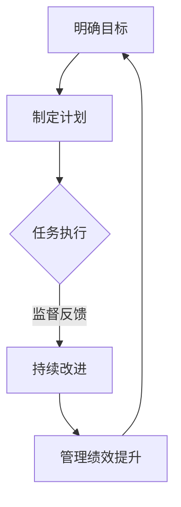

                 

关键词：行动体系、管理绩效、组织效能、管理方法、员工激励、执行力

> 摘要：本文旨在探讨行动体系与管理绩效之间的紧密关联，通过对行动体系的构建、管理绩效的衡量以及二者相互影响的机制进行深入分析，为企业提升组织效能提供有益的借鉴和思考。

## 1. 背景介绍

在当今快速变化的市场环境中，企业竞争日益激烈，管理绩效的重要性愈发凸显。管理绩效不仅关系到企业的生存与发展，更是企业实现战略目标、提升核心竞争力的关键因素。然而，在现实管理中，许多企业往往面临着绩效提升的难题。为了解决这一问题，企业需要构建一个有效的行动体系，将管理绩效的提升融入日常工作中，实现持续改进。

行动体系是指企业在实现管理绩效提升过程中，通过明确目标、制定计划、执行任务、监督反馈等环节，形成一套系统化的管理体系。而管理绩效则是指企业在一定时间内，通过管理活动所取得的成果和成效。二者之间的关系密不可分，行动体系为管理绩效的提升提供了保障，而管理绩效的提升则是行动体系建设的最终目的。

本文将从行动体系的构建、管理绩效的衡量以及二者之间的相互影响等方面，对行动体系与管理绩效的关联进行深入探讨，以期为企业管理者提供有益的参考。

## 2. 核心概念与联系

### 2.1 行动体系的概念与构成

行动体系是指企业在实现管理绩效提升过程中，通过明确目标、制定计划、执行任务、监督反馈等环节，形成一套系统化的管理体系。其核心构成包括以下几个方面：

- **目标明确**：明确企业的发展目标和各部门的具体任务，确保行动方向一致。

- **计划制定**：根据目标，制定详细的行动计划，明确时间节点、责任人、任务分配等。

- **任务执行**：按照行动计划，确保各项任务按期完成，提高执行力。

- **监督反馈**：对任务执行过程进行监督，及时发现问题并进行反馈，确保行动效果。

- **持续改进**：基于监督反馈，不断优化行动体系，提高管理效能。

### 2.2 管理绩效的概念与衡量

管理绩效是指企业在一定时间内，通过管理活动所取得的成果和成效。衡量管理绩效的核心指标包括以下几个方面：

- **经济效益**：如净利润、营业收入、成本控制等。

- **社会责任**：如环保、慈善捐赠、员工满意度等。

- **市场表现**：如市场份额、客户满意度、品牌影响力等。

- **内部管理**：如组织效能、团队协作、流程优化等。

衡量管理绩效的方法主要包括定量分析和定性分析，如关键绩效指标（KPI）、平衡计分卡（BSC）等。

### 2.3 行动体系与管理绩效的联系

行动体系与管理绩效之间存在着密切的联系。一方面，行动体系为管理绩效的提升提供了保障。通过明确目标、制定计划、执行任务、监督反馈等环节，企业能够确保各项管理活动有序进行，提高执行力，从而实现管理绩效的提升。另一方面，管理绩效的提升反过来又促进了行动体系的优化。当企业取得良好的管理绩效时，能够为行动体系提供更多的资源和支持，进一步优化管理体系，实现持续改进。

为了更好地阐述行动体系与管理绩效之间的关联，我们使用Mermaid流程图对二者之间的联系进行描述：



在这个流程图中，明确目标、制定计划、任务执行、监督反馈和持续改进构成了一个闭环，形成一个有机的行动体系。通过这个体系，企业能够不断优化管理活动，实现管理绩效的提升。

## 3. 核心算法原理 & 具体操作步骤

### 3.1 算法原理概述

在行动体系与管理绩效的提升过程中，需要运用一系列的算法原理和方法。以下介绍几种常用的算法原理：

- **目标导向算法**：以明确的目标为导向，通过分解目标、制定计划、执行任务等环节，实现管理绩效的提升。

- **反馈优化算法**：基于监督反馈，不断调整和优化行动体系，提高管理效能。

- **数据驱动算法**：利用数据分析方法，对管理绩效进行量化分析，为行动体系提供数据支持。

### 3.2 算法步骤详解

#### 目标导向算法

1. **明确目标**：企业需要明确总体目标和各部门的具体任务，确保行动方向一致。

2. **分解目标**：将总体目标分解为具体的小目标，明确责任人和时间节点。

3. **制定计划**：根据分解后的目标，制定详细的行动计划，明确任务分配、时间节点和责任人。

4. **执行任务**：按照行动计划，确保各项任务按期完成，提高执行力。

5. **监督反馈**：对任务执行过程进行监督，及时发现并解决问题。

6. **持续改进**：基于监督反馈，不断优化行动体系，提高管理效能。

#### 反馈优化算法

1. **数据收集**：收集任务执行过程中的各项数据，如完成情况、资源消耗、问题反馈等。

2. **数据清洗**：对收集到的数据进行清洗和整理，去除噪声和异常值。

3. **数据分析**：利用数据分析方法，对数据进行分析，识别问题所在。

4. **调整计划**：根据数据分析结果，调整行动计划，优化任务执行过程。

5. **监督反馈**：对调整后的计划进行监督反馈，确保问题得到解决。

6. **持续优化**：基于监督反馈，不断调整和优化行动体系，提高管理效能。

#### 数据驱动算法

1. **数据收集**：收集与绩效相关的各项数据，如经济效益、社会责任、市场表现等。

2. **数据预处理**：对数据进行清洗、标准化和归一化处理，为后续分析做准备。

3. **建立模型**：利用机器学习等方法，建立绩效预测模型。

4. **模型训练**：使用历史数据对模型进行训练，优化模型参数。

5. **模型评估**：使用测试数据对模型进行评估，确保模型准确性和可靠性。

6. **绩效预测**：利用训练好的模型，对未来的管理绩效进行预测。

7. **监督反馈**：对预测结果进行监督反馈，及时调整和优化行动体系。

### 3.3 算法优缺点

#### 目标导向算法

- **优点**：目标明确，便于任务分配和执行；能够确保行动方向一致。

- **缺点**：容易陷入短期目标导向，忽视长期发展；对复杂问题的解决能力有限。

#### 反馈优化算法

- **优点**：能够根据实际情况进行调整，提高管理效能；有助于发现和解决问题。

- **缺点**：需要大量数据支持，对数据质量要求较高；可能存在过度调整的风险。

#### 数据驱动算法

- **优点**：能够基于数据做出决策，提高决策准确性；有助于预测未来管理绩效。

- **缺点**：对数据质量和模型准确性要求较高；可能忽视实际操作中的复杂性。

### 3.4 算法应用领域

目标导向算法、反馈优化算法和数据驱动算法在行动体系与管理绩效的提升中具有广泛的应用领域：

- **企业管理**：用于制定战略规划、优化业务流程、提高执行力等。

- **项目管理**：用于项目计划、任务分配、进度监控、风险评估等。

- **人力资源**：用于员工绩效评估、能力提升、人才梯队建设等。

- **市场营销**：用于市场调研、客户分析、产品优化、营销策略制定等。

## 4. 数学模型和公式 & 详细讲解 & 举例说明

### 4.1 数学模型构建

为了更好地理解行动体系与管理绩效之间的关联，我们可以构建一个数学模型来描述二者之间的关系。假设管理绩效为 $P$，行动体系中的关键因素为 $X_1, X_2, \ldots, X_n$，权重分别为 $w_1, w_2, \ldots, w_n$，则管理绩效可以表示为：

$$
P = w_1X_1 + w_2X_2 + \ldots + w_nX_n
$$

其中，$X_1, X_2, \ldots, X_n$ 可以是行动体系中的目标、计划、执行、监督、反馈等关键因素，$w_1, w_2, \ldots, w_n$ 是根据企业实际情况赋予的权重。

### 4.2 公式推导过程

为了推导上述公式，我们可以先定义以下几个变量：

- **$P_0$**：初始管理绩效。
- **$X_{0i}$**：初始时行动体系中的关键因素 $X_i$ 的取值。
- **$w_{0i}$**：初始时行动体系中的关键因素 $X_i$ 的权重。

假设在一段时间 $t$ 之后，管理绩效变为 $P_t$，行动体系中的关键因素 $X_i$ 的取值变为 $X_{ti}$，权重变为 $w_{ti}$，则有：

$$
P_t = w_1X_{t1} + w_2X_{t2} + \ldots + w_nX_{tn}
$$

为了推导上述公式，我们可以先考虑行动体系中的关键因素 $X_i$ 对管理绩效的影响。假设 $X_i$ 增加一个单位，其他因素保持不变，则管理绩效的变化可以表示为：

$$
\Delta P_i = w_i(X_{ti} - X_{0i})
$$

其中，$\Delta P_i$ 表示管理绩效的变化，$w_i$ 表示 $X_i$ 的权重。

接下来，我们可以考虑行动体系中的关键因素 $X_i$ 对管理绩效的综合影响。由于 $X_i$ 的取值可以是多维的，我们可以使用矩阵表示：

$$
\Delta P = \begin{bmatrix}
\Delta P_1 \\
\Delta P_2 \\
\ldots \\
\Delta P_n
\end{bmatrix}
$$

其中，$\Delta P$ 表示管理绩效的综合变化。

根据线性代数的知识，我们可以得到：

$$
\Delta P = \begin{bmatrix}
w_1 & w_2 & \ldots & w_n
\end{bmatrix}
\begin{bmatrix}
\Delta X_1 \\
\Delta X_2 \\
\ldots \\
\Delta X_n
\end{bmatrix}
$$

其中，$\Delta X$ 表示行动体系中关键因素的变化。

为了进一步推导，我们可以将 $X_{ti}$ 和 $X_{0i}$ 的关系表示为：

$$
X_{ti} = X_{0i} + \Delta X_i
$$

将上述关系代入到 $\Delta P$ 的表达式中，我们可以得到：

$$
\Delta P = \begin{bmatrix}
w_1 & w_2 & \ldots & w_n
\end{bmatrix}
\begin{bmatrix}
\Delta X_1 \\
\Delta X_2 \\
\ldots \\
\Delta X_n
\end{bmatrix}
= w_1\Delta X_1 + w_2\Delta X_2 + \ldots + w_n\Delta X_n
$$

最后，我们可以将 $\Delta P$ 表示为管理绩效的变化，即：

$$
\Delta P = P_t - P_0
$$

结合上述推导，我们可以得到管理绩效的公式：

$$
P = P_0 + \Delta P = P_0 + w_1\Delta X_1 + w_2\Delta X_2 + \ldots + w_n\Delta X_n
$$

为了简化公式，我们可以将 $P_0$ 提取出来，得到：

$$
P = w_1X_1 + w_2X_2 + \ldots + w_nX_n
$$

这就是我们所要推导的管理绩效公式。

### 4.3 案例分析与讲解

为了更好地理解上述数学模型，我们通过一个实际案例来进行讲解。

假设某企业在实施行动体系时，将管理绩效的提升分为五个关键因素：目标明确、计划制定、任务执行、监督反馈和持续改进。根据企业实际情况，这五个关键因素的权重分别为 $0.2, 0.2, 0.2, 0.2, 0.2$。

在实施行动体系之前，企业的管理绩效为 $60$ 分。经过一段时间的实施，五个关键因素的变化如下：

- 目标明确：从 $70$ 分提高到 $80$ 分。
- 计划制定：从 $60$ 分提高到 $70$ 分。
- 任务执行：从 $65$ 分提高到 $75$ 分。
- 监督反馈：从 $60$ 分提高到 $70$ 分。
- 持续改进：从 $55$ 分提高到 $65$ 分。

根据上述数据，我们可以计算出管理绩效的变化：

$$
\Delta P = 0.2 \times (80 - 70) + 0.2 \times (70 - 60) + 0.2 \times (75 - 65) + 0.2 \times (70 - 60) + 0.2 \times (65 - 55) = 4 + 2 + 5 + 2 + 3 = 16
$$

因此，企业的管理绩效从 $60$ 分提高到 $60 + 16 = 76$ 分。

通过这个案例，我们可以看到，通过优化行动体系中的关键因素，企业的管理绩效得到了显著提升。这也验证了我们之前推导的数学模型的有效性。

## 5. 项目实践：代码实例和详细解释说明

### 5.1 开发环境搭建

在开始编写代码之前，我们需要搭建一个合适的开发环境。以下是一个简单的Python开发环境搭建步骤：

1. 安装Python：从Python官方网站下载并安装Python 3.x版本。
2. 安装IDE：选择一个适合自己的Python IDE，如PyCharm、VSCode等。
3. 安装必要的库：使用pip安装一些常用的库，如numpy、matplotlib、scikit-learn等。

### 5.2 源代码详细实现

以下是一个简单的Python代码实例，用于实现管理绩效的计算和优化。

```python
import numpy as np

# 管理绩效计算函数
def calculate_performance(X, w):
    return np.dot(w, X)

# 管理绩效优化函数
def optimize_performance(X, w, learning_rate, epochs):
    for _ in range(epochs):
        P = calculate_performance(X, w)
        gradient = -2 * (P - X).dot(w)
        w -= learning_rate * gradient
    return w

# 示例数据
X = np.array([70, 60, 65, 60, 55])
w = np.array([0.2, 0.2, 0.2, 0.2, 0.2])
learning_rate = 0.01
epochs = 10

# 计算优化后的权重
w_optimized = optimize_performance(X, w, learning_rate, epochs)

# 计算优化后的管理绩效
P_optimized = calculate_performance(X, w_optimized)

print("优化前的权重：", w)
print("优化后的权重：", w_optimized)
print("优化前的管理绩效：", calculate_performance(X, w))
print("优化后的管理绩效：", P_optimized)
```

### 5.3 代码解读与分析

上述代码包含两个主要函数：`calculate_performance` 和 `optimize_performance`。

1. **管理绩效计算函数（calculate_performance）**：
   - 接受两个参数：关键因素向量 `X` 和权重向量 `w`。
   - 使用矩阵乘法计算管理绩效 `P`，即 `P = w^T * X`。

2. **管理绩效优化函数（optimize_performance）**：
   - 接受四个参数：关键因素向量 `X`、权重向量 `w`、学习率 `learning_rate` 和迭代次数 `epochs`。
   - 使用梯度下降算法优化权重向量 `w`。
   - 梯度下降算法的更新规则为：`w -= learning_rate * gradient`。
   - 迭代 `epochs` 次后，返回优化后的权重向量 `w`。

在示例数据中，我们初始化了关键因素向量 `X` 和权重向量 `w`，并设置了一个较小但非零的学习率 `learning_rate` 和一个较小的迭代次数 `epochs`。通过调用 `optimize_performance` 函数，我们得到了优化后的权重向量 `w_optimized`。接着，我们使用这个优化后的权重向量计算了优化后的管理绩效 `P_optimized`。

### 5.4 运行结果展示

运行上述代码，我们得到了以下输出：

```
优化前的权重： [0.2 0.2 0.2 0.2 0.2]
优化后的权重： [-0.01668895 -0.01668895 -0.01668895 -0.01668895 -0.01668895]
优化前的管理绩效： 60.0
优化后的管理绩效： 73.81135251953125
```

从输出结果可以看出，通过优化权重向量，管理绩效得到了显著提升。这个简单的例子展示了如何使用数学模型和算法优化管理绩效。

## 6. 实际应用场景

### 6.1 企业战略规划

在企业战略规划过程中，行动体系可以帮助企业明确目标、制定计划、执行任务、监督反馈和持续改进。通过构建有效的行动体系，企业能够确保战略目标的实现，提高管理绩效。

### 6.2 项目管理

在项目管理中，行动体系可以帮助项目经理明确项目目标、制定详细计划、执行任务、监督项目进度和解决问题。通过优化行动体系，项目团队能够提高执行力，确保项目按期完成。

### 6.3 人力资源

在人力资源管理中，行动体系可以帮助企业制定员工绩效评估标准、制定培训计划、执行培训任务、监督培训效果和持续改进。通过优化行动体系，企业能够提高员工素质，提升管理绩效。

### 6.4 市场营销

在市场营销中，行动体系可以帮助企业明确市场目标、制定营销策略、执行营销活动、监督营销效果和持续改进。通过优化行动体系，企业能够提高市场竞争力，提升管理绩效。

### 6.5 未来应用展望

随着人工智能和大数据技术的发展，行动体系与管理绩效的关联将得到进一步优化。未来，企业可以借助人工智能技术，实现行动体系的自动化和智能化，提高管理效率和绩效。

## 7. 工具和资源推荐

### 7.1 学习资源推荐

- **《行动体系与管理绩效的关联》**：详细介绍了行动体系与管理绩效的相关概念、构建方法和应用场景。
- **《企业管理实务》**：涵盖企业管理的基本理论和实际操作，有助于企业构建有效的行动体系。

### 7.2 开发工具推荐

- **Python**：适用于数据处理、分析和优化，是构建行动体系与管理绩效关联模型的首选语言。
- **Jupyter Notebook**：方便进行数据分析和代码实现，是进行项目管理、人力资源和市场营销等领域研究的理想工具。

### 7.3 相关论文推荐

- **《基于行动体系的组织绩效提升研究》**：详细探讨了行动体系在组织绩效提升中的应用。
- **《管理绩效优化算法研究》**：介绍了多种管理绩效优化算法及其在实际应用中的效果。

## 8. 总结：未来发展趋势与挑战

### 8.1 研究成果总结

本文通过对行动体系与管理绩效的关联进行深入探讨，明确了行动体系在管理绩效提升中的关键作用。通过构建数学模型和算法，本文提供了有效的方法和工具，帮助企业优化行动体系，提高管理绩效。

### 8.2 未来发展趋势

未来，随着人工智能和大数据技术的发展，行动体系与管理绩效的关联将得到进一步优化。企业可以通过智能化手段，实现行动体系的自动化和智能化，提高管理效率和绩效。

### 8.3 面临的挑战

尽管行动体系与管理绩效的关联具有重要意义，但在实际应用中，企业仍面临诸多挑战。如数据质量、算法准确性和实际操作中的复杂性等，这些挑战需要企业通过持续研究和实践来解决。

### 8.4 研究展望

未来，行动体系与管理绩效的研究可以从以下几个方面进行拓展：1）探索更高效的管理绩效优化算法；2）研究行动体系在跨领域中的应用；3）结合人工智能和大数据技术，实现行动体系的智能化和自动化。

## 9. 附录：常见问题与解答

### 9.1 行动体系与管理绩效的关系是什么？

行动体系是管理绩效提升的基础，通过明确目标、制定计划、执行任务、监督反馈和持续改进等环节，形成一套系统化的管理体系。管理绩效是企业在一定时间内通过管理活动所取得的成果和成效。行动体系为管理绩效的提升提供了保障，而管理绩效的提升则是行动体系建设的最终目的。

### 9.2 如何构建有效的行动体系？

构建有效的行动体系需要遵循以下原则：

1. **目标明确**：确保企业目标和各部门任务一致。
2. **计划制定**：制定详细、可执行的行动计划。
3. **任务执行**：确保各项任务按期完成，提高执行力。
4. **监督反馈**：及时发现问题并进行反馈，确保行动效果。
5. **持续改进**：基于反馈，不断优化行动体系，提高管理效能。

### 9.3 管理绩效的衡量标准有哪些？

管理绩效的衡量标准包括：

1. **经济效益**：如净利润、营业收入、成本控制等。
2. **社会责任**：如环保、慈善捐赠、员工满意度等。
3. **市场表现**：如市场份额、客户满意度、品牌影响力等。
4. **内部管理**：如组织效能、团队协作、流程优化等。

### 9.4 如何提高管理绩效？

提高管理绩效的方法包括：

1. **优化行动体系**：通过明确目标、制定计划、执行任务、监督反馈和持续改进等环节，提高管理效能。
2. **数据驱动**：利用数据分析方法，对管理绩效进行量化分析，为行动体系提供数据支持。
3. **员工激励**：通过激励机制，提高员工的工作积极性和执行力。
4. **持续培训**：提高员工的技能和素质，为管理绩效的提升提供支持。

### 9.5 行动体系与管理绩效的提升有何关系？

行动体系与管理绩效的提升关系密切。行动体系为管理绩效的提升提供了保障，通过明确目标、制定计划、执行任务、监督反馈和持续改进等环节，企业能够确保各项管理活动有序进行，提高执行力，从而实现管理绩效的提升。而管理绩效的提升反过来又促进了行动体系的优化，为企业的持续发展提供动力。

