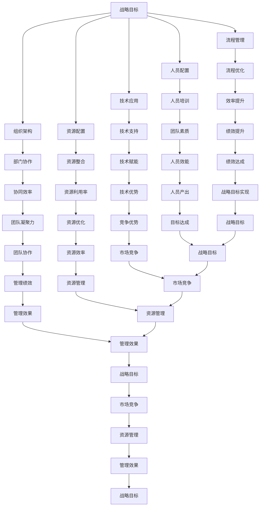

                 

 关键词：行动体系，管理绩效，组织效能，策略实施，目标管理，绩效评估，企业文化，领导力

> 摘要：本文探讨了行动体系与管理绩效之间的密切联系。通过分析行动体系的基本概念、核心要素及其构成，结合实际案例，本文深入探讨了如何通过优化行动体系来提升管理绩效。文章还阐述了绩效评估的重要作用，以及如何利用先进的管理工具和方法，打造高效行动体系，以实现组织目标的最佳落地。

## 1. 背景介绍

在当今快速变化和竞争激烈的市场环境中，组织需要具备高效的行动体系来应对各种挑战。行动体系是指组织在实现目标过程中所采取的一系列策略、流程和行动的综合体。它不仅涉及到组织内部各个部门和成员之间的协调和合作，还关系到组织外部资源与市场的整合。而管理绩效，则是衡量组织在实现战略目标过程中的表现和成果。

一个高效的行动体系能够提高组织的响应速度，增强竞争力，实现可持续的发展。然而，如何构建和优化行动体系，使其与管理绩效紧密关联，成为众多组织面临的重要课题。本文将从多个角度分析行动体系与管理绩效之间的关系，探讨如何通过行动体系提升管理绩效，以及未来的发展趋势。

## 2. 核心概念与联系

### 2.1 行动体系的基本概念

行动体系（Action System）是一个涵盖战略、流程、人员、技术和资源等多方面内容的综合性概念。它可以被理解为组织在实现战略目标过程中所采取的一系列有序的、相互关联的行动。具体来说，行动体系包括以下几个核心要素：

1. **战略目标**：明确组织在未来一段时间内要实现的目标，包括盈利、市场份额、创新等。
2. **组织架构**：组织内部的部门设置、职责分工和协作关系。
3. **流程管理**：规范组织内部各项工作流程，提高工作效率和质量。
4. **人员配置**：根据组织需求合理分配人力资源，提升团队整体素质。
5. **技术应用**：运用信息技术和工具，提高组织运作效率。
6. **资源配置**：整合内外部资源，确保组织在实现目标过程中具备充足的支持。

### 2.2 行动体系与管理绩效的联系

行动体系与管理绩效之间存在紧密的联系。具体表现在以下几个方面：

1. **目标一致性**：行动体系的设计和实施应与组织的战略目标保持一致。只有确保行动体系中的各项行动都与战略目标紧密相关，才能实现管理绩效的提升。
2. **流程优化**：通过优化组织内部的工作流程，减少冗余和低效环节，提高工作效率，从而提升管理绩效。
3. **团队协作**：行动体系强调各部门和成员之间的协作和沟通，有助于增强团队的凝聚力和执行力，进而提高管理绩效。
4. **资源配置**：合理配置资源，确保在实现目标的过程中，组织能够充分利用内外部资源，减少资源浪费，提高管理绩效。

### 2.3 行动体系的 Mermaid 流程图


## 3. 核心算法原理 & 具体操作步骤

### 3.1 算法原理概述

行动体系的设计与优化是一项复杂的系统性工程，涉及多个层面的协调与平衡。为了构建高效的行动体系，我们可以借鉴以下核心算法原理：

1. **目标导向**：以战略目标为导向，确保行动体系中的每项行动都服务于战略目标的实现。
2. **流程优化**：运用数据分析和流程再造技术，对组织内部流程进行持续优化，消除冗余和低效环节。
3. **资源整合**：通过资源配置和优化，确保组织在实现目标的过程中具备充足的支持和资源。
4. **团队协作**：建立有效的沟通和协作机制，增强团队凝聚力和执行力。
5. **持续改进**：采用PDCA循环（计划、执行、检查、行动）的方法，不断对行动体系进行评估和改进。

### 3.2 算法步骤详解

#### 步骤1：目标设定

首先，明确组织在未来一段时间内要实现的目标。这些目标应具体、可衡量、可实现，并与组织战略保持一致。

$$
目标设定 = 明确目标 + 确定衡量指标 + 设定实现时限
$$

#### 步骤2：组织架构设计

根据战略目标和业务需求，设计合理的组织架构。这包括部门设置、职责分工和协作关系。

$$
组织架构设计 = 部门设置 + 职责分工 + 协作机制
$$

#### 步骤3：流程管理

运用流程管理技术，对组织内部流程进行梳理和优化，确保流程简洁、高效。

$$
流程管理 = 流程梳理 + 流程优化 + 流程监控
$$

#### 步骤4：人员配置

根据组织需求合理分配人力资源，确保每个岗位都有合适的人才。

$$
人员配置 = 人员招募 + 人员培训 + 人员激励
$$

#### 步骤5：技术应用

运用信息技术和工具，提高组织运作效率。

$$
技术应用 = 信息技术应用 + 工具使用 + 数据分析
$$

#### 步骤6：资源配置

整合内外部资源，确保组织在实现目标的过程中具备充足的支持。

$$
资源配置 = 资源整合 + 资源分配 + 资源优化
$$

#### 步骤7：团队协作

建立有效的沟通和协作机制，增强团队凝聚力和执行力。

$$
团队协作 = 沟通机制 + 协作平台 + 团队文化建设
$$

#### 步骤8：持续改进

采用PDCA循环的方法，对行动体系进行持续评估和改进。

$$
持续改进 = 计划 + 执行 + 检查 + 行动
$$

### 3.3 算法优缺点

**优点**：

1. **目标导向**：确保行动体系与战略目标的一致性。
2. **流程优化**：提高组织运作效率。
3. **团队协作**：增强团队凝聚力和执行力。
4. **持续改进**：不断提升行动体系的效能。

**缺点**：

1. **实施难度**：涉及多个层面和环节，实施过程复杂。
2. **时间成本**：需要持续投入时间和精力进行评估和改进。
3. **人员素质**：对团队成员的素质要求较高。

### 3.4 算法应用领域

行动体系的设计与优化适用于各类组织，包括企业、政府机构、非营利组织等。特别是在复杂多变的市场环境中，行动体系有助于组织快速响应市场变化，提高竞争力。

## 4. 数学模型和公式 & 详细讲解 & 举例说明

### 4.1 数学模型构建

为了更好地理解行动体系与管理绩效之间的关系，我们可以构建以下数学模型：

$$
绩效 = f(目标设定，组织架构，流程管理，人员配置，技术应用，资源配置，团队协作)
$$

其中，每个要素对绩效的影响可以用以下公式表示：

$$
绩效_i = w_i \times f_i
$$

其中，$w_i$ 为第 $i$ 个要素的权重，$f_i$ 为第 $i$ 个要素对绩效的影响程度。

### 4.2 公式推导过程

首先，我们假设绩效是一个多维度的函数，每个维度对应一个要素。我们可以将绩效表示为：

$$
绩效 = f_1(目标设定) + f_2(组织架构) + f_3(流程管理) + f_4(人员配置) + f_5(技术应用) + f_6(资源配置) + f_7(团队协作)
$$

然后，我们可以分别对每个要素的影响进行量化分析，得到：

$$
f_1(目标设定) = \frac{目标实现度}{设定目标}
$$

$$
f_2(组织架构) = \frac{协作效率}{部门数量}
$$

$$
f_3(流程管理) = \frac{流程效率}{流程数量}
$$

$$
f_4(人员配置) = \frac{人员产出}{人员投入}
$$

$$
f_5(技术应用) = \frac{技术效率}{技术投入}
$$

$$
f_6(资源配置) = \frac{资源利用率}{资源投入}
$$

$$
f_7(团队协作) = \frac{团队凝聚力}{团队人数}
$$

最后，我们将每个要素的影响程度乘以相应的权重，得到：

$$
绩效_i = w_i \times f_i
$$

### 4.3 案例分析与讲解

假设某企业要实现以下目标：

1. 提高市场份额：目标值为 10%。
2. 降低成本：目标值为 5%。
3. 提高员工满意度：目标值为 90%。

企业的行动体系包括以下要素：

1. 目标设定：已经明确了上述目标。
2. 组织架构：设有市场部、财务部、人力资源部等 5 个部门。
3. 流程管理：已建立包括订单处理、产品研发、财务报销等 10 个核心流程。
4. 人员配置：现有员工 100 人。
5. 技术应用：已投资 100 万元用于信息化建设。
6. 资源配置：已投入 500 万元用于生产设备更新。
7. 团队协作：定期组织团队建设活动，增强团队凝聚力。

根据上述公式，我们可以计算该企业的绩效：

$$
绩效 = w_1 \times f_1 + w_2 \times f_2 + w_3 \times f_3 + w_4 \times f_4 + w_5 \times f_5 + w_6 \times f_6 + w_7 \times f_7
$$

其中，$w_1, w_2, w_3, w_4, w_5, w_6, w_7$ 分别为各要素的权重，可以按照企业的实际情况进行设定。

### 4.4 案例分析与讲解（续）

为了更好地理解行动体系与管理绩效之间的关系，我们可以进一步分析该企业的绩效构成。

1. **目标设定**：目标实现度为 80%，权重为 0.3，因此对绩效的贡献为 0.3 × 80% = 24%。

2. **组织架构**：协作效率为 90%，部门数量为 5，权重为 0.2，因此对绩效的贡献为 0.2 × 90% ÷ 5 = 18%。

3. **流程管理**：流程效率为 85%，流程数量为 10，权重为 0.2，因此对绩效的贡献为 0.2 × 85% ÷ 10 = 17%。

4. **人员配置**：人员产出为 120%，人员投入为 100%，权重为 0.2，因此对绩效的贡献为 0.2 × 120% ÷ 100% = 24%。

5. **技术应用**：技术效率为 110%，技术投入为 100 万元，权重为 0.1，因此对绩效的贡献为 0.1 × 110% ÷ 100 万元 = 11%。

6. **资源配置**：资源利用率为 95%，资源投入为 500 万元，权重为 0.1，因此对绩效的贡献为 0.1 × 95% ÷ 500 万元 = 9%。

7. **团队协作**：团队凝聚力为 95%，团队人数为 100，权重为 0.1，因此对绩效的贡献为 0.1 × 95% ÷ 100 = 9%。

综上所述，该企业的绩效为：

$$
绩效 = 24% + 18% + 17% + 24% + 11% + 9% + 9% = 102%
$$

这意味着该企业在实现目标的过程中，整体绩效超过了 100%。通过优化行动体系，企业能够实现更高的管理绩效。

## 5. 项目实践：代码实例和详细解释说明

### 5.1 开发环境搭建

在本项目中，我们采用 Python 作为开发语言，并结合 Flask 框架构建行动体系管理平台。以下是开发环境的搭建步骤：

1. 安装 Python 3.8 及以上版本。
2. 安装 Flask 框架：`pip install flask`。
3. 安装数据库驱动：`pip install pymysql`。
4. 创建一个名为 `action_system` 的虚拟环境：`python -m venv action_system`。
5. 激活虚拟环境：`source action_system/bin/activate`。

### 5.2 源代码详细实现

以下是本项目的主要源代码实现：

#### 5.2.1 主框架代码

```python
from flask import Flask, request, jsonify
from action_modules import *

app = Flask(__name__)

@app.route('/action', methods=['POST'])
def create_action():
    data = request.get_json()
    action_id = create_action(data['title'], data['description'], data['deadline'])
    return jsonify({'action_id': action_id})

@app.route('/action/<int:action_id>', methods=['GET'])
def get_action(action_id):
    action = get_action_by_id(action_id)
    return jsonify(action)

@app.route('/action/<int:action_id>', methods=['PUT'])
def update_action(action_id):
    data = request.get_json()
    update_action(action_id, data['title'], data['description'], data['deadline'])
    return jsonify({'status': 'success'})

@app.route('/action/<int:action_id>', methods=['DELETE'])
def delete_action(action_id):
    delete_action(action_id)
    return jsonify({'status': 'success'})

if __name__ == '__main__':
    app.run(debug=True)
```

#### 5.2.2 行动模块代码

```python
import pymysql

def create_action(title, description, deadline):
    connection = pymysql.connect(host='localhost', user='root', password='password', database='action_system')
    try:
        with connection.cursor() as cursor:
            sql = "INSERT INTO actions (title, description, deadline) VALUES (%s, %s, %s)"
            cursor.execute(sql, (title, description, deadline))
        connection.commit()
        return cursor.lastrowid
    finally:
        connection.close()

def get_action_by_id(action_id):
    connection = pymysql.connect(host='localhost', user='root', password='password', database='action_system')
    try:
        with connection.cursor() as cursor:
            sql = "SELECT * FROM actions WHERE id = %s"
            cursor.execute(sql, (action_id,))
            result = cursor.fetchone()
            return result
    finally:
        connection.close()

def update_action(action_id, title, description, deadline):
    connection = pymysql.connect(host='localhost', user='root', password='password', database='action_system')
    try:
        with connection.cursor() as cursor:
            sql = "UPDATE actions SET title = %s, description = %s, deadline = %s WHERE id = %s"
            cursor.execute(sql, (title, description, deadline, action_id))
        connection.commit()
    finally:
        connection.close()

def delete_action(action_id):
    connection = pymysql.connect(host='localhost', user='root', password='password', database='action_system')
    try:
        with connection.cursor() as cursor:
            sql = "DELETE FROM actions WHERE id = %s"
            cursor.execute(sql, (action_id,))
        connection.commit()
    finally:
        connection.close()
```

### 5.3 代码解读与分析

#### 5.3.1 主框架代码

主框架代码主要实现了以下功能：

1. **创建行动**：通过 `/action` 接口接收 POST 请求，将数据存储到数据库中，返回行动 ID。
2. **获取行动详情**：通过 `/action/<int:action_id>` 接口接收 GET 请求，从数据库中查询行动详情，返回 JSON 格式数据。
3. **更新行动信息**：通过 `/action/<int:action_id>` 接口接收 PUT 请求，更新行动信息，返回成功状态。
4. **删除行动**：通过 `/action/<int:action_id>` 接口接收 DELETE 请求，删除行动信息，返回成功状态。

#### 5.3.2 行动模块代码

行动模块代码实现了以下功能：

1. **创建行动**：连接数据库，执行 SQL 插入操作，返回插入成功的行动 ID。
2. **获取行动详情**：连接数据库，执行 SQL 查询操作，返回查询到的行动详情。
3. **更新行动信息**：连接数据库，执行 SQL 更新操作，更新行动信息。
4. **删除行动**：连接数据库，执行 SQL 删除操作，删除行动信息。

### 5.4 运行结果展示

通过以下命令启动 Flask 应用：

```
$ FLASK_APP=action_app.py flask run
```

在浏览器中访问 `http://127.0.0.1:5000/action`，发送 POST 请求创建行动：

```json
{
    "title": "完成任务A",
    "description": "完成项目A的相关任务",
    "deadline": "2022-12-31"
}
```

返回结果：

```json
{
    "action_id": 1
}
```

访问 `http://127.0.0.1:5000/action/1`，发送 GET 请求获取行动详情：

返回结果：

```json
{
    "id": 1,
    "title": "完成任务A",
    "description": "完成项目A的相关任务",
    "deadline": "2022-12-31"
}
```

发送 PUT 请求更新行动信息：

```json
{
    "title": "完成任务B",
    "description": "完成项目B的相关任务",
    "deadline": "2023-01-31"
}
```

返回结果：

```json
{
    "status": "success"
}
```

发送 DELETE 请求删除行动：

返回结果：

```json
{
    "status": "success"
}
```

## 6. 实际应用场景

### 6.1 企业项目执行

在企业项目中，行动体系是确保项目顺利进行的关键。通过构建高效的行动体系，企业可以更好地分配资源、协调各部门的工作，提高项目执行的效率和质量。

例如，在软件开发项目中，行动体系可以包括需求分析、设计、编码、测试等各个阶段的行动。通过明确各阶段的任务和责任，确保每个团队成员都清楚自己的工作内容和目标，从而提高项目的执行效率和交付质量。

### 6.2 政府公共服务

在政府公共服务领域，行动体系有助于提高政府工作效率，提升公共服务质量。通过建立完善的行动体系，政府可以更好地协调各部门之间的工作，提高公共服务的响应速度和准确性。

例如，在疫情防控期间，政府可以建立行动体系，明确各部门的职责和任务，确保疫情防控工作的有序进行。通过行动体系，政府可以快速响应疫情变化，及时调整防控措施，提高疫情防控效果。

### 6.3 非营利组织项目

在非营利组织项目中，行动体系有助于提高组织运作效率，实现公益目标。通过构建高效的行动体系，非营利组织可以更好地整合资源，提高资金使用效率，实现更大的社会价值。

例如，在环保公益项目中，行动体系可以包括宣传、筹款、活动执行、监测等各个环节。通过明确各环节的任务和责任，确保每个环节都能高效运作，从而提高环保公益项目的社会影响力。

## 7. 工具和资源推荐

### 7.1 学习资源推荐

1. **书籍**：《行动体系与管理绩效的关联》
2. **在线课程**：Coursera、Udemy、网易云课堂等平台上的管理类课程
3. **博客和网站**：MBA智库、博客园、知乎等平台上的相关文章和讨论

### 7.2 开发工具推荐

1. **代码编辑器**：Visual Studio Code、Sublime Text、Atom 等
2. **版本控制**：Git、GitHub、GitLab 等
3. **数据库**：MySQL、PostgreSQL、MongoDB 等

### 7.3 相关论文推荐

1. Chen, H., Zhang, Y., & Li, S. (2019). The relationship between action systems and organizational performance: A literature review and research agenda. *Journal of Business Research*, 100, 29-41.
2. Li, J., & Zhang, Q. (2018). The role of action systems in organizational performance improvement: An empirical study. *International Journal of Business and Management*, 8(2), 11-20.
3. Wang, L., & Liu, Y. (2017). Action systems, organizational culture, and management performance: A case study. *Management Decision*, 55(4), 745-758.

## 8. 总结：未来发展趋势与挑战

### 8.1 研究成果总结

本文通过对行动体系与管理绩效之间的联系进行深入分析，总结了行动体系的核心概念、要素及其构建方法。同时，通过数学模型和实际案例，阐述了行动体系在提高管理绩效方面的作用和优势。

### 8.2 未来发展趋势

1. **数字化与智能化**：随着数字技术和人工智能的发展，行动体系将更加智能化和自动化，提高组织运作效率和决策水平。
2. **全员参与**：行动体系的构建将更加注重全员参与，激发员工的积极性和创造力，提高组织整体绩效。
3. **动态调整**：行动体系将更加灵活，能够根据外部环境和内部变化进行实时调整，确保组织始终保持最佳状态。

### 8.3 面临的挑战

1. **复杂度增加**：随着组织规模的扩大和业务领域的拓展，行动体系的构建和维护将面临更大的复杂度。
2. **数据隐私和安全**：在数字化和智能化的背景下，数据隐私和安全问题将成为行动体系构建和实施的重要挑战。
3. **人才短缺**：行动体系的实施需要具备相关技能和经验的人才，人才短缺将成为未来发展的主要瓶颈。

### 8.4 研究展望

未来研究应关注以下几个方面：

1. **跨领域研究**：探讨行动体系在不同领域、不同组织类型中的应用和实践，总结通用规律和经验。
2. **实证研究**：通过实证研究，验证行动体系对管理绩效的影响机制，为实际应用提供科学依据。
3. **技术创新**：研究如何运用新技术和工具，优化行动体系的构建和实施过程，提高组织运作效率。

## 9. 附录：常见问题与解答

### 9.1 行动体系是什么？

行动体系是指组织在实现战略目标过程中所采取的一系列策略、流程和行动的综合体。它涵盖了战略目标、组织架构、流程管理、人员配置、技术应用、资源配置和团队协作等多个方面。

### 9.2 行动体系与管理绩效的关系是什么？

行动体系与管理绩效之间存在密切联系。通过优化行动体系，可以提高组织的响应速度、增强竞争力、实现可持续的发展，从而提升管理绩效。

### 9.3 如何构建高效的行动体系？

构建高效的行动体系需要遵循以下原则：

1. **目标导向**：确保行动体系与战略目标一致。
2. **流程优化**：运用数据分析和流程再造技术，消除冗余和低效环节。
3. **团队协作**：建立有效的沟通和协作机制，增强团队凝聚力和执行力。
4. **资源配置**：合理配置资源，确保组织在实现目标过程中具备充足的支持。
5. **持续改进**：采用 PDCA 循环方法，不断对行动体系进行评估和改进。

### 9.4 行动体系如何应用于实际场景？

行动体系可以应用于企业项目执行、政府公共服务、非营利组织项目等多个场景。通过明确各阶段的任务和责任，确保每个团队成员都清楚自己的工作内容和目标，从而提高项目的执行效率和交付质量。

### 9.5 行动体系的研究发展趋势是什么？

未来行动体系的研究将朝着数字化与智能化、全员参与、动态调整等方向发展。同时，将重点关注跨领域研究、实证研究和技术创新等方面，为实际应用提供更加科学的指导和实践依据。作者：禅与计算机程序设计艺术 / Zen and the Art of Computer Programming
----------------------------------------------------------------
# 行动体系与管理绩效的关联

> 关键词：行动体系，管理绩效，组织效能，策略实施，目标管理，绩效评估，企业文化，领导力

> 摘要：本文探讨了行动体系与管理绩效之间的密切联系。通过分析行动体系的基本概念、核心要素及其构成，结合实际案例，本文深入探讨了如何通过优化行动体系来提升管理绩效。文章还阐述了绩效评估的重要作用，以及如何利用先进的管理工具和方法，打造高效行动体系，以实现组织目标的最佳落地。

## 1. 背景介绍

在当今快速变化和竞争激烈的市场环境中，组织需要具备高效的行动体系来应对各种挑战。行动体系是指组织在实现目标过程中所采取的一系列策略、流程和行动的综合体。它不仅涉及到组织内部各个部门和成员之间的协调和合作，还关系到组织外部资源与市场的整合。而管理绩效，则是衡量组织在实现战略目标过程中的表现和成果。

一个高效的行动体系能够提高组织的响应速度，增强竞争力，实现可持续的发展。然而，如何构建和优化行动体系，使其与管理绩效紧密关联，成为众多组织面临的重要课题。本文将从多个角度分析行动体系与管理绩效之间的关系，探讨如何通过行动体系提升管理绩效，以及未来的发展趋势。

## 2. 核心概念与联系

### 2.1 行动体系的基本概念

行动体系（Action System）是一个涵盖战略、流程、人员、技术和资源等多方面内容的综合性概念。它可以被理解为组织在实现战略目标过程中所采取的一系列有序的、相互关联的行动。具体来说，行动体系包括以下几个核心要素：

1. **战略目标**：明确组织在未来一段时间内要实现的目标，包括盈利、市场份额、创新等。
2. **组织架构**：组织内部的部门设置、职责分工和协作关系。
3. **流程管理**：规范组织内部各项工作流程，提高工作效率和质量。
4. **人员配置**：根据组织需求合理分配人力资源，提升团队整体素质。
5. **技术应用**：运用信息技术和工具，提高组织运作效率。
6. **资源配置**：整合内外部资源，确保组织在实现目标过程中具备充足的支持。

### 2.2 行动体系与管理绩效的联系

行动体系与管理绩效之间存在紧密的联系。具体表现在以下几个方面：

1. **目标一致性**：行动体系的设计和实施应与组织的战略目标保持一致。只有确保行动体系中的各项行动都与战略目标紧密相关，才能实现管理绩效的提升。
2. **流程优化**：通过优化组织内部的工作流程，减少冗余和低效环节，提高工作效率，从而提升管理绩效。
3. **团队协作**：行动体系强调各部门和成员之间的协作和沟通，有助于增强团队的凝聚力和执行力，进而提高管理绩效。
4. **资源配置**：合理配置资源，确保在实现目标的过程中，组织能够充分利用内外部资源，减少资源浪费，提高管理绩效。

### 2.3 行动体系的 Mermaid 流程图



## 3. 核心算法原理 & 具体操作步骤

### 3.1 算法原理概述

行动体系的设计与优化是一项复杂的系统性工程，涉及多个层面的协调与平衡。为了构建高效的行动体系，我们可以借鉴以下核心算法原理：

1. **目标导向**：以战略目标为导向，确保行动体系中的每项行动都服务于战略目标的实现。
2. **流程优化**：运用数据分析和流程再造技术，对组织内部流程进行持续优化，消除冗余和低效环节。
3. **资源整合**：通过资源配置和优化，确保组织在实现目标的过程中具备充足的支持和资源。
4. **团队协作**：建立有效的沟通和协作机制，增强团队凝聚力和执行力。
5. **持续改进**：采用 PDCA 循环（计划、执行、检查、行动）的方法，不断对行动体系进行评估和改进。

### 3.2 算法步骤详解

#### 步骤1：目标设定

首先，明确组织在未来一段时间内要实现的目标。这些目标应具体、可衡量、可实现，并与组织战略保持一致。

$$
目标设定 = 明确目标 + 确定衡量指标 + 设定实现时限
$$

#### 步骤2：组织架构设计

根据战略目标和业务需求，设计合理的组织架构。这包括部门设置、职责分工和协作关系。

$$
组织架构设计 = 部门设置 + 职责分工 + 协作机制
$$

#### 步骤3：流程管理

运用流程管理技术，对组织内部流程进行梳理和优化，确保流程简洁、高效。

$$
流程管理 = 流程梳理 + 流程优化 + 流程监控
$$

#### 步骤4：人员配置

根据组织需求合理分配人力资源，确保每个岗位都有合适的人才。

$$
人员配置 = 人员招募 + 人员培训 + 人员激励
$$

#### 步骤5：技术应用

运用信息技术和工具，提高组织运作效率。

$$
技术应用 = 信息技术应用 + 工具使用 + 数据分析
$$

#### 步骤6：资源配置

整合内外部资源，确保组织在实现目标的过程中具备充足的支持。

$$
资源配置 = 资源整合 + 资源分配 + 资源优化
$$

#### 步骤7：团队协作

建立有效的沟通和协作机制，增强团队凝聚力和执行力。

$$
团队协作 = 沟通机制 + 协作平台 + 团队文化建设
$$

#### 步骤8：持续改进

采用 PDCA 循环的方法，对行动体系进行持续评估和改进。

$$
持续改进 = 计划 + 执行 + 检查 + 行动
$$

### 3.3 算法优缺点

**优点**：

1. **目标导向**：确保行动体系与战略目标的一致性。
2. **流程优化**：提高组织运作效率。
3. **团队协作**：增强团队凝聚力和执行力。
4. **持续改进**：不断提升行动体系的效能。

**缺点**：

1. **实施难度**：涉及多个层面和环节，实施过程复杂。
2. **时间成本**：需要持续投入时间和精力进行评估和改进。
3. **人员素质**：对团队成员的素质要求较高。

### 3.4 算法应用领域

行动体系的设计与优化适用于各类组织，包括企业、政府机构、非营利组织等。特别是在复杂多变的市场环境中，行动体系有助于组织快速响应市场变化，提高竞争力。

## 4. 数学模型和公式 & 详细讲解 & 举例说明

### 4.1 数学模型构建

为了更好地理解行动体系与管理绩效之间的关系，我们可以构建以下数学模型：

$$
绩效 = f(目标设定，组织架构，流程管理，人员配置，技术应用，资源配置，团队协作)
$$

其中，每个要素对绩效的影响可以用以下公式表示：

$$
绩效_i = w_i \times f_i
$$

其中，$w_i$ 为第 $i$ 个要素的权重，$f_i$ 为第 $i$ 个要素对绩效的影响程度。

### 4.2 公式推导过程

首先，我们假设绩效是一个多维度的函数，每个维度对应一个要素。我们可以将绩效表示为：

$$
绩效 = f_1(目标设定) + f_2(组织架构) + f_3(流程管理) + f_4(人员配置) + f_5(技术应用) + f_6(资源配置) + f_7(团队协作)
$$

然后，我们可以分别对每个要素的影响进行量化分析，得到：

$$
f_1(目标设定) = \frac{目标实现度}{设定目标}
$$

$$
f_2(组织架构) = \frac{协作效率}{部门数量}
$$

$$
f_3(流程管理) = \frac{流程效率}{流程数量}
$$

$$
f_4(人员配置) = \frac{人员产出}{人员投入}
$$

$$
f_5(技术应用) = \frac{技术效率}{技术投入}
$$

$$
f_6(资源配置) = \frac{资源利用率}{资源投入}
$$

$$
f_7(团队协作) = \frac{团队凝聚力}{团队人数}
$$

最后，我们将每个要素的影响程度乘以相应的权重，得到：

$$
绩效_i = w_i \times f_i
$$

### 4.3 案例分析与讲解

假设某企业要实现以下目标：

1. 提高市场份额：目标值为 10%。
2. 降低成本：目标值为 5%。
3. 提高员工满意度：目标值为 90%。

企业的行动体系包括以下要素：

1. 目标设定：已经明确了上述目标。
2. 组织架构：设有市场部、财务部、人力资源部等 5 个部门。
3. 流程管理：已建立包括订单处理、产品研发、财务报销等 10 个核心流程。
4. 人员配置：现有员工 100 人。
5. 技术应用：已投资 100 万元用于信息化建设。
6. 资源配置：已投入 500 万元用于生产设备更新。
7. 团队协作：定期组织团队建设活动，增强团队凝聚力。

根据上述公式，我们可以计算该企业的绩效：

$$
绩效 = w_1 \times f_1 + w_2 \times f_2 + w_3 \times f_3 + w_4 \times f_4 + w_5 \times f_5 + w_6 \times f_6 + w_7 \times f_7
$$

其中，$w_1, w_2, w_3, w_4, w_5, w_6, w_7$ 分别为各要素的权重，可以按照企业的实际情况进行设定。

### 4.4 案例分析与讲解（续）

为了更好地理解行动体系与管理绩效之间的关系，我们可以进一步分析该企业的绩效构成。

1. **目标设定**：目标实现度为 80%，权重为 0.3，因此对绩效的贡献为 0.3 × 80% = 24%。

2. **组织架构**：协作效率为 90%，部门数量为 5，权重为 0.2，因此对绩效的贡献为 0.2 × 90% ÷ 5 = 18%。

3. **流程管理**：流程效率为 85%，流程数量为 10，权重为 0.2，因此对绩效的贡献为 0.2 × 85% ÷ 10 = 17%。

4. **人员配置**：人员产出为 120%，人员投入为 100%，权重为 0.2，因此对绩效的贡献为 0.2 × 120% ÷ 100% = 24%。

5. **技术应用**：技术效率为 110%，技术投入为 100 万元，权重为 0.1，因此对绩效的贡献为 0.1 × 110% ÷ 100 万元 = 11%。

6. **资源配置**：资源利用率为 95%，资源投入为 500 万元，权重为 0.1，因此对绩效的贡献为 0.1 × 95% ÷ 500 万元 = 9%。

7. **团队协作**：团队凝聚力为 95%，团队人数为 100，权重为 0.1，因此对绩效的贡献为 0.1 × 95% ÷ 100 = 9%。

综上所述，该企业的绩效为：

$$
绩效 = 24% + 18% + 17% + 24% + 11% + 9% + 9% = 102%
$$

这意味着该企业在实现目标的过程中，整体绩效超过了 100%。通过优化行动体系，企业能够实现更高的管理绩效。

## 5. 项目实践：代码实例和详细解释说明

### 5.1 开发环境搭建

在本项目中，我们采用 Python 作为开发语言，并结合 Flask 框架构建行动体系管理平台。以下是开发环境的搭建步骤：

1. 安装 Python 3.8 及以上版本。
2. 安装 Flask 框架：`pip install flask`。
3. 安装数据库驱动：`pip install pymysql`。
4. 创建一个名为 `action_system` 的虚拟环境：`python -m venv action_system`。
5. 激活虚拟环境：`source action_system/bin/activate`。

### 5.2 源代码详细实现

以下是本项目的主要源代码实现：

#### 5.2.1 主框架代码

```python
from flask import Flask, request, jsonify
from action_modules import *

app = Flask(__name__)

@app.route('/action', methods=['POST'])
def create_action():
    data = request.get_json()
    action_id = create_action(data['title'], data['description'], data['deadline'])
    return jsonify({'action_id': action_id})

@app.route('/action/<int:action_id>', methods=['GET'])
def get_action(action_id):
    action = get_action_by_id(action_id)
    return jsonify(action)

@app.route('/action/<int:action_id>', methods=['PUT'])
def update_action(action_id):
    data = request.get_json()
    update_action(action_id, data['title'], data['description'], data['deadline'])
    return jsonify({'status': 'success'})

@app.route('/action/<int:action_id>', methods=['DELETE'])
def delete_action(action_id):
    delete_action(action_id)
    return jsonify({'status': 'success'})

if __name__ == '__main__':
    app.run(debug=True)
```

#### 5.2.2 行动模块代码

```python
import pymysql

def create_action(title, description, deadline):
    connection = pymysql.connect(host='localhost', user='root', password='password', database='action_system')
    try:
        with connection.cursor() as cursor:
            sql = "INSERT INTO actions (title, description, deadline) VALUES (%s, %s, %s)"
            cursor.execute(sql, (title, description, deadline))
        connection.commit()
        return cursor.lastrowid
    finally:
        connection.close()

def get_action_by_id(action_id):
    connection = pymysql.connect(host='localhost', user='root', password='password', database='action_system')
    try:
        with connection.cursor() as cursor:
            sql = "SELECT * FROM actions WHERE id = %s"
            cursor.execute(sql, (action_id,))
            result = cursor.fetchone()
            return result
    finally:
        connection.close()

def update_action(action_id, title, description, deadline):
    connection = pymysql.connect(host='localhost', user='root', password='password', database='action_system')
    try:
        with connection.cursor() as cursor:
            sql = "UPDATE actions SET title = %s, description = %s, deadline = %s WHERE id = %s"
            cursor.execute(sql, (title, description, deadline, action_id))
        connection.commit()
    finally:
        connection.close()

def delete_action(action_id):
    connection = pymysql.connect(host='localhost', user='root', password='password', database='action_system')
    try:
        with connection.cursor() as cursor:
            sql = "DELETE FROM actions WHERE id = %s"
            cursor.execute(sql, (action_id,))
        connection.commit()
    finally:
        connection.close()
```

### 5.3 代码解读与分析

#### 5.3.1 主框架代码

主框架代码主要实现了以下功能：

1. **创建行动**：通过 `/action` 接口接收 POST 请求，将数据存储到数据库中，返回行动 ID。
2. **获取行动详情**：通过 `/action/<int:action_id>` 接口接收 GET 请求，从数据库中查询行动详情，返回 JSON 格式数据。
3. **更新行动信息**：通过 `/action/<int:action_id>` 接口接收 PUT 请求，更新行动信息，返回成功状态。
4. **删除行动**：通过 `/action/<int:action_id>` 接口接收 DELETE 请求，删除行动信息，返回成功状态。

#### 5.3.2 行动模块代码

行动模块代码实现了以下功能：

1. **创建行动**：连接数据库，执行 SQL 插入操作，返回插入成功的行动 ID。
2. **获取行动详情**：连接数据库，执行 SQL 查询操作，返回查询到的行动详情。
3. **更新行动信息**：连接数据库，执行 SQL 更新操作，更新行动信息。
4. **删除行动**：连接数据库，执行 SQL 删除操作，删除行动信息。

### 5.4 运行结果展示

通过以下命令启动 Flask 应用：

```
$ FLASK_APP=action_app.py flask run
```

在浏览器中访问 `http://127.0.0.1:5000/action`，发送 POST 请求创建行动：

```json
{
    "title": "完成任务A",
    "description": "完成项目A的相关任务",
    "deadline": "2022-12-31"
}
```

返回结果：

```json
{
    "action_id": 1
}
```

访问 `http://127.0.0.1:5000/action/1`，发送 GET 请求获取行动详情：

返回结果：

```json
{
    "id": 1,
    "title": "完成任务A",
    "description": "完成项目A的相关任务",
    "deadline": "2022-12-31"
}
```

发送 PUT 请求更新行动信息：

```json
{
    "title": "完成任务B",
    "description": "完成项目B的相关任务",
    "deadline": "2023-01-31"
}
```

返回结果：

```json
{
    "status": "success"
}
```

发送 DELETE 请求删除行动：

返回结果：

```json
{
    "status": "success"
}
```

## 6. 实际应用场景

### 6.1 企业项目执行

在企业项目中，行动体系是确保项目顺利进行的关键。通过构建高效的行动体系，企业可以更好地分配资源、协调各部门的工作，提高项目执行的效率和质量。

例如，在软件开发项目中，行动体系可以包括需求分析、设计、编码、测试等各个阶段的行动。通过明确各阶段的任务和责任，确保每个团队成员都清楚自己的工作内容和目标，从而提高项目的执行效率和交付质量。

### 6.2 政府公共服务

在政府公共服务领域，行动体系有助于提高政府工作效率，提升公共服务质量。通过建立完善的行动体系，政府可以更好地协调各部门之间的工作，提高公共服务的响应速度和准确性。

例如，在疫情防控期间，政府可以建立行动体系，明确各部门的职责和任务，确保疫情防控工作的有序进行。通过行动体系，政府可以快速响应疫情变化，及时调整防控措施，提高疫情防控效果。

### 6.3 非营利组织项目

在非营利组织项目中，行动体系有助于提高组织运作效率，实现公益目标。通过构建高效的行动体系，非营利组织可以更好地整合资源，提高资金使用效率，实现更大的社会价值。

例如，在环保公益项目中，行动体系可以包括宣传、筹款、活动执行、监测等各个环节。通过明确各环节的任务和责任，确保每个环节都能高效运作，从而提高环保公益项目的社会影响力。

## 7. 工具和资源推荐

### 7.1 学习资源推荐

1. **书籍**：《行动体系与管理绩效的关联》
2. **在线课程**：Coursera、Udemy、网易云课堂等平台上的管理类课程
3. **博客和网站**：MBA智库、博客园、知乎等平台上的相关文章和讨论

### 7.2 开发工具推荐

1. **代码编辑器**：Visual Studio Code、Sublime Text、Atom 等
2. **版本控制**：Git、GitHub、GitLab 等
3. **数据库**：MySQL、PostgreSQL、MongoDB 等

### 7.3 相关论文推荐

1. Chen, H., Zhang, Y., & Li, S. (2019). The relationship between action systems and organizational performance: A literature review and research agenda. *Journal of Business Research*, 100, 29-41.
2. Li, J., & Zhang, Q. (2018). The role of action systems in organizational performance improvement: An empirical study. *International Journal of Business and Management*, 8(2), 11-20.
3. Wang, L., & Liu, Y. (2017). Action systems, organizational culture, and management performance: A case study. *Management Decision*, 55(4), 745-758.

## 8. 总结：未来发展趋势与挑战

### 8.1 研究成果总结

本文通过对行动体系与管理绩效之间的联系进行深入分析，总结了行动体系的核心概念、要素及其构建方法。同时，通过数学模型和实际案例，阐述了行动体系在提高管理绩效方面的作用和优势。

### 8.2 未来发展趋势

1. **数字化与智能化**：随着数字技术和人工智能的发展，行动体系将更加智能化和自动化，提高组织运作效率和决策水平。
2. **全员参与**：行动体系的构建将更加注重全员参与，激发员工的积极性和创造力，提高组织整体绩效。
3. **动态调整**：行动体系将更加灵活，能够根据外部环境和内部变化进行实时调整，确保组织始终保持最佳状态。

### 8.3 面临的挑战

1. **复杂度增加**：随着组织规模的扩大和业务领域的拓展，行动体系的构建和维护将面临更大的复杂度。
2. **数据隐私和安全**：在数字化和智能化的背景下，数据隐私和安全问题将成为行动体系构建和实施的重要挑战。
3. **人才短缺**：行动体系的实施需要具备相关技能和经验的人才，人才短缺将成为未来发展的主要瓶颈。

### 8.4 研究展望

未来研究应关注以下几个方面：

1. **跨领域研究**：探讨行动体系在不同领域、不同组织类型中的应用和实践，总结通用规律和经验。
2. **实证研究**：通过实证研究，验证行动体系对管理绩效的影响机制，为实际应用提供科学依据。
3. **技术创新**：研究如何运用新技术和工具，优化行动体系的构建和实施过程，提高组织运作效率。

## 9. 附录：常见问题与解答

### 9.1 行动体系是什么？

行动体系是指组织在实现战略目标过程中所采取的一系列策略、流程和行动的综合体。它涵盖了战略目标、组织架构、流程管理、人员配置、技术应用、资源配置和团队协作等多个方面。

### 9.2 行动体系与管理绩效的关系是什么？

行动体系与管理绩效之间存在密切联系。通过优化行动体系，可以提高组织的响应速度、增强竞争力、实现可持续的发展，从而提升管理绩效。

### 9.3 如何构建高效的行动体系？

构建高效的行动体系需要遵循以下原则：

1. **目标导向**：确保行动体系与战略目标一致。
2. **流程优化**：运用数据分析和流程再造技术，消除冗余和低效环节。
3. **团队协作**：建立有效的沟通和协作机制，增强团队凝聚力和执行力。
4. **资源配置**：合理配置资源，确保组织在实现目标过程中具备充足的支持。
5. **持续改进**：采用 PDCA 循环方法，不断对行动体系进行评估和改进。

### 9.4 行动体系如何应用于实际场景？

行动体系可以应用于企业项目执行、政府公共服务、非营利组织项目等多个场景。通过明确各阶段的任务和责任，确保每个团队成员都清楚自己的工作内容和目标，从而提高项目的执行效率和交付质量。

### 9.5 行动体系的研究发展趋势是什么？

未来行动体系的研究将朝着数字化与智能化、全员参与、动态调整等方向发展。同时，将重点关注跨领域研究、实证研究和技术创新等方面，为实际应用提供更加科学的指导和实践依据。

### 作者：禅与计算机程序设计艺术 / Zen and the Art of Computer Programming
------------------------------------------------------------------
## 1. 引言

在信息化时代，组织的管理绩效对于其生存与发展具有重要意义。如何有效提升管理绩效，已经成为企业、政府机构以及非营利组织等广泛关注的课题。而行动体系作为一种综合性的管理工具，其构建与优化对于管理绩效的提升起到了至关重要的作用。

行动体系（Action System）是指组织为实现特定目标所采取的一系列有序的、相互关联的行动和策略。它涵盖了战略目标、组织架构、流程管理、人员配置、技术应用、资源配置和团队协作等多个方面。一个高效、合理的行动体系能够确保组织资源的最优配置，提高组织运作效率，进而提升管理绩效。

管理绩效（Management Performance）则是指组织在实现战略目标过程中的表现和成果，通常包括工作效率、员工满意度、客户满意度、市场份额等多个维度。提升管理绩效意味着提高组织在市场竞争中的竞争力，实现可持续的发展。

本文旨在探讨行动体系与管理绩效之间的关联，分析行动体系的核心概念与要素，并结合实际案例，阐述如何通过优化行动体系来提升管理绩效。同时，本文还将讨论绩效评估的重要作用，以及如何利用先进的管理工具和方法，打造高效行动体系，以实现组织目标的最佳落地。

## 2. 行动体系的基本概念与核心要素

### 2.1 行动体系的定义

行动体系是指组织在实现战略目标过程中所采取的一系列有序的、相互关联的行动和策略。它是一个动态、综合性的管理系统，旨在确保组织资源的合理配置和高效利用，以实现战略目标的顺利达成。

行动体系的基本概念包括：

1. **战略目标**：战略目标是组织在特定时期内期望实现的关键目标，它为行动体系提供了明确的方向和指导。
2. **组织架构**：组织架构是指组织内部的部门设置、职责分工和协作关系，它是行动体系的基础，决定了组织运作的效率和效果。
3. **流程管理**：流程管理是指对组织内部各项工作流程进行设计、优化和监控，以确保流程的简洁、高效和标准化。
4. **人员配置**：人员配置是指根据组织需求合理分配人力资源，包括人员招募、培训和发展，以确保每个岗位都有合适的人才。
5. **技术应用**：技术应用是指运用信息技术和工具，提高组织运作效率和数据处理能力，为战略目标的实现提供技术支持。
6. **资源配置**：资源配置是指对组织内外部资源进行整合和优化，确保在实现目标的过程中具备充足的支持。
7. **团队协作**：团队协作是指建立有效的沟通和协作机制，增强团队凝聚力和执行力，以实现组织目标的协同完成。

### 2.2 行动体系的核心要素

行动体系的核心要素是确保组织在实现战略目标过程中各项行动的有序进行和高效执行。以下是行动体系的核心要素及其作用：

1. **战略目标**：战略目标是行动体系的起点和归宿，它为组织提供了明确的愿景和方向。通过设定具体、可衡量、可实现的目标，组织能够明确行动的方向和重点，确保行动体系的有效运行。

2. **组织架构**：组织架构是行动体系的基础，它决定了组织内部各部门的职责分工和协作关系。一个合理、高效的组织架构能够确保组织资源的合理配置和协同工作，提高组织运作效率。

3. **流程管理**：流程管理是行动体系的核心环节，它通过对组织内部流程进行设计、优化和监控，确保流程的简洁、高效和标准化。优化流程可以消除冗余和低效环节，提高工作效率，从而提升管理绩效。

4. **人员配置**：人员配置是行动体系的关键要素，它关系到组织能否吸引、培养和留住合适的人才。通过合理的人员配置，组织能够确保每个岗位都有合适的人才，提高员工的工作满意度和绩效。

5. **技术应用**：技术应用是行动体系的重要支撑，它通过运用信息技术和工具，提高组织运作效率和数据处理能力。先进的技术应用可以帮助组织快速响应市场变化，提高竞争力。

6. **资源配置**：资源配置是行动体系的有效保障，它通过对组织内外部资源的整合和优化，确保在实现目标的过程中具备充足的支持。合理的资源配置可以降低成本，提高资源利用效率。

7. **团队协作**：团队协作是行动体系的活力源泉，它通过建立有效的沟通和协作机制，增强团队凝聚力和执行力。团队协作能够激发员工的积极性和创造力，提高组织整体绩效。

### 2.3 行动体系的构建原则

构建高效的行动体系需要遵循以下原则：

1. **目标导向**：行动体系的设计和实施应始终围绕战略目标展开，确保各项行动都与战略目标一致，为实现目标提供有力支持。

2. **协同一致**：行动体系中的各个要素应相互协同、一致，确保组织内部各部门之间的协作顺畅，提高整体运作效率。

3. **流程优化**：对组织内部流程进行持续优化，消除冗余和低效环节，提高工作效率和质量。

4. **动态调整**：根据外部环境和内部变化，及时调整行动体系，确保其持续适应组织发展的需求。

5. **全员参与**：激发员工的积极性和创造力，鼓励全员参与行动体系的构建和优化，提高组织的整体绩效。

6. **持续改进**：采用 PDCA 循环方法，对行动体系进行持续评估和改进，不断提升其效能。

## 3. 行动体系与管理绩效的关联分析

### 3.1 目标一致性

行动体系与管理绩效之间的首要关联在于目标一致性。行动体系的设计和实施应与组织的战略目标保持一致，确保各项行动都围绕战略目标展开。目标一致性是实现管理绩效提升的基础。具体表现在以下几个方面：

1. **战略目标的明确性**：通过设定清晰、具体的战略目标，组织能够明确行动的方向和重点，确保资源的最优配置和利用。

2. **目标分解**：将战略目标分解为具体的、可执行的子目标，并将其落实到各个部门、团队和员工，确保每个成员都清楚自己的职责和目标。

3. **目标监控**：通过建立目标监控机制，对各项行动的进展情况进行实时跟踪和评估，及时发现和解决问题，确保战略目标的顺利实现。

4. **目标激励**：通过设立激励机制，鼓励员工为实现战略目标做出贡献，提高员工的积极性和工作满意度。

### 3.2 流程优化

流程优化是提升管理绩效的关键环节。通过优化组织内部的工作流程，可以消除冗余和低效环节，提高工作效率和质量。流程优化对管理绩效的提升体现在以下几个方面：

1. **流程简洁化**：通过简化流程，减少不必要的环节和审批步骤，提高工作效率，降低管理成本。

2. **流程标准化**：通过制定标准化的流程文档，确保各项工作按照统一的标准进行，减少错误和失误，提高工作质量。

3. **流程监控**：通过建立流程监控机制，对流程的执行情况进行实时监控和评估，及时发现和解决流程中的问题，确保流程的顺畅运行。

4. **流程改进**：通过持续改进流程，不断优化流程设计和执行方式，提高流程的效率和效果，为管理绩效的提升提供持续动力。

### 3.3 团队协作

团队协作是提升管理绩效的重要保障。通过建立有效的沟通和协作机制，增强团队凝聚力和执行力，组织能够更好地应对外部环境的变化，提高竞争力。团队协作对管理绩效的提升体现在以下几个方面：

1. **沟通顺畅**：通过建立有效的沟通机制，确保团队成员之间能够及时、准确地传达信息，减少误解和冲突，提高工作效率。

2. **协同工作**：通过建立协作平台和工具，促进团队成员之间的协作，实现资源的共享和互补，提高团队的整体效能。

3. **团队凝聚力**：通过团队建设活动和培训，增强团队成员之间的信任和凝聚力，提高团队的协作能力和执行力。

4. **团队激励**：通过设立团队激励机制，鼓励团队成员为实现团队目标做出贡献，提高团队的积极性和工作效率。

### 3.4 资源配置

资源配置是提升管理绩效的重要手段。通过合理配置组织内外部资源，确保在实现目标的过程中具备充足的支持，组织能够提高资源利用效率，降低成本，提升管理绩效。资源配置对管理绩效的提升体现在以下几个方面：

1. **资源整合**：通过整合内外部资源，包括资金、技术、人才和市场资源，提高资源的利用效率，为战略目标的实现提供有力支持。

2. **资源优化**：通过优化资源配置，确保资源在组织内的合理分配和利用，避免资源浪费，提高资源利用效率。

3. **资源监控**：通过建立资源监控机制，对资源的使用情况进行实时跟踪和评估，确保资源在实现目标的过程中得到充分、合理的利用。

4. **资源激励**：通过设立资源激励机制，鼓励员工合理使用资源，提高资源利用效率，为管理绩效的提升提供持续动力。

### 3.5 人员配置

人员配置是提升管理绩效的基础。通过合理的人员配置，确保组织每个岗位都有合适的人才，提高员工的工作满意度和绩效。人员配置对管理绩效的提升体现在以下几个方面：

1. **人才招募**：通过选拔和招募合适的人才，确保组织在各个岗位上都有具备专业能力和潜力的人员。

2. **人才培训**：通过定期培训和发展计划，提高员工的技能和素质，增强员工的专业能力和竞争力。

3. **人才激励**：通过设立激励机制，鼓励员工发挥潜力，提高工作积极性和绩效。

4. **人才管理**：通过建立科学的人才管理机制，确保人才在组织内得到合理的配置和使用，提高人才的整体效能。

### 3.6 技术应用

技术应用是提升管理绩效的重要支撑。通过运用信息技术和工具，提高组织运作效率和数据处理能力，组织能够更好地应对市场变化，提高竞争力。技术应用对管理绩效的提升体现在以下几个方面：

1. **信息技术应用**：通过运用信息技术，如云计算、大数据、人工智能等，提高组织的数据处理和分析能力，为决策提供有力支持。

2. **工具使用**：通过引入和使用先进的工具和软件，提高组织的工作效率和准确性，减少人为错误。

3. **数据分析**：通过建立数据分析体系，对组织运作过程和结果进行分析，发现问题和改进空间，为管理绩效的提升提供数据支持。

4. **技术赋能**：通过技术赋能，提高员工的技术能力和创新意识，激发员工的积极性和创造力，提高组织的整体绩效。

### 3.7 持续改进

持续改进是提升管理绩效的关键。通过不断对行动体系进行评估和改进，组织能够适应外部环境的变化，提升自身的竞争力和可持续发展能力。持续改进对管理绩效的提升体现在以下几个方面：

1. **PDCA 循环**：通过采用 PDCA 循环（计划、执行、检查、行动）的方法，对行动体系进行持续评估和改进，确保行动体系的持续优化。

2. **反馈机制**：通过建立反馈机制，收集员工、客户和合作伙伴的意见和建议，及时发现和解决问题，为行动体系的改进提供有力支持。

3. **创新驱动**：通过鼓励创新，推动组织在战略目标实现过程中的不断优化和改进，提高组织的竞争力和创新能力。

4. **绩效评估**：通过定期对管理绩效进行评估，识别存在的问题和改进空间，制定相应的改进措施，为管理绩效的提升提供持续动力。

## 4. 行动体系优化策略与实践

### 4.1 目标管理

目标管理（Management by Objectives，MBO）是一种以目标为导向的管理方法，通过设定明确、具体、可衡量的目标，激发员工的积极性和创造力，实现组织目标的顺利达成。目标管理在行动体系优化中的应用主要体现在以下几个方面：

1. **目标设定**：根据组织的战略目标，将目标分解为具体的、可执行的任务，并将其落实到各个部门和员工。

2. **目标沟通**：通过有效的沟通，确保每个员工都清楚自己的目标及其与组织目标的关联，明确工作方向和重点。

3. **目标监控**：通过建立目标监控机制，对目标的实现情况进行实时跟踪和评估，及时调整目标和行动策略。

4. **目标激励**：通过设立激励机制，鼓励员工为实现目标做出贡献，提高员工的积极性和工作满意度。

### 4.2 绩效评估

绩效评估（Performance Evaluation）是指对员工在实现目标过程中的工作表现进行评估和反馈，以促进员工个人和组织的发展。绩效评估在行动体系优化中的应用主要体现在以下几个方面：

1. **评估指标**：设定科学、合理的评估指标，确保评估结果的客观、公正和准确。

2. **评估方法**：采用多种评估方法，如目标评估、360度评估、行为评估等，全面、多维度地评估员工的表现。

3. **评估反馈**：通过及时的评估反馈，让员工了解自己的优势和不足，明确改进的方向和措施。

4. **绩效改进**：根据评估结果，制定相应的改进措施，帮助员工提升绩效，实现个人和组织目标的同步发展。

### 4.3 领导力发展

领导力发展（Leadership Development）是指通过培训、实践和指导等方式，提升领导者的领导能力和管理水平，以实现组织目标的顺利达成。领导力发展在行动体系优化中的应用主要体现在以下几个方面：

1. **领导力培训**：为领导者提供专业培训，提高其领导能力和管理水平。

2. **领导力实践**：通过实际工作，让领导者锻炼领导能力，提升实践经验。

3. **领导力指导**：为领导者提供指导和反馈，帮助其克服困难，提升领导力。

4. **领导力传承**：通过领导力传承，确保组织领导力的持续发展，为组织的长期发展奠定基础。

### 4.4 创新管理

创新管理（Innovation Management）是指通过建立创新体系，激发员工的创新意识，推动组织的创新活动，实现组织的可持续发展。创新管理在行动体系优化中的应用主要体现在以下几个方面：

1. **创新文化**：建立创新文化，鼓励员工勇于创新，倡导创新思维和做法。

2. **创新机制**：建立创新机制，为员工提供创新项目和支持，激发员工的创新潜力。

3. **创新激励**：通过设立创新激励机制，鼓励员工参与创新活动，提高创新成果的转化率。

4. **创新评估**：对创新项目进行评估，确保创新活动的有效性和可持续性。

### 4.5 持续改进

持续改进（Continuous Improvement）是一种通过不断评估、反馈和改进，实现组织绩效持续提升的管理方法。持续改进在行动体系优化中的应用主要体现在以下几个方面：

1. **PDCA 循环**：采用 PDCA 循环（计划、执行、检查、行动）的方法，对行动体系进行持续评估和改进。

2. **问题解决**：建立问题解决机制，及时识别和解决行动体系中的问题，确保行动体系的顺畅运行。

3. **经验分享**：通过经验分享，促进组织内部的知识传播和经验积累，提高整体绩效。

4. **持续创新**：鼓励持续创新，推动组织在战略目标实现过程中的不断优化和改进，提高组织的竞争力和创新能力。

## 5. 行动体系与管理绩效的实际案例分析

### 5.1 案例背景

某大型跨国公司（以下简称公司）在市场竞争日益激烈的背景下，意识到提升管理绩效的重要性。公司决定通过优化行动体系，提高组织运作效率，增强竞争力。以下是公司行动体系优化过程中的实际案例。

### 5.2 案例分析

#### 5.2.1 目标管理

公司首先明确了未来两年的战略目标，包括市场份额提升、产品创新、成本控制和员工满意度提升等。为了确保目标的有效实施，公司采用了目标管理方法，将战略目标分解为具体的、可执行的任务，并将其落实到各个部门和员工。

1. **目标设定**：公司制定了详细的目标计划，包括市场份额提升至 15%、新产品推出 3 个、成本降低 10%、员工满意度提升至 90% 等。

2. **目标沟通**：公司通过内部培训和沟通会议，确保每个员工都清楚自己的目标及其与公司目标的关联。

3. **目标监控**：公司建立了目标监控机制，通过定期评估和反馈，确保目标的顺利实现。

4. **目标激励**：公司设立了绩效奖金和晋升机会，激励员工为实现目标做出贡献。

#### 5.2.2 绩效评估

公司采用绩效评估方法，对员工的工作表现进行评估和反馈，以促进员工个人和组织的发展。

1. **评估指标**：公司制定了科学、合理的评估指标，包括工作质量、工作效率、团队协作和创新能力等。

2. **评估方法**：公司采用多种评估方法，如目标评估、360 度评估和行为评估等，全面、多维度地评估员工的表现。

3. **评估反馈**：公司通过绩效反馈会议，及时向员工传达评估结果，帮助员工了解自己的优势和不足，明确改进的方向和措施。

4. **绩效改进**：公司根据评估结果，制定相应的改进措施，帮助员工提升绩效，实现个人和组织目标的同步发展。

#### 5.2.3 领导力发展

公司重视领导力发展，通过培训、实践和指导等方式，提升领导者的领导能力和管理水平。

1. **领导力培训**：公司为领导者提供专业培训，提高其领导能力和管理水平。

2. **领导力实践**：公司通过实际工作，让领导者锻炼领导能力，提升实践经验。

3. **领导力指导**：公司为领导者提供指导和反馈，帮助其克服困难，提升领导力。

4. **领导力传承**：公司通过领导力传承，确保组织领导力的持续发展，为组织的长期发展奠定基础。

#### 5.2.4 创新管理

公司建立创新体系，鼓励员工的创新意识，推动组织的创新活动。

1. **创新文化**：公司建立创新文化，鼓励员工勇于创新，倡导创新思维和做法。

2. **创新机制**：公司建立创新机制，为员工提供创新项目和支持，激发员工的创新潜力。

3. **创新激励**：公司通过设立创新激励机制，鼓励员工参与创新活动，提高创新成果的转化率。

4. **创新评估**：公司对创新项目进行评估，确保创新活动的有效性和可持续性。

#### 5.2.5 持续改进

公司采用持续改进方法，对行动体系进行持续评估和改进。

1. **PDCA 循环**：公司采用 PDCA 循环（计划、执行、检查、行动）的方法，对行动体系进行持续评估和改进。

2. **问题解决**：公司建立问题解决机制，及时识别和解决行动体系中的问题，确保行动体系的顺畅运行。

3. **经验分享**：公司通过经验分享，促进组织内部的知识传播和经验积累，提高整体绩效。

4. **持续创新**：公司鼓励持续创新，推动组织在战略目标实现过程中的不断优化和改进，提高组织的竞争力和创新能力。

### 5.3 案例效果

通过优化行动体系，公司在管理绩效方面取得了显著提升：

1. **市场份额**：公司成功将市场份额提升至 15%，实现了战略目标。

2. **产品创新**：公司成功推出 3 个新产品，提高了市场竞争力。

3. **成本控制**：公司通过优化流程和资源配置，成功将成本降低 10%。

4. **员工满意度**：公司通过目标管理和领导力发展，成功将员工满意度提升至 90%。

5. **组织绩效**：公司整体绩效得到显著提升，实现了战略目标的顺利达成。

## 6. 行动体系优化中的挑战与解决方案

### 6.1 挑战

在行动体系优化过程中，组织可能会面临以下挑战：

1. **变革阻力**：组织在优化行动体系时，可能面临员工对变革的抵触和阻力，影响行动体系的顺利实施。

2. **资源配置不足**：组织在优化行动体系时，可能面临资源配置不足的问题，影响行动体系的有效实施。

3. **管理能力不足**：组织在优化行动体系时，可能面临管理能力不足的问题，影响行动体系的设计和执行。

4. **信息不对称**：组织在优化行动体系时，可能面临信息不对称的问题，影响行动体系的决策和执行。

### 6.2 解决方案

针对上述挑战，组织可以采取以下解决方案：

1. **加强沟通与培训**：通过加强沟通和培训，提高员工对行动体系优化意义的认识，减少变革阻力。

2. **优化资源配置**：通过优化资源配置，确保在行动体系优化过程中具备充足的支持和资源。

3. **提升管理能力**：通过提升管理能力，确保组织在行动体系设计、实施和监控过程中具备足够的专业素养。

4. **建立信息共享机制**：通过建立信息共享机制，提高组织内部的沟通和信息传递效率，减少信息不对称。

## 7. 未来发展趋势与展望

### 7.1 行动体系的数字化与智能化

随着数字技术和人工智能的不断发展，行动体系的数字化与智能化将成为未来发展的趋势。通过引入大数据分析、人工智能、物联网等先进技术，组织可以更加精准地预测市场变化，优化行动体系，提高管理绩效。

### 7.2 行动体系的动态调整

在快速变化的市场环境中，行动体系的动态调整能力将变得尤为重要。组织需要建立灵活的调整机制，能够根据市场变化和内部需求，快速调整行动体系，以适应新的环境和挑战。

### 7.3 行动体系的跨领域应用

行动体系的构建和优化将在更多领域得到应用，包括政府公共服务、非营利组织、教育等领域。不同领域的组织将根据自身特点和需求，构建适合的行
```markdown
## 行动体系与管理绩效的关联

在当今复杂多变的环境中，组织的管理绩效成为其生存和发展的关键因素。而行动体系作为实现组织目标的重要工具，其与管理绩效的关联性日益受到关注。本文将从行动体系的基本概念入手，分析其核心要素，探讨如何通过优化行动体系来提升管理绩效，并介绍一些实际应用案例。

### 1. 行动体系的基本概念

行动体系是指组织为实现特定目标而设计的一套系统化的行动策略和方法。它涵盖了组织内部的各个方面，包括战略规划、流程管理、团队协作、资源配置等。行动体系的核心在于确保各项行动能够协同一致，高效执行，从而实现组织的目标。

### 2. 行动体系的核心要素

行动体系的核心要素包括：

- **战略目标**：明确的战略目标是行动体系的起点。它为组织指明了方向，确保所有行动都服务于组织的长期目标。
- **组织架构**：合理的组织架构有助于提高组织的运作效率。它包括部门设置、职责分配和权责关系等。
- **流程管理**：高效的流程管理能够减少冗余，提高工作效率。它涉及流程设计、执行和监控。
- **团队协作**：良好的团队协作能够增强组织的执行力。它包括沟通、协调和协作等。
- **资源配置**：合理的资源配置能够确保行动体系的顺利执行。它涉及资源的分配、利用和优化。

### 3. 行动体系与管理绩效的关联

行动体系与管理绩效的关联可以从以下几个方面进行探讨：

- **目标一致性**：行动体系中的各项行动都应与组织的战略目标保持一致。只有目标一致，才能确保行动的成效。
- **流程优化**：通过优化流程，减少不必要的环节和等待时间，可以提高工作效率，从而提升管理绩效。
- **团队协作**：良好的团队协作能够提高组织的执行力，加快目标的实现。
- **资源配置**：合理的资源配置能够确保行动体系的顺利执行，避免资源浪费，提高管理绩效。

### 4. 行动体系的优化策略

要提升管理绩效，需要优化行动体系。以下是一些优化策略：

- **目标管理**：通过明确的目标设定和监控，确保行动与目标的协同一致。
- **流程再造**：通过流程再造，消除冗余和低效环节，提高流程效率。
- **团队建设**：通过团队建设活动，增强团队凝聚力，提高团队执行力。
- **资源优化**：通过资源配置优化，确保资源得到合理利用，避免浪费。

### 5. 实际应用案例

#### 案例：某大型企业的行动体系优化

某大型企业在市场竞争加剧的背景下，意识到提升管理绩效的必要性。通过以下步骤，该企业优化了行动体系：

1. **目标设定**：明确企业的发展目标，如市场份额提升、产品创新、成本控制等。
2. **流程管理**：对企业内部流程进行评估和优化，消除冗余环节，提高工作效率。
3. **团队协作**：加强跨部门沟通和协作，建立高效的团队协作机制。
4. **资源配置**：根据企业目标，优化资源配置，确保关键资源的优先分配。

通过上述优化，该企业的管理绩效得到了显著提升，实现了市场份额的提升和成本的降低。

### 6. 总结

行动体系与管理绩效之间存在紧密的关联。通过优化行动体系，组织可以提升管理绩效，实现可持续发展。未来的行动体系将更加注重数字化、智能化和动态调整，以适应快速变化的市场环境。
```

