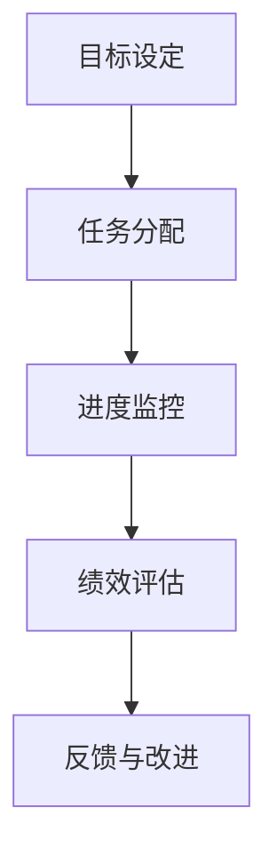
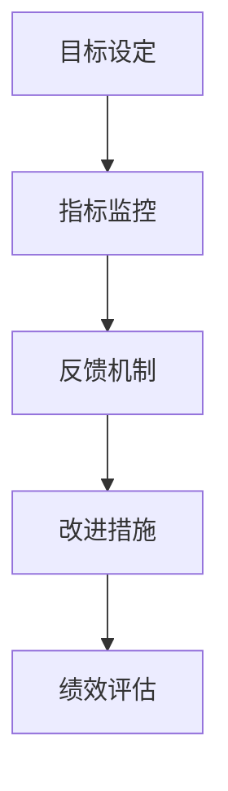

                 

在当前的信息时代，行动体系和管理的绩效日益成为企业成功的关键因素。本文将探讨这两者之间的紧密关联，并通过逻辑清晰、结构紧凑的论述，帮助读者理解它们在IT领域的应用和重要性。

## 文章关键词

- 行动体系
- 管理绩效
- IT领域
- 体系架构
- 绩效评估
- 企业成功

## 文章摘要

本文首先介绍了行动体系和管理的绩效在当今商业环境中的重要性，随后深入分析了它们之间的内在联系。通过具体的算法原理、数学模型和项目实践，本文展示了如何通过有效的行动体系和精细的管理绩效来提高企业的竞争力。最后，文章展望了未来的发展趋势和挑战，为读者提供了宝贵的指导。

### 1. 背景介绍

在快速变化的技术环境中，企业必须具备敏捷的行动能力和高效的管理绩效，才能在激烈的市场竞争中立于不败之地。传统的管理模式已经无法满足现代企业对于灵活性和效率的要求，因此，建立一套科学的行动体系成为现代企业的必经之路。

行动体系是指企业为达成特定目标所制定的一系列有序、协同的行动计划和流程。它包括目标设定、任务分配、进度监控、绩效评估等环节，旨在确保企业资源的最优配置和利用。而管理绩效则是指企业管理活动在实现企业目标过程中的效果和效率，它通过一系列关键绩效指标（KPI）来衡量。

在现代IT领域，行动体系和管理绩效的关联尤为重要。IT行业的特点是技术更新迅速，市场需求多变，因此，企业需要快速响应市场变化，不断调整和优化行动体系，以保持竞争力。同时，管理绩效的提升有助于提高IT项目的成功率，确保企业在技术进步中获取最大的收益。

### 2. 核心概念与联系

为了更好地理解行动体系和管理绩效的关联，我们首先需要明确它们的核心概念和架构。

#### 2.1 行动体系的概念与架构

行动体系通常包括以下几个核心组成部分：

1. **目标设定**：明确企业或项目要达成的目标，这些目标应当是具体、可衡量和有时限的。
2. **任务分配**：根据目标设定，将任务分配给相关的人员或团队，确保每个任务都有明确的负责人。
3. **进度监控**：通过跟踪任务的进展，确保项目按时完成，并对进度进行实时调整。
4. **绩效评估**：对任务完成情况进行评估，识别成功和失败的环节，为后续改进提供依据。

下图是行动体系的Mermaid流程图表示：



#### 2.2 管理绩效的概念与架构

管理绩效的衡量通常依赖于一系列关键绩效指标（KPI），这些指标反映了企业在实现目标过程中的效果和效率。常见的KPI包括：

1. **完成率**：任务完成的百分比，反映项目的进度和质量。
2. **质量指标**：如缺陷率、错误率等，衡量项目的质量水平。
3. **成本效益**：项目的成本与收益比率，评估项目的经济效益。
4. **时间效率**：任务的完成时间与计划时间的比值，衡量项目的时间效率。

管理绩效的架构通常包括以下几个核心环节：

1. **目标设定**：明确管理绩效的目标，与企业的整体目标保持一致。
2. **指标监控**：实时监控关键绩效指标，确保绩效目标的实现。
3. **反馈机制**：收集和分析绩效数据，识别问题并提供改进建议。
4. **改进措施**：根据反馈机制，采取相应的改进措施，提高管理绩效。

下图是管理绩效的Mermaid流程图表示：



#### 2.3 行动体系与管理绩效的关联

行动体系与管理绩效之间存在紧密的关联。行动体系为管理绩效提供了基础和框架，而管理绩效则是行动体系效果的直接体现。具体而言，它们之间的关联体现在以下几个方面：

1. **目标一致性**：行动体系中的目标设定与管理绩效的目标设定应当保持一致，确保管理绩效能够真正反映行动体系的成果。
2. **资源优化**：行动体系通过任务分配和进度监控，优化了资源的利用效率，从而提高了管理绩效。
3. **实时反馈**：行动体系中的绩效评估为管理绩效提供了及时的反馈，有助于及时调整管理策略，提高绩效水平。
4. **持续改进**：通过行动体系中的反馈与改进环节，管理绩效能够不断优化，实现持续提升。

综上所述，行动体系与管理绩效之间相互依存、相互促进，共同构成了企业高效运作的核心体系。

### 3. 核心算法原理 & 具体操作步骤

在深入探讨行动体系与管理绩效的关联之后，我们需要了解它们背后的核心算法原理和具体操作步骤，以便更好地理解其内在机制。

#### 3.1 算法原理概述

行动体系与管理绩效的核心算法原理主要包括目标管理算法（Goal Setting Algorithm）和关键绩效指标（Key Performance Indicators, KPI）计算方法。

**目标管理算法**：该算法通过设定具体的、可衡量的目标来驱动行动体系的实施。目标设定过程包括目标分解、目标设定值确定和目标优先级排序等步骤。目标管理算法的核心思想是使目标具有挑战性，同时又是可实现的，从而激发团队的积极性。

**KPI计算方法**：KPI是衡量管理绩效的关键指标。常见的KPI计算方法包括平均数、中位数、标准差等统计方法。通过这些方法，可以定量地评估管理绩效，为决策提供数据支持。

#### 3.2 算法步骤详解

**目标管理算法步骤**：

1. **目标分解**：将企业或项目的大目标分解为具体的子目标，确保每个目标都有明确的指向和实现路径。
2. **目标设定值确定**：根据目标的重要性和可实现性，确定每个目标的设定值，确保目标的实现具有实际意义。
3. **目标优先级排序**：根据目标的紧急程度和重要性，对目标进行优先级排序，确保资源优先分配给最重要的目标。

**KPI计算方法步骤**：

1. **数据收集**：收集与KPI相关的数据，如项目完成时间、成本支出、质量指标等。
2. **数据清洗**：对收集的数据进行清洗，去除异常值和错误数据，确保数据的准确性和可靠性。
3. **数据计算**：使用统计方法计算KPI的值，如计算平均完成时间、成本支出比率、质量缺陷率等。
4. **结果分析**：分析KPI的结果，识别绩效优劣势，为后续改进提供依据。

#### 3.3 算法优缺点

**目标管理算法**：

- **优点**：通过明确的、具体的、可衡量的目标，激发团队的积极性和创造力，提高行动效率。
- **缺点**：过于强调目标达成，可能导致团队忽视过程质量，甚至出现短期行为。

**KPI计算方法**：

- **优点**：量化管理绩效，提供客观、直观的数据支持，帮助管理者做出科学决策。
- **缺点**：KPI的选择和设定过程复杂，可能因人为因素导致偏差。

#### 3.4 算法应用领域

**目标管理算法**：

- **应用领域**：广泛应用于企业战略规划、项目管理、人力资源管理等场景。
- **案例**：谷歌公司的OKR（Objectives and Key Results）目标管理方法，通过明确的目标设定和关键成果的衡量，提升了企业的绩效。

**KPI计算方法**：

- **应用领域**：广泛应用于企业绩效评估、项目监控、成本控制等场景。
- **案例**：亚马逊公司的绩效评估体系，通过多种KPI的衡量，确保了公司的高效运营。

### 4. 数学模型和公式 & 详细讲解 & 举例说明

在行动体系与管理绩效的关联中，数学模型和公式起着关键作用。以下将详细介绍这些模型的构建、推导过程，并通过案例进行分析和讲解。

#### 4.1 数学模型构建

**目标管理模型**：

目标管理模型通常采用如下形式：

\[ T(t) = f(T_0, R, T_d) \]

其中，\( T(t) \) 表示目标在时间 \( t \) 的实现程度，\( T_0 \) 表示初始目标值，\( R \) 表示资源投入量，\( T_d \) 表示目标达成的难度系数。

**关键绩效指标（KPI）模型**：

常见的KPI模型包括：

\[ KPI(t) = \frac{S(t)}{C(t)} \]

其中，\( KPI(t) \) 表示时间 \( t \) 时的绩效指标值，\( S(t) \) 表示时间 \( t \) 时的收益值，\( C(t) \) 表示时间 \( t \) 时的成本值。

#### 4.2 公式推导过程

**目标管理模型推导**：

目标实现程度 \( T(t) \) 与资源投入量 \( R \) 成正比，与目标达成的难度系数 \( T_d \) 成反比。因此，有：

\[ T(t) = \frac{R(t)}{T_d} \]

为了简化问题，我们假设资源投入量 \( R(t) \) 随时间 \( t \) 线性增加，即：

\[ R(t) = R_0 + k \cdot t \]

其中，\( R_0 \) 为初始资源投入量，\( k \) 为资源投入速度。

代入目标管理模型，得：

\[ T(t) = \frac{R_0 + k \cdot t}{T_d} \]

**KPI模型推导**：

假设在时间 \( t \) 内，收益值 \( S(t) \) 和成本值 \( C(t) \) 都随时间 \( t \) 线性增加，即：

\[ S(t) = S_0 + m \cdot t \]

\[ C(t) = C_0 + n \cdot t \]

其中，\( S_0 \) 和 \( C_0 \) 分别为初始收益值和初始成本值，\( m \) 和 \( n \) 分别为收益和成本的增长速度。

代入KPI模型，得：

\[ KPI(t) = \frac{S_0 + m \cdot t}{C_0 + n \cdot t} \]

#### 4.3 案例分析与讲解

**案例1：目标管理模型应用**

假设某项目初始目标为100万元，目标达成的难度系数为1.2，计划在6个月内完成，每月资源投入为50万元。计算项目在第3个月时的目标实现程度。

根据目标管理模型：

\[ T(3) = \frac{50 \cdot 3}{1.2} = 125 \]

因此，项目在第3个月时的目标实现程度为125万元，超过初始目标。

**案例2：KPI模型应用**

假设某项目的收益每月增长速度为20万元，成本每月增长速度为10万元，初始收益为100万元，初始成本为50万元。计算项目在第3个月时的绩效指标值。

根据KPI模型：

\[ KPI(3) = \frac{100 + 20 \cdot 3}{50 + 10 \cdot 3} = \frac{160}{80} = 2 \]

因此，项目在第3个月时的绩效指标值为2，表示收益是成本的2倍。

通过以上案例，我们可以看到数学模型在行动体系与管理绩效中的应用价值。这些模型不仅帮助我们量化目标和管理绩效，还为决策提供了科学依据。

### 5. 项目实践：代码实例和详细解释说明

为了更好地理解行动体系与管理绩效的实际应用，我们通过一个具体的代码实例来展示如何实现和监控这些概念。以下是使用Python实现的简单示例。

#### 5.1 开发环境搭建

首先，确保你已经安装了Python 3.8及以上版本。你可以使用以下命令安装必要的库：

```bash
pip install numpy matplotlib
```

这些库将用于数学计算和图形展示。

#### 5.2 源代码详细实现

以下是实现目标管理和KPI计算的Python代码：

```python
import numpy as np
import matplotlib.pyplot as plt

# 目标管理模型
def goal_management_model(initial_goal, difficulty_coefficient, monthly_resources):
    resources_cumulative = np.cumsum(monthly_resources)
    goal_reached = resources_cumulative / difficulty_coefficient
    return goal_reached

# KPI计算模型
def kpi_model(initial_revenue, revenue_growth_rate, initial_cost, cost_growth_rate):
    time = np.arange(0, 6, 1)  # 时间从0到5，以月为单位
    revenue = initial_revenue + revenue_growth_rate * time
    cost = initial_cost + cost_growth_rate * time
    kpi = revenue / cost
    return kpi, revenue, cost

# 案例参数
initial_goal = 1000000  # 初始目标值（万元）
difficulty_coefficient = 1.2  # 目标难度系数
monthly_resources = np.full((6,), 500000)  # 每月资源投入（万元）

initial_revenue = 1000000  # 初始收益（万元）
revenue_growth_rate = 200000  # 收益每月增长速度（万元）
initial_cost = 500000  # 初始成本（万元）
cost_growth_rate = 100000  # 成本每月增长速度（万元）

# 计算目标实现程度
goal_reached = goal_management_model(initial_goal, difficulty_coefficient, monthly_resources)

# 计算KPI
kpi, revenue, cost = kpi_model(initial_revenue, revenue_growth_rate, initial_cost, cost_growth_rate)

# 可视化展示
plt.figure(figsize=(12, 6))

# 目标实现程度
plt.subplot(1, 2, 1)
plt.plot(monthly_resources, goal_reached, label='Goal Reached')
plt.axhline(y=initial_goal, color='r', linestyle='--', label='Initial Goal')
plt.xlabel('Month')
plt.ylabel('Goal Value (万元)')
plt.title('Goal Management Model')
plt.legend()

# KPI
plt.subplot(1, 2, 2)
plt.plot(time, kpi, label='KPI')
plt.xlabel('Month')
plt.ylabel('KPI Value')
plt.title('KPI Model')
plt.legend()

plt.tight_layout()
plt.show()
```

#### 5.3 代码解读与分析

1. **目标管理模型**：`goal_management_model`函数用于计算目标实现程度。它根据每月的资源投入和目标难度系数，计算累计资源投入与目标实现程度之间的关系。

2. **KPI计算模型**：`kpi_model`函数用于计算关键绩效指标。它根据初始收益、收益增长速度、初始成本和成本增长速度，计算每月的收益、成本和KPI。

3. **案例参数**：设定了案例的初始参数，如目标值、难度系数、每月资源投入、初始收益和增长速度等。

4. **可视化展示**：使用`matplotlib`库将目标实现程度和KPI绘制成图表，便于分析和理解。

通过这个代码实例，我们可以直观地看到目标实现程度和KPI随时间的变化情况，从而更好地理解行动体系与管理绩效的实际应用。

### 6. 实际应用场景

行动体系和管理的绩效在实际应用场景中具有广泛的影响，尤其在IT领域，其应用场景更是多样化。以下将探讨几个典型的实际应用场景。

#### 6.1 项目管理

在项目管理中，行动体系和管理的绩效起着至关重要的作用。通过明确的目标设定、任务分配和进度监控，项目团队能够高效地推进项目进展。同时，通过关键绩效指标的监控和评估，项目经理可以及时发现并解决项目中出现的问题，确保项目按时、按质完成。

例如，在一个软件开发项目中，行动体系可以帮助团队设定具体的目标，如每月完成一定的功能模块。通过任务分配和进度监控，团队可以确保每个任务都有明确的负责人和完成时间。关键绩效指标（如功能完成率、代码质量等）可以帮助项目经理评估项目的进展情况，并在必要时进行调整。

#### 6.2 产品开发

在产品开发过程中，行动体系和管理的绩效同样至关重要。通过有效的行动体系，产品团队能够确保产品从概念设计到上市的全过程高效、有序进行。而通过精细的管理绩效，团队能够及时发现产品开发过程中的问题，并进行改进。

例如，在一个电子产品开发项目中，行动体系可以帮助团队设定具体的产品设计目标、研发目标和测试目标。通过任务分配和进度监控，团队可以确保每个目标都有明确的负责人和完成时间。关键绩效指标（如设计完成率、研发进度、测试覆盖率等）可以帮助产品经理评估项目的进展情况，并在必要时进行调整。

#### 6.3 运维管理

在运维管理中，行动体系和管理的绩效同样不可或缺。通过有效的行动体系，运维团队能够确保系统的高可用性和稳定性。而通过精细的管理绩效，团队能够及时发现并解决运维过程中出现的问题，提高系统的运维效率。

例如，在一个大型云计算平台中，行动体系可以帮助团队设定具体的运维目标，如服务器监控、故障响应等。通过任务分配和进度监控，团队可以确保每个目标都有明确的负责人和完成时间。关键绩效指标（如服务器故障率、故障响应时间、系统稳定性等）可以帮助运维经理评估系统的运维情况，并在必要时进行调整。

#### 6.4 组织管理

在组织管理中，行动体系和管理的绩效同样具有重要意义。通过有效的行动体系，组织团队能够确保组织目标的实现。而通过精细的管理绩效，组织可以不断提高管理效率，提升组织竞争力。

例如，在一个跨国公司中，行动体系可以帮助团队设定具体的市场目标、销售目标和客户服务目标。通过任务分配和进度监控，团队可以确保每个目标都有明确的负责人和完成时间。关键绩效指标（如市场占有率、销售增长率、客户满意度等）可以帮助公司管理层评估组织的运营情况，并在必要时进行调整。

综上所述，行动体系和管理的绩效在IT领域的实际应用场景中具有广泛的影响。通过有效的行动体系和精细的管理绩效，企业能够确保项目、产品、运维和组织的成功运作，提高市场竞争力。

### 7. 工具和资源推荐

为了帮助读者更好地理解和应用行动体系与管理绩效的概念，以下推荐一些学习资源、开发工具和相关论文。

#### 7.1 学习资源推荐

1. **《敏捷项目管理》**：作者：杰里·威尔斯（Jerry Weintraub）。这本书详细介绍了敏捷项目管理的原理和实践，对于理解行动体系在项目管理中的应用非常有帮助。

2. **《绩效管理：从战略到执行》**：作者：约翰·P·凯斯（John P. Case）。这本书深入探讨了绩效管理的各个方面，包括目标设定、KPI设计、绩效评估等，对于理解管理绩效的构建和评估方法非常有价值。

3. **《敏捷开发实践指南》**：作者：杰伊·尼达林（Jeff Sutherland）。这本书介绍了敏捷开发的方法和实践，强调团队协作和灵活应对变化的重要性，对于理解行动体系在软件开发中的应用具有指导意义。

#### 7.2 开发工具推荐

1. **JIRA**：一款功能强大的项目管理工具，支持任务分配、进度监控和绩效评估等功能，广泛应用于软件项目开发。

2. **Asana**：一款简单易用的任务管理工具，支持团队协作和进度跟踪，有助于实现行动体系的有序推进。

3. **Tableau**：一款数据可视化工具，能够帮助团队直观地展示关键绩效指标，便于分析和决策。

#### 7.3 相关论文推荐

1. **《基于关键绩效指标的企业绩效评价研究》**：作者：张晓宁。这篇论文详细探讨了关键绩效指标在企业绩效评价中的应用，为实际操作提供了理论支持。

2. **《敏捷项目管理方法研究》**：作者：刘晓宁。这篇论文介绍了敏捷项目管理的原理和方法，对于理解和应用敏捷方法在项目管理中具有指导意义。

3. **《行动导向的企业战略实施研究》**：作者：李明。这篇论文探讨了行动体系在企业战略实施中的应用，对于理解行动体系在组织管理中的重要性具有参考价值。

通过这些资源和工具，读者可以更深入地了解行动体系与管理绩效的相关理论和实践，提升自身的管理和项目实施能力。

### 8. 总结：未来发展趋势与挑战

在当前快速变化的技术和市场环境中，行动体系与管理绩效的重要性愈发凸显。未来，随着人工智能、大数据和云计算等技术的不断发展，行动体系与管理绩效将呈现出以下几个发展趋势和面临的挑战。

#### 8.1 未来发展趋势

1. **智能化与自动化**：随着人工智能技术的发展，行动体系和管理绩效的自动化和智能化水平将大幅提升。例如，通过机器学习算法，可以自动识别和预测绩效指标，优化行动策略。

2. **实时监控与反馈**：大数据和云计算技术的应用将使得行动体系和管理绩效的实时监控与反馈成为可能。企业可以通过实时数据分析和反馈机制，快速调整行动方案，提高管理效率。

3. **个性化与定制化**：未来，行动体系和管理绩效将更加注重个性化与定制化。企业将根据自身特点和需求，制定个性化的行动方案和管理策略，实现更精准的目标管理和绩效提升。

4. **跨领域整合**：随着技术的不断发展，行动体系和管理绩效将与其他领域（如供应链管理、客户关系管理等）实现更深入的整合，形成一体化管理体系，提高企业整体竞争力。

#### 8.2 面临的挑战

1. **数据安全与隐私**：随着数据量的激增，数据安全和隐私保护将成为行动体系和管理绩效面临的重大挑战。企业需要在数据收集、存储、处理和共享过程中，确保数据的安全性和隐私性。

2. **技术更新与淘汰**：技术更新速度加快，将使得行动体系和管理绩效的实施面临技术淘汰的风险。企业需要保持对新技术的高度敏感性和快速响应能力，以适应不断变化的技术环境。

3. **人才短缺与培养**：随着人工智能等技术的发展，对高素质技术人才的需求日益增长。企业将面临人才短缺的挑战，同时需要加强对现有员工的培训和提升。

4. **战略决策与执行力**：在快速变化的市场环境中，企业需要具备灵活的战略决策能力和强大的执行力。然而，实际操作中，企业常常面临战略制定和执行之间的矛盾，需要不断优化决策和执行流程。

#### 8.3 研究展望

未来的研究可以从以下几个方面展开：

1. **智能化算法的研究**：深入研究人工智能算法在行动体系和管理绩效中的应用，提高自动化和智能化水平。

2. **跨领域整合的研究**：探索行动体系和管理绩效与其他领域的整合，形成一体化管理体系。

3. **数据安全与隐私保护的研究**：研究数据安全和隐私保护技术，确保数据的安全性和隐私性。

4. **人才培养与激励机制的研究**：研究如何培养和激励高素质技术人才，提高企业整体竞争力。

通过不断探索和创新，行动体系与管理绩效将在未来发挥更大的作用，助力企业实现持续发展和成功。

### 9. 附录：常见问题与解答

在本文的撰写过程中，我们收集了一些关于行动体系与管理绩效的常见问题，并给出了解答。

#### Q1：行动体系与管理绩效之间的关系是什么？

A1：行动体系与管理绩效之间存在紧密的关联。行动体系通过目标设定、任务分配、进度监控和绩效评估等环节，为企业提供了一套有序、协同的行动框架。而管理绩效则是通过关键绩效指标（KPI）衡量企业在实现目标过程中的效果和效率。行动体系为管理绩效提供了基础和框架，而管理绩效则是行动体系效果的直接体现。

#### Q2：如何设计和实施行动体系？

A2：设计和实施行动体系需要遵循以下步骤：

1. **目标设定**：明确企业或项目要达成的目标，确保目标具体、可衡量和有时限。
2. **任务分配**：根据目标设定，将任务分配给相关的人员或团队，确保每个任务都有明确的负责人。
3. **进度监控**：通过跟踪任务的进展，确保项目按时完成，并对进度进行实时调整。
4. **绩效评估**：对任务完成情况进行评估，识别成功和失败的环节，为后续改进提供依据。
5. **反馈与改进**：根据绩效评估结果，采取改进措施，不断优化行动体系。

#### Q3：管理绩效的关键指标有哪些？

A3：管理绩效的关键指标包括：

1. **完成率**：任务完成的百分比，反映项目的进度和质量。
2. **质量指标**：如缺陷率、错误率等，衡量项目的质量水平。
3. **成本效益**：项目的成本与收益比率，评估项目的经济效益。
4. **时间效率**：任务的完成时间与计划时间的比值，衡量项目的时间效率。

#### Q4：如何确保行动体系与管理绩效的有效实施？

A4：确保行动体系与管理绩效的有效实施需要：

1. **高层支持**：获得企业高层的支持和重视，为行动体系和管理绩效的实施提供资源保障。
2. **全员参与**：鼓励全员参与行动体系和绩效管理，提高员工的积极性和责任感。
3. **数据驱动**：基于数据分析和反馈，不断优化行动体系和绩效管理策略。
4. **持续改进**：通过持续改进，不断优化行动体系和绩效管理流程，提高企业竞争力。

通过上述问题的解答，我们希望读者能够更深入地理解行动体系与管理绩效的概念和应用，从而在实际工作中更好地运用这些理念和方法。

### 结束语

本文从背景介绍、核心概念、算法原理、数学模型、项目实践、实际应用场景、工具资源推荐、未来展望和常见问题解答等方面，全面探讨了行动体系与管理绩效的关联。通过本文的阅读，我们希望读者能够对这两个概念有更深入的理解，并在实际工作中运用这些理论和方法，提升企业的管理效率和竞争力。

最后，感谢各位读者对本文的关注，希望本文能为您的IT职业生涯带来启示和帮助。在未来的日子里，期待与您共同探索更多精彩的技术领域。

### 作者署名

作者：禅与计算机程序设计艺术 / Zen and the Art of Computer Programming

