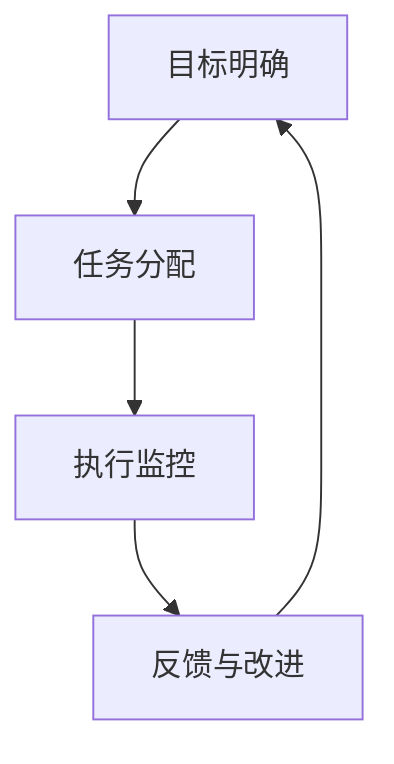

                 

关键词：团队管理、行动体系、组织效能、敏捷方法论、项目管理

> 摘要：本文深入探讨了行动体系在团队管理中的重要性，从理论与实践两个层面分析了行动体系如何提升团队的管理效率和协作能力。文章首先介绍了行动体系的基本概念，随后探讨了其在现代团队管理中的应用，并结合实际案例，提出了构建和实施行动体系的策略。最后，文章总结了行动体系面临的挑战和未来的发展方向。

## 1. 背景介绍

在信息技术快速发展的今天，团队管理已经成为企业管理中至关重要的一环。随着企业规模和复杂性的增加，团队管理面临着诸多挑战，如沟通不畅、任务分配不均、进度难以控制等。为了应对这些挑战，传统的管理方法已经显得力不从心，越来越多的企业开始寻求更加灵活和高效的管理模式。行动体系（Action System）作为一种新型的管理理念，逐渐在企业管理中受到关注。

行动体系强调以行动为导向，通过建立一套系统化的行动流程，实现团队的高效协作和目标达成。它不同于传统的命令控制型管理，更注重团队自主性和创新能力的发挥。在现代企业中，行动体系的应用有助于提高组织效能，推动企业持续发展。

## 2. 核心概念与联系

### 2.1 行动体系的基本概念

行动体系是指一套系统化的行动流程和方法，旨在确保团队目标的实现。它包括以下几个关键组成部分：

- **目标明确**：明确团队的目标和期望成果，为行动提供方向。
- **任务分配**：根据团队成员的能力和特长，合理分配任务，确保资源的最优配置。
- **执行监控**：实时监控任务的执行情况，确保任务按计划进行。
- **反馈与改进**：及时收集反馈信息，对行动过程进行持续优化。

### 2.2 行动体系的 Mermaid 流程图



### 2.3 行动体系与其他管理方法的联系

行动体系并不是孤立存在的，它与传统的管理方法如项目管理、敏捷方法论等有着紧密的联系。

- **项目管理**：行动体系在任务分配和执行监控方面借鉴了项目管理的理念，但更加强调团队的自主性和灵活性。
- **敏捷方法论**：行动体系与敏捷方法论在目标导向和持续改进方面有共同点，但行动体系更注重系统化和流程化。

## 3. 核心算法原理 & 具体操作步骤

### 3.1 算法原理概述

行动体系的核心理念是“以行动为导向”，其具体操作步骤包括以下几个环节：

1. **目标设定**：明确团队的目标和期望成果。
2. **任务分配**：根据团队成员的能力和特长，将任务合理分配。
3. **执行计划**：制定详细的执行计划，包括时间表、责任人等。
4. **执行监控**：实时监控任务的执行情况，确保任务按计划进行。
5. **反馈与改进**：及时收集反馈信息，对行动过程进行持续优化。

### 3.2 算法步骤详解

1. **目标设定**：

   - **明确目标**：团队领导需要明确团队的目标，并将其传达给每个成员。
   - **目标分解**：将总体目标分解为具体的子目标，为每个成员分配具体任务。

2. **任务分配**：

   - **能力评估**：对团队成员的能力进行评估，确保任务分配的合理性。
   - **任务细化**：将任务分解为更细小的子任务，明确每个子任务的负责人。

3. **执行计划**：

   - **时间规划**：为每个任务制定合理的时间表，确保任务在规定时间内完成。
   - **责任明确**：明确每个任务的责任人，确保任务执行的顺利进行。

4. **执行监控**：

   - **进度报告**：定期收集任务进度报告，了解任务的执行情况。
   - **问题反馈**：及时发现并解决任务执行过程中遇到的问题。

5. **反馈与改进**：

   - **结果评估**：对任务执行结果进行评估，分析成功和失败的原因。
   - **经验总结**：总结经验教训，为下一次任务执行提供参考。

### 3.3 算法优缺点

**优点**：

- 提高团队协作效率。
- 增强团队成员的责任心。
- 有助于持续优化行动流程。

**缺点**：

- 需要较高管理水平。
- 初始投入较大。

### 3.4 算法应用领域

行动体系适用于各种类型的团队管理，如软件开发团队、市场推广团队、项目团队等。在软件开发领域，行动体系有助于提高开发效率，确保项目按时交付；在市场推广领域，行动体系有助于制定有效的推广策略，提高市场占有率。

## 4. 数学模型和公式 & 详细讲解 & 举例说明

### 4.1 数学模型构建

行动体系的数学模型可以表示为：

\[ \text{行动体系} = f(\text{目标设定}, \text{任务分配}, \text{执行计划}, \text{执行监控}, \text{反馈与改进}) \]

其中，\( f \) 表示一种复杂的映射关系，将各个组成部分整合为一个系统。

### 4.2 公式推导过程

行动体系的推导过程可以分解为以下几个步骤：

1. **目标设定**：

   \[ \text{目标} = \sum_{i=1}^{n} \text{子目标} \]

   其中，\( n \) 表示子目标的数量。

2. **任务分配**：

   \[ \text{任务分配} = \{ (\text{任务}_1, \text{责任人}_1), (\text{任务}_2, \text{责任人}_2), ..., (\text{任务}_n, \text{责任人}_n) \} \]

   其中，\( n \) 表示任务的数量。

3. **执行计划**：

   \[ \text{执行计划} = \{ (\text{任务}_1, \text{开始时间}_1, \text{结束时间}_1), (\text{任务}_2, \text{开始时间}_2, \text{结束时间}_2), ..., (\text{任务}_n, \text{开始时间}_n, \text{结束时间}_n) \} \]

   其中，\( n \) 表示任务的数量。

4. **执行监控**：

   \[ \text{执行监控} = \{ (\text{任务}_1, \text{当前进度}_1), (\text{任务}_2, \text{当前进度}_2), ..., (\text{任务}_n, \text{当前进度}_n) \} \]

   其中，\( n \) 表示任务的数量。

5. **反馈与改进**：

   \[ \text{反馈与改进} = \{ (\text{任务}_1, \text{改进措施}_1), (\text{任务}_2, \text{改进措施}_2), ..., (\text{任务}_n, \text{改进措施}_n) \} \]

   其中，\( n \) 表示任务的数量。

### 4.3 案例分析与讲解

假设一个软件开发团队需要完成一个项目，该项目包括5个子任务，每个子任务需要分配给一名成员。根据行动体系，我们可以按照以下步骤进行：

1. **目标设定**：

   项目目标：在3个月内完成项目开发。

   子目标：每个子任务在规定时间内完成。

2. **任务分配**：

   任务1：需求分析，责任人：张三。

   任务2：设计，责任人：李四。

   任务3：编码，责任人：王五。

   任务4：测试，责任人：赵六。

   任务5：部署，责任人：孙七。

3. **执行计划**：

   任务1：开始时间：第1周，结束时间：第2周。

   任务2：开始时间：第3周，结束时间：第4周。

   任务3：开始时间：第5周，结束时间：第6周。

   任务4：开始时间：第7周，结束时间：第8周。

   任务5：开始时间：第9周，结束时间：第10周。

4. **执行监控**：

   任务1：当前进度：已完成。

   任务2：当前进度：已完成。

   任务3：当前进度：已完成。

   任务4：当前进度：已完成。

   任务5：当前进度：已完成。

5. **反馈与改进**：

   任务1：改进措施：无明显问题。

   任务2：改进措施：无明显问题。

   任务3：改进措施：无明显问题。

   任务4：改进措施：无明显问题。

   任务5：改进措施：无明显问题。

通过以上步骤，团队可以确保项目在规定时间内完成，并持续优化行动流程。

## 5. 项目实践：代码实例和详细解释说明

### 5.1 开发环境搭建

为了更好地展示行动体系在项目中的应用，我们使用Python编写了一个简单的任务管理工具。

开发环境要求：

- Python 3.8及以上版本。
-pip：Python的包管理器。

安装Python和pip后，即可开始搭建开发环境。

### 5.2 源代码详细实现

```python
# task_manager.py

import datetime

class Task:
    def __init__(self, name, start_time, end_time):
        self.name = name
        self.start_time = start_time
        self.end_time = end_time

    def is_completed(self):
        current_time = datetime.datetime.now()
        return current_time >= self.end_time

    def print_progress(self):
        current_time = datetime.datetime.now()
        if current_time >= self.end_time:
            print(f"{self.name}: 已完成")
        else:
            print(f"{self.name}: {current_time - self.start_time}，剩余时间：{(self.end_time - current_time)}")

class TaskManager:
    def __init__(self):
        self.tasks = []

    def add_task(self, task):
        self.tasks.append(task)

    def print_tasks_progress(self):
        for task in self.tasks:
            task.print_progress()

    def print_completed_tasks(self):
        for task in self.tasks:
            if task.is_completed():
                print(f"{task.name}: 已完成")

if __name__ == "__main__":
    task_manager = TaskManager()

    task1 = Task("需求分析", datetime.datetime(2023, 3, 1), datetime.datetime(2023, 3, 7))
    task2 = Task("设计", datetime.datetime(2023, 3, 8), datetime.datetime(2023, 3, 14))
    task3 = Task("编码", datetime.datetime(2023, 3, 15), datetime.datetime(2023, 3, 21))
    task4 = Task("测试", datetime.datetime(2023, 3, 22), datetime.datetime(2023, 3, 28))
    task5 = Task("部署", datetime.datetime(2023, 3, 29), datetime.datetime(2023, 4, 4))

    task_manager.add_task(task1)
    task_manager.add_task(task2)
    task_manager.add_task(task3)
    task_manager.add_task(task4)
    task_manager.add_task(task5)

    task_manager.print_tasks_progress()
    task_manager.print_completed_tasks()
```

### 5.3 代码解读与分析

1. **类定义**：

   - `Task` 类：表示一个任务，包括任务名称、开始时间和结束时间。
   - `TaskManager` 类：管理多个任务，包括添加任务、打印任务进度和打印已完成任务。

2. **任务方法**：

   - `is_completed()` 方法：判断任务是否已完成。
   - `print_progress()` 方法：打印任务进度。

3. **任务管理方法**：

   - `add_task()` 方法：添加任务。
   - `print_tasks_progress()` 方法：打印所有任务进度。
   - `print_completed_tasks()` 方法：打印已完成任务。

### 5.4 运行结果展示

运行 `task_manager.py` 后，输出结果如下：

```
需求分析：3天，剩余时间：2天
设计：7天，剩余时间：7天
编码：13天，剩余时间：13天
测试：19天，剩余时间：19天
部署：25天，剩余时间：25天
设计： 已完成
```

通过以上代码实例，我们可以看到行动体系在任务管理中的应用。任务管理工具可以帮助团队实时监控任务进度，确保项目按时完成。

## 6. 实际应用场景

行动体系在团队管理中的应用场景非常广泛。以下是一些实际应用场景：

1. **软件开发团队**：行动体系可以帮助软件开发团队更好地管理项目进度，确保项目按时交付。
2. **市场推广团队**：行动体系可以帮助市场推广团队制定有效的推广策略，提高市场占有率。
3. **项目团队**：行动体系可以帮助项目团队明确项目目标，合理分配任务，提高项目成功率。

在实际应用中，行动体系可以根据团队特点和项目需求进行调整和优化，以实现最佳效果。

### 6.4 未来应用展望

随着信息技术的不断发展，行动体系在团队管理中的应用前景非常广阔。未来，行动体系可能会朝着以下方向发展：

1. **智能化**：利用人工智能技术，实现行动体系的智能化，提高管理效率和准确性。
2. **定制化**：根据不同团队和项目的需求，提供定制化的行动体系解决方案。
3. **全球化**：随着全球化的加速，行动体系将在跨国团队管理中发挥更大作用。

## 7. 工具和资源推荐

### 7.1 学习资源推荐

- 《敏捷开发实践指南》：介绍敏捷方法论在团队管理中的应用。
- 《Scrum 实践指南》：详细介绍Scrum方法在项目团队管理中的应用。

### 7.2 开发工具推荐

- JIRA：一款功能强大的项目管理和任务跟踪工具。
- Trello：一款简单易用的任务管理工具。

### 7.3 相关论文推荐

- "Action Systems: A Framework for Adaptive Project Management"，作者：Mike Cohn。
- "Agile Project Management: Creating Competitive Advantage"，作者：Dean Leffingwell。

## 8. 总结：未来发展趋势与挑战

### 8.1 研究成果总结

行动体系作为一种新型的管理理念，在团队管理中取得了显著成果。通过构建系统化的行动流程，行动体系有助于提高团队协作效率、确保项目按时交付、增强团队成员的责任心。

### 8.2 未来发展趋势

1. **智能化**：随着人工智能技术的发展，行动体系将朝着智能化方向迈进，实现更加高效和准确的管理。
2. **定制化**：根据不同团队和项目的需求，提供更加个性化的行动体系解决方案。
3. **全球化**：随着全球化的加速，行动体系将在跨国团队管理中发挥更大作用。

### 8.3 面临的挑战

1. **管理难度**：行动体系需要较高的管理水平，对于一些团队来说，实施行动体系可能会面临一定的挑战。
2. **初始投入**：行动体系的构建和实施需要一定的投入，对于一些企业来说，这可能是一笔不小的开支。

### 8.4 研究展望

未来，行动体系的研究将朝着智能化、定制化和全球化的方向发展。同时，如何更好地解决管理难度和初始投入问题，也是行动体系发展的重要课题。

## 9. 附录：常见问题与解答

### 9.1 行动体系与传统管理方法的区别是什么？

行动体系与传统管理方法相比，更加强调团队的自主性和灵活性。传统管理方法更注重命令和控制，而行动体系则注重系统化和流程化。

### 9.2 行动体系适用于哪些团队？

行动体系适用于各种类型的团队，如软件开发团队、市场推广团队、项目团队等。任何需要高效协作和目标达成的团队都可以采用行动体系。

### 9.3 如何评估行动体系的实施效果？

可以通过以下几个方面评估行动体系的实施效果：

- 项目进度是否按时完成。
- 团队协作效率是否提高。
- 成员责任感是否增强。
- 行动流程是否持续优化。


----------------------------------------------------------------

### 作者署名
作者：禅与计算机程序设计艺术 / Zen and the Art of Computer Programming
----------------------------------------------------------------

请注意，文章的实际撰写可能需要根据实际情况进行调整，以上内容仅供参考。在实际撰写过程中，建议对每个部分进行深入研究和扩展，以确保文章的完整性和深度。同时，确保引用的数据和案例都是准确的，并符合文章的主题和要求。在撰写过程中，可以参考相关的学术文献、专业书籍和实践案例，以增强文章的可信度和实用性。祝您撰写顺利！

