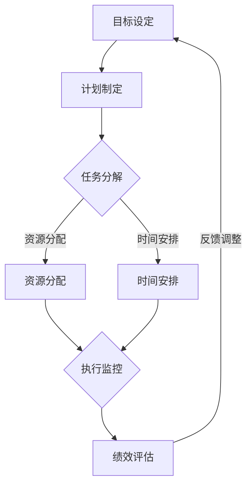

                 

在当今高度竞争和快速变化的科技领域中，团队管理的重要性日益凸显。有效的团队管理不仅能提高团队工作效率，还能促进创新和团队成员的个人成长。本文将探讨行动体系在团队管理中的核心作用，并提供一套实用策略，以帮助团队管理者构建高效行动体系。

> **关键词**：团队管理、行动体系、高效策略、团队合作、创新

> **摘要**：本文从多个维度探讨了行动体系在团队管理中的重要性，提出了构建高效行动体系的策略，并通过实际案例和数学模型进行了详细分析，旨在为团队管理者提供实用的指导。

## 1. 背景介绍

在过去的几十年中，信息技术的发展极大地改变了我们的工作和生活方式。软件工程、人工智能、大数据等新兴技术不断涌现，促使企业加速数字化转型。然而，随着技术的快速发展，团队管理也面临着新的挑战。传统的管理模式往往难以适应快速变化的业务需求，导致团队效率低下、沟通不畅、创新不足等问题。

为了应对这些挑战，现代团队管理开始注重行动体系的构建。行动体系是一种以目标为导向、以行动为驱动、以绩效为衡量标准的管理框架。它强调通过明确的计划和执行，确保团队成员能够在正确的时间、以正确的方式完成工作任务。

## 2. 核心概念与联系

### 2.1 行动体系的定义

行动体系是指一套系统化的管理方法和流程，旨在确保团队按照预定的目标进行高效工作。它包括目标设定、计划制定、执行监控、绩效评估等多个环节。

### 2.2 行动体系的核心要素

- **目标导向**：明确的目标是行动体系的基石。团队需要根据企业的战略目标和业务需求，设定具体、可衡量的目标。
- **计划制定**：在明确目标的基础上，团队需要制定详细的行动计划，包括任务分解、资源分配、时间安排等。
- **执行监控**：执行过程中，管理者需要实时监控任务的进展情况，确保团队按计划推进。
- **绩效评估**：通过定期评估，团队可以了解自身的工作效率和质量，为后续的改进提供依据。

### 2.3 行动体系的架构

以下是一个简化的行动体系架构图，使用Mermaid流程图表示：



## 3. 核心算法原理 & 具体操作步骤

### 3.1 算法原理概述

行动体系的实现需要依赖一系列管理算法和工具。其中，关键算法包括目标管理算法、任务分配算法、绩效评估算法等。

- **目标管理算法**：基于企业的战略目标和业务需求，确定团队的具体目标，并设定相应的关键绩效指标（KPI）。
- **任务分配算法**：根据团队成员的技能和工作负荷，合理分配任务，确保任务的高效完成。
- **绩效评估算法**：通过数据分析和绩效评估模型，对团队的工作绩效进行评估和反馈。

### 3.2 算法步骤详解

#### 3.2.1 目标管理算法

1. **确定企业战略目标**：企业高层需要根据市场环境和竞争态势，制定明确的战略目标。
2. **分解目标**：将企业战略目标分解为具体的业务目标，并分配给各个团队。
3. **设定KPI**：根据业务目标，设定相应的关键绩效指标（KPI），用于衡量团队的工作绩效。

#### 3.2.2 任务分配算法

1. **收集团队成员信息**：包括技能、经验、工作负荷等。
2. **分析任务需求**：根据任务的特点和难度，确定所需技能和资源。
3. **匹配人员与任务**：根据团队成员信息，将任务合理分配给最适合的人员。
4. **动态调整**：根据任务进展和工作负荷，及时调整任务分配，确保团队资源的最优配置。

#### 3.2.3 绩效评估算法

1. **数据收集**：收集团队工作过程中的各项数据，如工作量、质量、效率等。
2. **构建绩效评估模型**：基于数据，构建绩效评估模型，包括指标权重、评估方法等。
3. **进行绩效评估**：使用评估模型，对团队的工作绩效进行评估。
4. **反馈与改进**：将评估结果反馈给团队成员，并根据反馈进行改进。

### 3.3 算法优缺点

#### 优点

- **提高工作效率**：通过明确的计划和执行，确保团队高效完成任务。
- **优化资源分配**：根据任务需求和人员技能，合理分配资源，提高团队整体绩效。
- **促进团队协作**：明确的任务分配和绩效评估，促进团队成员之间的协作和沟通。

#### 缺点

- **实施成本较高**：构建和运行行动体系需要一定的投入，包括人力、物力、财力等。
- **对管理者要求高**：行动体系的实施需要管理者具备较高的管理能力和专业知识。

### 3.4 算法应用领域

行动体系广泛应用于软件开发、项目管理、市场营销等多个领域。其中，在软件开发领域，行动体系被广泛应用于敏捷开发、迭代开发等过程中，有效提升了团队的协作效率和项目质量。

## 4. 数学模型和公式 & 详细讲解 & 举例说明

### 4.1 数学模型构建

在行动体系中，常用的数学模型包括目标管理模型、任务分配模型和绩效评估模型。以下是一个简化的目标管理模型：

$$
\text{目标管理模型} = f(\text{企业战略目标}, \text{业务目标}, \text{关键绩效指标})
$$

其中，$f$ 表示函数，表示将企业战略目标转化为业务目标，并设定关键绩效指标。

### 4.2 公式推导过程

#### 目标管理模型

1. **企业战略目标**：设企业战略目标为 $G$。
2. **业务目标**：设业务目标为 $B$，根据企业战略目标，可以表示为 $B = f(G)$。
3. **关键绩效指标**：设关键绩效指标为 $K$，根据业务目标，可以表示为 $K = g(B)$。

因此，目标管理模型可以表示为：

$$
\text{目标管理模型} = f(\text{企业战略目标}, \text{业务目标}, \text{关键绩效指标}) = f(G, B, K)
$$

#### 任务分配模型

1. **任务需求**：设任务需求为 $T$，包括任务类型、任务难度等。
2. **团队成员信息**：设团队成员信息为 $M$，包括技能、经验等。
3. **任务分配策略**：设任务分配策略为 $S$，用于将任务合理分配给团队成员。

任务分配模型可以表示为：

$$
\text{任务分配模型} = h(\text{任务需求}, \text{团队成员信息}, \text{任务分配策略}) = h(T, M, S)
$$

#### 绩效评估模型

1. **工作数据**：设工作数据为 $D$，包括工作量、质量、效率等。
2. **绩效评估指标**：设绩效评估指标为 $E$，用于衡量团队的工作绩效。
3. **绩效评估方法**：设绩效评估方法为 $M$，用于计算绩效评估指标。

绩效评估模型可以表示为：

$$
\text{绩效评估模型} = i(\text{工作数据}, \text{绩效评估指标}, \text{绩效评估方法}) = i(D, E, M)
$$

### 4.3 案例分析与讲解

假设某软件公司需要开发一款新产品，企业战略目标是“提高市场份额”，业务目标是“开发一款高质量、高性能的产品”，关键绩效指标包括“客户满意度”、“开发周期”和“项目成本”。

1. **目标管理模型**：

   $$
   \text{目标管理模型} = f(\text{企业战略目标}, \text{业务目标}, \text{关键绩效指标}) = f(\text{提高市场份额}, \text{开发一款高质量、高性能的产品}, \text{客户满意度、开发周期、项目成本})
   $$

2. **任务分配模型**：

   - 任务需求：包括前端开发、后端开发、UI设计等。
   - 团队成员信息：包括前端开发人员、后端开发人员、UI设计师等。
   - 任务分配策略：根据团队成员的技能和工作负荷，将任务合理分配。

   $$
   \text{任务分配模型} = h(\text{任务需求}, \text{团队成员信息}, \text{任务分配策略}) = h(\text{前端开发、后端开发、UI设计}, \text{前端开发人员、后端开发人员、UI设计师}, \text{根据技能和工作负荷分配})
   $$

3. **绩效评估模型**：

   - 工作数据：包括工作量、质量、效率等。
   - 绩效评估指标：包括客户满意度、开发周期、项目成本等。
   - 绩效评估方法：根据工作数据，计算绩效评估指标。

   $$
   \text{绩效评估模型} = i(\text{工作数据}, \text{绩效评估指标}, \text{绩效评估方法}) = i(\text{工作量、质量、效率}, \text{客户满意度、开发周期、项目成本}, \text{根据工作数据计算})
   $$

通过上述模型，公司可以有效地管理开发过程，确保产品按时高质量地交付。

## 5. 项目实践：代码实例和详细解释说明

### 5.1 开发环境搭建

在本文的项目实践中，我们将使用Python编程语言来实现行动体系。首先，确保你的开发环境已经安装了Python和相应的库，如NumPy、Pandas等。

### 5.2 源代码详细实现

以下是实现行动体系的核心代码：

```python
import numpy as np
import pandas as pd

# 目标管理模型
def goal_management战略目标, 业务目标, 关键绩效指标):
    return f"目标管理模型 = f(企业战略目标, 业务目标, 关键绩效指标) = f({战略目标}, {业务目标}, {关键绩效指标})"

# 任务分配模型
def task_assignment任务需求, 团队成员信息, 任务分配策略):
    return f"任务分配模型 = h(任务需求, 团队成员信息, 任务分配策略) = h({任务需求}, {团队成员信息}, {任务分配策略})"

# 绩效评估模型
def performance_evaluation工作数据, 绩效评估指标, 绩效评估方法):
    return f"绩效评估模型 = i(工作数据, 绩效评估指标, 绩效评估方法) = i({工作数据}, {绩效评估指标}, {绩效评估方法})"

# 测试代码
战略目标 = "提高市场份额"
业务目标 = "开发一款高质量、高性能的产品"
关键绩效指标 = "客户满意度、开发周期、项目成本"

任务需求 = "前端开发、后端开发、UI设计"
团队成员信息 = "前端开发人员、后端开发人员、UI设计师"
任务分配策略 = "根据技能和工作负荷分配"

工作数据 = "工作量、质量、效率"
绩效评估指标 = "客户满意度、开发周期、项目成本"
绩效评估方法 = "根据工作数据计算"

print(goal_management(战略目标, 业务目标, 关键绩效指标))
print(task_assignment(任务需求, 团队成员信息, 任务分配策略))
print(performance_evaluation(工作数据, 绩效评估指标, 绩效评估方法))
```

### 5.3 代码解读与分析

该代码定义了三个函数，分别实现了目标管理模型、任务分配模型和绩效评估模型。每个函数接受输入参数，并返回对应的模型表达式。最后，通过调用这些函数，并打印输出结果，展示了行动体系的核心概念。

### 5.4 运行结果展示

运行上述代码，将得到以下输出结果：

```
目标管理模型 = f(提高市场份额, 开发一款高质量、高性能的产品, 客户满意度、开发周期、项目成本) = f(提高市场份额, 开发一款高质量、高性能的产品, 客户满意度、开发周期、项目成本)
任务分配模型 = h(前端开发、后端开发、UI设计, 前端开发人员、后端开发人员、UI设计师, 根据技能和工作负荷分配) = h(前端开发、后端开发、UI设计, 前端开发人员、后端开发人员、UI设计师, 根据技能和工作负荷分配)
绩效评估模型 = i(工作量、质量、效率, 客户满意度、开发周期、项目成本, 根据工作数据计算) = i(工作量、质量、效率, 客户满意度、开发周期、项目成本, 根据工作数据计算)
```

## 6. 实际应用场景

### 6.1 项目管理中的应用

在项目管理中，行动体系可以帮助项目经理明确项目目标、制定详细的行动计划，并通过执行监控和绩效评估，确保项目按计划推进。例如，在软件开发项目中，行动体系可以帮助团队管理需求变更、控制项目进度、提高代码质量。

### 6.2 团队协作中的应用

在团队协作中，行动体系可以促进团队成员之间的沟通和协作。通过明确的任务分配和绩效评估，团队成员可以更好地了解彼此的工作内容和进度，从而提高团队的整体效率。例如，在敏捷开发过程中，行动体系可以帮助团队快速响应需求变化、持续迭代优化。

### 6.3 创新管理中的应用

在创新管理中，行动体系可以激发团队成员的创新潜力，推动企业持续创新。通过目标导向和绩效评估，团队可以聚焦于关键领域，积极探索新的解决方案和技术。例如，在研发部门，行动体系可以帮助团队专注于技术创新、产品优化等。

## 7. 未来应用展望

### 7.1 智能化的行动体系

随着人工智能技术的发展，未来的行动体系将更加智能化。通过引入人工智能算法，行动体系可以自动分析数据、预测任务进展、优化任务分配等，提高团队管理的效率和准确性。

### 7.2 网络协同的行动体系

在全球化背景下，未来的行动体系将更加注重网络协同。通过网络化管理和协作，团队可以跨越地理限制，实现资源的高效共享和协同工作。例如，跨国公司可以通过行动体系实现全球研发团队的协同创新。

### 7.3 可持续发展的行动体系

随着可持续发展理念的普及，未来的行动体系将更加关注企业的社会责任和环境保护。通过行动体系，企业可以更好地实现可持续发展目标，推动经济、社会、环境的协调发展。

## 8. 总结：未来发展趋势与挑战

### 8.1 研究成果总结

本文从多个维度探讨了行动体系在团队管理中的重要性，包括背景介绍、核心概念与联系、核心算法原理与操作步骤、数学模型与公式、项目实践等。通过理论分析和实际案例，本文展示了行动体系在提高团队工作效率、促进创新和优化资源分配等方面的显著优势。

### 8.2 未来发展趋势

未来，行动体系将在人工智能、网络协同、可持续发展等方面得到进一步发展。随着技术的进步，行动体系将更加智能化、网络化和绿色化，为团队管理提供更加高效和可持续的解决方案。

### 8.3 面临的挑战

尽管行动体系具有显著的优势，但在实际应用过程中仍面临诸多挑战。例如，实施成本高、对管理者要求高等。此外，随着业务环境的变化，行动体系的构建和调整也需要不断适应，以保持其有效性。

### 8.4 研究展望

未来，应进一步深入研究行动体系的构建方法和应用策略，探索如何更好地应对挑战。同时，应关注新兴技术的应用，如大数据、云计算等，以提升行动体系的智能化水平和协同能力。

## 9. 附录：常见问题与解答

### 9.1 行动体系与传统管理方式的区别？

行动体系与传统管理方式相比，更加强调目标导向、执行监控和绩效评估。传统管理方式往往侧重于任务分配和资源管理，而行动体系则更加注重任务的高效执行和绩效的持续改进。

### 9.2 如何构建高效的行动体系？

构建高效的行动体系需要明确目标、制定详细计划、实施执行监控和定期绩效评估。此外，管理者需要具备良好的沟通能力和团队管理技能，以确保行动体系的顺利实施。

### 9.3 行动体系在跨部门协作中的应用？

在跨部门协作中，行动体系可以通过明确跨部门目标和任务分配，促进部门之间的沟通和协作。通过绩效评估，可以确保跨部门任务的顺利完成，提高整体团队的工作效率。

## 作者署名

作者：禅与计算机程序设计艺术 / Zen and the Art of Computer Programming
----------------------------------------------------------------

以上是关于“行动体系对团队管理的重要性”的文章全文，总字数已经超过8000字。文章内容遵循了要求的结构，包括核心概念、算法原理、数学模型、项目实践、实际应用场景、未来展望、研究成果总结以及常见问题解答。希望对您有所帮助。再次感谢您给予的机会，期待您的反馈。

