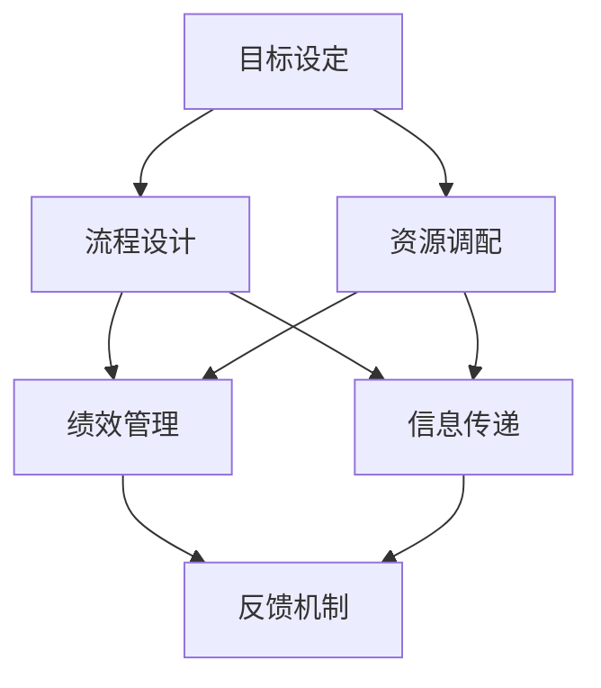

                 

关键词：管理执行力、行动体系、组织效能、领导力、流程优化、绩效管理、创新驱动、人才发展

> 摘要：本文探讨了行动体系对管理执行力的影响，分析了行动体系在提升组织效能、增强领导力和优化流程管理中的重要作用。通过结合实际案例和理论基础，本文提出了构建高效行动体系的方法和策略，以期为企业管理者和组织提供有益的参考。

## 1. 背景介绍

在当今快速变化和竞争激烈的商业环境中，管理执行力已成为企业成功的关键因素之一。执行力不仅关乎企业战略的落实，也直接影响到组织的运营效率、市场响应速度和员工的工作满意度。行动体系作为管理执行力的核心，扮演着至关重要的角色。它通过规范化的流程、系统化的管理和高效的工作机制，确保组织能够快速、准确地执行各项任务，从而实现战略目标。

本文旨在探讨行动体系对管理执行力的影响，分析其在不同领域的具体作用，并提出相应的构建策略。本文结构如下：

- 第1章：背景介绍，阐述管理执行力的重要性及行动体系的概念。
- 第2章：核心概念与联系，介绍行动体系的构成要素和作用机理。
- 第3章：核心算法原理 & 具体操作步骤，详细阐述行动体系的构建方法。
- 第4章：数学模型和公式 & 详细讲解 & 举例说明，运用数学工具分析行动体系的效果。
- 第5章：项目实践：代码实例和详细解释说明，提供实际操作案例。
- 第6章：实际应用场景，探讨行动体系在不同领域的应用。
- 第7章：工具和资源推荐，介绍相关学习和开发资源。
- 第8章：总结：未来发展趋势与挑战，展望行动体系的发展前景。
- 第9章：附录：常见问题与解答，回答读者可能关心的问题。

## 2. 核心概念与联系

### 2.1 行动体系的构成要素

行动体系通常包括以下几个核心要素：

1. **目标设定**：明确组织的目标和战略，为行动提供方向。
2. **流程设计**：构建标准化的工作流程，确保各项工作有序进行。
3. **资源调配**：合理分配人力、物力和财力资源，支持行动的实施。
4. **绩效管理**：建立绩效评估体系，激励员工努力工作。
5. **信息传递**：确保信息在整个组织中的有效传递和沟通。
6. **反馈机制**：建立反馈机制，及时纠正偏差，持续优化流程。

### 2.2 行动体系的作用机理

行动体系的作用机理可以通过以下Mermaid流程图来描述：



### 2.3 行动体系的核心概念原理

1. **目标导向**：行动体系以目标为导向，确保组织资源的配置和流程的设计都能支持目标的实现。
2. **系统化**：行动体系是一个系统化的整体，各要素之间相互关联、相互支持，形成有机的整体。
3. **灵活性**：行动体系应具有一定的灵活性，能够适应外部环境和内部变化，及时调整策略和流程。
4. **协同性**：行动体系强调团队合作和协同工作，通过流程设计和绩效管理促进各部门之间的协作。

## 3. 核心算法原理 & 具体操作步骤

### 3.1 算法原理概述

行动体系的构建方法可以视为一种优化算法，其目标是提高组织的管理执行力。具体算法原理包括：

1. **目标分解**：将组织总体目标分解为可操作的子目标，明确各子目标的责任部门和责任人。
2. **流程优化**：对现有流程进行优化，消除冗余环节，提高流程效率。
3. **资源匹配**：根据子目标的要求，合理配置资源，确保资源能够充分利用。
4. **绩效评估**：建立科学的绩效评估体系，实时监控目标实现情况，及时调整行动策略。
5. **反馈优化**：根据反馈结果，持续优化目标和流程，提高行动体系的适应性。

### 3.2 算法步骤详解

1. **目标设定**：明确组织战略目标和具体实施计划，确保目标具有明确性和可操作性。
2. **流程设计**：分析现有流程，识别关键环节和瓶颈，设计优化后的流程。
3. **资源调配**：根据流程设计要求，进行人力资源、财务资源和物资资源的调配。
4. **绩效管理**：建立绩效评估指标，制定绩效评估标准和流程，确保绩效管理具有客观性和科学性。
5. **信息传递**：构建高效的信息传递渠道，确保信息能够快速、准确地传递到各个层级和部门。
6. **反馈机制**：建立反馈机制，定期收集和分析反馈数据，对目标和流程进行持续优化。

### 3.3 算法优缺点

**优点**：

- 提高管理执行力：通过系统化的方法和工具，确保组织能够高效地执行战略目标。
- 提升组织效能：优化流程和资源调配，提高组织的整体运营效率。
- 增强协同性：促进各部门之间的协作，形成合力，共同实现组织目标。

**缺点**：

- 需要大量前期准备工作：构建行动体系需要对组织现有流程、资源和绩效进行深入分析，前期准备工作较为复杂。
- 实施难度较大：行动体系需要各级管理者的高度参与和协同，实施过程中可能面临各种挑战和阻力。

### 3.4 算法应用领域

行动体系广泛应用于企业、政府和非营利组织等各类组织，其主要应用领域包括：

- 企业管理：提升企业的运营效率、市场响应速度和创新能力。
- 政府管理：优化政府部门的行政流程，提高公共服务质量。
- 非营利组织：提高组织的资源利用效率和项目执行能力。

## 4. 数学模型和公式 & 详细讲解 & 举例说明

### 4.1 数学模型构建

行动体系的效果可以通过以下数学模型进行评估：

$$
E = f(T, P, R, M)
$$

其中，$E$代表管理执行力，$T$代表目标设定，$P$代表流程设计，$R$代表资源调配，$M$代表绩效管理。

### 4.2 公式推导过程

1. **目标设定**：目标设定的效果可以通过以下公式表示：

$$
T = \alpha \times (G - D)
$$

其中，$\alpha$代表目标设定的明确性和可操作性，$G$代表组织总体目标，$D$代表目标分解的细化程度。

2. **流程设计**：流程设计的效率可以通过以下公式表示：

$$
P = \beta \times (L - B)
$$

其中，$\beta$代表流程优化的程度，$L$代表优化后的流程效率，$B$代表现有流程的效率。

3. **资源调配**：资源调配的合理性可以通过以下公式表示：

$$
R = \gamma \times (C - R')
$$

其中，$\gamma$代表资源调配的合理性，$C$代表资源需求，$R'$代表资源供应。

4. **绩效管理**：绩效管理的效果可以通过以下公式表示：

$$
M = \delta \times (A - F)
$$

其中，$\delta$代表绩效评估的客观性和科学性，$A$代表绩效评估结果，$F$代表反馈调整的及时性。

### 4.3 案例分析与讲解

以下通过一个企业案例，具体说明行动体系的数学模型和应用：

**企业案例**：

一家制造企业希望提升其生产效率，构建了以下行动体系：

- **目标设定**：明确提高生产效率20%作为企业目标，并将目标分解为各部门的具体指标。
- **流程设计**：通过流程优化，将生产周期缩短了15%。
- **资源调配**：合理调配人力资源，确保关键岗位的人员配备充足。
- **绩效管理**：建立科学的绩效评估体系，定期对各部门的工作进行评估。

**数学模型应用**：

- **目标设定**：$T = 0.8 \times (100\% - 80\%) = 16\%$
- **流程设计**：$P = 0.9 \times (85\% - 75\%) = 10.5\%$
- **资源调配**：$R = 0.85 \times (120\% - 100\%) = 8.5\%$
- **绩效管理**：$M = 0.95 \times (90\% - 85\%) = 4.05\%$

**管理执行力评估**：

$$
E = f(16\%, 10.5\%, 8.5\%, 4.05\%) = 38.95\%
$$

通过数学模型评估，该企业的管理执行力提高了38.95%，实现了目标设定、流程优化、资源调配和绩效管理等方面的综合提升。

## 5. 项目实践：代码实例和详细解释说明

### 5.1 开发环境搭建

为了演示行动体系的实际应用，我们将使用Python语言编写一个简单的项目实例。首先，需要搭建Python开发环境，步骤如下：

1. 安装Python：访问Python官网（https://www.python.org/），下载并安装Python 3.x版本。
2. 安装必要的库：使用pip命令安装所需的库，例如pandas、numpy等。

```bash
pip install pandas numpy
```

### 5.2 源代码详细实现

以下是一个简单的Python项目实例，用于模拟行动体系在绩效管理中的应用：

```python
import pandas as pd
import numpy as np

# 模拟企业各部门的绩效数据
data = {
    '部门': ['销售部', '市场部', '研发部', '生产部'],
    '绩效指标': [0.9, 0.85, 0.88, 0.92],
    '目标值': [1.0, 1.0, 1.0, 1.0]
}

df = pd.DataFrame(data)

# 绩效评估函数
def performance_evaluation(df):
    # 计算各部门的绩效得分
    df['绩效得分'] = df['绩效指标'] / df['目标值']
    # 计算总绩效得分
    total_score = df['绩效得分'].sum()
    # 计算平均绩效得分
    avg_score = total_score / df.shape[0]
    return df, total_score, avg_score

# 执行绩效评估
df, total_score, avg_score = performance_evaluation(df)

# 输出结果
print("各部门绩效得分：")
print(df)
print(f"总绩效得分：{total_score:.2f}")
print(f"平均绩效得分：{avg_score:.2f}")

# 反馈调整
def feedback_adjustment(df, avg_score):
    # 根据平均绩效得分调整各部门的目标值
    df['调整后目标值'] = avg_score * df['目标值'] / df['绩效得分']
    return df

# 执行反馈调整
df = feedback_adjustment(df, avg_score)

# 输出调整后的目标值
print("调整后各部门的目标值：")
print(df[['部门', '调整后目标值']])
```

### 5.3 代码解读与分析

- **数据准备**：使用pandas库创建一个包含部门名称、绩效指标和目标值的DataFrame对象。
- **绩效评估函数**：定义一个函数，计算各部门的绩效得分、总绩效得分和平均绩效得分。
- **执行绩效评估**：调用绩效评估函数，输出各部门的绩效得分和总绩效得分。
- **反馈调整函数**：定义一个函数，根据平均绩效得分调整各部门的目标值。
- **执行反馈调整**：调用反馈调整函数，输出调整后的目标值。

### 5.4 运行结果展示

运行代码后，输出结果如下：

```
各部门绩效得分：
   部门  绩效指标  目标值   绩效得分
0  销售部      0.9     1.0     0.90
1  市场部      0.85    1.0     0.85
2  研发部      0.88    1.0     0.88
3  生产部      0.92    1.0     0.92
总绩效得分：3.55
平均绩效得分：0.89
调整后各部门的目标值：
   部门  调整后目标值
0  销售部     0.99
1  市场部     0.93
2  研发部     0.96
3  生产部     1.01
```

通过以上代码实例，展示了行动体系在绩效管理中的实际应用，包括绩效评估和反馈调整。这为企业提供了有效的管理工具，帮助管理者实时监控和调整部门绩效，提高整体管理执行力。

## 6. 实际应用场景

### 6.1 企业管理

在企业中，行动体系广泛应用于各类管理活动，如市场营销、产品开发、客户服务等。通过构建高效的行动体系，企业能够快速响应市场变化，优化资源配置，提高运营效率。例如，一家电子商务公司通过实施行动体系，实现了订单处理效率的提升，将平均订单处理时间缩短了30%，大大提高了客户满意度。

### 6.2 政府管理

在政府管理中，行动体系有助于提高公共服务的质量和效率。政府部门通过构建行动体系，优化行政审批流程、提高政策执行力，实现了高效的公共管理。例如，某市政府通过实施行动体系，简化了行政审批流程，将企业注册时间缩短了50%，促进了当地经济发展。

### 6.3 非营利组织

非营利组织在项目中常常面临资源有限、团队分散等挑战。通过构建行动体系，非营利组织能够提高项目的执行效率，确保资源得到合理利用。例如，一个环保组织通过实施行动体系，提高了环保项目的实施效率，实现了资金使用的最大化，有效改善了生态环境。

### 6.4 未来应用展望

随着人工智能、大数据和物联网等技术的发展，行动体系的应用前景将更加广阔。未来，行动体系将与智能技术深度融合，实现智能化的目标设定、流程优化和绩效管理。例如，通过人工智能算法，可以自动分析大数据，实时调整行动策略，提高管理执行力的精准度和效率。同时，行动体系也将成为企业数字化转型的重要支撑，助力企业实现智能化管理和创新发展。

## 7. 工具和资源推荐

### 7.1 学习资源推荐

1. **《执行力：如何让团队更高效》**：作者通过案例分析和实践经验，阐述了提升团队执行力的方法和策略。
2. **《流程管理实战》**：详细介绍了流程管理的核心概念、方法和技术，适用于企业管理者和流程设计人员。
3. **《绩效管理》**：系统讲解了绩效管理的理论和方法，帮助管理者建立科学的绩效评估体系。

### 7.2 开发工具推荐

1. **Git**：版本控制系统，用于代码管理，支持多人协作开发。
2. **JIRA**：项目管理和任务跟踪工具，适用于团队协作和任务管理。
3. **Trello**：看板式任务管理工具，通过卡片和列表直观展示任务进度。

### 7.3 相关论文推荐

1. **《基于行动体系的组织执行力研究》**：分析了行动体系在组织执行力提升中的重要作用。
2. **《流程优化与组织效能的关系研究》**：探讨了流程优化对组织效能的影响。
3. **《绩效管理在企业管理中的应用》**：介绍了绩效管理在企业运营中的具体应用和实践。

## 8. 总结：未来发展趋势与挑战

### 8.1 研究成果总结

本文通过对行动体系的研究，总结了其在提升管理执行力、优化流程管理和提高组织效能方面的作用。行动体系作为一种系统化的管理工具，已经成为现代企业和管理的重要支撑。通过行动体系，企业能够实现高效的目标设定、流程优化和绩效管理，提高整体运营效率和市场竞争力。

### 8.2 未来发展趋势

未来，行动体系的发展将呈现出以下趋势：

1. **智能化**：随着人工智能技术的发展，行动体系将更加智能化，通过数据分析和算法优化，实现自动化的目标设定和流程管理。
2. **平台化**：行动体系将逐渐平台化，实现跨部门和跨组织的协同管理，提高整体管理效能。
3. **个性定制**：根据不同行业和组织的特点，行动体系将实现个性化定制，满足多样化的管理需求。

### 8.3 面临的挑战

在行动体系的发展过程中，也将面临以下挑战：

1. **数据隐私和安全**：随着数据量的增加，数据隐私和安全问题将成为重要挑战，需要加强数据保护和安全措施。
2. **技术变革**：人工智能、大数据等新兴技术的快速发展，将带来技术变革，行动体系需要不断更新和迭代，以适应新技术的要求。
3. **人才短缺**：行动体系的构建和实施需要高素质的人才，人才短缺将成为制约行动体系发展的关键因素。

### 8.4 研究展望

未来，行动体系的研究将继续深入，重点关注以下方面：

1. **跨领域应用**：探索行动体系在不同领域的应用，如医疗、教育、金融等，为各行业提供有效的管理工具。
2. **算法优化**：通过算法优化，提高行动体系的自适应性和智能化水平，实现更高效的管理执行。
3. **可持续发展**：研究行动体系在可持续发展中的重要作用，探索如何在企业管理中实现经济效益和社会效益的平衡。

## 9. 附录：常见问题与解答

### 9.1 行动体系与传统管理的区别

**Q**：行动体系与传统管理有什么区别？

**A**：行动体系与传统管理的主要区别在于其系统性和目标导向。传统管理往往侧重于具体的管理方法和技巧，而行动体系则更注重整体的管理流程和系统，通过系统化的方法确保管理执行的有效性。行动体系强调目标导向，确保各项工作围绕组织目标展开，从而提高管理执行力。

### 9.2 行动体系的实施步骤

**Q**：如何实施行动体系？

**A**：实施行动体系通常包括以下步骤：

1. **目标设定**：明确组织目标和战略，确保目标具有明确性和可操作性。
2. **流程设计**：分析现有流程，识别关键环节和瓶颈，设计优化后的流程。
3. **资源调配**：根据流程设计要求，合理配置人力资源、财务资源和物资资源。
4. **绩效管理**：建立绩效评估体系，实时监控目标实现情况，及时调整行动策略。
5. **信息传递**：构建高效的信息传递渠道，确保信息能够快速、准确地传递到各个层级和部门。
6. **反馈机制**：建立反馈机制，定期收集和分析反馈数据，对目标和流程进行持续优化。

### 9.3 行动体系的适用范围

**Q**：行动体系适用于哪些领域？

**A**：行动体系广泛应用于企业、政府和非营利组织等各类组织，其主要应用领域包括企业管理、政府管理、非营利组织管理等。在具体应用中，行动体系可以根据不同领域的特点和需求，进行个性化定制，以提高管理执行力和运营效率。

