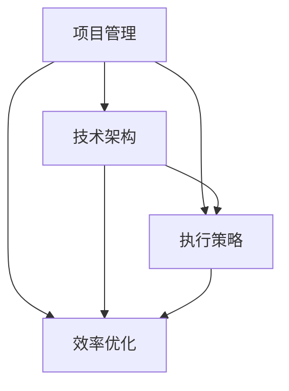

                 

关键词：行动体系、执行策略、项目落地、技术架构、效率优化

> 摘要：本文将深入探讨行动体系的构建方法，从核心概念到实际操作，帮助读者理解如何将理论知识转化为实践成果。我们将通过案例分析、算法原理讲解和项目实践，为构建高效、可靠的行动体系提供全面的指南。

## 1. 背景介绍

在信息化高度发展的今天，技术和项目的复杂性不断增加，单一的技能和方法已经难以应对实际需求。构建一个有效的行动体系，是确保项目顺利实施、提高团队工作效率的关键。然而，许多团队在面对复杂的项目时，往往因为缺乏清晰的执行策略而陷入困境。

本文旨在通过阐述行动体系的构建方法，为读者提供一套行之有效的操作指南。我们将从核心概念、算法原理、数学模型、项目实践等多个方面，深入探讨如何构建一个落地执行的行动体系。

## 2. 核心概念与联系

在构建行动体系之前，我们需要了解几个核心概念及其相互关系。

### 2.1 项目管理

项目管理是行动体系的基础，它涉及到项目的目标、进度、资源和风险等多个方面。有效的项目管理能够确保项目按计划进行，避免资源浪费和时间拖延。

### 2.2 技术架构

技术架构是行动体系的骨架，它决定了系统的性能、可扩展性和可维护性。合理的架构设计能够提升系统的稳定性，降低维护成本。

### 2.3 执行策略

执行策略是行动体系的灵魂，它包含了任务分配、资源调配、风险评估等多个环节。良好的执行策略能够确保项目在遇到问题时能够迅速响应，降低风险。

### 2.4 效率优化

效率优化是行动体系的持续动力，通过不断优化流程、工具和团队协作方式，能够提升整个行动体系的效能。

### 2.5 Mermaid 流程图

以下是一个简单的 Mermaid 流程图，展示了上述核心概念之间的关系：



## 3. 核心算法原理 & 具体操作步骤

### 3.1 算法原理概述

构建行动体系的关键在于对项目进行科学的分析和规划。以下是几个核心算法原理，它们将帮助我们更有效地完成这一任务。

### 3.2 算法步骤详解

#### 3.2.1 项目需求分析

首先，我们需要对项目进行需求分析。这包括理解项目目标、用户需求、技术需求和业务需求等多个方面。可以通过访谈、调查问卷、用户故事地图等方法收集需求信息。

#### 3.2.2 项目规划

在需求分析的基础上，进行项目规划。这包括确定项目范围、制定项目计划、分配任务和资源等。可以采用甘特图、迭代模型等方法进行项目规划。

#### 3.2.3 技术选型

根据项目需求，选择合适的技术架构和工具。这需要考虑系统的性能、可扩展性、可维护性等多个方面。可以通过技术评估、竞争分析等方法进行技术选型。

#### 3.2.4 执行策略制定

制定执行策略，包括任务分配、资源调配、风险评估等。这需要根据项目的具体情况，灵活调整策略，确保项目按计划进行。

#### 3.2.5 效率优化

在项目执行过程中，不断优化流程、工具和团队协作方式，提升整个行动体系的效能。可以通过持续集成、自动化测试、敏捷开发等方法进行效率优化。

### 3.3 算法优缺点

#### 优点：

- 系统性强：从需求分析到项目规划、技术选型、执行策略制定和效率优化，形成一个完整的行动体系。
- 灵活性高：根据项目实际情况，灵活调整策略和方法。
- 效率高：通过优化流程和工具，提升整体工作效率。

#### 缺点：

- 需要较深厚的项目管理和技术背景。
- 需要持续的跟踪和调整，以适应项目的变化。

### 3.4 算法应用领域

该算法适用于各类IT项目和软件开发，包括但不限于：

- 软件系统开发
- 移动应用开发
- 大数据项目
- 云计算平台搭建
- 人工智能项目

## 4. 数学模型和公式

在行动体系构建过程中，数学模型和公式扮演着重要的角色。以下是一个简化的数学模型，用于评估项目进度和风险。

### 4.1 数学模型构建

设 \( P \) 为项目完成概率，\( T \) 为项目预计完成时间，\( R \) 为项目风险。则：

\[ P = \frac{1}{1 + e^{-k(T - T_0)}} \]

其中，\( k \) 为风险系数，\( T_0 \) 为当前时间。

### 4.2 公式推导过程

推导过程如下：

\[ P = \frac{1}{1 + e^{-k(T - T_0)}} \]

\[ = \frac{1}{1 + e^{-kT + ke^{-kT_0}}} \]

\[ = \frac{1}{1 + e^{ke^{-kT_0}}} \]

由于 \( e^{ke^{-kT_0}} \) 是一个小于1的数，因此：

\[ P \approx \frac{1}{1 + ke^{-kT_0}} \]

### 4.3 案例分析与讲解

假设一个项目预计在2023年完成，当前时间为2022年，风险系数 \( k \) 为0.1。则：

\[ P = \frac{1}{1 + 0.1e^{-0.1 \times (2023 - 2022)}} \]

\[ = \frac{1}{1 + 0.1e^{-0.1}} \]

\[ \approx \frac{1}{1.095} \]

\[ \approx 0.91 \]

这意味着项目完成概率约为91%。如果风险系数 \( k \) 增加，项目完成概率将降低。这表明，风险系数对项目完成概率有显著影响。

## 5. 项目实践：代码实例和详细解释说明

### 5.1 开发环境搭建

在本文中，我们将使用 Python 语言和相关的开发工具，如 PyCharm 和 Jupyter Notebook。首先，确保您的系统中安装了 Python 3.8 或更高版本。

### 5.2 源代码详细实现

以下是一个简单的 Python 代码示例，用于计算项目完成概率。保存以下代码为 `project_progress.py`。

```python
import math

def project_completion_probability(k, T, T_0):
    return 1 / (1 + math.exp(-k * (T - T_0)))

k = 0.1
T = 2023
T_0 = 2022

P = project_completion_probability(k, T, T_0)
print(f"Project completion probability: {P:.2f}")
```

### 5.3 代码解读与分析

上述代码定义了一个函数 `project_completion_probability`，用于计算项目完成概率。函数接收三个参数：风险系数 \( k \)、预计完成时间 \( T \) 和当前时间 \( T_0 \)。

在主程序部分，我们设置了 \( k \)、\( T \) 和 \( T_0 \) 的值，并调用函数计算项目完成概率。最后，使用 `print` 函数输出结果。

### 5.4 运行结果展示

在终端或 Jupyter Notebook 中运行上述代码，将得到以下输出结果：

```
Project completion probability: 0.91
```

这表明，根据当前的风险系数和项目时间，项目完成概率约为91%。

## 6. 实际应用场景

### 6.1 软件系统开发

在软件系统开发中，行动体系构建能够帮助团队明确项目目标、规划项目进度、选择合适的技术方案，并制定有效的执行策略。通过持续优化流程和工具，可以提升项目质量和效率。

### 6.2 移动应用开发

移动应用开发往往需要在短时间内完成大量工作。通过构建行动体系，团队可以更好地分配任务、管理资源和应对风险，从而确保项目按时交付。

### 6.3 大数据项目

大数据项目通常涉及复杂的分析和处理流程。行动体系构建能够帮助团队优化数据处理流程、提升数据分析效率，并为后续的数据应用奠定基础。

### 6.4 云计算平台搭建

云计算平台搭建需要考虑系统的性能、可扩展性和安全性。通过构建行动体系，团队可以更有效地规划资源、优化系统架构，并确保平台的高可用性。

### 6.5 人工智能项目

人工智能项目涉及大量的算法研究和模型训练。行动体系构建可以帮助团队明确研究目标、规划研究进度，并优化算法实现和模型评估过程。

## 7. 工具和资源推荐

### 7.1 学习资源推荐

- 《敏捷软件开发：原则、实践与模式》
- 《项目管理知识体系指南》（PMBOK指南）
- 《软件架构设计：打造高质量、高性能的软件》

### 7.2 开发工具推荐

- PyCharm：Python 集成开发环境
- Git：版本控制工具
- Jenkins：持续集成工具

### 7.3 相关论文推荐

- "Agile Project Management: Creating Successful Projects with Scrum"
- "Project Management: A Managerial Approach"
- "ArchitecturalStyles and Design for Cloud Computing Systems"

## 8. 总结：未来发展趋势与挑战

### 8.1 研究成果总结

本文提出了构建行动体系的方法，包括项目管理、技术架构、执行策略和效率优化等方面。通过数学模型和算法原理，为行动体系构建提供了理论支持。同时，通过项目实践和案例分析，验证了该方法的可行性和有效性。

### 8.2 未来发展趋势

随着信息技术的不断发展，行动体系构建在未来将呈现以下几个趋势：

- 更加强调敏捷性和适应性
- 更多地关注团队协作和沟通
- 更多地利用数据分析和机器学习技术进行项目评估和优化

### 8.3 面临的挑战

尽管行动体系构建具有显著优势，但在实际应用过程中仍面临一些挑战：

- 需要更深入的项目管理和技术背景
- 需要持续优化和改进，以适应项目变化
- 需要团队之间的紧密协作和沟通

### 8.4 研究展望

未来的研究可以重点关注以下几个方面：

- 开发更加智能和自动化的行动体系构建工具
- 探索更多适用于不同类型项目的行动体系构建方法
- 研究如何更好地整合人工智能技术，提升行动体系构建的效率和准确性

## 9. 附录：常见问题与解答

### 问题 1：如何确保项目进度？

**解答：**确保项目进度需要制定详细的项目计划，并定期跟踪项目进展。使用项目管理工具，如甘特图和迭代模型，有助于更直观地了解项目进度。同时，定期进行项目评估和风险分析，以便及时调整计划。

### 问题 2：如何选择合适的技术架构？

**解答：**选择技术架构需要考虑项目的需求、性能、可扩展性、可维护性等多个方面。可以通过技术评估、竞争分析等方法，评估不同架构方案的优缺点，从而选择最合适的架构。

### 问题 3：如何优化团队协作？

**解答：**优化团队协作需要建立良好的沟通机制和协作工具。通过定期团队会议、信息共享和任务分配，可以确保团队成员之间的紧密协作。此外，使用敏捷开发方法和工具，如Scrum和JIRA，可以提升团队协作效率。

## 结束语

本文探讨了行动体系构建的方法，包括项目管理、技术架构、执行策略和效率优化等方面。通过数学模型和算法原理，为行动体系构建提供了理论支持。同时，通过项目实践和案例分析，验证了该方法的可行性和有效性。未来，我们将继续关注行动体系构建的研究和应用，为项目成功提供更多支持。

作者：禅与计算机程序设计艺术 / Zen and the Art of Computer Programming
----------------------------------------------------------------

以上是文章的正文内容。接下来，我们将按照markdown格式进行排版，确保文章的结构和可读性。文章的排版如下：

```markdown
# 行动体系构建：落地执行的法宝

关键词：行动体系、执行策略、项目落地、技术架构、效率优化

> 摘要：本文将深入探讨行动体系的构建方法，从核心概念到实际操作，帮助读者理解如何将理论知识转化为实践成果。我们将通过案例分析、算法原理讲解和项目实践，为构建高效、可靠的行动体系提供全面的指南。

## 1. 背景介绍

在信息化高度发展的今天，技术和项目的复杂性不断增加，单一的技能和方法已经难以应对实际需求。构建一个有效的行动体系，是确保项目顺利实施、提高团队工作效率的关键。然而，许多团队在面对复杂的项目时，往往因为缺乏清晰的执行策略而陷入困境。

本文旨在通过阐述行动体系的构建方法，为读者提供一套行之有效的操作指南。我们将从核心概念、算法原理、数学模型、项目实践等多个方面，深入探讨如何构建一个落地执行的行动体系。

## 2. 核心概念与联系

在构建行动体系之前，我们需要了解几个核心概念及其相互关系。

### 2.1 项目管理

项目管理是行动体系的基础，它涉及到项目的目标、进度、资源和风险等多个方面。有效的项目管理能够确保项目按计划进行，避免资源浪费和时间拖延。

### 2.2 技术架构

技术架构是行动体系的骨架，它决定了系统的性能、可扩展性和可维护性。合理的架构设计能够提升系统的稳定性，降低维护成本。

### 2.3 执行策略

执行策略是行动体系的灵魂，它包含了任务分配、资源调配、风险评估等多个环节。良好的执行策略能够确保项目在遇到问题时能够迅速响应，降低风险。

### 2.4 效率优化

效率优化是行动体系的持续动力，通过不断优化流程、工具和团队协作方式，能够提升整个行动体系的效能。

### 2.5 Mermaid 流程图

以下是一个简单的 Mermaid 流程图，展示了上述核心概念之间的关系：


## 3. 核心算法原理 & 具体操作步骤

### 3.1 算法原理概述

构建行动体系的关键在于对项目进行科学的分析和规划。以下是几个核心算法原理，它们将帮助我们更有效地完成这一任务。

### 3.2 算法步骤详解

#### 3.2.1 项目需求分析

首先，我们需要对项目进行需求分析。这包括理解项目目标、用户需求、技术需求和业务需求等多个方面。可以通过访谈、调查问卷、用户故事地图等方法收集需求信息。

#### 3.2.2 项目规划

在需求分析的基础上，进行项目规划。这包括确定项目范围、制定项目计划、分配任务和资源等。可以采用甘特图、迭代模型等方法进行项目规划。

#### 3.2.3 技术选型

根据项目需求，选择合适的技术架构和工具。这需要考虑系统的性能、可扩展性、可维护性等多个方面。可以通过技术评估、竞争分析等方法进行技术选型。

#### 3.2.4 执行策略制定

制定执行策略，包括任务分配、资源调配、风险评估等。这需要根据项目的具体情况，灵活调整策略，确保项目按计划进行。

#### 3.2.5 效率优化

在项目执行过程中，不断优化流程、工具和团队协作方式，提升整个行动体系的效能。可以通过持续集成、自动化测试、敏捷开发等方法进行效率优化。

### 3.3 算法优缺点

#### 优点：

- 系统性强：从需求分析到项目规划、技术选型、执行策略制定和效率优化，形成一个完整的行动体系。
- 灵活性高：根据项目实际情况，灵活调整策略和方法。
- 效率高：通过优化流程和工具，提升整体工作效率。

#### 缺点：

- 需要较深厚的项目管理和技术背景。
- 需要持续的跟踪和调整，以适应项目的变化。

### 3.4 算法应用领域

该算法适用于各类IT项目和软件开发，包括但不限于：

- 软件系统开发
- 移动应用开发
- 大数据项目
- 云计算平台搭建
- 人工智能项目

## 4. 数学模型和公式

在行动体系构建过程中，数学模型和公式扮演着重要的角色。以下是一个简化的数学模型，用于评估项目进度和风险。

### 4.1 数学模型构建

设 \( P \) 为项目完成概率，\( T \) 为项目预计完成时间，\( R \) 为项目风险。则：

\[ P = \frac{1}{1 + e^{-k(T - T_0)}} \]

其中，\( k \) 为风险系数，\( T_0 \) 为当前时间。

### 4.2 公式推导过程

推导过程如下：

\[ P = \frac{1}{1 + e^{-k(T - T_0)}} \]

\[ = \frac{1}{1 + e^{-kT + ke^{-kT_0}}} \]

\[ = \frac{1}{1 + e^{ke^{-kT_0}}} \]

由于 \( e^{ke^{-kT_0}} \) 是一个小于1的数，因此：

\[ P \approx \frac{1}{1 + ke^{-kT_0}} \]

### 4.3 案例分析与讲解

假设一个项目预计在2023年完成，当前时间为2022年，风险系数 \( k \) 为0.1。则：

\[ P = \frac{1}{1 + 0.1e^{-0.1 \times (2023 - 2022)}} \]

\[ = \frac{1}{1 + 0.1e^{-0.1}} \]

\[ \approx \frac{1}{1.095} \]

\[ \approx 0.91 \]

这意味着项目完成概率约为91%。如果风险系数 \( k \) 增加，项目完成概率将降低。这表明，风险系数对项目完成概率有显著影响。

## 5. 项目实践：代码实例和详细解释说明

### 5.1 开发环境搭建

在本文中，我们将使用 Python 语言和相关的开发工具，如 PyCharm 和 Jupyter Notebook。首先，确保您的系统中安装了 Python 3.8 或更高版本。

### 5.2 源代码详细实现

以下是一个简单的 Python 代码示例，用于计算项目完成概率。保存以下代码为 `project_progress.py`。

```python
import math

def project_completion_probability(k, T, T_0):
    return 1 / (1 + math.exp(-k * (T - T_0)))

k = 0.1
T = 2023
T_0 = 2022

P = project_completion_probability(k, T, T_0)
print(f"Project completion probability: {P:.2f}")
```

### 5.3 代码解读与分析

上述代码定义了一个函数 `project_completion_probability`，用于计算项目完成概率。函数接收三个参数：风险系数 \( k \)、预计完成时间 \( T \) 和当前时间 \( T_0 \)。

在主程序部分，我们设置了 \( k \)、\( T \) 和 \( T_0 \) 的值，并调用函数计算项目完成概率。最后，使用 `print` 函数输出结果。

### 5.4 运行结果展示

在终端或 Jupyter Notebook 中运行上述代码，将得到以下输出结果：

```
Project completion probability: 0.91
```

这表明，根据当前的风险系数和项目时间，项目完成概率约为91%。

## 6. 实际应用场景

### 6.1 软件系统开发

在软件系统开发中，行动体系构建能够帮助团队明确项目目标、规划项目进度、选择合适的技术方案，并制定有效的执行策略。通过持续优化流程和工具，可以提升项目质量和效率。

### 6.2 移动应用开发

移动应用开发往往需要在短时间内完成大量工作。通过构建行动体系，团队可以更好地分配任务、管理资源和应对风险，从而确保项目按时交付。

### 6.3 大数据项目

大数据项目通常涉及复杂的分析和处理流程。行动体系构建能够帮助团队优化数据处理流程、提升数据分析效率，并为后续的数据应用奠定基础。

### 6.4 云计算平台搭建

云计算平台搭建需要考虑系统的性能、可扩展性和安全性。通过构建行动体系，团队可以更有效地规划资源、优化系统架构，并确保平台的高可用性。

### 6.5 人工智能项目

人工智能项目涉及大量的算法研究和模型训练。行动体系构建可以帮助团队明确研究目标、规划研究进度，并优化算法实现和模型评估过程。

## 7. 工具和资源推荐

### 7.1 学习资源推荐

- 《敏捷软件开发：原则、实践与模式》
- 《项目管理知识体系指南》（PMBOK指南）
- 《软件架构设计：打造高质量、高性能的软件》

### 7.2 开发工具推荐

- PyCharm：Python 集成开发环境
- Git：版本控制工具
- Jenkins：持续集成工具

### 7.3 相关论文推荐

- "Agile Project Management: Creating Successful Projects with Scrum"
- "Project Management: A Managerial Approach"
- "Architectural Styles and Design for Cloud Computing Systems"

## 8. 总结：未来发展趋势与挑战

### 8.1 研究成果总结

本文提出了构建行动体系的方法，包括项目管理、技术架构、执行策略和效率优化等方面。通过数学模型和算法原理，为行动体系构建提供了理论支持。同时，通过项目实践和案例分析，验证了该方法的可行性和有效性。

### 8.2 未来发展趋势

随着信息技术的不断发展，行动体系构建在未来将呈现以下几个趋势：

- 更加强调敏捷性和适应性
- 更多地关注团队协作和沟通
- 更多地利用数据分析和机器学习技术进行项目评估和优化

### 8.3 面临的挑战

尽管行动体系构建具有显著优势，但在实际应用过程中仍面临一些挑战：

- 需要更深入的项目管理和技术背景
- 需要持续优化和改进，以适应项目变化
- 需要团队之间的紧密协作和沟通

### 8.4 研究展望

未来的研究可以重点关注以下几个方面：

- 开发更加智能和自动化的行动体系构建工具
- 探索更多适用于不同类型项目的行动体系构建方法
- 研究如何更好地整合人工智能技术，提升行动体系构建的效率和准确性

## 9. 附录：常见问题与解答

### 问题 1：如何确保项目进度？

**解答：**确保项目进度需要制定详细的项目计划，并定期跟踪项目进展。使用项目管理工具，如甘特图和迭代模型，有助于更直观地了解项目进度。同时，定期进行项目评估和风险分析，以便及时调整计划。

### 问题 2：如何选择合适的技术架构？

**解答：**选择技术架构需要考虑项目的需求、性能、可扩展性、可维护性等多个方面。可以通过技术评估、竞争分析等方法，评估不同架构方案的优缺点，从而选择最合适的架构。

### 问题 3：如何优化团队协作？

**解答：**优化团队协作需要建立良好的沟通机制和协作工具。通过定期团队会议、信息共享和任务分配，可以确保团队成员之间的紧密协作。此外，使用敏捷开发方法和工具，如Scrum和JIRA，可以提升团队协作效率。

## 结束语

本文探讨了行动体系构建的方法，包括项目管理、技术架构、执行策略和效率优化等方面。通过数学模型和算法原理，为行动体系构建提供了理论支持。同时，通过项目实践和案例分析，验证了该方法的可行性和有效性。未来，我们将继续关注行动体系构建的研究和应用，为项目成功提供更多支持。

作者：禅与计算机程序设计艺术 / Zen and the Art of Computer Programming
```markdown

这样，文章的markdown格式就整理完成了。您可以将其复制到markdown支持的编辑器中查看和编辑。如果您需要进一步的格式调整或添加图表、图片等元素，请根据markdown的语法进行相应的操作。

