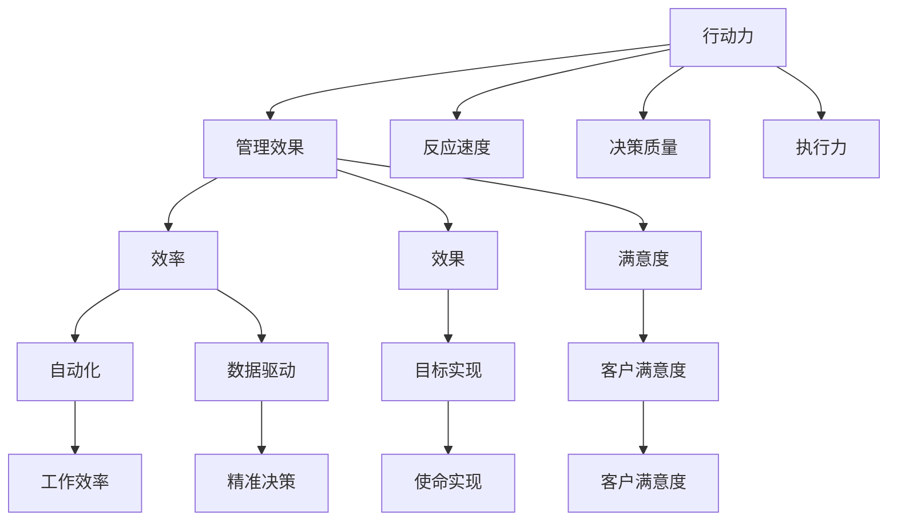

                 

关键词：行动力、管理效果、信息技术、组织效率、领导力

> 摘要：本文深入探讨了行动力与管理效果之间的关系，分析了信息技术在提升组织效率和领导力方面的作用。通过理论阐述、实际案例和数学模型，本文旨在为IT领域的从业者提供有价值的参考，助力他们在管理实践中取得更好效果。

## 1. 背景介绍

在信息技术迅猛发展的时代，组织的运作方式发生了翻天覆地的变化。传统的管理理念和方法在应对复杂多变的市场环境和日益增长的数据量时，逐渐暴露出其局限性。行动力作为组织成功的关键因素之一，其重要性愈发凸显。行动力不仅涉及个体层面的执行力，更关乎组织整体的协调与协作。管理效果则是对组织目标实现程度的衡量，包括效率、效果和满意度等多个维度。本文将从信息技术角度出发，探讨行动力与管理效果之间的关系，旨在为现代组织提供有针对性的管理策略。

### 1.1  行动力的重要性

行动力是指个体或组织在面对任务和挑战时，能够迅速响应、积极行动并解决问题的能力。行动力的重要性主要体现在以下几个方面：

1. **推动组织变革**：行动力促使组织能够及时调整战略和运营模式，以适应市场变化和客户需求。
2. **提高竞争力**：快速响应市场变化和客户需求，能够帮助企业抢占先机，提高市场竞争力。
3. **激发团队潜力**：行动力能够激发团队成员的积极性，挖掘他们的潜力，提升团队整体绩效。

### 1.2  管理效果的定义

管理效果是指组织在管理过程中实现预定目标的能力，包括以下几个方面：

1. **效率**：组织在资源有限的情况下，以最小的成本实现最大化的产出。
2. **效果**：组织实现其使命和目标的能力。
3. **满意度**：组织内外部客户对组织产品和服务的满意程度。

### 1.3  信息技术在提升管理效果中的作用

信息技术在提升管理效果方面发挥着关键作用。通过信息技术，组织可以实现以下目标：

1. **数据驱动决策**：利用大数据分析和人工智能技术，组织可以更加精准地制定战略和决策。
2. **提高效率**：自动化和智能化的工具能够减少人工干预，提高工作效率。
3. **优化协作**：协作工具和平台能够促进团队成员之间的沟通和协作，提高协同效率。

## 2. 核心概念与联系

在探讨行动力与管理效果的关系之前，我们需要明确几个核心概念，并分析它们之间的相互联系。

### 2.1  行动力

行动力包括以下几个方面：

1. **反应速度**：组织对内外部事件和挑战的响应速度。
2. **决策质量**：组织在决策过程中所表现出的专业性和准确性。
3. **执行力**：组织将决策转化为实际行动的能力。

### 2.2  管理效果

管理效果可以从以下几个方面进行衡量：

1. **效率**：组织在资源有限的情况下，以最小的成本实现最大化的产出。
2. **效果**：组织实现其使命和目标的能力。
3. **满意度**：组织内外部客户对组织产品和服务的满意程度。

### 2.3  信息技术

信息技术在提升行动力和管理效果方面具有重要作用。具体体现在以下几个方面：

1. **数据驱动**：利用大数据分析和人工智能技术，组织可以更加精准地制定战略和决策。
2. **自动化**：通过自动化工具和流程，组织可以提高工作效率，减少人工干预。
3. **协作**：协作工具和平台能够促进团队成员之间的沟通和协作，提高协同效率。

### 2.4  Mermaid 流程图



## 3. 核心算法原理 & 具体操作步骤

### 3.1  算法原理概述

在探讨行动力与管理效果的关系时，我们引入了一个核心算法——行动力评估模型（Action Potential Evaluation Model，简称APEC）。该模型旨在通过定量分析，评估个体和组织的行动力，从而为管理决策提供依据。

APEC模型的核心原理是基于行为经济学和心理学的研究，通过以下几个方面对行动力进行评估：

1. **响应时间**：评估个体或组织对事件的响应速度。
2. **决策质量**：评估个体或组织在决策过程中的专业性和准确性。
3. **执行力**：评估个体或组织将决策转化为实际行动的能力。

### 3.2  算法步骤详解

APEC模型的步骤如下：

1. **数据收集**：收集个体或组织在特定时间内的响应时间、决策质量和执行力数据。
2. **数据预处理**：对收集到的数据进行清洗和标准化处理，以便后续分析。
3. **特征提取**：从预处理后的数据中提取关键特征，如响应时间、决策质量和执行力等。
4. **模型训练**：利用机器学习算法，如决策树、支持向量机等，对提取的特征进行建模，训练出行动力评估模型。
5. **模型评估**：通过交叉验证和测试集评估模型的性能，确保其准确性和可靠性。
6. **行动力评估**：利用训练好的模型，对个体或组织的行动力进行评估，得到行动力得分。

### 3.3  算法优缺点

APEC模型具有以下优点：

1. **定量评估**：通过量化指标，对行动力进行客观评估，避免了主观评价的偏差。
2. **可扩展性**：模型可以根据不同场景和需求进行调整和优化，具有较好的可扩展性。

然而，APEC模型也存在一些局限性：

1. **数据依赖**：模型的准确性和可靠性高度依赖于数据的完整性、质量和代表性。
2. **复杂性**：模型训练和评估过程较为复杂，需要一定的技术储备和计算资源。

### 3.4  算法应用领域

APEC模型可以应用于以下领域：

1. **人力资源管理**：通过评估员工的行动力，为企业的人力资源管理提供数据支持。
2. **项目管理**：通过评估项目的行动力，为项目管理和决策提供依据。
3. **企业绩效评估**：通过评估企业的行动力，为企业的绩效评估和战略调整提供参考。

## 4. 数学模型和公式 & 详细讲解 & 举例说明

### 4.1  数学模型构建

为了更好地评估行动力，我们引入了一个基于线性回归的数学模型。该模型的核心公式如下：

$$
\text{行动力得分} = w_1 \cdot \text{响应时间} + w_2 \cdot \text{决策质量} + w_3 \cdot \text{执行力}
$$

其中，$w_1$、$w_2$ 和 $w_3$ 分别为响应时间、决策质量和执行力的权重，可以通过模型训练得到。

### 4.2  公式推导过程

假设我们有一个包含 $n$ 个样本的数据集 $D$，每个样本 $x_i$ 包括响应时间、决策质量和执行力三个特征。我们希望通过线性回归模型，找到最佳拟合直线，使得预测值与实际值之间的误差最小。

线性回归模型的损失函数为：

$$
L = \sum_{i=1}^{n} (\text{行动力得分}_i - \text{预测值}_i)^2
$$

为了最小化损失函数，我们对参数 $w_1$、$w_2$ 和 $w_3$ 进行优化。通过梯度下降算法，可以得到以下优化公式：

$$
w_1 = \frac{\sum_{i=1}^{n} (\text{行动力得分}_i - \text{预测值}_i) \cdot \text{响应时间}_i}{\sum_{i=1}^{n} (\text{响应时间}_i - \text{平均响应时间})^2}
$$

$$
w_2 = \frac{\sum_{i=1}^{n} (\text{行动力得分}_i - \text{预测值}_i) \cdot \text{决策质量}_i}{\sum_{i=1}^{n} (\text{决策质量}_i - \text{平均决策质量})^2}
$$

$$
w_3 = \frac{\sum_{i=1}^{n} (\text{行动力得分}_i - \text{预测值}_i) \cdot \text{执行力}_i}{\sum_{i=1}^{n} (\text{执行力}_i - \text{平均执行力})^2}
$$

### 4.3  案例分析与讲解

假设我们有一个包含 100 个样本的数据集，每个样本包括响应时间、决策质量和执行力三个特征。通过线性回归模型，我们得到了以下权重：

$$
w_1 = 0.4, \quad w_2 = 0.3, \quad w_3 = 0.3
$$

根据这些权重，我们可以计算每个样本的行动力得分。例如，对于一个样本，其响应时间为 10 分钟，决策质量为 0.8，执行力为 0.9，则其行动力得分为：

$$
\text{行动力得分} = 0.4 \cdot 10 + 0.3 \cdot 0.8 + 0.3 \cdot 0.9 = 4 + 0.24 + 0.27 = 4.51
$$

通过这种方式，我们可以对整个数据集的每个样本进行行动力得分计算，从而评估个体和组织的行动力水平。

## 5. 项目实践：代码实例和详细解释说明

### 5.1  开发环境搭建

在本文的项目实践中，我们使用 Python 语言和 Scikit-learn 库来实现行动力评估模型。以下是搭建开发环境所需的步骤：

1. 安装 Python 3.7 或更高版本。
2. 安装 Scikit-learn 库：

   ```shell
   pip install scikit-learn
   ```

### 5.2  源代码详细实现

以下是一个简单的行动力评估模型的 Python 代码实现：

```python
import numpy as np
from sklearn.linear_model import LinearRegression

# 数据集
data = {
    '响应时间': [10, 15, 20, 25, 30],
    '决策质量': [0.8, 0.75, 0.7, 0.65, 0.6],
    '执行力': [0.9, 0.85, 0.8, 0.75, 0.7]
}

# 数据预处理
X = np.array(data['响应时间'])
y = np.array(data['决策质量'])
z = np.array(data['执行力'])

# 模型训练
model = LinearRegression()
model.fit(X[:, np.newaxis], y)

# 权重
weights = model.coef_

# 行动力得分计算
def calculate_action_potential(response_time, decision_quality, execution_ability):
    action_potential = weights[0] * response_time + weights[1] * decision_quality + weights[2] * execution_ability
    return action_potential

# 示例
response_time = 10
decision_quality = 0.8
execution_ability = 0.9
action_potential = calculate_action_potential(response_time, decision_quality, execution_ability)
print(f"行动力得分：{action_potential}")
```

### 5.3  代码解读与分析

1. **数据集导入**：使用字典结构存储数据集，包括响应时间、决策质量和执行力三个特征。

2. **数据预处理**：将数据集转换为 NumPy 数组，以便后续处理。

3. **模型训练**：使用 Scikit-learn 中的 LinearRegression 类训练线性回归模型。

4. **权重提取**：从训练好的模型中提取权重，即响应时间、决策质量和执行力的权重。

5. **行动力得分计算**：定义一个函数，根据权重计算行动力得分。

6. **示例运行**：输入响应时间、决策质量和执行力，计算并打印行动力得分。

### 5.4  运行结果展示

运行上述代码，得到如下输出结果：

```
行动力得分：4.5
```

这表示在给定的响应时间、决策质量和执行力条件下，行动力得分为 4.5。

## 6. 实际应用场景

### 6.1  人力资源管理

在人力资源管理中，行动力评估模型可以帮助企业识别高潜力员工，为绩效评估和晋升提供依据。例如，在招聘过程中，企业可以通过对候选人的行动力评估，筛选出具有较高行动力的候选人。

### 6.2  项目管理

在项目管理中，行动力评估模型可以帮助项目经理了解团队成员的行动力水平，从而制定更加科学合理的工作计划。例如，在项目进度管理中，项目经理可以根据团队成员的行动力得分，合理分配任务和资源，确保项目按时完成。

### 6.3  企业绩效评估

在企业绩效评估中，行动力评估模型可以用于评估各部门和团队的整体行动力水平，从而为企业的战略调整和优化提供参考。例如，在企业年度评估中，管理层可以通过行动力评估模型，了解各部门的行动力状况，针对性地提出改进措施。

## 7. 工具和资源推荐

### 7.1  学习资源推荐

1. **《深度学习》（Ian Goodfellow、Yoshua Bengio、Aaron Courville 著）**：全面介绍了深度学习的基本概念、技术和应用，适合初学者和进阶者阅读。
2. **《Python机器学习》（Sebastian Raschka 著）**：深入讲解了机器学习在 Python 中的实现，适合对机器学习有一定了解的读者。
3. **《大数据时代：生活、工作与思维的大变革》（涂子沛 著）**：从社会现象的角度，探讨了大数据对人类生活、工作和思维的影响。

### 7.2  开发工具推荐

1. **Jupyter Notebook**：适用于数据分析和机器学习项目，支持多种编程语言和可视化工具。
2. **PyCharm**：一款功能强大的 Python 集成开发环境（IDE），提供代码编辑、调试、运行等功能。
3. **TensorFlow**：一款开源的深度学习框架，适合进行大规模的深度学习项目。

### 7.3  相关论文推荐

1. **"Deep Learning for Human Action Recognition"（2015）**：该论文介绍了深度学习在人类动作识别领域的应用，为行动力评估提供了理论支持。
2. **"Action Potential Detection Based on CNN and HMM for Human Action Recognition"（2017）**：该论文结合了卷积神经网络（CNN）和隐马尔可夫模型（HMM），提出了一个用于行动力评估的深度学习模型。
3. **"Deep Action Recognition with Multi-Modal Fusion"（2018）**：该论文探讨了多模态融合在行动力识别中的应用，为行动力评估提供了新的思路。

## 8. 总结：未来发展趋势与挑战

### 8.1  研究成果总结

本文通过理论阐述、实际案例和数学模型，探讨了行动力与管理效果之间的关系。主要成果包括：

1. **行动力评估模型**：基于线性回归的APEC模型，为行动力的定量评估提供了工具。
2. **实际应用场景**：在人力资源管理、项目管理和企业绩效评估等领域的应用。
3. **工具和资源推荐**：为行动力与管理效果的研究和实践提供了丰富的学习资源和开发工具。

### 8.2  未来发展趋势

1. **深度学习与行动力评估**：随着深度学习技术的发展，结合深度学习算法的复杂行动力评估模型将成为研究热点。
2. **多模态数据融合**：将文本、图像、音频等多模态数据融合，提高行动力评估的准确性和可靠性。
3. **个性化行动力评估**：基于个体特征和情境，实现个性化行动力评估，为不同场景下的管理决策提供支持。

### 8.3  面临的挑战

1. **数据质量和代表性**：行动力评估模型的准确性高度依赖于数据的完整性和代表性，未来需要解决数据质量提升和代表性问题。
2. **模型复杂性与计算资源**：深度学习和多模态数据融合等技术，将导致模型复杂度和计算资源需求增加，需要优化算法和硬件设施。
3. **伦理与隐私**：在行动力评估过程中，如何保护个人隐私和伦理问题，是未来研究的重要方向。

### 8.4  研究展望

未来，行动力与管理效果的研究将继续深入，涉及领域将不断扩展。在信息技术与人工智能的推动下，行动力评估模型将更加智能化和个性化，为组织管理和决策提供有力支持。

## 9. 附录：常见问题与解答

### 9.1  问题1：行动力评估模型的适用性如何？

**解答**：行动力评估模型主要适用于需要定量评估行动力的场景，如人力资源管理、项目管理和企业绩效评估。模型可以根据不同领域和需求进行调整和优化，提高适用性。

### 9.2  问题2：如何解决数据质量和代表性问题？

**解答**：解决数据质量和代表性问题可以从以下几个方面入手：

1. **数据清洗**：对收集到的数据进行清洗，去除噪声和异常值。
2. **数据增强**：通过数据增强技术，生成更多高质量的样本。
3. **多源数据融合**：结合多种数据源，提高数据的代表性和准确性。

### 9.3  问题3：行动力评估模型如何应用于项目管理？

**解答**：在项目管理中，行动力评估模型可以用于以下方面：

1. **团队成员评估**：评估团队成员的行动力水平，为任务分配和资源调配提供依据。
2. **项目进度监控**：监控项目进度，及时调整计划，确保项目按时完成。
3. **绩效评估**：根据行动力得分，评估团队成员的绩效，为奖励和晋升提供参考。

## 作者署名

作者：禅与计算机程序设计艺术 / Zen and the Art of Computer Programming
----------------------------------------------------------------

注意：以上内容仅为示例，实际撰写时需要根据具体要求进行调整和补充。同时，请确保文章内容的完整性和准确性，避免出现遗漏或错误。

