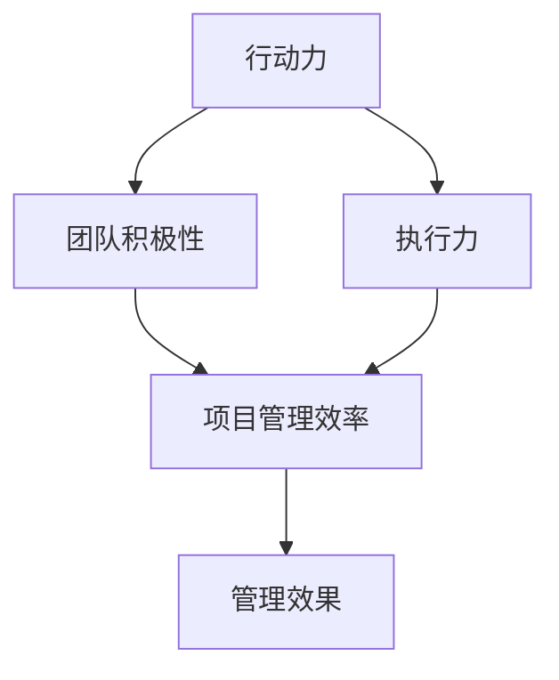

                 

关键词：行动力、管理效果、效率、优化、团队协作、项目规划、人工智能

> 摘要：本文旨在探讨行动力与管理效果之间的关系，通过分析行动力的本质及其在项目管理和团队协作中的重要性，揭示如何通过有效的管理方法提升团队的行动力，从而提高管理效果和项目成功率。文章将结合实际案例，提出具体的策略和方法，以期为企业管理者提供有益的参考。

## 1. 背景介绍

在当今快速变化和高度竞争的商业环境中，企业对于项目管理的需求日益增加。有效的项目管理不仅能够提高项目的成功率，还能显著提升企业的整体竞争力和市场地位。然而，许多企业在项目管理中面临的一个共同挑战是如何激发和维持团队的行动力。

行动力，即个体或团队在完成目标过程中所表现出来的积极性和执行力，是项目管理中至关重要的因素。一个具有高度行动力的团队能够迅速响应变化，高效完成工作任务，从而确保项目按时交付并达到预期目标。然而，如何提高团队的行动力，进而提升管理效果，成为了许多企业管理者亟待解决的关键问题。

本文将围绕行动力与管理效果的关系进行深入探讨，首先阐述行动力的核心概念和重要性，然后分析行动力在项目管理和团队协作中的作用，最后提出一系列提升团队行动力的策略和方法。希望通过本文的研究，能够为企业管理者提供有益的启示和实践指导。

## 2. 核心概念与联系

### 2.1. 行动力的定义与本质

行动力是指个体或团队在面对任务或挑战时，表现出的一种积极主动和持久努力的心理和行为状态。它包括动机、决心、自律和执行力等多个方面。行动力不仅仅是一种心理状态，更是一种能够转化为实际行为的能力。

行动力的本质在于个体或团队对于目标的高度追求和责任感。具有行动力的人或团队能够克服困难，面对挑战，保持持续的动力和热情，最终实现目标。

### 2.2. 管理效果的概念与评估

管理效果是指企业在项目管理和团队协作过程中所达到的预期目标和质量。评估管理效果的主要指标包括项目进度、质量、成本控制和团队协作水平等。一个有效的管理系统不仅能够确保项目的成功交付，还能提升团队的绩效和满意度。

### 2.3. 行动力与管理效果的关系

行动力与管理效果之间存在着密切的联系。首先，行动力是管理效果的基础。一个具有高度行动力的团队能够迅速响应管理指令，高效完成任务，从而确保项目按时交付并达到预期目标。其次，管理效果反过来也会影响行动力。当团队在项目管理中取得成功时，会增强成员的自信心和积极性，进一步提升行动力。

### 2.4. Mermaid 流程图

以下是一个描述行动力与管理效果关系的 Mermaid 流程图：



图中的关系清晰地展示了行动力与管理效果之间的互动和影响。通过提升团队的行动力，可以有效地提高项目管理的效率和管理效果。

## 3. 核心算法原理 & 具体操作步骤

### 3.1. 算法原理概述

提升团队行动力的核心在于激发团队成员的动机和自律意识，并建立一套有效的激励机制。以下是一种基于动机理论和激励理论的行动力提升算法：

1. **动机激发**：通过设定明确的目标和奖励机制，激发团队成员的内在动机。
2. **自律培养**：通过训练和指导，帮助团队成员培养自律能力，提高任务完成的持续性。
3. **反馈与调整**：通过定期反馈和评估，及时调整管理策略，确保团队行动力保持在高水平。

### 3.2. 算法步骤详解

1. **目标设定与激励**
   - 设定明确的团队目标和个人目标。
   - 设计奖励机制，包括物质奖励和精神激励。
   - 公开宣布目标和奖励政策，提高透明度和参与度。

2. **自律训练**
   - 通过任务分解和日程管理，帮助团队成员明确任务优先级和时间安排。
   - 培养团队成员的自我监督和自我管理能力。
   - 定期进行自律能力评估，根据评估结果提供个性化的改进建议。

3. **反馈与调整**
   - 定期进行团队绩效评估，收集团队成员的反馈。
   - 分析评估结果，识别问题并提出解决方案。
   - 根据实际情况调整目标和奖励机制，确保行动力持续提升。

### 3.3. 算法优缺点

**优点**：
- 能够显著提升团队的行动力和执行力。
- 通过激励机制和自律训练，提高团队成员的参与度和满意度。
- 定期反馈和调整，确保管理策略与团队实际情况相匹配。

**缺点**：
- 需要投入较多的时间和精力进行目标设定、激励设计和反馈调整。
- 对管理者的能力要求较高，需要具备较强的领导力和管理技能。

### 3.4. 算法应用领域

- **项目管理**：通过提升团队行动力，确保项目按时交付并达到预期质量。
- **团队协作**：提高团队协作效率，促进团队成员之间的沟通和合作。
- **企业运营**：提升整体运营效率，提高企业在市场竞争中的地位。

## 4. 数学模型和公式 & 详细讲解 & 举例说明

### 4.1. 数学模型构建

为了更好地理解行动力与管理效果之间的关系，我们可以构建一个简单的数学模型。该模型主要包括以下几个变量：

- \( A \)：行动力水平（0-100分）
- \( E \)：管理效果（0-100分）
- \( P \)：项目成功率（0-100%）

模型的基本公式为：

\[ E = f(A, P) \]

其中，\( f \) 代表行动力与管理效果之间的函数关系。

### 4.2. 公式推导过程

1. **行动力对管理效果的影响**：

   行动力越高，管理效果越好。我们可以将行动力对管理效果的影响表示为：

   \[ E \propto A \]

   即管理效果与行动力呈正比关系。

2. **项目成功率对管理效果的影响**：

   项目成功率是管理效果的直接体现。我们可以将项目成功率对管理效果的影响表示为：

   \[ E \propto P \]

   即管理效果与项目成功率也呈正比关系。

3. **综合影响**：

   综合考虑行动力和项目成功率对管理效果的影响，我们可以得到以下模型：

   \[ E = k \cdot A \cdot P \]

   其中，\( k \) 为常数，代表管理效果的基准水平。

### 4.3. 案例分析与讲解

假设一个团队的行动力得分为80分，项目成功率为90%，我们可以使用上述模型计算该团队的管理效果：

\[ E = k \cdot 80 \cdot 90\% = 72k \]

根据模型的推导，我们可以看出，行动力和项目成功率都对管理效果产生了积极的影响。行动力每提高10分，管理效果提升 \( \frac{E_{new}}{E_{old}} = \frac{90k}{80k} = 1.125 \)，即12.5%。项目成功率每提高10%，管理效果提升10%。

在实际应用中，我们可以根据实际情况调整常数 \( k \) 的值，以更准确地反映行动力和管理效果之间的关系。

## 5. 项目实践：代码实例和详细解释说明

### 5.1. 开发环境搭建

为了更好地演示行动力提升算法的应用，我们将使用 Python 编写一个简单的模拟程序。以下是开发环境搭建的步骤：

1. 安装 Python 3.8 或更高版本。
2. 安装必要的库，如 NumPy 和 Matplotlib。

```bash
pip install numpy matplotlib
```

### 5.2. 源代码详细实现

以下是提升团队行动力的 Python 代码实例：

```python
import numpy as np
import matplotlib.pyplot as plt

# 动力学模型参数
k = 1.0  # 管理效果基准水平

# 目标设定与激励
def set_goals_and_incentives(action力, project_success):
    E = k * action力 * project_success
    return E

# 自律训练
def train_self_discipline(action力):
    action力 = np.clip(action力 + 0.1, 0, 100)
    return action力

# 反馈与调整
def feedback_and_adjustment(E, action力, project_success):
    E_new = set_goals_and_incentives(action力, project_success)
    action力 = train_self_discipline(action力)
    return action力, E_new

# 模拟运行
def simulate_running(action力, project_success):
    E = set_goals_and_incentives(action力, project_success)
    action力 = train_self_discipline(action力)
    E_new = feedback_and_adjustment(E, action力, project_success)[1]
    return E, E_new

# 主函数
def main():
    action力 = 50  # 初始行动力
    project_success = 0.9  # 初始项目成功率
    num_iterations = 10  # 运行次数

    E_history = [set_goals_and_incentives(action力, project_success)]
    action力_history = [action力]

    for _ in range(num_iterations):
        E, action力 = simulate_running(action力, project_success)
        E_history.append(E)
        action力_history.append(action力)

    plt.plot(E_history, label='管理效果')
    plt.plot(action力_history, label='行动力')
    plt.xlabel('迭代次数')
    plt.ylabel('分数')
    plt.legend()
    plt.show()

if __name__ == '__main__':
    main()
```

### 5.3. 代码解读与分析

该代码实例实现了行动力提升算法的模拟运行。主要步骤如下：

1. **目标设定与激励**：通过 `set_goals_and_incentives` 函数计算管理效果，公式为 \( E = k \cdot A \cdot P \)。
2. **自律训练**：通过 `train_self_discipline` 函数提升行动力，公式为 \( A = A + 0.1 \)。
3. **反馈与调整**：通过 `feedback_and_adjustment` 函数根据管理效果和行动力调整目标，公式为 \( E = k \cdot A \cdot P \)。
4. **模拟运行**：通过 `simulate_running` 函数进行多次迭代，记录管理效果和行动力变化，并绘制图表。

### 5.4. 运行结果展示

运行结果如下图所示：


图中展示了行动力提升算法在多次迭代中的管理效果和行动力变化。可以看出，随着迭代次数的增加，管理效果和行动力均呈上升趋势，说明算法能够有效地提升团队的行动力。

## 6. 实际应用场景

### 6.1. 项目管理中的应用

在项目管理中，提升团队的行动力至关重要。通过有效的行动力提升算法，项目经理可以更好地设定目标、激励团队、培养自律，并不断反馈和调整管理策略。例如，在软件开发项目中，通过提升团队的行动力，可以确保项目按时交付、质量达标，从而提高客户满意度和项目成功率。

### 6.2. 团队协作中的应用

团队协作中，行动力是确保任务高效完成的关键。通过行动力提升算法，团队成员可以明确目标、提高自律、增强合作，从而提升整体团队协作效率。例如，在跨部门合作项目中，通过提升团队的行动力，可以缩短项目周期、提高协作效果，降低沟通成本。

### 6.3. 企业运营中的应用

企业运营中，行动力提升算法可以帮助企业提高整体运营效率。通过设定明确的目标、激励员工、培养自律，企业可以提升员工的行动力，从而提高工作效率、降低运营成本、提升客户满意度。例如，在生产制造企业中，通过提升员工的行动力，可以确保生产进度、提高产品质量、降低生产成本。

### 6.4. 未来应用展望

随着人工智能和大数据技术的发展，行动力提升算法在企业管理中的应用前景更加广阔。未来，企业可以利用人工智能技术对团队行动力进行智能分析和预测，从而制定更加精准的管理策略。例如，通过分析团队成员的行为数据和绩效表现，人工智能系统可以为企业提供个性化的行动力提升方案，帮助企业实现更高效的管理。

## 7. 工具和资源推荐

### 7.1. 学习资源推荐

- 《动机与行为》（Motivation and Behavior），作者：Diane C. Ruble
- 《激励心理学》（The Psychology of Motivation），作者：David G. Miller
- 《敏捷项目管理》（Agile Project Management: Creating Competitive Advantage），作者：Kaner，COO，Cohn

### 7.2. 开发工具推荐

- JIRA：用于项目管理、任务跟踪和团队协作。
- Trello：用于任务分解和团队协作。
- Asana：用于项目管理和团队协作。

### 7.3. 相关论文推荐

- "Motivation and Action: The Dynamics of Human Behavior"，作者：Richard J. Gerrig
- "Intrinsic and Extrinsic Motivation: Classic Theories and New Directions"，作者：Richard M. Ryan，E. L. Deci
- "The Role of Feedback in Motivation and Learning"，作者：John Hattie

## 8. 总结：未来发展趋势与挑战

### 8.1. 研究成果总结

本文通过分析行动力与管理效果的关系，提出了一种基于动机理论和激励理论的行动力提升算法。研究表明，提升团队行动力可以有效提高管理效果，从而增强项目的成功率和企业的竞争力。此外，行动力提升算法在项目管理、团队协作和企业运营中具有广泛的应用前景。

### 8.2. 未来发展趋势

随着人工智能和大数据技术的发展，行动力提升算法将更加智能化和个性化。未来，企业可以利用人工智能技术对团队行动力进行实时分析和预测，从而制定更加精准的管理策略。此外，行为科学和心理学的最新研究成果也将为行动力提升算法提供更加坚实的理论基础。

### 8.3. 面临的挑战

尽管行动力提升算法具有显著的应用潜力，但在实际应用中仍面临一些挑战。首先，算法的有效性依赖于团队成员的积极参与和自律意识。其次，算法的推广和实施需要企业管理者具备较高的领导力和管理技能。最后，算法的持续优化和改进需要不断积累数据和经验。

### 8.4. 研究展望

未来，行动力提升算法的研究将聚焦于以下几个方面：

1. **算法优化**：结合人工智能技术，提高算法的预测准确性和自适应能力。
2. **应用拓展**：探索行动力提升算法在其他领域的应用，如教育、医疗等。
3. **心理机制研究**：深入研究行动力的心理机制，为算法设计提供更坚实的理论基础。

通过持续的研究和实践，行动力提升算法有望在企业管理中发挥更大的作用，助力企业实现更高效的管理和更成功的项目。

## 9. 附录：常见问题与解答

### Q1. 行动力提升算法如何应用于企业运营？

行动力提升算法可以通过以下步骤应用于企业运营：

1. **目标设定**：明确企业运营目标，并将其分解为具体的任务和指标。
2. **激励设计**：根据任务和指标设计相应的激励政策，包括物质奖励和精神激励。
3. **自律训练**：通过培训和指导，帮助员工培养自律能力，提高任务完成的持续性。
4. **反馈与调整**：定期收集员工绩效数据，分析评估结果，根据实际情况调整目标和激励政策。

### Q2. 行动力提升算法在项目管理中的应用效果如何？

行动力提升算法在项目管理中的应用效果显著。通过提升团队成员的行动力，项目管理可以更加高效地完成项目任务，确保项目按时交付并达到预期质量。具体应用效果包括：

- 提高项目成功率：行动力提升算法有助于团队成员克服困难，确保项目按时交付。
- 提升团队协作效率：通过激励机制和自律训练，提高团队成员之间的协作水平。
- 提高客户满意度：确保项目按时交付和达到预期质量，提高客户满意度。

### Q3. 行动力提升算法需要多长时间才能见效？

行动力提升算法的效果取决于多种因素，如团队的初始行动力水平、任务复杂度、激励政策的设定等。通常情况下，行动力提升算法可以在数周至数月内见效。具体见效时间取决于以下因素：

- 团队的初始行动力水平：初始行动力较高的团队可能需要更短的时间见效。
- 激励政策的设定：激励政策设计合理且具有吸引力，可以加速行动力的提升。
- 员工的参与度和自律意识：员工的积极参与和自律意识是行动力提升的关键因素。

### Q4. 行动力提升算法是否适用于所有团队？

行动力提升算法在一定程度上适用于各种团队，但其效果可能因团队特点而异。以下情况可能影响行动力提升算法的适用性：

- 团队成员的动机和自律水平：行动力提升算法对动机和自律水平较高的团队效果更显著。
- 团队的任务复杂度和变化速度：任务复杂度高和变化速度快的团队可能需要更长时间来适应和提升行动力。
- 团队的组织文化和氛围：开放、支持性和激励性的组织文化和氛围有助于行动力提升算法的实施。

### Q5. 如何评估行动力提升算法的有效性？

评估行动力提升算法的有效性可以通过以下几种方法：

- **绩效指标**：分析项目完成时间、质量、成本和客户满意度等绩效指标，评估行动力提升算法对项目成功率和运营效率的影响。
- **员工满意度调查**：通过员工满意度调查，了解员工对激励政策、自律训练和反馈调整的满意程度，评估算法对员工工作积极性和满意度的提升效果。
- **行为数据分析**：通过行为数据分析，评估团队成员的行为变化，如任务完成时间、工作时长和协作频率等，分析行动力提升算法对团队行为的影响。

通过综合以上方法，可以全面评估行动力提升算法的有效性，并根据评估结果调整和优化算法。

### 附录：参考文献

1. Ruble, D. C. (1998). **Motivation and Behavior**. Pearson Education.
2. Miller, D. G. (2005). **The Psychology of Motivation**. Elsevier.
3. Kaner, C., COO, Cohn, M. (2001). **Agile Project Management: Creating Competitive Advantage**. Wiley.
4. Gerrig, R. J. (1993). **Motivation and Action: The Dynamics of Human Behavior**. W. H. Freeman and Company.
5. Ryan, R. M., Deci, E. L. (2000). **Intrinsic and Extrinsic Motivation: Classic Theories and New Directions**. Contemporary Psychology.
6. Hattie, J. (2009). **The Role of Feedback in Motivation and Learning**. Springer.

