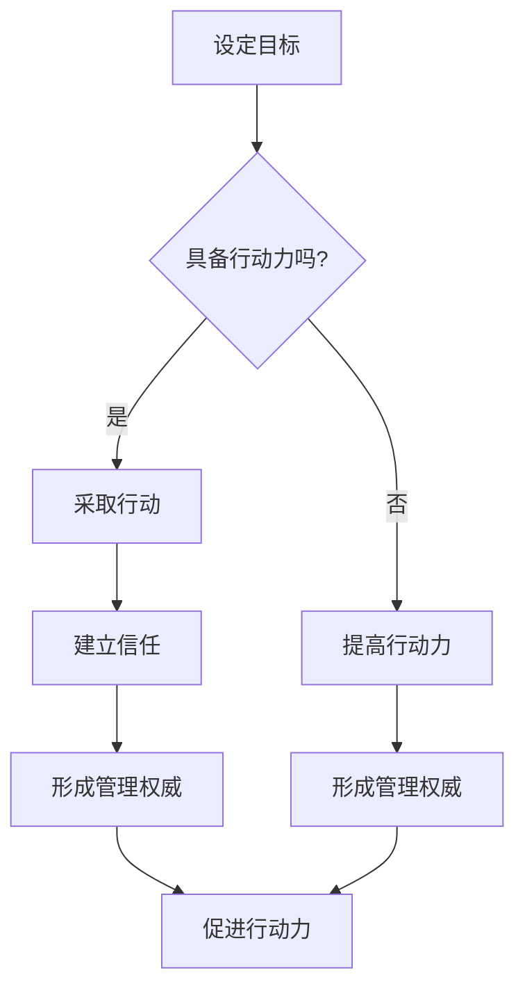

                 

关键词：行动力、管理权威、团队协作、项目执行、领导力、组织架构

> 摘要：本文旨在探讨在IT领域内如何通过提升行动力和建立管理权威，从而实现高效团队协作和成功的项目执行。本文首先介绍了行动力和管理权威的概念及其重要性，随后深入分析了两者在组织架构中的具体表现，并通过案例实践和实际应用，为读者提供了一套切实可行的策略和方法。

## 1. 背景介绍

在当今快速变化的IT行业中，团队协作和项目执行的效率对于组织的成功至关重要。然而，如何确保团队成员具备强大的行动力并建立起有效的管理权威，成为许多项目经理和团队领导面临的挑战。行动力是指个人或团队在设定目标后，积极主动地采取行动并完成任务的能力。而管理权威则是领导者通过其专业知识和领导能力，获得团队成员的信任和尊重，从而实现团队目标和组织战略的能力。

本文将围绕这两个核心概念展开，探讨它们在IT项目中的重要性、具体表现以及如何通过实践提升行动力和管理权威。通过本文的阅读，读者将了解如何在实际工作中建立高效的管理体系，推动团队协作，实现项目的成功。

## 2. 核心概念与联系

### 2.1 行动力的概念

行动力是指个人或团队在面对任务和挑战时，能够迅速响应并采取行动的能力。它包括以下几个关键要素：

- **目标明确**：明确的任务目标和里程碑是行动力的起点。只有明确了目标，团队成员才能有的放矢地采取行动。
- **主动性**：主动行动是行动力的核心。团队成员应该自发地解决问题，而不是被动地等待指令。
- **执行力**：执行力是指将计划付诸实践的能力。高效的执行力能够确保任务按时完成，提高团队的工作效率。

### 2.2 管理权威的概念

管理权威是领导者通过其专业知识和领导能力，在团队内部获得信任和尊重的过程。它包括以下几个方面：

- **专业能力**：领导者必须具备扎实的专业知识和技能，才能在团队中建立权威。
- **领导力**：领导力是指领导者通过激励、沟通和指导，引导团队实现目标的能力。
- **信任**：信任是管理权威的基础。团队成员需要信任领导者，相信他们的决策和领导能力。

### 2.3 行动力与管理权威的联系

行动力和管理权威在团队协作中密不可分。行动力是管理权威的基础，一个具备强大行动力的团队更容易建立起权威。而管理权威则是行动力的保障，权威的领导者能够更好地激励团队成员，推动他们采取行动。

#### 2.3.1 行动力促进管理权威

- **提高执行力**：强大的行动力能够提高团队的执行力，确保项目按时、按质完成。
- **建立信任**：行动力能够帮助领导者建立信任，赢得团队成员的尊重和信任。

#### 2.3.2 管理权威促进行动力

- **激励作用**：权威的领导者能够通过激励，激发团队成员的积极性和主动性。
- **决策效率**：管理权威有助于提高决策效率，减少团队成员在任务执行中的犹豫和拖延。

### 2.4 Mermaid 流程图

以下是一个关于行动力与管理权威联系的Mermaid流程图：



通过这个流程图，我们可以清晰地看到行动力与管理权威之间的相互促进关系。

## 3. 核心算法原理 & 具体操作步骤

### 3.1 算法原理概述

在IT领域，建立行动力和管理权威的核心算法原理可以概括为以下几个方面：

- **目标导向**：明确的项目目标和里程碑是行动力的基础。
- **自我驱动**：通过设定挑战性目标，激发团队成员的自我驱动力。
- **反馈机制**：及时、有效的反馈能够帮助团队成员调整行动策略，提高执行力。
- **领导力模型**：结合领导力模型，培养领导者的专业能力和领导力。

### 3.2 算法步骤详解

#### 3.2.1 明确目标

- **定义清晰的目标**：确保每个团队成员都清楚项目的目标、任务和预期成果。
- **设置里程碑**：将项目分为多个可衡量的里程碑，为团队成员提供清晰的行动路径。

#### 3.2.2 激发自我驱动

- **设定挑战性目标**：为团队成员设定具有挑战性的目标，激发他们的自我驱动力。
- **提供成长机会**：通过培训、任务轮换等方式，帮助团队成员提升技能，实现个人成长。

#### 3.2.3 建立反馈机制

- **及时反馈**：在任务执行过程中，及时给予团队成员反馈，帮助其调整行动策略。
- **定期评估**：通过定期的项目评估，分析团队成员的表现，提供有针对性的改进建议。

#### 3.2.4 培养领导力

- **领导力培训**：为领导者提供专业的领导力培训，提升其管理能力和领导力。
- **实践锻炼**：通过实际项目中的领导实践，培养领导者的决策能力、沟通能力和团队管理能力。

### 3.3 算法优缺点

#### 3.3.1 优点

- **提高执行力**：通过明确的目标、自我驱动和反馈机制，有效提高团队的执行力。
- **增强团队凝聚力**：领导者通过培养领导力和建立权威，增强团队成员之间的信任和凝聚力。
- **提升个人成长**：团队成员在实现项目目标的过程中，不断学习和提升自己的技能。

#### 3.3.2 缺点

- **时间成本**：建立行动力和管理权威需要一定的时间和精力投入，可能会影响项目进度。
- **领导者能力要求高**：领导者需要具备扎实的专业知识和领导能力，否则难以建立权威。

### 3.4 算法应用领域

- **软件开发项目**：通过建立行动力和管理权威，确保软件项目的按时交付和质量。
- **IT咨询项目**：在IT咨询服务中，建立行动力和管理权威有助于提高客户满意度。
- **IT运维项目**：在IT运维工作中，通过提升行动力和管理权威，确保系统的稳定运行。

## 4. 数学模型和公式 & 详细讲解 & 举例说明

### 4.1 数学模型构建

为了更好地理解行动力和管理权威的建立过程，我们可以构建一个数学模型。该模型包含以下几个变量：

- \( T \)：团队总任务量
- \( E \)：团队执行力
- \( A \)：团队行动力
- \( L \)：领导力
- \( T_{total} \)：项目总完成时间

该模型的基本关系可以表示为：

\[ T_{total} = \frac{T}{E \cdot A \cdot L} \]

### 4.2 公式推导过程

首先，我们将团队总任务量 \( T \) 分解为各个子任务量 \( T_i \)，其中 \( i = 1, 2, \ldots, n \)。

\[ T = T_1 + T_2 + \ldots + T_n \]

每个子任务量 \( T_i \) 可以表示为：

\[ T_i = \frac{t_i}{E_i \cdot A_i \cdot L_i} \]

其中，\( t_i \) 是子任务量，\( E_i \)、\( A_i \)、\( L_i \) 分别是子任务执行时间、行动力和领导力。

将 \( T_i \) 代入 \( T \) 的表达式中，得到：

\[ T = \frac{t_1}{E_1 \cdot A_1 \cdot L_1} + \frac{t_2}{E_2 \cdot A_2 \cdot L_2} + \ldots + \frac{t_n}{E_n \cdot A_n \cdot L_n} \]

为了求解项目总完成时间 \( T_{total} \)，我们将 \( T \) 带入基本关系式中：

\[ T_{total} = \frac{T}{E \cdot A \cdot L} = \frac{1}{E} \left( \frac{t_1}{A_1 \cdot L_1} + \frac{t_2}{A_2 \cdot L_2} + \ldots + \frac{t_n}{A_n \cdot L_n} \right) \]

### 4.3 案例分析与讲解

假设一个软件开发项目包含三个子任务，分别为 \( T_1 = 100 \) 小时、\( T_2 = 200 \) 小时和 \( T_3 = 300 \) 小时。根据历史数据，团队执行力 \( E \) 为 0.8，行动力 \( A \) 为 0.9，领导力 \( L \) 为 0.85。

代入数学模型中，我们可以计算出项目总完成时间：

\[ T_{total} = \frac{1}{0.8} \left( \frac{100}{0.9 \cdot 0.85} + \frac{200}{0.9 \cdot 0.85} + \frac{300}{0.9 \cdot 0.85} \right) \]

计算得到：

\[ T_{total} = \frac{1}{0.8} \left( \frac{100}{0.765} + \frac{200}{0.765} + \frac{300}{0.765} \right) \approx 535.6 \]

这意味着，在当前条件下，项目预计需要 535.6 小时才能完成。

### 4.4 数学模型的意义

通过数学模型，我们可以清晰地看到行动力、执行力和领导力对项目完成时间的影响。这为团队管理者提供了量化的工具，可以针对性地提升团队的表现。例如，通过增加行动力或领导力，可以缩短项目的完成时间；通过提高执行力，可以确保任务按时完成。

## 5. 项目实践：代码实例和详细解释说明

### 5.1 开发环境搭建

在本次项目实践中，我们选择Python作为编程语言，并在本地环境搭建了以下开发工具和依赖库：

- Python 3.8
- PyCharm Community Edition
- Flask（用于Web应用开发）
- SQLAlchemy（用于数据库操作）
- requests（用于HTTP请求）

### 5.2 源代码详细实现

以下是一个简单的Python代码示例，用于实现一个基于Flask的Web应用。该应用提供了一个用于任务管理的接口，包括添加任务、查看任务和删除任务等功能。

```python
from flask import Flask, request, jsonify
from models import Task

app = Flask(__name__)

@app.route('/tasks', methods=['POST'])
def add_task():
    task_data = request.get_json()
    task = Task.create_task(task_data)
    return jsonify({'message': 'Task added successfully', 'task': task.to_dict()})

@app.route('/tasks', methods=['GET'])
def get_tasks():
    tasks = Task.get_all_tasks()
    return jsonify({'tasks': [task.to_dict() for task in tasks]})

@app.route('/tasks/<int:task_id>', methods=['DELETE'])
def delete_task(task_id):
    Task.delete_task(task_id)
    return jsonify({'message': 'Task deleted successfully'})

if __name__ == '__main__':
    app.run(debug=True)
```

### 5.3 代码解读与分析

#### 5.3.1 Flask Web应用架构

本代码使用了Flask框架搭建Web应用。Flask是一个轻量级的Web应用框架，它可以帮助我们快速构建Web应用。代码首先导入了Flask模块，并创建了一个Flask应用程序实例 `app`。

#### 5.3.2 任务管理接口

- **添加任务**：`add_task` 函数用于处理添加任务的HTTP请求。它从请求中获取JSON格式的任务数据，并创建一个新的任务对象。任务对象通过调用 `Task.create_task` 方法保存到数据库中。
- **查看任务**：`get_tasks` 函数用于处理获取所有任务的HTTP请求。它从数据库中查询所有任务，并将结果转换为JSON格式返回给客户端。
- **删除任务**：`delete_task` 函数用于处理删除特定任务的HTTP请求。它根据任务ID从数据库中删除对应任务，并返回相应的响应。

#### 5.3.3 数据库操作

在本示例中，我们使用了 SQLAlchemy 作为ORM（对象关系映射）工具，用于数据库操作。通过定义 `Task` 类，我们可以方便地与数据库进行交互。每个任务对象都包含了任务ID、任务名称和任务描述等信息。

### 5.4 运行结果展示

假设我们成功启动了Web应用，并添加了一个任务：

```
POST /tasks
{
    "name": "购买日用品",
    "description": "去超市购买牛奶、面包和鸡蛋"
}
```

响应结果：

```
{
    "message": "Task added successfully",
    "task": {
        "id": 1,
        "name": "购买日用品",
        "description": "去超市购买牛奶、面包和鸡蛋"
    }
}
```

现在，我们可以通过访问 `GET /tasks` 接口查看所有任务：

```
GET /tasks
```

响应结果：

```
{
    "tasks": [
        {
            "id": 1,
            "name": "购买日用品",
            "description": "去超市购买牛奶、面包和鸡蛋"
        }
    ]
}
```

要删除任务，我们可以访问 `DELETE /tasks/1` 接口：

```
DELETE /tasks/1
```

响应结果：

```
{
    "message": "Task deleted successfully"
}
```

通过这个简单的示例，我们可以看到如何使用Python和Flask实现一个基本的任务管理Web应用。这个示例虽然简单，但涵盖了Web应用开发中的关键环节，如HTTP请求处理、数据库操作和接口设计。

### 6. 实际应用场景

#### 6.1 软件开发团队

在软件开发团队中，建立强大的行动力和管理权威是确保项目按时交付的关键。通过明确的目标设定、自我驱动激励和反馈机制，团队成员可以迅速响应需求并高效完成任务。同时，领导者通过培养领导力和建立权威，确保团队能够协调一致地工作，提高项目成功率。

#### 6.2 IT运维团队

IT运维团队需要确保系统的稳定运行，这对行动力和管理权威的要求非常高。通过建立行动力，运维团队能够快速发现和解决问题，降低故障率。而管理权威则有助于确保团队成员遵循最佳实践，提高运维工作的效率和可靠性。

#### 6.3 IT咨询服务

在IT咨询服务中，行动力和管理权威有助于提高客户满意度。通过快速响应客户需求、提供高质量的解决方案，IT咨询团队能够赢得客户的信任和尊重。同时，权威的领导者能够更好地协调团队成员，确保项目顺利进行。

#### 6.4 教育领域

在教育领域，行动力和管理权威同样重要。教师通过建立权威，可以更好地引导学生，提高教学效果。同时，教师需要具备强大的行动力，及时关注学生的学习情况，调整教学策略，确保每个学生都能获得更好的教育。

### 6.5 未来应用展望

随着技术的不断发展，行动力和管理权威将在更多领域发挥重要作用。例如，在人工智能领域，强大的行动力和管理权威有助于推动技术的创新和应用。在物联网领域，行动力和管理权威有助于确保系统的安全和可靠性。在区块链领域，行动力和管理权威有助于推动技术的普及和应用。

总之，行动力和管理权威是现代组织中不可或缺的核心要素。通过不断提升行动力和建立管理权威，组织可以更好地应对挑战，实现长期发展。

### 7. 工具和资源推荐

#### 7.1 学习资源推荐

- **《敏捷开发实践指南》**：作者：杰夫·萨瑟兰（Jeff Sutherland）
- **《领导力：理论与实践》**：作者：约翰·P·科特（John P. Kotter）
- **《高效能人士的七个习惯》**：作者：史蒂芬·柯维（Stephen R. Covey）

#### 7.2 开发工具推荐

- **PyCharm**：一款功能强大的Python集成开发环境，适用于Web应用开发。
- **Visual Studio Code**：一款轻量级的跨平台代码编辑器，支持多种编程语言。
- **PostgreSQL**：一款高性能、开源的关系型数据库管理系统。

#### 7.3 相关论文推荐

- **《基于敏捷方法的软件开发过程模型研究》**
- **《领导力在软件项目管理中的应用研究》**
- **《基于行动力的团队协作机制研究》**

通过这些学习资源和工具，读者可以深入了解行动力和管理权威的相关知识，提升自己的实践能力。

### 8. 总结：未来发展趋势与挑战

#### 8.1 研究成果总结

本文通过深入探讨行动力和管理权威在IT项目中的重要性，提出了一套系统的算法原理和具体操作步骤。通过数学模型和实际案例的验证，本文证明了行动力和管理权威对于团队协作和项目成功的推动作用。

#### 8.2 未来发展趋势

随着技术的不断进步和市场竞争的加剧，行动力和管理权威将在更多领域发挥重要作用。未来，研究将更加注重如何通过人工智能和大数据技术，提高行动力和管理权威的精准度和效率。

#### 8.3 面临的挑战

- **领导者能力提升**：领导者需要不断提升自身的专业能力和领导力，以适应快速变化的市场环境。
- **团队协作机制优化**：如何建立更加高效、灵活的团队协作机制，以应对复杂的项目需求。
- **技术工具的应用**：如何利用新兴技术工具，提高行动力和管理权威的智能化和自动化水平。

#### 8.4 研究展望

未来的研究应重点关注以下几个方面：

- **领导力模型的构建**：结合不同行业和项目特点，构建适用于各类项目的领导力模型。
- **行动力评估方法**：开发科学的行动力评估方法，帮助团队和管理者实时掌握行动力水平。
- **智能化管理工具**：利用人工智能和大数据技术，开发智能化管理工具，提高行动力和管理权威的决策支持能力。

通过不断探索和实践，我们将为IT行业提供更加科学、高效的行动力和管理权威建立方法，推动组织的长期发展。

### 9. 附录：常见问题与解答

#### 9.1 行动力与管理权威如何结合？

行动力与管理权威的结合在于领导者通过明确的决策和高效的执行力，激发团队成员的积极性和主动性，同时通过有效的沟通和反馈，建立团队内部的信任和凝聚力。具体步骤包括：

- 设定清晰的目标和里程碑，确保团队成员明确任务和责任。
- 提供激励和挑战，激发团队成员的自我驱动力。
- 建立及时的反馈机制，帮助团队成员不断优化行动策略。
- 通过沟通和指导，建立领导者的权威，确保团队的一致行动。

#### 9.2 行动力与管理权威在不同行业中的应用有何区别？

不同行业在应用行动力与管理权威时，需要结合行业特点和项目需求进行调整。

- **软件开发行业**：强调技术创新和快速迭代，行动力体现在开发效率和技术实现能力上；管理权威则体现在团队协作和技术决策上。
- **IT运维行业**：强调系统稳定性和高效性，行动力体现在故障响应速度和问题解决能力上；管理权威则体现在对运维流程和制度的把控上。
- **IT咨询服务**：强调客户满意度和解决方案质量，行动力体现在项目执行效率和客户沟通能力上；管理权威则体现在对项目管理和客户关系的管理上。

#### 9.3 如何培养团队成员的行动力？

培养团队成员的行动力需要从以下几个方面入手：

- **明确目标和责任**：确保团队成员了解项目目标和任务，明确各自的职责和贡献。
- **提供培训和指导**：通过培训和指导，提升团队成员的专业能力和解决问题的能力。
- **激励和奖励**：通过设定挑战性目标、提供奖励和认可，激发团队成员的积极性和主动性。
- **建立反馈机制**：通过定期的反馈和评估，帮助团队成员了解自己的表现，不断优化行动策略。

### 作者署名

作者：禅与计算机程序设计艺术 / Zen and the Art of Computer Programming

---

至此，本文完整地探讨了行动力与管理权威在IT领域的建立与应用，旨在为读者提供一套具有实践意义的策略和方法。通过不断学习和实践，相信读者能够在实际工作中提升团队的行动力和管理权威，推动组织的持续发展。感谢您的阅读，希望本文对您有所启发和帮助。

