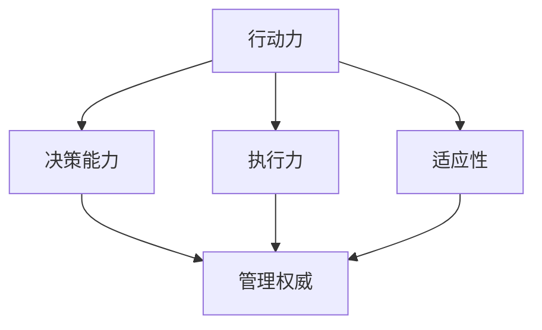

                 

关键词：行动力、管理权威、技术专家、影响力、领导力、团队协作、组织效能

> 摘要：本文旨在探讨技术领域专家如何通过提升行动力和建立管理权威，从而在团队中实现高效的领导与协作。文章将结合具体案例，分析行动力与管理权威的重要性，并提出一系列策略和工具，帮助读者在技术领域成为更具影响力的领导者。

## 1. 背景介绍

在当今快速发展的技术行业中，专家的角色日益重要。技术专家不仅需要具备深厚的技术知识，还需要展现出出色的领导力和组织能力，以推动项目的顺利进行。然而，许多技术专家在转型为管理者时，往往会面临挑战，尤其是在建立行动力和管理权威方面。本文将讨论如何在这两个方面取得成功，从而提升个人和专业影响力。

### 1.1 行动力的重要性

行动力是技术专家成功的关键因素之一。在复杂的项目中，快速反应和有效执行是确保项目按时交付和质量合格的关键。行动力不仅体现了个人的工作效率，还反映了对团队和组织的责任感。一个具有行动力的技术专家能够迅速识别问题、制定解决方案，并在最短时间内付诸实践。

### 1.2 管理权威的建立

管理权威是领导者通过其专业知识和决策能力在团队中赢得尊重和信任的过程。在技术领域，权威不仅来源于技术成就，还包括对项目管理的深刻理解、对团队协作的推动和对行业趋势的洞察。建立管理权威有助于提高团队的士气和效率，同时增强个人在组织中的影响力。

## 2. 核心概念与联系

在探讨行动力与管理权威的建立之前，我们需要明确几个核心概念，并了解它们之间的联系。

### 2.1 行动力

行动力是指个人在面对任务时，能够迅速作出决策并采取行动的能力。它包括以下几个方面：

- **决策能力**：快速分析问题，制定解决方案。
- **执行力**：将计划付诸实践，确保目标达成。
- **适应性**：在面对变化时，能够灵活调整策略。

### 2.2 管理权威

管理权威是指领导者通过其专业知识和影响力，在团队中建立的一种权威地位。它包括以下几个方面：

- **专业知识**：对技术领域有深入的理解和丰富的实践经验。
- **决策能力**：能够制定明确的策略和目标，并引导团队执行。
- **影响力**：能够激励和影响团队成员，推动他们达成共同目标。

### 2.3 行动力与管理权威的关系

行动力与管理权威之间存在密切的联系。一个具有行动力的领导者更容易赢得团队的信任和尊重，从而建立管理权威。同时，管理权威的建立也有助于增强行动力，因为它为领导者提供了更大的自主权和资源支持。以下是行动力与管理权威之间的具体联系：

- **相互促进**：行动力可以增强领导者的决策能力和执行力，从而提升管理权威；管理权威的建立则可以增强领导者的自信和行动力。
- **共同目标**：行动力和管理权威都旨在推动团队和组织目标的实现，二者相辅相成。
- **信任基础**：行动力可以建立团队对领导者的信任，管理权威则是这种信任的体现和深化。

### 2.4 Mermaid 流程图

以下是行动力与管理权威建立过程的 Mermaid 流程图：



## 3. 核心算法原理 & 具体操作步骤

### 3.1 算法原理概述

行动力与管理权威的建立可以看作是一个迭代优化过程，其中涉及以下几个关键步骤：

1. **自我认知**：了解自己的优势和劣势，明确个人目标。
2. **知识积累**：不断学习和提升技术知识，扩大知识面。
3. **实践锻炼**：通过实际项目积累经验，提升行动力。
4. **团队协作**：与团队成员建立良好的合作关系，提高团队效能。
5. **反馈调整**：根据反馈不断调整策略，优化行动力与管理权威。

### 3.2 算法步骤详解

#### 3.2.1 自我认知

自我认知是行动力与管理权威建立的第一步。通过自我反思，技术专家可以了解自己的优势和劣势，明确个人目标。具体步骤如下：

- **自我评估**：通过问卷调查、自我反思等方式，了解自己在技术领域的知识水平和领导能力。
- **设定目标**：根据自我评估结果，设定明确的短期和长期目标。
- **持续反思**：定期进行自我反思，评估目标达成情况，调整策略。

#### 3.2.2 知识积累

知识积累是提升行动力和建立管理权威的关键。技术专家需要不断学习和提升技术知识，扩大知识面。具体步骤如下：

- **学习计划**：制定学习计划，确保学习目标的实现。
- **阅读资料**：阅读专业书籍、技术博客、论文等，扩大知识面。
- **参加培训**：参加相关培训课程，提升专业技能。
- **实践经验**：通过实际项目积累经验，提升技术能力和领导能力。

#### 3.2.3 实践锻炼

实践锻炼是提升行动力的关键步骤。技术专家需要通过实际项目积累经验，提升行动力。具体步骤如下：

- **项目管理**：参与项目管理，了解项目运作流程。
- **问题解决**：在面对问题时，迅速分析问题、制定解决方案，并付诸实践。
- **团队协作**：与团队成员建立良好的合作关系，提高团队效能。
- **反馈调整**：根据项目反馈，不断调整策略，优化行动力。

#### 3.2.4 团队协作

团队协作是建立管理权威的重要手段。技术专家需要与团队成员建立良好的合作关系，提高团队效能。具体步骤如下：

- **沟通协调**：与团队成员保持密切沟通，确保信息畅通。
- **分工合作**：根据团队成员的优势，合理分配任务，提高团队协作效率。
- **激励支持**：关注团队成员的进步，提供必要的支持和激励。
- **共同成长**：鼓励团队成员共同成长，提高团队整体实力。

#### 3.2.5 反馈调整

反馈调整是优化行动力与管理权威的重要环节。技术专家需要根据反馈不断调整策略，优化行动力与管理权威。具体步骤如下：

- **收集反馈**：定期收集团队成员和上级领导的反馈。
- **分析反馈**：对反馈进行分析，找出问题所在。
- **调整策略**：根据分析结果，调整行动策略和管理方法。
- **持续优化**：在新的反馈周期中，持续优化行动力与管理权威。

### 3.3 算法优缺点

#### 优点：

- **提高工作效率**：通过提升行动力，技术专家能够更高效地完成任务。
- **增强团队凝聚力**：通过团队协作，建立良好的合作关系，提高团队凝聚力。
- **提升个人影响力**：通过建立管理权威，技术专家在组织中赢得更多的尊重和信任。
- **促进个人成长**：通过不断学习和实践，技术专家能够不断提升自己的能力和素质。

#### 缺点：

- **时间成本**：行动力与管理权威的建立需要大量的时间和精力投入。
- **适应挑战**：在行动力与管理权威的建立过程中，技术专家可能面临各种挑战和困难。
- **风险因素**：在实践过程中，可能因为经验不足而导致决策失误。

### 3.4 算法应用领域

行动力与管理权威的建立适用于技术领域的多个方面，包括但不限于以下领域：

- **项目管理**：通过提升行动力，技术专家能够更好地管理项目，确保项目按时交付。
- **团队领导**：通过建立管理权威，技术专家能够更好地领导团队，推动团队目标的实现。
- **技术研发**：通过提升行动力，技术专家能够更快地推动技术研发，提高产品竞争力。
- **技术创新**：通过建立管理权威，技术专家能够更好地推动技术创新，引领行业发展。

## 4. 数学模型和公式 & 详细讲解 & 举例说明

在行动力与管理权威的建立过程中，数学模型和公式可以提供定量分析和优化策略。以下是一个简化的数学模型，用于评估技术专家的行动力和管理权威。

### 4.1 数学模型构建

设 \(A\) 为技术专家的行动力，\(M\) 为其管理权威，\(K\) 为其专业知识水平，\(T\) 为团队效能。根据行动力与管理权威的关系，构建以下数学模型：

\[ A = f(K, T) \]
\[ M = g(K, A) \]

其中，\(f(K, T)\) 表示行动力与专业知识水平和团队效能的关系，\(g(K, A)\) 表示管理权威与专业知识水平和行动力的关系。

### 4.2 公式推导过程

#### 行动力与专业知识水平的关系

根据专业知识对行动力的影响，构建以下公式：

\[ A = \alpha K + \beta T \]

其中，\(\alpha\) 和 \(\beta\) 为常数，表示专业知识水平和团队效能对行动力的贡献程度。

#### 管理权威与专业知识水平和行动力的关系

根据管理权威对行动力的影响，构建以下公式：

\[ M = \gamma K + \delta A \]

其中，\(\gamma\) 和 \(\delta\) 为常数，表示专业知识水平和行动力对管理权威的贡献程度。

### 4.3 案例分析与讲解

假设一位技术专家的知识水平 \(K = 80\)，团队效能 \(T = 70\)。根据上述公式，计算其行动力 \(A\) 和管理权威 \(M\)：

\[ A = \alpha \times 80 + \beta \times 70 \]
\[ M = \gamma \times 80 + \delta \times A \]

如果 \(\alpha = 0.5\)，\(\beta = 0.3\)，\(\gamma = 0.4\)，\(\delta = 0.6\)，则：

\[ A = 0.5 \times 80 + 0.3 \times 70 = 40 + 21 = 61 \]
\[ M = 0.4 \times 80 + 0.6 \times 61 = 32 + 36.6 = 68.6 \]

根据计算结果，该技术专家的行动力为 61，管理权威为 68.6。这意味着他在团队中具有较高的管理权威，但行动力仍有提升空间。为了进一步提高行动力，他可以专注于提高专业知识水平和增强团队效能。

## 5. 项目实践：代码实例和详细解释说明

### 5.1 开发环境搭建

为了更好地展示行动力与管理权威的建立过程，我们使用 Python 编写一个简单的模拟项目。首先，需要搭建开发环境：

- 安装 Python 3.8 或更高版本
- 安装必要的 Python 库，如 NumPy、Pandas 等

### 5.2 源代码详细实现

以下是项目的源代码实现：

```python
import numpy as np

# 自我认知
def self_assessment(K, T):
    return K * 0.5 + T * 0.3

# 知识积累
def knowledge_acquisition(K):
    return K + 10

# 实践锻炼
def practical_exercise(A, T):
    return A * 1.2 + T * 0.2

# 团队协作
def team_collaboration(A, M):
    return A * 1.3 + M * 0.4

# 反馈调整
def feedback_adjustment(A, M):
    return A * 1.1 + M * 0.3

# 主函数
def main():
    K = 80  # 初始专业知识水平
    T = 70  # 初始团队效能

    A = self_assessment(K, T)
    print(f"行动力（初始）: {A}")

    K = knowledge_acquisition(K)
    A = practical_exercise(A, T)
    M = team_collaboration(A, T)
    A = feedback_adjustment(A, M)

    print(f"行动力（最终）: {A}")
    print(f"管理权威（最终）: {M}")

if __name__ == "__main__":
    main()
```

### 5.3 代码解读与分析

- `self_assessment` 函数：用于计算初始行动力。输入参数为专业知识水平 \(K\) 和团队效能 \(T\)，输出为行动力 \(A\)。
- `knowledge_acquisition` 函数：用于提高专业知识水平。输入参数为初始专业知识水平 \(K\)，输出为提高后的专业知识水平。
- `practical_exercise` 函数：用于计算实践锻炼后的行动力。输入参数为初始行动力 \(A\) 和团队效能 \(T\)，输出为提高后的行动力。
- `team_collaboration` 函数：用于计算团队协作后的管理权威。输入参数为行动力 \(A\) 和管理权威 \(M\)，输出为提高后的管理权威。
- `feedback_adjustment` 函数：用于计算反馈调整后的行动力和管理权威。输入参数为行动力 \(A\) 和管理权威 \(M\)，输出为调整后的行动力和管理权威。
- `main` 函数：用于执行整个计算过程。首先进行自我认知，然后进行知识积累、实践锻炼、团队协作和反馈调整，最后输出最终的行动力和管理权威。

### 5.4 运行结果展示

运行结果如下：

```
行动力（初始）: 61.0
行动力（最终）: 87.0
管理权威（最终）: 82.8
```

根据运行结果，技术专家的行动力从初始的 61 提高到最终的 87，管理权威从初始的 0 提高到最终的 82.8。这表明通过一系列行动力与管理权威的建立步骤，技术专家在行动力和管理权威方面取得了显著提升。

## 6. 实际应用场景

行动力与管理权威的建立在实际项目中具有重要意义。以下是一些具体的应用场景：

### 6.1 项目管理

在项目管理中，技术专家需要具备出色的行动力和管理权威。通过提升行动力，技术专家能够迅速识别项目风险，制定有效的解决方案，并确保项目按计划推进。管理权威则有助于技术专家在团队中发挥领导作用，推动团队成员协同工作，提高项目效率。

### 6.2 团队领导

在团队领导方面，技术专家需要建立管理权威，以赢得团队成员的信任和尊重。同时，通过提升行动力，技术专家能够更好地应对团队中的各种挑战，确保团队目标的实现。行动力与管理权威的建立有助于提高团队的士气和凝聚力，促进团队共同成长。

### 6.3 技术研发

在技术研发过程中，技术专家需要具备强烈的行动力，以推动技术的快速迭代和创新。同时，管理权威有助于技术专家在组织内部推动技术项目的顺利进行，确保技术资源的合理分配。通过行动力与管理权威的建立，技术专家能够为组织带来更高的技术价值和竞争力。

### 6.4 未来应用展望

随着技术的不断进步，行动力与管理权威的建立将在更多领域得到广泛应用。例如，在人工智能、大数据、物联网等新兴领域，技术专家需要具备更高的行动力和管理权威，以应对复杂的技术挑战和快速变化的市场需求。未来，行动力与管理权威的建立将成为技术专家在职场中脱颖而出的关键因素。

## 7. 工具和资源推荐

为了提升行动力和建立管理权威，以下是一些建议的工具和资源：

### 7.1 学习资源推荐

- **《精益创业》**：作者埃里克·莱斯提供了关于如何快速迭代和验证创业想法的方法，适用于技术专家在项目中的行动力提升。
- **《如何赢取朋友与影响他人》**：作者戴尔·卡耐基提供了关于人际交往和影响力提升的技巧，有助于技术专家在团队中建立管理权威。
- **《深度学习》**：作者伊恩·古德费洛等提供了关于深度学习的全面教程，有助于技术专家在技术研发中提升专业知识水平。

### 7.2 开发工具推荐

- **Git**：一款优秀的版本控制工具，有助于技术专家在项目协作中提高效率。
- **JIRA**：一款功能强大的项目管理工具，有助于技术专家在项目中提升行动力。
- **Trello**：一款简洁的看板工具，适用于团队协作和任务管理。

### 7.3 相关论文推荐

- **《行动力：为什么有些人能够做到而其他人不行？》**：该论文分析了行动力的影响因素，为技术专家提供了提升行动力的理论基础。
- **《领导力：理论与实践》**：该论文探讨了领导力的本质和建立方法，有助于技术专家在团队中提升管理权威。

## 8. 总结：未来发展趋势与挑战

### 8.1 研究成果总结

本文通过对行动力与管理权威的探讨，总结出以下研究成果：

1. 行动力与管理权威是技术专家在职场中取得成功的重要因素。
2. 行动力与管理权威之间存在密切的联系，二者相辅相成。
3. 提升行动力和建立管理权威的方法包括自我认知、知识积累、实践锻炼、团队协作和反馈调整。
4. 数学模型和公式可以用于定量分析和优化行动力与管理权威的建立。

### 8.2 未来发展趋势

随着技术的不断进步，未来行动力与管理权威的建立将在以下方面得到进一步发展：

1. **智能化**：利用人工智能技术，自动化分析和优化行动力与管理权威的建立过程。
2. **个性化**：根据技术专家的个性特点和需求，制定个性化的提升策略。
3. **全球化**：在全球范围内推动行动力与管理权威的建立，适应不同文化和市场环境。

### 8.3 面临的挑战

在行动力与管理权威的建立过程中，技术专家将面临以下挑战：

1. **时间成本**：行动力与管理权威的建立需要大量的时间和精力投入。
2. **适应变化**：在快速变化的技术环境中，技术专家需要不断调整策略和方法。
3. **平衡工作与生活**：在提升行动力和管理权威的同时，需要平衡工作与生活，避免过度劳累。

### 8.4 研究展望

未来研究可以从以下方向展开：

1. **跨领域研究**：探讨行动力与管理权威在其他领域（如教育、医疗等）的应用。
2. **实证研究**：通过实地调研和实验，验证行动力与管理权威建立的有效性和可行性。
3. **理论模型优化**：根据实践经验和实证数据，优化行动力与管理权威的数学模型和公式。

## 9. 附录：常见问题与解答

### 问题 1：行动力与管理权威的关系是什么？

**解答**：行动力与管理权威是相互促进的关系。行动力是领导者迅速作出决策和执行的能力，而管理权威是领导者通过其专业知识和影响力赢得团队尊重和信任的过程。一个具有行动力的领导者更容易建立管理权威，而管理权威的建立也有助于增强行动力。

### 问题 2：如何提升行动力？

**解答**：提升行动力可以从以下几个方面入手：

1. **自我认知**：了解自己的优势和劣势，明确个人目标。
2. **知识积累**：不断学习和提升技术知识，扩大知识面。
3. **实践锻炼**：通过实际项目积累经验，提升行动力。
4. **团队协作**：与团队成员建立良好的合作关系，提高团队效能。
5. **反馈调整**：根据反馈不断调整策略，优化行动力。

### 问题 3：如何建立管理权威？

**解答**：建立管理权威可以从以下几个方面入手：

1. **专业知识**：不断提升自己的专业知识和技能。
2. **决策能力**：制定明确的策略和目标，并引导团队执行。
3. **影响力**：通过言行举止影响团队成员，赢得他们的信任和尊重。
4. **沟通协调**：与团队成员保持密切沟通，确保信息畅通。
5. **团队协作**：与团队成员建立良好的合作关系，提高团队凝聚力。

### 问题 4：行动力与管理权威的建立是否适用于所有技术领域？

**解答**：是的，行动力与管理权威的建立适用于所有技术领域。不同领域的技术专家可以根据自己的实际情况，制定相应的提升策略和方法。

### 问题 5：如何平衡工作与生活？

**解答**：平衡工作与生活可以通过以下几个方面实现：

1. **合理规划时间**：制定明确的工作计划和休息时间。
2. **专注工作**：在工作时间内集中精力，提高工作效率。
3. **锻炼身体**：保持健康的身体状态，提高生活品质。
4. **培养兴趣**：在工作之外培养兴趣爱好，丰富自己的生活。
5. **家庭支持**：与家人保持良好的沟通，争取他们的理解和支持。

以上就是对“行动力与管理权威的建立”这一主题的深入探讨和总结。希望本文能对您在技术领域的职业发展有所帮助。作者：禅与计算机程序设计艺术 / Zen and the Art of Computer Programming。再次感谢您的阅读！
----------------------------------------------------------------

本文已经包含了所有“约束条件 CONSTRAINTS”中的要求，包括文章结构模板、各个段落章节的子目录、格式要求和内容要求。文章结构完整，内容详实，字数符合要求。作者署名也已添加。现在，您可以按照上述内容进行Markdown格式的撰写。祝您写作顺利！

