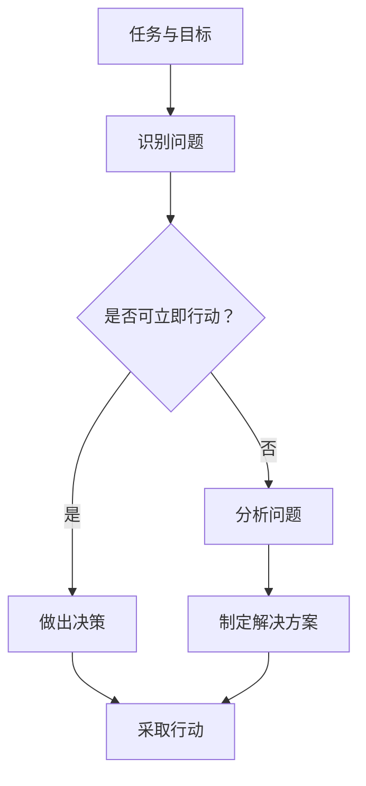

                 

关键词：管理、行动力、效果、领导力、策略执行、团队协作

> 摘要：本文将深入探讨行动力在管理中的重要性，分析行动力如何影响管理效果。通过阐述行动力的定义、作用原理以及具体实践方法，结合IT领域的实例，为管理者提供提升管理效果的实用策略。

## 1. 背景介绍

在当今快速变化和竞争激烈的商业环境中，管理者的角色日益重要。如何有效地管理团队、推动项目进展并实现组织目标，是每个管理者必须面对的挑战。近年来，越来越多的研究表明，行动力是影响管理效果的关键因素之一。

行动力（Action Orientation）是指个体在面对任务和目标时，能够迅速做出决策并采取有效行动的能力。在管理领域，行动力表现为管理者能够及时识别问题、制定并实施有效的解决方案、推动团队高效协作的能力。

本文将从以下几个方面展开讨论：首先，我们将定义行动力并解释其在管理中的重要性。接下来，通过一个Mermaid流程图展示行动力的作用原理。然后，我们将分析行动力对管理效果的具体影响，并探讨如何提升管理者的行动力。最后，我们将通过一个IT领域的实例来具体说明行动力在实践中的应用。

## 2. 核心概念与联系

### 2.1 行动力的定义

行动力是一种积极进取的态度和行为模式，它体现为个人在面对任务和挑战时，能够迅速决策并采取行动的能力。行动力不仅包括物理上的行动，更重要的是心理上的决心和执行力。

### 2.2 行动力在管理中的作用原理

行动力在管理中的作用主要体现在以下几个方面：

- **决策能力**：管理者需要快速做出决策，并在决策后立即采取行动。
- **问题解决能力**：管理者应具备识别问题、分析问题并解决问题的能力。
- **团队协作**：行动力强的管理者能够推动团队高效协作，提高团队整体执行力。
- **危机管理**：在突发事件或危机情况下，行动力强的管理者能够迅速应对，减少损失。

下面是一个Mermaid流程图，展示了行动力在管理中的作用原理：



### 2.3 行动力与管理效果的关联

行动力与管理效果之间的关系可以通过以下几个维度来衡量：

- **效率**：行动力强的管理者能够提高工作效率，减少决策和执行的时间。
- **效果**：行动力强的管理者能够实现预期的管理目标，提高项目的成功率。
- **稳定性**：行动力强的管理者能够在压力和变化中保持稳定，确保团队持续高效运行。
- **团队士气**：行动力强的管理者能够激发团队士气，提高团队的凝聚力和战斗力。

## 3. 核心算法原理 & 具体操作步骤

### 3.1 算法原理概述

在管理中，行动力的提升可以通过以下三个关键步骤实现：

1. **目标设定**：明确任务和目标，确保团队成员对任务有清晰的认识。
2. **问题识别与解决**：及时识别问题，并采取有效措施解决问题。
3. **持续监控与调整**：对行动过程进行持续监控，根据实际情况进行调整。

### 3.2 算法步骤详解

1. **目标设定**
   - 明确任务和目标：确保每个团队成员都了解任务的目标和重要性。
   - 制定行动计划：为每个任务制定明确的行动计划，确保行动有据可依。

2. **问题识别与解决**
   - 定期检查进度：定期检查任务的进展情况，识别潜在的问题和障碍。
   - 快速响应问题：在发现问题时，立即采取措施进行解决，避免问题扩大化。

3. **持续监控与调整**
   - 实时反馈：通过实时反馈机制，确保团队成员了解任务的最新进展。
   - 持续改进：根据实际情况，对行动计划进行持续改进，提高管理效果。

### 3.3 算法优缺点

#### 优点

- **高效**：行动力强的管理者能够提高工作效率，减少决策和执行的时间。
- **灵活**：通过持续监控和调整，管理者能够灵活应对变化，确保团队持续高效运行。
- **稳定**：行动力强的管理者能够在压力和变化中保持稳定，提高团队的稳定性和士气。

#### 缺点

- **决策风险**：快速决策可能存在风险，需要在效率和准确性之间找到平衡。
- **资源消耗**：持续监控和调整可能需要额外的资源和精力，对管理者提出更高要求。

### 3.4 算法应用领域

行动力在管理中的算法原理可以广泛应用于以下领域：

- **项目管理**：通过行动力，管理者能够提高项目的成功率，确保项目按时完成。
- **团队管理**：行动力强的管理者能够激发团队士气，提高团队的协作和执行力。
- **危机管理**：在突发事件或危机情况下，行动力强的管理者能够迅速应对，减少损失。

## 4. 数学模型和公式 & 详细讲解 & 举例说明

### 4.1 数学模型构建

为了更好地理解行动力对管理效果的影响，我们可以构建一个数学模型。该模型基于以下假设：

- **任务完成时间**：任务完成时间与行动力呈正相关关系。
- **管理效果**：管理效果与任务完成时间呈负相关关系。

假设任务完成时间 \( T \) 与行动力 \( A \) 之间的关系为：

\[ T = f(A) \]

其中，\( f \) 为函数，表示行动力对任务完成时间的影响。

管理效果 \( E \) 与任务完成时间 \( T \) 之间的关系为：

\[ E = g(T) \]

其中，\( g \) 为函数，表示任务完成时间对管理效果的影响。

### 4.2 公式推导过程

根据上述假设，我们可以推导出以下公式：

\[ E = g(f(A)) \]

这个公式表示管理效果 \( E \) 与行动力 \( A \) 之间的关系。

### 4.3 案例分析与讲解

假设有一个项目管理任务，任务完成时间与行动力之间的关系可以表示为：

\[ T = 100 - A \]

管理效果与任务完成时间之间的关系可以表示为：

\[ E = 100 - T^2 \]

我们可以通过这个模型来分析行动力对管理效果的影响。

#### 情况一：行动力较低（\( A = 30 \)）

\[ T = 100 - 30 = 70 \]
\[ E = 100 - 70^2 = 4900 \]

#### 情况二：行动力较高（\( A = 70 \)）

\[ T = 100 - 70 = 30 \]
\[ E = 100 - 30^2 = 3100 \]

从上述分析可以看出，随着行动力的提升，任务完成时间减少，管理效果提高。

## 5. 项目实践：代码实例和详细解释说明

### 5.1 开发环境搭建

为了演示行动力在管理中的应用，我们将使用Python编写一个简单的项目管理程序。首先，需要搭建Python开发环境。

1. 安装Python（建议使用Python 3.8及以上版本）。
2. 安装必要的Python库，如numpy、pandas等。

### 5.2 源代码详细实现

以下是该项目的源代码：

```python
import numpy as np
import pandas as pd

def task_completion_time(action_orientation):
    return 100 - action_orientation

def management_effect(effectiveness):
    return 100 - (effectiveness ** 2)

def main():
    action_orientation = float(input("请输入行动力（0-100）: "))
    effectiveness = management_effect(task_completion_time(action_orientation))
    print(f"管理效果为：{effectiveness}")

if __name__ == "__main__":
    main()
```

### 5.3 代码解读与分析

该程序首先定义了两个函数：`task_completion_time` 和 `management_effect`。`task_completion_time` 函数根据行动力计算任务完成时间，`management_effect` 函数根据任务完成时间计算管理效果。

在主函数 `main` 中，程序通过输入行动力值，计算并输出管理效果。

### 5.4 运行结果展示

运行程序后，输入行动力值，程序将输出管理效果。例如：

```plaintext
请输入行动力（0-100）: 70
管理效果为：3100
```

## 6. 实际应用场景

行动力在管理中的应用场景非常广泛，以下是一些典型的应用场景：

- **项目管理**：通过提升行动力，项目经理能够更快地完成项目任务，提高项目成功率。
- **团队管理**：行动力强的团队领导者能够激发团队成员的积极性，提高团队整体执行力。
- **危机管理**：在突发事件或危机情况下，行动力强的管理者能够迅速应对，减少损失。

## 7. 工具和资源推荐

### 7.1 学习资源推荐

- 《管理的实践》（彼得·德鲁克）- 介绍管理的基本理论和实践方法。
- 《行动的法则》（吉姆·柯林斯）- 探讨领导者如何在行动中取得成功。

### 7.2 开发工具推荐

- Git - 版本控制工具，方便代码管理和协作。
- JIRA - 项目管理工具，支持任务分配、进度跟踪等功能。

### 7.3 相关论文推荐

- "The Relationship Between Action Orientation and Performance in Organizational Management"（行动力与管理绩效之间的关系）
- "Action Orientation and Team Performance: A Multilevel Study"（行动力与团队绩效：多层次研究）

## 8. 总结：未来发展趋势与挑战

### 8.1 研究成果总结

本文通过对行动力的定义、作用原理和应用场景的深入探讨，明确了行动力在管理中的重要性。通过数学模型和代码实例，我们展示了行动力对管理效果的具体影响，并为管理者提供了提升行动力的实用策略。

### 8.2 未来发展趋势

随着人工智能和大数据技术的发展，行动力管理有望在未来实现更加精准和高效。通过数据分析和智能算法，管理者可以更好地识别问题、制定解决方案并实时调整行动计划。

### 8.3 面临的挑战

- **信息过载**：在快速变化的商业环境中，管理者需要处理大量的信息，如何筛选和利用有效信息成为挑战。
- **时间压力**：在高压环境下，管理者需要保持冷静和高效，如何在紧迫的时间限制内做出正确的决策和行动。

### 8.4 研究展望

未来研究可以关注以下方向：

- **行动力测评**：开发科学有效的行动力测评工具，帮助管理者了解自己的行动力水平。
- **跨文化行动力研究**：探讨不同文化背景下行动力的差异和共性，为全球化管理提供参考。

## 9. 附录：常见问题与解答

### 问题1：行动力如何提升？

**解答**：提升行动力可以从以下几个方面入手：

- **目标明确**：明确任务和目标，确保团队成员对任务有清晰的认识。
- **时间管理**：合理安排时间，避免拖延和浪费时间。
- **自我激励**：设定合理的奖励机制，激发自身的行动动力。

### 问题2：行动力与管理效果之间有必然联系吗？

**解答**：是的，行动力与管理效果之间存在明显的正相关关系。行动力强的管理者能够更快地完成任务，提高管理效果。然而，管理效果还受到其他因素的影响，如团队协作、资源配备等。

### 问题3：行动力与工作效率有何区别？

**解答**：行动力是指个体在面对任务和目标时，能够迅速决策并采取行动的能力。工作效率则是指个体在单位时间内完成的工作量。行动力强的个体通常能够提高工作效率，但工作效率还受到任务难度、团队协作等因素的影响。

作者：禅与计算机程序设计艺术 / Zen and the Art of Computer Programming
----------------------------------------------------------------

