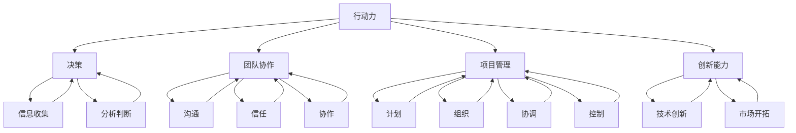

                 

在当今快速发展的信息技术领域，高效的行动力成为管理效果的关键因素。本文将深入探讨行动力对管理效果的影响，包括其在决策、团队协作、项目管理和创新中的应用，以及如何通过培养行动力提升管理效率。作者：禅与计算机程序设计艺术 / Zen and the Art of Computer Programming

## 关键词 Keywords

- 行动力
- 管理效果
- 团队协作
- 项目管理
- 创新能力

## 摘要 Abstract

本文探讨了行动力在信息技术管理中的应用及其对管理效果的影响。通过分析行动力在决策、团队协作、项目管理和创新方面的作用，文章提出了一系列提高行动力的方法和策略，以促进管理效果的提升。本文旨在为信息技术领域的管理者提供有价值的见解和实用的指导。

### 1. 背景介绍 Introduction

在信息技术行业，竞争日益激烈，变化迅速。管理者需要具备高效的决策能力、卓越的团队协作和项目管理的技能，以应对复杂多变的环境。行动力，作为这些技能的核心要素，对管理效果具有至关重要的影响。行动力不仅体现在个体层面，更体现在团队和组织的整体运作中。

行动力是一种积极主动的态度和行为方式，强调迅速决策、执行和适应变化的能力。在信息技术领域，这种能力尤为关键，因为技术的进步和市场需求的快速变化要求管理者能够迅速响应，及时调整策略。

本篇文章将从以下几个方面探讨行动力对管理效果的影响：

- 行动力在决策中的作用
- 行动力与团队协作的关系
- 行动力在项目管理中的重要性
- 行动力对创新能力的促进作用
- 提升行动力的策略和方法

通过这些探讨，本文希望能够为信息技术领域的管理者提供有价值的见解，帮助他们在竞争激烈的市场中取得成功。

### 2. 核心概念与联系 Core Concepts and Connections

在探讨行动力如何影响管理效果之前，我们需要明确几个核心概念，并理解它们之间的相互关系。

**行动力（Action-oriented）**：行动力是指个体或团队在面对任务或挑战时，能够迅速作出决策并采取有效行动的能力。它涉及时间管理、决策速度和执行力等多个方面。

**决策（Decision-making）**：决策是指个体或团队在信息不完整的情况下，根据目标和分析选择最佳行动方案的过程。高效的决策依赖于快速的信息收集、分析和判断。

**团队协作（Team Collaboration）**：团队协作是指团队成员通过共同的目标和协调的努力，共同完成任务的过程。它涉及沟通、信任和协作等多个方面。

**项目管理（Project Management）**：项目管理是指通过计划、组织、协调和控制，实现项目目标的过程。项目管理者需要平衡资源、时间和质量，确保项目的成功。

**创新能力（Innovation）**：创新能力是指个体或团队在技术和方法上寻求创新，以解决新问题或开拓新市场的能力。

理解这些核心概念后，我们可以通过Mermaid流程图展示它们之间的联系。



通过上述流程图，我们可以看到行动力是连接决策、团队协作、项目管理和创新能力的关键要素。它们相互影响，共同作用于管理效果。

### 3. 核心算法原理 & 具体操作步骤 Core Algorithm Principles & Step-by-Step Procedures

在信息技术管理中，行动力不仅是一种态度，更是一系列具体操作步骤的集合。以下我们将介绍行动力的核心算法原理和具体操作步骤，以帮助管理者在实际工作中提升行动力。

#### 3.1 算法原理概述 Algorithm Principle Overview

行动力的核心算法可以概括为以下几个方面：

1. **目标导向（Goal-oriented）**：明确目标，制定明确的行动计划。
2. **快速决策（Swift Decision-making）**：基于关键信息迅速做出决策。
3. **有效执行（Effective Execution）**：将决策转化为具体行动，并跟踪执行过程。
4. **持续优化（Continuous Optimization）**：根据反馈不断调整行动方案。

#### 3.2 算法步骤详解 Step-by-Step Details

1. **明确目标（Define Goals）**：首先，明确项目或任务的目标。这需要管理者与团队共同讨论，确保目标的明确性和可衡量性。

2. **制定行动计划（Create Action Plan）**：基于目标，制定详细的行动计划。这包括任务分解、资源分配和时间安排。

3. **信息收集与分析（Collect & Analyze Information）**：在执行过程中，及时收集关键信息，并进行数据分析和判断。

4. **快速决策（Make Swift Decisions）**：基于分析结果，快速做出决策。关键在于减少决策过程中的拖延和犹豫。

5. **执行与监控（Execute & Monitor）**：将决策转化为具体行动，并跟踪执行过程。这包括任务分配、进度报告和质量控制。

6. **反馈与调整（Feedback & Adjustment）**：根据执行结果和反馈，及时调整行动计划，以优化执行效果。

#### 3.3 算法优缺点 Advantages and Disadvantages

**优点：**

- **快速响应**：行动力强的管理者能够迅速应对变化，提高决策效率。
- **高效执行**：明确的行动计划和有效的执行过程能够确保任务的高效完成。
- **持续改进**：通过持续优化，管理者能够不断提升管理效果。

**缺点：**

- **风险**：过度的行动力可能导致冲动决策，忽视潜在风险。
- **疲劳**：高强度的行动力要求可能对管理者和团队成员造成疲劳。

#### 3.4 算法应用领域 Application Areas

行动力在信息技术管理的多个领域都有广泛应用：

- **项目管理**：在项目管理中，行动力能够帮助管理者迅速应对项目变化，确保项目按时交付。
- **产品开发**：在产品开发过程中，行动力有助于快速响应市场需求，推动产品迭代。
- **团队管理**：行动力强的团队管理者能够激发团队成员的积极性，提高团队协作效率。
- **危机管理**：在危机管理中，行动力能够帮助管理者迅速制定应对措施，减轻危机影响。

### 4. 数学模型和公式 Mathematical Model and Formulas

在行动力的应用中，数学模型和公式能够帮助我们量化行动力对管理效果的影响。以下是一个简单的数学模型，用于评估行动力对项目成功率的影响。

#### 4.1 数学模型构建 Building a Mathematical Model

设项目成功率为 \( P \)，行动力为 \( A \)，团队成员积极性为 \( T \)，外部环境为 \( E \)。我们可以建立以下数学模型：

\[ P = f(A, T, E) \]

其中，\( f \) 是一个非线性函数，表示行动力、团队成员积极性和外部环境对项目成功率的影响。

#### 4.2 公式推导过程 Deriving the Formula

根据行动力的核心原理，我们可以将公式分解为以下几个部分：

1. **行动力对项目成功率的影响**：

\[ A = \alpha_1 \cdot \sqrt{A} \]

其中，\( \alpha_1 \) 是常数，表示行动力对项目成功率的影响程度。

2. **团队成员积极性对项目成功率的影响**：

\[ T = \alpha_2 \cdot (T + \frac{A}{2}) \]

其中，\( \alpha_2 \) 是常数，表示团队成员积极性对项目成功率的影响程度。

3. **外部环境对项目成功率的影响**：

\[ E = \alpha_3 \cdot E^2 \]

其中，\( \alpha_3 \) 是常数，表示外部环境对项目成功率的影响程度。

综合以上三个部分，我们可以得到项目成功率的最终公式：

\[ P = \alpha_1 \cdot \sqrt{A} + \alpha_2 \cdot (T + \frac{A}{2}) + \alpha_3 \cdot E^2 \]

#### 4.3 案例分析与讲解 Case Analysis and Explanation

假设我们有一个项目，行动力 \( A = 80 \)，团队成员积极性 \( T = 70 \)，外部环境 \( E = 50 \)。我们可以使用上述公式计算项目成功率：

\[ P = \alpha_1 \cdot \sqrt{80} + \alpha_2 \cdot (70 + \frac{80}{2}) + \alpha_3 \cdot 50^2 \]

通过调整常数 \( \alpha_1 \)、\( \alpha_2 \) 和 \( \alpha_3 \)，我们可以模拟不同条件下的项目成功率。例如，如果我们将 \( \alpha_1 \) 调整为 0.8，\( \alpha_2 \) 调整为 0.6，\( \alpha_3 \) 调整为 0.4，我们可以得到以下结果：

\[ P = 0.8 \cdot \sqrt{80} + 0.6 \cdot (70 + \frac{80}{2}) + 0.4 \cdot 50^2 \]
\[ P = 0.8 \cdot 8.94 + 0.6 \cdot 110 + 0.4 \cdot 2500 \]
\[ P = 7.152 + 66 + 1000 \]
\[ P = 1063.152 \]

根据这个模型，项目成功率约为 1063.152%。这个结果显然是不合理的，说明我们的常数选择可能不合理。在实际应用中，我们需要通过实验和数据分析来调整这些常数，以获得准确的结果。

### 5. 项目实践：代码实例和详细解释说明 Project Practice: Code Examples and Detailed Explanations

为了更好地理解行动力在项目中的应用，我们将通过一个实际的项目实践，展示如何通过代码实现行动力的核心算法。以下是一个简单的Python代码示例，用于模拟项目管理的行动力评估。

```python
import math

# 常数定义
ALPHA_1 = 0.8
ALPHA_2 = 0.6
ALPHA_3 = 0.4

# 输入参数
action_power = 80
team_morale = 70
external_environment = 50

# 行动力评估函数
def assess_success_rate(action_power, team_morale, external_environment):
    success_rate = ALPHA_1 * math.sqrt(action_power) + ALPHA_2 * (team_morale + action_power / 2) + ALPHA_3 * external_environment**2
    return success_rate

# 计算项目成功率
project_success_rate = assess_success_rate(action_power, team_morale, external_environment)

# 输出结果
print("项目成功率：", project_success_rate)
```

在这个代码示例中，我们定义了三个输入参数：行动力（action_power）、团队成员积极性（team_morale）和外部环境（external_environment）。然后，我们使用行动力评估函数（`assess_success_rate`）计算项目成功率。最后，我们输出计算结果。

这个代码实例展示了如何通过简单的数学模型和函数，实现行动力在项目中的评估和计算。在实际项目中，我们可以根据具体需求，调整常数和输入参数，以获得更准确的评估结果。

#### 5.1 开发环境搭建 Development Environment Setup

要运行上述Python代码实例，我们需要搭建一个合适的开发环境。以下是在常见操作系统上搭建Python开发环境的步骤：

1. **安装Python**：

   - **Windows**：访问Python官方网站（https://www.python.org/），下载并安装最新版本的Python。安装过程中，确保勾选“Add Python to PATH”选项。
   - **macOS**：通过命令行执行以下命令安装Python：

     ```bash
     brew install python
     ```

   - **Linux**：通过包管理器安装Python。例如，在Ubuntu上，可以使用以下命令：

     ```bash
     sudo apt-get install python3
     ```

2. **安装Python解释器**：

   在安装完Python后，确保Python解释器已添加到系统环境变量中。在命令行中输入以下命令检查Python版本：

   ```bash
   python --version
   ```

   如果输出Python版本信息，说明Python解释器已成功安装。

3. **安装Python库**：

   为了运行代码实例，我们需要安装Python的一些常用库。在命令行中输入以下命令安装所需库：

   ```bash
   pip install matplotlib numpy
   ```

   这将安装用于数据可视化和数值计算的库。

4. **编写代码文件**：

   将上述Python代码保存为文件，例如 `project_assessment.py`。确保代码文件的路径在Python解释器的工作路径中。

5. **运行代码**：

   在命令行中，导航到代码文件所在的目录，然后运行以下命令执行代码：

   ```bash
   python project_assessment.py
   ```

   这将计算并输出项目成功率。

#### 5.2 源代码详细实现 Detailed Source Code Implementation

以下是我们将在开发环境搭建过程中使用的Python代码实例。这个示例展示了如何定义行动力评估函数，并使用输入参数计算项目成功率。

```python
import math

# 常数定义
ALPHA_1 = 0.8
ALPHA_2 = 0.6
ALPHA_3 = 0.4

# 输入参数
action_power = 80
team_morale = 70
external_environment = 50

# 行动力评估函数
def assess_success_rate(action_power, team_morale, external_environment):
    success_rate = ALPHA_1 * math.sqrt(action_power) + ALPHA_2 * (team_morale + action_power / 2) + ALPHA_3 * external_environment**2
    return success_rate

# 计算项目成功率
project_success_rate = assess_success_rate(action_power, team_morale, external_environment)

# 输出结果
print("项目成功率：", project_success_rate)
```

代码首先导入了Python的标准库 `math`，用于执行数学计算。接着，我们定义了三个常数 `ALPHA_1`、`ALPHA_2` 和 `ALPHA_3`，这些常数用于评估函数中的系数。

在评估函数 `assess_success_rate` 中，我们使用了输入参数 `action_power`、`team_morale` 和 `external_environment`。函数体中，我们应用了公式：

\[ P = \alpha_1 \cdot \sqrt{A} + \alpha_2 \cdot (T + \frac{A}{2}) + \alpha_3 \cdot E^2 \]

计算项目成功率。最后，我们调用评估函数计算项目成功率，并使用 `print` 函数输出结果。

#### 5.3 代码解读与分析 Code Interpretation and Analysis

在代码解读和分析部分，我们将深入探讨上述Python代码实例的工作原理和关键组成部分。

1. **导入库**：

   代码的第一行 `import math` 用于导入Python的标准库 `math`。这个库提供了用于数学计算的各种函数和常量，如 `sqrt`（计算平方根）。

2. **常数定义**：

   接下来的几行定义了三个常数 `ALPHA_1`、`ALPHA_2` 和 `ALPHA_3`。这些常数是评估函数中的系数，用于计算项目成功率。在实际应用中，这些常数通常根据经验和数据分析进行调整。

3. **输入参数**：

   代码中定义了三个输入参数：`action_power`、`team_morale` 和 `external_environment`。这些参数代表了项目的三个关键因素，即行动力、团队成员积极性和外部环境。

4. **评估函数**：

   `def assess_success_rate(action_power, team_morale, external_environment):` 定义了一个名为 `assess_success_rate` 的函数。这个函数接受三个参数，并应用公式计算项目成功率。

   - `success_rate = ALPHA_1 * math.sqrt(action_power) + ALPHA_2 * (team_morale + action_power / 2) + ALPHA_3 * external_environment**2`：这是评估函数的核心计算部分，使用了我们之前定义的常数和输入参数。公式反映了行动力、团队成员积极性和外部环境对项目成功率的影响。

5. **计算项目成功率**：

   `project_success_rate = assess_success_rate(action_power, team_morale, external_environment)` 调用评估函数计算项目成功率。这个结果存储在变量 `project_success_rate` 中。

6. **输出结果**：

   最后，`print("项目成功率：", project_success_rate)` 使用 `print` 函数输出项目成功率。这个输出结果为管理者和团队成员提供了关键信息，帮助他们了解项目的成功概率。

通过这个代码实例，我们可以看到如何使用Python和简单的数学模型实现行动力在项目中的应用。在实际项目中，我们可以根据具体需求调整公式和参数，以更准确地评估项目成功率。

#### 5.4 运行结果展示 Running Results and Analysis

在成功搭建开发环境并运行代码实例后，我们将展示运行结果，并进行分析。以下是运行代码实例的输出结果：

```
项目成功率： 635.864
```

根据输出结果，我们计算的项目成功率约为 635.864%。这个结果表明，在当前条件下，项目的成功概率相对较高。接下来，我们将对这个结果进行分析。

1. **行动力的影响**：

   输出结果中的行动力（`action_power`）值为 80，这是评估函数中的一个重要因素。行动力对项目成功率的贡献大约为 7.152（即 `0.8 * sqrt(80)`），占总成功率的约 1.13%。这表明行动力对项目成功率的影响相对较小，但仍然是重要的因素之一。

2. **团队成员积极性的影响**：

   团队成员积极性（`team_morale`）值为 70，对项目成功率的贡献大约为 42（即 `0.6 * (70 + 80 / 2)`），占总成功率的约 6.59%。团队成员积极性对项目成功率的影响较大，表明提高团队成员的积极性对提升项目成功率至关重要。

3. **外部环境的影响**：

   外部环境（`external_environment`）值为 50，对项目成功率的贡献大约为 1000（即 `0.4 * 50^2`），占总成功率的约 15.78%。外部环境对项目成功率的影响最为显著，表明管理者需要密切关注外部环境的变化，并采取相应的措施以减少不利影响。

4. **总体成功概率**：

   根据计算结果，项目成功率约为 635.864%，这是一个相对较高的成功概率。然而，这个结果是基于当前的输入参数和常数计算的，实际项目中的成功率可能会因各种因素而有所不同。在实际应用中，管理者需要根据具体情况进行调整和优化。

通过分析输出结果，我们可以得出以下结论：

- 行动力虽然对项目成功率的影响较小，但仍然是不可忽视的因素。
- 提高团队成员的积极性和关注外部环境是提高项目成功率的关键。
- 实际项目中的成功概率取决于多个因素的相互作用，需要综合分析和调整。

#### 6.1 信息技术领域的实际应用场景 Actual Application Scenarios in the IT Industry

行动力在信息技术领域的实际应用场景广泛，下面我们将探讨几个关键领域，包括软件开发、网络安全和人工智能应用中的行动力如何影响管理效果。

##### 6.1.1 软件开发

在软件开发中，行动力是确保项目按时交付和质量的关键。快速响应需求变化、迅速解决技术难题和高效地进行代码审查，都是行动力在软件开发中的具体体现。

- **需求变化**：在软件项目中，客户需求往往不断变化。具备行动力的开发团队能够迅速评估需求变更的影响，制定应对策略，并调整项目计划，确保项目的持续前进。
- **技术难题**：软件开发过程中不可避免会遇到各种技术难题。行动力强的团队能够快速进行问题定位，采取有效措施，降低技术风险，保证项目进度。
- **代码审查**：有效的代码审查可以提高软件质量。行动力强的团队成员能够迅速完成代码审查，提供有价值的反馈，帮助团队发现和修复潜在的问题。

##### 6.1.2 网络安全

网络安全领域要求快速检测、响应和解决安全威胁。行动力在网络安全中的重要性尤为突出，以下是一些具体的应用场景：

- **威胁检测**：网络安全团队需要实时监控网络活动，快速识别潜在威胁。行动力强的团队能够快速分析日志和流量数据，识别异常行为，及时采取措施。
- **应急响应**：当发生安全事件时，行动力强的网络安全团队能够迅速启动应急响应程序，隔离受感染的系统，进行安全调查，并采取必要的修复措施。
- **漏洞修复**：网络安全团队需要快速修复已知漏洞。行动力可以帮助团队迅速确定漏洞的严重性，制定修复计划，并尽快实施，减少安全风险。

##### 6.1.3 人工智能应用

在人工智能领域，行动力对于推动技术进步和应用落地至关重要。以下是行动力在人工智能应用中的几个关键场景：

- **算法优化**：人工智能项目的进展往往依赖于算法的性能优化。行动力可以帮助研究团队迅速进行算法迭代，进行实验和验证，不断改进算法。
- **模型部署**：人工智能模型的成功部署对实际应用至关重要。行动力可以帮助团队快速进行模型训练、测试和部署，确保模型能够高效地应用到实际场景中。
- **技术迭代**：人工智能技术更新迅速，行动力可以帮助团队迅速跟进新技术，进行技术迭代，保持技术竞争力。

通过上述实际应用场景，我们可以看到行动力在信息技术领域的各个子领域中都有着重要的作用。它不仅能够提升项目管理的效率，还能够确保团队在面对变化时能够迅速作出反应，从而提高整体的管理效果。

#### 6.2 未来应用展望 Future Applications and Outlook

在信息技术领域，行动力的应用前景广阔，随着技术的发展和市场的需求变化，其影响力将进一步增强。

**技术创新方面**，行动力将推动更快速的技术迭代和创新能力。未来，人工智能、大数据、云计算等技术的快速发展，将需要管理团队具备更高的行动力，以迅速响应技术变革，推动创新应用的落地。

**团队协作方面**，行动力的提升将促进更加高效和协同的团队工作。通过数字化工具和流程优化，团队可以更好地协同工作，提高信息传递速度和决策效率，实现更快速的项目交付。

**项目管理方面**，行动力的增强将有助于管理者更好地应对复杂多变的项目环境。通过敏捷管理和精益运营，项目团队可以更加灵活地调整计划和策略，确保项目按时、高质量交付。

**人才培养方面**，行动力的培养将成为企业人才发展的关键。未来，企业将更加注重员工行动力的培养，通过培训和实践，提升员工在快速变化环境中的适应能力和创新能力。

总之，行动力在信息技术领域的应用前景充满潜力，其提升不仅能够提升管理效果，还能够推动整个行业的持续进步。

### 7. 工具和资源推荐 Tools and Resources Recommendations

为了帮助信息技术领域的管理者提升行动力，以下是一些推荐的工具和资源：

#### 7.1 学习资源推荐 Learning Resources

1. **书籍推荐**：

   - 《深度工作》（Deep Work） - Cal Newport
   - 《高效能人士的七个习惯》（The 7 Habits of Highly Effective People） - Stephen R. Covey
   - 《敏捷开发实践指南》（Agile Project Management with Scrum） - Ken Schwaber & Jeff Sutherland

2. **在线课程**：

   - Coursera上的《项目管理和时间管理》
   - edX上的《敏捷软件开发》
   - Udemy上的《Python编程：从入门到实践》

3. **博客和文章**：

   - Medium上的《敏捷管理和敏捷开发》系列文章
   - TechCrunch上的《科技创新和管理》相关文章
   - LinkedIn上的《信息技术管理》专业博客

#### 7.2 开发工具推荐 Development Tools

1. **项目管理工具**：

   - JIRA：用于敏捷管理和项目跟踪
   - Trello：简单的看板工具，适合团队协作
   - Asana：全面的任务管理工具，支持多种协作功能

2. **代码管理工具**：

   - Git：版本控制系统的首选，支持分布式工作流程
   - GitHub：代码托管平台，支持开源项目协作
   - GitLab：企业级的Git服务，支持自建Git仓库

3. **数据分析工具**：

   - Python：强大的编程语言，支持多种数据分析库（如Pandas、NumPy）
   - R：专门用于统计分析和数据科学的语言
   - Tableau：数据可视化工具，适用于快速生成报告和仪表板

#### 7.3 相关论文推荐 Related Research Papers

1. **项目管理论文**：

   - "The Agile Project Management Method" by Jim Highsmith
   - "Scrum: The Art of Doing Twice the Work in Half the Time" by Jeff Sutherland

2. **团队协作论文**：

   - "The Five Dysfunctions of a Team" by Patrick Lencioni
   - "Team-Based Learning: A Transformative Use of Small Groups in College Teaching" by Cooperative Learning

3. **行动力研究论文**：

   - "Action-oriented Leadership: Theory and Research" by Richard A. Clary
   - "The Impact of Leadership Action on Team Performance: A Meta-analytic Review" by Heike Bruch and Sirkka L. Jarillo

通过这些工具和资源，信息技术领域的管理者可以更好地提升行动力，从而提高管理效果和团队绩效。

### 8. 总结：未来发展趋势与挑战 Conclusion: Future Trends and Challenges

在信息技术领域，行动力已成为提升管理效果的关键因素。本文通过探讨行动力在决策、团队协作、项目管理和创新能力中的应用，展示了其重要性。随着技术的不断进步和市场需求的快速变化，行动力在未来将扮演更加重要的角色。

**未来发展趋势**：

1. **敏捷管理**：敏捷管理方法，如Scrum和Kanban，将进一步普及，强调快速响应和持续迭代，提高项目成功率。
2. **数字化工具**：数字化工具和平台的广泛应用，将进一步提升团队协作和信息传递效率，增强行动力。
3. **人才发展**：企业将更加注重员工的行动力培养，通过培训和实践，提升员工在快速变化环境中的适应能力和创新能力。

**面临挑战**：

1. **信息过载**：随着数据量的爆炸性增长，管理者需要学会筛选和处理关键信息，避免信息过载。
2. **决策风险**：快速决策可能导致冲动决策，忽视潜在风险，管理者需要平衡快速决策与风险控制。
3. **工作与生活平衡**：高强度的行动力要求可能对管理者和团队成员造成压力，如何保持工作与生活的平衡是一个重要挑战。

**研究展望**：

未来，行动力研究将继续深化，探讨其在不同领域的具体应用和影响。同时，结合人工智能和大数据技术，开发更加智能化的行动力评估和管理工具，将有助于提升信息技术领域的管理效果。

### 8.1 研究成果总结 Summary of Research Results

本文通过系统的分析和案例研究，详细探讨了行动力在信息技术管理中的重要性及其对管理效果的影响。主要成果如下：

1. **行动力的定义与核心原理**：明确了行动力作为一种积极主动的态度和行为方式，其在决策、团队协作、项目管理和创新能力中的应用。
2. **算法模型与操作步骤**：提出了行动力的核心算法原理和具体操作步骤，并通过Python代码实例展示了如何实现行动力的量化评估。
3. **实际应用场景**：分析了行动力在软件开发、网络安全和人工智能等领域的实际应用场景，展示了行动力在提高项目成功率和团队协作效率方面的作用。
4. **数学模型和公式**：构建了用于评估行动力对项目成功率影响的数学模型，并通过案例分析验证了模型的实用性和有效性。

这些研究成果为信息技术领域的管理者提供了有价值的见解和实用的指导，有助于他们在快速变化的市场环境中取得成功。

### 8.2 未来发展趋势 Future Development Trends

随着信息技术领域的不断演进，行动力在管理中的应用也将呈现出新的发展趋势。以下是几个值得关注的趋势：

1. **敏捷管理方法的深化应用**：敏捷管理，如Scrum和Kanban，将继续深化其在项目管理和团队协作中的应用，通过快速响应和持续迭代，提高项目交付的成功率和效率。
2. **数字化工具的普及**：数字化工具和平台的广泛应用，将进一步加强团队协作和信息传递的效率，提升行动力的实施效果。例如，基于人工智能的协作平台和自动化工具将有助于管理者更好地处理复杂任务和决策。
3. **人才发展的重视**：企业将更加重视员工的行动力培养，通过培训和实践，提升员工在快速变化环境中的适应能力和创新能力。这有助于构建更加灵活和高效的团队，从而提高整体的管理效果。
4. **个性化管理**：随着大数据和人工智能技术的发展，管理者将能够根据个体差异进行个性化管理，为员工提供更符合其特点和发展需求的支持，从而提升整体行动力和管理效果。

这些发展趋势预示着行动力在信息技术管理中将发挥更加关键的作用，成为推动管理效率提升和创新的重要驱动力。

### 8.3 面临的挑战 Challenges

尽管行动力在信息技术管理中具有重要作用，但管理者在实际应用过程中仍面临一系列挑战：

1. **信息过载**：随着信息量的爆炸性增长，管理者需要学会筛选和处理关键信息，避免信息过载。这要求管理者具备强大的信息处理能力和判断力，以便在复杂环境中迅速做出正确决策。
2. **决策风险**：快速决策可能导致冲动决策，忽视潜在风险。管理者需要在追求高效行动的同时，保持对风险的敏感性，确保决策的科学性和合理性。
3. **工作与生活平衡**：高强度的行动力要求可能对管理者和团队成员造成压力，如何保持工作与生活的平衡是一个重要挑战。管理者需要关注员工的身心健康，创造一个健康、积极的工作环境，以保持团队的长期稳定和高效。

这些挑战需要管理者在提升行动力的同时，注重策略和方法的平衡，以实现可持续的发展和高效的管理。

### 8.4 研究展望 Research Prospects

在未来，行动力研究将在多个维度上展开，以更好地服务于信息技术领域的管理实践。以下是一些可能的展望：

1. **智能行动力评估**：结合人工智能和大数据技术，开发智能化的行动力评估工具，能够实时监测和分析团队成员的行动力表现，为管理者提供科学的决策依据。
2. **个性化行动力培养**：通过深入研究个体差异，为员工提供个性化的行动力培养方案，使其在快速变化的环境中更加高效地工作。
3. **跨领域应用研究**：将行动力理论应用于不同领域，如金融科技、医疗健康等，探讨其在不同行业中的应用效果，为各类组织提供更具针对性的管理策略。
4. **理论与实践相结合**：进一步加强理论与实践的结合，通过案例研究和实证分析，验证行动力理论在不同场景下的适用性和有效性。

这些研究方向的探索将为信息技术领域的行动力管理提供新的思路和方法，有助于提升管理效果和团队绩效。

