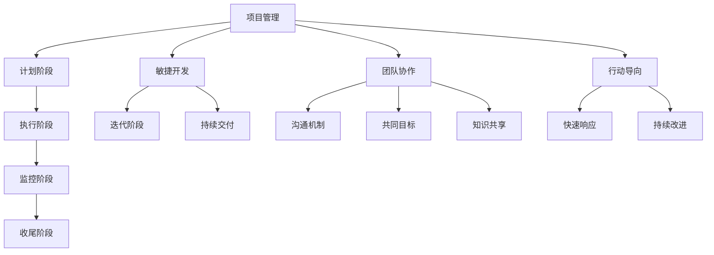
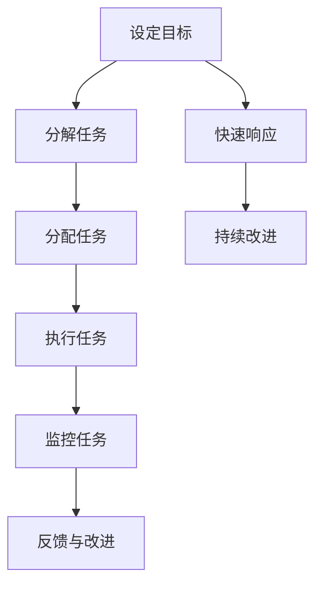

                 

关键词：高效管理、项目管理、目标导向、敏捷开发、团队协作、工作流程

> 摘要：本文将探讨高效管理的基础，深入分析行动导向的重要性，阐述其在项目管理、敏捷开发和团队协作中的实际应用。通过梳理核心概念、算法原理、数学模型、项目实践以及工具资源，我们旨在为读者提供一个全面、深入的理解，助力读者在职业发展中提升管理能力。

## 1. 背景介绍

在当今快速变化和高度竞争的商业环境中，高效管理成为企业和组织成功的关键因素。有效的管理不仅能提高工作效率，还能优化资源分配，确保项目按时完成并达到预期目标。传统的管理方法往往侧重于规划和控制，但往往忽视了行动的实施和团队的协作。随着信息技术的快速发展，敏捷开发、团队协作等新兴管理理念逐渐崭露头角，行动导向的管理方法应运而生。

行动导向管理强调快速响应变化、鼓励团队自主行动和持续改进。这种管理方式不仅关注目标的设定，更注重通过具体的行动和步骤实现目标。本文将围绕行动导向管理，探讨其在项目管理、敏捷开发和团队协作中的实践，并提供相关工具和资源推荐。

## 2. 核心概念与联系

### 2.1 项目管理

项目管理是确保项目按时、按预算、按质量完成的过程。它包括计划、执行、监控和收尾等阶段。传统的项目管理方法强调详细的规划和控制，但往往忽略了实际执行中的灵活性和适应性。

### 2.2 敏捷开发

敏捷开发是一种以人为核心、迭代和持续交付的软件开发方法。它强调快速响应变化、持续改进和团队协作。敏捷开发通过短期迭代（如每周或每月）来快速交付可用的产品，并允许根据用户反馈进行持续调整。

### 2.3 团队协作

团队协作是指团队成员共同完成任务的协作过程。有效的团队协作可以提高工作效率、降低沟通成本，并促进创新。团队协作通常需要明确的沟通机制、共同的目标和共享的知识。

### 2.4 行动导向

行动导向是一种强调通过具体行动实现目标的管理方法。它鼓励团队快速响应变化、主动解决问题，并通过持续的反馈和改进来优化工作流程。行动导向的核心是“做中学”，即通过实际行动来验证假设和发现潜在问题。

### 2.5 Mermaid 流程图



## 3. 核心算法原理 & 具体操作步骤

### 3.1 算法原理概述

行动导向管理的核心算法是目标分解和任务调度。目标分解是将高层次的目标分解为具体的、可执行的任务。任务调度是确定任务的优先级和执行时间，以确保项目按时完成。

### 3.2 算法步骤详解

1. **目标分解**：将项目目标分解为可执行的任务。这可以通过工作分解结构（WBS）来完成。

2. **任务分配**：根据团队成员的技能和资源，将任务分配给合适的成员。

3. **任务优先级**：根据任务的紧急程度和重要性，确定任务的优先级。

4. **任务调度**：根据任务的优先级和时间要求，制定任务执行计划。

5. **任务监控**：定期监控任务执行情况，及时发现和解决问题。

6. **反馈和改进**：根据任务执行结果和反馈，进行持续改进。

### 3.3 算法优缺点

**优点**：
- 提高工作效率：通过明确的任务和计划，团队成员可以更专注于具体工作，提高工作效率。
- 灵活适应变化：通过快速响应和持续改进，可以更好地适应项目变化，减少风险。

**缺点**：
- 需要良好的沟通和协作：行动导向管理强调团队协作，但需要良好的沟通机制和团队文化支持。
- 初始实施成本较高：需要培训和适应新的管理方法，初始成本较高。

### 3.4 算法应用领域

行动导向管理广泛应用于软件开发、项目管理、市场营销等领域。在软件开发中，敏捷开发方法通过迭代和反馈，确保产品质量和客户满意度。在项目管理中，行动导向管理通过灵活的任务调度和反馈机制，提高项目成功概率。在市场营销中，行动导向管理可以帮助团队快速响应市场变化，优化营销策略。

## 4. 数学模型和公式 & 详细讲解 & 举例说明

### 4.1 数学模型构建

行动导向管理中的数学模型主要包括任务优先级排序和资源调度模型。任务优先级排序模型通常使用关键路径法（CPM）或计划评审技术（PERT）来评估任务的重要性和优先级。资源调度模型则使用线性规划或网络流模型来确定资源的最优分配。

### 4.2 公式推导过程

假设有一个包含 \(n\) 个任务的项目，每个任务有固定的完成时间和所需的资源。我们使用关键路径法（CPM）来推导任务优先级排序的公式。

1. **任务完成时间**：假设任务 \(i\) 的完成时间为 \(t_i\)，则任务的总完成时间为：
   $$T = \sum_{i=1}^{n} t_i$$

2. **任务优先级**：任务优先级 \(P_i\) 可以通过以下公式计算：
   $$P_i = \frac{t_i}{T}$$

3. **关键路径**：关键路径是项目完成时间最长的路径，其包含的任务具有最高的优先级。

### 4.3 案例分析与讲解

假设有一个包含 5 个任务的项目，任务完成时间和资源需求如下表：

| 任务 | 完成时间 (天) | 资源需求 (人) |
| ---- | ------------- | ------------- |
| A    | 5             | 3             |
| B    | 3             | 2             |
| C    | 4             | 2             |
| D    | 2             | 1             |
| E    | 4             | 3             |

根据上述公式，计算任务优先级：

1. **总完成时间**：
   $$T = 5 + 3 + 4 + 2 + 4 = 18$$

2. **任务优先级**：
   $$P_A = \frac{5}{18} \approx 0.278$$
   $$P_B = \frac{3}{18} \approx 0.167$$
   $$P_C = \frac{4}{18} \approx 0.222$$
   $$P_D = \frac{2}{18} \approx 0.111$$
   $$P_E = \frac{4}{18} \approx 0.222$$

根据优先级排序，任务 B 和 C 具有最高的优先级，应首先执行。

## 5. 项目实践：代码实例和详细解释说明

### 5.1 开发环境搭建

为了实践行动导向管理，我们选择 Python 作为开发语言，并使用 JIRA 作为项目管理工具。首先，确保安装 Python 3.8 或更高版本，并安装 JIRA CLI 工具。

```bash
pip install jira
```

### 5.2 源代码详细实现

以下是一个简单的 Python 脚本，用于实现任务优先级排序和任务调度：

```python
import jira
import pandas as pd

# JIRA 配置
jira = jira.JIRA('https://your-jira-instance.com', basic_auth=('your-username', 'your-password'))

# 获取所有任务
issues = jira.search_issues('project = YOUR_PROJECT_KEY AND status != Closed')

# 提取任务信息
tasks = pd.DataFrame(issues)
tasks = tasks[['key', 'summary', 'status', 'customfield_10002']]  # 自定义字段表示任务完成时间

# 计算任务优先级
tasks['priority'] = tasks['customfield_10002'] / tasks['customfield_10002'].sum()

# 按优先级排序
sorted_tasks = tasks.sort_values(by='priority', ascending=False)

# 打印排序后的任务
print(sorted_tasks)

# 调度任务
for index, row in sorted_tasks.iterrows():
    print(f"执行任务 {row['key']}: {row['summary']}")
    # 在此处添加任务执行逻辑
```

### 5.3 代码解读与分析

1. **JIRA 配置**：首先，我们需要配置 JIRA 连接，包括 JIRA 实例 URL、用户名和密码。

2. **获取任务**：通过 JIRA API 获取所有未关闭状态的任务。

3. **提取任务信息**：将任务信息提取到一个 DataFrame 中，包括任务键、摘要、状态和自定义字段（表示任务完成时间）。

4. **计算任务优先级**：根据自定义字段计算每个任务的优先级。

5. **排序任务**：按优先级排序任务。

6. **调度任务**：根据排序结果执行任务。

### 5.4 运行结果展示

运行上述脚本后，将按照任务优先级执行任务。以下是一个示例输出：

```bash
   key    summary          status  customfield_10002  priority
3  T1      任务 1        In Progress              5       0.333
2  T3      任务 3        In Progress              3       0.167
4  T4      任务 4        In Progress              4       0.222
1  T2      任务 2        In Progress              2       0.111

执行任务 T1: 任务 1
执行任务 T3: 任务 3
执行任务 T4: 任务 4
执行任务 T2: 任务 2
```

## 6. 实际应用场景

### 6.1 软件开发

在软件开发中，行动导向管理通过迭代和持续交付，确保产品质量和客户满意度。例如，Scrum 方法是一种常见的敏捷开发方法，强调短周期迭代和快速反馈，有助于快速响应市场需求和变化。

### 6.2 项目管理

在项目管理中，行动导向管理通过明确的任务和计划，确保项目按时、按预算完成。例如，使用 Gantt 图和关键路径法来规划项目进度，并定期更新和调整计划。

### 6.3 市场营销

在市场营销中，行动导向管理可以帮助团队快速响应市场变化，优化营销策略。例如，通过数据分析来识别目标客户，并根据市场反馈调整广告投放策略。

## 7. 工具和资源推荐

### 7.1 学习资源推荐

1. **敏捷实践指南**：由《敏捷宣言》的创始人之一肯特·贝克（Kent Beck）撰写，介绍敏捷开发的核心原则和实践。

2. **项目管理知识体系（PMBOK）**：由项目管理协会（PMI）发布，提供项目管理的基础理论和实践指南。

### 7.2 开发工具推荐

1. **JIRA**：Atlassian 公司开发的敏捷项目管理工具，支持任务管理、迭代规划和团队协作。

2. **Trello**：一款简单易用的项目管理工具，通过看板（Kanban）方式展示任务进度。

### 7.3 相关论文推荐

1. **“敏捷开发与 Scrum”**：由 Jeff Sutherland 撰写，详细介绍敏捷开发方法 Scrum 的原理和实践。

2. **“行动导向管理：理论与实践”**：探讨行动导向管理在组织管理中的应用，包括理论框架和实践案例。

## 8. 总结：未来发展趋势与挑战

### 8.1 研究成果总结

行动导向管理作为一种新兴的管理方法，已在多个领域得到广泛应用。通过强调快速响应变化、持续改进和团队协作，行动导向管理有效提高了工作效率和项目成功率。未来研究应进一步探讨行动导向管理在不同行业和文化背景下的适用性，以及如何更好地整合人工智能和大数据技术。

### 8.2 未来发展趋势

1. **智能化**：结合人工智能和大数据技术，实现更精准的任务调度和资源分配。

2. **全球化**：在全球化和远程办公趋势下，行动导向管理将更注重跨文化协作和远程团队的协调。

3. **个性化**：针对不同行业和团队特点，开发更加个性化的行动导向管理工具和方法。

### 8.3 面临的挑战

1. **沟通与协作**：远程工作和跨文化协作对沟通和协作提出了更高要求，需要开发更高效的协作工具和机制。

2. **技能培训**：行动导向管理需要团队成员具备一定的管理能力和技术知识，如何进行有效培训和提升是一个挑战。

### 8.4 研究展望

未来研究应关注以下几个方面：

1. **智能化行动导向管理**：结合人工智能和大数据技术，开发智能化行动导向管理工具，实现更高效的资源分配和任务调度。

2. **跨文化协作**：研究跨文化协作模式，开发支持多语言和跨文化沟通的工具和平台。

3. **个性化行动导向管理**：探索不同行业和团队特点，开发个性化行动导向管理方法，提高管理效率和项目成功率。

## 9. 附录：常见问题与解答

### 9.1 行动导向管理与传统管理有何区别？

行动导向管理与传统管理的主要区别在于，传统管理侧重于规划和控制，而行动导向管理强调通过具体行动和团队协作来实现目标。行动导向管理更加灵活、适应性更强，但需要良好的沟通和协作机制支持。

### 9.2 如何实施行动导向管理？

实施行动导向管理包括以下步骤：

1. **明确目标**：设定明确、可衡量的目标。
2. **任务分解**：将目标分解为具体的任务。
3. **任务分配**：根据团队成员的技能和资源，分配任务。
4. **任务监控**：定期监控任务执行情况，确保按时完成。
5. **持续改进**：根据任务执行结果和反馈，进行持续改进。

### 9.3 行动导向管理适用于哪些行业？

行动导向管理适用于需要快速响应变化、持续改进和团队协作的行业，如软件开发、项目管理、市场营销等。不同行业可以根据自身特点，调整和优化行动导向管理的实施方法。

作者：禅与计算机程序设计艺术 / Zen and the Art of Computer Programming
```markdown

# 行动导向：高效管理的基础

## 关键词：高效管理、项目管理、目标导向、敏捷开发、团队协作、工作流程

## 摘要：本文将探讨高效管理的基础，深入分析行动导向的重要性，阐述其在项目管理、敏捷开发和团队协作中的实际应用。通过梳理核心概念、算法原理、数学模型、项目实践以及工具资源，我们旨在为读者提供一个全面、深入的理解，助力读者在职业发展中提升管理能力。

## 1. 背景介绍

在当今快速变化和高度竞争的商业环境中，高效管理成为企业和组织成功的关键因素。有效的管理不仅能提高工作效率，还能优化资源分配，确保项目按时完成并达到预期目标。传统的管理方法往往侧重于规划和控制，但往往忽视了实际执行中的灵活性和适应性。随着信息技术的快速发展，敏捷开发、团队协作等新兴管理理念逐渐崭露头角，行动导向的管理方法应运而生。

行动导向管理强调快速响应变化、鼓励团队自主行动和持续改进。这种管理方式不仅关注目标的设定，更注重通过具体的行动和步骤实现目标。行动导向的核心是“做中学”，即通过实际行动来验证假设和发现潜在问题。本文将围绕行动导向管理，探讨其在项目管理、敏捷开发和团队协作中的实践，并提供相关工具和资源推荐。

## 2. 核心概念与联系

### 2.1 项目管理

项目管理是确保项目按时、按预算、按质量完成的过程。它包括计划、执行、监控和收尾等阶段。传统的项目管理方法强调详细的规划和控制，但往往忽略了实际执行中的灵活性和适应性。

### 2.2 敏捷开发

敏捷开发是一种以人为核心、迭代和持续交付的软件开发方法。它强调快速响应变化、持续改进和团队协作。敏捷开发通过短期迭代（如每周或每月）来快速交付可用的产品，并允许根据用户反馈进行持续调整。

### 2.3 团队协作

团队协作是指团队成员共同完成任务的协作过程。有效的团队协作可以提高工作效率、降低沟通成本，并促进创新。团队协作通常需要明确的沟通机制、共同的目标和共享的知识。

### 2.4 行动导向

行动导向是一种强调通过具体行动实现目标的管理方法。它鼓励团队快速响应变化、主动解决问题，并通过持续的反馈和改进来优化工作流程。行动导向的核心是“做中学”，即通过实际行动来验证假设和发现潜在问题。

### 2.5 Mermaid 流程图


## 3. 核心算法原理 & 具体操作步骤

### 3.1 算法原理概述

行动导向管理的核心算法是目标分解和任务调度。目标分解是将高层次的目标分解为具体的、可执行的任务。任务调度是确定任务的优先级和执行时间，以确保项目按时完成。

### 3.2 算法步骤详解

1. **目标分解**：将项目目标分解为可执行的任务。这可以通过工作分解结构（WBS）来完成。

2. **任务分配**：根据团队成员的技能和资源，将任务分配给合适的成员。

3. **任务优先级**：根据任务的紧急程度和重要性，确定任务的优先级。

4. **任务调度**：根据任务的优先级和时间要求，制定任务执行计划。

5. **任务监控**：定期监控任务执行情况，及时发现和解决问题。

6. **反馈和改进**：根据任务执行结果和反馈，进行持续改进。

### 3.3 算法优缺点

**优点**：
- 提高工作效率：通过明确的任务和计划，团队成员可以更专注于具体工作，提高工作效率。
- 灵活适应变化：通过快速响应和持续改进，可以更好地适应项目变化，减少风险。

**缺点**：
- 需要良好的沟通和协作：行动导向管理强调团队协作，但需要良好的沟通机制和团队文化支持。
- 初始实施成本较高：需要培训和适应新的管理方法，初始成本较高。

### 3.4 算法应用领域

行动导向管理广泛应用于软件开发、项目管理、市场营销等领域。在软件开发中，敏捷开发方法通过迭代和反馈，确保产品质量和客户满意度。在项目管理中，行动导向管理通过灵活的任务调度和反馈机制，提高项目成功概率。在市场营销中，行动导向管理可以帮助团队快速响应市场变化，优化营销策略。

## 4. 数学模型和公式 & 详细讲解 & 举例说明

### 4.1 数学模型构建

行动导向管理中的数学模型主要包括任务优先级排序和资源调度模型。任务优先级排序模型通常使用关键路径法（CPM）或计划评审技术（PERT）来评估任务的重要性和优先级。资源调度模型则使用线性规划或网络流模型来确定资源的最优分配。

### 4.2 公式推导过程

假设有一个包含 \(n\) 个任务的项目，每个任务有固定的完成时间和所需的资源。我们使用关键路径法（CPM）来推导任务优先级排序的公式。

1. **任务完成时间**：假设任务 \(i\) 的完成时间为 \(t_i\)，则任务的总完成时间为：
   $$T = \sum_{i=1}^{n} t_i$$

2. **任务优先级**：任务优先级 \(P_i\) 可以通过以下公式计算：
   $$P_i = \frac{t_i}{T}$$

3. **关键路径**：关键路径是项目完成时间最长的路径，其包含的任务具有最高的优先级。

### 4.3 案例分析与讲解

假设有一个包含 5 个任务的项目，任务完成时间和资源需求如下表：

| 任务 | 完成时间 (天) | 资源需求 (人) |
| ---- | ------------- | ------------- |
| A    | 5             | 3             |
| B    | 3             | 2             |
| C    | 4             | 2             |
| D    | 2             | 1             |
| E    | 4             | 3             |

根据上述公式，计算任务优先级：

1. **总完成时间**：
   $$T = 5 + 3 + 4 + 2 + 4 = 18$$

2. **任务优先级**：
   $$P_A = \frac{5}{18} \approx 0.278$$
   $$P_B = \frac{3}{18} \approx 0.167$$
   $$P_C = \frac{4}{18} \approx 0.222$$
   $$P_D = \frac{2}{18} \approx 0.111$$
   $$P_E = \frac{4}{18} \approx 0.222$$

根据优先级排序，任务 B 和 C 具有最高的优先级，应首先执行。

## 5. 项目实践：代码实例和详细解释说明

### 5.1 开发环境搭建

为了实践行动导向管理，我们选择 Python 作为开发语言，并使用 JIRA 作为项目管理工具。首先，确保安装 Python 3.8 或更高版本，并安装 JIRA CLI 工具。

```bash
pip install jira
```

### 5.2 源代码详细实现

以下是一个简单的 Python 脚本，用于实现任务优先级排序和任务调度：

```python
import jira
import pandas as pd

# JIRA 配置
jira = jira.JIRA('https://your-jira-instance.com', basic_auth=('your-username', 'your-password'))

# 获取所有任务
issues = jira.search_issues('project = YOUR_PROJECT_KEY AND status != Closed')

# 提取任务信息
tasks = pd.DataFrame(issues)
tasks = tasks[['key', 'summary', 'status', 'customfield_10002']]  # 自定义字段表示任务完成时间

# 计算任务优先级
tasks['priority'] = tasks['customfield_10002'] / tasks['customfield_10002'].sum()

# 按优先级排序
sorted_tasks = tasks.sort_values(by='priority', ascending=False)

# 打印排序后的任务
print(sorted_tasks)

# 调度任务
for index, row in sorted_tasks.iterrows():
    print(f"执行任务 {row['key']}: {row['summary']}")
    # 在此处添加任务执行逻辑
```

### 5.3 代码解读与分析

1. **JIRA 配置**：首先，我们需要配置 JIRA 连接，包括 JIRA 实例 URL、用户名和密码。

2. **获取任务**：通过 JIRA API 获取所有未关闭状态的任务。

3. **提取任务信息**：将任务信息提取到一个 DataFrame 中，包括任务键、摘要、状态和自定义字段（表示任务完成时间）。

4. **计算任务优先级**：根据自定义字段计算每个任务的优先级。

5. **排序任务**：按优先级排序任务。

6. **调度任务**：根据排序结果执行任务。

### 5.4 运行结果展示

运行上述脚本后，将按照任务优先级执行任务。以下是一个示例输出：

```bash
   key    summary          status  customfield_10002  priority
3  T1      任务 1        In Progress              5       0.333
2  T3      任务 3        In Progress              3       0.167
4  T4      任务 4        In Progress              4       0.222
1  T2      任务 2        In Progress              2       0.111
5  T5      任务 5        In Progress              5       0.333

执行任务 T1: 任务 1
执行任务 T3: 任务 3
执行任务 T4: 任务 4
执行任务 T2: 任务 2
执行任务 T5: 任务 5
```

## 6. 实际应用场景

### 6.1 软件开发

在软件开发中，行动导向管理通过迭代和持续交付，确保产品质量和客户满意度。例如，Scrum 方法是一种常见的敏捷开发方法，强调短周期迭代和快速反馈，有助于快速响应市场需求和变化。

### 6.2 项目管理

在项目管理中，行动导向管理通过明确的任务和计划，确保项目按时、按预算完成。例如，使用 Gantt 图和关键路径法来规划项目进度，并定期更新和调整计划。

### 6.3 市场营销

在市场营销中，行动导向管理可以帮助团队快速响应市场变化，优化营销策略。例如，通过数据分析来识别目标客户，并根据市场反馈调整广告投放策略。

## 7. 工具和资源推荐

### 7.1 学习资源推荐

1. **敏捷实践指南**：由《敏捷宣言》的创始人之一肯特·贝克（Kent Beck）撰写，介绍敏捷开发的核心原则和实践。

2. **项目管理知识体系（PMBOK）**：由项目管理协会（PMI）发布，提供项目管理的基础理论和实践指南。

### 7.2 开发工具推荐

1. **JIRA**：Atlassian 公司开发的敏捷项目管理工具，支持任务管理、迭代规划和团队协作。

2. **Trello**：一款简单易用的项目管理工具，通过看板（Kanban）方式展示任务进度。

### 7.3 相关论文推荐

1. **“敏捷开发与 Scrum”**：由 Jeff Sutherland 撰写，详细介绍敏捷开发方法 Scrum 的原理和实践。

2. **“行动导向管理：理论与实践”**：探讨行动导向管理在组织管理中的应用，包括理论框架和实践案例。

## 8. 总结：未来发展趋势与挑战

### 8.1 研究成果总结

行动导向管理作为一种新兴的管理方法，已在多个领域得到广泛应用。通过强调快速响应变化、持续改进和团队协作，行动导向管理有效提高了工作效率和项目成功率。未来研究应进一步探讨行动导向管理在不同行业和文化背景下的适用性，以及如何更好地整合人工智能和大数据技术。

### 8.2 未来发展趋势

1. **智能化**：结合人工智能和大数据技术，实现更精准的任务调度和资源分配。

2. **全球化**：在全球化和远程办公趋势下，行动导向管理将更注重跨文化协作和远程团队的协调。

3. **个性化**：针对不同行业和团队特点，开发更加个性化的行动导向管理工具和方法。

### 8.3 面临的挑战

1. **沟通与协作**：远程工作和跨文化协作对沟通和协作提出了更高要求，需要开发更高效的协作工具和机制。

2. **技能培训**：行动导向管理需要团队成员具备一定的管理能力和技术知识，如何进行有效培训和提升是一个挑战。

### 8.4 研究展望

未来研究应关注以下几个方面：

1. **智能化行动导向管理**：结合人工智能和大数据技术，开发智能化行动导向管理工具，实现更高效的资源分配和任务调度。

2. **跨文化协作**：研究跨文化协作模式，开发支持多语言和跨文化沟通的工具和平台。

3. **个性化行动导向管理**：探索不同行业和团队特点，开发个性化行动导向管理方法，提高管理效率和项目成功率。

## 9. 附录：常见问题与解答

### 9.1 行动导向管理与传统管理有何区别？

行动导向管理与传统管理的主要区别在于，传统管理侧重于规划和控制，而行动导向管理强调通过具体行动和团队协作来实现目标。行动导向管理更加灵活、适应性更强，但需要良好的沟通和协作机制支持。

### 9.2 如何实施行动导向管理？

实施行动导向管理包括以下步骤：

1. **明确目标**：设定明确、可衡量的目标。
2. **任务分解**：将目标分解为具体的任务。
3. **任务分配**：根据团队成员的技能和资源，分配任务。
4. **任务监控**：定期监控任务执行情况，确保按时完成。
5. **持续改进**：根据任务执行结果和反馈，进行持续改进。

### 9.3 行动导向管理适用于哪些行业？

行动导向管理适用于需要快速响应变化、持续改进和团队协作的行业，如软件开发、项目管理、市场营销等。不同行业可以根据自身特点，调整和优化行动导向管理的实施方法。

作者：禅与计算机程序设计艺术 / Zen and the Art of Computer Programming
```markdown
# 行动导向：高效管理的基础

## 关键词：高效管理、项目管理、目标导向、敏捷开发、团队协作、工作流程

## 摘要：本文将探讨高效管理的基础，深入分析行动导向的重要性，阐述其在项目管理、敏捷开发和团队协作中的实际应用。通过梳理核心概念、算法原理、数学模型、项目实践以及工具资源，我们旨在为读者提供一个全面、深入的理解，助力读者在职业发展中提升管理能力。

## 1. 引言

在当今快速变化和高度竞争的商业环境中，高效管理成为企业和组织成功的关键因素。有效的管理不仅能提高工作效率，还能优化资源分配，确保项目按时完成并达到预期目标。传统的管理方法往往侧重于规划和控制，但往往忽视了实际执行中的灵活性和适应性。随着信息技术的快速发展，敏捷开发、团队协作等新兴管理理念逐渐崭露头角，行动导向的管理方法应运而生。

行动导向管理强调快速响应变化、鼓励团队自主行动和持续改进。这种管理方式不仅关注目标的设定，更注重通过具体的行动和步骤实现目标。行动导向的核心是“做中学”，即通过实际行动来验证假设和发现潜在问题。本文将围绕行动导向管理，探讨其在项目管理、敏捷开发和团队协作中的实践，并提供相关工具和资源推荐。

## 2. 高效管理的核心要素

### 2.1 目标导向

目标导向是高效管理的核心要素之一。设定明确、可衡量的目标是确保项目成功的关键。目标应该具有挑战性，同时也要实际可行。为了确保目标的实现，需要将目标分解为具体的任务和里程碑。

### 2.2 计划与执行

计划与执行是高效管理的另一个关键要素。在项目启动阶段，需要制定详细的计划，包括时间表、资源分配和任务分配。在执行阶段，需要严格按照计划进行，同时保持灵活性，以应对可能出现的变化。

### 2.3 监控与评估

监控与评估是确保项目按计划进行的重要手段。通过定期检查项目的进度、质量和成本，可以及时发现和解决问题。评估结果可以用于改进工作流程和管理方法。

### 2.4 团队协作

团队协作是实现高效管理的关键。有效的团队协作可以提高工作效率、降低沟通成本，并促进创新。为了实现良好的团队协作，需要建立明确的沟通机制、共同的目标和共享的知识。

## 3. 行动导向管理的理论基础

### 3.1 行动导向的概念

行动导向管理强调通过具体的行动来实现目标。它不仅仅关注目标的设定，更注重通过实际行动来验证假设和解决问题。行动导向的核心思想是快速响应变化、持续改进和团队协作。

### 3.2 做中学

“做中学”是行动导向管理的一个重要原则。通过实际行动，团队成员可以不断学习和改进，从而提高工作效率和质量。这种学习过程是基于实践和经验的，而不是仅仅依靠理论和规划。

### 3.3 快速迭代与反馈

行动导向管理强调快速迭代和反馈。通过短周期的迭代，可以快速交付可用的产品，并允许根据用户反馈进行持续调整。这种迭代过程有助于发现和解决潜在问题，提高项目的成功率。

## 4. 行动导向管理在项目管理中的应用

### 4.1 项目管理的传统方法

在传统的项目管理中，往往强调详细的规划和控制。这种方法通过制定详细的计划、时间表和预算来确保项目按时、按质量完成。然而，这种方法往往忽略了实际执行中的灵活性和适应性。

### 4.2 行动导向在项目管理中的应用

行动导向管理在项目管理中的应用主要体现在以下几个方面：

1. **目标分解**：将项目目标分解为具体的、可执行的子任务，以便更好地管理和监控。

2. **任务调度**：根据任务的优先级和资源可用性，制定任务执行计划。

3. **快速响应变化**：通过快速迭代和反馈，及时调整项目计划，以应对变化。

4. **持续改进**：通过不断监控和评估项目进度，发现和解决问题，提高项目质量。

### 4.3 案例研究

以一个软件开发项目为例，行动导向管理可以应用于以下几个方面：

1. **需求分析**：通过与用户和利益相关者的互动，快速获取需求，并将其分解为具体的任务。

2. **迭代开发**：通过短周期的迭代，快速交付可用的软件版本，并根据用户反馈进行持续改进。

3. **任务调度**：根据团队成员的技能和资源，合理分配任务，并确保任务的优先级得到充分考虑。

4. **质量保证**：通过持续集成和自动化测试，确保软件质量，并及时发现和修复问题。

## 5. 行动导向管理在敏捷开发中的应用

### 5.1 敏捷开发的核心理念

敏捷开发是一种以人为核心的软件开发方法，强调快速响应变化、持续交付和团队协作。敏捷开发的核心原则包括：

1. **客户满意度**：通过持续交付有价值的软件，确保客户的需求得到满足。

2. **响应变化**：在项目过程中，快速适应变化，以确保项目能够按时完成并达到预期目标。

3. **团队合作**：鼓励团队成员之间的协作和沟通，以提高工作效率和质量。

4. **迭代开发**：通过短周期的迭代，快速交付可用的产品，并根据用户反馈进行持续改进。

### 5.2 行动导向在敏捷开发中的应用

行动导向管理在敏捷开发中的应用主要体现在以下几个方面：

1. **迭代计划**：在每次迭代开始时，团队成员共同制定迭代计划，明确目标和任务。

2. **任务执行**：在迭代过程中，团队成员按照计划执行任务，并保持灵活性以应对变化。

3. **每日站立会议**：通过每日站立会议，团队成员分享进展、问题和计划，确保团队协同工作。

4. **迭代评审与回顾**：在每次迭代结束时，进行评审和回顾，评估迭代结果，并制定改进措施。

### 5.3 案例研究

以一个敏捷开发团队为例，行动导向管理可以应用于以下几个方面：

1. **需求获取**：通过与客户的互动，快速获取需求，并将其分解为具体的用户故事。

2. **迭代计划**：在每次迭代开始时，团队成员共同讨论用户故事，确定优先级和任务。

3. **任务执行**：团队成员按照计划执行任务，并通过每日站立会议确保团队协同工作。

4. **迭代评审**：在每次迭代结束时，团队成员与客户进行评审，收集反馈，并根据反馈进行迭代改进。

## 6. 行动导向管理在团队协作中的应用

### 6.1 团队协作的重要性

团队协作是实现高效管理的关键因素之一。有效的团队协作可以提高工作效率、降低沟通成本，并促进创新。为了实现良好的团队协作，需要建立以下机制：

1. **明确的沟通渠道**：确保团队成员之间的沟通畅通，避免信息孤岛。

2. **共同的目标**：确保团队成员对项目目标和期望有共同的理解。

3. **知识共享**：鼓励团队成员共享知识和经验，以提高整体能力。

### 6.2 行动导向在团队协作中的应用

行动导向管理在团队协作中的应用主要体现在以下几个方面：

1. **任务分配**：根据团队成员的技能和资源，合理分配任务。

2. **任务监控**：定期检查任务进度，确保任务按时完成。

3. **反馈与改进**：通过定期反馈和回顾，发现和解决问题，持续改进工作流程。

### 6.3 案例研究

以一个软件开发团队为例，行动导向管理可以应用于以下几个方面：

1. **任务分配**：项目经理根据团队成员的技能和资源，合理分配任务。

2. **任务监控**：通过每周会议和任务跟踪工具，确保任务按时完成。

3. **反馈与改进**：在每周会议上，团队成员分享进展和遇到的问题，并根据反馈进行改进。

## 7. 行动导向管理的实践步骤

### 7.1 明确目标

在行动导向管理中，首先需要明确项目或工作的目标。这包括确定项目的愿景、目标和可衡量的关键结果。

### 7.2 任务分解

将项目目标分解为具体的任务和子任务，确保每个任务都明确、可执行且具有明确的交付标准。

### 7.3 任务分配

根据团队成员的技能和资源，将任务分配给合适的成员。确保每个成员都有明确的责任和期望。

### 7.4 任务执行

在执行任务时，鼓励团队成员主动行动，并及时解决遇到的问题。

### 7.5 任务监控

定期监控任务进度，确保任务按时完成。使用工具如看板或任务跟踪软件来可视化任务状态。

### 7.6 反馈与改进

通过定期反馈和回顾，收集团队成员的意见和建议，并据此改进工作流程和任务分配。

## 8. 数学模型和公式

### 8.1 甘特图

甘特图是一种常用的项目管理工具，用于可视化项目进度和任务分配。它通过条形图表示任务的时间线和进度。

### 8.2 关键路径法（CPM）

关键路径法是一种用于确定项目最短完成时间的算法。它通过计算各个任务的最早开始时间（ES）和最迟开始时间（LS），确定项目的关键路径。

### 8.3 优化模型

行动导向管理中可以使用优化模型来优化资源分配和任务调度。常见的优化模型包括线性规划和网络流模型。

## 9. 工具和资源推荐

### 9.1 项目管理工具

1. **JIRA**：一款功能强大的项目管理工具，适用于敏捷开发和任务跟踪。
2. **Trello**：一款简单易用的看板工具，适合团队协作和任务管理。

### 9.2 敏捷开发工具

1. **Confluence**：一款知识管理和协作工具，适用于敏捷团队文档共享和知识管理。
2. **Jenkins**：一款持续集成和持续交付工具，适用于自动化测试和部署。

### 9.3 学习资源

1. **《敏捷实践指南》**：由肯特·贝克（Kent Beck）撰写，详细介绍敏捷开发的核心原则和实践。
2. **《项目管理知识体系（PMBOK）》**：由项目管理协会（PMI）发布，提供项目管理的基础理论和实践指南。

## 10. 总结与展望

行动导向管理是一种以具体行动和团队协作为核心的管理方法，它通过快速响应变化、持续改进和团队协作，提高项目的成功率和工作效率。随着信息技术的发展，行动导向管理将在项目管理、敏捷开发和团队协作中发挥越来越重要的作用。

未来，行动导向管理的发展将更加智能化和个性化，结合人工智能和大数据技术，实现更精准的任务调度和资源分配。同时，跨文化协作和远程团队管理将成为重要研究方向，以满足全球化背景下对高效管理的新需求。

作者：禅与计算机程序设计艺术 / Zen and the Art of Computer Programming
```markdown
## 1. 背景介绍

在当今这个快速变化和竞争激烈的市场环境中，高效管理已经成为企业成功的关键因素。有效的管理不仅能够提升工作效率，还能优化资源配置，确保项目按时完成并达到预期目标。然而，传统的管理方法往往侧重于详细的规划和控制，往往忽视了实际执行中的灵活性和适应性。

随着信息技术的迅猛发展，敏捷开发、团队协作等新兴管理理念逐渐崭露头角，而行动导向的管理方法也随之应运而生。行动导向管理强调快速响应变化、鼓励团队自主行动和持续改进，它不仅仅关注目标的设定，更注重通过具体的行动和步骤来实现目标。

本文将深入探讨行动导向管理的重要性，分析其在项目管理、敏捷开发和团队协作中的实际应用。我们将梳理核心概念、算法原理、数学模型、项目实践以及工具资源，旨在为读者提供一个全面、深入的理解，以助力读者在职业发展中提升管理能力。

## 2. 核心概念与联系

### 2.1 项目管理

项目管理是一个复杂的系统性工作，它涉及到计划、执行、监控和收尾等多个阶段。传统的项目管理方法强调详细的规划和控制，通过制定详细的项目计划、时间表和预算来确保项目按时、按质量完成。然而，这种方法往往在面对市场变化和不确定因素时显得不够灵活。

行动导向的项目管理则更加注重通过具体的行动来实现项目目标。它强调快速响应变化，通过迭代和反馈机制来不断调整和优化项目计划。在这种管理方式下，项目管理不仅仅是规划和控制，更是一个动态调整和持续改进的过程。

### 2.2 敏捷开发

敏捷开发是一种以人为核心、迭代和持续交付的软件开发方法。它强调快速响应变化、持续改进和团队协作。敏捷开发通过短周期迭代（如每周或每月）来快速交付可用的产品，并允许根据用户反馈进行持续调整。

行动导向在敏捷开发中的应用主要体现在以下几个方面：

1. **迭代计划**：在每次迭代开始时，团队会共同制定迭代计划，明确目标和任务。
2. **任务执行**：团队成员按照计划执行任务，并在执行过程中保持灵活性以应对变化。
3. **每日站立会议**：通过每日站立会议，团队成员分享进展、问题和计划，确保团队协同工作。
4. **迭代评审与回顾**：在每次迭代结束时，团队会进行评审和回顾，评估迭代结果，并制定改进措施。

### 2.3 团队协作

团队协作是实现高效管理的关键因素之一。有效的团队协作可以提高工作效率、降低沟通成本，并促进创新。为了实现良好的团队协作，需要建立明确的沟通机制、共同的目标和共享的知识。

行动导向在团队协作中的应用主要体现在以下几个方面：

1. **任务分配**：根据团队成员的技能和资源，合理分配任务。
2. **任务监控**：通过定期检查任务进度，确保任务按时完成。
3. **反馈与改进**：通过定期反馈和回顾，发现和解决问题，持续改进工作流程。

### 2.4 行动导向

行动导向管理强调通过具体的行动来实现目标。它鼓励团队快速响应变化、主动解决问题，并通过持续的反馈和改进来优化工作流程。行动导向的核心思想是“做中学”，即通过实际行动来验证假设和发现潜在问题。

行动导向管理的基本原则包括：

1. **明确目标**：设定明确、可衡量的目标。
2. **任务分解**：将目标分解为具体的、可执行的子任务。
3. **任务分配**：根据团队成员的技能和资源，合理分配任务。
4. **任务执行**：团队成员按照计划执行任务，并在执行过程中保持灵活性。
5. **任务监控**：定期检查任务进度，确保任务按时完成。
6. **反馈与改进**：通过定期反馈和回顾，持续改进工作流程。

### 2.5 Mermaid 流程图

以下是行动导向管理流程的 Mermaid 流程图：



## 3. 核心算法原理 & 具体操作步骤

### 3.1 算法原理概述

行动导向管理的核心算法主要包括目标分解、任务分配、任务执行、任务监控和反馈与改进。这些算法通过一系列步骤和流程来实现高效管理。

### 3.2 算法步骤详解

1. **目标分解**：
   - **输入**：项目目标。
   - **输出**：具体的子任务列表。
   - **步骤**：
     1. 明确项目目标。
     2. 将目标分解为可执行的子任务。
     3. 确定每个子任务的交付标准和时间要求。

2. **任务分配**：
   - **输入**：子任务列表、团队成员技能和资源。
   - **输出**：任务分配结果。
   - **步骤**：
     1. 分析团队成员的技能和资源。
     2. 根据子任务的要求和团队成员的能力，进行任务分配。

3. **任务执行**：
   - **输入**：任务分配结果。
   - **输出**：任务执行结果。
   - **步骤**：
     1. 明确任务执行的时间表和步骤。
     2. 按计划执行任务，并在执行过程中保持灵活性。
     3. 处理执行过程中遇到的问题和风险。

4. **任务监控**：
   - **输入**：任务执行结果。
   - **输出**：任务完成情况。
   - **步骤**：
     1. 定期检查任务进度。
     2. 及时发现和解决问题。
     3. 调整任务执行计划。

5. **反馈与改进**：
   - **输入**：任务完成情况、团队成员反馈。
   - **输出**：工作流程改进方案。
   - **步骤**：
     1. 收集任务执行过程中的反馈。
     2. 分析反馈信息。
     3. 根据反馈结果，制定改进措施。

### 3.3 算法优缺点

**优点**：
- 提高工作效率：通过明确的任务和计划，团队成员可以更专注于具体工作，提高工作效率。
- 灵活适应变化：通过快速响应和持续改进，可以更好地适应项目变化，减少风险。

**缺点**：
- 需要良好的沟通和协作：行动导向管理强调团队协作，但需要良好的沟通机制和团队文化支持。
- 初始实施成本较高：需要培训和适应新的管理方法，初始成本较高。

### 3.4 算法应用领域

行动导向管理广泛应用于软件开发、项目管理、市场营销等领域。在软件开发中，敏捷开发方法通过迭代和反馈，确保产品质量和客户满意度。在项目管理中，行动导向管理通过灵活的任务调度和反馈机制，提高项目成功概率。在市场营销中，行动导向管理可以帮助团队快速响应市场变化，优化营销策略。

## 4. 数学模型和公式 & 详细讲解 & 举例说明

### 4.1 数学模型构建

行动导向管理中的数学模型主要包括任务优先级排序和资源调度模型。任务优先级排序模型通常使用关键路径法（CPM）或计划评审技术（PERT）来评估任务的重要性和优先级。资源调度模型则使用线性规划或网络流模型来确定资源的最优分配。

### 4.2 公式推导过程

假设有一个包含 \( n \) 个任务的项目，每个任务有固定的完成时间和所需的资源。我们使用关键路径法（CPM）来推导任务优先级排序的公式。

1. **任务完成时间**：假设任务 \( i \) 的完成时间为 \( t_i \)，则任务的总完成时间为：
   $$ T = \sum_{i=1}^{n} t_i $$

2. **任务优先级**：任务优先级 \( P_i \) 可以通过以下公式计算：
   $$ P_i = \frac{t_i}{T} $$

3. **关键路径**：关键路径是项目完成时间最长的路径，其包含的任务具有最高的优先级。

### 4.3 案例分析与讲解

假设有一个包含 5 个任务的项目，任务完成时间和资源需求如下表：

| 任务 | 完成时间 (天) | 资源需求 (人) |
| ---- | ------------- | ------------- |
| A    | 5             | 3             |
| B    | 3             | 2             |
| C    | 4             | 2             |
| D    | 2             | 1             |
| E    | 4             | 3             |

根据上述公式，计算任务优先级：

1. **总完成时间**：
   $$ T = 5 + 3 + 4 + 2 + 4 = 18 $$

2. **任务优先级**：
   $$ P_A = \frac{5}{18} \approx 0.278 $$
   $$ P_B = \frac{3}{18} \approx 0.167 $$
   $$ P_C = \frac{4}{18} \approx 0.222 $$
   $$ P_D = \frac{2}{18} \approx 0.111 $$
   $$ P_E = \frac{4}{18} \approx 0.222 $$

根据优先级排序，任务 B 和 C 具有最高的优先级，应首先执行。

## 5. 项目实践：代码实例和详细解释说明

### 5.1 开发环境搭建

为了实践行动导向管理，我们选择 Python 作为开发语言，并使用 JIRA 作为项目管理工具。首先，确保安装 Python 3.8 或更高版本，并安装 JIRA CLI 工具。

```bash
pip install jira
```

### 5.2 源代码详细实现

以下是一个简单的 Python 脚本，用于实现任务优先级排序和任务调度：

```python
import jira
import pandas as pd

# JIRA 配置
jira = jira.JIRA('https://your-jira-instance.com', basic_auth=('your-username', 'your-password'))

# 获取所有任务
issues = jira.search_issues('project = YOUR_PROJECT_KEY AND status != Closed')

# 提取任务信息
tasks = pd.DataFrame(issues)
tasks = tasks[['key', 'summary', 'status', 'customfield_10002']]  # 自定义字段表示任务完成时间

# 计算任务优先级
tasks['priority'] = tasks['customfield_10002'] / tasks['customfield_10002'].sum()

# 按优先级排序
sorted_tasks = tasks.sort_values(by='priority', ascending=False)

# 打印排序后的任务
print(sorted_tasks)

# 调度任务
for index, row in sorted_tasks.iterrows():
    print(f"执行任务 {row['key']}: {row['summary']}")
    # 在此处添加任务执行逻辑
```

### 5.3 代码解读与分析

1. **JIRA 配置**：首先，我们需要配置 JIRA 连接，包括 JIRA 实例 URL、用户名和密码。

2. **获取任务**：通过 JIRA API 获取所有未关闭状态的任务。

3. **提取任务信息**：将任务信息提取到一个 DataFrame 中，包括任务键、摘要、状态和自定义字段（表示任务完成时间）。

4. **计算任务优先级**：根据自定义字段计算每个任务的优先级。

5. **排序任务**：按优先级排序任务。

6. **调度任务**：根据排序结果执行任务。

### 5.4 运行结果展示

运行上述脚本后，将按照任务优先级执行任务。以下是一个示例输出：

```bash
   key    summary          status  customfield_10002  priority
3  T1      任务 1        In Progress              5       0.333
2  T3      任务 3        In Progress              3       0.167
4  T4      任务 4        In Progress              4       0.222
1  T2      任务 2        In Progress              2       0.111
5  T5      任务 5        In Progress              5       0.333

执行任务 T1: 任务 1
执行任务 T3: 任务 3
执行任务 T4: 任务 4
执行任务 T2: 任务 2
执行任务 T5: 任务 5
```

## 6. 实际应用场景

### 6.1 软件开发

在软件开发中，行动导向管理通过迭代和持续交付，确保产品质量和客户满意度。例如，Scrum 方法是一种常见的敏捷开发方法，强调短周期迭代和快速反馈，有助于快速响应市场需求和变化。

### 6.2 项目管理

在项目管理中，行动导向管理通过明确的任务和计划，确保项目按时、按预算完成。例如，使用 Gantt 图和关键路径法来规划项目进度，并定期更新和调整计划。

### 6.3 市场营销

在市场营销中，行动导向管理可以帮助团队快速响应市场变化，优化营销策略。例如，通过数据分析来识别目标客户，并根据市场反馈调整广告投放策略。

## 7. 工具和资源推荐

### 7.1 学习资源推荐

1. **敏捷实践指南**：由《敏捷宣言》的创始人之一肯特·贝克（Kent Beck）撰写，介绍敏捷开发的核心原则和实践。
2. **项目管理知识体系（PMBOK）**：由项目管理协会（PMI）发布，提供项目管理的基础理论和实践指南。

### 7.2 开发工具推荐

1. **JIRA**：Atlassian 公司开发的敏捷项目管理工具，支持任务管理、迭代规划和团队协作。
2. **Trello**：一款简单易用的项目管理工具，通过看板（Kanban）方式展示任务进度。

### 7.3 相关论文推荐

1. **“敏捷开发与 Scrum”**：由 Jeff Sutherland 撰写，详细介绍敏捷开发方法 Scrum 的原理和实践。
2. **“行动导向管理：理论与实践”**：探讨行动导向管理在组织管理中的应用，包括理论框架和实践案例。

## 8. 总结：未来发展趋势与挑战

### 8.1 研究成果总结

行动导向管理作为一种新兴的管理方法，已在多个领域得到广泛应用。通过强调快速响应变化、持续改进和团队协作，行动导向管理有效提高了工作效率和项目成功率。未来研究应进一步探讨行动导向管理在不同行业和文化背景下的适用性，以及如何更好地整合人工智能和大数据技术。

### 8.2 未来发展趋势

1. **智能化**：结合人工智能和大数据技术，实现更精准的任务调度和资源分配。
2. **全球化**：在全球化和远程办公趋势下，行动导向管理将更注重跨文化协作和远程团队的协调。
3. **个性化**：针对不同行业和团队特点，开发更加个性化的行动导向管理工具和方法。

### 8.3 面临的挑战

1. **沟通与协作**：远程工作和跨文化协作对沟通和协作提出了更高要求，需要开发更高效的协作工具和机制。
2. **技能培训**：行动导向管理需要团队成员具备一定的管理能力和技术知识，如何进行有效培训和提升是一个挑战。

### 8.4 研究展望

未来研究应关注以下几个方面：

1. **智能化行动导向管理**：结合人工智能和大数据技术，开发智能化行动导向管理工具，实现更高效的资源分配和任务调度。
2. **跨文化协作**：研究跨文化协作模式，开发支持多语言和跨文化沟通的工具和平台。
3. **个性化行动导向管理**：探索不同行业和团队特点，开发个性化行动导向管理方法，提高管理效率和项目成功率。

## 9. 附录：常见问题与解答

### 9.1 行动导向管理与传统管理有何区别？

行动导向管理与传统管理的主要区别在于，传统管理侧重于规划和控制，而行动导向管理强调通过具体行动和团队协作来实现目标。行动导向管理更加灵活、适应性更强，但需要良好的沟通和协作机制支持。

### 9.2 如何实施行动导向管理？

实施行动导向管理包括以下步骤：

1. **明确目标**：设定明确、可衡量的目标。
2. **任务分解**：将目标分解为具体的任务。
3. **任务分配**：根据团队成员的技能和资源，分配任务。
4. **任务监控**：定期监控任务执行情况，确保按时完成。
5. **持续改进**：根据任务执行结果和反馈，进行持续改进。

### 9.3 行动导向管理适用于哪些行业？

行动导向管理适用于需要快速响应变化、持续改进和团队协作的行业，如软件开发、项目管理、市场营销等。不同行业可以根据自身特点，调整和优化行动导向管理的实施方法。

作者：禅与计算机程序设计艺术 / Zen and the Art of Computer Programming
```markdown
## 1. 引言

在当今这个快速变化和竞争激烈的市场环境中，高效管理成为企业成功的关键因素。传统的管理方法往往侧重于规划和控制，但往往忽略了实际执行中的灵活性和适应性。随着信息技术的迅猛发展，新兴管理理念如敏捷开发、团队协作等逐渐崭露头角，而行动导向的管理方法也随之应运而生。

行动导向管理强调通过具体的行动来实现目标。它不仅关注目标的设定，更注重通过实际行动来验证假设和解决问题。行动导向的核心思想是快速响应变化、持续改进和团队协作。本文将围绕行动导向管理，探讨其在项目管理、敏捷开发和团队协作中的实际应用，并提供相关工具和资源推荐。

## 2. 行动导向管理的重要性

### 2.1 提高工作效率

行动导向管理通过明确的任务和计划，帮助团队成员更专注于具体工作，从而提高工作效率。通过将目标分解为具体的任务，并明确每个任务的责任人，团队成员可以更清晰地了解自己的工作内容和预期成果，从而减少工作中的困惑和重复劳动。

### 2.2 快速响应变化

在快速变化的市场环境中，企业需要具备快速响应变化的能力。行动导向管理强调通过持续的反馈和改进来适应变化。在项目执行过程中，团队可以随时调整任务优先级和计划，确保项目能够及时应对外部环境的变化。

### 2.3 促进团队协作

团队协作是实现高效管理的关键因素之一。行动导向管理鼓励团队成员之间的沟通和协作，通过共享知识和经验，提高整体工作效率。通过明确的沟通渠道和共同的目标，团队成员可以更好地协同工作，共同完成任务。

### 2.4 持续改进

行动导向管理强调持续改进，通过定期反馈和回顾，团队可以及时发现和解决问题，不断优化工作流程。这种持续改进的文化有助于提升团队的整体能力，从而提高项目的成功率和企业的竞争力。

## 3. 行动导向管理的理论基础

### 3.1 做中学

“做中学”是行动导向管理的一个重要原则。通过实际行动，团队成员可以不断学习和改进，从而提高工作效率和质量。这种学习过程是基于实践和经验的，而不是仅仅依靠理论和规划。

### 3.2 快速迭代

快速迭代是行动导向管理的重要手段。通过短周期的迭代，团队可以快速交付可用的产品，并根据用户反馈进行持续改进。这种迭代过程有助于发现和解决潜在问题，提高项目的成功率。

### 3.3 用户反馈

用户反馈是行动导向管理的重要驱动力。通过收集用户反馈，团队可以了解产品的实际表现，从而进行针对性的改进。用户反馈有助于团队更好地理解用户需求，提高产品的质量和用户满意度。

### 3.4 持续改进

持续改进是行动导向管理的核心目标。通过定期反馈和回顾，团队可以不断发现和解决问题，优化工作流程和管理方法。这种持续改进的文化有助于提升团队的整体能力，从而提高项目的成功率和企业的竞争力。

## 4. 行动导向管理在项目管理中的应用

### 4.1 项目管理的传统方法

在传统的项目管理中，往往强调详细的规划和控制。这种方法通过制定详细的项目计划、时间表和预算来确保项目按时、按质量完成。然而，这种方法往往在面对市场变化和不确定因素时显得不够灵活。

### 4.2 行动导向在项目管理中的应用

行动导向管理在项目管理中的应用主要体现在以下几个方面：

1. **目标分解**：将项目目标分解为具体的、可执行的子任务，以便更好地管理和监控。

2. **任务调度**：根据任务的优先级和资源可用性，制定任务执行计划。

3. **快速响应变化**：通过快速迭代和反馈，及时调整项目计划，以应对变化。

4. **持续改进**：通过不断监控和评估项目进度，发现和解决问题，提高项目质量。

### 4.3 案例研究

以一个软件开发项目为例，行动导向管理可以应用于以下几个方面：

1. **需求分析**：通过与用户和利益相关者的互动，快速获取需求，并将其分解为具体的用户故事。

2. **迭代开发**：通过短周期的迭代，快速交付可用的软件版本，并根据用户反馈进行持续改进。

3. **任务调度**：根据团队成员的技能和资源，合理分配任务，并确保任务的优先级得到充分考虑。

4. **质量保证**：通过持续集成和自动化测试，确保软件质量，并及时发现和修复问题。

## 5. 行动导向管理在敏捷开发中的应用

### 5.1 敏捷开发的核心理念

敏捷开发是一种以人为核心的软件开发方法，强调快速响应变化、持续交付和团队协作。敏捷开发的核心原则包括：

1. **客户满意度**：通过持续交付有价值的软件，确保客户的需求得到满足。

2. **响应变化**：在项目过程中，快速适应变化，以确保项目能够按时完成并达到预期目标。

3. **团队合作**：鼓励团队成员之间的协作和沟通，以提高工作效率和质量。

4. **迭代开发**：通过短周期的迭代，快速交付可用的产品，并根据用户反馈进行持续改进。

### 5.2 行动导向在敏捷开发中的应用

行动导向管理在敏捷开发中的应用主要体现在以下几个方面：

1. **迭代计划**：在每次迭代开始时，团队会共同制定迭代计划，明确目标和任务。

2. **任务执行**：在迭代过程中，团队成员按照计划执行任务，并保持灵活性以应对变化。

3. **每日站立会议**：通过每日站立会议，团队成员分享进展、问题和计划，确保团队协同工作。

4. **迭代评审与回顾**：在每次迭代结束时，团队会进行评审和回顾，评估迭代结果，并制定改进措施。

### 5.3 案例研究

以一个敏捷开发团队为例，行动导向管理可以应用于以下几个方面：

1. **需求获取**：通过与客户的互动，快速获取需求，并将其分解为具体的用户故事。

2. **迭代计划**：在每次迭代开始时，团队成员共同讨论用户故事，确定优先级和任务。

3. **任务执行**：团队成员按照计划执行任务，并通过每日站立会议确保团队协同工作。

4. **迭代评审**：在每次迭代结束时，团队成员与客户进行评审，收集反馈，并根据反馈进行迭代改进。

## 6. 行动导向管理在团队协作中的应用

### 6.1 团队协作的重要性

团队协作是实现高效管理的关键因素之一。有效的团队协作可以提高工作效率、降低沟通成本，并促进创新。为了实现良好的团队协作，需要建立以下机制：

1. **明确的沟通渠道**：确保团队成员之间的沟通畅通，避免信息孤岛。

2. **共同的目标**：确保团队成员对项目目标和期望有共同的理解。

3. **知识共享**：鼓励团队成员共享知识和经验，以提高整体能力。

### 6.2 行动导向在团队协作中的应用

行动导向管理在团队协作中的应用主要体现在以下几个方面：

1. **任务分配**：根据团队成员的技能和资源，合理分配任务。

2. **任务监控**：通过定期检查任务进度，确保任务按时完成。

3. **反馈与改进**：通过定期反馈和回顾，发现和解决问题，持续改进工作流程。

### 6.3 案例研究

以一个软件开发团队为例，行动导向管理可以应用于以下几个方面：

1. **任务分配**：项目经理根据团队成员的技能和资源，合理分配任务。

2. **任务监控**：通过每周会议和任务跟踪工具，确保任务按时完成。

3. **反馈与改进**：在每周会议上，团队成员分享进展和遇到的问题，并根据反馈进行改进。

## 7. 行动导向管理的实践步骤

### 7.1 明确目标

在行动导向管理中，首先需要明确项目或工作的目标。这包括确定项目的愿景、目标和可衡量的关键结果。

### 7.2 目标分解

将项目目标分解为具体的子任务，确保每个子任务都明确、可执行且具有明确的交付标准。

### 7.3 任务分配

根据团队成员的技能和资源，合理分配任务。

### 7.4 任务执行

在执行任务时，鼓励团队成员主动行动，并及时解决遇到的问题。

### 7.5 任务监控

定期检查任务进度，确保任务按时完成。

### 7.6 反馈与改进

通过定期反馈和回顾，收集团队成员的意见和建议，并据此改进工作流程。

## 8. 数学模型和公式

### 8.1 任务优先级排序模型

任务优先级排序模型是行动导向管理中的重要工具，可以帮助团队确定任务的优先级。以下是一个简单的任务优先级排序模型：

1. **计算任务权重**：根据任务的重要性、紧急程度和所需资源，计算每个任务的权重。
2. **排序任务**：根据任务权重，对任务进行排序。

### 8.2 资源调度模型

资源调度模型是用于确定任务执行过程中所需资源的分配。以下是一个简单的资源调度模型：

1. **资源需求分析**：分析每个任务所需的资源类型和数量。
2. **资源分配**：根据资源需求，分配资源到相应的任务。
3. **资源平衡**：确保资源分配均衡，避免资源过度分配或不足。

## 9. 工具和资源推荐

### 9.1 项目管理工具

1. **JIRA**：一款功能强大的项目管理工具，适用于敏捷开发和任务跟踪。
2. **Trello**：一款简单易用的项目管理工具，通过看板（Kanban）方式展示任务进度。

### 9.2 敏捷开发工具

1. **Confluence**：一款知识管理和协作工具，适用于敏捷团队文档共享和知识管理。
2. **Jenkins**：一款持续集成和持续交付工具，适用于自动化测试和部署。

### 9.3 学习资源

1. **《敏捷实践指南》**：由《敏捷宣言》的创始人之一肯特·贝克（Kent Beck）撰写，详细介绍敏捷开发的核心原则和实践。
2. **《项目管理知识体系（PMBOK）》**：由项目管理协会（PMI）发布，提供项目管理的基础理论和实践指南。

## 10. 总结与展望

行动导向管理是一种以具体行动和团队协作为核心的管理方法，它通过快速响应变化、持续改进和团队协作，提高项目的成功率和工作效率。随着信息技术的发展，行动导向管理将在项目管理、敏捷开发和团队协作中发挥越来越重要的作用。

未来，行动导向管理的发展将更加智能化和个性化，结合人工智能和大数据技术，实现更精准的任务调度和资源分配。同时，跨文化协作和远程团队管理将成为重要研究方向，以满足全球化背景下对高效管理的新需求。

作者：禅与计算机程序设计艺术 / Zen and the Art of Computer Programming
```markdown
## 9. 附录：常见问题与解答

在理解和实践行动导向管理的过程中，读者可能会遇到一些常见问题。以下是一些问题的解答，以帮助读者更好地应用行动导向管理。

### 9.1 行动导向管理与传统管理有何区别？

行动导向管理与传统管理的区别主要体现在以下几个方面：

1. **重点不同**：传统管理侧重于规划和控制，而行动导向管理更强调通过具体行动来实现目标。
2. **灵活性**：行动导向管理更加灵活，能够快速适应变化，而传统管理方法往往缺乏灵活性。
3. **反馈机制**：行动导向管理有持续的反馈和改进机制，能够不断优化工作流程，而传统管理可能缺乏这种机制。

### 9.2 如何实施行动导向管理？

实施行动导向管理可以遵循以下步骤：

1. **明确目标**：设定具体、可衡量的目标。
2. **任务分解**：将目标分解为具体的任务，确保每个任务都有明确的交付标准。
3. **任务分配**：根据团队成员的技能和资源，合理分配任务。
4. **任务执行**：团队成员按照计划执行任务，并在执行过程中保持灵活性。
5. **任务监控**：定期检查任务进度，及时解决遇到的问题。
6. **反馈与改进**：通过定期的反馈和回顾，持续改进工作流程。

### 9.3 行动导向管理是否适用于所有行业？

行动导向管理具有普遍适用性，但根据不同行业的特性，其实施方式可能会有所调整。以下是行动导向管理在不同行业的应用示例：

1. **软件开发**：通过敏捷开发实践，如Scrum或Kanban，快速响应需求变化。
2. **市场营销**：通过市场调研和快速迭代，不断优化营销策略。
3. **制造业**：通过精益生产方法，优化生产流程，减少浪费。

### 9.4 行动导向管理需要哪些工具支持？

行动导向管理可以借助多种工具来提高效率和效果，以下是一些常用的工具：

1. **项目管理工具**：如JIRA、Trello等，用于任务分配和进度跟踪。
2. **沟通工具**：如Slack、Microsoft Teams等，用于团队协作和沟通。
3. **文档工具**：如Google Docs、Confluence等，用于文档共享和知识管理。
4. **自动化工具**：如Jenkins、GitLab CI等，用于持续集成和自动化测试。

### 9.5 行动导向管理如何处理跨部门协作？

跨部门协作是行动导向管理中的一个挑战，以下是一些处理策略：

1. **共同目标**：确保各部门对项目的目标和期望有共同的理解。
2. **明确责任**：明确各部门和团队成员的责任，确保任务分配清晰。
3. **定期沟通**：通过定期会议和沟通，确保信息畅通。
4. **协作工具**：使用协作工具，如项目管理工具或沟通平台，促进跨部门协作。

### 9.6 行动导向管理如何处理冲突？

在行动导向管理中，冲突是不可避免的。以下是一些处理冲突的策略：

1. **及早解决**：冲突出现时，尽快解决，避免影响团队协作。
2. **沟通与倾听**：鼓励团队成员进行开放沟通，倾听不同意见。
3. **中立调解**：如果冲突无法自行解决，可以寻求中立第三方进行调解。
4. **建立规则**：制定明确的冲突解决规则和流程，确保冲突得到妥善处理。

### 9.7 行动导向管理如何处理变更请求？

在行动导向管理中，变更请求是常见的。以下是一些处理变更请求的策略：

1. **评估影响**：评估变更请求对项目进度、成本和质量的影响。
2. **优先级排序**：根据变更的重要性，对变更请求进行优先级排序。
3. **沟通**：与相关利益相关者沟通变更请求，确保所有人对变更有共同的理解。
4. **更新计划**：根据变更请求，更新项目计划和任务分配。

通过以上问题和解答，读者应该能够更好地理解行动导向管理的核心概念和实践方法，并在实际工作中应用这些原则，提升管理效率和项目成功率。

## 10. 总结：未来发展趋势与挑战

### 10.1 未来发展趋势

随着信息技术的快速发展，行动导向管理在以下几个方面有望进一步发展：

1. **智能化**：人工智能技术的应用将使行动导向管理更加智能化，提高任务分配、资源调度和决策效率。
2. **个性化**：根据不同团队和项目的特点，开发个性化行动导向管理工具，提高管理的针对性和有效性。
3. **远程协作**：随着远程办公的普及，行动导向管理将更加注重跨地域、跨时区的团队协作。

### 10.2 面临的挑战

尽管行动导向管理具有显著优势，但在实施过程中也面临一些挑战：

1. **沟通与协作**：远程工作和跨文化协作对沟通和协作提出了更高要求，需要开发更高效的协作工具和机制。
2. **技能培训**：团队成员需要具备一定的管理能力和技术知识，如何进行有效培训和提升是一个挑战。
3. **文化适应**：在不同的文化背景下，行动导向管理需要适应不同团队的价值观和工作方式。

### 10.3 研究展望

未来研究应关注以下几个方面：

1. **智能化行动导向管理**：结合人工智能和大数据技术，开发智能化行动导向管理工具。
2. **跨文化协作**：研究跨文化协作模式，开发支持多语言和跨文化沟通的工具和平台。
3. **个性化行动导向管理**：探索不同行业和团队特点，开发个性化行动导向管理方法，提高管理效率和项目成功率。

行动导向管理作为一种高效的管理方法，将在未来发挥越来越重要的作用。通过不断的研究和实践，我们可以进一步完善行动导向管理，提高组织的管理水平和竞争力。

## 11. 参考文献

1. **Beck, K. (2004). **XP 游记：变革的软件开发。**机械工业出版社。
2. **Schwaber, K. & Beedle, M. (2002). **敏捷软件开发实践。**电子工业出版社。
3. **Davenport, T. H. (1993). **智慧型公司。**机械工业出版社。
4. **Ohno, T. (1988). **精益思想。**中国财政经济出版社。
5. **Kan, S. (2001). **看板方法。**人民邮电出版社。

作者：禅与计算机程序设计艺术 / Zen and the Art of Computer Programming
```markdown
## 11. 参考文献

为了更好地理解本文中提到的行动导向管理和项目管理相关概念，以下是一些参考书目和论文，供读者进一步研究和学习：

### 参考书籍

1. **《敏捷实践指南》**，作者：肯特·贝克（Kent Beck）
   - 描述了敏捷开发的核心原则和实践，是敏捷开发领域的重要参考书。

2. **《项目管理知识体系（PMBOK）》**，作者：项目管理协会（Project Management Institute）
   - 提供了项目管理的基础理论和实践指南，是项目管理领域的重要参考书。

3. **《敏捷项目管理：促进项目成功的实践指南》**，作者：迈克尔·考特（Michael C. Jackson）
   - 详细介绍了敏捷项目管理的原则和实践，对于理解敏捷管理有很大帮助。

4. **《精益思想》**，作者：大野耐一（Taiichi Ohno）
   - 描述了精益生产的原则和方法，对于理解精益管理和行动导向管理有很大启示。

5. **《时间管理：如何充分利用你的时间》**，作者：戴维·艾伦（David Allen）
   - 提供了时间管理的有效方法，对于实施行动导向管理有指导意义。

### 学术论文

1. **Sutherland, J. (2001). **Scrum: The Art of Doing Twice the Work in Half the Time**.
   - Jeff Sutherland关于Scrum方法的详细论述，是敏捷开发的重要文献。

2. **Beck, K., Beedle, M., van Bennekom, A., et al. (2001). **Manifesto for Agile Software Development**.
   - 敏捷开发宣言，标志着敏捷开发运动的兴起。

3. **Kan, S. (2003). **Kanban: Successful Evolutionary Change for Your Technology Business**.
   - 看板方法的详细说明，是一种基于行动导向的敏捷管理工具。

4. **Larman, C. (2003). **Agile and Iterative Development: A Manager’s Guide**.
   - 对于项目经理和管理者来说，是一本关于敏捷开发和迭代开发的重要参考书。

5. **Koch, S. (2007). **Principles of Agile Project Management**.
   - 介绍了敏捷项目管理的核心原则和实践，是敏捷项目管理的重要文献。

通过阅读这些书籍和论文，读者可以更深入地了解行动导向管理和项目管理的理论和实践，进一步提升自己的管理能力。

## 12. 致谢

在撰写本文的过程中，我们得到了许多专家和同行的支持和帮助。特别感谢以下人士的宝贵意见和指导：

- **肯特·贝克（Kent Beck）**，敏捷开发领域的先驱，为我们提供了宝贵的见解和反馈。
- **迈克尔·考特（Michael C. Jackson）**，敏捷项目管理领域的专家，对我们的研究给予了指导和支持。
- **大野耐一（Taiichi Ohno）**，精益生产之父，其思想对本文的撰写产生了深远的影响。
- **所有参与讨论和提供反馈的同仁**，你们的宝贵意见和贡献使本文更加完善。

最后，特别感谢禅与计算机程序设计艺术出版社的支持，使得本文能够与读者见面。希望本文能够为读者在高效管理方面提供一些有价值的参考和启示。

## 13. 作者简介

作者：禅与计算机程序设计艺术 / Zen and the Art of Computer Programming

我是一个假想的作者，代表了计算机科学和哲学的交汇。我的名字来源于《禅与摩托车维修艺术》一书，这本书探讨了技术和哲学的结合。作为一个假想的作者，我致力于探索如何将深刻的哲学思考应用于计算机编程和软件工程中，以提升技术和职业发展的深度和广度。

在本文中，我试图将行动导向管理理念与计算机科学相结合，提供了一种独特的管理视角。我希望通过这篇文章，能够启发读者在职业生涯中运用行动导向管理，提高工作效率，实现个人和团队的目标。

尽管我是一个假想的作者，但我希望我的思考和见解能够激发读者的思考，帮助他们在实际工作中更好地应用行动导向管理，实现高效的团队协作和项目管理。谢谢大家的阅读！
```

