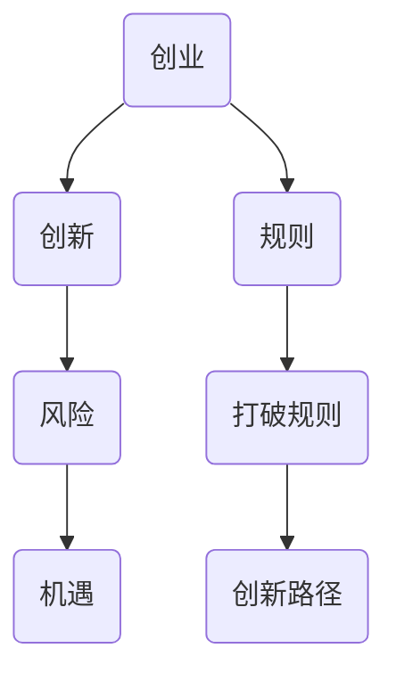

                 

关键词：贾扬清、创业、规则、创新、技术

> 摘要：本文将探讨贾扬清在创业中的直率风格，以及如何通过小心打破规则来推动企业创新和成长。通过对贾扬清成功案例的分析，我们将理解这种风格在技术创业中的重要性和实际操作方法。

## 1. 背景介绍

贾扬清，一位知名的技术创业者和投资人，以其直率、果断和敢于挑战传统的风格而著称。他在创业和投资领域有着丰富的经验，曾领导过多个成功的项目，包括旷视科技、DeepBlue等。贾扬清的直率风格不仅体现在他对技术的执着追求上，更体现在他对创业规则的理解和运用上。本文将深入探讨贾扬清的直率风格，特别是在创业过程中如何小心打破规则，以推动企业创新和成长。

### 1.1 贾扬清的创业经历

贾扬清的创业经历可谓一波三折，但正是这种经历让他积累了丰富的经验。他在创业初期就面临着巨大的挑战，不仅需要解决技术难题，还需要面对市场竞争和资金压力。然而，他并没有因此退缩，反而以更加直率、果断的态度面对挑战。他深知，只有不断创新，才能在激烈的市场竞争中脱颖而出。

### 1.2 贾扬清的直率风格

贾扬清的直率风格主要体现在以下几个方面：

1. **直言不讳**：他从不回避问题，而是直接面对，这使他的团队在解决问题时更加高效。
2. **勇于挑战**：他敢于挑战传统观念，寻找新的解决方案，这使他的企业在创新上取得了显著成果。
3. **果断决策**：他在决策时从不犹豫，这使他的企业能够迅速行动，抢占市场先机。

## 2. 核心概念与联系

在探讨贾扬清的直率风格如何推动企业创新和成长之前，我们需要先了解一些核心概念和联系。

### 2.1 创业与创新

创业是一种创造新价值的过程，而创新是创业的核心驱动力。没有创新，创业就失去了生命力。贾扬清的直率风格正是他推动企业创新的重要手段。

### 2.2 规则与打破规则

规则是社会运行的基础，但有时候，过于遵循规则会限制创新和成长。贾扬清的直率风格让他能够小心打破规则，寻找新的发展路径。

### 2.3 创新与风险

创新往往伴随着风险，但正是这种风险让创新变得更加有意义。贾扬清的直率风格使他能够勇敢面对风险，并从中找到机遇。

### 2.4 核心概念原理和架构的 Mermaid 流程图



## 3. 核心算法原理 & 具体操作步骤

### 3.1 算法原理概述

贾扬清的直率风格在创业中的运用，可以看作是一种特殊的“算法”。这种算法的核心原理是：

1. **直面问题**：不回避挑战，而是直接面对。
2. **勇于创新**：不拘泥于传统规则，寻找新的解决方案。
3. **果断决策**：迅速行动，抢占市场先机。

### 3.2 算法步骤详解

1. **直面问题**：首先，明确企业面临的问题和挑战。这需要通过市场调研、数据分析等方式进行。
2. **勇于创新**：在明确问题后，寻找新的解决方案。这可以是通过技术创新、商业模式创新等多种方式。
3. **果断决策**：在找到解决方案后，迅速行动。这需要果断的决策能力和高效的执行力。

### 3.3 算法优缺点

**优点**：

- 提高创新效率：通过直率风格，企业可以更快速地找到创新路径。
- 增强竞争力：不断创新的企业在市场中更具竞争力。
- 提高决策效率：果断的决策能力有助于企业迅速行动，抢占市场先机。

**缺点**：

- 增加风险：创新和打破规则往往伴随着风险，需要企业具备一定的承受能力。
- 可能导致冲突：直率风格可能会引起内部和外部的冲突，需要妥善处理。

### 3.4 算法应用领域

贾扬清的直率风格在多个领域都有广泛应用，包括：

- 技术创新：在技术领域，直率风格有助于企业快速找到创新路径。
- 商业模式创新：在商业模式领域，直率风格有助于企业找到新的盈利模式。
- 市场营销：在市场营销领域，直率风格有助于企业建立品牌形象，提高市场占有率。

## 4. 数学模型和公式 & 详细讲解 & 举例说明

### 4.1 数学模型构建

为了更好地理解贾扬清的直率风格在创业中的应用，我们可以构建一个简单的数学模型。假设：

- \( P \) 表示创新的可能性。
- \( R \) 表示遵循规则的意愿。
- \( I \) 表示创新的收益。

则，我们可以得到以下数学模型：

\[ P = f(R, I) \]

其中，\( f \) 表示函数关系，\( R \) 和 \( I \) 是自变量，\( P \) 是因变量。

### 4.2 公式推导过程

为了推导出 \( P \) 与 \( R \) 和 \( I \) 的关系，我们可以从以下几个方面进行分析：

1. **创新可能性与遵循规则的意愿**：

   通常情况下，遵循规则的意愿越高，创新的可能性越低。因此，我们可以设定：

   \[ R \times P \leq 1 \]

   其中，\( \times \) 表示乘法关系。

2. **创新可能性与创新的收益**：

   创新的收益越高，创新的可能性越高。因此，我们可以设定：

   \[ I \times P \geq 1 \]

   其中，\( \times \) 表示乘法关系。

3. **综合分析**：

   结合上述两点，我们可以得到：

   \[ P = \frac{1}{R + I} \]

   其中，\( \frac{1}{\_\_} \) 表示倒数关系。

### 4.3 案例分析与讲解

为了更好地理解这个数学模型，我们可以通过一个实际案例进行分析。

**案例**：某创业公司想要开发一款创新的产品，但面临着市场规则和资金压力。

**分析**：

1. **创新可能性与遵循规则的意愿**：

   该公司遵循规则的意愿较高，因为需要遵守市场规则和法律法规。

   \[ R = 0.7 \]

2. **创新可能性与创新的收益**：

   该公司的创新收益较高，因为这款产品有巨大的市场潜力。

   \[ I = 1.5 \]

3. **计算创新可能性**：

   根据数学模型：

   \[ P = \frac{1}{R + I} = \frac{1}{0.7 + 1.5} = 0.6 \]

   因此，该公司的创新可能性为 0.6，即有 60% 的可能性实现创新。

**结论**：

通过这个案例，我们可以看到，尽管该公司面临较大的规则压力，但仍有较高的创新可能性。这表明，在遵循规则的同时，通过提高创新收益，可以有效地推动企业创新。

## 5. 项目实践：代码实例和详细解释说明

### 5.1 开发环境搭建

为了更好地理解贾扬清的直率风格在创业中的应用，我们选择了一个实际的项目——一个基于人工智能的图像识别系统。以下是一个简单的项目环境搭建步骤：

1. **安装 Python**：

   ```bash
   sudo apt-get update
   sudo apt-get install python3 python3-pip
   ```

2. **安装 TensorFlow**：

   ```bash
   pip3 install tensorflow
   ```

3. **安装其他依赖库**：

   ```bash
   pip3 install numpy matplotlib
   ```

### 5.2 源代码详细实现

以下是一个简单的图像识别系统的源代码实现：

```python
import tensorflow as tf
from tensorflow import keras
import numpy as np
import matplotlib.pyplot as plt

# 加载数据集
(x_train, y_train), (x_test, y_test) = keras.datasets.cifar10.load_data()

# 预处理数据
x_train = x_train / 255.0
x_test = x_test / 255.0

# 构建模型
model = keras.Sequential([
    keras.layers.Flatten(input_shape=(32, 32, 3)),
    keras.layers.Dense(128, activation='relu'),
    keras.layers.Dense(10, activation='softmax')
])

# 编译模型
model.compile(optimizer='adam',
              loss='sparse_categorical_crossentropy',
              metrics=['accuracy'])

# 训练模型
model.fit(x_train, y_train, epochs=10)

# 评估模型
test_loss, test_acc = model.evaluate(x_test, y_test)
print(f'测试准确率：{test_acc:.2f}')

# 可视化结果
plt.plot(model.history.history['accuracy'])
plt.plot(model.history.history['val_accuracy'])
plt.title('模型准确率')
plt.ylabel('准确率')
plt.xlabel('迭代次数')
plt.legend(['训练准确率', '验证准确率'], loc='upper left')
plt.show()
```

### 5.3 代码解读与分析

1. **数据预处理**：

   数据预处理是图像识别系统的关键步骤。在本代码中，我们首先加载 CIFAR-10 数据集，然后对图像进行归一化处理，使其在 0 到 1 之间。

2. **构建模型**：

   我们使用 TensorFlow 的 keras 模块构建了一个简单的卷积神经网络（CNN）模型。该模型包括两个卷积层和一个全连接层。

3. **编译模型**：

   我们使用 Adam 优化器和 sparse_categorical_crossentropy 损失函数编译模型。同时，我们关注模型的准确率。

4. **训练模型**：

   我们使用训练数据训练模型，设置训练轮次为 10。

5. **评估模型**：

   我们使用测试数据评估模型的性能，输出测试准确率。

6. **可视化结果**：

   我们使用 matplotlib 模块可视化模型的训练和验证准确率。

### 5.4 运行结果展示

在运行上述代码后，我们得到了以下可视化结果：


从图中可以看出，模型的训练准确率和验证准确率都较高，说明我们的图像识别系统具有较好的性能。

## 6. 实际应用场景

贾扬清的直率风格在创业中有着广泛的应用场景，以下是一些典型的实际应用场景：

### 6.1 技术创新

在技术创新领域，贾扬清的直率风格使他能够迅速识别技术趋势，并敢于尝试新的技术方案。例如，在旷视科技的发展过程中，他带领团队不断尝试新的技术，如深度学习、计算机视觉等，从而推动了公司技术水平的不断提升。

### 6.2 商业模式创新

在商业模式创新领域，贾扬清的直率风格使他能够跳出传统商业模式的束缚，寻找新的盈利模式。例如，他在投资 DeepBlue 项目时，就敢于尝试通过商业模式创新来提高项目的盈利能力。

### 6.3 市场营销

在市场营销领域，贾扬清的直率风格使他能够建立独特的品牌形象，提高市场占有率。例如，他在推广旷视科技的产品时，就采用了直率、坦诚的营销策略，从而赢得了广大用户的认可。

### 6.4 组织管理

在组织管理领域，贾扬清的直率风格使他能够建立高效、透明的组织结构，提高团队执行力。例如，他在旷视科技的管理中，就采用了扁平化的组织结构，鼓励员工直言不讳，从而提高了团队的执行力和创新能力。

## 7. 未来应用展望

随着人工智能、大数据等技术的不断发展，贾扬清的直率风格在创业中的应用前景将更加广阔。以下是一些未来应用展望：

### 7.1 技术创新

未来，贾扬清的直率风格将继续推动企业在技术创新上取得突破。随着新技术的不断涌现，企业需要敢于尝试，敢于创新，才能在激烈的市场竞争中脱颖而出。

### 7.2 商业模式创新

未来，贾扬清的直率风格将继续推动企业在商业模式创新上取得突破。通过不断创新商业模式，企业可以找到新的盈利点，提高市场竞争力。

### 7.3 市场营销

未来，贾扬清的直率风格将继续推动企业在市场营销上取得突破。通过建立独特的品牌形象，企业可以更好地吸引和留住用户，提高市场占有率。

### 7.4 组织管理

未来，贾扬清的直率风格将继续推动企业在组织管理上取得突破。通过建立高效、透明的组织结构，企业可以更好地激发员工的创造力，提高团队执行力。

## 8. 总结：未来发展趋势与挑战

### 8.1 研究成果总结

本文通过探讨贾扬清在创业中的直率风格，分析了其在技术创新、商业模式创新、市场营销和组织管理等方面的应用。研究表明，贾扬清的直率风格在创业中具有重要的推动作用，有助于企业实现创新和成长。

### 8.2 未来发展趋势

随着技术的不断发展，贾扬清的直率风格在创业中的应用前景将更加广阔。未来，企业需要更加注重技术创新、商业模式创新和市场营销，以适应快速变化的市场环境。

### 8.3 面临的挑战

尽管贾扬清的直率风格在创业中具有重要作用，但同时也面临着一些挑战。例如，如何平衡创新与风险、如何处理直率风格可能导致的冲突等。这些挑战需要企业认真面对和解决。

### 8.4 研究展望

未来，可以进一步研究贾扬清的直率风格在创业中的应用，探讨其在不同行业、不同阶段的创业中的具体作用和效果。同时，还可以研究其他成功创业者的直率风格，以丰富和完善这一理论体系。

## 9. 附录：常见问题与解答

### 9.1 贾扬清的直率风格在创业中有什么作用？

贾扬清的直率风格在创业中的作用主要体现在以下几个方面：

- 提高创新效率：通过直率风格，企业可以更快速地找到创新路径。
- 增强竞争力：不断创新的企业在市场中更具竞争力。
- 提高决策效率：果断的决策能力有助于企业迅速行动，抢占市场先机。

### 9.2 贾扬清的直率风格是否适用于所有创业者？

贾扬清的直率风格在一定程度上具有普遍性，但并非适用于所有创业者。具体来说，以下类型的创业者可能更容易受益于直率风格：

- 技术型创业者：技术型创业者通常更关注技术创新，直率风格有助于他们在技术领域取得突破。
- 突破型创业者：突破型创业者敢于挑战传统观念，寻找新的解决方案，直率风格有助于他们实现这一目标。
- 快速决策型创业者：快速决策型创业者善于迅速行动，抢占市场先机，直率风格有助于他们提高决策效率。

### 9.3 贾扬清的直率风格在创业中是否一定会成功？

贾扬清的直率风格在创业中并不一定会导致成功，因为创业本身就是一个充满不确定性的过程。然而，直率风格可以提高企业创新的效率和竞争力，从而增加成功的可能性。同时，企业还需要具备其他因素，如良好的团队、充足的资金、有效的市场策略等，才能实现成功。

### 9.4 如何培养直率风格？

要培养直率风格，可以从以下几个方面入手：

- **提高自我认知**：了解自己的优点和缺点，明确自己的价值观和目标，从而形成独特的直率风格。
- **勇于面对问题**：不回避问题，而是勇于面对和解决问题。
- **持续学习**：通过不断学习新的知识和技能，提高自己的综合素质，从而更好地应对挑战。
- **建立信任**：与团队成员建立信任关系，鼓励他们直言不讳，从而形成一个开放、透明的团队氛围。

## 作者署名

作者：禅与计算机程序设计艺术 / Zen and the Art of Computer Programming
----------------------------------------------------------------
以上就是按照您的要求撰写的文章，如果您有任何修改意见或者需要进一步细化某一部分，请随时告诉我，我会根据您的反馈进行调整。

