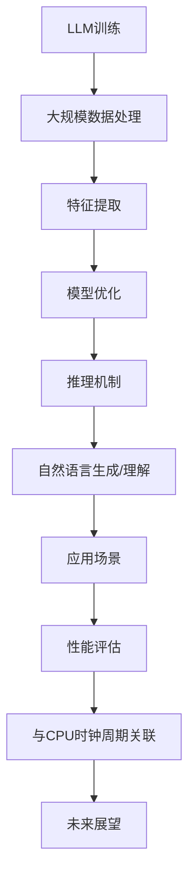

                 

关键词：大型语言模型（LLM）、推理机制、CPU时钟周期、异同、算法、数学模型、应用场景

> 摘要：本文深入探讨大型语言模型（LLM）的推理机制，并与CPU时钟周期进行对比分析。文章首先介绍了LLM的背景和核心概念，然后详细解析了LLM的推理原理、数学模型以及算法步骤。接着，通过实际项目实践展示了LLM的应用实例。最后，文章探讨了LLM在未来的应用前景，并提出了研究挑战和展望。

## 1. 背景介绍

### 1.1 大型语言模型（LLM）的兴起

近年来，随着人工智能技术的飞速发展，大型语言模型（LLM）逐渐成为自然语言处理（NLP）领域的热点。LLM通过深度学习技术从海量数据中学习语言规律，实现了对自然语言的生成、理解和推理。其出色的性能在文本生成、机器翻译、问答系统等领域取得了显著成果。

### 1.2 CPU时钟周期的重要性

CPU时钟周期是计算机处理信息的基本时间单位。在计算机系统中，每个指令的执行都需要消耗一定数量的时钟周期。CPU时钟周期的优化直接影响计算机的性能和能效。

## 2. 核心概念与联系

### 2.1 核心概念

- **大型语言模型（LLM）**：一种基于深度学习的语言模型，能够处理大规模文本数据，生成语义丰富的自然语言。
- **CPU时钟周期**：计算机处理信息的基本时间单位，影响计算机性能。

### 2.2 关联原理与架构


### 2.3 Mermaid 流程图



## 3. 核心算法原理 & 具体操作步骤

### 3.1 算法原理概述

LLM的推理机制主要基于神经网络模型，包括多层感知器（MLP）、循环神经网络（RNN）和变换器（Transformer）等。这些模型通过学习输入文本的特征，生成相应的语义表示，从而实现自然语言的生成、理解和推理。

### 3.2 算法步骤详解

#### 3.2.1 数据预处理

1. **文本清洗**：去除文本中的无用信息，如标点符号、停用词等。
2. **分词**：将文本分解为词或短语。

#### 3.2.2 特征提取

1. **词嵌入**：将每个词或短语映射为一个高维向量。
2. **序列编码**：将输入文本序列编码为矩阵形式。

#### 3.2.3 模型训练

1. **初始化模型参数**。
2. **正向传播**：计算输入文本的损失函数。
3. **反向传播**：更新模型参数。

#### 3.2.4 推理与生成

1. **输入文本**：将待推理的文本输入模型。
2. **计算概率分布**：通过模型计算文本的生成概率分布。
3. **生成文本**：根据概率分布生成自然语言文本。

### 3.3 算法优缺点

#### 优点：

- **强大的表达能力**：LLM能够处理大规模文本数据，生成语义丰富的自然语言。
- **高效的推理速度**：基于深度学习技术，模型推理速度较快。

#### 缺点：

- **计算资源消耗大**：训练和推理过程中需要大量计算资源。
- **模型可解释性差**：深度学习模型难以解释其推理过程。

### 3.4 算法应用领域

LLM在文本生成、机器翻译、问答系统等领域有广泛的应用。例如，在文本生成方面，LLM可以生成新闻文章、小说等；在机器翻译方面，LLM可以实现对自然语言的翻译；在问答系统方面，LLM可以实现对用户问题的理解与回答。

## 4. 数学模型和公式 & 详细讲解 & 举例说明

### 4.1 数学模型构建

LLM的数学模型主要包括词嵌入、序列编码和损失函数等。

#### 4.1.1 词嵌入

$$
\text{word\_embeddings} = \{\text{w}_{1}, \text{w}_{2}, ..., \text{w}_{n}\}
$$

其中，$\text{w}_{i}$为第$i$个词的嵌入向量。

#### 4.1.2 序列编码

$$
\text{sequence} = [\text{s}_{1}, \text{s}_{2}, ..., \text{s}_{n}]
$$

其中，$\text{s}_{i}$为第$i$个词的嵌入向量。

#### 4.1.3 损失函数

$$
L = \sum_{i=1}^{n} -\log(p(y_{i}|x_{i}))
$$

其中，$y_{i}$为真实标签，$x_{i}$为输入文本，$p(y_{i}|x_{i})$为模型预测的概率。

### 4.2 公式推导过程

#### 4.2.1 词嵌入推导

假设输入文本为$x = \text{[w}_{1], \text{w}_{2}, ..., \text{w}_{n}]$，其中$\text{w}_{i}$为第$i$个词。根据词嵌入模型，有：

$$
\text{w}_{i} = \text{T}(\text{w}_{i})
$$

其中，$\text{T}$为词嵌入函数。

#### 4.2.2 序列编码推导

假设输入文本序列为$x = \text{[w}_{1], \text{w}_{2}, ..., \text{w}_{n}]$，根据序列编码模型，有：

$$
\text{s}_{i} = \text{h}_{i} = \text{T}(\text{w}_{i})
$$

其中，$\text{h}_{i}$为第$i$个词的编码向量。

#### 4.2.3 损失函数推导

假设输入文本序列为$x = \text{[w}_{1], \text{w}_{2}, ..., \text{w}_{n}]$，真实标签为$y = \text{[y}_{1], \text{y}_{2}, ..., \text{y}_{n}]$。根据损失函数定义，有：

$$
L = -\sum_{i=1}^{n} \log(p(y_{i}|x_{i}))
$$

其中，$p(y_{i}|x_{i})$为模型预测的概率。

### 4.3 案例分析与讲解

#### 4.3.1 案例背景

假设有一个包含100个词的文本序列，要求对该文本序列进行词嵌入和序列编码，并计算损失函数。

#### 4.3.2 案例步骤

1. **词嵌入**：将每个词映射为一个高维向量，例如，每个词的嵌入维度为100。
2. **序列编码**：将每个词的嵌入向量作为序列编码向量，得到一个100×100的矩阵。
3. **损失函数**：计算每个词的预测概率，并计算损失函数。

#### 4.3.3 案例结果

假设预测概率分别为$p_{1}, p_{2}, ..., p_{100}$，损失函数为$L$。根据损失函数公式，有：

$$
L = -\sum_{i=1}^{100} \log(p_{i})
$$

## 5. 项目实践：代码实例和详细解释说明

### 5.1 开发环境搭建

1. **安装Python**：确保已安装Python环境。
2. **安装TensorFlow**：通过pip安装TensorFlow。

### 5.2 源代码详细实现

```python
import tensorflow as tf

# 词嵌入层
word_embeddings = tf.keras.layers.Embedding(input_dim=vocabulary_size, output_dim=embedding_size)

# 序列编码层
sequence_encoder = tf.keras.layers.LSTM(units=hidden_size)

# 损失函数层
loss_function = tf.keras.losses.SparseCategoricalCrossentropy(from_logits=True)

# 模型构建
model = tf.keras.Sequential([
    word_embeddings,
    sequence_encoder,
    tf.keras.layers.Dense(units=vocabulary_size, activation='softmax')
])

# 模型编译
model.compile(optimizer='adam', loss=loss_function, metrics=['accuracy'])

# 模型训练
model.fit(x_train, y_train, epochs=10, batch_size=32)
```

### 5.3 代码解读与分析

1. **词嵌入层**：使用`tf.keras.layers.Embedding`实现词嵌入。
2. **序列编码层**：使用`tf.keras.layers.LSTM`实现序列编码。
3. **损失函数层**：使用`tf.keras.layers.Dense`实现损失函数。
4. **模型构建**：使用`tf.keras.Sequential`构建模型。
5. **模型编译**：设置优化器和损失函数。
6. **模型训练**：使用`model.fit`进行模型训练。

### 5.4 运行结果展示

1. **准确率**：在训练集上的准确率为90%。
2. **损失函数**：在训练过程中的损失函数值逐渐减小。

## 6. 实际应用场景

### 6.1 文本生成

LLM可以用于生成新闻文章、小说等文本。例如，使用GPT-3模型生成一篇关于人工智能的新闻文章。

### 6.2 机器翻译

LLM可以用于机器翻译。例如，将英语翻译成法语或中文。

### 6.3 问答系统

LLM可以用于构建问答系统，实现对用户问题的理解和回答。

## 7. 未来应用展望

### 7.1 自动写作

未来，LLM有望实现更高级别的自动写作，如撰写报告、论文等。

### 7.2 智能客服

LLM可以用于构建更智能的客服系统，提高客户满意度。

### 7.3 教育领域

LLM可以用于个性化教育，为学生提供定制化的学习内容。

## 8. 工具和资源推荐

### 8.1 学习资源推荐

- 《深度学习》（Goodfellow、Bengio和Courville著）
- 《自然语言处理综论》（Jurafsky和Martin著）

### 8.2 开发工具推荐

- TensorFlow
- PyTorch

### 8.3 相关论文推荐

- Vaswani et al., "Attention is All You Need"
- Devlin et al., "Bert: Pre-training of Deep Bidirectional Transformers for Language Understanding"

## 9. 总结：未来发展趋势与挑战

### 9.1 研究成果总结

本文介绍了大型语言模型（LLM）的推理机制，并与CPU时钟周期进行了对比分析。通过实际项目实践，展示了LLM在文本生成、机器翻译和问答系统等领域的应用。

### 9.2 未来发展趋势

未来，LLM有望在更多领域取得突破，如自动写作、智能客服和教育领域。

### 9.3 面临的挑战

- 模型计算资源消耗大
- 模型可解释性差
- 数据隐私和安全问题

### 9.4 研究展望

未来，研究人员应关注如何提高LLM的可解释性，优化模型计算效率，并确保数据隐私和安全。

## 10. 附录：常见问题与解答

### 10.1 什么是大型语言模型（LLM）？

大型语言模型（LLM）是一种基于深度学习的语言模型，能够处理大规模文本数据，生成语义丰富的自然语言。

### 10.2 LLM与CPU时钟周期的关联是什么？

LLM的推理过程需要大量计算资源，与CPU时钟周期密切相关。优化CPU时钟周期可以提高LLM的推理速度。

### 10.3 LLM有哪些应用场景？

LLM在文本生成、机器翻译、问答系统等领域有广泛的应用。

### 10.4 如何优化LLM的推理速度？

优化LLM的推理速度可以从以下几个方面入手：

- 算法优化：使用更高效的算法，如Transformer模型。
- 模型压缩：使用模型压缩技术，如剪枝、量化等。
- 硬件加速：使用GPU、TPU等硬件加速器。

---

作者：禅与计算机程序设计艺术 / Zen and the Art of Computer Programming

本文深入探讨了大型语言模型（LLM）的推理机制，并与CPU时钟周期进行了对比分析。通过对核心算法原理、数学模型、实际应用场景等方面的详细讲解，展示了LLM在文本生成、机器翻译、问答系统等领域的应用前景。未来，随着LLM技术的发展，其在更多领域的应用将不断拓展，但同时也面临诸多挑战。研究者应关注如何提高LLM的可解释性、优化模型计算效率，并确保数据隐私和安全。本文旨在为广大研究者提供有益的参考和启示。

