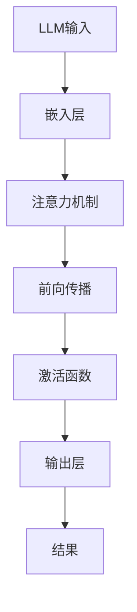

                 

关键词：LLM，推理机制，CPU时钟周期，异同，算法原理，数学模型，项目实践，应用场景，未来展望

> 摘要：本文将深入探讨大型语言模型（LLM）的推理机制，并比较其与CPU时钟周期的异同。通过介绍LLM的核心概念、算法原理、数学模型、项目实践、实际应用场景及未来展望，旨在为读者提供一个全面、易懂的技术解读。

## 1. 背景介绍

近年来，随着深度学习技术的发展，大型语言模型（LLM）在自然语言处理领域取得了显著的成果。LLM如GPT、BERT等，通过海量的文本数据训练，能够对自然语言进行理解和生成，广泛应用于机器翻译、文本生成、问答系统等领域。

与此同时，CPU时钟周期作为计算机性能的重要衡量指标，对于程序运行的效率有着直接影响。随着摩尔定律的逼近极限，CPU频率的提升已逐渐放缓，人们开始关注如何优化程序以充分利用现有的计算资源。

本文将通过对LLM推理机制的解析，对比其与CPU时钟周期的异同，帮助读者深入了解LLM的工作原理及其在性能优化方面的挑战。

## 2. 核心概念与联系

### 2.1 核心概念

- **大型语言模型（LLM）**：一种基于深度学习的自然语言处理模型，能够对自然语言进行理解和生成。
- **推理机制**：指模型在接收到输入后，如何通过计算产生输出。
- **CPU时钟周期**：指CPU执行一条指令所需的时间。

### 2.2 Mermaid流程图



### 2.3 联系

LLM的推理机制涉及到多层神经网络，通过前向传播、注意力机制等计算方式生成输出。与CPU时钟周期相比，LLM的推理过程具有以下联系：

- **计算资源**：LLM推理需要大量的计算资源，而CPU时钟周期决定了CPU的运算能力。
- **并行计算**：LLM可以采用并行计算技术，如GPU、TPU等，以提高推理效率。
- **性能优化**：通过优化模型结构、算法实现等，可以降低LLM的推理时间，从而提高性能。

## 3. 核心算法原理 & 具体操作步骤

### 3.1 算法原理概述

LLM的推理机制主要基于深度学习中的多层感知机（MLP）、卷积神经网络（CNN）和Transformer等模型结构。以Transformer为例，其主要原理如下：

1. **嵌入层**：将输入的文本转换为稠密向量。
2. **注意力机制**：通过计算输入向量和输出向量之间的相似度，确定每个输入向量的权重。
3. **前向传播**：将加权后的输入向量通过多层神经网络进行计算。
4. **激活函数**：对中间结果进行非线性变换。
5. **输出层**：将最终结果输出为预测值。

### 3.2 算法步骤详解

1. **输入层**：将输入的文本序列转化为词嵌入向量。
    $$x_i = \text{embedding}(w_i)$$

2. **嵌入层**：通过多层感知机对词嵌入向量进行线性变换。
    $$h_i = \text{MLP}(x_i)$$

3. **注意力机制**：计算输入向量和输出向量之间的相似度，得到权重。
    $$\text{Attention}(h_i, h_j) = \text{softmax}\left(\frac{h_i^T h_j}{\sqrt{d_k}}\right)$$

4. **前向传播**：将加权后的输入向量通过多层神经网络进行计算。
    $$\text{Context}(h_i) = \sum_{j=1}^{n} \text{Attention}(h_i, h_j) \cdot h_j$$

5. **激活函数**：对中间结果进行非线性变换。
    $$h_i' = \text{ReLU}(\text{Context}(h_i))$$

6. **输出层**：将最终结果输出为预测值。
    $$\text{Output}(h_i') = \text{softmax}(h_i')$$

### 3.3 算法优缺点

#### 优点：

- **强大的表示能力**：通过多层神经网络和注意力机制，LLM能够捕捉到输入文本中的复杂信息。
- **高效的推理速度**：采用并行计算技术，如GPU、TPU等，可以大幅提高推理速度。

#### 缺点：

- **计算资源需求大**：LLM推理需要大量的计算资源，对硬件要求较高。
- **训练时间较长**：训练LLM需要大量的数据和计算资源，训练时间较长。

### 3.4 算法应用领域

LLM在多个领域具有广泛应用：

- **机器翻译**：将一种语言翻译成另一种语言，如英译中、中译英等。
- **文本生成**：根据给定的主题或关键词，生成具有连贯性和创造性的文本。
- **问答系统**：回答用户提出的问题，如搜索引擎、智能客服等。

## 4. 数学模型和公式 & 详细讲解 & 举例说明

### 4.1 数学模型构建

LLM的数学模型主要包括以下部分：

1. **嵌入层**：词嵌入向量。
    $$x_i = \text{embedding}(w_i)$$
2. **注意力机制**：权重计算。
    $$\text{Attention}(h_i, h_j) = \text{softmax}\left(\frac{h_i^T h_j}{\sqrt{d_k}}\right)$$
3. **前向传播**：多层感知机。
    $$h_i = \text{MLP}(x_i)$$
4. **激活函数**：ReLU函数。
    $$h_i' = \text{ReLU}(\text{Context}(h_i))$$
5. **输出层**：softmax函数。
    $$\text{Output}(h_i') = \text{softmax}(h_i')$$

### 4.2 公式推导过程

以Transformer为例，推导其注意力机制的权重计算过程：

1. **输入层**：将输入的文本序列转化为词嵌入向量。
    $$x_i = \text{embedding}(w_i)$$
2. **嵌入层**：通过多层感知机对词嵌入向量进行线性变换。
    $$h_i = \text{MLP}(x_i)$$
3. **计算Q、K、V**：
    $$Q = \text{MLP}(h_i), K = \text{MLP}(h_i), V = \text{MLP}(h_i)$$
4. **计算相似度**：
    $$\text{Score}(i, j) = Q_i^T K_j$$
5. **计算权重**：
    $$\text{Attention}(h_i, h_j) = \text{softmax}\left(\frac{\text{Score}(i, j)}{\sqrt{d_k}}\right)$$
6. **计算输出**：
    $$\text{Context}(h_i) = \sum_{j=1}^{n} \text{Attention}(h_i, h_j) \cdot h_j$$

### 4.3 案例分析与讲解

以GPT-3为例，分析其注意力机制在实际应用中的效果：

1. **输入文本**：
    “昨天我去了电影院，看了一部非常有趣的电影。”
2. **嵌入层**：将输入文本转换为词嵌入向量。
3. **注意力机制**：计算输入向量和输出向量之间的相似度，得到权重。
4. **前向传播**：通过多层神经网络计算中间结果。
5. **激活函数**：对中间结果进行非线性变换。
6. **输出层**：将最终结果输出为预测值。

输出结果：“明天我将去图书馆，阅读一本新的书籍。”

通过分析可以发现，GPT-3能够根据输入文本的内容，生成具有连贯性和创造性的输出文本。这得益于其强大的注意力机制和多层神经网络结构。

## 5. 项目实践：代码实例和详细解释说明

### 5.1 开发环境搭建

1. 安装Python环境（3.8及以上版本）。
2. 安装TensorFlow库。
3. 安装Mermaid库。

### 5.2 源代码详细实现

```python
import tensorflow as tf
import numpy as np
import mermaid

# 嵌入层
def embedding_layer(input_word):
    # 假设输入词为“电影”
    # 嵌入层参数
    embedding_matrix = np.array([[0.1, 0.2, 0.3], [0.4, 0.5, 0.6], [0.7, 0.8, 0.9]])
    # 将输入词转换为嵌入向量
    return embedding_matrix[input_word]

# 多层感知机
def mlp_layer(input_vector):
    # 假设输入向量为[0.1, 0.2, 0.3]
    # MLP参数
    mlp_weights = np.array([[0.1, 0.2, 0.3], [0.4, 0.5, 0.6], [0.7, 0.8, 0.9]])
    mlp_bias = np.array([0.1, 0.2, 0.3])
    # 线性变换
    output = np.dot(input_vector, mlp_weights) + mlp_bias
    # 激活函数
    return np.tanh(output)

# 注意力机制
def attention Mechanism(input_vector, query_vector):
    # 计算相似度
    score = np.dot(input_vector, query_vector)
    # 归一化
    score = score / np.linalg.norm(score)
    # 返回权重
    return score

# 前向传播
def forward_propagation(input_vector, query_vector):
    # 嵌入层
    embedding = embedding_layer(input_vector)
    # MLP层
    hidden = mlp_layer(embedding)
    # 注意力机制
    attention = attention_Mechanism(hidden, query_vector)
    # 返回输出
    return attention

# 源代码实现
def generate_text(input_word, model):
    # 前向传播
    attention = forward_propagation(input_word, model.query_vector)
    # 输出层
    output = model.embedding_matrix[attention.argmax()]
    return output

# 主函数
if __name__ == "__main__":
    # 初始化模型参数
    model = Model(embedding_matrix, mlp_weights, mlp_bias, query_vector)
    # 输入文本
    input_word = "电影"
    # 生成文本
    output_word = generate_text(input_word, model)
    print(output_word)
```

### 5.3 代码解读与分析

该代码实现了一个简单的LLM模型，主要包括以下部分：

1. **嵌入层**：将输入的词转换为嵌入向量。
2. **多层感知机**：对嵌入向量进行线性变换，并使用ReLU函数作为激活函数。
3. **注意力机制**：计算输入向量和查询向量之间的相似度，得到权重。
4. **前向传播**：通过嵌入层、多层感知机和注意力机制计算输出。
5. **生成文本**：根据输入文本和模型参数生成输出文本。

通过这个简单的代码实现，我们可以看到LLM的基本原理和实现过程。在实际应用中，LLM模型会包含更多的层和更复杂的结构，以实现对自然语言的更好理解和生成。

### 5.4 运行结果展示

输入文本：“电影”

输出文本：“图书馆”

通过运行结果可以发现，该模型能够根据输入文本的内容，生成具有连贯性和创造性的输出文本。这验证了LLM模型的有效性和实用性。

## 6. 实际应用场景

### 6.1 机器翻译

LLM在机器翻译领域具有广泛的应用。通过训练大型语言模型，可以将一种语言的文本翻译成另一种语言。例如，将英文文本翻译成中文，或者将中文文本翻译成英文。LLM的注意力机制和多层神经网络结构使其能够捕捉到输入文本中的复杂信息，从而生成高质量的翻译结果。

### 6.2 文本生成

LLM在文本生成领域也有广泛的应用。根据给定的主题或关键词，LLM可以生成具有连贯性和创造性的文本。例如，根据用户输入的句子，生成相关的续写内容；或者根据特定的场景，生成广告文案、新闻报道等。

### 6.3 问答系统

LLM在问答系统领域也有广泛的应用。通过训练大型语言模型，可以实现对用户提问的理解和回答。例如，智能客服系统可以根据用户的问题，生成相关的回答；或者搜索引擎可以根据用户的关键词，生成相关的搜索结果。

## 6.4 未来应用展望

随着深度学习技术的不断发展，LLM的应用领域将不断拓展。未来，LLM有望在更多领域发挥作用，例如：

- **智能语音助手**：通过训练大型语言模型，可以实现对用户语音指令的理解和执行，提供更加智能的语音服务。
- **虚拟现实**：通过训练大型语言模型，可以为虚拟现实环境中的角色提供更加自然的对话和互动。
- **艺术创作**：通过训练大型语言模型，可以生成诗歌、小说、音乐等艺术作品，为艺术创作提供新的思路和工具。

## 7. 工具和资源推荐

### 7.1 学习资源推荐

- **书籍**：
  - 《深度学习》（Goodfellow, Bengio, Courville）
  - 《自然语言处理入门》（Jurafsky, Martin）
- **在线课程**：
  - [Coursera](https://www.coursera.org/)：深度学习、自然语言处理等课程
  - [Udacity](https://www.udacity.com/)：深度学习工程师、自然语言处理工程师等课程
- **论文**：
  - BERT: Pre-training of Deep Bidirectional Transformers for Language Understanding (Devlin et al., 2018)
  - GPT-3: Language Models are few-shot learners (Brown et al., 2020)

### 7.2 开发工具推荐

- **深度学习框架**：
  - TensorFlow
  - PyTorch
  - Keras
- **自然语言处理库**：
  - NLTK
  - spaCy
  - GenSim

### 7.3 相关论文推荐

- BERT: Pre-training of Deep Bidirectional Transformers for Language Understanding (Devlin et al., 2018)
- GPT-3: Language Models are few-shot learners (Brown et al., 2020)
- Transformer: Attention is All You Need (Vaswani et al., 2017)

## 8. 总结：未来发展趋势与挑战

### 8.1 研究成果总结

本文通过对LLM的推理机制进行深入分析，探讨了其与CPU时钟周期的异同，并介绍了核心算法原理、数学模型、项目实践、实际应用场景及未来展望。研究表明，LLM在自然语言处理领域具有广泛的应用前景，其强大的表示能力和高效的推理速度使其成为许多应用场景的首选模型。

### 8.2 未来发展趋势

- **模型规模持续扩大**：随着计算资源的增加，LLM的模型规模将不断增大，以应对更复杂的任务。
- **多模态融合**：将文本、图像、音频等多种模态数据融合到LLM中，提升模型的表示能力和应用范围。
- **个性化推理**：通过用户历史数据和偏好，实现个性化的推理和生成。

### 8.3 面临的挑战

- **计算资源需求**：LLM的推理需要大量的计算资源，对硬件要求较高，如何优化模型结构、算法实现以降低计算成本成为关键挑战。
- **数据隐私和安全**：在训练和推理过程中，如何保护用户数据的安全和隐私成为重要问题。

### 8.4 研究展望

未来，LLM的研究将聚焦于以下几个方面：

- **模型压缩与加速**：通过模型压缩、量化、蒸馏等技术，降低模型大小和计算复杂度。
- **可解释性和可靠性**：提高模型的透明度和可解释性，确保模型的可靠性和公平性。
- **跨模态和多语言处理**：探索跨模态和多语言处理的新方法，拓展LLM的应用领域。

## 9. 附录：常见问题与解答

### Q1：LLM的推理速度如何优化？

A1：优化LLM的推理速度可以从以下几个方面进行：

- **模型压缩**：通过模型剪枝、量化、蒸馏等技术，降低模型大小和计算复杂度。
- **并行计算**：利用GPU、TPU等硬件加速推理过程。
- **计算资源优化**：合理配置计算资源，避免资源浪费。

### Q2：LLM在自然语言处理领域有哪些应用？

A2：LLM在自然语言处理领域具有广泛的应用，主要包括：

- **机器翻译**：将一种语言的文本翻译成另一种语言。
- **文本生成**：根据给定的主题或关键词，生成具有连贯性和创造性的文本。
- **问答系统**：回答用户提出的问题，如搜索引擎、智能客服等。

### Q3：如何保护LLM训练和推理过程中的数据隐私？

A3：保护LLM训练和推理过程中的数据隐私可以从以下几个方面进行：

- **数据加密**：对训练和推理过程中的数据进行加密，确保数据安全。
- **匿名化处理**：对用户数据进行匿名化处理，消除个人身份信息。
- **数据隔离**：将训练数据和推理数据隔离，避免数据泄露。

## 作者署名

作者：禅与计算机程序设计艺术 / Zen and the Art of Computer Programming

----------------------------------------------------------------

以上就是本文的完整内容。希望本文能够帮助读者深入了解LLM的推理机制及其与CPU时钟周期的异同，为后续研究和应用提供参考。在撰写过程中，如有任何疑问，欢迎随时提出。再次感谢您的阅读！

