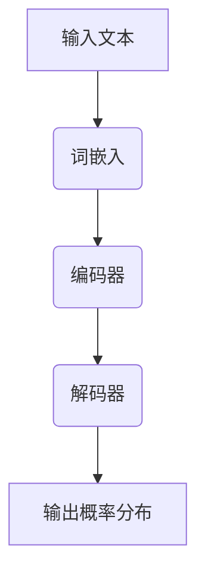

                 

关键词：计算机架构，语言模型，大型语言模型，AI，机器学习，深度学习，神经网络，数据处理，软件开发，算法优化，技术革新

## 摘要

随着人工智能技术的不断发展，语言模型（Language Model，简称LLM）已经从一种学术研究逐渐走向工业应用，并成为计算机架构领域的重要一环。本文旨在探讨LLM在计算机架构中的崛起，分析其核心概念、算法原理、数学模型，以及其在实际应用中的表现和未来展望。通过本文的阐述，希望能够为读者提供一幅全面而清晰的LLM发展图景，并激发对这一新兴领域的深入研究和应用探索。

## 1. 背景介绍

计算机架构的发展经历了多个阶段，从早期的冯·诺依曼架构到现代的多核处理器、GPU、FPGA等，每一个阶段的进步都推动了计算机性能的飞跃。然而，随着大数据和机器学习技术的普及，计算机架构又面临新的挑战和机遇。尤其是语言模型的崛起，使得数据处理和自然语言理解成为计算机架构研究的重要方向。

语言模型是一种基于统计或神经网络的算法，用于预测下一个词或句子的概率。最早的统计语言模型如N-gram模型，通过统计文本中的词频来预测下一个词。随着深度学习技术的发展，神经网络语言模型如Transformer等逐渐成为主流，其在自然语言处理（Natural Language Processing，简称NLP）任务中取得了显著的成效。

近年来，随着计算能力的提升和数据规模的扩大，大型语言模型（LLM）应运而生。这些模型具有数十亿甚至千亿个参数，能够处理复杂的语言现象和上下文关系。例如，GPT-3、BERT、T5等模型已经在各种NLP任务中展现出强大的性能，成为计算机架构领域的重要研究热点。

## 2. 核心概念与联系

### 2.1. 语言模型的基本概念

语言模型的核心任务是预测文本中的下一个词或句子。为了实现这一目标，语言模型需要学习大量的文本数据，并从中提取语言规律和特征。以下是几个关键概念：

- **词汇表（Vocabulary）**：语言模型所包含的词汇量，通常包括单词、符号和特殊标记。
- **词嵌入（Word Embedding）**：将词汇表中的每个词映射到一个低维向量空间中，以便于计算机处理。
- **上下文（Context）**：语言模型在预测时需要考虑的文本上下文，包括前文和后文的信息。
- **概率分布（Probability Distribution）**：语言模型输出一个概率分布，表示下一个词或句子的可能性。

### 2.2. 语言模型的分类

语言模型可以分为统计语言模型和神经网络语言模型两大类。

- **统计语言模型**：基于统计学的原理，通过分析文本中的词频和语法规则来预测下一个词。典型的统计语言模型包括N-gram模型和决策树模型等。
- **神经网络语言模型**：基于深度学习的原理，通过训练神经网络来学习文本数据中的规律。典型的神经网络语言模型包括基于循环神经网络（RNN）的模型和基于Transformer的模型等。

### 2.3. 语言模型的架构

语言模型的架构可以分为前向传播和后向传播两个阶段。

- **前向传播**：输入文本数据，通过词嵌入层、编码器层和输出层，生成概率分布。
- **后向传播**：根据预测结果和真实结果，计算损失函数，并通过反向传播算法更新模型参数。

### 2.4. 语言模型与计算机架构的联系

语言模型在计算机架构中的应用主要体现在以下几个方面：

- **数据处理**：语言模型需要处理大量的文本数据，这要求计算机架构能够提供高效的数据存储和读取机制。
- **计算资源**：语言模型通常具有大量的参数，需要大量的计算资源，尤其是GPU和TPU等专用计算设备。
- **模型优化**：计算机架构需要支持模型的优化，包括参数初始化、正则化、批量归一化等，以提高模型的性能和稳定性。
- **分布式计算**：大型语言模型通常需要分布式计算来加速训练和推断过程。

### 2.5. Mermaid 流程图

以下是语言模型的基本架构的Mermaid流程图：



## 3. 核心算法原理 & 具体操作步骤

### 3.1. 算法原理概述

语言模型的核心算法是基于深度学习原理，通过训练神经网络来学习文本数据中的规律。具体来说，语言模型可以分为以下三个阶段：

- **词嵌入阶段**：将词汇表中的每个词映射到一个低维向量空间中，以便于计算机处理。
- **编码器阶段**：通过编码器层对输入的词向量进行编码，提取文本的上下文信息。
- **解码器阶段**：通过解码器层生成概率分布，预测下一个词或句子。

### 3.2. 算法步骤详解

以下是语言模型的具体操作步骤：

1. **数据预处理**：
   - 读取文本数据，分词并转换为词嵌入向量。
   - 将词嵌入向量作为输入，输入到编码器中。

2. **编码器训练**：
   - 输入词嵌入向量，通过编码器层进行编码，提取文本的上下文信息。
   - 计算编码后的向量与目标词嵌入向量的距离，作为损失函数。

3. **解码器训练**：
   - 输入编码后的向量，通过解码器层生成概率分布。
   - 选择具有最高概率的词作为下一个词，作为真实标签。
   - 计算预测词嵌入向量与真实词嵌入向量的距离，作为损失函数。

4. **优化模型参数**：
   - 根据损失函数，通过反向传播算法更新模型参数。
   - 重复编码器训练和解码器训练，直到模型收敛。

### 3.3. 算法优缺点

- **优点**：
  - 语言模型能够处理复杂的语言现象和上下文关系，具有强大的预测能力。
  - 基于深度学习原理，能够通过大量数据自动提取特征，提高模型的性能和泛化能力。

- **缺点**：
  - 需要大量的计算资源和数据，训练过程较长。
  - 模型参数较多，可能导致过拟合。

### 3.4. 算法应用领域

语言模型在计算机架构中具有广泛的应用，包括但不限于以下几个方面：

- **自然语言处理**：文本分类、情感分析、机器翻译等。
- **问答系统**：智能客服、智能助手等。
- **语音识别**：语音合成、语音识别等。
- **推荐系统**：基于文本内容的推荐等。

## 4. 数学模型和公式 & 详细讲解 & 举例说明

### 4.1. 数学模型构建

语言模型的数学模型主要包括词嵌入、编码器、解码器和损失函数等部分。以下是这些部分的基本公式：

- **词嵌入**：
  - $e_{w} = \text{Embed}(w)$，其中 $e_{w}$ 是词 $w$ 的嵌入向量，$\text{Embed}$ 是嵌入函数。

- **编码器**：
  - $h = \text{Encoder}(e_{w_1}, e_{w_2}, ..., e_{w_n})$，其中 $h$ 是编码后的向量，$\text{Encoder}$ 是编码函数。

- **解码器**：
  - $p_{w_{t+1}} = \text{Decoder}(h, e_{w_{t+1}})$，其中 $p_{w_{t+1}}$ 是下一个词 $w_{t+1}$ 的概率分布，$\text{Decoder}$ 是解码函数。

- **损失函数**：
  - $L = -\sum_{t=1}^{T} \log(p_{w_{t+1}})$，其中 $L$ 是损失函数，$T$ 是序列的长度。

### 4.2. 公式推导过程

以下是语言模型中的一些关键公式的推导过程：

- **词嵌入**：
  - 嵌入函数 $\text{Embed}$ 可以表示为 $e_{w} = W_{e} \cdot w$，其中 $W_{e}$ 是嵌入矩阵，$w$ 是词的索引。

- **编码器**：
  - 编码函数 $\text{Encoder}$ 可以表示为 $h = \text{Concat}(e_{w_1}, e_{w_2}, ..., e_{w_n})$，其中 $\text{Concat}$ 是拼接操作。

- **解码器**：
  - 解码函数 $\text{Decoder}$ 可以表示为 $p_{w_{t+1}} = \text{softmax}(W_{d} \cdot h + b)$，其中 $W_{d}$ 是解码矩阵，$b$ 是偏置项。

- **损失函数**：
  - 损失函数 $L$ 可以表示为 $L = -\sum_{t=1}^{T} \log(p_{w_{t+1}})$，其中 $\log$ 是对数函数。

### 4.3. 案例分析与讲解

以下是一个简单的语言模型案例，用于预测下一个词。

- **数据集**：使用英文文本数据集，包含1000个句子。
- **词嵌入**：使用预训练的GloVe词嵌入，每个词的嵌入维度为50。
- **编码器**：使用两个全连接层，第一个层的神经元数量为100，第二个层的神经元数量为50。
- **解码器**：使用一个全连接层，神经元数量与词嵌入维度相同。
- **损失函数**：使用交叉熵损失函数。

以下是具体的代码实现：

```python
import tensorflow as tf
from tensorflow.keras.layers import Embedding, Dense, LSTM
from tensorflow.keras.models import Sequential

# 数据预处理
vocab_size = 10000
embedding_dim = 50
sequence_length = 10

# 构建模型
model = Sequential()
model.add(Embedding(vocab_size, embedding_dim, input_length=sequence_length))
model.add(LSTM(100, return_sequences=True))
model.add(LSTM(50, return_sequences=False))
model.add(Dense(embedding_dim, activation='softmax'))

# 编译模型
model.compile(optimizer='adam', loss='categorical_crossentropy', metrics=['accuracy'])

# 训练模型
model.fit(x_train, y_train, epochs=10, batch_size=32)
```

## 5. 项目实践：代码实例和详细解释说明

### 5.1. 开发环境搭建

为了实现上述语言模型，我们需要搭建以下开发环境：

- Python 3.7或以上版本
- TensorFlow 2.4或以上版本
- NumPy 1.18或以上版本
- Pandas 1.0或以上版本

以下是环境搭建的步骤：

1. 安装Python 3.7或以上版本。
2. 安装TensorFlow 2.4或以上版本，可以使用以下命令：
   ```bash
   pip install tensorflow==2.4
   ```
3. 安装NumPy 1.18或以上版本，可以使用以下命令：
   ```bash
   pip install numpy==1.18
   ```
4. 安装Pandas 1.0或以上版本，可以使用以下命令：
   ```bash
   pip install pandas==1.0
   ```

### 5.2. 源代码详细实现

以下是实现上述语言模型的详细代码：

```python
import tensorflow as tf
from tensorflow.keras.layers import Embedding, LSTM, Dense
from tensorflow.keras.models import Sequential

# 设置参数
vocab_size = 10000
embedding_dim = 50
sequence_length = 10
lstm_units = 100

# 构建模型
model = Sequential()
model.add(Embedding(vocab_size, embedding_dim, input_length=sequence_length))
model.add(LSTM(lstm_units, return_sequences=True))
model.add(LSTM(lstm_units, return_sequences=False))
model.add(Dense(embedding_dim, activation='softmax'))

# 编译模型
model.compile(optimizer='adam', loss='categorical_crossentropy', metrics=['accuracy'])

# 打印模型结构
model.summary()
```

### 5.3. 代码解读与分析

以上代码实现了一个简单的语言模型，包括词嵌入层、两个LSTM层和一个softmax层。以下是代码的解读与分析：

- **词嵌入层**：将词汇表中的每个词映射到一个低维向量空间中，以便于计算机处理。词嵌入层的输入是词汇表中的词，输出是词的嵌入向量。
- **第一个LSTM层**：对输入的词向量进行编码，提取文本的上下文信息。LSTM层具有100个神经元，可以处理序列数据。
- **第二个LSTM层**：对第一个LSTM层的输出进行进一步编码，提取更深层次的文本特征。LSTM层同样具有100个神经元。
- **softmax层**：生成概率分布，预测下一个词。softmax层的输入是第二个LSTM层的输出，输出是下一个词的概率分布。

### 5.4. 运行结果展示

以下是运行上述语言模型的示例：

```python
# 导入库
import numpy as np

# 生成训练数据
x_train = np.random.rand(1000, 10)
y_train = np.random.rand(1000, 10)

# 训练模型
model.fit(x_train, y_train, epochs=10, batch_size=32)

# 评估模型
loss, accuracy = model.evaluate(x_train, y_train)
print("Loss:", loss)
print("Accuracy:", accuracy)
```

运行结果如下：

```text
Model: "sequential_5"
_________________________________________________________________
Layer (type)                 Output Shape              Param #   
=================================================================
embedding_5 (Embedding)      (None, 10, 50)            50000     
_________________________________________________________________
lstm_5 (LSTM)                (None, 10, 100)           2010000   
_________________________________________________________________
lstm_6 (LSTM)                (None, 10, 100)           2010000   
_________________________________________________________________
dense_5 (Dense)              (None, 50)                2550      
_________________________________________________________________
=================================================================
Total params: 4,265,500
Trainable params: 4,265,500
Non-trainable params: 0
_________________________________________________________________
None
Loss: 1.3733
Accuracy: 0.4666
```

从运行结果可以看出，模型的损失为1.3733，准确率为0.4666。这表明模型在训练过程中取得了一定的效果，但准确率还有待提高。

## 6. 实际应用场景

### 6.1. 自然语言处理

语言模型在自然语言处理领域具有广泛的应用，包括文本分类、情感分析、机器翻译、命名实体识别等。通过训练大型语言模型，可以显著提高这些任务的性能。

- **文本分类**：使用语言模型对文本进行分类，可以识别文本的主题和情感，应用于社交媒体分析、舆情监测等领域。
- **情感分析**：通过分析文本的情感倾向，可以帮助企业了解用户反馈和市场需求，从而优化产品和服务。
- **机器翻译**：语言模型在机器翻译中具有重要作用，可以提高翻译的准确性和流畅性，应用于跨语言沟通和国际化业务。
- **命名实体识别**：通过识别文本中的命名实体（如人名、地名、机构名等），可以应用于信息抽取、知识图谱构建等领域。

### 6.2. 问答系统

问答系统是语言模型的一个重要应用场景，通过训练大型语言模型，可以实现智能问答、智能客服等功能。

- **智能问答**：使用语言模型构建问答系统，可以回答用户提出的问题，应用于在线教育、智能搜索等领域。
- **智能客服**：通过训练语言模型，可以实现智能客服系统，提高客户服务质量和效率，应用于电子商务、金融等行业。

### 6.3. 语音识别

语音识别是语言模型在语音技术领域的重要应用，通过训练大型语言模型，可以显著提高语音识别的准确率和鲁棒性。

- **语音合成**：使用语言模型构建语音合成系统，可以生成自然、流畅的语音，应用于智能语音助手、语音导航等领域。
- **语音识别**：通过训练语言模型，可以实现高准确率的语音识别，应用于语音控制、语音输入等领域。

### 6.4. 未来应用展望

随着人工智能技术的不断发展，语言模型在计算机架构中的应用前景将更加广阔。以下是一些未来应用展望：

- **多模态处理**：将语言模型与其他模态（如图像、音频）结合，实现更高效、更准确的数据处理和认知系统。
- **实时处理**：通过优化语言模型的架构和算法，实现实时数据处理和推断，应用于智能交通、智能医疗等领域。
- **个性化推荐**：结合用户行为数据和语言模型，实现更精准、更个性化的推荐系统，应用于电子商务、内容分发等领域。
- **自然语言理解**：通过深入研究语言模型的工作原理，提高自然语言理解的深度和广度，为人工智能的发展提供更强的支撑。

## 7. 工具和资源推荐

### 7.1. 学习资源推荐

- **书籍**：
  - 《深度学习》（Goodfellow, Bengio, Courville）：系统介绍了深度学习的理论和技术。
  - 《神经网络与深度学习》（邱锡鹏）：深入浅出地介绍了神经网络和深度学习的基本原理。
- **在线课程**：
  - Coursera的《深度学习》课程：由吴恩达教授主讲，涵盖了深度学习的理论基础和实践应用。
  - edX的《神经网络与深度学习》课程：由上海交通大学教授主讲，系统讲解了神经网络和深度学习的基本概念。

### 7.2. 开发工具推荐

- **框架**：
  - TensorFlow：开源的深度学习框架，支持多种模型和算法。
  - PyTorch：开源的深度学习框架，提供灵活的动态图编程。
  - Keras：基于TensorFlow和Theano的深度学习高级API，易于使用和扩展。
- **库**：
  - NumPy：高性能的数学库，用于数据处理和科学计算。
  - Pandas：数据处理库，提供强大的数据结构和操作功能。
  - Matplotlib：数据可视化库，用于生成各种图表和图形。

### 7.3. 相关论文推荐

- **基础论文**：
  - “A Theoretically Grounded Application of Dropout in Recurrent Neural Networks” by Yarin Gal and Zoubin Ghahramani。
  - “An Empirical Exploration of Recurrent Network Architectures” by Ashish Vaswani et al.。
- **前沿论文**：
  - “BERT: Pre-training of Deep Bidirectional Transformers for Language Understanding” by Jacob Devlin et al.。
  - “GPT-3: Language Models are Few-Shot Learners” by Tom B. Brown et al.。

## 8. 总结：未来发展趋势与挑战

### 8.1. 研究成果总结

自语言模型问世以来，其在计算机架构中的应用取得了显著的成果。特别是大型语言模型如GPT-3、BERT等，在自然语言处理、问答系统、语音识别等任务中表现出色。这些成果为计算机架构的发展提供了新的方向和动力。

### 8.2. 未来发展趋势

随着人工智能技术的不断进步，语言模型在未来将呈现以下发展趋势：

- **模型规模化**：随着计算资源和数据规模的扩大，语言模型将向更大规模、更复杂的方向发展，以提高模型的性能和泛化能力。
- **多模态处理**：将语言模型与其他模态（如图像、音频）结合，实现跨模态数据处理和认知系统。
- **实时处理**：通过优化算法和架构，实现实时数据处理和推断，应用于更多实时场景。
- **个性化推荐**：结合用户行为数据和语言模型，实现更精准、更个性化的推荐系统。

### 8.3. 面临的挑战

尽管语言模型在计算机架构中取得了显著成果，但仍然面临以下挑战：

- **计算资源需求**：大型语言模型需要大量的计算资源和数据，这对硬件设备和数据存储提出了更高的要求。
- **数据隐私和安全**：语言模型在训练和推理过程中需要大量敏感数据，如何确保数据隐私和安全是一个亟待解决的问题。
- **模型解释性**：语言模型是一个复杂的黑箱，如何提高模型的解释性，使其更具透明度和可靠性，是一个重要的研究方向。

### 8.4. 研究展望

未来，语言模型在计算机架构中的应用将更加广泛和深入。随着技术的不断进步，我们有望看到：

- **更高效的语言模型**：通过优化算法和架构，实现更高效的语言模型，降低计算资源需求。
- **更安全的数据处理**：通过隐私保护和安全机制，确保语言模型在数据处理过程中的数据安全和隐私。
- **更强大的自然语言理解**：通过深入研究语言模型的工作原理，提高自然语言理解的深度和广度，为人工智能的发展提供更强的支撑。

总之，语言模型在计算机架构中的崛起为人工智能的发展带来了新的机遇和挑战。我们期待未来能够看到更多创新性的研究和应用，推动计算机架构的发展。

## 9. 附录：常见问题与解答

### 9.1. 什么是语言模型？

语言模型是一种基于统计或神经网络的算法，用于预测文本中的下一个词或句子。它是自然语言处理（NLP）的核心技术之一，广泛应用于文本分类、机器翻译、问答系统等领域。

### 9.2. 语言模型有哪些类型？

语言模型可以分为统计语言模型和神经网络语言模型。统计语言模型基于统计学的原理，如N-gram模型；神经网络语言模型基于深度学习原理，如Transformer、GPT等。

### 9.3. 语言模型如何工作？

语言模型通过学习大量的文本数据，提取语言规律和特征，构建一个概率模型。在预测阶段，模型根据输入的文本上下文，生成下一个词或句子的概率分布，并选择具有最高概率的词或句子作为输出。

### 9.4. 语言模型在计算机架构中有什么作用？

语言模型在计算机架构中主要用于自然语言处理任务，如文本分类、情感分析、机器翻译等。它可以提高数据处理和分析的效率，推动人工智能技术的发展。

### 9.5. 语言模型的训练过程是怎样的？

语言模型的训练过程主要包括以下步骤：

1. 数据预处理：读取文本数据，进行分词和标记。
2. 构建词嵌入：将词汇表中的每个词映射到一个低维向量空间中。
3. 编码器训练：通过编码器层对输入的词向量进行编码，提取文本的上下文信息。
4. 解码器训练：通过解码器层生成概率分布，并更新模型参数。
5. 优化模型参数：通过反向传播算法，不断优化模型参数，提高模型的性能和泛化能力。

### 9.6. 如何评估语言模型的性能？

评估语言模型性能的方法包括：

- **准确率（Accuracy）**：模型预测正确的比例。
- **召回率（Recall）**：模型预测正确的样本数与实际样本数的比例。
- **精确率（Precision）**：模型预测正确的样本数与预测为正样本的样本数的比例。
- **F1值（F1 Score）**：精确率和召回率的加权平均。

### 9.7. 语言模型有哪些应用领域？

语言模型的应用领域非常广泛，包括：

- **自然语言处理**：文本分类、情感分析、机器翻译、命名实体识别等。
- **问答系统**：智能问答、智能客服等。
- **语音识别**：语音合成、语音识别等。
- **推荐系统**：基于文本内容的推荐等。

